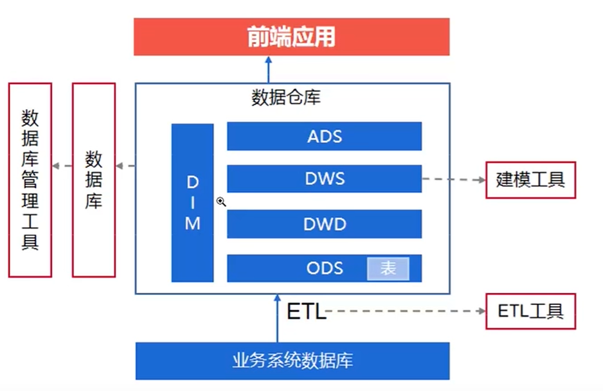
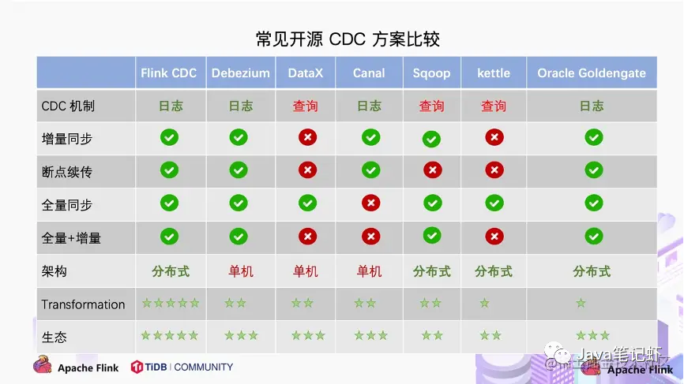

# 大数据相关

## 1.数仓

### 1.1.经典数仓分层架构

1. ODS:operation data store(操作数据存储层)
   - 作为原始数据存储区域，最接近源数据
   - 工作过程：从业务系统抽取数据（包括数据库、日志文件、消息队列等），并通过ETL工具将数据存储到ODS层。
   - 作用：不进行数据的清洗和转换，只执行基本的过滤、去重、去噪和数据标准化等操作，确保数据基本可用。
2. DWD:data warehouse detail(数据仓库明细层)
   - 基于ODS层，对数据进行深度的清洗和转换，形成一致性高的明细事实表。
   - 作用：是将不同系统的数据进行统一整合，形成不同主题的数据。
3. DWS:data warehouse summary(数据仓库汇总层)
   - 基于DWD层数据，生成初步的统计数据。
   - 作用：提升查询效率，降低下游分析的压力。
4. ADS:application data servie(应用数据层)
   - ADS层是面向前端应用或者报表工具提供数据服务的接口层，通常包括高度聚合、易于消费、满足特定分析需求的数据视图。
   - 这一层的数据结一般会根据需求进行优化，便于快速查询，需要支持及时查询、OLAP分析、可视化展示。
5. DIM:dimension(维度层)
    - 记录的是维度数据，包括字典数据、变化慢的数据
    - 维表是多维度分析的基础。例如用户信息、产品信息等。

## 7.Flink

Apache Flink是一个框架和分布式处理引擎，用于对无界和有界数据流进行有状态计算。 Flink被设计在所有常见的集群环境中运行，
以内存执行速度和任意规模来执行计算。 2014年12月，Flink一跃成为Apache软件基金会的顶级项目。

- [Flink从入门到入土（详细教程）](https://www.cnblogs.com/javazhiyin/p/13597319.html)
- [Flink 视频、博客、PPT、入门、原理、实战、性能调优、源码解析博客](http://www.54tianzhisheng.cn/)

## 8.CDC
CDC 的全称是 Change Data Capture ，在广义的概念上，只要是能捕获数据变更的技术，我们都可以称之为 CDC 。目前通常描述的 CDC 技术主要面向数据库的变更，是一种用于捕获数据库中数据变更的技术。

应用场景非常广泛：
- 数据同步，用于备份，容灾
- 数据分发，一个数据源分发给多个下游系统
- 数据采集，面向数据仓库/数据湖的 ETL 数据集成，是非常重要的数据源

### 8.1.CDC技术分类
CDC的技术方案非常多，目前业界主流的实现机制的可以分为两种：
- 基于查询的 CDC
    - 离线调度查询作业，批处理。把一张表同步到其他系统，每次通过查询去获取查询的结果
    - 无法保障数据一致性，查的过程中有可能数据已经发生了多次变更
    - 不保障实时性，基于离线调度有查询延迟
- 基于日志的 CDC
    - 实时消费日志，流处理，例如MYSQL的BINLOG完整记录库里面的变更，可以把BINLOG当作流的数据源
    - 保障数据一致性，因为BINLOG所有的历史明细都可以获得
    - 提供实时数据，因为提供是流式的消费方式，所以实时性有爆炸
  

### 8.2.flink cdc

- [官方文档](https://ververica.github.io/flink-cdc-connectors/master/index.html)
- [flink cdc简介](https://blog.csdn.net/YiRan_Zhao/article/details/126946412)
- [flink cdc的两种开发方式](https://blog.csdn.net/YiRan_Zhao/article/details/126956600)
- [flink cdc常见问题及解决办法](https://blog.csdn.net/YiRan_Zhao/article/details/126957226)
- [flinkcdc相关资料](https://blog.csdn.net/YiRan_Zhao/article/details/125652824)
- [实时抽取 Oracle 数据，排雷和调优实践](https://blog.csdn.net/YiRan_Zhao/article/details/125624407)

Flink CDC 痛点。基于目前版本Flink CDC ，我们通过整理社区的一些反馈，我们可以看到用户普遍有以下痛点：
- 全量+增量同步的过程需要保证所有数据的一致性，因此需要通过加锁保证，但是加锁在数据库层面上是一个十分高危的操作。底层Debezium 在保证数据一致性时，需要对读取的库或表加锁，全局锁可能导致数据库锁住，表级锁会锁住表的读 ，DBA 一般不给锁权限。
- 不支持水平扩展，因为Flink CDC 早期基于Debezium，架构只有1个节点，所以导致了只支持单并发。在全量阶段读取阶段，如果表非常大(亿级别)， 读取时间都在小时级别，对于用户而言，期望能够通过水平资源扩展增加资源去提升作业速度。
- 全量读取阶段不支持 checkpoint：CDC 读取分为两个阶段，全量读取和 增量读取， 目前全量读取阶段是不支持 checkpoint 的，这个就会存在一个问题，当我们同步数据假设需要5个小时，当我们同步了4小时时候作业失败，这时候就需要重新读取数据。

### 8.3.Debezium

[不想引入MQ？不妨试试 Debezium](https://mp.weixin.qq.com/s/X1jTy8g2YD37Vx8ftAmKqA)

### 8.4.Canal

- 官方： [https://github.com/alibaba/canal](https://github.com/alibaba/canal)
- [Canal实战教程](http://xiaoyuge.work/cancel/index.html)

客户端
- Java客户端:[https://github.com/alibaba/canal/wiki/ClientExample](https://github.com/alibaba/canal/wiki/ClientExample)
- PHP客户端：[https://github.com/xingwenge/canal-php](https://github.com/xingwenge/canal-php)
- python客户端：[https://github.com/haozi3156666/canal-python](https://github.com/haozi3156666/canal-python)

原理：官方提供的原理已经比较详细了

注意事项：
- Windows下Mysql5.7开启binlog步骤及注意事项：[https://blog.csdn.net/john1337/article/details/85166575](https://blog.csdn.net/john1337/article/details/85166575)
- 使用kafka/rocketmq：（包括mq顺序性问题）[https://github.com/alibaba/canal/wiki/Canal-Kafka-RocketMQ-QuickStart](https://github.com/alibaba/canal/wiki/Canal-Kafka-RocketMQ-QuickStart)

### 8.5.基于查看的CDC技术

以下为前大数据时代的产物，基础SQL查询，并非基于日志，现在一般不推荐使用。
1. kettle
2. sqoop   
2. yugong,同构/异构数据库迁移工具[https://github.com/alibaba/yugong](https://github.com/alibaba/yugong)
3. dataX,离线数据同步工具 [https://github.com/alibaba/datax](https://github.com/alibaba/datax)

## 9.ETL

ETL，是英文Extract-Transform-Load的缩写，用来描述将数据从来源端经过抽取（extract）、转换（transform）、加载（load）至目的端的过程。ETL一词较常用在数据仓库，但其对象并不限于数据仓库。

ETL是CDC技术的一种最常用的场景。

随着数据由下而上的可以分成以下几类：
- 数据仓库（DW）
- 决策支持系统（DSS）
- 在线分析处理（OLAP）
- 数据挖掘（DM）
- 商业智能（BI）

