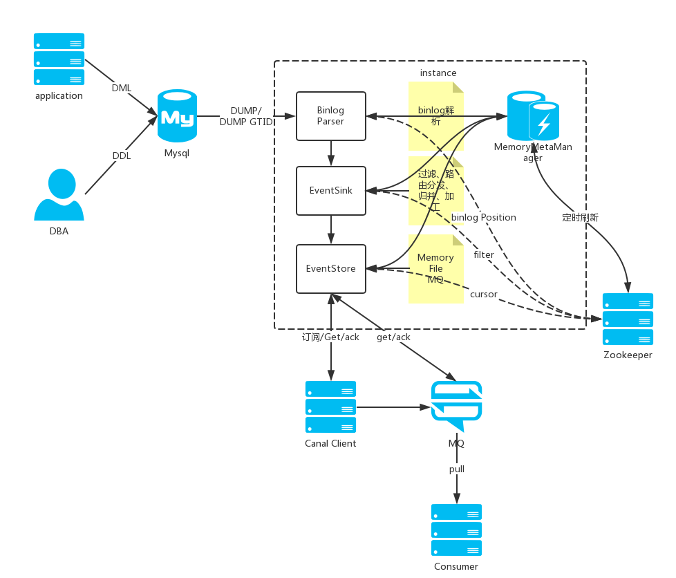

# 大数据相关

## 7.Flink

Apache Flink是一个框架和分布式处理引擎，用于对无界和有界数据流进行有状态计算。 Flink被设计在所有常见的集群环境中运行，
以内存执行速度和任意规模来执行计算。 2014年12月，Flink一跃成为Apache软件基金会的顶级项目。

- [Flink从入门到入土（详细教程）](https://www.cnblogs.com/javazhiyin/p/13597319.html)
- [Flink 视频、博客、PPT、入门、原理、实战、性能调优、源码解析博客](http://www.54tianzhisheng.cn/)

## 8.cdc
CDC 的全称是 Change Data Capture ，在广义的概念上，只要是能捕获数据变更的技术，我们都可以称之为 CDC 。目前通常描述的 CDC 技术主要面向数据库的变更，是一种用于捕获数据库中数据变更的技术。

- [官方文档](https://ververica.github.io/flink-cdc-connectors/master/index.html)

flink cdc笔记
- [flink cdc简介](https://blog.csdn.net/YiRan_Zhao/article/details/126946412)
- [flink cdc的两种开发方式](https://blog.csdn.net/YiRan_Zhao/article/details/126956600)
- [flink cdc常见问题及解决办法](https://blog.csdn.net/YiRan_Zhao/article/details/126957226)
- [flinkcdc相关资料](https://blog.csdn.net/YiRan_Zhao/article/details/125652824)
- [实时抽取 Oracle 数据，排雷和调优实践](https://blog.csdn.net/YiRan_Zhao/article/details/125624407)

## 9.ETL

ETL，是英文Extract-Transform-Load的缩写，用来描述将数据从来源端经过抽取（extract）、转换（transform）、加载（load）至目的端的过程。ETL一词较常用在数据仓库，但其对象并不限于数据仓库。

随着数据由下而上的可以分成以下几类：
- 数据仓库（DW）
- 决策支持系统（DSS）
- 在线分析处理（OLAP）
- 数据挖掘（DM）
- 商业智能（BI）

### 9.1.Canal

官方文档： [https://github.com/alibaba/canal/wiki/%E7%AE%80%E4%BB%8B](https://github.com/alibaba/canal/wiki/%E7%AE%80%E4%BB%8B)

#### 9.1.1.单机版安装教程

[https://github.com/alibaba/canal/wiki/QuickStart](https://github.com/alibaba/canal/wiki/QuickStart)

#### 9.1.2.客户端

Java客户端官方案例，功能非常简单

[https://github.com/alibaba/canal/wiki/ClientExample](https://github.com/alibaba/canal/wiki/ClientExample)

其他平台的客户端，提供了些实用的功能，包括实现原理等，可做参考

[https://github.com/xingwenge/canal-php](https://github.com/xingwenge/canal-php)

[https://github.com/haozi3156666/canal-python](https://github.com/haozi3156666/canal-python)

#### 9.1.3.原理

官方提供的原理已经比较详细了

#### 9.1.4.注意

Windows下Mysql5.7开启binlog步骤及注意事项

[https://blog.csdn.net/john1337/article/details/85166575](https://blog.csdn.net/john1337/article/details/85166575)

使用kafka/rocketmq：（包括mq顺序性问题）

[https://github.com/alibaba/canal/wiki/Canal-Kafka-RocketMQ-QuickStart](https://github.com/alibaba/canal/wiki/Canal-Kafka-RocketMQ-QuickStart)

### 9.2.其他ETL工具

1. otter, 本地/异地机房的数据同步，基于canal [https://github.com/alibaba/otter](https://github.com/alibaba/otter)
2. yugong,同构/异构数据库迁移工具[https://github.com/alibaba/yugong](https://github.com/alibaba/yugong)
3. dataX,离线数据同步工具 [https://github.com/alibaba/datax](https://github.com/alibaba/datax)

