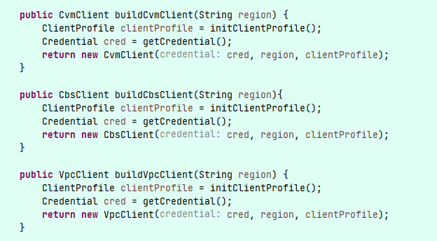
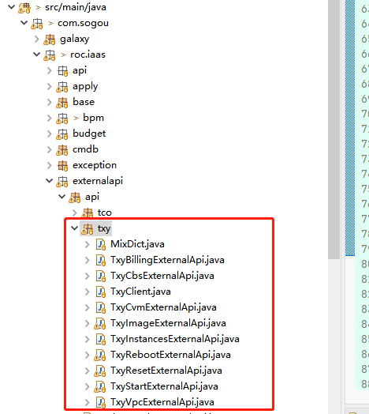
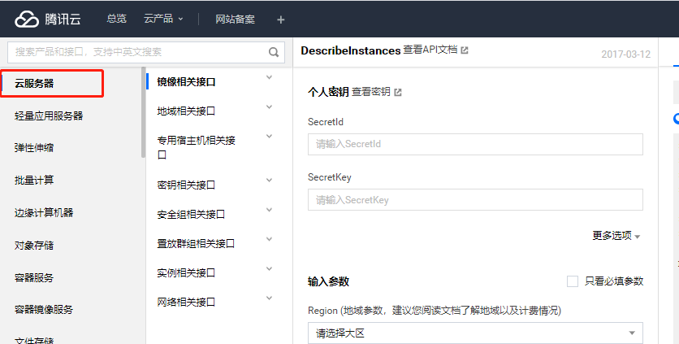
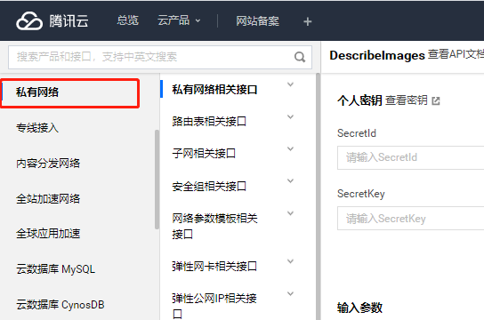
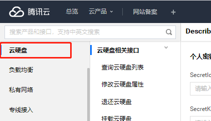

# 腾讯云对接方案

## 1. 腾讯云账号管理

腾讯云账号可以分为主账号和子账号。

目前iaas prd和test环境使用的都是子账号。

在使用腾讯云接口的时候需要进行安全认证，我们将认证的数据保存在表中：
IDC_MIX_ACCOUNT_INFO

目前iaas只支持单一账号的使用。多个账号无法正常使用。

## 2.iaas 

### 2.1.腾讯云SDK

iaas调用腾讯云接口，使用的是腾讯云提供的sdk。

sdk文档中心： [https://cloud.tencent.com/document/sdk/Java](https://cloud.tencent.com/document/sdk/Java)

使用的本版问最新的： com.tencentcloudapi:tencentcloud-sdk-java:3.1.125

### 2.2.腾讯云接口文档

腾讯云接口文档地址：

[https://console.cloud.tencent.com/api/explorer?Product=cvm&Version=2017-03-12&Action=DescribeInstances&SignVersion=](https://console.cloud.tencent.com/api/explorer?Product=cvm&Version=2017-03-12&Action=DescribeInstances&SignVersion=)

文档中心

[https://cloud.tencent.com/document/product](https://cloud.tencent.com/document/product)

### 2.3.iaas调用

iaas对SDK调用腾讯云的接口进行了简单的封装。

客户端代码位置： com.zx.roc.iaas.externalapi.api.txy.TxyClient

当前iaas主要操作腾讯云的资源是cvm（云服务器）、cbs（云硬盘）、vpc（私有网络）。

TxyClient将其封装为三个客户端方法。

### 2.4.iaas代码位置

调用腾讯云接口的代码统一放置在com.zx.roc.iaas.externalapi.api.txy
下面：

## 3.腾讯云接口 

### 3.1.CVM（云服务器）

iaas常用的cvm接口

- 云虚机/云实机申请：

    iaas的功能入口：MixVpsProccessController 和
    MixMachineProccessController

【腾讯云接口】创建实例询价：

[https://console.cloud.tencent.com/api/explorer?Product=cvm&Version=2017-03-12&Action=InquiryPriceRunInstances&Si](https://console.cloud.tencent.com/api/explorer?Product=cvm&Version=2017-03-12&Action=InquiryPriceRunInstances&Si)【腾讯云接口】*gnVersion=*

创建实例：

[https://console.cloud.tencent.com/api/explorer?Product=cvm&Version=2017-03-12&Action=RunInstances&SignVersion=](https://console.cloud.tencent.com/api/explorer?Product=cvm&Version=2017-03-12&Action=RunInstances&SignVersion=)

- 重启

    iaas的功能入口：MixRebootProcessController

    【腾讯云接口】重启实例

    [https://console.cloud.tencent.com/api/explorer?Product=cvm&Version=2017-03-12&Action=RebootInstances&SignVersion=](https://console.cloud.tencent.com/api/explorer?Product=cvm&Version=2017-03-12&Action=RebootInstances&SignVersion=)

- 重装

    iaas的功能入口：MixResetProcessController

    【腾讯云接口】重装实例

    [https://console.cloud.tencent.com/api/explorer?Product=cvm&Version=2017-03-12&Action=ResetInstance&SignVersion=](https://console.cloud.tencent.com/api/explorer?Product=cvm&Version=2017-03-12&Action=ResetInstance&SignVersion=)

- 启动

    iaas的功能入口：MixInstanceProcessController.start()

- 【腾讯云接口】启动实例

    [https://console.cloud.tencent.com/api/explorer?Product=cvm&Version=2017-03-12&Action=StartInstances&SignVersion=](https://console.cloud.tencent.com/api/explorer?Product=cvm&Version=2017-03-12&Action=StartInstances&SignVersion=)

- 关闭

    iaas的功能入口：MixInstanceProcessController.stop()

    【腾讯云接口】关闭实例

    [https://console.cloud.tencent.com/api/explorer?Product=cvm&Version=2017-03-12&Action=StopInstances&SignVersion=](https://console.cloud.tencent.com/api/explorer?Product=cvm&Version=2017-03-12&Action=StopInstances&SignVersion=)

- 下线

    iaas的功能入口：MixInstanceTerminateApplyController

    【腾讯云接口】退换实例

    [https://console.cloud.tencent.com/api/explorer?Product=cvm&Version=2017-03-12&Action=TerminateInstances&SignVersion=](https://console.cloud.tencent.com/api/explorer?Product=cvm&Version=2017-03-12&Action=TerminateInstances&SignVersion=)

- nat

    iaas的功能入口：MixNetResourceApiController

    nat只是设置好的一个安全组。绑定到云服务器上为开启，解绑为关闭

    【腾讯云接口】绑定安全组：

    [https://console.cloud.tencent.com/api/explorer?Product=cvm&Version=2017-03-12&Action=AssociateSecurityGroups&SignVersion=](https://console.cloud.tencent.com/api/explorer?Product=cvm&Version=2017-03-12&Action=AssociateSecurityGroups&SignVersion=)

    【腾讯云接口】解绑安全组：

    [https://console.cloud.tencent.com/api/explorer?Product=cvm&Version=2017-03-12&Action=DisassociateSecurityGroups&SignVersion=](https://console.cloud.tencent.com/api/explorer?Product=cvm&Version=2017-03-12&Action=DisassociateSecurityGroups&SignVersion=)

- 云虚机复制

    iaas的功能入口：MixVpsCopyController

    将腾讯云的2个接口结合在一起组成的功能。

    第一个是【腾讯云接口】创建镜像：

    [https://console.cloud.tencent.com/api/explorer?Product=cvm&Version=2017-03-12&Action=CreateImage&SignVersion=](https://console.cloud.tencent.com/api/explorer?Product=cvm&Version=2017-03-12&Action=CreateImage&SignVersion=)

第二个是选择这个新的镜像创建云虚机。【腾讯云接口】《创建实例》

- 调整套餐

    iaas的功能入口：MixResourceChangeApplyProcessController

    【腾讯云接口】调整实例配置：

    [https://console.cloud.tencent.com/api/explorer?Product=cvm&Version=2017-03-12&Action=ResetInstancesType&SignVersion=](https://console.cloud.tencent.com/api/explorer?Product=cvm&Version=2017-03-12&Action=ResetInstancesType&SignVersion=)

- 数据盘扩展

    iaas的功能入口：MixResourceChangeApplyProcessController

    【腾讯云接口】扩容实例磁盘：

    [https://console.cloud.tencent.com/api/explorer?Product=cvm&Version=2017-03-12&Action=ResizeInstanceDisks&SignVersion=](https://console.cloud.tencent.com/api/explorer?Product=cvm&Version=2017-03-12&Action=ResizeInstanceDisks&SignVersion=)

### 3.2.VPC（私有网络）

【腾讯云接口】查询vpc列表

[https://console.cloud.tencent.com/api/explorer?Product=vpc&Version=2017-03-12&Action=DescribeVpcs&SignVersion=](https://console.cloud.tencent.com/api/explorer?Product=vpc&Version=2017-03-12&Action=DescribeVpcs&SignVersion=)

【腾讯云接口】查询子网列表

[https://console.cloud.tencent.com/api/explorer?Product=vpc&Version=2017-03-12&Action=DescribeSubnets&SignVersion=](https://console.cloud.tencent.com/api/explorer?Product=vpc&Version=2017-03-12&Action=DescribeSubnets&SignVersion=)

【腾讯云接口】查询安全组

[https://console.cloud.tencent.com/api/explorer?Product=vpc&Version=2017-03-12&Action=DescribeSecurityGroups&SignVersion=](https://console.cloud.tencent.com/api/explorer?Product=vpc&Version=2017-03-12&Action=DescribeSecurityGroups&SignVersion=)

【腾讯云接口】查询安全组规则

[https://console.cloud.tencent.com/api/explorer?Product=vpc&Version=2017-03-12&Action=DescribeSecurityGroupPolicies&SignVersion=](https://console.cloud.tencent.com/api/explorer?Product=vpc&Version=2017-03-12&Action=DescribeSecurityGroupPolicies&SignVersion=)

### 3.3.CBS（云硬盘）

## 4.定时任务

定时任务URL入口：MixInstanceSyncController

### 4.1.同步实例

- MixInstanceSyncService

- 功能：同步云服务器下线状态，更新基础数据，保存新增实例，保存新增状态，保存新增磁盘

- 频次：10分钟/次

- 【腾讯云接口】查询实例列表：

[https://console.cloud.tencent.com/api/explorer?Product=cvm&Version=2017-03-12&Action=DescribeInstances&SignVersion=](https://console.cloud.tencent.com/api/explorer?Product=cvm&Version=2017-03-12&Action=DescribeInstances&SignVersion=)

### 4.2.同步状态

- MixStatusMonitorService.

- 功能：同步云服务器状态（不同步云服务器正在操作中的状态）

- 频次：10秒/次

- 【腾讯云接口】查询实例列表：

[https://console.cloud.tencent.com/api/explorer?Product=cvm&Version=2017-03-12&Action=DescribeInstances&SignVersion=](https://console.cloud.tencent.com/api/explorer?Product=cvm&Version=2017-03-12&Action=DescribeInstances&SignVersion=)

### 4.3.同步套餐

- MixPackageSyncService.

- 功能：同步腾讯云套餐。IDC_MIX_PACKAGE_TYPE 和 IDC_MIX_PACKAGE。

    注意：我们在使用套餐的时候，都是从表中获得 STATUS = normal and
    SELL_STATUS=SELL（正常，可购买）

- 频次：5分钟/次

- 套餐：

【腾讯云接口】查询所支持的实例机型族信息（大类型，例如计算型C3）

[https://console.cloud.tencent.com/api/explorer?Product=cvm&Version=2017-03-12&Action=DescribeInstanceFamilyConfigs&SignVersion=](https://console.cloud.tencent.com/api/explorer?Product=cvm&Version=2017-03-12&Action=DescribeInstanceFamilyConfigs&SignVersion=)

【腾讯云接口】获取可用区机型配置信息：（小类型，例如计算型C3.SN1）

[https://console.cloud.tencent.com/api/explorer?Product=cvm&Version=2017-03-12&Action=DescribeZoneInstanceConfigInfos&SignVersion=](https://console.cloud.tencent.com/api/explorer?Product=cvm&Version=2017-03-12&Action=DescribeZoneInstanceConfigInfos&SignVersion=)

### 4.4.同步镜像

- MixImageSyncService.

- 功能：同步腾讯云镜像，同步镜像的创建结果

- 频次：1分钟/次

- 【腾讯云接口】查看镜像列表

    [https://console.cloud.tencent.com/api/explorer?Product=cvm&Version=2017-03-12&Action=DescribeImages&SignVersion=](https://console.cloud.tencent.com/api/explorer?Product=cvm&Version=2017-03-12&Action=DescribeImages&SignVersion=)

## 5.云虚机/云实机申请

云虚机、云实机申请流程

iaas功能入口： MixVpsProccessController 和 MixMachineProccessController

[https://www.processon.com/view/link/5f2a8026e0b34d5afd5f07e4](https://www.processon.com/view/link/5f2a8026e0b34d5afd5f07e4)

## 6.云虚机复制

云实机由于腾讯云的限制，用户自定义的镜像无法正常启动。所有只有云虚机可以进行实例的复制
