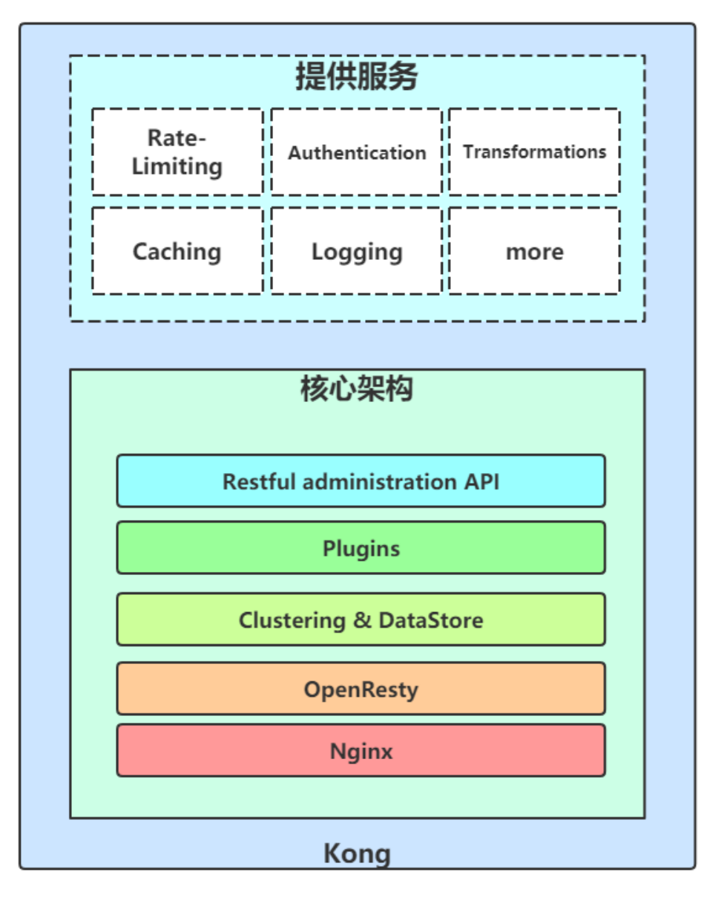
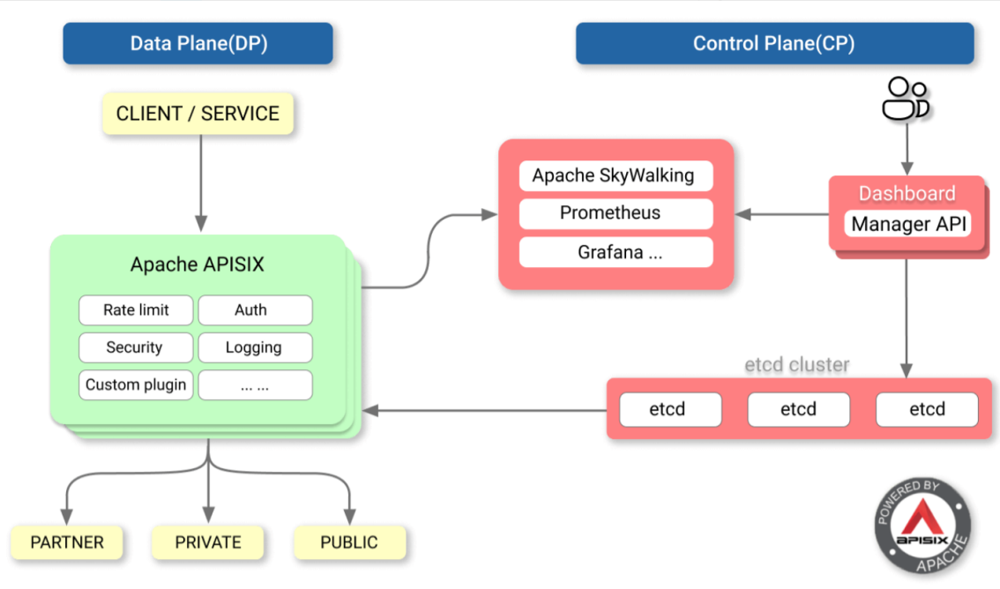

# Nginx
- 官网：[http://nginx.org/](http://nginx.org/)
- 中文网：[http://nginx.p2hp.com/](http://nginx.p2hp.com/)
- **使用手册** [https://www.w3cschool.cn/nginxsysc/](https://www.w3cschool.cn/nginxsysc/)  
- **入门指南**：[https://www.w3cschool.cn/nginx/](https://www.w3cschool.cn/nginx/)
- 博客：[https://blog.51cto.com/liangey/category5.html](https://blog.51cto.com/liangey/category5.html)
- 可视化配置:[https://www.digitalocean.com/community/tools/nginx?global.app.lang=zhCN](https://www.digitalocean.com/community/tools/nginx?global.app.lang=zhCN)

## 1.Nginx介绍

### 1.1.Nginx

1. Nginx ("engine x") 是一个高性能的HTTP和反向代理服务器，也是一个IMAP/POP3/SMTP 代理服务器；
2. 第一个公开版本0.1.0发布于2004年10月4日；
3. 其将源代码以类BSD许可证的形式发布，因它的稳定性、丰富的功能集、示例配置文件和低系统资源的消耗而闻名；
4. 官方测试nginx能够支支撑5万并发链接，并且cpu、内存等资源消耗却非常低，运行非常稳定。
5. Nginx的进程是一个主进程（master），一个或多个工作进程（worker）。主进程负责调度工作进程、加载配置、启动工作进程及配置热更新，子进程负载处理请求

一个2C44的虚拟机，一般可以支持2W左右的并发。可以代理多个小型网站。


#### 1.1.1.互联网公司的api网关

- [支持 10 亿日流量的基础设施：当 Apache APISIX 遇上腾讯](https://apisix.apache.org/zh/blog/2021/05/24/tencent-games/)
- 京东主站网关：采用的方案是网关层：openresty + lua，后端管理是： java + zookeeper。每日百亿级流量。

#### 1.1.2.Nginx和Apache的优缺点

1. nginx相对于apache的优点：
    - 轻量级，比apache占用更少的内存及资源；
    - 高并发，nginx 处理请求是异步非阻塞的，而apache 则是阻塞型的，在高并发下nginx能保持低资源低消耗高性能；
    - 高度模块化的设计，编写模块相对简单；
    - 社区活跃，各种高性能模块出品迅速啊
2. apache 相对于nginx 的优点：
    - nginx只适合静态和反向，Apache可以处理动态请求
    - rewrite，比nginx 的rewrite 强大；
    - 模块超多，基本想到的都可以找到（Tomcat是Apache的一个插件）；
    - 少bug ，nginx的bug相对较多；
3. Nginx 配置简洁, Apache 复杂；
4. 最核心的区别在于apache是同步多进程模型，一个连接对应一个进程；nginx是异步的，多个连接（万级别）可以对应一个进程。

#### 1.1.3.大型网站系统架构


### 1.2.Tengine

Tengine是nginx的加强版，封装版，淘宝开源

1. 官网:[http://tengine.taobao.org/](http://tengine.taobao.org/)
2. 动态模块加载（DSO）支持。加入一个模块不再需要重新编译整个Tengine；
3. 支持SO_REUSEPORT选项，建连性能提升为官方nginx的三倍；
4. 支持SPDY v3协议，自动检测同一端口的SPDY请求和HTTP请求；
5. 流式上传到HTTP后端服务器或FastCGI服务器，大量减少机器的I/O压力；
6. 更加强大的负载均衡能力，包括一致性hash模块、会话保持模块，还可以对后端的服务器进行主动健康检查，根据服务器状态自动上线下线，以及动态解析upstream中出现的域名；
7. 输入过滤器机制支持。通过使用这种机制Web应用防火墙的编写更为方便；
8. 支持设置proxy、memcached、fastcgi、scgi、uwsgi在后端失败时的重试次数
9. 动态脚本语言Lua支持。扩展功能非常高效简单；
10. 支持管道（pipe）和syslog（本地和远端）形式的日志以及日志抽样；
11. 支持按指定关键字(域名，url等)收集Tengine运行状态；
12. 组合多个CSS、JavaScript文件的访问请求变成一个请求；
13. 自动去除空白字符和注释从而减小页面的体积。

### 1.3.OpenResty

- 官网[http://openresty.org/cn/](http://openresty.org/cn/)
- 代码[https://github.com/openresty/](https://github.com/openresty/)

Nginx 是俄罗斯人发明的， Lua 是巴西几个教授发明的，中国人章亦春把 LuaJIT VM 嵌入到 Nginx 中，实现了 OpenResty 这个高性能服务端解决方案。
OpenResty是一个流量网关,根据前面对流量网关的介绍就可以知道流量网关的指责。通过 OpenResty，你可以把 nginx 的各种功能进行自由拼接， 更重要的是，开发门槛并不高，这一切都是用强大轻巧的 Lua 语言来操控。

OpenResty基于 Nginx 与 Lua 的高性能 Web 平台，其内部集成了大量精良的 Lua 库、第三方模块以及大多数的依赖项。用于方便地搭建能够处理超高并发、扩展性极高的动态 Web 应用、Web 服务和动态网关。
通过揉和众多设计良好的 Nginx 模块，OpenResty 有效地把 Nginx 服务器转变为一个强大的 Web 应用服务器，基于它开发人员可以使用 Lua 编程语言对 Nginx 核心以及现有的各种 Nginx C 模块进行脚本编程，构建出可以处理一万以上并发请求的极端高性能的 Web 应用
OpenResty 最早是顺应 OpenAPI 的潮流做的，所以 Open 取自“开放”之意，而Resty便是 REST 风格的意思。虽然后来也可以基于 ngx_openresty 实现任何形式的 web service 或者传统的 web 应用。
也就是说 Nginx 不再是一个简单的静态网页服务器，也不再是一个简单的反向代理了。第二代的 openresty 致力于通过一系列 nginx 模块，把nginx扩展为全功能的 web 应用服务器。

ngx_openresty 是用户驱动的项目，后来也有不少国内用户的参与，从 http://openresty.org 的点击量分布上看，国内和国外的点击量基本持平。

ngx_openresty 目前有两大应用目标：
1. 通用目的的 web 应用服务器。在这个目标下，现有的 web 应用技术都可以算是和 OpenResty 或多或少有些类似，比如 Nodejs, PHP 等等。ngx_openresty 的性能（包括内存使用和 CPU 效率）算是最大的卖点之一。
2. Nginx 的脚本扩展编程，用于构建灵活的 Web 应用网关和 Web 应用防火墙。有些类似的是 NetScaler。其优势在于 Lua 编程带来的巨大灵活性。


<p style="color:red;">1、请问 OpenResty 的定位是什么，从分享来看似乎全栈了？</p>
定位主要是高性能，所有的新功能和优化，都是针对性能的。 但是也有人拿来做页面，比如京东；也有人拿来替代 PHP 做 Web server，比如新浪。 
我觉得它越来越像一个独立的开发语言。

<p style="color:red;">2、请问 Lua 是不是可以实现动态配置 location？比如动态切流量？</p>
balancer_by_lua 可能是你需要的，你可以用 Lua 来定义自己的负载均衡器，可以在每个请求的级别上去定义，当前访问的后端的节点地址、端口，
还可以定制很细力度的访问失败之后的重试策略。

<p style="color:red;">3、OpenResty 是可以拿到 nginx 请求里面的所有信息？那是不是可以做一些更复杂的转发操作？能介绍一下 OpenResty 在 cdn 里面的应用场景吗？</p>
可以看下 iresty.com 的分享，又拍的张聪非常详细的介绍了 OpenResty 在又拍 CDN 的使用。

<p style="color:red;">4、OpenResty 是否修改了 nginx 的源码，还是和 nginx 完全可剥离开的？Nginx 版本升级，OpenResty 也跟着升级吗？例如 nginx 修复漏洞 bug 等情况。</p>
OpenResty 不修改 nginx 的源码，可以跟随 nginx 无痛升级。 如果你觉得 OpenResty 升级慢了， 你可以只拿 ngx_lua 出来，
当做 nginx 的一个模块来编译。实际上，OpenResty 在测试过程中，发现了很多 nginx 自身的 bug 。

<p style="color:red;">5、软 WAF nginx + Lua 是主流和未来方向么？</p>
我觉得 WAF 应该基于 nginx，不管是性能还是流行程度。而 OpenResty 具有更灵活操控 nginx 的能力，所以我觉得 OpenResty 在
WAF 领域非常合适。cloudflare 的 WAF 就是基于 OpenResty。

<p style="color:red;">6、看样子未来可能有各种 ngx_xx，最有可能的是 js，不知道这方面有什么前沿的动向？</p>
我们组在尝试把 PHP 嵌入到 nginx 中，当然性能肯定不如 LuaJIT，但是会方便很多 PHP 同学，有进展的话，我们会开源出来

<p style="color:red;">7、OpenResty 目前看似乎是一个 proxy 的配置框架（糅合了 nginx + Lua），但以后的发展是什么样子？会不会以后更进一步，比如做一个 API gateway 之类的。</p>
OpenResty其实是希望大家忽略 nginx 的存在，直接使用 ngx_lua 提供的 API 实现自己的业务逻辑。更像一门独立的开发语言，
只不过底层使用 nginx 的网络库而已。你可以按照你的想法搭建任何好玩的服务端应用出来。

### 1.4.Kong

- 官网[https://konghq.com/](https://konghq.com/)
- 代码[https://github.com/Kong/](https://github.com/Kong/)

#### 1.4.1.介绍
Kong基于OpenResty开发，也是流量层网关, 是一个云原生、快速、可扩展、分布式的API 网关。继承了OpenResty的高性能、易扩展性等特点。Kong通过简单的增加机器节点，可以很容易的水平扩展。同时功能插件化，可通过插件来扩展其能力。而且在任何基础架构上都可以运行。具有以下特性：
- 提供了多样化的认证层来保护API。
- 可对出入流量进行管制。
- 提供了可视化的流量检查、监视分析API。
- 能够及时的转换请求和相应。
- 提供log解决方案
- 可通过API调用Serverless 函数。

#### 1.4.2.Kong解决了什么问题
当我们决定对应用进行微服务改造时，应用客户端如何与微服务交互的问题也随之而来，毕竟服务数量的增加会直接导致部署授权、负载均衡、通信管理、分析和改变的难度增加。
面对以上问题，API GATEWAY是一个不错的解决方案，其所提供的访问限制、安全、流量控制、分析监控、日志、请求转发、合成和协议转换功能，可以解放开发者去把精力集中在具体逻辑的代码，而不是把时间花费在考虑如何解决应用和其他微服务链接的问题上。
图片来自Kong官网:


可以看到Kong解决的问题。专注于全局的API管理策略，全局流量监控、日志记录、全局限流、黑白名单控制、接入请求到业务系统的负载均衡等。

#### 1.4.3.Kong的优点以及性能
在众多 API GATEWAY 框架中，Mashape 开源的高性能高可用API网关和API服务管理层——KONG（基于 NGINX+Lua）特点尤为突出，
它可以通过插件扩展已有功能，这些插件（使用 lua 编写）在API请求响应循环的生命周期中被执行。
于此同时，KONG本身提供包括 HTTP 基本认证、密钥认证、CORS、TCP、UDP、文件日志、API请求限流、请求转发及 NGINX 监控等基本功能。
目前，Kong 在 Mashape 管理了超过 15,000 个 API，为 200,000 开发者提供了每月数十亿的请求支持。


#### 1.4.4.Kong架构
Kong提供一些列的服务,这就不得不谈谈内部的架构:


首先最底层是基于Nginx, Nginx是高性能的基础层, 一个良好的负载均衡、反向代理器,然后在此基础上增加Lua脚本库,形成了OpenResty,拦截请求, 响应生命周期,可以通过Lua编写脚本,所以插件比较丰富。
关于Kong的一些插件库以及如何配置,可以参考简书 [开源API网关系统（Kong教程）入门到精通](https://www.jianshu.com/p/a68e45bcadb6)

### 1.6.Apisix【行业新星】

官网：https://apisix.apache.org/                  开源协议：Apache2.0 可以使用
apisix是Apache开源的且已经“毕业”，满足常规的商业网关的功能需求。
apisix是一款云原生微服务API网关，可以为API提供终极性能、安全性、开源和可扩展的平台。apisix基于OpenResty和etcd实现，与传统API网关相比，apisix具有动态路由和插件热加载，特别适合微服务系统下的API管理。
支持的功能：
- 客户端的api管理，配置变更热更新
- 动态负载均衡：跨多个上游服务的动态负载均衡，目前已支持 round-robin 轮询和一致性哈希算法。
- 身份验证：支持 key-auth、JWT、basic-auth、wolf-rbac 等多种认证方式。
- 限流限速：可以基于速率、请求数、并发等维度限制。
- APISIX 还支持 A/B 测试、金丝雀发布(灰度发布)、蓝绿部署、监控报警、服务可观测性、服务治理等等高级功能，这在作为微服务 API 网关非常重要的特性。
- 与Apache SkyWalking等监控体系完美兼容。



### 1.7.An Aggregation API Gateway

- 开源地址：https://github.com/fizzgate/fizz-gateway-community
- 官网：https://www.fizzgate.com
- 开源协议：GNU v3。个人非商业免费

An Aggregation API Gateway in Java . Fizz Gateway 是一个基于 Java开发的微服务聚合网关，是拥有自主知识产权的应用网关国产化替代方案，
能够实现热服务编排聚合、自动授权选择、线上服务脚本编码、在线测试、高性能路由、API审核管理、回调管理等目的，拥有强大的自定义插件系统可以自行扩展，
并且提供友好的图形化配置界面，能够快速帮助企业进行API服务治理、减少中间层胶水代码以及降低编码投入、提高 API 服务的稳定性和安全性。
目前是已知开源的方案中，功能最多最全的，但是商业不免费，可以借鉴其设计思路，完善自身网关的功能。

演示环境（Demo）：http://demo.fizzgate.com/ 账号/密码:admin/Aa123!

### 1.8.BFE（Baidu Front End）

BFE（Baidu Front End）是百度的一款开源的应用负载均衡产品，目前已接入百度大部分流量，每日转发请求接近1万亿，峰值QPS超过1000万。
在2019年百度春晚红包活动中，BFE平台在超大用户压力、数次流量波峰下平稳运行，保证了春晚红包活动的顺利进行。

- 网地址：https://www.bfe-networks.net，github 
- 地址：https://github.com/baidu/bfe。

## 2.Nginx安装

```text
1.安装Nginx依赖包
   yum install -y pcre pcre-devel
   yum install -y openssl openssl-devel

ubuntu可能需要以下：
   安装gcc g++的依赖库
   sudo apt-get install build-essential
   sudo apt-get install libtool
   
   安装pcre依赖库（http://www.pcre.org/）
   sudo apt-get update
   sudo apt-get install libpcre3 libpcre3-dev
   
   安装zlib依赖库（http://www.zlib.net）
   sudo apt-get install zlib1g-dev
   
   安装SSL依赖库（16.04默认已经安装了）
   sudo apt-get install openssl

2.下载源码，并解压
   wget http://nginx.org/download/nginx-1.22.0.tar.gz
   tar zxvf nginx-1.22.0.tar.gz

3.进入到解压文件下
  cd nginx-1.22.0

4.配置安装位置，（注意/usr/local/nginx是安装位置，不能使用源码的位置安装，否则一定安装失败）
  ./configure --prefix=/usr/local/nginx
  
  配置成功之后，会返回配置信息。我们可以记下来
  Configuration summary
      + using system PCRE library
      + using system OpenSSL library
      + using system zlib library
      
      nginx path prefix: "/usr/local/nginx"
      nginx binary file: "/usr/local/nginx/sbin/nginx"
      nginx modules path: "/usr/local/nginx/modules"
      nginx configuration prefix: "/usr/local/nginx/conf"
      nginx configuration file: "/usr/local/nginx/conf/nginx.conf"
      nginx pid file: "/usr/local/nginx/logs/nginx.pid"
      nginx error log file: "/usr/local/nginx/logs/error.log"
      nginx http access log file: "/usr/local/nginx/logs/access.log"
      nginx http client request body temporary files: "client_body_temp"
      nginx http proxy temporary files: "proxy_temp"
      nginx http fastcgi temporary files: "fastcgi_temp"
      nginx http uwsgi temporary files: "uwsgi_temp"
      nginx http scgi temporary files: "scgi_temp"

5.配置
   编译工程：make
   安装：make install

6.命令
   nginx [-?hvVtq] [-s][-p][-c][-g]
   -V : 显示版本和配置选项信息
   -t : 检测配置文件是否有语法错误
   -q : 在检测配置文件期间屏蔽非错误信息
   -s reload|reopen|stop|quit 重新加载配置|重启日志文件|停止|退出
   -p : 设置前缀路径
   -c : 设置配置文件
   -g : 设置配置文件外的全局指令
   
   测试启动：./nginx -t
   正式启动：./nginx
     
   重启：        ./nginx -s reload
   重新加载配置文件：        ./nginx -s reopen
   快速停止：              ./nginx -s stop		
   有序停止（等待任务完成）： ./nginx -s quit  	
   版本：                 ./nginx -v
   已安装模块：            ./nginx -V
   已安装模块（格式化）：    ./nginx -V 2>&1 | sed "s/\s\+--/\n --/g"

7.检查
   ps -ef |grep nginx
   netstat -antup |grep 80
   
* windos使用【尽量不要使用nginx，没有什么研究的意义，没办法添加模块和重新编译】：
    start nginx 或者双击 nginx.exe，控制台没啥日志
    nginx.exe -s stop
    nginx.exe -s reload
    taskkill /f /t /im nginx.exe    kill进程
```


安装时可选的参数

```shell
./configure 
   --prefix="安装路径" --user=安装用户 --group=安装用户组
   # 1.执行文件、配置文件、日志、进程等位置。正常默认就行，不用设置
   --sbin-path=/usr/sbin/nginx 
   --conf-path=/etc/nginx/nginx.conf 
   --error-log-path=/var/log/nginx/error.log 
   --http-log-path=/var/log/nginx/access.log 
   --pid-path=/var/run/nginx/nginx.pid 
   --lock-path=/var/lock/nginx.lock 
   # 2.【开启】内置的模块
   --with-http_ssl_module           # 仅支持https请求,需已经安装openssl 
   --with-http_stub_status_module   # 获取nginx自上次启动以来的工作状态
   --with-http_sub_module           # 允许用一些其他文本替换nginx响应中的一些文本
   --with-http_gzip_static_module   # 在线实时压缩输出数据流
   --with-file-aio                  # 使用nginx的aio特性会大大提高性能。如果有大量的IO，有助于并发处理大量的IO和提高Nginx处理效率
   --with-threads                   # 多线程模块
   --with-http_addition_module      # 在响应之前或者响应之后追加文本内容，比如想在站点底部追加一个js或者css,可以使用这个模块来实现。
   --with-http_auth_request_module  # 认证模块
   --with-http_dav_modeule          # 使应用程可直接对webserver直接读写，并支持文件锁定及解锁，还支持文件的版本控制。启用对WebDav协议支持。
   --with-http_flv_module           # Nginx增加MP4，FLV视频支持模块
   --with-http_mp4_module           # 多媒体模块
   --with-http_gunzip_module        # 压缩模块
   --with-http_random_index_module  # Nginx显示随机首页模块，对隐藏文件不起作用。
   --with-http_realip_module        # Nginx获取真实IP模块
   --with-http_secure_link_module   # Nginx安全下载模块
   --with-http_sice_module          # Nginx中文文档
   --with-mail                      # 启用POP3/IMAP4/SMTP代理模块支持
   --with-mail_ssl_module           # 启用ngx_mail_ssl_module支持
   --with-http_v2_module            # 开启http 2.0
   --with-stream                    # 4层负载支持。ngx1.9之后的stream模块
   --with-stream_realip_module  
   --with-stream_ssl_module 
   --with-stream_ssl_preread_modul 
   
   ## 3.【关闭内置模块】
   --without-select_module
   --without-poll_module          # 一般用epoll模式了，很少用这两个了吧？
   --without-dso                  # 关闭动态加载模块的功能，这是tengine特有的功能
   --without-http_charset_module  # 定义文件编码格式，不是非常明白，MS可关闭
   --without-http_gzip_module     # 这个web服务器基本上都要的，对css,js等gzip压缩用
   --without-http_ssl_module      # 要建ssl站点吗？一般不需要吧。
   --without-http_userid_module   # 在无法使用cookies的地方实现用户标识,用于链接中自动增加sessionID等，MS可关闭
   --without-http_footer_filter_module  # 在请求的响应末尾输出一段内容。输出内容可配置，并支持内嵌变量。这是tengine特有的功能
   --without-http_trim_filter_module    # 该模块用于删除 html ， 内嵌 javascript 和 css 中的注释以及重复的空白符。这是tengine特有的功能
   --without-http_access_module         # 访问控制模块，一般需要
   --without-http_auth_basic_module     # 一种简单的验证用户的方式
   --without-http_geo_module            # 据说是根据来访IP判断用户访问，可实现类似智能解析的功能，一般不需要
   --without-http_map_module            # 据说是条件赋值模块,用于复杂条件的判断, 可关闭
   --without-http_split_clients_module  # Splits clients based on some conditions
   --without-http_referer_module        # 来源referer，一般都需要
   --without-http_rewrite_module        # 重写rewrite，一般都需要
   --without-http_proxy_module          # 代理服务，其实一般也不需要
   --without-http_memcached_module      # memcached缓存模块, 通常用于服务器间共享数据, 方便但据说效率不高，一般不需要
   --without-http_limit_conn_module     # 限制连接数
   --without-http_limit_req_module      # 限制请求数等
   --without-http_empty_gif_module      # 强制返回一个在内存中的1*1的空GIF图, 通常用于访问统计/日志记录等, 可关闭
   --without-http_browser_module        # 根据访问者浏览器进行基本判断, 可关闭
   --without-http_upstream              # 对upstream进行一些控制
   --without-http_user_agent_module     # 根据user_agent做些判断，一般不需要
   --without-http_stub_status_module    # 获取Nginx自上次启动以来的工作状态，对于监控web请求数据有点作用
   --without-http                       # 关闭 HTTP server
   --without-http-cache                 # 关闭 HTTP cache
   --without-http_fastcgi_module        # 一般用来运行php，一般都需要。默认开启
   # 常用关闭的模块
   --without-http_uwsgi_module          # uWSGI protocol支持，一般不需要
   --without-http_scgi_module           # SCGI  protocol支持，一般不需要
   --without-mail_pop3_module           # 关闭 ngx_mail_pop3_module
   --without-mail_imap_module           # 关闭 ngx_mail_imap_module
   --without-mail_smtp_module           # 关闭 ngx_mail_smtp_module 
   --without-http_autoindex_module      # 目录下没默认文件时，会把这个目录下的文件都列出，一般不需要
   --without-http_ssi_module            # 简单说允许html可以包含文件，一般来说也不用
   --without-pcre                       # pcre支持，一般不需要
   
   # 3.缓存的目录，一般不要设置
   --http-client-body-temp-path=/var/tmp/nginx/client/  # 客户端缓存
   --http-proxy-temp-path=/var/tmp/nginx/proxy/         # 代理缓存
   --http-fastcgi-temp-path=/var/tmp/nginx/fcgi/        # fastcgi缓存，比如php
   --http-uwsgi-temp-path=/var/tmp/nginx/uwsgi          # uwsgi缓存,比如python
   --http-scgi-temp-path=/var/tmp/nginx/scgi            # scgi缓存,比如python
    
   # 4.增加第三方的模块
   --add-module=../ngx_devel_kit-0.3.0/ 
   --add-module=../lua-nginx-module-0.10.10/ 
   --add-module=../nginx_upstream_check_module-master/ 
```

我的安装参数
```shell
./configure \
	--prefix="/usr/local/nginx" \
	--with-http_ssl_module           \
	--with-http_stub_status_module   \
	--with-http_sub_module           \
	--with-http_gzip_static_module   \
	--with-http_addition_module      \
	--with-http_flv_module           \
	--with-http_mp4_module           \
	--with-http_gunzip_module        \
	--with-http_realip_module        \
	--with-http_secure_link_module   \
	--with-http_v2_module            \
	--with-stream     \
	--add-module=./ngx_devel_kit-0.3.1/   \
	--add-module=./lua-nginx-module-0.10.20/   \
	--add-module=./nginx_upstream_check_module-0.4.0/ 	  
```

## 3.使用教程

使用教程[https://www.w3cschool.cn/nginx/](https://www.w3cschool.cn/nginx/)


### 3.1.使用案例

尚学堂培训课件【网络收集】
- [尚学堂培训课件-第一节](./Nginx/课件/尚学堂培训课件/第一节.pdf)
- [尚学堂培训课件-第二节](./Nginx/课件/尚学堂培训课件/第二节.pdf)
- [尚学堂培训课件-第三节](./Nginx/课件/尚学堂培训课件/第三节.pdf)
- [尚学堂培训课件-第四节](./Nginx/课件/尚学堂培训课件/第四节.pdf)
- [尚学堂培训课件-第五节](./Nginx/课件/尚学堂培训课件/第五节.pdf)
- [尚学堂培训课件-第六节](./Nginx/课件/尚学堂培训课件/第六节.pdf)

学习案例文档：

<div name="wordShowDiv"  word-url="./Nginx/Nginx.docx"></div>

### 3.2.配置说明

- 配置案例1：拆分为不同的部分进行说明

<a target="_blank" href="./Nginx/Nginx配置/Nginx配置推荐/nginx.conf">nginx.conf</a>

<a target="_blank" href="./Nginx/Nginx配置/Nginx配置推荐/server1.conf">【方案1】server.conf</a>

<a target="_blank" href="./Nginx/Nginx配置/Nginx配置推荐/server2.conf">【方案1】server.conf</a>

<a target="_blank" href="./Nginx/Nginx配置/Nginx配置推荐/server1-https.conf">server-https.conf</a>

<a target="_blank" href="./Nginx/Nginx配置/Nginx配置推荐/tcp.conf">四层负载</a>

- 配置案例2：内容太多，需要到项目中看
  
- 配置案例3：内容太多，需要到项目中看


### 3.3.高可用机群部署文档
<div name="wordShowDiv"  word-url="./Nginx/nginx高可用机群部署文档.docx"></div>


### 3.4.运维
- 如安装失败，一般是因安装目录未授权或安装服务器缺少依赖库导致。授权问题使用chmod命令处理，缺少的依赖库可根据报错详情使用yum全局安装或在/.configure里添加依赖。
- 如修改HTML目录后报403，一般是目录未授权导致，使用chmod授权处理。
- Nginx Log中部分参数无法输出，是因为参数未定义，Log中的参数除了自带参数，均需要先定义再输出。
- 如遇到重启无法更新配置或停止失败的情况，可使用kill -9杀死Nginx相关进程，再重新启动。
- 添加新的第三方模块，或者开启/关闭自带模块的时候，需要重新 配置、编译、安装。
    - 经验1：第一次安装时的源码不要删除，最好把configuration命令记录下来，其中安装的第三方模块也一样处理
    - 经验2：重新配置的时候，最好换一个目录，方便nginx回滚。
- 配置生效验证。比如最大文件打开数量，最好看下进程中的配置是否生效  ` cat /proc/nginx的pid/limits `    


## 4.模块

nginx模块分为两种，官方和第三方，我们通过命令 nginx -V 查看 nginx已经安装的模块！

```shell
[root@localhost sbin]# ./nginx -V
nginx version: nginx/1.22.0
built by gcc 4.8.5 20150623 (Red Hat 4.8.5-44) (GCC) 
built with OpenSSL 1.0.2k-fips  26 Jan 2017
TLS SNI support enabled
configure arguments: --prefix=/usr/local/nginx --with-http_ssl_module --with-http_stub_status_module 
--with-http_sub_module --with-http_gzip_static_module --with-http_addition_module --with-http_flv_module 
--with-http_mp4_module --with-http_gunzip_module --with-http_realip_module --with-http_secure_link_module 
--with-http_v2_module --with-stream --add-module=./ngx_devel_kit-0.3.1/ --add-module=./lua-nginx-module-0.10.20/ 
--add-module=./nginx_upstream_check_module-0.4.0/
```

[Nginx 详解（包含各个 Nginx 模块）](https://blog.csdn.net/weixin_44983653/article/details/101115410)

对于已经使用的Nginx，增加模块的时候，需要重新编译整个Nginx。

### 4.1.常用的模块
```text
1.Development Kit  Nginx的开发工具包【推荐】
  https://github.com/simpl/ngx_devel_kit

2.Echo   便捷命令，输出nginx信息
  http://wiki.nginx.org/HttpEchoModule

3.Extended status module   Nginx status模块的扩展
  http://wiki.nginx.org/Extended_status_module

4.Foot filter  在页面输出底部加入字符串
  http://wiki.nginx.org/HttpFootFilterModule

5.GeoIP IP地址识别
  http://wiki.nginx.org/Http3rdPartyGeoIPModule
 
6.HTTP Push   将Nginx改装成comet服务
  https://pushmodule.slact.net/

7.Limit Upload Rate   限制客户端上传速率
  https://github.com/cfsego/limit_upload_rate/

8.lua-nginx-module  使用lua可以为nginx扩展出强大的能力，比如频率限制，访问redis等【推荐】
  https://github.com/openresty/lua-nginx-module

9.ModSecurity   web应用防火墙
  http://www.modsecurity.org/projects/modsecurity/nginx/index.html

10.PageSpeed   google开发的 高性能传输、低延时，基于nginx的页面加速
  http://ngxpagespeed.com/ngx_pagespeed_example/

11.Secure Download   创建安全现在链接
  http://wiki.nginx.org/HttpSecureDownload

12.SysGuard   当系统负载过高时，保护系统
  https://github.com/alibaba/nginx-http-sysguard

13.nginx_upstream_check_module   后端健康检查【推荐】
  https://github.com/yaoweibin/nginx_upstream_check_module
```

### 4.2.lua 模块

lua 是 openresty 先提出来的。所有想要在Nginx上使用lua，最好选择使用openresty，在Nginx集成是比较麻烦的。

1.下载相关软件
```shell
# 不要下载官网的，要去下载openresty的优化版本，lua-nginx-module 模块会报错
luajit： wget --no-check-certificate https://github.com/openresty/luajit2/archive/refs/tags/v2.1-20210510.tar.gz

# resty 的 lua 依赖库【必须】
lua-resty-core：wget --no-check-certificate https://github.com/openresty/lua-resty-core/archive/refs/tags/v0.1.22.tar.gz
lua-resty-lrucache：wget --no-check-certificate https://github.com/openresty/lua-resty-lrucache/archive/refs/tags/v0.11.tar.gz

# Nginx
nginx-1.22.50：wget --no-check-certificate http://nginx.org/download/nginx-1.17.5.tar.gz

# Nginx的第三方模块
lua-nginx-module：wget --no-check-certificate https://github.com/openresty/lua-nginx-module/archive/refs/tags/v0.10.20.tar.gz
ngx_devel_kit：wget --no-check-certificate https://github.com/vision5/ngx_devel_kit/archive/refs/tags/v0.3.1.tar.gz
```

2.解压与安装环境

```shell
# 1.安装lua。注意：我们的电脑可能已经安装了别的版本的lua。所有我们最好但是安装一个新的目录
tar -zxvf luajit2-2.1-20210510.tar.gz
cd luajit2-2.1-20210510
make install  PREFIX=/usr/local/LuaJIT

# 2.添加lua环境变量
export LUAJIT_LIB=/usr/local/LuaJIT/lib
export LUAJIT_INC=/usr/local/LuaJIT/include/luajit-2.1

# 3.安装Lua核心库
tar -zxvf lua-resty-core-0.1.21.tar.gz [必须]
tar -zxvf lua-resty-lrucache-0.11.tar.gz [必须]

# 4.安装在同一个目录下
cd lua-resty-core-0.1.22
make install PREFIX=/usr/local/lua_core

cd ../lua-resty-lrucache-0.11
make install PREFIX=/usr/local/lua_core


# 5.安装nginx，并添加目录
解压： lua-nginx-module 和 ngx_devel_kit 后，重新配置、编译、安装nginx
    省略。。。。。。。。
	--add-module=./ngx_devel_kit-0.3.1/   \
	--add-module=./lua-nginx-module-0.10.20/
	
# 6.加载lua库，加入到ld.so.conf文件
vim  /etc/ld.so.conf
/usr/local/lib
/usr/local/LuaJIT/lib	
```

3.修改nginx配置

```shell
#修改nginx.conf，添加在http模块下
# 指定lua模块路径，多个之间";"分隔，其中";;"表示默认搜索路径，默认到nginx的根目录下找
lua_package_path "/usr/local/lua_core/lib/lua/?.lua;;";

# 添加一个测试lua是否生效的server 
server {
    listen       8080;
    server_name  127.0.0.1 www.zx.com;
 
    location /lua {
        set $test "hello,world";
        content_by_lua '
            ngx.header.content_type="text/plain"
            ngx.say(ngx.var.test)';
    }
}

访问地址
curl http://127.0.0.1:8080/lua
返回：hello,world
```

<p style="color:red;">问题1：nginx: error while loading shared libraries: libluajit-5.1.so.2: cannot open shared object file: No such file or directory</p>
出现这个错误，是变量没有写进去，所以就添加变量：

```shell
cat /etc/ld.so.conf
include ld.so.conf.d/*.conf

# 添加环境变量的路径。就是lua默认安装的路径
echo "/usr/local/lib" >> /etc/ld.so.conf
echo "/usr/local/LuaJIT/lib" >> /etc/ld.so.conf
```

刷新配置：   ldconfig

<p style="color:red;">问题2：nginx: [alert] detected a LuaJIT version which is not OpenResty's; 
many optimizations will be disabled and performance will be compromised (see https://github.com/openresty/luajit2 
for OpenResty's LuaJIT or, even better, consider using the OpenResty releases from https://openresty.org/en/download.html)</p>

需要安装OpenResty优化的lua

```shell
1.卸载LuaJIT官网主分支版本，然后重新安装openresty提供的luajit优化版即可
make uninstall
make clean

2.下载安装openresty的lua。 https://github.com/openresty/luajit2/tags
安装过程参考上面的案例
```

<p style="color:red;">问题3：nginx: [alert] failed to load the 'resty.core' module (https://github.com/openresty/lua-resty-core); 
ensure you are using an OpenResty release from https://openresty.org/en/download.html (reason: module 'resty.core' not found:</p>

安装lua-resty-core和依赖文件lua-resty-lrucache。参考上面案例，安装的时需要指定安装目录，并在 nginx.conf 中指定lua模块路径，
多个之间";"分隔，其中";;"表示默认搜索路径，默认到nginx的根目录下找
```shell
lua_package_path "/usr/local/lua_core/lib/lua/?.lua;;";
```

### 4.2.nginx的客户端状态

- 内置模块：  --with-http_stub_status_module
- 配置语法： stub_status;

```shell
 server {
     listen       8080;
     server_name  127.0.0.1 www.zx.com;
     location /nginx_status {
         stub_status on;
     }
 }
```

访问地址
```shell
curl http://192.168.3.101:8080/nginx_status

Active connections: 2 
server accepts handled requests
 9 9 8 
Reading: 0 Writing: 1 Waiting: 1 
```

nginx七种状态
- Active connections ： 当前活跃的连接数。
- accepts TCP连接总数
- handled 正在通讯的TCP连接数
- requests  成功的请求数，正常情况，accepts=handled，意味着没有连接丢失。这个数字为累计的值
- Reading   读取的请求头
- Writing   响应
- Waiting   等待的请求数，开启了keepalive


### 4.3.后端服务健康检测
- 第三方模块: nginx_upstream_check_module  和 自带的检测功能
- 下载地址： [https://github.com/yaoweibin/nginx_upstream_check_module](https://github.com/yaoweibin/nginx_upstream_check_module)

安装： 需要针对不同版本的nginx安装不同的补丁。

nginx自带健康检查的缺陷：
- Nginx只有当有访问时后，才发起对后端节点探测。
- 如果本次请求中，节点正好出现故障，Nginx依然将请求转交给故障的节点,然后再转交给健康的节点处理。所以不会影响到这次请求的正常进行。但是会影响效率,因为多了一次转发。
- 自带模块无法做到预警。

被动健康检查。使用nginx_upstream_check_module：
- 区别于nginx自带的非主动式的心跳检测，淘宝开发的tengine自带了一个提供主动式后端服务器心跳检测模块，若健康检查包类型为http，
  在开启健康检查功能后，nginx会根据设置的间隔向指定的后端服务器端口发送健康检查包，并根据期望的HTTP回复状态码来判断服务是否健康。
- 后端真实节点不可用，则请求不会转发到故障节点
- 故障节点恢复后，请求正常转发

```shell
upstream my_demo{
    # 1.nginx自带的健康检测
    #max_fails=1和fail_timeout=10s 
    # 表示在单位周期为10s钟内，中达到1次连接失败，那么接将把节点标记为不可用，
    # 并等待下一个周期（同样时常为fail_timeout）再一次去请求，判断是否连接是否成功。
    server 127.0.0.1:8001 max_fails=1 fail_timeout=10s;
    server 127.0.0.1:8002 max_fails=1 fail_timeout=10s;
    
    # 2.nginx_upstream_check_module配置，如默认的基于端口存活的健康检查不满足要求，可配置基于URI的健康检查，根据返回code判断后端Server是否存活
    #以下心跳检测的规则是：检测方式为http, 每3000ms检测一次，成功2次标识为存活，失败3次则标识后端服务为不存活，检测超时时间为1000ms
    check type=http interval=3000 rise=2 fall=3 timeout=1000;
    
    #配置检测的URI，例如 /test是后端写的一个接口
    check_http_send "HEAD /test HTTP/1.0\r\n\r\n";
    
    #配置正常返回code，即后端返回2xx或3xx均视为正常返回，其他code视为异常
    check_http_expect_alive http_2xx http_3xx;
}

server {
    listen 8080;
    server_name  127.0.0.1 www.zx.com; 
    location / {
        proxy_pass         	http://my_demo;
        proxy_set_header  	X-Forwarded-For $proxy_add_x_forwarded_for;
        proxy_set_header   	HOST   $host;
        proxy_set_header   	X-Real-IP $remote_addr;
        proxy_set_header 	Accept-Encoding "";
        proxy_intercept_errors on; 
    }
    # 查看nginx_upstream_check_module检测的结果
    location /status  {
        check_status;
        access_log off;
    }
}
```

check配置说明
- interval：向后端发送的健康检查包的间隔，单位为毫秒
- fall(fall_count): 如果连续失败次数达到fall_count，服务器就被认为是down。
- rise(rise_count): 如果连续成功次数达到rise_count，服务器就被认为是up。
- timeout: 后端健康请求的超时时间，单位毫秒。
- default_down: 设定初始时服务器的状态，如果是true，就说明默认是down的，如果是false，就是up的。默认值是true，也就是一开始服务器认为是不可用，要等健康检查包达到一定成功次数以后才会被认为是健康的。
- type：健康检查包的类型，现在支持以下多种类型：
    - tcp：简单的tcp连接，如果连接成功，就说明后端正常。
    - ssl_hello：发送一个初始的SSL hello包并接受服务器的SSL hello包。
    - http：发送HTTP请求，通过后端的回复包的状态来判断后端是否存活。
    - mysql: 向mysql服务器连接，通过接收服务器的greeting包来判断后端是否存活。
    - ajp：向后端发送AJP协议的Cping包，通过接收Cpong包来判断后端是否存活。
    - port: 指定后端服务器的检查端口。你可以指定不同于真实服务的后端服务器的端口，比如后端提供的是443端口的应用，你可以去检查80端口的状态来判断后端健康状况。默认是0，表示跟后端server提供真实服务的端口一样。该选项出现于Tengine-1.4.0。

检测过程的日志：【error.log】

```shell
## 出现3次send() failed，就将这个节点设置为 down
2022/11/26 19:52:25 [error] 25218#0: send() failed (111: Connection refused)
2022/11/26 19:52:28 [error] 25218#0: send() failed (111: Connection refused)
2022/11/26 19:52:31 [error] 25218#0: send() failed (111: Connection refused)
## 127.0.0.1:8001  这个服务设置为 down，并关闭健康检测
2022/11/26 19:52:31 [error] 25218#0: disable check peer: 127.0.0.1:8001
## 服务正常后，这个服务设置为 up,并开始健康检测
2022/11/26 19:53:54 [error] 25218#0: enable check peer: 127.0.0.1:8001 
```

<p style="color: red">问题1：[error] 15265#0: *168 http upstream check module can not find any check server, make sure you've added the check servers, client: 192.168.3.20, server: 127.0.0.1, request: "GET /status/ HTTP/1.1", host: "192.168.3.101:8080"</p>
ngx_http_upstream_hash_module 需要针对不同版本的nginx安装不同的补丁。
补丁需要安装在nginx目录

```shell
# 1.安装patch
yum -y install patch

# 2.安装补丁
patch -p1 < ../nginx_upstream_check_module-master/check_1.20.1+.patch 

patching file src/http/modules/ngx_http_upstream_hash_module.c
patching file src/http/modules/ngx_http_upstream_ip_hash_module.c
patching file src/http/modules/ngx_http_upstream_least_conn_module.c
patching file src/http/ngx_http_upstream_round_robin.c
patching file src/http/ngx_http_upstream_round_robin.h
```


## 5.高阶使用教程

### 5.1.map
map 指令是由 ngx_http_map_module 模块提供的，默认情况下安装 nginx 都会安装该模块。

map 的主要作用是创建自定义变量，通过使用 nginx 的内置变量，去匹配某些特定规则，如果匹配成功则设置某个值给自定义变量。 而这个自定义变量又可以作于他用。

[Nginx map 使用详解](https://blog.51cto.com/tchuairen/2175525?source=dra)

案例

```shell
# $args 是nginx内置变量，就是获取的请求 url 的参数
# 如果 $args 匹配到URL变量 debug， 那么 $my_param 的值会被设为 1 ，
# 如果 $args 一个都匹配不到 $my_param 就是default 定义的值，在这里就是 0
map $args $my_param {
    default 2;
    debug   1;
}
server {
    listen       8080;
    server_name  localhost;
    location / {
        root   html;
        index  $my_param.html;
    }
}
```

### 5.2.if
[Nginx内置变量及if语句](https://www.likecs.com/show-205111962.html)

使用案例。if 后面必须有一个空格。

```shell
# 1.返回状态
server {
    ## 自定义的变量为1的时候返回501
    if ($my_param = 1) {
        return 501;
    }
}	

# 2.流向不同的代理服务
location / {
    root    html;
    index   index.html index.htm index.php;
    proxy_redirect      off;
    proxy_set_header    X-Forwarded-For $proxy_add_x_forwarded_for;
    proxy_set_header    X-Real-IP $remote_addr;
    proxy_set_header    Host $http_host;
    proxy_http_version  1.1;
    proxy_set_header    Connection "";
    
    if ($my_param = 1) {
        proxy_pass  http://127.0.0.1:8001;
        break;
    }
    if ($my_param = 2) {
        proxy_pass  http://127.0.0.1:8002;
        break;
    }
}
```

### 5.3.try_files
try_files是nginx中http_core核心模块所带的指令，主要是能替代一些rewrite的指令，提高解析效率

[Module ngx_http_core_module](http://nginx.org/en/docs/http/ngx_http_core_module.html#try_files)

[Nginx的try_files指令详解](https://blog.csdn.net/zzhongcy/article/details/110181195)


```shell
示例一：
    location /demo/ {
        try_files $uri /demo/default.gif;
    }
说明：
    1、访问www.example.com/demo/123/321（文件不存在）时，此时看到的是default.gif图片，URL地址不变
    2、访问www.example.com/demo/123.png（文件存在）时，此时看到的是123.png图片，URL地址不变
总结：当images目录下文件不存在时，默认返回default.gif

示例二：
    location /demo/ {
        try_files $uri =403;
    }
说明：
    1、访问www.example.com/demo/123.html（文件存在）时，此时看到的是123.html内容，URL地址不变
    2、访问www.example.com/demo/21.html（文件不存在）时，此时看到的是403状态，URL地址不变
总结：和示例一一样，只是将默认图片换成了403状态

示例三：
    location /demo/ {
        try_files $uri @ab;
    }
    location @ab {
        rewrite ^/(.*)$ https://blog.demo.com;
    }
说明：
    1、访问www.example.com/demo/123.html（文件存在）时，此时看到的是123.html内容，URL地址不变
    2、访问www.example.com/demo/21.html（文件不存在）时，此时跳转到其他代理，URL地址改变
    总结：当文件不存在时，会去查找@ab值，此时在location中定义@ab内容

示例四：
    try_files $uri @pro;
    location @pro {
        proxy_set_header Host $host;
        proxy_set_header X-Real-IP $remote_addr;
        proxy_set_header X-Forwarded-For $proxy_add_x_forwarded_for;
        proxy_pass https://blog.demo.com;
    }
说明：
    1、访问www.example.com/123.html（文件存在）时，此时看到的是123.html内容，URL地址不变
    2、访问www.example.com/post-3647.html（文件不存在）时，此时跳转到其他代理，URL地址不变
总结：当前服务器上文件不存在时，会进行反向代理
```

### 5.4.tcp连接

[长连接优化](https://blog.51cto.com/u_15715098/5711234)

<p style="color: red">当我们使用浏览器访问nginx的时候，会发现一次请求之后会增加至少2个tcp连接。这是为什么呢？</p>

查看tcp：
```shell
for i in {1..1000};do  netstat -tn | grep '8090' |awk '/^tcp/ {++S[$NF]} END {for(a in S) printf "%-15s\t%-5s", a, S[a] ; print "" }' && sleep 1;done
```

为什么是双倍: ` netstat -atnx | grep '8090' `

接口被访问后，一方面 nginx需要和调用方建立tcp，另一方面，nginx需要和后端服务建立tcp，所有tcp数量就是双倍的并发数

```shell
# 协议                  本地地址                  远程地址                 状态
Proto   Recv-Q Send-Q   Local Address           Foreign Address         State
tcp        0      0     0.0.0.0:8090            0.0.0.0:*               LISTEN     
tcp        0      0     127.0.0.1:8090          127.0.0.1:59824         ESTABLISHED
tcp        0      0     127.0.0.1:59824         127.0.0.1:8090          ESTABLISHED
```

文件打开数量【不太准确，因为http短连接太快了，只能看到某个时刻的量】： ` lsof -p 7534 | wc -l `

<p style="color: red">TCP的keepalive</p>

```shell
[root@ ~]# sysctl -a  |grep tcp_keepalive
net.ipv4.tcp_keepalive_time = 1200
net.ipv4.tcp_keepalive_probes = 9
net.ipv4.tcp_keepalive_intvl = 75
```

参数解释：
- tcp_keepalive_time 1200 ，tcp建立链接后1200 秒如果无数据传输，则会发出探活数据包
- tcp_keepalive_probes 9 ， 共发送9次
- tcp_keepalive_intvl 75 ，每次间隔75秒

KeepAlive并不是默认开启的，在Linux系统上没有一个全局的选项去开启TCP的KeepAlive。需要开启KeepAlive的应用必须在TCP的socket中单独开启。

TCP socket也有三个选项和内核对应，通过setsockopt系统调用针对单独的socket进行设置：
- TCPKEEPCNT: 覆盖 tcpkeepaliveprobes
- TCPKEEPIDLE: 覆盖 tcpkeepalivetime
- TCPKEEPINTVL: 覆盖 tcpkeepalive_intvl

<p style="color: red">前端长连接</p>

```shell
http {
    # 设置客户端连接保持活动的超时时间，单位秒。在超过这个时间之后，Nginx会关闭该连接，默认值60
    # 使用keepalive必须使用下面两个指令，因为只有http1.1协议才支持keepalive，http1.0是不支持的
    keepalive_timeout 10;
    
    #在一个tcp连接上，最多执行多少个http请求，默认值100
    keepalive_requests 100;
}
```

<p style="color: red">后端长连接</p>

```shell
upstream my_server{
    server 127.0.0.1:8080;
    keepalive 1000; # 这个很重要！缓存的连接个数
}
location / {
    proxy_http_version 1.1;              # 设置http版本为1.1
    proxy_set_header Connection "";      # 设置Connection为长连接（默认为no）
}  
```

<p style="color: red">内核长连接优化</p>

参考《网络协议》文章中的优化


## 6.高并发设置
```text
一：服务器设置
1. 调整同时打开文件数量             ulimit -n 65535 。甚至更高
2. TCP最大连接数【最大并发数】       echo 20000 > /proc/sys/net/core/somaxconn
3. 不做TCP洪水抵御                net.ipv4.tcp_syncookies=0
二、nginx设置
1. worker_rlimit_nofile 文件打开数量，与ulimit -n一致
2. worker_processes  子进程数量，保持与CPU核数一致
3. worker_connections=20480     指定单个工作进程的最大并发连接数，所有工作进程的连接数之和需小于系统的最大句柄打开数ulimit -n
	1).在作为反向代理时，根据经验值，预估最大连接数=worker_processes*worker_connections/4，各系统可参考此公式评估单机Nginx的最大承载并发
	2).在作为http服务时，根据经验值，预估最大连接数=worker_processes*worker_connections/2，各系统可参考此公式评估单机Nginx的最大承载并发    
4. 如果是后端服务器的nginx。禁止 keepalive_timeout，可以有效降低句柄占用数量
5. use epoll。强制使用epool
6. multi_accept on。 允许批量接收数据

# 压测基本性能
ab -c 10000 -n 150000 http://127.0.0.1/index.html    
```
