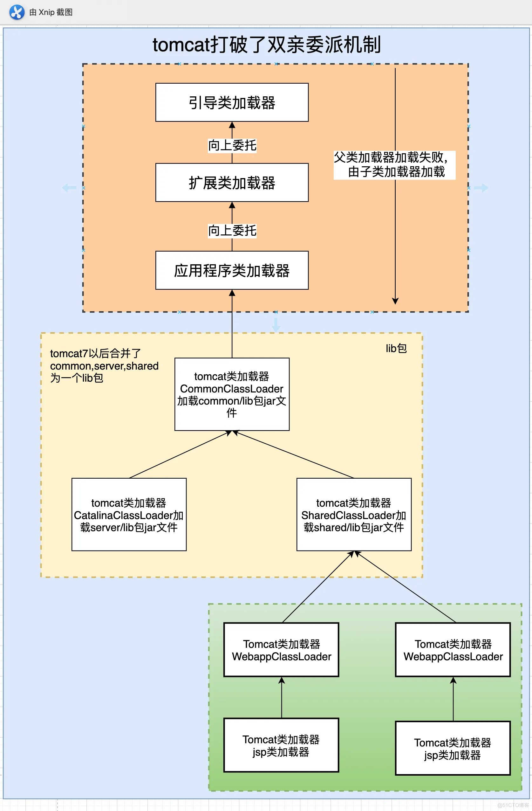

# tomcat

## 1.介绍
Tomcat服务器由Apache提供，开源免费。由于Sun和其他公司参与到了Tomcat的开发中，所以最新的JSP/Servlet规范总是能在Tomcat中体现出来。

当前最新版本是Tomcat8，我们课程中使用Tomcat7。Tomcat7支持Servlet3.0，而Tomcat6只支持Servlet2.5！

## 2.Tomcat类加载
Tomcat类加载机制

Tomcat的类加载机制是什么样的？是否违反双亲委派机制？
- https://mp.weixin.qq.com/s/4Kv58XUzbZyzvZCM1qx2eA
- https://mp.weixin.qq.com/s/YsW3MxozoxSrOeSCJOhuBQ

Tomcat并没有完全打破双亲委派模型，但它在某些场景下会打破双亲委派模型。

Tomcat自己内部构建了一套classloader机制。例如为每个webapp都单独绑定一个 WebAppClassloader，
该webapp下的类优先使用WebAppClassloader进行加载，如果找不到class在向父类查询。
Tomcat仍然会使用双亲委派模型来加载Java标准库和其他核心类库中的类，以确保程序的稳定性和安全性。
当需要进行重新部署的时候，将这个WebAppClassloader替换掉就可以了。

为什么要违反：换个思维方式，可以理解Tomcat内部自行构成了一个“双亲委派模型”，本质还是负责加载的class范围不同。
1. 为了保证多个webAPP之间的隔离性。例如不同webAPP需要使用不同版本的某个第三方类，如果还使用父classloader加载可能出现类冲突。
2. 提高公共类库的性能，不用重复加载。
3. 提高灵活性，热加载使用的是卸载响应的classloader。

应用：类覆盖机制。目的是为了可以灵活更改jar中的类，而不用修改和重新打包jar。
- WebAppClassloader加载类时，它会首先在当前Web应用程序的WEB-INF/classes目录中查找。 
- 如果没有找到，再去WEB-INF/lib目录下的JAR包中继续查找。
- 如果还找不到，就委托给父类加载器去加载（例如CatalinaClassloader->Common->Bootstrap->JDK的classloader ）

## 3.学习资源

### 3.1.Tomcat教程

<a target="_blank" href="./tomcat/tomcat">tomcat教程.txt</a>

### 3.2.虚拟主机的目录层次

### 3.3.Tomcat安装.docx

### 3.4.Session共享

### 3.5.远程调试

[eclipse远程调试Tomcat方法](./tomcat/eclipse远程调试Tomcat方法.pdf)

### 3.6.Tomcat常用配置

<a target="_blank" href="./tomcat/Tomcat常用配置.sh">Tomcat常用配置</a>

### 3.7.tomcat7和tomcat8编码问题.txt

<a target="_blank" href="./tomcat/tomcat7和tomcat8编码问题.txt">tomcat7和tomcat8编码问题</a>
