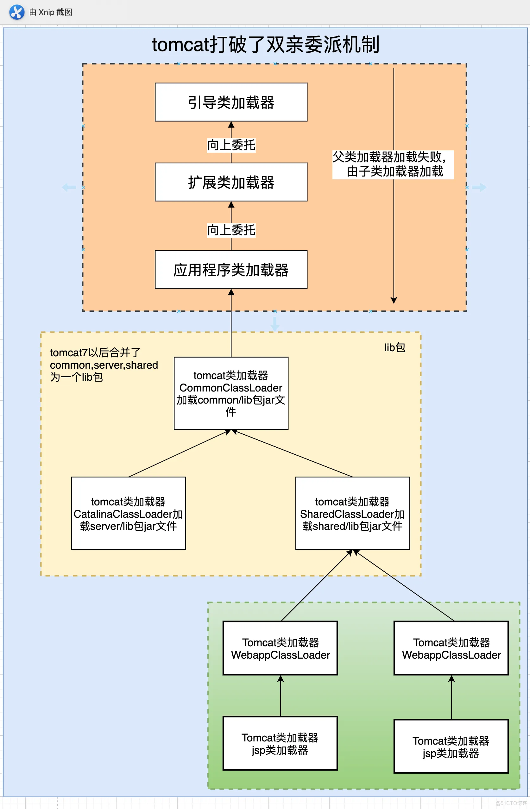

# tomcat

## 1.介绍
Tomcat服务器由Apache提供，开源免费。由于Sun和其他公司参与到了Tomcat的开发中，所以最新的JSP/Servlet规范总是能在Tomcat中体现出来。

当前最新版本是Tomcat8，我们课程中使用Tomcat7。Tomcat7支持Servlet3.0，而Tomcat6只支持Servlet2.5！

## 2.Tomcat类加载

Tomcat的类加载机制是什么样的？是否违反双亲委派机制？

Tomcat并没有完全打破双亲委派模型，但它在某些场景下会打破双亲委派模型。

Tomcat应用的类加载器，除了jdk原本的三层之外，构建了自己的一套类加载器：CommonClassloader->SharedClassloader->WebAppClassloader

打破双亲委派场景：Tomcat 自定义类加载器在应用层级打破了双亲委派，主要体现在 WebAppClassloader
1. 正常双亲委派是优先委托父加载器进行加载，加载不到，子加载器才去加载。而WebAppClassloader是优先自己加载类，加载不到了才去委托给父加载器。
2. 每个WebAppClassloader中都可以加载同一个类，互不干扰。

保留双亲委派的场景
1. jdk核心类的加载任然符合双亲委派。
2. Tomcat的公共类库由SharedClassloader加载，也是符合双亲委派。

打破双亲委派的作用：应用隔离、热部署
1. 应用隔离。Tomcat可以部署多个应用，每个应用可能使用不同版本的某个第三方类，如果使用同一个父加载器可能出现类冲突。
2. 热部署。 当应用重新发布的时候，只需要卸载掉对应的WebAppClassloader，创建新的WebAppClassloader即可。    

保留双亲委派的作用
1. 确保程序的稳定性和安全性。会使用双亲委派模型来加载Java标准库和其他核心类库中的类
2. 提高热部署的效率。只打破应用的类加载，能确保公共类库记载性能，热部署时只需要加载单个WebAppClassloader而不是整个Tomcat。

WebAppClassloader的应用：类覆盖机制。目的是为了可以灵活更改jar中的类，而不用修改和重新打包jar。加载顺序如下：
1. WebAppClassloader加载类时，它会首先在当前Web应用程序的WEB-INF/classes目录中查找。 
2. 如果没有找到，再去WEB-INF/lib目录下的JAR包中继续查找。 
3. 如果还找不到，就委托给父类加载器去加载

## 3.学习资源

### 3.1.Tomcat教程

<a target="_blank" href="./tomcat/tomcat">tomcat教程.txt</a>

### 3.2.虚拟主机的目录层次

### 3.3.Tomcat安装.docx

### 3.4.Session共享

### 3.5.远程调试

[eclipse远程调试Tomcat方法](./tomcat/eclipse远程调试Tomcat方法.pdf)

### 3.6.Tomcat常用配置

<a target="_blank" href="./tomcat/Tomcat常用配置.sh">Tomcat常用配置</a>

### 3.7.tomcat7和tomcat8编码问题.txt

<a target="_blank" href="./tomcat/tomcat7和tomcat8编码问题.txt">tomcat7和tomcat8编码问题</a>
