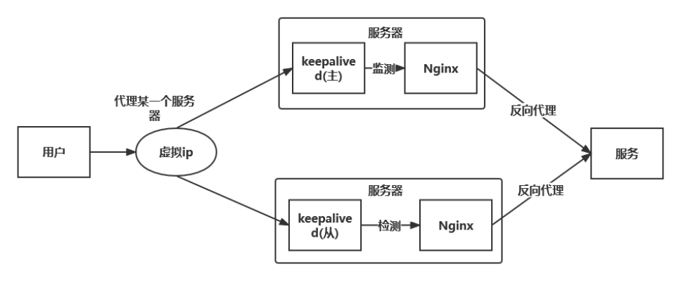
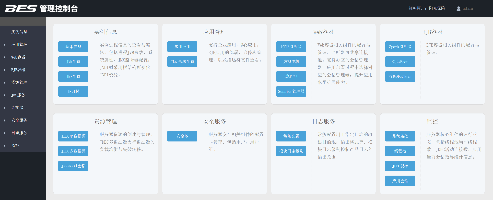
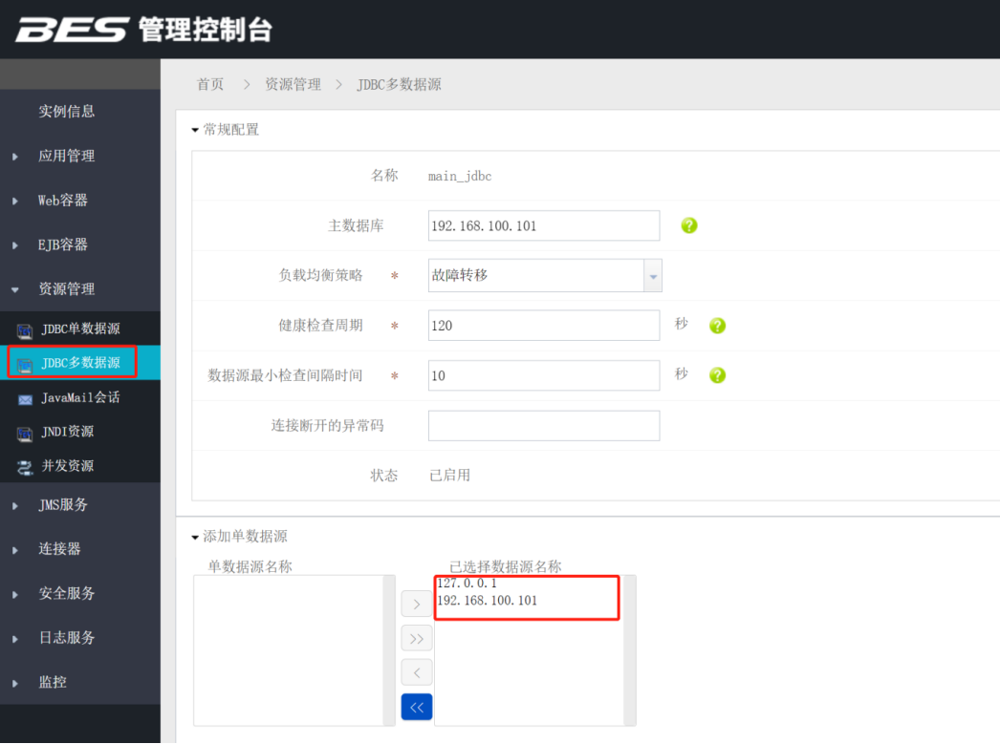

# web服务器

web服务器排名： [https://news.netcraft.com/](https://news.netcraft.com/   )

## keepalived

### 1.Keepalived

#### 1.1.介绍
Keepalived软件起初是专为LVS负载均衡软件设计的，用来管理并监控LVS集群系统中各个服务节点的状态，后来又加入了可以实现高可用的VRRP功能。
因此，keepalived除了能够管理LVS软件外，还可以作为其他服务的高可用解决方案软件。

keepalived软件主要是通过VRRP协议实现高可用功能的。VRRP是Virtual  Router  Redundancy Protocol（虚拟路由冗余协议）的缩写，
VRRP出现的目的就是为了解决静态路由的单点故障问题的，它能保证当个别节点宕机时，整个网络可以不间断地运行。
所以，keepalived一方面具有配置管理LVS的功能，同时还具有对LVS下面节点进行健康检查的功能，另一方面也可以实现系统网络服务的高可用功能。

#### 1.2.学习文档

<div name="wordShowDiv" word-url="./keepalived/keepalived.docx"></div>

[Keepalived权威指南中文](./keepalived/Keepalived权威指南中文.pdf)

### 2.LVS

全称是 Linux Virtual Server

Ipvs : 嵌入到linux的内核

IPVsadm：管理应用程序

#### 2.1.负载均衡器
1. 硬件
    - F5 BIG-IP 
    - Citrix NetScaler
    - A10
2. 软件
    - 四层：（ip协议层）。例如 LVS：只能操作IP,端口 ，在操作系统内核中。
    - 七层：http，ajp，https，（应用层）。例如 nginx、haproxy、httpd

#### 2.3.四种静态：
- rr:轮循
- wrr:
- dh: 
- sh:

#### 2.4.动态调度方法
- lc: 最少连接
    active*256+inactive
    谁的小，挑谁
- wlc: 加权最少连接
    (active*256+inactive)/weight
- sed: 最短期望延迟
    （active+1)*256/weight
- nq: never queue
- LBLC: 基于本地的最少连接
- DH: 
- LBLCR: 基于本地的带复制功能的最少连接

默认方法：wlc

#### 2.5.类型：
- NAT：地址转换
- DR: 直接路由
- TUN：隧道

#### 2.6.学习文档

<div name="wordShowDiv" word-url="./keepalived/lvs.docx"></div>


### 3.Keepalived配置Nginx高可用



#### 3.1.架构
Keepliaved实现双机主备模式一台机器提供服务,另外一台机器进行冗余.当主服务器宕机后,备服务器抢占虚拟IP.
1. 抢占模式:主机宕机,从机抢占虚拟ip.当主机恢复后,会按照权重和从机抢占虚拟ip的所属权,权重高者获得虚拟IP的所属权.
2. 非抢占模式:主机宕机,从机抢占虚拟ip.当主机恢复后不会再去抢占虚拟ip的所属权

#### 3.2.安装
1.Keepalived的安装包可用通过官网进行下载：  
[https://www.keepalived.org/download.html](https://www.keepalived.org/download.html)

2.解压安装包后执行安装命令

```shell
./configure  --prefix=/usr/local/keepalived  --sysconf=/etc
make && make install  
```

- prefix keepalived的安装位置
- sysconf keepalived核心配置文件所在的位置，固定位置，改成其他位置keepalived启动不了，/var/log/message为默认日志文件
- /etc/keepalived/keepalived.conf  为配置文件位置

<p style="color: red">问题1:configure: error:</p>

```shell
!!! OpenSSL is not properly installed on your system. !!!
!!! Can not include OpenSSL headers files.

解决: yum -y install openssl openssl-devel
```

<p style="color: red">问题2：*** WARNING - this build will not support IPVS with IPv6. 
Please install libnl/libnl-3 dev libraries to support IPv6 with IPVS.</p>

解决: `yum -y install libnl libnl-devel`

#### 3.3.配置与优化

1.监测Nginx的shell脚本(注意测试一下脚本是否能运行)
```shell
#! /bin/bash
#检测nginx是否启动了
A=`ps -C nginx --no-header | wc -l`
if [ $A -eq 0 ];then    #如果nginx没有启动就启动nginx 
    /usr/local/nginx/sbin/nginx    #通过Nginx的启动脚本来重启nginx
    sleep 2
    if [ `ps -C nginx --no-header| wc -l` -eq 0 ];then   #如果nginx重启失败，则下面就会停掉keepalived服务，进行VIP转移
        killall keepalived
    fi
fi
```


2.主机keepalived.conf文件

```shell
global_defs {
    router_id LVS_DEVEL    ## 机器标识 局域网内唯一即可。 LVS_DEVEL这字段在/etc/hosts文件中看；通过它访问到主机
    script_user root
    enable_script_security
}
vrrp_script chk_nginx {
    script "/etc/keepalived/nginx_check.sh"   #检测脚本存放的路径
    interval 2   ## 检测脚本执行的间隔，即检测脚本每隔2s会自动执行一次
    weight 2  #权重，如果这个脚本检测为真，服务器权重+2
}
vrrp_instance VI_1 {
    state MASTER    ## 指定keepalived的角色，MASTER为主，BACKUP为备。备份服务器上需将MASTER 改为BACKUP
    interface ens33  ## 通信端口 通过ip addr可以看到，根据自己的机器配置
    virtual_router_id 51 ## vrrp实例id  keepalived集群的实例id必须一致，即主、备机的virtual_router_id必须相同
    priority 200         #优先级，数值越大，获取处理请求的优先级越高。主、备机取不同的优先级，主机值较大，备份机值较小 1-255
    advert_int 1    #心跳间隔，默认为1s。keepalived多机器集群 通过心跳检测当前服务器是否还正常工作，如果发送心跳没反应，备份服务器就会立刻接管；
    preempt
    authentication {     ## 服务器之间通信密码
        auth_type PASS   #设置验证类型和密码，MASTER和BACKUP必须使用相同的密码才能正常通信
        auth_pass 1111
    }
    virtual_ipaddress { ## 自定义虚拟IP。自定义的虚拟ip得根据真实ip设置。比如真实ip是192.168.91.138，那么虚拟ip可以设置为192.168.91.139~255，前面三个数得一致
        192.168.137.50 ## 定义虚拟ip(VIP)，可多设，每行一个
    }
    track_script{
            chk_nginx
        }
}
```

3.从机keepalived.conf文件
```shell
global_defs {
    router_id LVS_DEVEL    ## 机器标识 局域网内唯一即可。 LVS_DEVEL这字段在/etc/hosts文件中看；通过它访问到主机
    script_user root #运行健康脚本的用户
    enable_script_security
}
vrrp_script chk_nginx {
    script "/etc/keepalived/nginx_check.sh"   #检测脚本存放的路径
    interval 2   ## 检测脚本执行的间隔，即检测脚本每隔2s会自动执行一次
    weight 2  #权重，如果这个脚本检测为真，服务器权重+2
}
vrrp_instance VI_1 {
    state BACKUP    ## 指定keepalived的角色，MASTER为主，BACKUP为备。备份服务器上需将MASTER 改为BACKUP
    interface ens33 ## 当前进行vrrp通讯的网络接口卡(当前centos的网卡) 用ifconfig查看你具体的网卡
    virtual_router_id 51 ## 虚拟路由编号，主、备机的virtual_router_id必须相同
    priority 90         #优先级，数值越大，获取处理请求的优先级越高。主、备机取不同的优先级，主机值较大，备份机值较小
    advert_int 1    ## 检查间隔，默认为1s(vrrp组播周期秒数)，每隔1s发送一次心跳
    authentication {     ## 校验方式， 类型是密码，密码1111
        auth_type PASS   #设置验证类型和密码，MASTER和BACKUP必须使用相同的密码才能正常通信
        auth_pass 1111
    }
    virtual_ipaddress { ## 自定义虚拟IP。自定义的虚拟ip得根据真实ip设置。比如真实ip是192.168.91.138，那么虚拟ip可以设置为192.168.91.139~255，前面三个数得一致
        192.168.137.50 ## 定义虚拟ip(VIP)，可多设，每行一个
    }
    track_script{
        chk_nginx  #使用nginx检测脚本
    }
}
```

4.验证是否配置成功
1. 访问虚拟IP 192.168.137.50下的Nginx服务,判断是否访问成功,表示单机是否配置成功.
2. 停掉刚才虚拟IP代理下服务器的Keepalived,继续访问虚拟IP,判断是否还能访问到Nginx服务
3. 停掉Nginx服务判断是否会自动重启

问题排查: 查看日志,默认路径是/var/log/message

5.模式选择:
1. 抢占模式:只需要给机器加上preempt配置就会变为抢占模式
2. 非抢占模式:只需要给机器加上nopreempt配置就会变为抢占模式

## Apache Http

### 1.基本操作

本文假设你的apahce安装目录为/usr/local/apache2，这些方法适合任何情况

```shell
启动命令： /usr/local/apache2/bin/apachectl start
停止命令：  /usr/local/apache2/bin/apachectl stop
重新启动命令： /usr/local/apache2/bin/apachectl restart
要在重启 Apache 服务器时不中断当前的连接，则应运行： /usr/local/sbin/apachectl graceful
```

如果apache安装成为linux的服务的话，可以用以下命令操作：

```shell
service httpd start 启动
service httpd restart 重新启动
service httpd stop 停止服务
```

- Ubuntu 使用命令

```shell
# 一、Start Apache 2 Server /启动apache服务
/etc/init.d/apache2 start
sudo /etc/init.d/apache2 start

# 二、 Restart Apache 2 Server /重启apache服务
/etc/init.d/apache2 restart
$ sudo /etc/init.d/apache2 restart

# 三、Stop Apache 2 Server /停止apache服务
/etc/init.d/apache2 stop
$ sudo /etc/init.d/apache2 stop

# Windows
# 直接使用ApacheMonitor界面操作
```

### 2.AB test

#### 2.1.apache benchmark

是Apache服务器自带的一个web http性能测试工具

Linux安装方式：
```shell
yum -y install httpd-tools
```
安装后命令所在的目录
```shell
# which ab
/usr/bin/ab
Window安装后工具的位置：apache/bin/ab.exe
```

```text
-n  即requests，用于指定压力测试总共的执行次数。
-c  即concurrency，用于指定的并发数。
-t  即timelimit，等待响应的最大时间(单位：秒)。
-b  即windowsize，TCP发送/接收的缓冲大小(单位：字节)。
-p  即postfile，发送POST请求时需要上传的文件，此外还必须设置-T参数。
-u  即putfile，发送PUT请求时需要上传的文件，此外还必须设置-T参数。
-T  即content-type，用于设置Content-Type请求头信息，例如：application/x-www-form-urlencoded，默认值为text/plain。
-v  即verbosity，指定打印帮助信息的冗余级别。
-w  以HTML表格形式打印结果。
-i  使用HEAD请求代替GET请求。
-x  插入字符串作为table标签的属性。
-y  插入字符串作为tr标签的属性。
-z  插入字符串作为td标签的属性。
-C  添加cookie信息，例如："Apache=1234"(可以重复该参数选项以添加多个)。
-H  添加任意的请求头，例如："Accept-Encoding: gzip"，请求头将会添加在现有的多个请求头之后(可以重复该参数选项以添加多个)。
-A  添加一个基本的网络认证信息，用户名和密码之间用英文冒号隔开。
-P  添加一个基本的代理认证信息，用户名和密码之间用英文冒号隔开。
-X  指定使用的和端口号，例如:"126.10.10.3:88"。
-V  打印版本号并退出。
-k  使用HTTP的KeepAlive特性。
-d  不显示百分比。
-S  不显示预估和警告信息。
-g  输出结果信息到gnuplot格式的文件中。
-e  输出结果信息到CSV格式的文件中。
-r  指定接收到错误信息时不退出程序。
-h  显示用法信息，其实就是ab -help。
```

#### 2.2.经常使用的参数

1.同时10个连线，连续点击10000（每个Request执行完成后都会自动断线，然后再重新连线）（疑问：每次等10个都返回结果了，在同时发起10个访问？）

2.同时10个连线，连续点击10000，并且使用Keep-Alive方式连线（当Web Server支持Keep-Alive功能时Apache Benchmark会在同一个连线下连续点击该网页）
注：根据我的使用经验，发现使用-k参数后，系统的QPS就会急剧的下降，不知道是哪些地方设置有问题还是怎么回事儿？

3.将测试中的某些数据输出到output.csv文件中
注：参数-e和-g均会生成一个数据文件，但内部的数据的含义，以及有什么价值，现在还体会不到。

4.参数-r很有必要说下，在我使用ab时发现-n 不超过5000的情况下，-c可以任意设置（小于-n的参数即可）都没有问题，但是当-n的参数设置大于5000，同时-c参数大于200时总是返回如下图的错误：（注：以上数据只是个约数，但通常在这些数字附近就会出现错误）

针对这个问题，网上的解决办法基本一致，但我试了以后还是不能解决我的问题（注：解决办法参见转载的这篇文章）。
最后发现使用参数-r即可解决这个问题，但是如下图中的Failed requests就会有很多。（注：此图只是说明，并不是高并发，大访问量情况下使用-r参数真实结果）


关于Failed requests这个参数即括号中四个参数的解释，可参见网页：http://blog.miniasp.com/post/2009/10/07/Explain-ApacheBench-ab-for-the-Failed-request-field.aspx

5.设定测试时间

此例的含义为：并发访问数为3，持续访问时间为5分钟（300秒）

#### 2.4.案例

压力测试的核心在于：在可靠的数据的前提下进行结果分析。下面结合一次测试的结果来说明每个结果数据所代表的意义。其中相比较更重要的数据项为：
Failed requests、Requests per second和Time per request。
其中Failed Requests的数量太高的话，很有可能代表你的Web Application的稳定度不够，而导致大量请求无法响应；
Request per second代表每秒可以处理的请求数，即代表Web Application的承载量有多少（在不考虑带宽限制的情况下）。

```shell
$ ab -k -c 100 -t 10 http://domain/path
```

其中，参数「c」表示的是并发，参数「t」表示的是整个测试持续的时间。
一个很容易被忽视的参数是「k」，它会增加请求头 Connection:Keep-Alive，相当于开启了HTTP长连接，
这样做一方面可以降低测试服务器动态端口被耗尽的风险，另一方面也有助于给目标服务器更大的压力，测试出更接近极限的结果。

## weblogic

安装：https://blog.51cto.com/u_15127616/3446643

linux系统中weblogic启动报错authentication for user weblogic denied

https://blog.csdn.net/wl_sqfn/article/details/103412396
	
配置idea：

https://blog.csdn.net/kanchaishaonian/article/details/81751276

weblogic10.3.6支持的web.xml配置比较低，需要改成低的版本。servlet不支持注解的，需要配置xml

## BES 宝蓝得

国产信创web中间件，对标weblogic，官网的资料和网上的资料都很少，需要采购商用版本才可以获得技术支持。这一点对于普通的开发者来说是不太友好的

[下载地址](https://www.bessystem.com/product/0ad9b8c4d6af462b8d15723a5f25a87d/info?p=101)

启动命令
```shell
# 默认账号/密码  admin/B#2008_2108#es
iastool.bat --user admin --passport B#2008_2108#es  --password B#2008_2108#es start --server
```

支持的功能比较多：


多数据源配置：



## 性能测试

除了apache 提供的ab工具在，还有很多其他的工具，比如jmeter、postman等
ab作为专业的测试工具，用来执行最高性能基准调校测试。

### Siege

官网：http://www.joedog.org/

使用教程https://mp.weixin.qq.com/s/uN27a__K7bg2lbqcrJ7MWQ

常用命令
```shell
#  200个并发对www.google.com发送请求100次
siege -c 200 -r 100 http://www.google.com

# 在urls.txt中列出所有的网址
siege -c 200 -r 100 -f urls.txt

# 随机选取urls.txt中列出所有的网址
siege -c 200 -r 100 -f urls.txt -i

#delay=0，更准确的压力测试，而不是功能测试
siege -c 200 -r 100 -f urls.txt -i -b

#指定http请求头 文档类型
siege -H "Content-Type:application/json" -c 200 -r 100 -f urls.txt -i -b
```

### Vegeta

- 官方地址：https://github.com/tsenart/vegeta
- 使用教程： https://mp.weixin.qq.com/s/EYQdz1fE7-SWiRAST5RGqA

Vegeta 是一个用 Go 语言编写的多功能的 HTTP 负载测试工具，它提供了命令行工具和一个开发库。 

### Alex 

项目地址：https://github.com/ireaderlab/alex

Alex 是一个基于 Vegeta Library 和 Boom 封装的压力测试 Web UI，Vegeta 提供稳定的 QPS 压力源，Boom 提供稳定的并发数压力源

