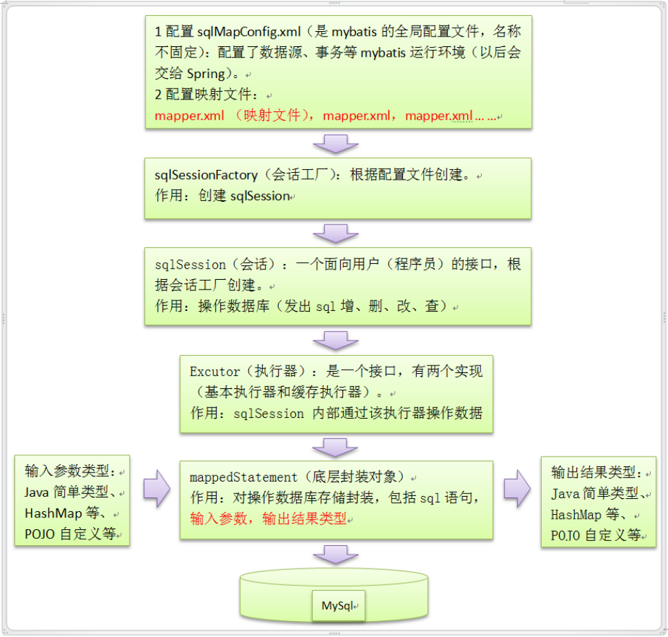

# mybatis

源码:[https://github.com/mybatis](https://github.com/mybatis)

文档：[https://mybatis.org/mybatis-3/zh/index.html](https://mybatis.org/mybatis-3/zh/index.html)

mybatis特别提供的中文文档。

[代码案例](https://gitee.com/luckSnow/spring-boot-example/tree/master/lab_012_db_mybatis)

[方向工程](https://gitee.com/luckSnow/spring-boot-example/tree/master/lab_019_db_mybatis_generator)

Mybatis3.3.x技术内幕，共23章，包括常见的所有mybatis源码分析和面试题
[https://my.oschina.net/zudajun?tab=newest&catalogId=3532897](https://my.oschina.net/zudajun?tab=newest&catalogId=3532897)

## 1.介绍
MyBatis 是一款优秀的持久层框架，它支持自定义 SQL、存储过程以及高级映射。

MyBatis 免除了几乎所有的 JDBC 代码以及设置参数和获取结果集的工作。

MyBatis 可以通过简单的 XML 或注解来配置和映射原始类型、接口和 Java POJO（Plain Old Java Objects，普通老式 Java 对象）为数据库中的记录。

## 2.原理分析

### 2.1.SQL执行流程

剖析Mybatis初始化过程中的六个工具：https://mp.weixin.qq.com/s/lgBW3UOPBKy89sos7bZBOg

### 2.2.设计模式
https://zhuanlan.zhihu.com/p/69092981
- Builder模式，例如SqlSessionFactoryBuilder、XMLConfigBuilder、XMLMapperBuilder、XMLStatementBuilder、CacheBuilder；
- 工厂模式，例如SqlSessionFactory、ObjectFactory、MapperProxyFactory；
- 单例模式，例如ErrorContext和LogFactory；
- 代理模式，Mybatis实现的核心，比如MapperProxy、ConnectionLogger，用的jdk的动态代理；
  还有executor.loader包使用了cglib或者javassist达到延迟加载的效果；
- 组合模式，例如SqlNode和各个子类ChooseSqlNode等；
- 模板方法模式，例如BaseExecutor和SimpleExecutor，还有BaseTypeHandler和所有的子类例如IntegerTypeHandler；
- 适配器模式，例如Log的Mybatis接口和它对jdbc、log4j等各种日志框架的适配实现；
- 装饰者模式，例如Cache包中的cache.decorators子包中等各个装饰者的实现；
- 迭代器模式，例如迭代器模式PropertyTokenizer；
- 责任链模式，很多人都忽略了这个，凡是有拦截器、过滤器的都使用了这个

### 2.3.一级缓存与二级缓存

MyBatis的一级缓存实现详解 及使用注意事项：https://blog.csdn.net/chenyao1994/article/details/79233725

正确使用一级缓存： https://blog.csdn.net/u010841296/article/details/89763359

### 2.4.mybatis	的 ExecutorType 有三种
三种SQL执行的简单区别： https://blog.csdn.net/qq32933432/article/details/104514028

- SIMPLE。默认的，也是使用最大的。每个SQL都会创建一个新的Statement ，使用后会关闭 Statement 。

- REUSE。Statement 使用之后不会立刻关闭，会将预编译进行缓存，也就是PSCache。
    可以理解为预编译是将SQL转为机器码，之后数据库执行机器码。
    预编译是个比较耗时的过程，所以缓存这个的话，后面执行相同SQL的时候将减少了预编译的过程，提交了效率。

注意：这个对于使用场景是有要求的，如果程序中动态SQL非常多的话，是不推荐使用这个的，因为动态SQL越多，
参数数量的变化越多，缓存下来的ps使用率越低，占用的内存越大。

- BATCH。用于执行存储过程与批量操作。在一个事务当中，提交SQL不会立即执行，会先进行预编译，
  将多个SQL的Statement保存到list中，之后再提交事务的时候批量执行Statement。感觉是个效率很高的操作，但其实效果一般。
  可能比SIMPLE的高一点点。 
  
注意：ExecutorType 的设置时在项目启动的时候进行设置的，如果我们需要使用多个ExecutorType，
是需要设置多个SQLSessionTemplate。如果动态的去进行设置。 所以我们一般项目中不会去设置ExecutorType的，比较会导致项目混乱，
还可能影响其他SQL的执行。 所以使用SIMPLE是比较好的折中方式。

### 2.5.SQL注入
我们都知道使用预编译，可以防止SQL注入。但是有些时候却不行
1. 使用order by ${field} ${desc}。这两个值不能使用#{}。所以存在SQL注入的分险
2. 模糊查询。Select * from news where title like ‘%${title}%’。这样写法虽然可以，但是存在SQL注入的分险

正确的写法：  select * from news where tile like concat(‘%’,#{title}, ‘%’)

### 2.6.Mybatis3.5.X 性能问题

在金融的大批次数据处理中，容易出现性能问题

https://mp.weixin.qq.com/s/X3Da_0bempgMgYr2Ft5kKA

### 2.7. DAO 接口和 XML如何建立关系

https://mp.weixin.qq.com/s/w6AosXmHEHTVUAez7HnLWw

