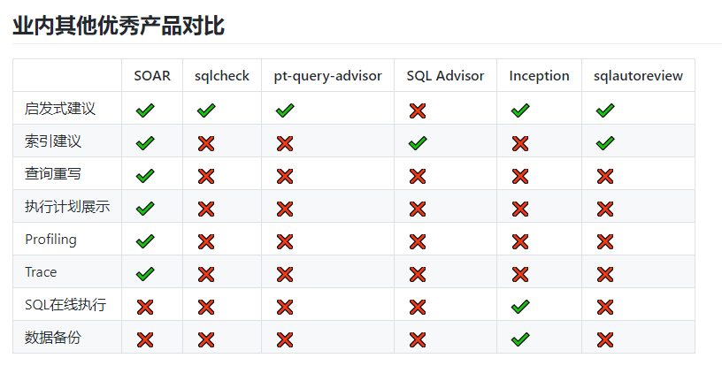
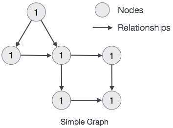
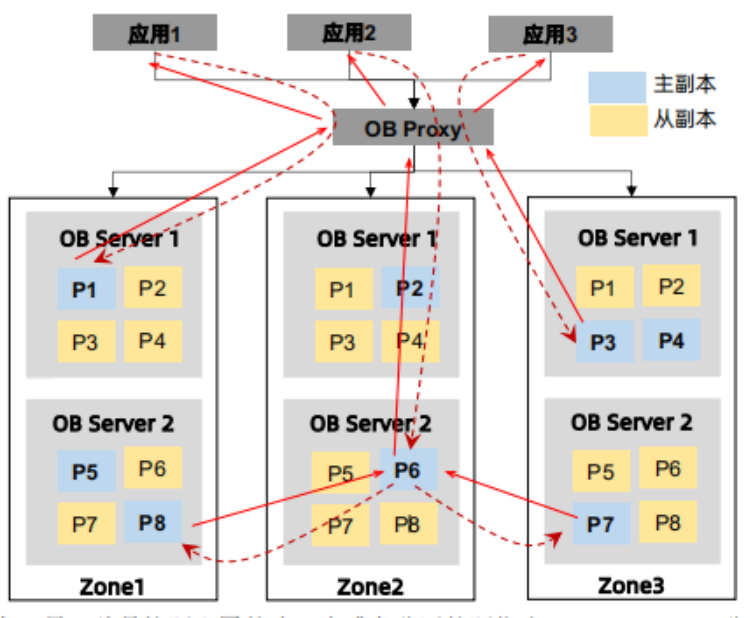

# 1.数据库基础

## 1.基础介绍

### 1.1.主流数据库
世界最权威的数据库排名网站DB-Engines：[https://db-engines.com/en/ranking](https://db-engines.com/en/ranking)

主要可以划分为：
- 关系型数据库【RDB】：Oracle、MySQL、Microsoft SQL Server、PostgreSQL、DB2、SQLite、
- 文档型数据库：MongoDB
- kv数据库：Redis、rocksdb、Memcached、etcd、Ehcache
- 列式数据库：ClickHouse、hbase
- 时序数据库：InfluxDB
- 图数据库：Neo4J、GraphDB
- 搜索引擎：Elasticsearch、Solr

分布式数据库，比如TiDB，OceanBase等，大多都是关系型数据库。

### 1.2.相关技术体系
我们想要使用数据库的话，必须了解以下9个方面

- 1.持久化:各种 orm 框架，例如：jdbc、dbutils、hibernate、jpa、mybatis、Mybatis-Plus
- 2.连接池:例如：c3p0、dbcp、druid、hikair
- 3.分库分表: 包括插件、代理等多种实现方案
- 4.分布式事务:Seata等分布式事务框架
- 5.分布式ID:解决分库分表带来的主键唯一性
- 6.事务：详细看MySQL中的事务即可
- 7.高可用：数据库代理是常见的高可用实现方案，还有一些客户端设置的高可用方案。
- 8.SQL审计工具:比如yearning
- 9.压测:性能测试工具，sysbench、benchmarkSQL等

### 1.3.MySQL体系

相对于Oracle、DB2、SQL Server等大型数据库管理系统，MySQL是一个小型的、轻量级关系型数据库。
MySQL因此具有体积小、速度快、成本低的特点，对于稍微复杂的应用来说MySQL也够用了。

- MySQL主要发行了两个版本。
  - MySQL Community Server（社区版），这个版本完全免费，但官方不提供任何技术支持。 
  - MySQL Enterprise Server（企业服务器版），也称商用版，可以提供ACID支持、完整的提交、回滚、崩溃恢复和行级锁等功能，官方提供电话技术支持，需付费使用。

实际使用中通常会选择第三方的发行版，因为MySQL被Oracle收购，开源协议有修改的可能性，所有并不首推使用，目前主流使用的为5.7和8.0两个版本。

常见发行版如下:
- Percona Server是MySQL的分支。成员主要是原MySQL员工，专注于InnoDB性能，在功能和性能上较 MySQL 有着很显著的提升，尤其在高负载下 InnoDB。
    并且 为 DBA 提供一些非常有用的性能诊断工具， 版本上与MySQL保持一致。[Percona server 介绍及与mysql对比 及安装](https://blog.csdn.net/liuerchong/article/details/107946284)
- MariaDB。MariaDB的目的是完全兼容MySQL，包括API和命令行，使之能轻松成为MySQL的代替品。 
  MariaDB直到5.5版本，均依照MySQL的版本。从2012年11月12日起发布的10.0.0版开始，不再依照MySQL的版号。
  10.0.x版以5.5版为基础，加上移植自MySQL 5.6版的功能和自行开发的新功能。 
  相对于最新的MySQL5.6，MariaDB在性能、功能、管理、NoSQL扩展方面包含了更丰富的特性。
  比如微秒的支持、线程池、子查询优化、组提交、进度报告等。
  官网地址：[https://mariadb.org/](https://mariadb.org/)
- PostgreSQL。PostgreSQL本称为是世界上最先进的开源数据库。它支持哈希索引、反向索引、部分索引、Expression 索引、GiST、GIN等多种索引模式，
  同时可安装功能丰富的扩展包。相较于Mysql，PostgreSQ支持通过PostGIS扩展支持地理空间数据、支持嵌套循环，哈希连接，
  排序合并三种表连接方式等一系列的强化功能
  - [PostgreSQL和MySQL对比](https://blog.csdn.net/weixin_40983094/article/details/119027700)
  - [PostgreSQL 与 MySQL 相比，优势何在](https://www.zhihu.com/question/20010554/answers/updated)

- MySQL的缺点
  1. MySQL只有innodb引擎支持事务，事务一致性保证上可根据实际需求调整。
  2. 复制是基于binlog的逻辑异步复制，无法实现同步复制。MySQL所有的高可用方案都是基于binlog做的同步，以及基于MySQL的分布式数据也是基于MySQL的binlog实现，binlog是MySQL生态圈最基本技术实现
  3. 高并发一多，性能就极具降低。

- 总结
  - 开源数据库都不是很完善
  - 商业数据库oracle在架构和功能方面都还是完善很多的。
  - PG更加适合严格的企业应用场景（比如金融、电信、ERP、CRM），但不仅仅限制于此，PostgreSQL的json，jsonb，hstore等数据格式，特别适用于一些大数据格式的分析；
  - MySQL适合业务逻辑相对简单、数据可靠性要求较低的互联网场景， 当然现在MySQL的在innodb引擎的大力发展，功能表现良好。

### 1.4.列式与行式
[列式与行式数据库的区别？](https://mp.weixin.qq.com/s/2ihObjhmgJYXdNfxlao3fg)

行存储:
- 数据是按行存储的。
- 没有索引的查询使用大量I/O。比如一般的数据库表都会建立索引，通过索引加快查询效率。
- 建立索引和物化视图需要花费大量的时间和资源。
- 面对查询需求，数据库必须被大量膨胀才能满足需求。

列式数据库的特性如下：
- 数据按列存储，即每一列单独存放。
- 数据即索引。
- 只访问查询涉及的列，可以大量降低系统I/O。
- 每一列由一个线程来处理，即查询的并发处理性能高。
- 数据类型一致，数据特征相似，可以高效压缩。比如有增量压缩、前缀压缩算法都是基于列存储的类型定制的，所以可以大幅度提高压缩比，有利于存储和网络输出数据带宽的消耗。

### 1.5.性能相关

1. 数据库性能: 参考[10.压测](article/7.数据库/10.压测/10.压测)
2. ORM框架性能：[1亿条数据批量插入 MySQL，哪种方式最快？](https://mp.weixin.qq.com/s/c71ATJLT6_KXtb_iiUlMjg)
   - 原生驱动是最快的:jdbc batch > jdbc 普通操作 > mybatis batch > mybatis 普通操作 > hibernate
   - 性能损耗主要原因：处理大批量的数据插入操作时，需要过程中实现一个ORM的转换   
3. 数据库连接池性能：hikair 最快， druid 提供的功能最全。
4. MySQL调优工具：[4个MySQL调优工具AWR，帮你准确定位数据库瓶颈！](https://zhuanlan.zhihu.com/p/449455802)
   - MySQLtuner.pl : [https://github.com/major/MySQLTuner-perl](https://github.com/major/MySQLTuner-perl)
   - tuning-primer.sh: [https://github.com/BMDan/tuning-primer.sh](https://github.com/BMDan/tuning-primer.sh)
   - pt-variable-advisor: [https://www.percona.com/downloads/percona-toolkit/LATEST/](https://www.percona.com/downloads/percona-toolkit/LATEST/)
   - pt-qurey-digest: 同上

### 1.6.客户端
1. Navicat：功能强大，跨平台，支持多种数据库，收费。
2. SQLyog：功能强大，界面简洁，支持windows版，只支持mysql，收费。
3. DataGrip：功能强大，跨平台，支持多种数据库，收费。
4. MySQL Workbench。功能强大，支持windows版，只支持mysql，免费。是MySQL官方提供的工具
5. phpMyAdmin：web 版的 MySQL客户端，跨平台，免费
6. HeidiSQL：轻量级免费的 MySQL 客户端，只支持mysql
7. DBeaver：功能强大，跨平台，支持多种数据库，有商业版和社区版。

### 1.7.SQL审计



Yearning：Yearning 面向中小型企业的轻量级MySQL SQL语句审核平台.提供查询审计，SQL审核等多种功能
- 官网：[http://yearning.io/](http://yearning.io/)
- 源码：[https://gitee.com/cookieYe/Yearning](https://gitee.com/cookieYe/Yearning)
- 文档: [https://guide.yearning.io/](https://guide.yearning.io/)

## 2.各类数据库

MySQL、Oracle、Redis请前往相关地址查阅

### 【关系型】OceanBase

官网：[https://www.oceanbase.com/](https://www.oceanbase.com/)
  
OceanBase 从0到1数据库内核实战教程学习笔记：https://blog.csdn.net/chrisy521/category_11759524.html

OceanBase 已连续 9 年稳定支撑双 11，创新推出“三地五中心”城市级容灾新标准，在被誉为“数据库世界杯”的 TPC-C 和 TPC-H 测试上都刷新了世界纪录。
自研一体化架构，兼顾分布式架构的扩展性与集中式架构的性能优势，用一套引擎同时支持 OLTP 和 OLAP 的混合负载，
具备数据强一致、高扩展、高可用、高性价比、高度兼容 Oracle/MySQL、稳定可靠等特征，不断用技术降低企业使用数据库的门槛。
现已助力金融、政府、运营商、零售、互联网等多个行业的客户实现核心系统升级。

jdbc连接

```text
obclient -h地址 -P端口 -u用户名@租户名#集群名:集群id -p密码

上面地址转化为jdbc连接应该是
url = 'jdbc:oceanbase:oracle://地址:端口/数据库名称'
user = '用户名@租户名#集群名'
```

分享资料：[OceanBase分布式应用.docx](file/OceanBase分布式应用.docx)

最佳实践：
1. ob的集群模式下，连接Obproxy集群作为高可用入口。一般可以选择增加F5或者Nginx代理实现数据库的高可用用。代理层一定需要经过严格的压测，才能投入使用。不然可能存在性能瓶颈，例如nginx的连接数等。
2. 可以采用jdbc的balance方式，系统直接连接OB集群的多个Obproxy，jdbc:oceanbase:oracle:loadbalance//Obproxy1:port1,Obproxy2:port2/数据库名
3. ASH 。ASH（Active Session History）是一种活动会话历史记录的诊断工具，用于记录数据库中所有活动会话的信息。用于记录压测过程的连接监控数据。
   https://www.oceanbase.com/docs/common-oceanbase-database-cn-10000000001701211
4. OceanBase分区表使用时要做好充足分析，避免分区事务和分区汇聚操作风险。Ob分区（数据存储在不同的zone上）与oracle分区（数据存储同个库上）存储方式不同，不能照搬oracle的分区表。根据以往经验采用OB分区表需要满足如下条件：
   - 分区表与非分区表无关联查询
   - 分区表的查询条件必须带有全局索引或分区键
   - 分区键必须是主键之一且不能为空
   - 分区表之间的关联查询，关联条件必须含有tablegroup字段
   - 分区表更新主要是单表操作且事务中无其它非分区表的更新

### 【NewSql】TiDb

官网：[https://pingcap.com/zh/](https://pingcap.com/zh/)

[数据库系列之TiDB存储引擎TiKV实现机制](https://blog.csdn.net/solihawk/article/details/118926380)

TiDB 是 PingCAP 公司自主设计、研发的开源分布式关系型数据库。

是一款同时支持在线事务处理与在线分析处理 (Hybrid Transactional and Analytical Processing, HTAP）的融合型分布式数据库产品，
具备水平扩容或者缩容、金融级高可用、实时 HTAP、云原生的分布式数据库、兼容 MySQL 5.7 协议和 MySQL 生态等重要特性。

目标是为用户提供一站式 OLTP (Online Transactional Processing)、OLAP (Online Analytical Processing)、HTAP 解决方案。

TiDB 适合高可用、强一致要求较高、数据规模较大等各种应用场景。

### 【列式】ClickHouse

ClickHouse 是俄罗斯的 Yandex 于 2016 年开源的用于在线分析处理查询（OLAP :Online Analytical Processing）
MPP架构的列式存储数据库（DBMS：Database Management System），能够使用 SQL 查询实时生成分析数据报告。
ClickHouse的全称是Click Stream，Data WareHouse。

- 官网：[https://clickhouse.com/](https://clickhouse.com/)
- 源码:[https://github.com/ClickHouse/ClickHouse](https://github.com/ClickHouse/ClickHouse)
- ClickHouse介绍[https://zhuanlan.zhihu.com/p/370201180](https://zhuanlan.zhihu.com/p/370201180)
- [ClickHouse和Elasticsearch压测对比，谁才是yyds](https://mp.weixin.qq.com/s/2hSEaioEUKac-7SizyibRw)
- [ClickHouse 查询优化详细介绍](https://mp.weixin.qq.com/s/38RMVbw25P3iuE4IIuxdog)

### 【文档型】mongodb

官网：[https://www.mongodb.com/](https://www.mongodb.com/)

介绍：[https://www.oschina.net/p/mongodb?hmsr=aladdin1e1](https://www.oschina.net/p/mongodb?hmsr=aladdin1e1)

mongoDB实现原理；[https://blog.csdn.net/congchp/article/details/123844095](https://blog.csdn.net/congchp/article/details/123844095)

#### 1.概述

##### 1.1.MongoDB是什么

MongoDB是一款为web应用程序和互联网基础设施设计的数据库管理系统。没错MongoDB就是数据库，是NoSQL类型的数据库。

##### 1.2.为什么要使用MongoDB

1. MongoDB提出的是文档、集合的概念，使用BSON（类JSON）作为其数据模型结构，其结构是面向对象的而不是二维表，存储一个用户在MongoDB中是这样子的。
```json
{ "username":"123", "password":"123" }
```
使用这样的数据模型，使得MongoDB能在生产环境中提供高读写的能力，吞吐量较于mysql等SQL数据库大大增强。
2. 易伸缩，自动故障转移。易伸缩指的是提供了分片能力，能对数据集进行分片，数据的存储压力分摊给多台服务器。
   自动故障转移是副本集的概念，MongoDB能检测主节点是否存活，当失活时能自动提升从节点为主节点，达到故障转移。
3. 数据模型因为是面向对象的，所以可以表示丰富的、有层级的数据结构，比如博客系统中能把“评论”直接怼到“文章“的文档中，而不必像myqsl一样创建三张表来描述这样的关系。

##### 1.3.主要特性

1.文档数据类型

SQL类型的数据库是正规化的，可以通过主键或者外键的约束保证数据的完整性与唯一性，所以SQL类型的数据库常用于对数据完整性较高的系统。
MongoDB在这一方面是不如SQL类型的数据库，且MongoDB没有固定的Schema，正因为MongoDB少了一些这样的约束条件，可以让数据的存储数据结构更灵活，存储速度更加快。

2.即时查询能力

MongoDB保留了关系型数据库即时查询的能力，保留了索引（底层是基于B tree）的能力。
这一点汲取了关系型数据库的优点，相比于同类型的NoSQL redis 并没有上述的能力。

3.复制能力

MongoDB自身提供了副本集能将数据分布在多台机器上实现冗余，目的是可以提供自动故障转移、扩展读能力。

4.速度与持久性

MongoDB的驱动实现一个写入语义 fire and forget，即通过驱动调用写入时，可以立即得到返回得到成功的结果（即使是报错），
这样让写入的速度更加快，当然会有一定的不安全性，完全依赖网络。

MongoDB提供了Journaling日志的概念，实际上像mysql的bin-log日志，当需要插入的时候会先往日志里面写入记录，再完成实际的数据操作，
这样如果出现停电，进程突然中断的情况，可以保障数据不会错误，可以通过修复功能读取Journaling日志进行修复。

5.数据扩展

MongoDB使用分片技术对数据进行扩展，MongoDB能自动分片、自动转移分片里面的数据块，让每一个服务器里面存储的数据都是一样大小。

##### 1.4.C/S服务模型

MongoDB核心服务器主要是通过mongod程序启动的，而且在启动时不需对MongoDB使用的内存进行配置，
因为其设计哲学是内存管理最好是交给操作系统，缺少内存配置是MongoDB的设计亮点，另外，还可通过mongos路由服务器使用分片功能。

MongoDB的主要客户端是可以交互的js shell 通过mongo启动，使用js shell能使用js直接与MongoDB进行交流，
像使用sql语句查询mysql数据一样使用js语法查询MongoDB的数据，另外还提供了各种语言的驱动包，方便各种语言的接入。

##### 1.5.完善的命令行工具

- mongodump和mongorestore,备份和恢复数据库的标准工具。输出BSON格式，迁移数据库。

- mongoexport和mongoimport，用来导入导出JSON、CSV和TSV数据，数据需要支持多格式时有用。
  mongoimport还能用与大数据集的初始导入，但是在导入前顺便还要注意一下，为了能充分利用好mongoDB通常需要对数据模型做一些调整。

- mongosniff，网络嗅探工具，用来观察发送到数据库的操作。基本就是把网络上传输的BSON转换为易于人们阅读的shell语句。

可以总结得到，MongoDB结合键值存储和关系数据库的最好特性。因为简单，所以数据极快，而且相对容易伸缩还提供复杂查询机制的数据库。
MongoDB需要跑在64位的服务器上面，且最好单独部署，因为是数据库，所以也需要对其进行热备、冷备处理。

#### 2.教程

[https://www.runoob.com/mongodb/mongodb-tutorial.html](https://www.runoob.com/mongodb/mongodb-tutorial.html)

内容包括；
1. 各平台安装教程；
2. MongoDB shell 日常操作；
3. 工作原理
  1. 主从复制（数据副本）
  2. 分片集群（数据分片）
  3. 数据结构、索引
  4. 原子操作（不支持事务）
4. Java客户端
5. MongoDB 管理工具: Rockmongo

#### 3.集群模式

##### 3.1.主从集群

主从集群，为了实现集群的高可用，提供数据冗余副本，在多个服务器上存储数据副本，提高了数据的可用性， 并可以保证数据的安全性。

正常情况下，只有主节点提供读写。

##### 3.1.分片集群

为什么使用分片？
- 复制所有的写入操作到主节点
- 延迟的敏感数据会在主节点查询
- 单个副本集限制在12个节点
- 当请求量巨大时会出现内存不足
- 本地磁盘不足
- 垂直扩展价格昂贵

目的？
- 降低主节点的 读/写 压力
- 更好的提高集群的可用性
- 降低主从集群的存储压力

本质就是多个主从集群。

### 【关系型】h2

- 教程[https://zhuanlan.zhihu.com/p/509877891](https://zhuanlan.zhihu.com/p/509877891)
- [H2数据库的安装和使用](https://blog.csdn.net/qq_48468029/article/details/135263017)

H2是一个用Java开发的嵌入式数据库，它本身只是一个类库，可以直接嵌入到应用项目中。

H2最大的用途在于可以同应用程序打包在一起发布，这样可以非常方便地存储少量结构化数据。

它的另一个用途是用于单元测试。启动速度快，而且可以关闭持久化功能，每一个用例执行完随即还原到初始状态。

H2的第三个用处是作为缓存，作为NoSQL的一个补充。当某些场景下数据模型必须为关系型，可以拿它当Memcached使，
作为后端MySQL/Oracle的一个缓冲层，缓存一些不经常变化但需要频繁访问的数据，比如字典表、权限表。不过这样系统架构就会比较复杂了。

#### 1.产品优势

- 纯Java编写，不受平台的限制；
- 只有一个jar文件，适合作为嵌入式数据库使用；
- h2提供了一个十分方便的web控制台用于操作和管理数据库内容；
- 功能完整，支持标准SQL和JDBC。麻雀虽小五脏俱全；
- 支持内嵌模式、服务器模式和集群。

#### 2.下载和安装

1.下载

H2数据库下载地址：http://www.h2database.com/html/download.html

2.解压缩后的目录结构：

```text
h2
|---bin
| |---h2-1.1.116.jar //H2数据库的jar包（驱动也在里面）
| |---h2.bat   //Windows控制台启动脚本
| |---h2.sh //Linux控制台启动脚本
| |---h2w.bat //Windows控制台启动脚本（不带黑屏窗口）
|---docs //H2数据库的帮助文档（内有H2数据库的使用手册）
|---service //通过wrapper包装成服务。
|---src //H2数据库的源代码
|---build.bat //windows构建脚本
|---build.sh //linux构建脚本
```

此时就算“安装”完成了。

### 【关系型】Derby

官网：[https://db.apache.org/derby/](https://db.apache.org/derby/)

#### 1.介绍

Apache Derby是一个完美的，100%Java编写的内存数据库，属于Apache的一个开源项目。并且是一个容易管理的关系数据库管理系统，可以和一些商业产品的特性进行交付。

Apache Derby是一个与平台无关的数据库引擎，它以Java类库的形式对外提供服务。

与其他难以部署的数据库不同，Derby数据库体积小、安装非常简单，只需要将其*.jar文件复制到系统中并为用户的项目添加该*.jar文件即可。

另外在MyEclipse中集成了Derby数据库的插件应用，并且Derby还提供了Eclipse的插件供开发人员使用。

尽管Derby很容易安装，但是它的特性却非常丰富。 它可以支持关系数据库中的所有企业级的特性，
包括崩溃恢复、事务回滚和提交、行/表级锁、视图、主键/外键约束、触发器、子查询表达式等。
一部分的列表特性使Derby从其他的Java关系数据库管理系统中分离出来，包括：
- 100% Java实现
- 100% Java类型4 JDBC驱动
- SQL92E标准支持大部分SQL 99特性
- ACID完全的事务独立的事务支持
- J2EE支持JNDI，连接池和XA
- 视图，临时表和保存
- BLOB和CLOB数据类型
- 行和表锁定
- 有价值的基本查询优化
- 服务器端指示约束
- 触发器和存储过程
- 为服务器端函数，触发器或存储过程等操作在数据库里存储Java代码
- 能排除CD-ROM里的只读数据库
- 数据的导入和导出
- 快速数据库加密选项

#### 2.两种运行模式

1. 内嵌式模式（embedded mode）。Derby数据库与应用程序共享同一个JVM，应用程序会在启动和关闭时分别自动启动或停止关系引擎。
   Derby包的derby.jar文件包含了Derby数据库引擎和嵌入式JDBC驱动程序；

2. 网络服务器模式（network server mode）。Derby数据库独占一个JVM，做为服务器上的一个独立进程运行。在这种模式下，
   允许有多个应用程序来访问同一个Derby数据库。Derby的derbynet.jar文件包含了Derby Network Server。

#### 3.Derby和其他数据库

Derby易于管理。当嵌入到客户机应用程序中时，Derby系统不需要任何管理干预。

Derby是可嵌入的。应用程序可以将数据库管理系统（Database Management System，DBMS）引擎嵌入应用程序进程中，从而无需管理单独的数据库进程或服务。

通过网络服务器（Network Server）架构或您选择的服务器架构，可以将Derby作为单独的进程来运行。

Derby是一个纯Java的类库：对于Java开发人员，这点十分重要，因为他们正试图维护Java技术的优点，例如平台无关性、易于配置以及易于安装。

Derby不需要专有的Java虚拟机（Java Virtual Machine，JVM）。因为完全是用Java语言编写的，所以它适应所有合格的JVM。

DerbyDBMS引擎是轻量级的。类文件大小大约是2MB，并且只使用了4MB的Java堆。

Derby支持使用Java编写存储过程和函数，这些存储过程和函数可以在应用程序的任何层上运行。Derby没有专用的存储过程语言，它使用JDBC。

#### 4.优缺点

1. Derby定位是小型数据库,特别是嵌入式.支持的数据库小于50GB,对于小型网站,事务不复杂的应用,使用它的还是很不错的.另外大型桌面应用也可以用它来保存配置和其他数据,可以做到与文件格式无关,因为都是访问数据库.
2. 功能：Derby支持标准SQL92, SQL1999,SQL2003,支持临时表,索引,触发器,视图,存储过程,外键,约束,并行,事务,加密与安全等.只要有JDK(>=1.3),就可以运行Derby.
3. 安全性：Derby的安全性也做得很到位,包括用户鉴权和加密解密.
4. 性能：Derby的性能也是不错的.在插入100万条记录时, CPU的占用率一直低于40%,平均每插一条记录耗时小于0.3毫秒.这对于满足桌面应用程序是绰绰有余的.但是比Oracle、MySQL等专业数据库性能要低。

### 【位图】neo4j

官网：[https://neo4j.com/](https://neo4j.com/)

中文社区：[http://neo4j.com.cn](http://neo4j.com.cn)

教程：[https://www.w3cschool.cn/neo4j/](https://www.w3cschool.cn/neo4j/)

[代码案例](https://gitee.com/luckSnow/spring-boot-example/tree/master/lab_027_neo4j)


#### 1.介绍

图形数据库（Graph Database）是NoSQL数据库家族中特殊的存在，用于存储丰富的关系数据，Neo4j 是目前最流行的图形数据库，
支持完整的事务，在属性图中，图是由顶点（Vertex），边（Edge）和属性（Property）组成的，顶点和边都可以设置属性，
顶点也称作节点，边也称作关系，每个节点和关系都可以由一个或多个属性。Neo4j创建的图是用顶点和边构建一个有向图，其查询语言cypher已经成为事实上的标准。

#### 2.模型规则

- 表示节点，关系和属性中的数据
- 节点和关系都包含属性
- 关系连接节点
- 属性是键值对
- 节点用圆圈表示，关系用方向键表示。
- 关系具有方向：单向和双向。
- 每个关系包含“开始节点”或“从节点”和“到节点”或“结束节点”



#### 3.优缺点

##### 3.1.优点：

数据的插入，查询操作很直观，不用再像之前要考虑各个表之间的关系。

提供的图搜索和图遍历方法很方便，速度也是比较快的。

##### 3.2.缺点：

最不能让人忍受的就是极慢的插入速度。可能是因为创建节点和边的时候需要保存一些额外信息（为了查询服务）。不知道是不是我代码的问题，插入10000个节点，10000条边花了将近10分钟...

超大节点。当有一个节点的边非常多时（常见于大V），有关这个节点的操作的速度将大大下降。这个问题很早就有了，官方也说过会处理，然而现在仍然不能让人满意。

提高数据库速度的常用方法就是多分配内存，然而看了官方操作手册，貌似无法直接设置数据库内存占用量，而是需要计算后为其”预留“内存...

#### 4.适用场景

鉴于其明显的优缺点，Neo4j适合存储”修改较少，查询较多，没有超大节点“的图数据。

另外，针对Neo4j的缺点，有一款使用混合索引的数据库Arangodb也许是一个不错的考虑对象。根据其官网的说明，Arangodb不仅具有一般图形数据库的优点，而且在各种操作的速度上领先于Neo4j。

### 【关系型】PostgreSQL

PostgreSQL称为是世界上最先进的开源数据库。它支持哈希索引、反向索引、部分索引、Expression 索引、GiST、GIN等多种索引模式，
同时可安装功能丰富的扩展包。相较于Mysql，PostgreSQ支持通过PostGIS扩展支持地理空间数据、支持嵌套循环，哈希连接，
排序合并三种表连接方式等一系列的强化功能。

底层存储结构是BLink tree， 具备更高的读写性能。 《PostgreSQL数据库内核分析》一书中对PG使用的B-Link树存储结构有介绍。

### 【KV】RocksDB

官网：[https://rocksdb.org/](https://rocksdb.org/)

中文网： [https://rocksdb.org.cn/](https://rocksdb.org.cn/)

系列文章
- [漫谈RocksDB(一)简介](https://blog.csdn.net/microGP/article/details/120290831)
- [漫谈RocksDB(二)基础讲解](https://blog.csdn.net/microGP/article/details/120309312)
- [漫谈RocksDB(三)基本操作](https://blog.csdn.net/microGP/article/details/120416193)
- [漫谈RocksDB(四)存储结构](https://blog.csdn.net/microGP/article/details/124148983)

[Rocksdb 的一些参数调优策略](https://blog.51cto.com/u_13456560/5822865)

介绍
- RocksDB是使用C++编写的嵌入式kv存储引擎，其键值均允许使用二进制流。
- 由Facebook基于levelDB开发， 提供向后兼容的levelDB API。
- RocksDB针对Flash存储进行优化，延迟极小。
- RocksDB使用LSM存储引擎，
- RocksDB依靠大量灵活的配置，使之能针对不同的生产环境进行调优，包括直接使用内存，使用Flash，使用硬盘或者HDFS。
  支持使用不同的压缩算法，并且有一套完整的工具供生产和调试使用。

注意：rocksdb不是传统意义上的数据库，不提供关系型数据模型、不支持SQL查询，没有直接对辅助索引(secondary indexes)支持。
不能启动服务、没有提供端口访问，只能在本地安装单机使用，通过动态库的方式被调，是一种嵌入式的c++组件。

应用：
1. facebook有修改了代码的MyRocks存储引擎作为MySQL的存储引擎
2. 国内开源分布式数据库TiDB的存储引擎TiKV实现，是基于RocksDB
3. 腾讯自研的实现的存储版本的Redis--Tendis，底层的存储引擎
4. Pika。 类 Redis 存储系统

功能
- 为需要存储TB级别数据到本地FLASH或者RAM的应用服务器设计
- 针对存储在高速设备的中小键值进行优化——你可以存储在flash或者直接存储在内存
- 性能碎CPU数量线性提升，对多核系统友好

安装
- [Installation of RocksDB and db_bench](https://blog.csdn.net/Waterees/article/details/120774083)
- [Centos 7 安装RocksDB(测试可用)](https://zhuanlan.zhihu.com/p/381928479)
- [使用db_bench 对rocksdb进行性能压测](https://blog.csdn.net/Z_Stand/article/details/106442454)


## 性能测试

性能测试是每个数据库都必须有的。

[压测工具合集地址](https://gitee.com/luckSnow/spring-boot-example/tree/master/lab_044_dbBeanch)

### 1.Mysqlslap

Mysqlslap。mysql自带的基准测试工具，该工具查询数据，语法简单，灵活容易使用.该工具可以模拟多个客户端同时并发的向服务器发出查询更新，
给出了性能测试数据而且提供了多种引擎的性能比较。

[使用教程](https://blog.csdn.net/lizhengyu891231/article/details/120539671)

1. 模拟高并发场景，压测性能
2. 快速生成大量测试数据。

```shell
## 100并发，1000次查询，3次迭代，测试表5个int类型字段，20个char类型字段
mysqlslap -uroot -proot --auto-generate-sql   --concurrency=100 --number-of-queries=1000  --iterations=3  --number-int-cols=5 --number-char-cols=20

## 压测结果
mysqlslap: [Warning] Using a password on the command line interface can be insecure.
Benchmark
        Average number of seconds to run all queries: 11.505 seconds    # 运行所有语句的平均秒数
        Minimum number of seconds to run all queries: 10.532 seconds    # 运行所有语句的最小秒数
        Maximum number of seconds to run all queries: 12.000 seconds    # 运行所有语句的最大秒数
        Number of clients running queries: 100                          # 客户端数量
        Average number of queries per client: 10                        # 每个客户端运行查询的平均数
```

### 2.sysbench
数据库性能测试工具，通过lua脚本实现。

- 支持MySQL、PostgreSQL。0.5之前的版本还支持Oracle，后面的版本不支持了。其他的数据库如果兼容MySQL的话，也是可以压测的。
  但是比如 OceanBase的Oracle必须使用OceanBase的驱动，这就无法适配sysbench了
- 支持Linux和Mac平台，不支持windows平台

- 源码；[https://github.com/akopytov/sysbench](https://github.com/akopytov/sysbench)
- [Sysbench工具与TPC](https://zhuanlan.zhihu.com/p/306675160)
- [Mysqlslap与sysbench使用教程](https://segmentfault.com/a/1190000038364437)

1.安装
```shell
curl -s https://packagecloud.io/install/repositories/akopytov/sysbench/script.rpm.sh | sudo bash
sudo yum -y install sysbench

## 查看帮助文档
sysbench /usr/share/sysbench/oltp_common.lua help
```

2.初始化数据

必须创建sbtest库，sbtest是sysbench默认使用的库名

```shell
sysbench --mysql-host=127.0.0.1 --mysql-port=3306  --mysql-user=root --mysql-password=root /usr/share/sysbench/oltp_common.lua --tables=10 --table_size=10000 prepare
```

3.压测
```shell
sysbench --mysql-host=127.0.0.1 --mysql-port=3306  --mysql-user=root --mysql-password=root /usr/share/sysbench/oltp_read_write.lua --tables=10 --table_size=10000  --time=20 --report-interval=5 run

## 压测结果
sysbench 1.0.20 (using bundled LuaJIT 2.1.0-beta2)

Running the test with following options:
Number of threads: 1
Report intermediate results every 5 second(s)
Initializing random number generator from current time

Initializing worker threads...

Threads started!

[ 5s ] thds: 1 tps: 77.34 qps: 1547.22 (r/w/o: 1082.97/309.36/154.88) lat (ms,95%): 23.10 err/s: 0.00 reconn/s: 0.00
[ 10s ] thds: 1 tps: 93.62 qps: 1875.60 (r/w/o: 1313.28/375.08/187.24) lat (ms,95%): 14.73 err/s: 0.00 reconn/s: 0.00
[ 15s ] thds: 1 tps: 83.98 qps: 1679.24 (r/w/o: 1175.75/335.53/167.96) lat (ms,95%): 23.10 err/s: 0.00 reconn/s: 0.00
[ 20s ] thds: 1 tps: 73.62 qps: 1473.03 (r/w/o: 1030.70/295.09/147.24) lat (ms,95%): 22.69 err/s: 0.00 reconn/s: 0.00
SQL statistics:
    queries performed:
        read:                            23016
        write:                           6576
        other:                           3288
        total:                           32880
    transactions:                        1644   (82.17 per sec.)
    queries:                             32880  (1643.36 per sec.)
    ignored errors:                      0      (0.00 per sec.)
    reconnects:                          0      (0.00 per sec.)

General statistics:
    total time:                          20.0057s
    total number of events:              1644

Latency (ms):
         min:                                    7.72
         avg:                                   12.16
         max:                                   60.25
         95th percentile:                       22.28
         sum:                                19989.64

Threads fairness:
    events (avg/stddev):           1644.0000/0.00
    execution time (avg/stddev):   19.9896/0.00
```


4.清空数据
```shell
sysbench --mysql-host=127.0.0.1 --mysql-port=3306  --mysql-user=root --mysql-password=root /usr/share/sysbench/oltp_common.lua --tables=10 --table_size=10000 cleanup
```

### 3.benchmarkSQL
TPC基准TMC（TPC-C）是一个OLTP的工作基准。它是只读和更新频繁的事务的混合，它模拟复杂OLTP应用环境中的活动。
使用Java实现，但是只提供了Linux的执行工具，不支持Windows平台。
- 支持Oracle、postgres、firebird。
- MySQL等其他数据库需要我们自己手动调整源码和配置才能实现适配。

- 源码[https://sourceforge.net/projects/benchmarksql/](https://sourceforge.net/projects/benchmarksql/)
- [BenchmarkSQL高性能测试](https://blog.csdn.net/weixin_53596073/article/details/123643316)
- [达梦数据库tpcc测试](https://blog.csdn.net/AbigTT/article/details/120499968)
- [使用BenchmarkSQL对OceanBase进行测试的步骤](https://blog.csdn.net/chrisy521/article/details/124139191)

#### 3.1.适配MySQL

1.环境:
- CentOS 7.2
- benchmarksql 5.0
- MySQL Server 5.7.19

2.下载编译benchmarksql源码

2.1.首先安装java开发环境，具体步骤略过，本文涉及到的操作在 java 1.8.0 环境下测试通过。

2.2.安装ant工具

```shell
yum install ant
```

2.3.下载benchmarksql 5.0 源码，解压。

2.4 编译代码 ant

此时会编译出一个版本 benchmarksql-5.0/dist/BenchmarkSQL-5.0.jar，但是该版本并不支持MySQL的TPC-C测试，需要做如下的修改。

3.修改benchmarksql源码

3.1 修改benchmarksql-5.0/src/client/jTPCC.java，增加mysql相关部分，如下所示：

```java
if (iDB.equals("firebird"))
    dbType = DB_FIREBIRD;
else if (iDB.equals("oracle"))
    dbType = DB_ORACLE;
else if (iDB.equals("postgres"))
    dbType = DB_POSTGRES;
else if (iDB.equals("mysql"))
    dbType = DB_UNKNOWN;
else {
    log.error("unknown database type '" + iDB + "'");
    return;
}
```
3.2.修改benchmarksql-5.0/src/client/jTPCCConnection.java， SQL子查询增加”AS L”别名，如下所示：

```java
default:
stmtStockLevelSelectLow = dbConn.prepareStatement(
"SELECT count(*) AS low_stock FROM (" +
"    SELECT s_w_id, s_i_id, s_quantity " +
"        FROM bmsql_stock " +
"        WHERE s_w_id = ? AND s_quantity < ? AND s_i_id IN (" +
"            SELECT ol_i_id " +
"                FROM bmsql_district " +
"                JOIN bmsql_order_line ON ol_w_id = d_w_id " +
"                 AND ol_d_id = d_id " +
"                 AND ol_o_id >= d_next_o_id - 20 " +
"                 AND ol_o_id < d_next_o_id " +
"                WHERE d_w_id = ? AND d_id = ? " +
"        ) " +
"    )AS L");
break;
```

3.3.编译修改后的源码，此时得到的benchmarksql版本 benchmarksql-5.0/dist/BenchmarkSQL-5.0.jar 已经支持MySQL的TPC-C测试。

```shell
cd benchmarksql-5.0
ant
```

4.修改相关脚本，支持MySQL

4.1.在benchmarksql-5.0/run目录下，创建文件prop.mysql，内容如下：

```text
db=mysql
driver=com.mysql.jdbc.Driver
conn=jdbc:mysql://127.0.0.1:3306/benchmarksql
user=benchmarksql
password=123456
warehouses=1
loadWorkers=4
terminals=1
//To run specified transactions per terminal- runMins must equal zero
runTxnsPerTerminal=10
//To run for specified minutes- runTxnsPerTerminal must equal zero
runMins=0
//Number of total transactions per minute
limitTxnsPerMin=300
//Set to true to run in 4.x compatible mode. Set to false to use the
//entire configured database evenly.
terminalWarehouseFixed=true
//The following five values must add up to 100
//The default percentages of 45, 43, 4, 4 & 4 match the TPC-C spec
newOrderWeight=45
paymentWeight=43
orderStatusWeight=4
deliveryWeight=4
stockLevelWeight=4
// Directory name to create for collecting detailed result data.
// Comment this out to suppress.
resultDirectory=my_result_%tY-%tm-%td_%tH%tM%tS
osCollectorScript=./misc/os_collector_linux.py
osCollectorInterval=1
//osCollectorSSHAddr=user@dbhost
osCollectorDevices=net_eth0 blk_sda
```

4.2. 修改 文件：benchmarksql-5.0/run/funcs.sh，添加mysql 数据库类型。

```shell
function setCP()
{
    case "$(getProp db)" in
	firebird)
	    cp="../lib/firebird/*:../lib/*"
	    ;;
	oracle)
	    cp="../lib/oracle/*"
	    if [ ! -z "${ORACLE_HOME}" -a -d ${ORACLE_HOME}/lib ] ; then
		cp="${cp}:${ORACLE_HOME}/lib/*"
	    fi
	    cp="${cp}:../lib/*"
	    ;;
	postgres)
	    cp="../lib/postgres/*:../lib/*"
	    ;;
  mysql)
      cp="../lib/mysql/*:../lib/*"
      ;;
    esac
    myCP=".:${cp}:../dist/*"
    export myCP
}

case "$(getProp db)" in
    firebird|oracle|postgres|mysql)
	;;
    "")	echo "ERROR: missing db= config option in ${PROPS}" >&2
	exit 1
	;;
    *)	echo "ERROR: unsupported database type 'db=$(getProp db)' in ${PROPS}" >&2
	exit 1
	;;
esac
```

4.3.添加mysql驱动

- 低版本驱动：mysql-connector-java-5.1.45.jar 一个即可
- 高版本驱动：mysql-connector-java-8.0.17.jar protobuf-java-3.6.1.jar

需自行下载。

```shell
mkdir -p benchmarksql-5.0/lib/mysql
cp mysql-connector-java-5.1.45.jar benchmarksql-5.0/lib/mysql/
```

4.4.修改benchmarksql-5.0/run/runDatabaseBuild.sh，去掉extraHistID

AFTER_LOAD="indexCreates foreignKeys extraHistID buildFinish"
修改为：
AFTER_LOAD="indexCreates foreignKeys buildFinish"

4.6.删除脚本中的序列操作

```text
sql.common目录下

删除 tableCreates.sql 中的  create sequence bmsql_hist_id_seq;
删除 tableDrops.sql 中的  drop sequence bmsql_hist_id_seq;
```

5.测试MySQL TPC-C
```shell
cd benchmarksql-5.0/run
创建数据：   ./runDatabaseBuild.sh props.mysql
开始压测： ./runBenchmark.sh props.mysql
删除数据： ./runDatabaseDestroy.sh props.mysql
```

修改后的benchmarksql对MySQL进行TPC-C测试，结果如下所示：
```text
02:58:47,071 [Thread-1] INFO   jTPCC : Term-00,
02:58:47,071 [Thread-1] INFO   jTPCC : Term-00, Measured tpmC (NewOrders) = 136.71
02:58:47,071 [Thread-1] INFO   jTPCC : Term-00, Measured tpmTOTAL = 298.81
02:58:47,071 [Thread-1] INFO   jTPCC : Term-00, Session Start     = 2018-12-27 02:53:46
02:58:47,071 [Thread-1] INFO   jTPCC : Term-00, Session End       = 2018-12-27 02:58:47
02:58:47,071 [Thread-1] INFO   jTPCC : Term-00, Transaction Count = 1494
```

#### 3.2.配置说明

```text
warehouse： 指“仓库”数量，每个warehouse大小大概是100MB，如果该参数设置为10，那整个数据库的大小大概在1000MB。建议将数据库的大小设置为服务器物理内存的2-5倍。 
loadworkers：用于在数据库中初始化数据的加载进程数量，默认为4，实际使用过程中可以根据实际情况调整，如32，加载速度会随worker数量的增加而有所提升。 
terminals：指的是并发连接数，也就是终端数量，指同时有多少终端并发执行，表示并发程度。建议设置为服务器CPU核数的2-6倍。 

## 非常重要 ## 以下2个条件，必须有一个为0
runTxnsPerTerminal=0： 指每个终端运行的固定事务数量，也就是每分钟每个终端执行的事务数。如果该值设置为10，意味着每个终端运行10个事务，如果有32个终端，那整体运行320个事务后，测试结束。
  该参数配置为非0值时，runMins参数必须设置为0。 

runMins=20：指要测试的整体时间，单位为分钟，如果ru nMins设置为60，那么测试持续1小时候结束。该值设置为非0值时，runTxnsPerTerminal参数必须设置为0。
  这两个参数不能同时设 置为正整数，如果设置其中一个，另一个必须为0，不然就会提示：ERROR  jTPCC : Term-00， Must indicate either transactions per terminal or number of run minutes! 
  主要区别是runMins定义时间长度来控制测试时间；runTxnsPerTerminal定义事务总数来控制时间。 
  
limitTxnsPerMin=300: Number of total transactions per minute，每分钟事务总数限制，该参数主要控制每分钟处理的事务数，事务数受terminals参数的影响.
  如果terminals数量大于limitTxnsPerMin值，意味着并发数大于每分钟事务总数，该参数会失效，想想也是如此，如果有1000个并发同时发起，那每分钟事务数设置为300就没意义了。
  默认是300，这个值较容易被忽视，后面会讲到。 
  
newOrderWeight=45、paymentWeight=43、orderStatusWeight=4、deliveryWeight=4 stockLevelWeight=4则是每笔交易占的比重，和TPC-C的标准符合，不需要变更。
 
 
用来监控数据库连接，服务器流量等 
// Directory name to create for collecting detailed result data.
// Comment this out to suppress.
resultDirectory=my_result_%tY-%tm-%td_%tH%tM%tS
osCollectorScript=./misc/os_collector_linux.py
osCollectorInterval=1

### 这里的osCollectorDevices，是指定监控流量的网卡，比如我们是物理机，网卡一般是eth0，虚拟机的话，需要我们修改为enp0s3
//osCollectorSSHAddr=user@dbhost
osCollectorDevices=net_enp0s3 blk_sda
```

### 4.sqlbench
一个测量和比较 SQL 语句执行效率的工具。基于go实现。

- 官网[http://www.sqlbench.com/](http://www.sqlbench.com/)
- 源码[https://github.com/felixge/sqlbench](https://github.com/felixge/sqlbench)
- [教程](https://blog.csdn.net/horses/article/details/108978724)


## 数据库高可用

数据库都必须支持高可用，可以进行故障转移、主备切换、读写分离等功能的。常见的方案分类如下：
- 数据库支持。OceanBase分布式库
- 数据库代理。MySQL proxy
- 客户端。Oracle驱动，web中间件多数据源

### 1.MySQL

本身不具备客户端主备切换的功能，所以主流的方案为使用MySQL代理对外提供VIP，实现数据库的高可用。方案包括Mysql router、Mycat、Mysql proxy等中间件。

#### 1.1.mysql proxy
MySQL Proxy是一个处于你的client端和MySQL server端之间的简单程序，它可以监测、分析或改变它们的通信。它使用灵活，没有限制，常见的用途包括：负载均衡，故障、查询分析，查询过滤和修改等等。MySQL Proxy就是这么一个中间层代理，简单的说，MySQL Proxy就是一个连接池，负责将前台应用的连接请求转发给后台的数据库，并且通过使用lua脚本，可以实现复杂的连接控制和过滤，从而实现读写分离和负载平衡。对于应用来说，MySQL Proxy是完全透明的，应用则只需要连接到MySQL Proxy的监听端口即可。当然，这样proxy机器可能成为单点失效，但完全可以使用多个proxy机器做为冗余，在应用服务器的连接池配置中配置到多个proxy的连接参数即可。MySQL Proxy更强大的一项功能是实现“读写分离”，基本原理是让主数据库处理事务性查询，让从库处理SELECT查询。数据库复制被用来把事务性查询导致的变更同步到集群中的从库。

#### 1.2.Mycat
Mycat是基于阿里开源cobar演变而来，对cobar的代码进行了彻底的重构，使用NIO重构了网络模块，并且优化了Buffer内核，增强了聚合，Join等基本特性，同时兼容绝大多数数据库成为通用的数据库中间件。1.4 版本以后 完全的脱离基本cobar内核，结合Mycat集群管理、自动扩容、智能优化，成为高性能的中间件。

- 一个彻底开源的，面向企业应用开发的大数据库集群
- 支持事务、ACID、可以替代MySQL的加强版数据库
- 一个可以视为MySQL集群的企业级数据库，用来替代昂贵的Oracle集群
- 一个融合内存缓存技术、NoSQL技术、HDFS大数据的新型SQL Server
- 结合传统数据库和新型分布式数据仓库的新一代企业级数据库产品
- 一个新颖的数据库中间件产品

#### 1.2.Mysql Router
MySQL Router是MySQL 官方发布的数据库中间件，是处于应用client和dbserver之间的轻量级代理程序，它能检测，分析和转发查询到后端数据库实例，并把结果返回给client。是mysql-proxy的一个升级产品。
主要功能：
1. 读写分离
2. 从库负载均衡
3.  IP过滤
4. 自动分表
5.  DBA可平滑上下线DB
6. 自动摘除宕机的DB

### 2.OceanBase

OceanBase作为分布式数据库，天然支持数据库的高可用，采用OBProxy作为数据库代理的方式，对外提供VIP实现数据库的高可用，不需要考虑数据源的高可用方案。
重要的组成部分为OBProxy和OBServer，具体的介绍如下：
- OBProxy。为了使 OceanBase 数据库对应用程序屏蔽内部分区和副本分布等细节，使应用访问分布式数据库像访问单机数据库一样简单，所以提供了 OBProxy 代理服务。应用程序并不会直接与 OBServer 建立连接，而是连接OBProxy，然后由 OBProxy 转发 SQL 请求到合适的 OBServer 节点。实现高性能转发、路由选择、管理连接、故障转移等功能。
- OB Server。每台OB Server相互独立，每台OB Server均可以独立执行SQL，如果应用需要访问的数据在不同机器上，OB Server自动将请求路由至数据所在的机器，对业务完全透明。

OceanBase高可用架构图如图：



### 3.Oracle

#### 3.1.客户端高可用

当使用Oracle数据源时，可利用Oracle客户端自带的failover功能实现主从数据源自动切换。

高可用配置如下：
```java
driverClassName="oracle.jdbc.OracleDriver" 
url="jdbc:oracle:thin:@(DESCRIPTION=(CONNECT_TIMEOUT=60)(RETRY_COUNT=3)(RETRY_DELAY=3)
(ADDRESS_LIST=(ADDRESS=(PROTOCOL=tcp)(HOST=10.10.10.10)(PORT=1521))(ADDRESS=(PROTOCOL=tcp)(HOST=10.10.10.11)(PORT=1521))(load_balance=no)(failover=yes))(CONNECT_DATA=(SERVICE_NAME=platform1))(jndiname=basecodeDataSource))
```

以下几个参数帮忙我们精确控制主备切换的指标，具体的含义如下：
- CONNECT_TIMEOUT：启用时，此参数表示Oracle网络服务以等待指定的秒数用于完成连接建立。
- RETRY_COUNT：它指定网络连接返回失败消息到客户端之前重试尝试。Oracle在向客户端返回错误消息之前重试3次。这有助于增加获得连接的可能性，从而提高可靠性。
- RETRY_DELAY：该参数指定在重新连接尝试之间秒的等待时间。它与RETRY_COUNT一起使用。因此，建议一起使用RETRY_DELAY和RETRY_COUNT以避免不必要的CPU周期。

Oracle 高可用URL配置：
- 12C: https://docs.oracle.com/database/121/JJDBC/urls.htm#JJDBC08200
- 19: https://docs.oracle.com/en/database/oracle/oracle-database/19/jjdbc/jdbc-developers-guide.pdf

#### 3.2.集群方案

提供了多种高可用性解决方案，可以实现数据库的自动漂移数据源和故障转移，以确保数据库的高可用性和可靠性，并且提供客户端故障切换功能，实现应用程序的数据源切换。

包括： 
- Oracle RAC，RAC 集群本质是共享存储，依旧存在IO、网络的问题。
- Data Guard，是一种远程数据复制方案，是异地容灾的解决方案

### 4.web容器

当前主流使用的各类数据库连接池（例如Druid、c3p0、dbcp、hikariCp等）均不支持数据源高可用。
但是WEB中间件支持多数据源配置，能帮助应用程序在数据库已经切换的时候，实现数据源的failover、loadBalance。
例如weblogic、Jboss等。