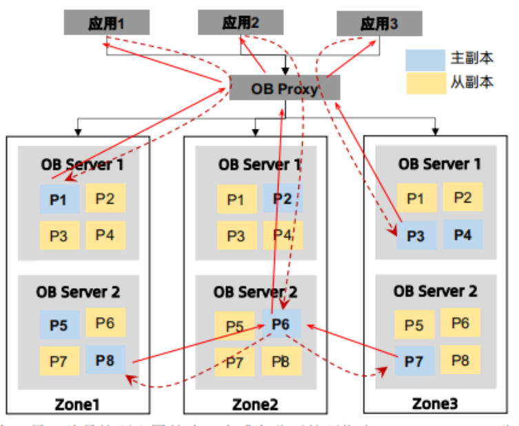

# 10.数据库高可用

数据库都必须支持高可用，可以进行故障转移、主备切换、读写分离等功能的。常见的方案分类如下：
- 数据库支持。OceanBase分布式库
- 数据库代理。MySQL proxy
- 客户端。Oracle驱动，web中间件多数据源


## 1.MySQL

本身不具备客户端主备切换的功能，所以主流的方案为使用MySQL代理对外提供VIP，实现数据库的高可用。方案包括Mysql router、Mycat、Mysql proxy等中间件。

### 1.1.mysql proxy
MySQL Proxy是一个处于你的client端和MySQL server端之间的简单程序，它可以监测、分析或改变它们的通信。它使用灵活，没有限制，常见的用途包括：负载均衡，故障、查询分析，查询过滤和修改等等。MySQL Proxy就是这么一个中间层代理，简单的说，MySQL Proxy就是一个连接池，负责将前台应用的连接请求转发给后台的数据库，并且通过使用lua脚本，可以实现复杂的连接控制和过滤，从而实现读写分离和负载平衡。对于应用来说，MySQL Proxy是完全透明的，应用则只需要连接到MySQL Proxy的监听端口即可。当然，这样proxy机器可能成为单点失效，但完全可以使用多个proxy机器做为冗余，在应用服务器的连接池配置中配置到多个proxy的连接参数即可。MySQL Proxy更强大的一项功能是实现“读写分离”，基本原理是让主数据库处理事务性查询，让从库处理SELECT查询。数据库复制被用来把事务性查询导致的变更同步到集群中的从库。

### 1.2.Mycat
Mycat是基于阿里开源cobar演变而来，对cobar的代码进行了彻底的重构，使用NIO重构了网络模块，并且优化了Buffer内核，增强了聚合，Join等基本特性，同时兼容绝大多数数据库成为通用的数据库中间件。1.4 版本以后 完全的脱离基本cobar内核，结合Mycat集群管理、自动扩容、智能优化，成为高性能的中间件。

- 一个彻底开源的，面向企业应用开发的大数据库集群
- 支持事务、ACID、可以替代MySQL的加强版数据库
- 一个可以视为MySQL集群的企业级数据库，用来替代昂贵的Oracle集群
- 一个融合内存缓存技术、NoSQL技术、HDFS大数据的新型SQL Server
- 结合传统数据库和新型分布式数据仓库的新一代企业级数据库产品
- 一个新颖的数据库中间件产品

### 1.2.Mysql Router
MySQL Router是MySQL 官方发布的数据库中间件，是处于应用client和dbserver之间的轻量级代理程序，它能检测，分析和转发查询到后端数据库实例，并把结果返回给client。是mysql-proxy的一个升级产品。
主要功能：
1. 读写分离
2. 从库负载均衡
3.  IP过滤
4. 自动分表
5.  DBA可平滑上下线DB
6. 自动摘除宕机的DB

## 2.OceanBase

OceanBase作为分布式数据库，天然支持数据库的高可用，采用OBProxy作为数据库代理的方式，对外提供VIP实现数据库的高可用，不需要考虑数据源的高可用方案。
重要的组成部分为OBProxy和OBServer，具体的介绍如下：
- OBProxy。为了使 OceanBase 数据库对应用程序屏蔽内部分区和副本分布等细节，使应用访问分布式数据库像访问单机数据库一样简单，所以提供了 OBProxy 代理服务。应用程序并不会直接与 OBServer 建立连接，而是连接OBProxy，然后由 OBProxy 转发 SQL 请求到合适的 OBServer 节点。实现高性能转发、路由选择、管理连接、故障转移等功能。
- OB Server。每台OB Server相互独立，每台OB Server均可以独立执行SQL，如果应用需要访问的数据在不同机器上，OB Server自动将请求路由至数据所在的机器，对业务完全透明。

OceanBase高可用架构图如图：



## 3.Oracle

### 3.1.客户端高可用

当使用Oracle数据源时，可利用Oracle客户端自带的failover功能实现主从数据源自动切换。

高可用配置如下：
```java
driverClassName="oracle.jdbc.OracleDriver" 
url="jdbc:oracle:thin:@(DESCRIPTION=(CONNECT_TIMEOUT=60)(RETRY_COUNT=3)(RETRY_DELAY=3)
(ADDRESS_LIST=(ADDRESS=(PROTOCOL=tcp)(HOST=10.10.10.10)(PORT=1521))(ADDRESS=(PROTOCOL=tcp)(HOST=10.10.10.11)(PORT=1521))(load_balance=no)(failover=yes))(CONNECT_DATA=(SERVICE_NAME=platform1))(jndiname=basecodeDataSource))
```

以下几个参数帮忙我们精确控制主备切换的指标，具体的含义如下：
- CONNECT_TIMEOUT：启用时，此参数表示Oracle网络服务以等待指定的秒数用于完成连接建立。
- RETRY_COUNT：它指定网络连接返回失败消息到客户端之前重试尝试。Oracle在向客户端返回错误消息之前重试3次。这有助于增加获得连接的可能性，从而提高可靠性。
- RETRY_DELAY：该参数指定在重新连接尝试之间秒的等待时间。它与RETRY_COUNT一起使用。因此，建议一起使用RETRY_DELAY和RETRY_COUNT以避免不必要的CPU周期。

Oracle 高可用URL配置：
- 12C: https://docs.oracle.com/database/121/JJDBC/urls.htm#JJDBC08200
- 19: https://docs.oracle.com/en/database/oracle/oracle-database/19/jjdbc/jdbc-developers-guide.pdf

### 3.2.集群方案

提供了多种高可用性解决方案，包括 Oracle RAC、Data Guard等。
可以实现数据库的自动漂移数据源和故障转移，以确保数据库的高可用性和可靠性，并且提供客户端故障切换功能，实现应用程序的数据源切换。


## 4.web服务器方案

当前主流使用的各类数据库连接池（例如Druid、c3p0、dbcp、hikariCp等）均不支持数据源高可用。
但是WEB中间件支持多数据源配置，能帮助应用程序在数据库已经切换的时候，实现数据源的自动切换，
例如weblogic、BES等。