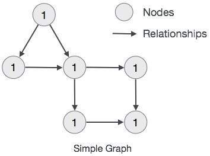

# 2.各类数据库

MySQL、Oracle、Redis请前往相关地址查阅

## 【关系型】OceanBase

官网：[https://www.oceanbase.com/](https://www.oceanbase.com/)

OceanBase 从0到1数据库内核实战教程学习笔记：https://blog.csdn.net/chrisy521/category_11759524.html

OceanBase 已连续 9 年稳定支撑双 11，创新推出“三地五中心”城市级容灾新标准，在被誉为“数据库世界杯”的 TPC-C 和 TPC-H 测试上都刷新了世界纪录。
自研一体化架构，兼顾分布式架构的扩展性与集中式架构的性能优势，用一套引擎同时支持 OLTP 和 OLAP 的混合负载，
具备数据强一致、高扩展、高可用、高性价比、高度兼容 Oracle/MySQL、稳定可靠等特征，不断用技术降低企业使用数据库的门槛。
现已助力金融、政府、运营商、零售、互联网等多个行业的客户实现核心系统升级。

jdbc连接

```text
obclient -h地址 -P端口 -u用户名@租户名#集群名:集群id -p密码

上面地址转化为jdbc连接应该是
url = 'jdbc:oceanbase:oracle://地址:端口/数据库名称'
user = '用户名@租户名#集群名'
```

分享资料：[OceanBase分布式应用.docx](file/OceanBase分布式应用.docx)

最佳实践：
1. ob的集群模式下，连接Obproxy集群作为高可用入口。一般可以选择增加F5或者Nginx代理实现数据库的高可用用。代理层一定需要经过严格的压测，才能投入使用。不然可能存在性能瓶颈，例如nginx的连接数等。
2. 可以采用jdbc的balance方式，系统直接连接OB集群的多个Obproxy，jdbc:oceanbase:oracle:loadbalance//Obproxy1:port1,Obproxy2:port2/数据库名
3. ASH 。ASH（Active Session History）是一种活动会话历史记录的诊断工具，用于记录数据库中所有活动会话的信息。用于记录压测过程的连接监控数据。
   https://www.oceanbase.com/docs/common-oceanbase-database-cn-10000000001701211
4. OceanBase分区表使用时要做好充足分析，避免分区事务和分区汇聚操作风险。Ob分区（数据存储在不同的zone上）与oracle分区（数据存储同个库上）存储方式不同，不能照搬oracle的分区表。根据以往经验采用OB分区表需要满足如下条件：
    - 分区表与非分区表无关联查询
    - 分区表的查询条件必须带有全局索引或分区键
    - 分区键必须是主键之一且不能为空
    - 分区表之间的关联查询，关联条件必须含有tablegroup字段
    - 分区表更新主要是单表操作且事务中无其它非分区表的更新

## 【NewSql】TiDb

官网：[https://pingcap.com/zh/](https://pingcap.com/zh/)

[数据库系列之TiDB存储引擎TiKV实现机制](https://blog.csdn.net/solihawk/article/details/118926380)

TiDB 是 PingCAP 公司自主设计、研发的开源分布式关系型数据库。

是一款同时支持在线事务处理与在线分析处理 (Hybrid Transactional and Analytical Processing, HTAP）的融合型分布式数据库产品，
具备水平扩容或者缩容、金融级高可用、实时 HTAP、云原生的分布式数据库、兼容 MySQL 5.7 协议和 MySQL 生态等重要特性。

目标是为用户提供一站式 OLTP (Online Transactional Processing)、OLAP (Online Analytical Processing)、HTAP 解决方案。

TiDB 适合高可用、强一致要求较高、数据规模较大等各种应用场景。

## 【列式】ClickHouse

ClickHouse 是俄罗斯的 Yandex 于 2016 年开源的用于在线分析处理查询（OLAP :Online Analytical Processing）
MPP架构的列式存储数据库（DBMS：Database Management System），能够使用 SQL 查询实时生成分析数据报告。
ClickHouse的全称是Click Stream，Data WareHouse。

- 官网：[https://clickhouse.com/](https://clickhouse.com/)
- 源码:[https://github.com/ClickHouse/ClickHouse](https://github.com/ClickHouse/ClickHouse)
- ClickHouse介绍[https://zhuanlan.zhihu.com/p/370201180](https://zhuanlan.zhihu.com/p/370201180)
- [ClickHouse和Elasticsearch压测对比，谁才是yyds](https://mp.weixin.qq.com/s/2hSEaioEUKac-7SizyibRw)
- [ClickHouse 查询优化详细介绍](https://mp.weixin.qq.com/s/38RMVbw25P3iuE4IIuxdog)

## 【文档型】mongodb

官网：[https://www.mongodb.com/](https://www.mongodb.com/)

介绍：[https://www.oschina.net/p/mongodb?hmsr=aladdin1e1](https://www.oschina.net/p/mongodb?hmsr=aladdin1e1)

mongoDB实现原理；[https://blog.csdn.net/congchp/article/details/123844095](https://blog.csdn.net/congchp/article/details/123844095)

### 1.概述

#### 1.1.MongoDB是什么

MongoDB是一款为web应用程序和互联网基础设施设计的数据库管理系统。没错MongoDB就是数据库，是NoSQL类型的数据库。

#### 1.2.为什么要使用MongoDB

1. MongoDB提出的是文档、集合的概念，使用BSON（类JSON）作为其数据模型结构，其结构是面向对象的而不是二维表，存储一个用户在MongoDB中是这样子的。
```json
{ "username":"123", "password":"123" }
```
使用这样的数据模型，使得MongoDB能在生产环境中提供高读写的能力，吞吐量较于mysql等SQL数据库大大增强。
2. 易伸缩，自动故障转移。易伸缩指的是提供了分片能力，能对数据集进行分片，数据的存储压力分摊给多台服务器。
   自动故障转移是副本集的概念，MongoDB能检测主节点是否存活，当失活时能自动提升从节点为主节点，达到故障转移。
3. 数据模型因为是面向对象的，所以可以表示丰富的、有层级的数据结构，比如博客系统中能把“评论”直接怼到“文章“的文档中，而不必像myqsl一样创建三张表来描述这样的关系。

#### 1.3.主要特性

1. 文档数据类型

SQL类型的数据库是正规化的，可以通过主键或者外键的约束保证数据的完整性与唯一性，所以SQL类型的数据库常用于对数据完整性较高的系统。
MongoDB在这一方面是不如SQL类型的数据库，且MongoDB没有固定的Schema，正因为MongoDB少了一些这样的约束条件，可以让数据的存储数据结构更灵活，存储速度更加快。

2. 即时查询能力

MongoDB保留了关系型数据库即时查询的能力，保留了索引（底层是基于B tree）的能力。
这一点汲取了关系型数据库的优点，相比于同类型的NoSQL redis 并没有上述的能力。

3. 复制能力

MongoDB自身提供了副本集能将数据分布在多台机器上实现冗余，目的是可以提供自动故障转移、扩展读能力。

4. 速度与持久性

MongoDB的驱动实现一个写入语义 fire and forget，即通过驱动调用写入时，可以立即得到返回得到成功的结果（即使是报错），
这样让写入的速度更加快，当然会有一定的不安全性，完全依赖网络。

MongoDB提供了Journaling日志的概念，实际上像mysql的bin-log日志，当需要插入的时候会先往日志里面写入记录，再完成实际的数据操作，
这样如果出现停电，进程突然中断的情况，可以保障数据不会错误，可以通过修复功能读取Journaling日志进行修复。

5. 数据扩展

MongoDB使用分片技术对数据进行扩展，MongoDB能自动分片、自动转移分片里面的数据块，让每一个服务器里面存储的数据都是一样大小。

#### 1.4.C/S服务模型

MongoDB核心服务器主要是通过mongod程序启动的，而且在启动时不需对MongoDB使用的内存进行配置，
因为其设计哲学是内存管理最好是交给操作系统，缺少内存配置是MongoDB的设计亮点，另外，还可通过mongos路由服务器使用分片功能。

MongoDB的主要客户端是可以交互的js shell 通过mongo启动，使用js shell能使用js直接与MongoDB进行交流，
像使用sql语句查询mysql数据一样使用js语法查询MongoDB的数据，另外还提供了各种语言的驱动包，方便各种语言的接入。

#### 1.5.完善的命令行工具

- mongodump和mongorestore,备份和恢复数据库的标准工具。输出BSON格式，迁移数据库。

- mongoexport和mongoimport，用来导入导出JSON、CSV和TSV数据，数据需要支持多格式时有用。
  mongoimport还能用与大数据集的初始导入，但是在导入前顺便还要注意一下，为了能充分利用好mongoDB通常需要对数据模型做一些调整。

- mongosniff，网络嗅探工具，用来观察发送到数据库的操作。基本就是把网络上传输的BSON转换为易于人们阅读的shell语句。

可以总结得到，MongoDB结合键值存储和关系数据库的最好特性。因为简单，所以数据极快，而且相对容易伸缩还提供复杂查询机制的数据库。
MongoDB需要跑在64位的服务器上面，且最好单独部署，因为是数据库，所以也需要对其进行热备、冷备处理。

### 2.教程

[https://www.runoob.com/mongodb/mongodb-tutorial.html](https://www.runoob.com/mongodb/mongodb-tutorial.html)

内容包括；
1. 各平台安装教程；
2. MongoDB shell 日常操作；
3. 工作原理
   1. 主从复制（数据副本）
   2. 分片集群（数据分片）
   3. 数据结构、索引
   4. 原子操作（不支持事务）
4. Java客户端
5. MongoDB 管理工具: Rockmongo

### 3.集群模式

#### 2.1.主从集群

主从集群，为了实现集群的高可用，提供数据冗余副本，在多个服务器上存储数据副本，提高了数据的可用性， 并可以保证数据的安全性。

正常情况下，只有主节点提供读写。

#### 2.1.分片集群

为什么使用分片？
- 复制所有的写入操作到主节点
- 延迟的敏感数据会在主节点查询
- 单个副本集限制在12个节点
- 当请求量巨大时会出现内存不足
- 本地磁盘不足
- 垂直扩展价格昂贵

目的？
- 降低主节点的 读/写 压力
- 更好的提高集群的可用性
- 降低主从集群的存储压力

本质就是多个主从集群。

## 【关系型】h2

教程[https://zhuanlan.zhihu.com/p/509877891](https://zhuanlan.zhihu.com/p/509877891)

H2是一个用Java开发的嵌入式数据库，它本身只是一个类库，可以直接嵌入到应用项目中。

H2最大的用途在于可以同应用程序打包在一起发布，这样可以非常方便地存储少量结构化数据。

它的另一个用途是用于单元测试。启动速度快，而且可以关闭持久化功能，每一个用例执行完随即还原到初始状态。

H2的第三个用处是作为缓存，作为NoSQL的一个补充。当某些场景下数据模型必须为关系型，可以拿它当Memcached使，
作为后端MySQL/Oracle的一个缓冲层，缓存一些不经常变化但需要频繁访问的数据，比如字典表、权限表。不过这样系统架构就会比较复杂了。

### 1.产品优势

- 纯Java编写，不受平台的限制；
- 只有一个jar文件，适合作为嵌入式数据库使用；
- h2提供了一个十分方便的web控制台用于操作和管理数据库内容；
- 功能完整，支持标准SQL和JDBC。麻雀虽小五脏俱全；
- 支持内嵌模式、服务器模式和集群。

### 2.下载和安装

1.下载

H2数据库下载地址：http://www.h2database.com/html/download.html

2.解压缩后的目录结构：

```text
h2
|---bin
| |---h2-1.1.116.jar //H2数据库的jar包（驱动也在里面）
| |---h2.bat   //Windows控制台启动脚本
| |---h2.sh //Linux控制台启动脚本
| |---h2w.bat //Windows控制台启动脚本（不带黑屏窗口）
|---docs //H2数据库的帮助文档（内有H2数据库的使用手册）
|---service //通过wrapper包装成服务。
|---src //H2数据库的源代码
|---build.bat //windows构建脚本
|---build.sh //linux构建脚本
```

此时就算“安装”完成了。

## 【关系型】Derby

官网：[https://db.apache.org/derby/](https://db.apache.org/derby/)

### 1.介绍

Apache Derby是一个完美的，100%Java编写的内存数据库，属于Apache的一个开源项目。并且是一个容易管理的关系数据库管理系统，可以和一些商业产品的特性进行交付。

Apache Derby是一个与平台无关的数据库引擎，它以Java类库的形式对外提供服务。

与其他难以部署的数据库不同，Derby数据库体积小、安装非常简单，只需要将其*.jar文件复制到系统中并为用户的项目添加该*.jar文件即可。

另外在MyEclipse中集成了Derby数据库的插件应用，并且Derby还提供了Eclipse的插件供开发人员使用。

尽管Derby很容易安装，但是它的特性却非常丰富。 它可以支持关系数据库中的所有企业级的特性，
包括崩溃恢复、事务回滚和提交、行/表级锁、视图、主键/外键约束、触发器、子查询表达式等。
一部分的列表特性使Derby从其他的Java关系数据库管理系统中分离出来，包括：
- 100% Java实现
- 100% Java类型4 JDBC驱动
- SQL92E标准支持大部分SQL 99特性
- ACID完全的事务独立的事务支持
- J2EE支持JNDI，连接池和XA
- 视图，临时表和保存
- BLOB和CLOB数据类型
- 行和表锁定
- 有价值的基本查询优化
- 服务器端指示约束
- 触发器和存储过程
- 为服务器端函数，触发器或存储过程等操作在数据库里存储Java代码
- 能排除CD-ROM里的只读数据库
- 数据的导入和导出
- 快速数据库加密选项

### 2.两种运行模式

1. 内嵌式模式（embedded mode）。Derby数据库与应用程序共享同一个JVM，应用程序会在启动和关闭时分别自动启动或停止关系引擎。
   Derby包的derby.jar文件包含了Derby数据库引擎和嵌入式JDBC驱动程序；

2. 网络服务器模式（network server mode）。Derby数据库独占一个JVM，做为服务器上的一个独立进程运行。在这种模式下，
   允许有多个应用程序来访问同一个Derby数据库。Derby的derbynet.jar文件包含了Derby Network Server。

### 3.Derby和其他数据库

Derby易于管理。当嵌入到客户机应用程序中时，Derby系统不需要任何管理干预。

Derby是可嵌入的。应用程序可以将数据库管理系统（Database Management System，DBMS）引擎嵌入应用程序进程中，从而无需管理单独的数据库进程或服务。

通过网络服务器（Network Server）架构或您选择的服务器架构，可以将Derby作为单独的进程来运行。

Derby是一个纯Java的类库：对于Java开发人员，这点十分重要，因为他们正试图维护Java技术的优点，例如平台无关性、易于配置以及易于安装。

Derby不需要专有的Java虚拟机（Java Virtual Machine，JVM）。因为完全是用Java语言编写的，所以它适应所有合格的JVM。

DerbyDBMS引擎是轻量级的。类文件大小大约是2MB，并且只使用了4MB的Java堆。

Derby支持使用Java编写存储过程和函数，这些存储过程和函数可以在应用程序的任何层上运行。Derby没有专用的存储过程语言，它使用JDBC。

### 4.优缺点

1. Derby定位是小型数据库,特别是嵌入式.支持的数据库小于50GB,对于小型网站,事务不复杂的应用,使用它的还是很不错的.另外大型桌面应用也可以用它来保存配置和其他数据,可以做到与文件格式无关,因为都是访问数据库.
2. 功能：Derby支持标准SQL92, SQL1999,SQL2003,支持临时表,索引,触发器,视图,存储过程,外键,约束,并行,事务,加密与安全等.只要有JDK(>=1.3),就可以运行Derby.
3. 安全性：Derby的安全性也做得很到位,包括用户鉴权和加密解密.
4. 性能：Derby的性能也是不错的.在插入100万条记录时, CPU的占用率一直低于40%,平均每插一条记录耗时小于0.3毫秒.这对于满足桌面应用程序是绰绰有余的.但是比Oracle、MySQL等专业数据库性能要低。

## 【位图】neo4j

官网：[https://neo4j.com/](https://neo4j.com/)

中文社区：[http://neo4j.com.cn](http://neo4j.com.cn)

教程：[https://www.w3cschool.cn/neo4j/](https://www.w3cschool.cn/neo4j/)

[代码案例](https://gitee.com/luckSnow/spring-boot-example/tree/master/lab_027_neo4j)


### 1.介绍

图形数据库（Graph Database）是NoSQL数据库家族中特殊的存在，用于存储丰富的关系数据，Neo4j 是目前最流行的图形数据库，
支持完整的事务，在属性图中，图是由顶点（Vertex），边（Edge）和属性（Property）组成的，顶点和边都可以设置属性，
顶点也称作节点，边也称作关系，每个节点和关系都可以由一个或多个属性。Neo4j创建的图是用顶点和边构建一个有向图，其查询语言cypher已经成为事实上的标准。

### 2.模型规则

- 表示节点，关系和属性中的数据
- 节点和关系都包含属性
- 关系连接节点
- 属性是键值对
- 节点用圆圈表示，关系用方向键表示。
- 关系具有方向：单向和双向。
- 每个关系包含“开始节点”或“从节点”和“到节点”或“结束节点”



### 3.优缺点

#### 3.1.优点：

数据的插入，查询操作很直观，不用再像之前要考虑各个表之间的关系。

提供的图搜索和图遍历方法很方便，速度也是比较快的。

#### 3.2.缺点：

最不能让人忍受的就是极慢的插入速度。可能是因为创建节点和边的时候需要保存一些额外信息（为了查询服务）。不知道是不是我代码的问题，插入10000个节点，10000条边花了将近10分钟...

超大节点。当有一个节点的边非常多时（常见于大V），有关这个节点的操作的速度将大大下降。这个问题很早就有了，官方也说过会处理，然而现在仍然不能让人满意。

提高数据库速度的常用方法就是多分配内存，然而看了官方操作手册，貌似无法直接设置数据库内存占用量，而是需要计算后为其”预留“内存...

### 4.适用场景

鉴于其明显的优缺点，Neo4j适合存储”修改较少，查询较多，没有超大节点“的图数据。

另外，针对Neo4j的缺点，有一款使用混合索引的数据库Arangodb也许是一个不错的考虑对象。根据其官网的说明，Arangodb不仅具有一般图形数据库的优点，而且在各种操作的速度上领先于Neo4j。

## 【关系型】PostgreSQL

PostgreSQL本称为是世界上最先进的开源数据库。它支持哈希索引、反向索引、部分索引、Expression 索引、GiST、GIN等多种索引模式，
同时可安装功能丰富的扩展包。相较于Mysql，PostgreSQ支持通过PostGIS扩展支持地理空间数据、支持嵌套循环，哈希连接，
排序合并三种表连接方式等一系列的强化功能。

底层存储结构是BLink tree。具备更高的读写性能。

《PostgreSQL数据库内核分析》（对PG使用的B-Link树存储结构有介绍）

## 【KV】RocksDB

官网：[https://rocksdb.org/](https://rocksdb.org/)

中文网： [https://rocksdb.org.cn/](https://rocksdb.org.cn/)

系列文章
- [漫谈RocksDB(一)简介](https://blog.csdn.net/microGP/article/details/120290831)
- [漫谈RocksDB(二)基础讲解](https://blog.csdn.net/microGP/article/details/120309312)
- [漫谈RocksDB(三)基本操作](https://blog.csdn.net/microGP/article/details/120416193)
- [漫谈RocksDB(四)存储结构](https://blog.csdn.net/microGP/article/details/124148983)

[Rocksdb 的一些参数调优策略](https://blog.51cto.com/u_13456560/5822865)

介绍
- RocksDB是使用C++编写的嵌入式kv存储引擎，其键值均允许使用二进制流。
- 由Facebook基于levelDB开发， 提供向后兼容的levelDB API。
- RocksDB针对Flash存储进行优化，延迟极小。
- RocksDB使用LSM存储引擎，
- RocksDB依靠大量灵活的配置，使之能针对不同的生产环境进行调优，包括直接使用内存，使用Flash，使用硬盘或者HDFS。
  支持使用不同的压缩算法，并且有一套完整的工具供生产和调试使用。
  
注意：rocksdb不是传统意义上的数据库，不提供关系型数据模型、不支持SQL查询，没有直接对辅助索引(secondary indexes)支持。
不能启动服务、没有提供端口访问，只能在本地安装单机使用，通过动态库的方式被调，是一种嵌入式的c++组件。

应用：
1. facebook有修改了代码的MyRocks存储引擎作为MySQL的存储引擎
2. 国内开源分布式数据库TiDB的存储引擎TiKV实现，是基于RocksDB
3. 腾讯自研的实现的存储版本的Redis--Tendis，底层的存储引擎
4. Pika。 类 Redis 存储系统

功能
- 为需要存储TB级别数据到本地FLASH或者RAM的应用服务器设计
- 针对存储在高速设备的中小键值进行优化——你可以存储在flash或者直接存储在内存
- 性能碎CPU数量线性提升，对多核系统友好


安装
- [Installation of RocksDB and db_bench](https://blog.csdn.net/Waterees/article/details/120774083)
- [Centos 7 安装RocksDB(测试可用)](https://zhuanlan.zhihu.com/p/381928479)
- [使用db_bench 对rocksdb进行性能压测](https://blog.csdn.net/Z_Stand/article/details/106442454)
