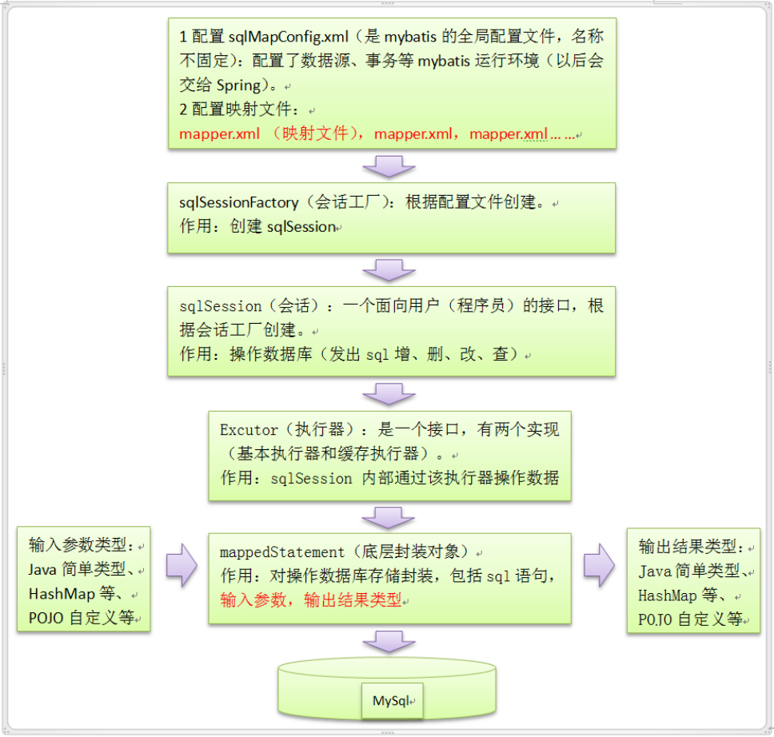

# 2.持久化&连接池

## 1.持久化
持久层框架，也称为ORM框架
- Object         对象
- Relational     关系型数据库
- Mapping        映射

常见ORM技术：
- jdbc：jdk提出的规范，各个厂商去实现各自的数据库驱动，所有的orm框架都是对jdbc不同程序的封装
- MyBatis：优秀的持久层框架，它支持定制化 SQL、存储过程以及高级映射
- Mybatis-Plus：国产 MyBatis 增强工具，简化开发、提高效率
- Spring Jdbc Template：spring 对 jdbc的简单封装
- JPA：Java Persistent API，oracle官方规定的持久层规范，在开发中可能使用到的还有，hibernate就会jpa最好的一个实现方案。
- spring data jpa：spring对jpa的实现方案
- Hibernate：完全的面向对象的orm框架
- DbUtils：只是对JDBC简单封装，不支持事务

### 1.1.jdbc

- [https://www.w3cschool.cn/jdbc/](https://www.w3cschool.cn/jdbc/)
- [JDBC详细全解](https://blog.csdn.net/qq_54353206/article/details/127325477)

JDBC API 是一个 JDK 提出的规范，它可以访问任何类型的表格数据，特别是可以访问存储在关系数据库里的数据。 需要各个数据库的厂商按照jdk的接口实现对应的客户端。

JDBC驱动程序共分四种类型：
- JDBC-ODBC桥：开放数据库连接（Open Database Connectivity，ODBC）是为解决异构数据库间的数据共享而产生的，也是一种标准。
  这种类型的驱动把所有JDBC的调用传递给ODBC，再让后者调用数据库本地驱动代码。
  
- 本地API驱动：这种类型的驱动通过客户端加载数据库厂商提供的本地代码库（C/C++等）来访问数据库，而在驱动程序中则包含了Java代码。

- 网络协议驱动：这种类型的驱动给客户端提供了一个网络API，客户端上的JDBC驱动程序使用套接字（Socket）来调用服务器上的中间件程序，后者在将其请求转化为所需的具体API调用。

- 本地协议驱动：这种类型的驱动使用Socket，直接在客户端和数据库间通信。一个纯粹的基于 Java 的驱动程序通过 socket 连接与供应商的数据库进行通信。是性能最高的驱动程序，并且通常由供应商自身提供。
  这种驱动器是非常灵活的，你不需要在客户端或服务端上安装特殊的软件。比如MySQL Connector/J。
  
第四种是目前的主流驱动，通过加载一个 jar 包来达到连接数据库目的的

### 1.2.DbUtils

教程：[https://blog.csdn.net/u013628152/article/details/42126547](https://blog.csdn.net/u013628152/article/details/42126547)

commons-dbutils 是 Apache 组织提供的一个开源 JDBC工具类库，它是对JDBC的简单封装，学习成本极低。

### 1.3.jpa

教程：
- [JPA学习笔记1——JPA基础](https://blog.csdn.net/chjttony/article/details/6086298)
- [JPA学习笔记2——JPA高级](https://blog.csdn.net/chjttony/article/details/6086305)

JPA(Java Persistence API)是Sun官方提出的JavaEE持久化规范。 它为Java开发人员提供了一种对象/关联映射工具来管理Java应用中的关系数据。

他的出现主要是为了简化现有的持久化开发工作和整合ORM技术，结束现在Hibernate，TopLink，JDO等ORM框架各自为营的局面。

值得注意的是，JPA是在充分吸收了现有Hibernate，TopLink，JDO等ORM框架的基础上发展而来的，具有易于使用，伸缩性强等优点。

从目前的开发社区的反应上看，JPA受到了极大的支持和赞扬，其中就包括了Spring与EJB3.0的开发团队。

注意:JPA是一套规范，不是一套产品，那么像Hibernate，TopLink，JDO他们是一套产品，如果说这些产品实现了这个JPA规范， 那么我们就可以叫他们为JPA的实现产品。

### 1.4.hibernate

- 基础教程：[https://www.w3cschool.cn/hibernate/](https://www.w3cschool.cn/hibernate/)
- 进阶教程：[https://www.w3cschool.cn/hibernate_articles/](https://www.w3cschool.cn/hibernate_articles/)

JDBC依赖于SQL，属于结构化语言，是一种不完全的面向对象的方式，而hibernate能做到完全面向对象的方式操作数据库，实现了JavaEE的规范JPA

优点
1. 部分场景比较简单;
2. 数据缓存：一级缓存    二级缓存   查询缓存;
3. 移植性比较好，与数据库无关。

缺点
1. 因为sql语句是hibernate内部生成的，所以程序员干预不了，不可控;(如对sql语句的优化等级非常高，不适合hibernate)
2. 如果数据库特别大，不适合用hibernate;

### 1.5.P6Spy【开发调试工具】

P6Spy是一个可以拦截SQL执行过程，记录SQL执行过程，用于性能分析的功能。但是p6spy会对性能有一定影响，因此不适合在正式环境上使用。

实现原理：p6spy将应用的数据源给劫持了，应用操作数据库其实在调用p6spy的数据源，p6spy劫持到需要执行的sql之后，他自己去调用一个realDatasource，再去操作数据库。

- github[https://github.com/p6spy/p6spy](https://github.com/p6spy/p6spy)
- 官网[https://p6spy.readthedocs.io/en/latest/index.html](https://p6spy.readthedocs.io/en/latest/index.html)
- 详细配置：[https://p6spy.readthedocs.io/en/latest/configandusage.html](https://p6spy.readthedocs.io/en/latest/configandusage.html)
- [P6Spy]( https://www.jianshu.com/p/5a32434d43eb)

使用方式
```java
1. maven坐标
<dependency>
  <groupId>p6spy</groupId>
  <artifactId>p6spy</artifactId>
  <version>${p6spy.version}</version>
</dependency>
    
2.替换数据源    
spring:
    datasource:
        type: com.alibaba.druid.pool.DruidDataSource
        driverClassName: ${DRIVER_CALSS_NAME:com.p6spy.engine.spy.P6SpyDriver}
        url: ${DATASOURCE_URL:jdbc:p6spy:mysql://localhost:3306/demo?useUnicode=true&characterEncoding=utf8&useSSL=false&serverTimezone=Asia/Shanghai}

3.在resource目录下添加spy.properties        
#3.2.1以上使用
modulelist=com.baomidou.mybatisplus.extension.p6spy.MybatisPlusLogFactory,com.p6spy.engine.outage.P6OutageFactory
#3.2.1以下使用或者不配置
#modulelist=com.p6spy.engine.logging.P6LogFactory,com.p6spy.engine.outage.P6OutageFactory
# 自定义日志打印
#logMessageFormat=com.baomidou.mybatisplus.extension.p6spy.P6SpyLogger
logMessageFormat=com.github.lybgeek.p6spy.extentsion.CustomP6SpyLogger
#日志输出到控制台
#appender=com.baomidou.mybatisplus.extension.p6spy.StdoutLogger
# 使用日志系统记录 sql
#appender=com.p6spy.engine.spy.appender.Slf4JLogger
appender=com.github.lybgeek.p6spy.extentsion.CustomStdoutLogger
# 设置 p6spy driver 代理
deregisterdrivers=true
# 取消JDBC URL前缀
useprefix=true
# 配置记录 Log 例外,可去掉的结果集有error,info,batch,debug,statement,commit,rollback,result,resultset.
excludecategories=info,debug,result,commit,resultset
# 日期格式
dateformat=yyyy-MM-dd HH:mm:ss
# 实际驱动可多个
#driverlist=org.h2.Driver
# 是否开启慢SQL记录
outagedetection=true
# 慢SQL记录标准 2 秒
outagedetectioninterval=2

4.自定义日志格式【可选】。在spy.properties中配置自定义日志格式： logMessageFormat=com.github.lybgeek.p6spy.extentsion.CustomP6SpyLogger
public class CustomP6SpyLogger implements MessageFormattingStrategy {
    /**
     * Sql日志格式化
     * @param connectionId: 连接ID
     * @param now:          当前时间
     * @param elapsed:      花费时间
     * @param category:     类别
     * @param prepared:     预编译SQL
     * @param sql:          最终执行的SQL
     * @param url:          数据库连接地址
     * @return 格式化日志结果
     */
    @Override
    public String formatMessage(int connectionId, String now, long elapsed, String category, String prepared, String sql, String url) {
        return StringUtils.isNotBlank(sql) ? " 耗时：" + elapsed + " ms " + now +
                "\n 执行 SQL：" + sql.replaceAll("[\\s]+", " ") + "\n" : "";
    }
}      

5、自定义日志输出【可选】。在spy.properties中配置自定义日志输出：appender=com.github.lybgeek.p6spy.extentsion.CustomStdoutLogger
public class CustomStdoutLogger extends com.p6spy.engine.spy.appender.StdoutLogger{
    @Override
    public void logText(String text) {
        System.out.println("sql:" + text);
    }
}

6、测试观察控制台输出
sql: 耗时：1 ms 2022-05-10 11:38:34
执行 SQL：SELECT id,username,password,fullname,mobile,email FROM t_user
```

## 2.Mybatis

- 源码:[https://github.com/mybatis](https://github.com/mybatis)
- 文档：[https://mybatis.org/mybatis-3/zh/index.html](https://mybatis.org/mybatis-3/zh/index.html)
- [Mybatis3.3.x技术内幕，共23章](https://my.oschina.net/zudajun?tab=newest&catalogId=3532897)
- [2万多行MyBatis源码，你知道里面用了多少种设计模式吗](https://mp.weixin.qq.com/s/biCoceD9P-2kOBT6r5YITQ)
- [ParameterHandler源码解析](https://blog.csdn.net/Jas000/article/details/127720553)

### 2.1.介绍
MyBatis 是一款优秀的持久层框架，它支持自定义 SQL、存储过程以及高级映射。 MyBatis 免除了几乎所有的 JDBC 代码以及设置参数和获取结果集的工作。
MyBatis 可以通过简单的 XML 或注解来配置和映射原始类型、接口和 Java POJO（Plain Old Java Objects，普通老式 Java 对象）为数据库中的记录。

### 2.2.SQL执行流程

剖析Mybatis初始化过程中的六个工具：https://mp.weixin.qq.com/s/lgBW3UOPBKy89sos7bZBOg



### 2.3.设计模式
https://zhuanlan.zhihu.com/p/69092981
- Builder模式，例如SqlSessionFactoryBuilder、XMLConfigBuilder、XMLMapperBuilder、XMLStatementBuilder、CacheBuilder；
- 工厂模式，例如SqlSessionFactory、ObjectFactory、MapperProxyFactory；
- 单例模式，例如ErrorContext和LogFactory；
- 代理模式，Mybatis实现的核心，比如MapperProxy、ConnectionLogger，用的jdk的动态代理；
  还有executor.loader包使用了cglib或者javassist达到延迟加载的效果；
- 组合模式，例如SqlNode和各个子类ChooseSqlNode等；
- 模板方法模式，例如BaseExecutor和SimpleExecutor，还有BaseTypeHandler和所有的子类例如IntegerTypeHandler；
- 适配器模式，例如Log的Mybatis接口和它对jdbc、log4j等各种日志框架的适配实现；
- 装饰者模式，例如Cache包中的cache.decorators子包中等各个装饰者的实现；
- 迭代器模式，例如迭代器模式PropertyTokenizer；
- 责任链模式，很多人都忽略了这个，凡是有拦截器、过滤器的都使用了这个

### 2.4.一级缓存与二级缓存

MyBatis的一级缓存实现详解 及使用注意事项：https://blog.csdn.net/chenyao1994/article/details/79233725

正确使用一级缓存： https://blog.csdn.net/u010841296/article/details/89763359

### 2.5.mybatis	的 ExecutorType 有三种
三种SQL执行的简单区别： https://blog.csdn.net/qq32933432/article/details/104514028

- SIMPLE。默认的，也是使用最大的。每个SQL都会创建一个新的Statement ，使用后会关闭 Statement 。

- REUSE。Statement 使用之后不会立刻关闭，会将预编译进行缓存，也就是PSCache。
  可以理解为预编译是将SQL转为机器码，之后数据库执行机器码。
  预编译是个比较耗时的过程，所以缓存这个的话，后面执行相同SQL的时候将减少了预编译的过程，提交了效率。

注意：这个对于使用场景是有要求的，如果程序中动态SQL非常多的话，是不推荐使用这个的，因为动态SQL越多，
参数数量的变化越多，缓存下来的ps使用率越低，占用的内存越大。

- BATCH。用于执行存储过程与批量操作。在一个事务当中，提交SQL不会立即执行，会先进行预编译，
  将多个SQL的Statement保存到list中，之后再提交事务的时候批量执行Statement。感觉是个效率很高的操作，但其实效果一般。
  可能比SIMPLE的高一点点。

注意：ExecutorType 的设置时在项目启动的时候进行设置的，如果我们需要使用多个ExecutorType，
是需要设置多个SQLSessionTemplate。如果动态的去进行设置。 所以我们一般项目中不会去设置ExecutorType的，比较会导致项目混乱，
还可能影响其他SQL的执行。 所以使用SIMPLE是比较好的折中方式。

### 2.6.SQL注入
我们都知道使用预编译，可以防止SQL注入。但是有些时候却不行
1. 使用order by ${field} ${desc}。这两个值不能使用#{}。所以存在SQL注入的分险
2. 模糊查询。Select * from news where title like ‘%${title}%’。这样写法虽然可以，但是存在SQL注入的分险

正确的写法：  select * from news where tile like concat(‘%’,#{title}, ‘%’)

### 2.7. DAO 接口和 XML如何建立关系

https://mp.weixin.qq.com/s/w6AosXmHEHTVUAez7HnLWw


### 2.8.常见问题

1. 在金融的大批次数据处理中，容易出现性能问题：https://mp.weixin.qq.com/s/X3Da_0bempgMgYr2Ft5kKA
2. foreach性能差导致oom。[https://mp.weixin.qq.com/s/WZ9HRM8p6HqWlKDQ7B7stg](https://mp.weixin.qq.com/s/WZ9HRM8p6HqWlKDQ7B7stg)
  - 原因：foreach拼接SQL性能差，尤其是通过正则之类的操作匹配占位符时需要较多的时间。同时又持有查询参数和占位符在ContextMap中无法被GC释放，所以一旦并发量上去就很容易内存占用过多导致OOM

### 2.9.Mybatis-Plus

- 官网：[https://baomidou.com/](https://baomidou.com/)
- 官方文档：[https://baomidou.com/guide/](https://baomidou.com/guide/)
- 官方案例：[https://github.com/baomidou/mybatis-plus-samples](https://github.com/baomidou/mybatis-plus-samples)
- [使用mybatis plus的开源项目案例](https://github.com/baomidou/awesome-mybatis-plus/blob/master/README.md)
- [简单教程](https://mp.weixin.qq.com/s/4kest5z2Cvy0fOh_VwrH2w)
- [详细教程](https://mp.weixin.qq.com/s/Ug5ZmoiJGLEreP59uPnk3g)


是mybatis的操作简化，增强版。所有换来的是性能减低，一般情况下，性能会降低3~5倍。

特点
- 无侵入：只做增强不做改变，引入它不会对现有工程产生影响，如丝般顺滑
- 损耗小：启动即会自动注入基本 CURD，性能基本无损耗，直接面向对象操作。
- 强大的 CRUD 操作：内置通用 Mapper、通用 Service，仅仅通过少量配置即可实现单表大部分 CRUD 操作，更有强大的条件构造器，满足各类使用需求
- 支持 Lambda 形式调用：通过 Lambda 表达式，方便的编写各类查询条件，无需再担心字段写错
- 支持主键自动生成：支持多达 4 种主键策略（内含分布式唯一 ID 生成器 - Sequence），可自由配置，完美解决主键问题
- 支持 ActiveRecord 模式：支持 ActiveRecord 形式调用，实体类只需继承 Model 类即可进行强大的 CRUD 操作
- 支持自定义全局通用操作：支持全局通用方法注入（ Write once, use anywhere ）
- 内置代码生成器：采用代码或者 Maven 插件可快速生成 Mapper 、 Model 、 Service 、 Controller 层代码，支持模板引擎，更有超多自定义配置等您来使用
- 内置分页插件：基于 MyBatis 物理分页，开发者无需关心具体操作，配置好插件之后，写分页等同于普通 List 查询
- 分页插件支持多种数据库：支持 MySQL、MariaDB、Oracle、DB2、H2、HSQL、SQLite、Postgre、SQLServer 等多种数据库
- 内置性能分析插件：可输出 SQL 语句以及其执行时间，建议开发测试时启用该功能，能快速揪出慢查询
- 内置全局拦截插件：提供全表 delete 、 update 操作智能分析阻断，也可自定义拦截规则，预防误操作

提供了乐观锁插件、分页插件、多租户插件、防全表更新与删除插件。

对于企业级应用，还支持：数据加密、数据脱敏、数据权限、敏感词、分库分表、分布式ID等功能(免费的)

## 3.连接池

数据库连接池负责分配、管理和释放数据库连接，它允许应用程序重复使用一个现有的数据库连接，而不是再重新建立一个；

释放空闲时间超过最大空闲时间的数据库连接来避免因为没有释放数据库连接而引起的数据库连接遗漏。这项技术能明显提高对数据库操作的性能。

[数据库连接池](https://blog.csdn.net/m0_52982868/article/details/123889071)

### 3.1.常见数据库连接池

Java程序想要连接到数据库，需要使用到的技术也是不同的。

- 关系型数据库：主要使用JNDI或者jdbc进行连接，数据库连接池可以提交效率
  - JNDI：JNDI(Java Naming and Directory Interface)是Java提供的Java 命名和目录接口。可以操作DataSource，比如weblogic、Tomcat都支持JNDI连接数据库。
  - Druid：阿里巴巴开源，功能非常强
  - HikariCP。HikariCP 是一个高性能的 JDBC 连接池组件，号称性能最好的后起之秀，是一个基于BoneCP做了不少的改进和优化的高性能JDBC连接池，是springboot默认连接池。
  - C3P0：是一个开放源代码的JDBC连接池，它在lib目录中与Hibernate一起发布，包括了实现jdbc3和jdbc2扩展规范说明的Connection 和Statement 池的DataSources 对象。
    [http://www.mchange.com/projects/c3p0/](http://www.mchange.com/projects/c3p0/)
  - DBCP：DBCP是一个依赖Jakarta commons-pool对象池机制的数据库连接池。DBCP可以直接的在应用程序中使用。
    [http://commons.apache.org/proper/commons-dbcp/configuration.html](http://commons.apache.org/proper/commons-dbcp/configuration.html)
  - Proxool：是一个Java SQL Driver驱动程序，提供了对选择的其它类型的驱动程序的连接池封装。可以非常简单的移植到现存的代码中，完全可配置，快速、成熟、健壮。可以透明地为现存的JDBC驱动程序增加连接池功能。
  - DDConnectionBroker：是一个简单、轻量级的数据库连接池。
  - DBPool：是一个高效、易配置的数据库连接池。它除了支持连接池应有的功能之外，还包括了一个对象池，使用户能够开发一个满足自己需求的数据库连接池。
  - XAPool：是一个XA数据库连接池。它实现了javax.sql.XADataSource并提供了连接池工具。
  - Primrose：是一个Java开发的数据库连接池。当前支持的容器包括Tomcat4&5、Resin3与JBoss3。它同样也有一个独立的版本，可以在应用程序中使用而不必运行在容器中。   Primrose通过一个WEB接口来控制SQL处理的追踪、配置，以及动态池管理。在重负荷的情况下可进行连接请求队列处理。
  - SmartPool：是一个连接池组件，它模仿应用服务器对象池的特性。SmartPool能够解决一些临界问题如连接泄漏（connection leaks）、连接阻塞、打开的JDBC对象（如Statements、PreparedStatements）等。
  - MiniConnectionPoolManager：是一个轻量级JDBC数据库连接池。它只需要Java1.5（或更高）并且没有依赖第三方包。
  - BoneCP：是一个快速、开源的数据库连接池。帮用户管理数据连接，让应用程序能更快速地访问数据库。比C3P0/DBCP连接池速度快25倍。
- 键值型数据库：Redis，客户端较多，比如jedis、lettuce、Redisson等
  - Jedis：基于socket实现的客户端，采用面向过程的方式，与Redis进行通信。调用的接口与Redis命令十分接近。
  - Redisson：基于jedis实现的高级客户端。采用面向对象的流式方式。实现了很多分布式环境下的高级特性。
  - Lettuce：基于socket实现的客户端。spring-data-Redis基于lettuce实现的RedisTemplate。

其中比较主流的是 hikariCP、Druid、C3P0、DBCP。

### 3.2.性能测评

[https://cloud.tencent.com/developer/article/1793078](https://cloud.tencent.com/developer/article/1793078)

测试结论
1. 性能方面 hikariCP>druid>tomcat-jdbc>dbcp>c3p0 。hikariCP的高性能得益于最大限度的避免锁竞争。
2. druid功能最为全面，sql拦截等功能，统计数据较为全面，具有良好的扩展性。
3. 综合性能，扩展性等方面，可考虑使用druid或者hikariCP连接池。
4. 可开启prepareStatement缓存，对性能会有大概20%的提升，尤其是SQL是确定的场景，如果SQL动态变化大，例如in条件数量从1到几千个不止，可能会造成内存耗尽。

### 3.3.配置优化

数据库连接池优化配置(druid,dbcp,c3p0)

主要描述了数据库连接池参数配置的准则，针对常用的数据库连接池(c3p0,dbcp,druid)给出推荐的配置。

考虑因素
1. 当前连接DB的规模
2. 并发情况
3. 执行db的响应时间

配置考虑
1. 初始化连接. 可考虑设置为3个连接。对于db规模特别大的情况下可考虑设置为1个，避免启动时间过长；
2. 最小连接. 可考虑该值的设置和初始化连接保持一致；
3. 最大连接. 对于有较大DB规模，最大连接不要设置过大，避免本地维护的db太大。 如果对应到数据源的并发数过高，可考虑增大最大连接数。
4. 获取连接的超时时间. 如果连接全部被占用，需要等待的时间。可以根据当前系统的响应时间判定，如果容忍度较高，可以大点。容忍度较低，设置小点。
5. 当获取连接和释放连接心跳检测. 建议全部关闭，否则每个数据库访问指令会对数据库生产额外的两条心跳检测的指令，增加数据库的负载。连接有效性的检查改用后台空闲连接检查。
6. 连接有效性检测时间. 该值需要结合数据库的wait_timeout,interactive_timeout值进行设置。假如数据库为120s，则心跳检测时间在120s以内越大越好。如果太小，心跳检测时间会比较频繁。建议设置为90s。
7. 最大空闲时间. 如果连接超过该时间没有使用过，则会进行close掉。 该值不要太小，避免频繁的建立连接关闭连接。也不要太大，导致一直无法关闭。
8. 心跳检查的sql语句. 尽量使用ping命令，ping的性能较查询语句高。大部分的数据库连接池不配置query语句，便会调用ping命令。
9. prepareStatement缓存. 可以根据自己的业务来判定是否开启。开启后对性能的影响依赖于具体业务和并发情况。可考虑暂时不开启。
10. 连接使用超时. 业务拿到一个连接，如果超过指定的时间未归还，是否把该连接给给回收掉。超时时间等和具体的业务关联。暂时建议先不开启。

## 4.Druid

Druid不仅是一个数据库连接池，还包含一个ProxyDriver、一系列内置的JDBC组件库、一个SQL Parser。 支持所有JDBC兼容的数据库，包括Oracle、MySql、Derby、Postgresql、SQL Server、H2等。

支持的功能：
- Druid数据源（连接池）： 如同c3p0、dbcp数据源可以设置数据源连接初始化大小、最大连接数、等待时间、最小连接数 等一样，Druid数据源同理可以进行设置。
- Druid web监控filter（WebStatFilter）： 这个过滤器的作用就是统计web应用请求中所有的数据库信息，比如 发出的sql语句，sql执行的时间、请求次数、请求的url地址、以及seesion监控、数据库表的访问次数等等。
- Druid后台管理Servlet（StatViewServlet）： Druid数据源具有监控的功能，并提供了一个web界面方便用户查看，类似安装 路由器 时，人家也提供了一个默认的web页面；需要设置Druid的后台管理页面的属性，比如 登录账号、密码等。

Druid针对Oracle和MySql做了特别优化，比如：
- Oracle的PS Cache内存占用优化
- MySql的ping检测优化

Druid提供了MySql、Oracle、Postgresql、SQL-92的SQL的完整支持，这是一个手写的高性能SQL Parser，支持Visitor模式，使得分析SQL的抽象语法树很方便。

简单SQL语句用时10微秒以内，复杂SQL用时30微秒。 通过Druid提供的SQL Parser可以在JDBC层拦截SQL做相应处理，比如说分库分表、审计等。Druid防御SQL注入攻击的WallFilter，就是通过Druid的SQL Parser分析语义实现的。

- 官网：[https://github.com/alibaba/druid](https://github.com/alibaba/druid)
- 文档：[https://github.com/alibaba/druid/wiki](https://github.com/alibaba/druid/wiki)
- 教程： [https://mp.weixin.qq.com/s/s7s05Rr7Nl64oZu_UVaRMg](https://mp.weixin.qq.com/s/s7s05Rr7Nl64oZu_UVaRMg)
- Spring boot整合教程：[https://www.cnblogs.com/defineconst/p/10879824.html](https://www.cnblogs.com/defineconst/p/10879824.html)

### 2.1.使用技巧

数据库密码加密：[【重要】数据库密码加密](https://github.com/alibaba/druid/wiki/%E4%BD%BF%E7%94%A8ConfigFilter)

filter配置
- 监控sql统计 stat: 不建议开启，因为DruidDataSource持有JdbcDataSourceStat会记录所有执行过的SQL，不会被gc，容易发生oom。通常也没有人关心这个监控。
- 安全防护wall:不是必选项，添加后会基于自带的安全策略对所有执行SQL进行判断，可能会影响部分SQL执行，可以选择不添加。


## 5.HikariCP

- 源码：[https://github.com/brettwooldridge/HikariCP](https://github.com/brettwooldridge/HikariCP)
- [HikariCP为什么这么快](https://mp.weixin.qq.com/s/lSv6QrSJmjMKhMGrJRanZg)


HikariCP为什么这么快？
- 两个HikariPool：HikariDataSource定义了两个HikariPool对象，一个采用final类型定义，避免在获取连接时才初始化，提高性能，也避免volatile的额外开销。
- FastList替代ArrayList：采用自定义的FastList替代了ArrayList，FastList的get方法去除了范围检查逻辑，并且remove方法是从尾部开始扫描的，而并不是从头部开始扫描的。因为Connection的打开和关闭顺序通常是相反的。
- 更快的并发集合实现：使用自定义ConcurrentBag，性能更优。
- 更快的获取连接：同一个线程获取数据库连接时从ThreadLocal中获取，没有并发操作。
- 精简字节码：HikariCP利用了一个第三方的Java字节码修改类库Javassist来生成委托实现动态代理，速度更快，相比于JDK 代理生成的字节码更少。