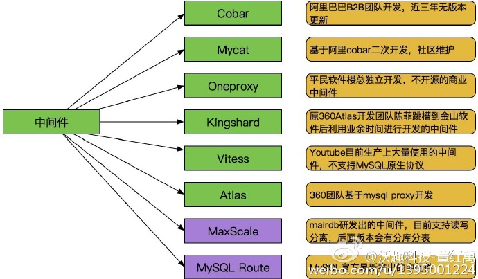

# 数据库分库分表

## 1.基本概念

### 1.1.分区

对业务透明，分区只不过把存放数据的文件分成了许多小块，例如mysql中的一张表对应三个文件.MYD,MYI,frm。

根据一定的规则把数据文件(MYD)和索引文件（MYI）进行了分割，分区后的表呢，还是一张表。分区可以把表分到不同的硬盘上，但不能分配到不同服务器上。

优点：数据不存在多个副本，不必进行数据复制，性能更高。

缺点：分区策略必须经过充分考虑，避免多个分区之间的数据存在关联关系，每个分区都是单点，如果某个分区宕机，就会影响到系统的使用。

### 1.2.分片

对业务透明，在物理实现上分成多个服务器，不同的分片在不同服务器上。
个人感觉跟分库没啥区别，只是叫法不一样而已，值得一提的是关系型数据库和nosql数据库分片的概念以及处理方式是一样的吗？

### 1.3.分表

当数据量大到一定程度的时候，都会导致处理性能的不足，这个时候就没有办法了，只能进行分表处理。

也就是把数据库当中数据根据按照分库原则分到多个数据表当中，这样，就可以把大表变成多个小表，不同的分表中数据不重复，从而提高处理效率。

分表也有两种方案：

1. 同库分表：所有的分表都在一个数据库中，由于数据库中表名不能重复，因此需要把数据表名起成不同的名字。

优点：由于都在一个数据库中，公共表，不必进行复制，处理更简单

缺点：由于还在一个数据库中，CPU、内存、文件IO、网络IO等瓶颈还是无法解决，只能降低单表中的数据记录数。

表名不一致，会导后续的处理复杂（参照mysql meage存储引擎来处理）

2. 不同库分表：由于分表在不同的数据库中，这个时候就可以使用同样的表名。

优点：CPU、内存、文件IO、网络IO等瓶颈可以得到有效解决，表名相同，处理起来相对简单

缺点：公共表由于在所有的分表都要使用，因此要进行复制、同步。
    一些聚合的操作，join,group by,order等难以顺利进行

### 1.4.分库

分表和分区都是基于同一个数据库里的数据分离技巧，对数据库性能有一定提升，但是随着业务数据量的增加，

原来所有的数据都是在一个数据库上的，网络IO及文件IO都集中在一个数据库上的，因此CPU、内存、文件IO、网络IO都可能会成为系统瓶颈。

当业务系统的数据容量接近或超过单台服务器的容量、QPS/TPS接近或超过单个数据库实例的处理极限等

此时，往往是采用垂直和水平结合的数据拆分方法，把数据服务和数据存储分布到多台数据库服务器上。

分库只是一个通俗说法，更标准名称是数据分片，采用类似分布式数据库理论指导的方法实现，对应用程序达到数据服务的全透明和数据存储的全透明

### 1.5.读写分离方案

海量数据的存储及访问，通过对数据库进行读写分离，来提升数据的处理能力。读写分离它的方案特点是数据库产生多个副本，
数据库的写操作都集中到一个数据库上，而一些读的操作呢，可以分解到其它数据库上。这样，只要付出数据复制的成本，
就可以使得数据库的处理压力分解到多个数据库上，从而大大提升数据处理能力。

## 2.常见的插件

### 2.1.Cobar 

是提供关系型数据库（MySQL）分布式服务的中间件，它可以让传统的数据库得到良好的线性扩展，并看上去还是一个数据库，对应用保持透明。

Cobar以Proxy的形式位于前台应用和实际数据库之间，对前台的开放的接口是MySQL通信协议，将前台SQL语句变更并按照数据分布规则发到合适的后台数据分库，再合并返回结果，模拟单库下的数据库行为。

Cobar属于中间层方案，在应用程序和MySQL之间搭建一层Proxy。中间层介于应用程序与数据库间，需要做一次转发，而基于JDBC协议并无额外转发，直接由应用程序连接数据库，性能上有些许优势。这里并非说明中间层一定不如客户端直连，除了性能，需要考虑的因素还有很多，中间层更便于实现监控、数据迁移、连接管理等功能。

Cobar属于阿里B2B事业群，始于2008年，在阿里服役3年多，接管3000+个MySQL数据库的schema,集群日处理在线SQL请求50亿次以上。

由于Cobar发起人的离职，Cobar停止维护。后续的类似中间件，比如MyCAT建立于Cobar之上，包括现在阿里服役的RDRS其中也复用了Cobar-Proxy的相关代码。

### 2.2.MyCAT*****

是社区爱好者在阿里cobar基础上进行二次开发，解决了cobar当时存
在的一些问题，并且加入了许多新的功能在其中。目前MyCAT社区活
跃度很高，目前已经有一些公司在使用MyCAT。总体来说支持度比
较高，也会一直维护下去，发展到目前的版本，已经不是一个单纯的MySQL代理了，它的后端可以支持MySQL,
SQL Server, Oracle, DB2,
PostgreSQL等主流数据库，也支持MongoDB这种新型NoSQL方式的存储，未来还会支持更多类型的存储。

MyCAT是一个强大的数据库中间件，不仅仅可以用作读写分离，以及分表分库、容灾管理，而且可以用于多租户应用开发、云平台基础设施，让你的架构具备很强的适应性和灵活性，借助于即将发布的MyCAT只能优化模块，系统的数据访问瓶颈和热点一目了然，根据这些统计分析数据，你可以自动或手工调整后端存储，将不同的表隐射到不同存储引擎上，而整个应用的代码一行也不用改变。

MyCAT是在Cobar基础上发展的版本，两个显著提高：后端由BIO改为NIO，并发量有大幅提高；
增加了对Order By, Group By, Limit等聚合功能

（虽然Cobar也可以支持Order By, Group By,Limit语法，但是结果没有进行聚合，只是简单返回给前端，聚合功能还是需要业务系统自己完成）

### 2.3.TDDL

是Tabao根据自己的业务特点开发了(Tabao Distributed Data Layer,
外号：头都大了)。主要解决了分库分表对应用的透明化以及异构数据库之间的数据复制，它是一个基于集中式配置的jdbc
datasourcce实现，具有主备，读写分离，动态数据库配置等功能。

TDDL并非独立的中间件，只能算作中间层，处于业务层和JDBC层中间，是以Jar包方式提供给应用调用，属于JDBC
Shard的思想。将用户的SQL路由到指定的数据库中。

#### 2.3.1.主要优点：

1.数据库主备和动态切换

2.带权重的读写分离

3.单线程读重试

4.集中式数据源信息管理和动态变更

5.剥离的稳定jboss数据源

6.支持mysql和oracle数据库

7.基于jdbc规范，很容易扩展支持实现jdbc规范的数据源

8.无server,client-jar形式存在，应用直连数据库

9.读写次数,并发度流程控制，动态变更

10.可分析的日志打印,日志流控，动态变更

TDDL必须要依赖diamond配置中心（diamond是淘宝内部使用的一个管理持久配置的系统，目前淘宝内部绝大多数系统的配置，由diamond来进行统一管理，同时diamond也已开源）。

TDDL动态数据源使用示例说明：http://rdc.taobao.com/team/jm/archives/1645

diamond简介和快速使用：http://jm.taobao.org/tag/diamond%E4%B8%93%E9%A2%98/

TDDL源码：https://github.com/alibaba/tb_tddl

TDDL复杂度相对较高。当前公布的文档较少，只开源动态数据源，分表分库部分还未开源，还需要依赖diamond，不推荐使用。

终其所有，我们研究中间件的目的是使数据库实现性能的提高。具体使用哪种还要经过深入的研究，严谨的测试才可决定

### 2.4.DRDS

是阿里巴巴自主研发的分布式数据库服务（此项目不开源）,DRDS脱胎于阿里巴巴开源的Cobar分布式数据库引擎，吸收了Cobar核心的Cobar-Proxy源码，实现了一套独立的类似MySQL-Proxy协议的解析端，能够对传入的SQL进行解析和处理，对应用程序屏蔽各种复杂的底层DB拓扑结构，获得单机数据库一样的使用体验，同时借鉴了淘宝TDDL丰富的分布式数据库实践经验，实现了对分布式Join支持，SUM/MAX/COUNT/AVG等聚合函数支持以及排序等函数支持，通过异构索引、小表广播等解决分布式数据库使用场景下衍生出的一系列问题，最终形成了完整的分布式数据库方案。

### 2.5.Atlas

是一个位于应用程序与MySQL之间的基于MySQL协议的数据中间层项目，它是在mysql-proxy
0.8.2版本上对其进行优化，360团队基于mysql proxy
把lua用C改写，它实现了MySQL的客户端和服务端协议，作为服务端与应用程序通讯，同时作为客户端与MySQL通讯。它对应用程序屏蔽了DB的细节。

Altas不能实现分布式分表，所有的字表必须在同一台DB的同一个DataBase里且所有的字表必须实现建好，Altas没有自动建表的功能。

原有版本是不支持分库分表，
目前已经放出了分库分表版本。在网上看到一些朋友经常说在高并
发下会经常挂掉，如果大家要使用需要提前做好测试。

源码地址：https://github.com/Qihoo360/Atlas

#### 2.5.1.Altas的一些新特性

1.主库宕机不影响读

主库宕机，Atlas自动将宕机的主库摘除，写操作会失败，读操作不受影响。从库宕机，Atlas自动将宕机的从库摘除，对应用没有影响。在mysql官方的proxy中主库宕机，从库亦不可用。

2.通过管理接口，简化管理工作，DB的上下线对应用完全透明，同时可以手动上下线。

3.自己实现读写分离

（1）为了解决读写分离存在写完马上就想读而这时可能存在主从同步延迟的情况，Altas中可以在SQL语句前增加 master 就可以将读请求强制发往主库。

（2）如图2中，主库可设置多项，用逗号分隔，从库可设置多项和权重，达到负载均衡。

4.自己实现分表

（1）需带有分表字段。

（2）支持SELECT、INSERT、UPDATE、DELETE、REPLACE语句。

（3）支持多个子表查询结果的合并和排序。

5.之前官方主要功能逻辑由使用lua脚本编写，效率低，Atlas用C改写，QPS提高，latency降低。

6.安全方面的提升

（1）通过配置文件中的pwds参数进行连接Atlas的用户的权限控制。

（2）通过client-ips参数对有权限连接Atlas的ip进行过滤。

（3）日志中记录所有通过Altas处理的SQL语句，包括客户端IP、实际执行该语句的DB、执行成功与否、执行所耗费的时间

7.平滑重启

通过配置文件中设置lvs-ips参数实现平滑重启功能，否则重启Altas的瞬间那些SQL请求都会失败。该参数前面挂接的lvs的物理网卡的ip，注意不是虚ip。平滑重启的条件是至少有两台配置相同的Atlas且挂在lvs之后

### 2.6.DBProxy

是美团点评DBA团队针对公司内部需求，在奇虎360公司开源的Atlas做了很多改进工作，形成了新的高可靠、高可用企业级数据库中间件

其特性主要有：读写分离、负载均衡、支持分表、IP过滤、sql语句黑名单、DBA平滑下线DB、从库流量配置、动态加载配置项

项目的Github地址是https://github.com/Meituan-Dianping/DBProxy

### 2.7.sharding-Sphere*****

源码地址：https://gitee.com/sharding-sphere/sharding-sphere

官方文档：https://shardingsphere.apache.org/

解读：https://blog.csdn.net/yangstarss/article/details/80177605

案例：：https://gitee.com/luckSnow/spring-boot-example/tree/master/lab_015_db_shardingsphere

Sharding-Sphere 是一套开源的分布式数据库中间件解决方案组成的生态圈，
它由Sharding-JDBC、Sharding-Proxy和Sharding-Sidecar（计划中）这3款相互独立的产品组成。 
他们均提供标准化的数据分片、分布式事务和数据库治理功能，可适用于如Java同构、异构语言、容器、云原生等各种多样化的应用场景。

Sharding-Sphere定位为关系型数据库中间件，旨在充分合理地在分布式的场景下利用关系型数据库的计算和存储能力，
而并非实现一个全新的关系型数据库。 它与NoSQL和NewSQL是并存而非互斥的关系。NoSQL和NewSQL作为新技术探索的前沿，放眼未来，
拥抱变化，是非常值得推荐的。反之，也可以用另一种思路看待问题，放眼未来，关注不变的东西，进而抓住事物本质。 
关系型数据库当今依然占有巨大市场，是各个公司核心业务的基石，未来也难于撼动，我们目前阶段更加关注在原有基础上的增量，而非颠覆

- Sharding-JDBC 定位为轻量级Java框架，在Java的JDBC层提供的额外服务。 
    它使用客户端直连数据库，以jar包形式提供服务，无需额外部署和依赖，可理解为增强版的JDBC驱动，完全兼容JDBC和各种ORM框架。
    适用于任何基于Java的ORM框架，如：JPA, Hibernate, Mybatis, Spring JDBC Template或直接使用JDBC。
    基于任何第三方的数据库连接池，如：DBCP, C3P0, BoneCP, Druid, HikariCP等。
    支持任意实现JDBC规范的数据库。目前支持MySQL，Oracle，SQLServer和PostgreSQL。

- Sharding-Proxy :定位为透明化的数据库代理端，提供封装了数据库二进制协议的服务端版本，用于完成对异构语言的支持。 
    目前先提供MySQL版本，它可以使用任何兼容MySQL协议的访问客户端(如：MySQL Command Client, MySQL Workbench等)操作数据，对DBA更加友好。
	向应用程序完全透明，可直接当做MySQL使用。
	适用于任何兼容MySQL协议的的客户端。

- Sharding-Sidecar（TBD） 定位为Kubernetes或Mesos的云原生数据库代理，以DaemonSet的形式代理所有对数据库的访问。 
  通过无中心、零侵入的方案提供与数据库交互的的啮合层，即Database Mesh，又可称数据库网格。 
  Database Mesh的关注重点在于如何将分布式的数据访问应用与数据库有机串联起来，它更加关注的是交互，是将杂乱无章的应用与数据库之间的交互有效的梳理。 
  使用Database Mesh，访问数据库的应用和数据库终将形成一个巨大的网格体系，应用和数据库只需在网格体系中对号入座即可，它们都是被啮合层所治理的对象。

### 2.8.Heisenberg

其优点：分库分表与应用脱离，分库表如同使用单库表一样，减少db连接数压力，热重启配置，可水平扩容，遵守MySQL原生协议，读写分离，无语言限制，

mysqlclient, c,
java都可以使用Heisenberg服务器通过管理命令可以查看，如连接数，线程池，结点等，并可以调整采用velocity的分库分表脚本进行自定义分库表，相当的灵活。

https://github.com/brucexx/heisenberg（开源版已停止维护）

### 2.9.CDS

JD. Completed Database Sharding.

CDS是一款基于客户端开发的分库分表中间件产品，实现了JDBC标准API，支持分库分表，读写分离和数据运维等诸多共，提供高性能，高并发和高可靠的海量数据路由存取服务，

业务系统可近乎零成本进行介入，目前支持MySQL, Oracle和SQL Server.

(架构上和Cobar，MyCAT相似，直接采用jdbc对接，没有实现类似MySQL协议，没有NIO,AIO，SQL
Parser模块采用JSqlParser,
Sql解析器有：druid>JSqlParser>fdbparser.)

### 2.10.DDB

网易. Distributed DataBase.

DDB经历了三次服务模式的重大更迭：Driver模式->Proxy模式->云模式。

Driver模式：基于JDBC驱动访问，提供一个db.jar, 和TDDL类似，
位于应用层和JDBC之间.
Proxy模式：在DDB中搭建了一组代理服务器来提供标准的MySQL服务，

在代理服务器内部实现分库分表的逻辑。应用通过标准数据库驱动访问DDB Proxy,
Proxy内部通过MySQL解码器将请求还原为SQL, 并由DDB Driver执行得到结果。

私有云模式：基于网易私有云开发的一套平台化管理工具Cloudadmin,
将DDB原先Master的功能打散，一部分分库相关功能集成到proxy中，

如分库管理、表管理、用户管理等，一部分中心化功能集成到Cloudadmin中，如报警监控，此外，Cloudadmin中提供了一键部署、自动和手动备份，版本管理等平台化功能。

### 2.11.OneProxy:

数据库界大牛，前支付宝数据库团队领导楼方鑫开发，基于mysql官方
的proxy思想利用c进行开发的，OneProxy是一款商业收费的中间件，
楼总舍去了一些功能点，

专注在性能和稳定性上。有朋友测试过说在 高并发下很稳定。

### 2.12.Oceanus

58同城数据库中间件

Oceanus致力于打造一个功能简单、可依赖、易于上手、易于扩展、易于集成的解决方案，甚至是平台化系统。拥抱开源，提供各类插件机制集成其他开源项目，

新手可以在几分钟内上手编程，分库分表逻辑不再与业务紧密耦合，扩容有标准模式，减少意外错误的发生。

### 2.13.Vitess

这个中间件是Youtube生产在使用的，但是架构很复杂。
与以往中间件不同，使用Vitess应用改动比较大要
使用他提供语言的API接口，我们可以借鉴他其中的一些设计思想。

### 2.14.Kingshard

Kingshard是前360Atlas中间件开发团队的陈菲利用业务时间
用go语言开发的，目前参与开发的人员有3个左右，
目前来看还不是成熟可以使用的产品，需要在不断完善。

### 2.15.MaxScale与MySQL Route

这两个中间件都算是官方的吧，MaxScale是mariadb (MySQL原作者维护的一个版本)研发的，目前版本不支持分库分表。

MySQL Route是现在MySQL 官方Oracle公司发布出来的一个中间件。
