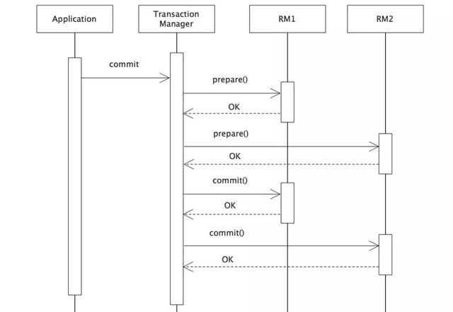

# 3.分片与分布式事务

- [一文读懂数据库优化之分库分表](https://mp.weixin.qq.com/s/lSxdx2QT3F9lZPZMxroQFA)
- [一口气搞懂分库分表 12 种分片算法](https://mp.weixin.qq.com/s/HBq0RhlTvQ8SZ4yfCPI3DQ)

## 1.分片

### 1.1.基本概念
分片的目标是提高数据访问的效率、系统的稳定性以及负载能力等三个方面。

1. 分区类：数据库提供的实现方案，不对业务透明，分区是根据策略将数据存储到本地不同的文件中，而对业务角度看来还是一张表。
    - 优点：数据被拆分为多个文件，性能得到很大的提升。
    - 缺点：分区策略必须经过充分考虑，避免跨区操作；因为数据依旧在本地，单点问题依旧存在。
    - 案例：MySQL和oracle分区策略相似，包括：列表、范围、hash等。
2. 代理类：通过在应用 和 数据库 之间增加一层代理，简化应用的数据库操作。
    - 案例：sharding-sphere：当当网开源，捐献给Apache，目前由京东维护
3. 客户端类：侵入到应用系统中，在系统中配置分片策略，实现数据库操作。
    - 案例：MyCAT是mycat团队基于阿里开源的Cobar二次开发，是一个彻底开源、面向企业应用开发的MySQL分片解决方案。

其他的中间件：Cobar，TDDL， DRDS， Atlas， DBProxy，CDS， DDB， OneProxy， Vitess， MaxScale与MySQL Route

### 1.2.分片方案

目前主流的方案任然是分库分表，但是根据具体的场景，方案上会有变化。

1. 同库分表：所有的分表都在一个数据库中，由于数据库中表名不能重复，因此需要把数据表名起成不同的名字。
    - 优点：由于都在一个数据库中，公共表，不必进行复制，处理更简单
    - 缺点：由于都在一个数据库中，CPU、内存、IO、网络等瓶颈还是无法解决，只能降低单表中的数据记录数。
2. 不同库分表：由于分表在不同的数据库中。
   - 优点：CPU、内存、文件IO、网络IO等瓶颈可以得到有效解决
   - 缺点：聚合类操作，join,group by,order等难以顺利进行

### 1.3.读写分离方案

海量数据的存储及访问，通过对数据库进行读写分离，来提升数据的处理能力。读写分离它的方案特点是数据库产生多个副本，
数据库的写操作都集中到一个数据库上，而一些读的操作呢，可以分解到其它数据库上。这样，只要付出数据复制的成本，
就可以使得数据库的处理压力分解到多个数据库上，从而大大提升数据处理能力。

### 1.4.适用场景

分库分表不一定同时进行，各种解决的问题不同。分库解决并发量问题，分表解决数据量问题。选择分表字段和分片算法是最核心的问题。

场景设计
1. 电商网站订单查询问题，包括如何根据用户id和订单id进行查询、分片查询等技巧，以提高查询效率和准确性。
   - 用户侧查询使用用户id 和 订单号，可以使用基因算法。
2. 商家如何查询自己的订单和订单报表，以及如何使用不同的方案解决查询问题，包括存储中间件、用户id库和均匀分片算法等。
   - 一般选择商家id为分片键。
3. 如何使用灵活的分片映射表来处理数据，并解决了二次扩容问题
   - 使用查分法。或者使用一致性hash算法。但是所有的扩容方案，都没办法解决数据迁移的问题。
### 1.5.分配策略

分片策略是分片键和分片算法的组合，真正用于实现数据分片操作的是分片键与相应的分片算法。在分片策略中，分片键确定了数据的拆分依据，分片算法则决定了如何对分片键值运算，将数据路由到哪个物理分片中。

以ShardingSphere为例，分配策略有：standard、complex、hint、inline、none 5种。
1. standard：标准分片策略，适用于单一分片键的场景。支持的SQL操作：支持精确分片，即在SQL中包含=、in操作符，以及范围分片，包括BETWEEN AND、>、<、>=、<=等范围操作符。
2. inline： 行表达式分片策略，适用于单一分片键的简单分片场景，支持SQL语句中=和in操作符。
3. complex：复合分片策略，适用于多个分片键的复杂分片场景，支持 SQL 语句中有>、>=、<=、<、=、IN 和 BETWEEN AND 等操作符。
4. hint： 强制分片策略，无需配置分片健，由分片算法指定分库和分表的结果。
5. none：没有策略，对逻辑表的所有操作将会执行全库表路由。

### 1.6.分片算法

常用的分片算法
- 取模。对分片键取模，非数字类型的分片键进行hash后取模。
- 范围（某个字段属于某个范围）。
- 日月年等时间。基于时间计算分片结果。
- 列表（某个字段的值与表名映射）
- 一致性hash算法。
- 查分法。常用于商用SaaS服务，比如设置多层计算、或者映射表，不同的用户走不同的分片算法等，本质就是各种个性化的
- 基因算法，用户id和订单号，通过计算将用户id融合到订单号中，这样通过堆这两个值进行hash运算的结果都是一样的。
    - 理论： 一个数与(2的n次方)取余，那么余数就是这个数的二进制的最后n位数。所有我们可以位操作符把高位清零就可以得到余数.

```shell
用户的uid为9, 分表4张，n=2, 那么  9%4 余数 1
9			4
0000 1001	0100
按照最后n=2位作为分库因子 01
订单表 oid(64位)=使用分布式ID生成62位(如雪花算法) + 分库因子
按照上述方法,可以保证同一个用户的所有订单,都落在同一个表上,可以通过用户uid%4定位库,也可以通过oid%4定位到库
```

总结：分片策略没有银弹，需要根据场景选择。
1. 常规分片算法：hash、时间、范围、列表等，均是常用简单已实现的，缺点就是后期扩宽需要迁移数据，需要预估好容量，提前完成分片。
2. 一致性hash算法：通过虚拟节点，可以在扩容后降低迁移的数据量。使用率较低。
3. 查分法：多是SaaS服务采用，为不同的用户定制个性化分片策略。
4. 基因算法：在需要两个信息进行绑定的时候使用。缺点非车明显，扩容后，原有的分片字段需要重新计算，目前使用率较低。

## 2.分片技术

### 2.1.sharding-Sphere

源码地址：https://gitee.com/sharding-sphere/sharding-sphere

官方文档：https://shardingsphere.apache.org/

解读：https://blog.csdn.net/yangstarss/article/details/80177605

Sharding-Sphere 是一套开源的分布式数据库中间件解决方案组成的生态圈，
它由Sharding-JDBC、Sharding-Proxy和Sharding-Sidecar（计划中）这3款相互独立的产品组成。
他们均提供标准化的数据分片、分布式事务和数据库治理功能，可适用于如Java同构、异构语言、容器、云原生等各种多样化的应用场景。

Sharding-Sphere定位为关系型数据库中间件，旨在充分合理地在分布式的场景下利用关系型数据库的计算和存储能力，
而并非实现一个全新的关系型数据库。 它与NoSQL和NewSQL是并存而非互斥的关系。NoSQL和NewSQL作为新技术探索的前沿，放眼未来，
拥抱变化，是非常值得推荐的。反之，也可以用另一种思路看待问题，放眼未来，关注不变的东西，进而抓住事物本质。
关系型数据库当今依然占有巨大市场，是各个公司核心业务的基石，未来也难于撼动，我们目前阶段更加关注在原有基础上的增量，而非颠覆

- Sharding-JDBC 定位为轻量级Java框架，在Java的JDBC层提供的额外服务。
  它使用客户端直连数据库，以jar包形式提供服务，无需额外部署和依赖，可理解为增强版的JDBC驱动，完全兼容JDBC和各种ORM框架。
  适用于任何基于Java的ORM框架，如：JPA, Hibernate, Mybatis, Spring JDBC Template或直接使用JDBC。
  基于任何第三方的数据库连接池，如：DBCP, C3P0, BoneCP, Druid, HikariCP等。
  支持任意实现JDBC规范的数据库。目前支持MySQL，Oracle，SQLServer和PostgreSQL。

- Sharding-Proxy :定位为透明化的数据库代理端，提供封装了数据库二进制协议的服务端版本，用于完成对异构语言的支持。
  目前先提供MySQL版本，它可以使用任何兼容MySQL协议的访问客户端(如：MySQL Command Client, MySQL Workbench等)操作数据，对DBA更加友好。
  向应用程序完全透明，可直接当做MySQL使用。
  适用于任何兼容MySQL协议的的客户端。

- Sharding-Sidecar（TBD） 定位为Kubernetes或Mesos的云原生数据库代理，以DaemonSet的形式代理所有对数据库的访问。
  通过无中心、零侵入的方案提供与数据库交互的的啮合层，即Database Mesh，又可称数据库网格。
  Database Mesh的关注重点在于如何将分布式的数据访问应用与数据库有机串联起来，它更加关注的是交互，是将杂乱无章的应用与数据库之间的交互有效的梳理。
  使用Database Mesh，访问数据库的应用和数据库终将形成一个巨大的网格体系，应用和数据库只需在网格体系中对号入座即可，它们都是被啮合层所治理的对象。

### 2.2.MyCAT

是社区爱好者在阿里cobar基础上进行二次开发，解决了cobar当时存
在的一些问题，并且加入了许多新的功能在其中。目前MyCAT社区活
跃度很高，目前已经有一些公司在使用MyCAT。总体来说支持度比
较高，也会一直维护下去，发展到目前的版本，已经不是一个单纯的MySQL代理了，它的后端可以支持MySQL,
SQL Server, Oracle, DB2,
PostgreSQL等主流数据库，也支持MongoDB这种新型NoSQL方式的存储，未来还会支持更多类型的存储。

MyCAT是一个强大的数据库中间件，不仅仅可以用作读写分离，以及分表分库、容灾管理，而且可以用于多租户应用开发、云平台基础设施，让你的架构具备很强的适应性和灵活性，借助于即将发布的MyCAT只能优化模块，系统的数据访问瓶颈和热点一目了然，根据这些统计分析数据，你可以自动或手工调整后端存储，将不同的表隐射到不同存储引擎上，而整个应用的代码一行也不用改变。

MyCAT是在Cobar基础上发展的版本，两个显著提高：后端由BIO改为NIO，并发量有大幅提高；
增加了对Order By, Group By, Limit等聚合功能

（虽然Cobar也可以支持Order By, Group By,Limit语法，但是结果没有进行聚合，只是简单返回给前端，聚合功能还是需要业务系统自己完成）

### 2.3.常见分片中间件

1. Cobar【代理】
   - 介绍：MySQL的代理层方案，属于阿里B2B事业群，始于2008年，在阿里服役3年多，接管3000+个MySQL数据库的schema，集群日处理在线SQL请求50亿次以上。
   - 现状：由于Cobar发起人的离职，Cobar停止维护。
2. Atlas【代理】
    - MySQL的代理层方案，它是360团队在mysql-proxy 0.8.2版本上对其进行优化，将lua用C改写。
    - 源码地址：https://github.com/Qihoo360/Atlas
    - 现状：已经没人维护了。
3. DBProxy【代理】
    - 美团DBA团队针对公司内部需求，在奇虎360公司开源的Atlas做了很多改进工作，形成了新的高可靠、高可用企业级数据库中间件
    - 其特性主要有：读写分离、负载均衡、支持分表、IP过滤、sql语句黑名单、DBA平滑下线DB、从库流量配置、动态加载配置项
    - 源码： https://github.com/Meituan-Dianping/DBProxy
   - 现状：已经没人维护了。
4. CDS【代理】
   - 代理层方案，实现了JDBC标准API，持MySQL, Oracle和SQL Server，支持分库分表，读写分离和数据运维等
   - 架构上和Cobar，MyCAT相似，但是直接采用jdbc对接，没有实现类似MySQL协议。
5. DDB【代理】
   - 网易. Distributed DataBase. 经历了三次服务模式的重大更迭：Driver模式->Proxy模式->云模式。
   - 私有云模式：基于网易私有云开发的一套平台化管理工具Cloudadmin, 将DDB原先Master的功能打散，一部分分库相关功能集成到proxy中。
6. OneProxy【代理】
   - 数据库界大牛，前支付宝数据库团队领导楼方鑫开发，基于mysql官方的proxy思想利用c进行开发的，OneProxy是一款商业收费的中间件。
7. Vitess:【代理】
   - 介绍：它是一个分布式 MySQL 工具集，它可以自动分片存储 MySQL 数据表，将单个 SQL 查询改写为分布式发送到多个 MySQL Server 上， 支持行缓存（比 MySQL 本身缓存效率高）与复制容错等。
   - Youtube在使用的，但是架构很复杂。与以往中间件不同，使用Vitess应用改动比较大要使用他提供语言的API接口，我们可以借鉴他其中的一些设计思想。
   - 京东的落地方案：https://mp.weixin.qq.com/s/ezj82fjm7C_nDIlm2psZqA
8. MaxScale与MySQL Route【代理】
   - 这两个中间件都算是官方的吧，MaxScale是mariadb (MySQL原作者维护的一个版本)研发的，目前版本不支持分库分表。
   - MySQL Route是现在MySQL 官方Oracle公司发布出来的一个中间件。
9. TDDL【客户端】
   - TDDL源码：https://github.com/alibaba/tb_tddl
   - 介绍：是阿里淘宝根据自己的业务特点开发的(Tabao Distributed Data Layer, 外号：头都大了)基于客户端实现，具有主备，读写分离，动态数据库配置等功能。
   - 现状：复杂度相对较高，当前公布的文档较少，只开源动态数据源，分表分库部分还未开源，还需要依赖diamond，不推荐使用，已经没人维护。

## 3.分布式ID

- 为什么需要分布式ID以及分布式ID的业务需求：https://www.itqiankun.com/article/1565060480
- [分布式唯一 ID 生成方案浅谈](https://mp.weixin.qq.com/s/10hn22MInanJXuT6wOYh1Q)
- [关于分布式唯一ID，snowflake的一些思考及改进(完美解决时钟回拨问题)](https://www.jianshu.com/p/b1124283fc43)
- 分布式ID之UUID适合做分布式ID吗：[https://www.itqiankun.com/article/1565060584](https://www.itqiankun.com/article/1565060584)
- 分布式ID之数据库自增ID实现分布式ID：[https://www.itqiankun.com/article/1565142723](https://www.itqiankun.com/article/1565142723)
- 分布式ID之Redis集群实现的分布式ID：[https://www.itqiankun.com/article/1565227901](https://www.itqiankun.com/article/1565227901)
- 分布式ID之雪法算法Snowflake实现分布式ID：[https://www.itqiankun.com/article/1565747019](https://www.itqiankun.com/article/1565747019)

### 3.1.使用场景

数据分片后，最先要解决的就是ID的问题。在复杂分布式系统中，往往需要对大量的数据和消息进行唯一标识，如在美团点评的金融、支付、餐饮、酒店、猫眼电影等产品的系统中数据逐渐增长，
对数据库分库分表后需要有一个唯一ID来标识一条数据或信息； 特别是订单、骑手、优惠券都需要有唯一ID做标识，此时一个能够生成全局唯一ID的系统是非常必要的，且这个ID跟业务系统进行关联。

一个好的分布式ID的特点
- 唯一性。必须的条件
- 单调性。确保使用的性能
- 递增性。具有时间上的关联性

### 3.2.常见方案

- 数据库，使用自增主键，专门有个表用来生产ID，普通的实现方案。
    - 缺点：需要一个单独的Mysql实例，虽然可行，但是基于性能与可靠性来考虑的话都不够，业务系统每次需要一个ID时，都需要请求数据库获取，性能低，并且如果此数据库实例下线了，那么将影响所有的业务系统。
- 数据库，双master集群，两个数据库自增id初始值不一样，自增步长是2，这样就是1,3,5,7和2,4,6,8
    - 缺点：相比方案主键自增，性能稍有提高，但是扩展性不足。
- 数据库，号段，不同的分片使用不同的区间,也是使用数据库实现的。
- Redis，数字自增，并不是十分合适的方案，因为数据可能丢失和重复ID
- Uuid，数据是字符串，无法做到数量连续或者递增
    - 优点：Uuid的标准是32个16进制数字，以连字符拼接在一起的5段数字。格式为8-4-4-4-12。性能非常高，本地生成，没有网络消耗
    - 缺点：数据完全乱序，非数字，作为索引性能低，且MySQL使用B+Tree的时候，会导致页分裂，极大的降低了数据库各方面性能
- Snowflake：完美的方案，推荐使用美团的算法（强依赖时间，所以最好关闭机器的时间同步）

以下框架提供了多种方案，主要以Snowflake为主：
- 百度（uid-generator）：[https：//github.com/baidu/uid-generator](https：//github.com/baidu/uid-generator)
- 美团（Leaf）：[https：//github.com/Meituan-Dianping/Leaf](https：//github.com/Meituan-Dianping/Leaf)
- 滴滴（TinyId）：[https：//github.com/didi/tinyid/wiki/tinyid原理介绍](https：//github.com/didi/tinyid/wiki/tinyid原理介绍)
- 注意：很多框架也提供了分布式ID的功能，比如Sharding-JDBC，hutool等


对以上方案进行解释
```text
1. 数据库，自增
CREATE TABLE SEQUENCE_ID (
    id bigint(20) unsigned NOT NULL auto_increment, 
    stub char(10) NOT NULL default '',
    PRIMARY KEY (id),
    UNIQUE KEY stub (stub)
);

使用方式:
begin;
replace into SEQUENCE_ID (stub) VALUES ('anyword');
select last_insert_id();
commit;

2. 数据库，双master集群
第一台Mysql实例配置：
set @@auto_increment_offset = 1;     -- 起始值
set @@auto_increment_increment = 2;  -- 步长

第二台Mysql实例配置：
set @@auto_increment_offset = 2;     -- 起始值
set @@auto_increment_increment = 2;  -- 步长
```

### 3.3.Snowflake

Twitter的分布式自增ID算法，最初Twitter把存储系统从MySQL迁移到Cassandra，因为Cassandra没有顺序ID生成机制，所有开发了这样一套全局唯一ID生成服务。

## 4.Snowflake算法

### 4.1.特性

Twitter的分布式雪花算法SnowFlake，经测试SnowFlake每秒可以产生26万个自增可排序的ID

- twitter的SnowFlake生成ID能够按照时间有序生成
- SnowFlake算法生成ID的结果是一个64Bit大小的整数，为一个Long型（转换成字符串后长度最多19）
- 分布式系统内不会产生ID碰撞（由datacenter 和 workerID做区分）并且效率较高
- 分布式系统中，有一些需要全局唯一ID的场景，生成ID的基本要求
- 在分布式环境下，必须全局唯一性
- 一般都需要单调递增，因为一般唯一ID都会存在数据库，而InnoDB的特性就是将内容存储在主键索引上的叶子节点，
  而且是从左往右递增的，所有考虑到数据库性能，一般生成ID也最好是单调递增的。为了防止ID冲突可以使用36位UUID，
  但是UUID有一些缺点，首先是它相对比较长，并且另外UUID一般是无序的
- 可能还会需要无规则，因为如果使用唯一ID作为订单号这种，为了不让别人知道一天的订单量多少，就需要这种规则

### 4.2.数据结构


在Java中64bit的正好是long类型，所以在SnowFlake算法生成的ID就是long类存储的

- 第一部分：二进制中最高位是符号位，1表示负数，0表示正数。生成的ID一般都是正整数，所以最高位固定为0。
- 第二部分：是41bit时间戳位，用来记录时间戳，毫秒级。41位可以表示 2^41 -1 个数字。
  如果只用来表示正整数，可以表示的范围是：0 ~ 2^41 -1毫秒的值，转换成单位年则是 69.73年
- 第三部分：分为工作机器ID，10Bit用来记录工作机器ID，可以部署在2^10 = 1024个节点，包括5位 datacenterId（数据中心，机房） 和 5位 workerID（机器码）
  5位可以表示的最大正整数是 2 ^ 5 = 31个数字，来表示不同的数据中心 和 机器码
- 第四部分：12位bit可以用来表示的正整数是 2^12 = 4095，即可以用0 ~ 4096，表示同一个机器同一个时间点可以产生的4095个ID。

总结：Snowflake 是一个跟时间成正相关的算法，结果为正整数。

第三 与 第四部分：1024 * 4096 = 419万。表示理论上一秒内可以生成的ID数量上限

第三部分一般是跟服务器相关，一个机器第三部分的值是固定的，所以单个实例，一秒内可以生成4096个ID。

### 4.3.优缺点

优点：
- 毫秒数在高维，自增序列在低位，整个ID都是趋势递增的
- 不依赖数据库等第三方系统，以服务的方式部署，稳定性更高，生成ID的性能也是非常高的
- 可以根据自身业务特性分配bit位，非常灵活

缺点：
- 依赖机器时钟，如果机器时钟回拨，会导致重复ID生成
- 在单机上是递增的，但由于涉及到分布式环境，每台机器上的时钟不可能完全同步，有时候会出现不是全局递增的情况，
  此缺点可以认为无所谓，一般分布式ID只要求趋势递增，并不会严格要求递增，90%的需求只要求趋势递增。

### 4.4.Tag【长度是18还是19之争】


网上有说生成的id转成字符串是18位，严格来说不准确。

先说标准版：时间超过一定值后，会变为19位。

忽略低位大概算一下：1e18 / (3600 * 24 * 365 * 1000 * 2^22) ≈ 7.56年，即时间差超过7.56年，就会达到19位。
比如以2010年1月1日为epoch，则差不多到2017年中就19位了。

实际改造版：数据标志（5bit）占据高5位，则数据标志 >=4, 即超过了19位。 即标准版保证18位的话，还能用个几年；

所有要求我们的算法中要严格保证固定位数。其中的epoch起始的时间戳，时间越近，我们能够使用的ID越多。

### 4.5.实现方案

#### 4.5.1.自己实现

雪花算法是由scala算法编写的，有人使用java实现，github地址

[https://github.com/beyondfengyu/SnowFlake/blob/master/SnowFlake.java](https://github.com/beyondfengyu/SnowFlake/blob/master/SnowFlake.java)

#### 4.5.2.开源工具

引入hutool工具类。也是完全实现了原始的snowflake算法。
```xml
<dependency>
    <groupId>cn.hutool</groupId>
    <artifactId>hutool-all</artifactId>
    <version>5.3.1</version>
</dependency>
```

#### 4.5.3.百度（uid-generator）

github地址：https://github.com/baidu/uid-generator

uid-generator使用的就是snowflake，只是在生产机器id，也叫做workId时有所不同。

uid-generator中的workId是由uid-generator自动生成的，并且考虑到了应用部署在docker上的情况，
在uid-generator中用户可以自己去定义workId的生成策略，默认提供的策略是：应用启动时由数据库分配。
说的简单一点就是：应用在启动时会往数据库表(uid-generator需要新增一个WORKER_NODE表)中去插入一条数据，
数据插入成功后返回的该数据对应的自增唯一id就是该机器的workId，而数据由host，port组成。

对于uid-generator中的workId，占用了22个bit位，时间占用了28个bit位，序列化占用了13个bit位，需要注意的是，
和原始的snowflake不太一样，时间的单位是秒，而不是毫秒，workId也不一样，同一个应用每重启一次就会消费一个workId。

具体可参考https://github.com/baidu/uid-generator/blob/master/README.zh_cn.md

#### 4.5.4.美团（Leaf）

github地址：https://github.com/Meituan-Dianping/Leaf

美团的Leaf也是一个分布式ID生成框架。它非常全面，即支持号段模式，也支持snowflake模式。号段模式这里就不介绍了，和上面的分析类似。

Leaf中的snowflake模式和原始snowflake算法的不同点，也主要在workId的生成，Leaf中workId是基于ZooKeeper的顺序Id来生成的，
每个应用在使用Leaf-snowflake时，在启动时都会都在Zookeeper中生成一个顺序Id，相当于一台机器对应一个顺序节点，也就是一个workId。

### 4.6.时间回拨问题处理

Snowflake算法需要解决的问题主要是时间回拨，导致生成重复的ID。

解决方案：
- 前提：大步长的回拨是不允许的，服务应该立即熔断、停止服务

- 方案1. 将用于生成id的服务器的时间回拨能力关闭，也就是时间自动同步功能。此方案存在问题，例如很多定时任务中间件，会要求C/S两端的时间差在一定的范围内，可能导致任务失败。
- 方案2：遇到回拨后直接报错，交给人工处理，缺点：官方方案，不符合实际操作，但是美团的leaf就是这个策略
- 方案3：小步长的回拨，比如3ms内，系统可以sleep3ms等待。缺点：大流量服务会造成一定程度的请求阻塞。
- 方案4：增加1000长度的数组，保存最近的值，当出现回退时，与数组中的值进行比较，每比较一次，ID+1，直到找到ID小于当前值的位置。
  此方案依旧存在ID重复的可能，但是从概率上会极大的降低冲突，且对性能影响非常小。

## 5.分布式事务解决方案

- 分布式事务问题的几种方案：[https://mp.weixin.qq.com/s/dVFQS8u0koQRdZXduEzM1g](https://mp.weixin.qq.com/s/dVFQS8u0koQRdZXduEzM1g)
- 分布式事务解决方案：[https://blog.csdn.net/gududedabai/article/details/82993594](https://blog.csdn.net/gududedabai/article/details/82993594)
- 分布式事务的四种解决方案：[https://www.cnblogs.com/mayundalao/p/11798502.html](https://www.cnblogs.com/mayundalao/p/11798502.html)
- [从刚性事务到柔性事务](https://www.jianshu.com/p/d70df89665b9)

分布式事务：由于分布式而引起的事务不一致的问题。在单体服务架构中，事务都是orm框架实现，spring进行隐式管理。
随着项目做大，模块拆分，数据库拆分。一个请求可能涉及到多个数据库，这样的事务只能保证自己处理的部分的事务，但是整个的事务就不能保证。

### 5.1.常见的解决方案

常见的解决方案
- 两阶段提交（2PC）与三阶段提交（3PC），强一致性，典型实现：XA协议
- Tcc（最终一致性）
- 事务消息（最终一致性）
- 本息消息表（最终一致性）

很多分库分表的框架可以自带了分布式事务的功能，比如：
- Atomikos：基于jta和数据库XA驱动的分布式事务插件，也就是在一个项目中调用多个数据源时可以使用的框架，2PC的实现方案
- Seata：阿里实现的分布式事务框架。
- TCC分布式事务：ByteTCC、himly、tcc-transaction
- Sharding-JDBC:支持XA协议，采用atomikos实现。

### 5.2.XA协议

XA协议：
- 作为资源管理器（数据库）与事务管理器的接口标准。
    - 事务管理器(TM)，负责管理全局事务的状态以及维护参与事务的资源管理器。连接数据库的应用程序
    - 资源管理器(RM)，负责具体的数据库操作。一个数据库就是一个资源管理器
- 目前，Oracle、mysql、DB2等各大数据库厂家都提供对XA的支持。
- XA协议采用两阶段提交（2PC）方式来管理分布式事务， 遵循事务的强一致性。
- XA接口提供资源管理器与事务管理器之间进行通信的标准接口。

XA协议接口核心包括两套函数，以xa_开头的及以ax_开头的，以下的函数使事务管理器可以对资源管理器进行的操作：
1. xa_open,xa_close：建立和关闭与资源管理器的连接。
2. xa_start,xa_end：开始和结束一个本地事务。
3. xa_prepare,xa_commit,xa_rollback：预提交、提交和回滚一个本地事务。
4. xa_recover：回滚一个已进行预提交的事务。
5. ax_开头的函数使资源管理器可以动态地在事务管理器中进行注册，并可以对XID(TRANSACTION IDS)进行操作。
6. ax_reg,ax_unreg；允许一个资源管理器在一个TMS(TRANSACTION MANAGER SERVER)中动态注册或撤消注册。

### 5.3.两阶段提交（2PC）与三阶段提交（3PC）

2PC: 准备阶段 与 提交阶段，以下为事务流程图 与 时序图：




缺点：
1. 同步阻塞：最大的问题即同步阻塞，即：所有参与事务的逻辑均处于阻塞状态，导致系统的并发性能降低。
   同时一般用在一个项目多数据源的场景
2. 单点：协调者存在单点问题，如果协调者出现故障，参与者将一直处于锁定状态。
3. 脑裂：在阶段2中，如果只有部分参与者接收并执行了Commit请求，会导致节点数据不一致。


3PC：三阶段提交协议，是2PC的改进版本，即将事务的提交过程分为CanCommit、PreCommit、doCommit三个阶段来进行处理。
相比2PC增加了一个协调者作为第三方进行事务控制。


- 优点：降低了阻塞范围，引入了超时机制，在等待超时后协调者或参与者会中断事务。
- 缺陷：脑裂问题依然存在，即在参与者收到PreCommit请求后等待最终指令，如果此时协调者无法与参与者正常通信，会导致参与者继续提交事务，造成数据不一致。

### 5.4.TCC

TCC 的全称是：Try、Confirm、Cancel。

- Try阶段：这个阶段说的是对各个服务的资源做检测以及对资源进行锁定或者预留。
- Confirm 阶段：这个阶段说的是在各个服务中执行实际的操作。
- Cancel阶段：如果任何一个服务的业务方法执行出错，那么这里就需要进行补偿，就是执行已经执行成功的业务逻辑的回滚操作。
  （把那些执行成功的回滚）

TCC事务是Try、confirm、Cancel三种指令的缩写，其逻辑模式类似于XA两阶段提交，但是实现方式是在代码层面来人为实现。
消除了2PC中协调者的单点问题。TCC中由事务发起者担任协调者。

这个方案我们用的也比较少，但是也有使用的场景。因为这个事务回滚实际上是严重依赖于你自己写代码来回滚和补偿了，
会造成补偿代码巨大，非常恶心。

### 5.5.事务消息

利用消息中间件来异步完成事务的后一半更新，实现系统的最终一致性。例如：RocketMQ

### 5.6.本息消息表

本息消息表，自定义补偿方式。

## 6.分布式事务技术实现

### 6.1.atomikos

atomikos是基于JTA和数据库XA驱动的分布式事务插件，XA协议协议oracle原本支持，mysql在5.6版本支持了该属性。
- 使用方式：DataSource Proxy的方式实现了XA。
- JTA（java Transaction API）是JavaEE 13 个开发规范之一。JDBC驱动程序的JTA支持极大地增强了数据访问能力。事务最简单最直接的目的就是保证数据的有效性，数据的一致性。

Atomikos TransactionsEssentials，是一个单独的软件，为Java平台提供增值服务的并且开源类事务管理器，以下是包括在这个开源版本中的一些功能：
- 全面崩溃 / 重启恢复
- 兼容标准的SUN公司JTA
- 嵌套事务
- 为XA和非XA提供内置的JDBC适配器


### 6.2.Seata
使用seat的spring cloud demo：[https://gitee.com/runmonk/seat.git](https://gitee.com/runmonk/seat.git)

由Seata看分布式事务取舍： [https://www.jianshu.com/p/917cb4bdaa03](https://www.jianshu.com/p/917cb4bdaa03)

### 6.3.常见面试题

1.【好未来】介绍下rocketmq？Rocketmq的事务消息的实现原理？知道哪些分布式事务的框架

常见分布式事务方案：[https://mp.weixin.qq.com/s/dVFQS8u0koQRdZXduEzM1g](https://mp.weixin.qq.com/s/dVFQS8u0koQRdZXduEzM1g)


