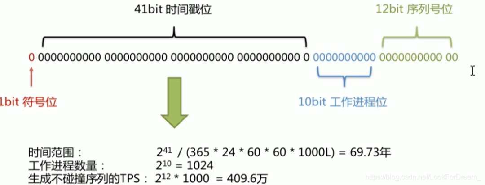

# 分布式ID

[代码案例](https://gitee.com/luckSnow/spring-boot-example/tree/master/lab_016_db_snowflake)

为什么需要分布式ID以及分布式ID的业务需求：https://www.itqiankun.com/article/1565060480

分布式ID之UUID适合做分布式ID吗：[https://www.itqiankun.com/article/1565060584](https://www.itqiankun.com/article/1565060584)

分布式ID之数据库自增ID实现分布式ID：[https://www.itqiankun.com/article/1565142723](https://www.itqiankun.com/article/1565142723)

分布式ID之Redis集群实现的分布式ID：[https://www.itqiankun.com/article/1565227901](https://www.itqiankun.com/article/1565227901)

分布式ID之雪法算法Snowflake实现分布式ID：[https://www.itqiankun.com/article/1565747019](https://www.itqiankun.com/article/1565747019)

## 1.使用场景

在复杂分布式系统中，往往需要对大量的数据和消息进行唯一标识，如在美团点评的金融、支付、餐饮、酒店、猫眼电影等产品的系统中数据逐渐增长，对数据库分库分表后需要有一个唯一ID来标识一条数据或信息；

特别是订单、骑手、优惠券都需要有唯一ID做标识

此时一个能够生成全局唯一ID的系统是非常必要的

比如：淘宝的订单号、美团的订单号，都是使用纯数字生成的唯一ID。且这个ID跟业务系统进行关联。

一个好的分布式ID的特点

- 唯一性。必须的条件
- 单调性。确保使用的性能
- 递增性。具有时间上的关联性

## 2.常见方案

- 数据库，使用自增主键，专门有个表用来生产ID，普通的实现方案
- 数据库，双master集群，两个数据库自增id初始值不一样，自增步长是2，这样就是1,3,5,7和2,4,6,8
- 数据库，号段，不同的分片使用不同的区间,也是使用数据库实现的。
- Redis，数字自增，并不是十分合适的方案，因为数据可能丢失和重复ID
- Uuid，数据是字符串，无法做到数量连续或者递增
- 雪花算法：完美的方案，推荐使用美团的算法（强依赖时间，所以最好关闭机器的时间同步）

### 2.1.数据库，自增
```sql
CREATE TABLE SEQUENCE_ID (
    id bigint(20) unsigned NOT NULL auto_increment, 
    stub char(10) NOT NULL default '',
    PRIMARY KEY (id),
    UNIQUE KEY stub (stub)
);
```

使用
```sql
begin;
replace into SEQUENCE_ID (stub) VALUES ('anyword');
select last_insert_id();
commit;
```

需要一个单独的Mysql实例，虽然可行，但是基于性能与可靠性来考虑的话都不够，业务系统每次需要一个ID时，都需要请求数据库获取，性能低，并且如果此数据库实例下线了，那么将影响所有的业务系统。

### 2.2.数据库，双master集群
```sql
第一台Mysql实例配置：
set @@auto_increment_offset = 1;     -- 起始值
set @@auto_increment_increment = 2;  -- 步长

第二台Mysql实例配置：
set @@auto_increment_offset = 2;     -- 起始值
set @@auto_increment_increment = 2;  -- 步长
```

相比方案以，性能稍有提高，但是扩展性不足。

### 2.3.数据库，号段

我们可以使用号段的方式来获取自增ID，号段可以理解成批量获取，从数据库获取ID时，如果能批量获取多个ID并缓存在本地的话，那样将大大提供业务应用获取ID的效率。

### 2.4.Redis自增

和数据库版本一样。

### 2.5.Uuid

优点：Uuid的标准是32个16进制数字，以连字符拼接在一起的5段数字。格式为8-4-4-4-12。性能非常高，本次生成，没有网络消耗

缺点：
1. 数据完全乱序，不是纯数字，以文本的形式保存。
2. MySQL使用B+Tree的时候，会导致页分裂，极大的降低了数据库各方面性能

### 2.6.Snowflake

Twitter的分布式自增ID算法

最初Twitter把存储系统从MySQL迁移到Cassandra（由Facebook开发一套开源分布式NoSQL数据库系统）因为Cassandra没有顺序ID生成机制，所有开发了这样一套全局唯一ID生成服务。

## 3.Snowflake算法

### 3.1.特性

Twitter的分布式雪花算法SnowFlake，经测试SnowFlake每秒可以产生26万个自增可排序的ID

- twitter的SnowFlake生成ID能够按照时间有序生成
- SnowFlake算法生成ID的结果是一个64Bit大小的整数，为一个Long型（转换成字符串后长度最多19）
- 分布式系统内不会产生ID碰撞（由datacenter 和 workerID做区分）并且效率较高
- 分布式系统中，有一些需要全局唯一ID的场景，生成ID的基本要求
- 在分布式环境下，必须全局唯一性
- 一般都需要单调递增，因为一般唯一ID都会存在数据库，而InnoDB的特性就是将内容存储在主键索引上的叶子节点，
  而且是从左往右递增的，所有考虑到数据库性能，一般生成ID也最好是单调递增的。为了防止ID冲突可以使用36位UUID，
  但是UUID有一些缺点，首先是它相对比较长，并且另外UUID一般是无序的
- 可能还会需要无规则，因为如果使用唯一ID作为订单号这种，为了不让别人知道一天的订单量多少，就需要这种规则

### 3.2.数据结构



在Java中64bit的正好是long类型，所以在SnowFlake算法生成的ID就是long类存储的

- 第一部分：二进制中最高位是符号位，1表示负数，0表示正数。生成的ID一般都是用整数，所以最高位固定为0。

- 第二部分：是41bit时间戳位，用来记录时间戳，毫秒级。41位可以表示 2^41 -1 个数字。

如果只用来表示正整数，可以表示的范围是：0 - 2^41 -1，减1是因为可以表示的数值范围是从0开始计算的，而不是从1。
也就是说41位可以表示 2^41 - 1 毫秒的值，转换成单位年则是 69.73年

- 第三部分：分为工作机器ID，10Bit用来记录工作机器ID

可以部署在2^10 = 1024个节点，包括5位 datacenterId（数据中心，机房） 和 5位 workerID（机器码）

5位可以表示的最大正整数是 2 ^ 5 = 31个数字，来表示不同的数据中心 和 机器码

- 第四部分

12位bit可以用来表示的正整数是 2^12 = 4095，即可以用0 1 2 ... 4094 来表示同一个机器同一个时间戳内产生的4095个ID序号。

总结：Snowflake 算法，是一个跟时间成正相关的算法，结果为正整数。

第三、四 2个部分：1024 * 4094 = 419万。表示同一秒内，理论上可以生成的最多ID数量。

第三部分一般是跟服务器相关，一个机器第三部分的值是固定的，所以单个实例，一秒内可以生成4094个ID。

### 3.3.优缺点

优点：
- 毫秒数在高维，自增序列在低位，整个ID都是趋势递增的
- 不依赖数据库等第三方系统，以服务的方式部署，稳定性更高，生成ID的性能也是非常高的
- 可以根据自身业务特性分配bit位，非常灵活

缺点：
- 依赖机器时钟，如果机器时钟回拨，会导致重复ID生成
- 在单机上是递增的，但由于涉及到分布式环境，每台机器上的时钟不可能完全同步，有时候会出现不是全局递增的情况，
  此缺点可以认为无所谓，一般分布式ID只要求趋势递增，并不会严格要求递增，90%的需求只要求趋势递增。

### 3.4.Tag【长度是18还是19之争】


网上有说生成的id转成字符串是18位，严格来说不准确。

先说标准版：时间超过一定值后，会变为19位。

忽略低位大概算一下：1e18 / (3600 * 24 * 365 * 1000 * 2^22) ≈ 7.56年，即时间差超过7.56年，就会达到19位。
比如以2010年1月1日为epoch，则差不多到2017年中就19位了。

实际改造版：数据标志（5bit）占据高5位，则数据标志 >=4, 即超过了19位。

即标准版保证18位的话，还能用个几年；而改造版的话，业务超过3种就不行了。

所有要求我们的算法中要严格保证固定位数。其中的epoch起始的时间戳，时间越近，我们能够使用的ID越多。

### 3.5.实现方案

#### 3.5.1.自己实现

雪花算法是由scala算法编写的，有人使用java实现，github地址

[https://github.com/beyondfengyu/SnowFlake/blob/master/SnowFlake.java](https://github.com/beyondfengyu/SnowFlake/blob/master/SnowFlake.java)

#### 3.5.2.开源工具

引入hutool工具类。也是完全实现了原始的snowflake算法。
```xml
<dependency>
    <groupId>cn.hutool</groupId>
    <artifactId>hutool-all</artifactId>
    <version>5.3.1</version>
</dependency>
```

#### 3.5.3.百度（uid-generator）

github地址：https://github.com/baidu/uid-generator

uid-generator使用的就是snowflake，只是在生产机器id，也叫做workId时有所不同。

uid-generator中的workId是由uid-generator自动生成的，并且考虑到了应用部署在docker上的情况，
在uid-generator中用户可以自己去定义workId的生成策略，默认提供的策略是：应用启动时由数据库分配。
说的简单一点就是：应用在启动时会往数据库表(uid-generator需要新增一个WORKER_NODE表)中去插入一条数据，
数据插入成功后返回的该数据对应的自增唯一id就是该机器的workId，而数据由host，port组成。

对于uid-generator中的workId，占用了22个bit位，时间占用了28个bit位，序列化占用了13个bit位，需要注意的是，
和原始的snowflake不太一样，时间的单位是秒，而不是毫秒，workId也不一样，同一个应用每重启一次就会消费一个workId。

具体可参考https://github.com/baidu/uid-generator/blob/master/README.zh_cn.md

#### 3.5.4.美团（Leaf）

github地址：https://github.com/Meituan-Dianping/Leaf

美团的Leaf也是一个分布式ID生成框架。它非常全面，即支持号段模式，也支持snowflake模式。号段模式这里就不介绍了，和上面的分析类似。

Leaf中的snowflake模式和原始snowflake算法的不同点，也主要在workId的生成，Leaf中workId是基于ZooKeeper的顺序Id来生成的，
每个应用在使用Leaf-snowflake时，在启动时都会都在Zookeeper中生成一个顺序Id，相当于一台机器对应一个顺序节点，也就是一个workId。

### 3.6.时间回拨问题处理

Snowflake算法需要解决的问题主要是时间回拨，导致生成重复的ID。

[https://www.jianshu.com/p/b1124283fc43](https://www.jianshu.com/p/b1124283fc43)

解决方案：（大步长的回拨是不允许的，服务应该立即熔断、停止服务）

1. 将用于生成id的服务器的时间回拨能力关闭
2. 遇到回拨后直接报错，交给人工处理（官方方案，不符合实际操作，但是美团的leaf就是这个策略）
3. 小步长的回拨，比如3ms内，系统可以sleep3ms等待。
4. 增加1000长度的数组，记录最近的值，当出现驳回的时候，与数组中的值进行比较，每比较一次，ID+1，直到找到ID小于当前值的位置。
    只是从概率上降低冲突。
5.    
