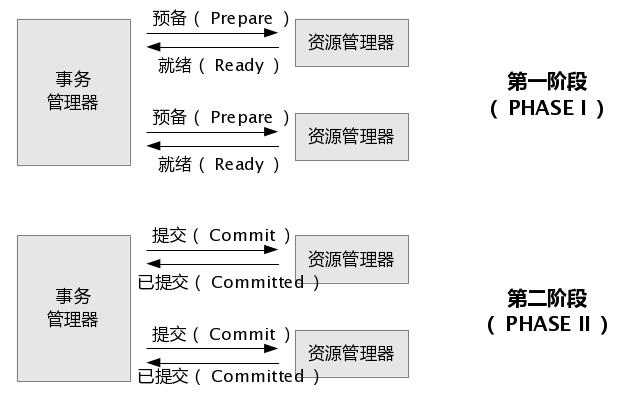
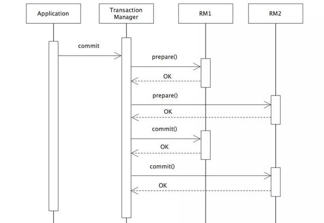
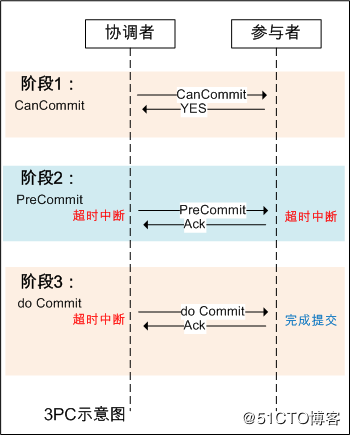

# 分布式事务

分布式事务：说到分布式事务，可以理解为，由于分布式而引起的事务不一致的问题。随着项目做大，模块拆分，数据库拆分。
一次包含增删改操作数据库涉及到了更新两个不同物理节点的数据库，这样的数据库事务只能保证自己处理的部分的事务，但是整个的事务就不能保证一致性。

## 1.分布式事务

一般事务的管理，都是orm框架封装实现，由spring进行隐式管理。这里只讲分布式事务。

很多分库分表的框架可以自带了分布式事务的功能，比如Sharding-JDBC。

- Atomikos：基于jta和数据库XA驱动的分布式事务插件，也就是在一个项目中调用多个数据源时可以使用的框架，实现的原理就是2pc
- Seata：阿里实现的分布式事务框架。
- TCC分布式事务：ByteTCC、himly、tcc-transaction

分布式事务问题的几种方案：[https://mp.weixin.qq.com/s/dVFQS8u0koQRdZXduEzM1g](https://mp.weixin.qq.com/s/dVFQS8u0koQRdZXduEzM1g)

分布式事务解决方案：[https://blog.csdn.net/gududedabai/article/details/82993594](https://blog.csdn.net/gududedabai/article/details/82993594)

分布式事务的四种解决方案：[https://www.cnblogs.com/mayundalao/p/11798502.html](https://www.cnblogs.com/mayundalao/p/11798502.html)

常见的实现方案
- XA协议（强一致性）
- 两阶段提交（2PC）与三阶段提交（3PC）
- Tcc（最终一致性）
- 事务消息（最终一致性）
- 本息消息表（最终一致性）

### 1.1.XA协议

XA协议：
- 作为资源管理器（数据库）与事务管理器的接口标准。
    - 事务管理器(TM)，负责管理全局事务的状态以及维护参与事务的资源管理器。一般是我们的应用程序
    - 资源管理器(RM)，负责具体的数据库操作。可以理解为一个数据库就是一个资源管理器
- 目前，Oracle、mysql、DB2等各大数据库厂家都提供对XA的支持。
- XA协议采用两阶段提交（2PC）方式来管理分布式事务。遵循事务的强一致性。
- XA接口提供资源管理器与事务管理器之间进行通信的标准接口。XA协议包括两套函数，以xa_开头的及以ax_开头的。

下图为XA协议的事务流程以及时序图

优缺点：
- 优点：对业务侵入性弱，对使用方透明。让用户想使用普通事务一样，不需要重新改造项目
- 缺点：
    1. 同步阻塞：最大的问题即同步阻塞，即：所有参与事务的逻辑均处于阻塞状态，导致系统的并发性能降低。
       同时一般用在一个项目多数据源的场景
    2. 单点：协调者存在单点问题，如果协调者出现故障，参与者将一直处于锁定状态。
    3. 脑裂：在阶段2中，如果只有部分参与者接收并执行了Commit请求，会导致节点数据不一致。

XA协议接口核心操作函数： 以下的函数使事务管理器可以对资源管理器进行的操作：
1. xa_open,xa_close：建立和关闭与资源管理器的连接。
2. xa_start,xa_end：开始和结束一个本地事务。
3. xa_prepare,xa_commit,xa_rollback：预提交、提交和回滚一个本地事务。
4. xa_recover：回滚一个已进行预提交的事务。
5. ax_开头的函数使资源管理器可以动态地在事务管理器中进行注册，并可以对XID(TRANSACTION IDS)进行操作。
6. ax_reg,ax_unreg；允许一个资源管理器在一个TMS(TRANSACTION MANAGER SERVER)中动态注册或撤消注册。

### 1.2.两阶段提交（2PC）与三阶段提交（3PC）

XA就是2PC。

3PC，三阶段提交协议，是2PC的改进版本，即将事务的提交过程分为CanCommit、PreCommit、doCommit三个阶段来进行处理

- 优点：降低了阻塞范围，引入了超时机制，在等待超时后协调者或参与者会中断事务。
- 缺陷：脑裂问题依然存在，即在参与者收到PreCommit请求后等待最终指令，如果此时协调者无法与参与者正常通信，会导致参与者继续提交事务，造成数据不一致。

### 1.3.TCC

TCC 的全称是：Try、Confirm、Cancel。

- Try阶段：这个阶段说的是对各个服务的资源做检测以及对资源进行锁定或者预留。
- Confirm 阶段：这个阶段说的是在各个服务中执行实际的操作。
- Cancel阶段：如果任何一个服务的业务方法执行出错，那么这里就需要进行补偿，就是执行已经执行成功的业务逻辑的回滚操作。
  （把那些执行成功的回滚）

TCC事务是Try、confirm、Cancel三种指令的缩写，其逻辑模式类似于XA两阶段提交，但是实现方式是在代码层面来人为实现。
消除了2pc中协调者的单点问题。TCC中由事务发起者担任协调者。

这个方案我们用的也比较少，但是也有使用的场景。因为这个事务回滚实际上是严重依赖于你自己写代码来回滚和补偿了，
会造成补偿代码巨大，非常之恶心。

### 1.4.事务消息

利用消息中间件来异步完成事务的后一半更新，实现系统的最终一致性。例如：RocketMQ

### 1.5.本息消息表

本息消息表，自定义补偿方式。

## 2.从刚性事务到柔性事务

[https://www.jianshu.com/p/d70df89665b9](https://www.jianshu.com/p/d70df89665b9)

## 3.atomikos
代码案例：https://gitee.com/luckSnow/spring-boot-example/tree/master/lab_017_db_atomikos

atomikos采用的是XA协议，oracle原本就支持，mysql在5.6版本支持了该属性，atomikos插件封装了该特性的一个中间件

网上针对分布式事务常见的例子有：转账我从农行转账100元到建设银行。首先，农行和建行的数据库是分开的，其次要在农行数据库中-100，
在建行数据库+100。分布式事务就是要保障建行+100出错了，使得农行回滚为原来的数目。

### 3.1.JTA
JTA（java Transaction API）是JavaEE 13 个开发规范之一。
java 事务API，允许应用程序执行分布式事务处理——在两个或多个网络计算机资源上访问并且更新数据。
JDBC驱动程序的JTA支持极大地增强了数据访问能力。事务最简单最直接的目的就是保证数据的有效性，数据的一致性。

atomikos 实现JTA事务管理第三方管理工具 ，一个是JOTM，一个是Atomikos。
在其他的博客中看到了JOTM最后更新日期是2010年，然后果断研究是Atomikos。

Atomikos TransactionsEssentials 是一个为Java平台提供增值服务的并且开源类事务管理器，以下是包括在这个开源版本中的一些功能：
- 全面崩溃 / 重启恢复
- 兼容标准的SUN公司JTA API
- 嵌套事务
- 为XA和非XA提供内置的JDBC适配器

### 3.2.总结
分布式事务，系统分布式后，必然会出现的技术问题。
小编就分布式事务来说，小编使用分布式事务的解决机制后，必然会造成性能的消耗。在项目建立的时候，要避免分布式事务，
如果实在避免不了，可以采取下面的几个方案：
1. 同一个web服务器，多个数据库，可以使用Atomikos
2. 跨越多个web服务器的事务，如果远程调用支持事务传播，那么使用JTA就可以；如果不支持事务传播，进尽量转化为一个web服务器的情况。

## 4.Seata

## 5.常见面试题

1.【好未来】介绍下rocketmq？Rocketmq的事务消息的实现原理？知道哪些分布式事务的框架

常见分布式事务方案：[https://mp.weixin.qq.com/s/dVFQS8u0koQRdZXduEzM1g](https://mp.weixin.qq.com/s/dVFQS8u0koQRdZXduEzM1g)

使用seat的spring cloud demo：[https://gitee.com/runmonk/seat.git](https://gitee.com/runmonk/seat.git)

由Seata看分布式事务取舍： [https://www.jianshu.com/p/917cb4bdaa03](https://www.jianshu.com/p/917cb4bdaa03)

