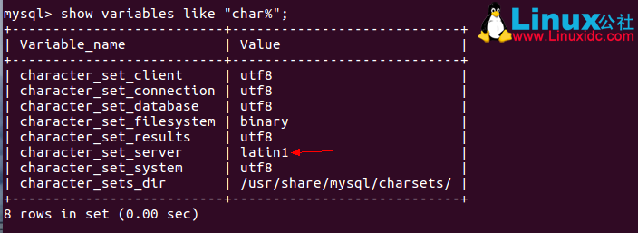
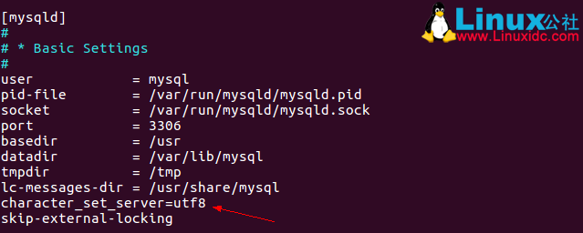
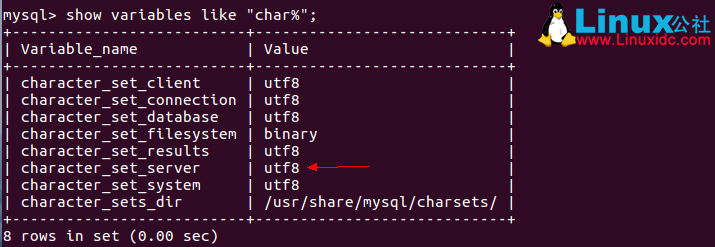

# 1.基础

官网：[https://www.mysql.com/](https://www.mysql.com/)

MySQL教程：[https://www.w3cschool.cn/mysql/](https://www.w3cschool.cn/mysql/)

MySQL教程：[https://www.runoob.com/mysql/mysql-tutorial.html](https://www.runoob.com/mysql/mysql-tutorial.html)

极客时间-MySQL实战45讲:[https://time.geekbang.org/column/intro/139](https://time.geekbang.org/column/intro/139)
	
MySQL8.0 特新:
- [MySQL 8.0.19亿级数据如何秒速增加字段](http://www.dreamwu.com/post-6761.html)
- [插入最快mysql8.0_MySQL8.0大表秒加字段，是真的吗？](https://blog.csdn.net/weixin_29733795/article/details/114018770)

MySQL经典36问！[https://mp.weixin.qq.com/s/Bzqx5WTnqMEGgOwkR8lw7g](https://mp.weixin.qq.com/s/Bzqx5WTnqMEGgOwkR8lw7g)

mysql学习专题：https://blog.csdn.net/edwin_hu/category_11741900.html

## 1.安装MySQL

### 1.1.下载与安装

下载地址：[https://www.mysql.com/downloads/](https://www.mysql.com/downloads/)

Mysql 5.7 Windows离线安装：[https://www.cnblogs.com/personblog/p/11911572.html](https://www.cnblogs.com/personblog/p/11911572.html)

MySQL5.7 CentOS7离线安装：[https://blog.csdn.net/qq_36582604/article/details/80526287](https://blog.csdn.net/qq_36582604/article/details/80526287)

MySQL5.7 CentOS7卸载： [https://www.jianshu.com/p/ef58fb333cd6](https://www.jianshu.com/p/ef58fb333cd6)

MySQL5.7 Ubuntu：在线安装：[https://blog.csdn.net/weixin_42209572/article/details/98983741](https://blog.csdn.net/weixin_42209572/article/details/98983741)

Mysql8.0 CentOS7：离线安装：[https://www.cnblogs.com/gkx0731/p/9739241.html](https://www.cnblogs.com/gkx0731/p/9739241.html)

### 1.2.修改字符集

导致导入时中文乱码的原因是character_set_server默认设置是latin1，如下图。


1.编辑配置文件。sudo vi /etc/mysql/mysql.conf.d/mysqld.cnf

2.在[mysqld]下添加一行character_set_server=utf8。如下图


3.重启MySQL服务。service mysql restart

4.登陆MySQL，并查看MySQL目前设置的编码show variables like "char%";



### 1.3.一台机器多实例部署

我们在生产和学习中可能遇到过这样的问题，一个机器上可能有3306,3308,3311等不同端口的数据库。

这个时候我们如果第一个想到的是使用安装包继续安装，那可就是对MySQL不太了解了。

因为MySQL支持在一个机器上创建多个MySQL实例的。

这里我们假设机器上已经有安装3306端口的MySQL数据库了。我们又需要创建一个3316端口的数据库。

以下案例以，MySQL5.6为例

#### 1.3.1.初始化数据库

不必理会其中的warning、ERROR信息
```shell
cd /usr/bin
./mysql_install_db --datadir=/home/data/mysqldata_7 --user=mysql
```
主要是为新的数据库创建一个数据文件存储位置。并制定创建的用户是mysql

#### 1.3.2.设置新实例的配置

在/etc 下创建配置 my_3316.cnf

注意，如果使用了innodb类型的数据库或者/etc/my.cnf里指定了innodb目录相关的参数，

这里一定要重新指定成适当位置，否则将会共用3316中的 innodb_data_home_dir 和 innodb_log_group_home_dir，
进而导致3316端口的mysql启动失败（没有权限或者文件被锁）。
```properties
[mysqld]
# GENERAL
#basedir									= /usr/local/mysql
datadir                                     = /data/mysql/mysqldata_3316
tmpdir                                      = /tmp
socket                                      = /data/mysql/mysqldata_3316/mysql_3316.sock
pid_file                                    = /data/mysql/mysqldata_3316/mysql_3316.pid
binlog_cache_size                           = 16M
user                                        = mysql
port                                        = 3316
explicit_defaults_for_timestamp             = true
character-set-server                        = utf8
skip-name-resolve
#bind-address                               = 192.168.1.37   # 绑定本地ip后，只能本地访问
bind-address                                = 0.0.0.0		 # 绑定所有ip。即可开放远程访问
sql-mode                                    = STRICT_TRANS_TABLES,NO_ENGINE_SUBSTITUTION

# INNODB
innodb_buffer_pool_size                     = 4G
innodb_buffer_pool_instances                = 1
innodb_thread_concurrency                   = 2
innodb_log_buffer_size                      = 32M
innodb_log_file_size                        = 1024M
innodb_online_alter_log_max_size            = 512M
innodb_open_files                           = 1024
innodb_purge_threads                        = 2
innodb_data_home_dir                  	    = /data/mysql/mysqldata_3316
innodb_data_file_path               		= ibdata1:128M:autoextend
innodb_read_io_threads                      = 4
innodb_write_io_threads                     = 2
innodb_file_per_table                       = 1
innodb_file_per_table                       = 1
innodb_flush_method                         = O_DIRECT
innodb_max_dirty_pages_pct                  = 90
innodb_flush_log_at_trx_commit              = 2

# MyISAM
key_buffer_size                             = 32M

# LOGS
#general_log                                = 1
#general_log_file                  		    = /data/mysql/logs_3316/mysql_general.log
log_warnings                                = 2

log_error                         		    = /data/mysql/logs_3316/mysql_error.log
slow_query_log                              = ON
slow_query_log_file                         = /data/mysql/logs_3316/mysql_slow.log
log_queries_not_using_indexes               = 1
long_query_time                             = 2
expire_logs_days                            = 15
log-bin                                     = mysql-bin.log
max_binlog_size                             = 512M
innodb_print_all_deadlocks                  = 1
relay-log                                   = relay-log
relay-log-index                             = relay-log
										    
# Replication                               
server-id                       		    = 2232235816 #可以随意设置，这里使用的是将ip转为数字。SELECT INET_ATON('192.168.1.37')
binlog_format                               = ROW
binlog_rows_query_log_events                = 1
										    
log_slave_updates                           = 1
slave_parallel_worker                       = 4
gtid-mode                                   = on
enforce_gtid_consistency                    = true
										    
# Replication Semi Sync                     
#rpl_semi_sync_master_enabled               = 1
#rpl_semi_sync_master_timeout               = 1000
#rpl_semi_sync_slave_enabled                = 1
#read_only                                  = 1
binlog_checksum                             = CRC32
slave_allow_batching                        = 1
master_verify_checksum                      = 1
slave_sql_verify_checksum                   = 1
master_info_repository                      = TABLE
relay_log_info_repository                   = TABLE
										    
# OTHER                                     
tmp_table_size                              = 32M
max_heap_table_size                         = 128M
query_cache_type                            = 0
query_cache_size                            = 0M
max_connections                             = 1024
thread_cache_size                           = 200
open_files_limit                            = 65535
innodb_buffer_pool_load_at_startup          = ON
innodb_buffer_pool_dump_at_shutdown         = ON
										    
# Monitoring                                
innodb_monitor_enable                       = '%'
performance_schema                          = ON
performance_schema_instrument               = '%=on'
```

#### 1.3.3.启动新实例
```shell
mysqld_safe --defaults-extra-file=/etc/my_3316.cnf --datadir=/data/mysql/mysqldata_3316 --user=mysql &
```

需要注意的是，还有一个参数--defaults-file，二者是有区别的：

--defaults-file ： 加载指定的配置文件，将会完全覆盖/etc/my.cnf中的配置

--default-extra-file： 加载配置文件中指定的项，不会完全覆盖/etc/my.cnf中的配置。
    如果同时在/etc/my.cnf中配置过，将会优先使用指定配置文件里的。

#### 1.3.4.访问新实例

必须指定-h，而且不能使用localhost
```shell
mysql -uroot -S /data/mysql/mysqldata_3316/mysql_3316.sock
```

#### 1.3.5.停止数据库

```shell
mysqladmin -uroot -S /data/mysql/mysqldata_3316/mysql_3316.sock shutdown
```

#### 1.3.6.可能会出现异常

```shell
140121 06:03:29 mysqld_safe Starting mysqld daemon with databases from /var/lib/mysql
2014-01-21 06:03:29 0 [Warning] TIMESTAMP with implicit DEFAULT value is deprecated. Please use --explicit_defaults_for_timestamp server option (see documentation for more details).
2014-01-21 06:03:29 14964 [Note] Plugin 'FEDERATED' is disabled.
2014-01-21 06:03:29 14964 [Note] InnoDB: The InnoDB memory heap is disabled
2014-01-21 06:03:29 14964 [Note] InnoDB: Mutexes and rw_locks use GCC atomic builtins
2014-01-21 06:03:29 14964 [Note] InnoDB: Compressed tables use zlib 1.2.3
2014-01-21 06:03:29 14964 [Note] InnoDB: Using Linux native AIO
2014-01-21 06:03:29 14964 [Note] InnoDB: Using CPU crc32 instructions
2014-01-21 06:03:29 14964 [Note] InnoDB: Initializing buffer pool, size = 128.0M
2014-01-21 06:03:29 14964 [Note] InnoDB: Completed initialization of buffer pool
2014-01-21 06:03:29 14964 [ERROR] InnoDB: auto-extending data file ./ibdata1 is of a different size 640 pages (rounded down to MB) than specified in the .cnf file: initial 768 pages, max 0 (relevant if non-zero) pages!
2014-01-21 06:03:29 14964 [ERROR] InnoDB: Could not open or create the system tablespace. If you tried to add new data files to the system tablespace, and it failed here, you should now edit innodb_data_file_path in my.cnf back to what it was, and remove the new ibdata files InnoDB created in this failed attempt. InnoDB only wrote those files full of zeros, but did not yet use them in any way. But be careful: do not remove old data files which contain your precious data!
2014-01-21 06:03:29 14964 [ERROR] Plugin 'InnoDB' init function returned error.
2014-01-21 06:03:29 14964 [ERROR] Plugin 'InnoDB' registration as a STORAGE ENGINE failed.
2014-01-21 06:03:29 14964 [ERROR] Unknown/unsupported storage engine: InnoDB
```

删除了如下三个文件：

```shell
[root@tserver mysql]# rm ibdata1  ib_logfile0  ib_logfile1 
rm: remove regular file `ibdata1'? yes      
rm: remove regular file `ib_logfile0'? yes
rm: remove regular file `ib_logfile1'? yes
```

### 1.4.容器化部署
```shell
# 1.创建容器
sudo docker run -p 3306:3306 --name mysql --privileged=true \
	-v /home/zhangxue/docker/mysql/logs:/var/log/mysql \
	-v /home/zhangxue/docker/mysql/data:/var/lib/mysql \
	-v /home/zhangxue/docker/mysql/conf:/etc/mysql/conf.d \
	-v /etc/localtime:/etc/localtime \
	-v /etc/timezone:/etc/timezone \
	-e MYSQL_ROOT_PASSWORD=root \
	-d mysql:5.7 --character-set-server=utf8mb4 --collation-server=utf8mb4_unicode_ci

# 2.创建配置文件 
/home/zhangxue/docker/mysql/conf/my.conf

[mysqld]
variables.html#sysvar_default_authentication_plugin
port=3306
skip-host-cache
skip-name-resolve
datadir=/var/lib/mysql
socket=/var/run/mysqld/mysqld.sock
secure-file-priv=/var/lib/mysql-files
user=mysql
pid-file=/var/run/mysqld/mysqld.pid

[client]
port=3306
default-character-set=utf8
socket=/var/run/mysqld/mysqld.sock

[mysql]
default-character-set=utf8

!includedir /etc/mysql/conf.d/


# 3.进入容器
sudo docker exec -it mysql bash

# 3.访问MySQL
mysql -h192.168.3.101 -P3306 -uroot -proot
```

## 2.常见命令

### 2.1.启动/关闭服务

```shell
./etc/init.d/mysql start
./etc/init.d/mysql stop
```

### 2.2.登录

mysql -h 数据库IP -u 用户名 -p[密码可选] -P端口号 [数据库可选]

```shell
# 手动输入密码登录
mysql -h192.168.3.120 -P3316 -uroot -p

# 登录，没有use db
mysql -h192.168.3.120 -P3316 -uroot -proot

# 登录并直接接入数据库中
mysql -h192.168.3.120 -P3316 -uroot -proot  ds0
```

### 2.3.导出

备份，将数据的结构与表内数据保存起来。 利用 mysqldump 指令完成。

mysqldump [options] db_name [tables]

mysqldump [options] ---database DB1 [DB2 DB3...]

mysqldump [options] --all--database

```shell
# 1.导出一张表
mysqldump -u用户名 -p密码 库名 表名 > 文件名(D:/a.sql)

# 2.导出多张表
mysqldump -u用户名 -p密码 库名 表1 表2表3 > 文件名(D:/a.sql)

# 3.导出所有表
mysqldump -u用户名 -p密码 库名 > 文件名(D:/a.sql)

#4.导出一个库
mysqldump -u用户名 -p密码 --lock-all-tables --database 库名 > 文件名(D:/a.sql)

可以-w携带WHERE条件
可以-d只导出表结构

# 5.设置导出的编码
mysqldump -u 账号 -p 数据库名称 --default-character-set=utf8 > fileName.sql

# 6.远程导出
mysqldump -h 127.0.0.1 -p 3306 -u root -p database > fileName.sql

# 7.按条件导出
mysqldump.exe -u 账号 -p 密码 -h 地址 -P 端口
  --skip-lock-tables 
  --default-character-set=utf8
  -d 表名
  -w="CREATE_TIME='2017-12-08'" > 文件名(D:/a.sql)
```
### 2.4.导入sql文件

```shell
# 方式1
mysql -uroot -p 数据库名

回车 输入密码

source fileName.sql

注意fileName.sql要有路径名，例如：source /home/user/data/fileName.sql

# 方式2

mysql -uroot -p database < fileName.sql

注意fileName.sql要有路径名

注意：

导入的sql文件大于1M的时候，mysql默认是导入不成功的。需要修改配置

打开MySQL安装目录下的my.ini文件--->在文件的最后增加一行配置“max_allowed_packet=10M”--->重启服务即可
```

## 3.基础教程

### 3.1.数据类型

MySQL中中的整数类bai型int主要有如下几种：

1. tinyint 的范围是-128~127；
2. int的范围是-2^31 (-2,147,483,648) 到 2^31 – 1 (2,147,483,647) 的整型dao数据（所有数字），存储大小为4个字节；
3. bigint的范围是 -2^63 (-9223372036854775808) 到 2^63-1 (9223372036854775807) 的整型数据（所有数字）。存储大小为 8 个字节；
4. smallint unsigned的范围是 –2^15（2^15表示2的15次幂） 到2^15 – 1，即 –32768 到 32767；
5. smallint 的范围是 0 到 2^16 – 1，即 0 到 65535，存储的字节是2个字节。

### 3.2.单行函数

[https://www.runoob.com/mysql/mysql-functions.html](https://www.runoob.com/mysql/mysql-functions.html)

### 3.3.SQL编程语法
```sql
// 局部变量 ----------
-- 变量声明
    declare var_name[,...] type [default value]
    这个语句被用来声明局部变量。要给变量提供一个默认值，请包含一个default子句。
	值可以被指定为一个表达式，不需要为一个常数。如果没有default子句，初始值为null

-- 赋值
使用 set 和 select into 语句为变量赋值。
    - 注意：在函数内是可以使用全局变量（用户自定义的变量）
    
// 全局变量 ----------
-- 定义、赋值
set 语句可以定义并为变量赋值。
set @var = value;

也可以使用 select into语句为变量初始化并赋值。
这样要求select语句只能返回一行，但是可以是多个字段，就意味着同时为多个变量进行赋值，变量的数量需要与查询的列数一致。

还可以把赋值语句看作一个表达式，通过select执行完成。
此时为了避免=被当作关系运算符看待，使用:=代替。（set语句可以使用= 和 :=）。

select @var:=20;
select @v1:=id, @v2=name from t1 limit 1;
select * from tbl_name where @var:=30;
select into 可以将表中查询获得的数据赋给变量。
    -| select max(height) into @max_height from tb;
	
-- 自定义变量名
为了避免select语句中，用户自定义的变量与系统标识符（通常是字段名）冲突，用户自定义变量在变量名前使用@作为开始符号。
@var=10;
    - 变量被定义后，在整个会话周期都有效（登录到退出）

// 控制结构 ----------
-- 
if语句
if search_condition then
    statement_list   
[elseif search_condition 
then
    statement_list]
...
[
else
    statement_list]
end if;

-- 
case语句
CASE value WHEN [compare-value] THEN result
[WHEN [compare-value] THEN result ...]
[ELSE result]
END

-- while循环

[begin_label:] 
while
 search_condition 
do
    statement_list
end
 
while
[end_label];
 
- 如果需要在循环内提前终止 
while
循环，则需要使用标签；标签需要成对出现。
    -- 退出循环
        退出整个循环 leave
        退出当前循环 iterate
        通过退出的标签决定退出哪个循环
```

### 3.4.MySQL特有SQL
- 分页

SELECT * FROM T_USER LIMIT 0, 10;
其中0表示从返回的结果第几个开始读取，10表示读取几个。
SELECT * FROM T_USER LIMIT 5;
表示返回前5个。

- 插入或更新
```sql
INSERT INTO  tableName (id, name)  values(1, 2)
    ON DUPLICATE KEY UPDATE  name=VALUES(name);
```

上面的mysql的一条语句实现了往表里插入数据，如果对应的主键上（假设主键是id）已经有数据了那么执行更新操作，更新字段name为新值。

注意：ON DUPLICATE KEY UPDATE只是MySQL的特有语法，并不是SQL标准语法！ 
这个语法和适合用在需要 判断记录是否存在,不存在则插入存在则更新的场景。比如，更新用户访问次数，没有记录则为1，有记录为num+1

```sql
INSERT INTO IP_LOG (id, num) values(1, 1) ON DUPLICATE  KEY UPDATE num = num + 1;
```

- 保存或忽略
当出现主键/唯一键 冲突的时候，不进行插入也不报错，返回结果 rows = 0
```sql
INSERT IGNORE INTO  tableName (id, name)  values(1, 2)
```

### 3.5.存储过程
菜鸟教程--存储过程：[https://www.runoob.com/w3cnote/mysql-stored-procedure.html](https://www.runoob.com/w3cnote/mysql-stored-procedure.html)

存储过程简单教程： [https://segmentfault.com/a/1190000018264669](https://segmentfault.com/a/1190000018264669)


### 3.6.执行计划

MySQL——执行计划——SQL案例：[https://www.cnblogs.com/sunjingwu/p/10755823.html](https://www.cnblogs.com/sunjingwu/p/10755823.html)

MySQL如何查询执行计划：
[https://www.cnblogs.com/klvchen/p/10137117.html](https://www.cnblogs.com/klvchen/p/10137117.html)

执行计划详解： [https://www.cnblogs.com/yinjw/p/11864477.html](https://www.cnblogs.com/yinjw/p/11864477.html)

## 4.数据库管理

数据库消息全部保存到information_schema中

### 4.1.数据库信息管理
```sql
-- 查询字段
SELECT * FROM information_schema.COLUMNS;

-- 查询表
SELECT * FROM information_schema.TABLES;

-- 查询索引
SELECT TABLE_NAME, INDEX_NAME, GROUP_CONCAT(COLUMN_NAME) AS INDEX_COLUMN
FROM
    information_schema.statistics
WHERE
    table_schema='ds0'
GROUP BY 
    TABLE_NAME, INDEX_NAME;
```

### 4.2.事务管理SQL

```sql
-- 查询 正在执行的事务
SELECT * FROM information_schema.INNODB_TRX

-- 查询 所有连接的session
SELECT * FROM INFORMATION_SCHEMA.PROCESSLIST;

-- 查看正在锁的事务
SELECT * FROM INFORMATION_SCHEMA.INNODB_LOCKS;

-- 查看等待锁的事务
SELECT * FROM INFORMATION_SCHEMA.INNODB_LOCK_WAITS;
```

## 5.用户管理
```sql
1.停止MySQL服务
2.[Linux] /usr/local/mysql/bin/safe_mysqld --skip-grant-tables &
  [Windows] mysqld --skip-grant-tables
3.use mysql;
4.UPDATE `user`SET PASSWORD=PASSWORD("密码") WHERE ` = "root";
5. FLUSH PRIVILEGES;
用户信息表：mysql.user

-- 刷新权限
FLUSH PRIVILEGES;

-- 增加用户
CREATE USER 用户名 IDENTIFIED BY [PASSWORD] 密码(字符串)
    - 必须拥有mysql数据库的全局CREATE USER权限，或拥有INSERT权限。
    - 只能创建用户，不能赋予权限。
    - 用户名，注意引号：如 
'user_name'@'192.168.1.1'
    - 密码也需引号，纯数字密码也要加引号
    - 要在纯文本中指定密码，需忽略PASSWORD关键词。
		要把密码指定为由PASSWORD()函数返回的混编值，需包含关键字PASSWORD
		
-- 重命名用户
RENAME USER old_user TO new_user	

-- 设置密码
--- 为当前用户设置密码
SET PASSWORD = PASSWORD('密码')  

--- 为指定用户设置密码
SET PASSWORD FOR 用户名 = PASSWORD('密码') 

-- 删除用户
DROP USER 用户名

-- 分配权限/添加用户
GRANT 权限列表 ON 表名 TO 用户名 [IDENTIFIED BY [PASSWORD] 'password']
    - all privileges 表示所有权限
    - *.* 表示所有库的所有表
    - 库名.表名 表示某库下面的某表
    GRANT ALL PRIVILEGES ON `pms`.* TO 'pms'@'%' IDENTIFIED BY 'pms0817';
	
-- 查看权限
SHOW GRANTS FOR 用户名

-- 查看当前用户权限
SHOW GRANTS; 或 SHOW GRANTS FOR CURRENT_USER; 或 SHOW GRANTS FOR CURRENT_USER();

-- 撤消权限
REVOKE 权限列表 ON 表名 FROM 用户名

-- 撤销所有权限
REVOKE ALL PRIVILEGES, GRANT OPTION FROM 用户名   

-- 权限层级
-- 要使用GRANT或REVOKE，您必须拥有GRANT OPTION权限，并且您必须用于您正在授予或撤销的权限。
全局层级：全局权限适用于一个给定服务器中的所有数据库，mysql.user
    GRANT ALL ON *.*和 REVOKE ALL ON *.*只授予和撤销全局权限。
数据库层级：数据库权限适用于一个给定数据库中的所有目标，mysql.db, mysql.host
    GRANT ALL ON db_name.*和REVOKE ALL ON db_name.*只授予和撤销数据库权限。
表层级：表权限适用于一个给定表中的所有列，mysql.talbes_priv
    GRANT ALL ON db_name.tbl_name和REVOKE ALL ON db_name.tbl_name只授予和撤销表权限。
列层级：列权限适用于一个给定表中的单一列，mysql.columns_priv
    当使用REVOKE时，您必须指定与被授权列相同的列。
	
-- 权限列表
ALL [PRIVILEGES]    -- 设置除GRANT OPTION之外的所有简单权限
ALTER   -- 允许使用ALTER TABLE
ALTER ROUTINE   -- 更改或取消已存储的子程序
CREATE  -- 允许使用CREATE TABLE
CREATE ROUTINE  -- 创建已存储的子程序
CREATE TEMPORARY TABLES     -- 允许使用CREATE TEMPORARY TABLE
CREATE USER     -- 允许使用CREATE USER, DROP USER, RENAME USER和REVOKE ALL PRIVILEGES。
CREATE VIEW     -- 允许使用CREATE VIEW
DELETE  -- 允许使用DELETE
DROP    -- 允许使用DROP TABLE
EXECUTE     -- 允许用户运行已存储的子程序
FILE    -- 允许使用SELECT...INTO OUTFILE和LOAD DATA INFILE
INDEX   -- 允许使用CREATE INDEX和DROP INDEX
INSERT  -- 允许使用INSERT
LOCK TABLES     -- 允许对您拥有SELECT权限的表使用LOCK TABLES
PROCESS     -- 允许使用SHOW FULL PROCESSLIST
REFERENCES  -- 未被实施
RELOAD  -- 允许使用FLUSH
REPLICATION CLIENT  -- 允许用户询问从属服务器或主服务器的地址
REPLICATION SLAVE   -- 用于复制型从属服务器（从主服务器中读取二进制日志事件）
SELECT  -- 允许使用SELECT
SHOW DATABASES  -- 显示所有数据库
SHOW VIEW   -- 允许使用SHOW CREATE VIEW
SHUTDOWN    -- 允许使用mysqladmin shutdown
SUPER   -- 允许使用CHANGE MASTER, KILL, PURGE MASTER LOGS和SET GLOBAL语句，mysqladmin debug命令；允许您连接（一次），即使已达到max_connections。
UPDATE  -- 允许使用UPDATE
USAGE   -- “无权限”的同义词
GRANT OPTION    -- 允许授予权限
```

### 5.1.创建用户

命令:CREATE USER 'username'@'host' IDENTIFIED BY 'password';

说明：

username：你将创建的用户名

host：指定该用户在哪个主机上可以登陆，如果是本地用户可用localhost，如果想让该用户可以从任意远程主机登陆，可以使用通配符%

password：该用户的登陆密码，密码可以为空，如果为空则该用户可以不需要密码登陆服务器

例子：
```sql
CREATE USER 'dog'@'localhost' IDENTIFIED BY '123456';
CREATE USER 'pig'@'192.168.1.101_' IDENDIFIED BY '123456';
CREATE USER 'pig'@'%' IDENTIFIED BY '123456';
CREATE USER 'pig'@'%' IDENTIFIED BY '';
CREATE USER 'pig'@'%';
```

### 5.2.授权

MySQL默认是不对外开放任何访问的。针对某个网络的IP，开放某个数据库的某一张表，并提供其访问密码（这个密码与数据库的实际密码可不一致）

grant 权限 PRIVILEGES on 数据库名.表 to root@'192.168.1.107' identified by 'password';

权限：select,insert,update,delete,create,drop,all

表名为*的时候，开发这个数据库中的所有的表

数据库名为*的时候，开放所有的数据库

ip为%的时候，为不限制链接的 IP。

修改权限后执行：flush privileges;

例子:
```sql
GRANT SELECT, INSERT ON test.user TO 'pig'@'%';
GRANT ALL ON *.* TO 'pig'@'%';
GRANT ALL ON maindataplus.* TO 'pig'@'%';
GRANT privileges ON databasename.tablename TO 'username'@'host' WITH GRANT OPTION;
```

### 5.3.设置与更改用户密码

命令:SET PASSWORD FOR 'username'@'host' = PASSWORD('newpassword');

如果是当前登陆用户用:SET PASSWORD = PASSWORD("newpassword");

例子:SET PASSWORD FOR 'pig'@'%' = PASSWORD("123456");

### 5.4.撤销用户权限

命令:REVOKE privilege ON databasename.tablename FROM 'username'@'host';

说明:privilege, databasename, tablename：同授权部分

例子:

REVOKE SELECT ON *.* FROM 'pig'@'%';

注意:

假如你在给用户'pig'@'%'授权的时候是这样的（或类似的）：GRANT SELECT ON test.user TO 'pig'@'%'，

则在使用REVOKE SELECT ON *.* FROM 'pig'@'%';命令并不能撤销该用户对test数据库中user表的SELECT 操作。

相反，如果授权使用的是GRANT SELECT ON *.* TO 'pig'@'%';
则REVOKE SELECT ON test.user FROM 'pig'@'%';
命令也不能撤销该用户对test数据库中user表的Select权限。

具体信息可以用命令SHOW GRANTS FOR 'pig'@'%'; 查看。

### 5.5.删除用户

注意一个用户可能有多个，比如用户admin,包括admin@192.168.1.2和admin@%，只是密码不同。

命令:DROP USER 'username'@'host';

## 6.数据库常见配置

这里的配置以MySQL 5.1 的my.ini为例。

```properties
[client]
port = 3306
socket = /tmp/mysql.sock  
[mysqld]
port = 3306
socket = /tmp/mysql.sock 
basedir = /usr/local/mysql
datadir = /data/mysql
pid-file = /data/mysql/mysql.pid
user = mysql
bind-address = 0.0.0.0
server-id = 1 #表示是本机的序号为1,一般来讲就是master的意思 
skip-name-resolve
# 禁止MySQL对外部连接进行DNS解析，使用这一选项可以消除MySQL进行DNS解析的时间。但需要注意，如果开启该选项，则所有远程主机连接授权都要使用IP地址方式，否则MySQL将无法正常处理连接请求 
#skip-networking 

back_log = 600
# MySQL能有的连接数量。当主要MySQL线程在一个很短时间内得到非常多的连接请求，这就起作用，
# 然后主线程花些时间(尽管很短)检查连接并且启动一个新线程。back_log值指出在MySQL暂时停止回答新请求之前的短时间内多少个请求可以被存在堆栈中。
# 如果期望在一个短时间内有很多连接，你需要增加它。也就是说，如果MySQL的连接数据达到max_connections时，新来的请求将会被存在堆栈中，
# 以等待某一连接释放资源，该堆栈的数量即back_log，如果等待连接的数量超过back_log，将不被授予连接资源。
# 另外，这值（back_log）限于您的操作系统对到来的TCP/IP连接的监听队列的大小。
# 你的操作系统在这个队列大小上有它自己的限制（可以检查你的OS文档找出这个变量的最大值），试图设定back_log高于你的操作系统的限制将是无效的。 

max_connections = 1000
# MySQL的最大连接数，如果服务器的并发连接请求量比较大，建议调高此值，以增加并行连接数量，当然这建立在机器能支撑的情况下，因为如果连接数越多，介于MySQL会为每个连接提供连接缓冲区，就会开销越多的内存，所以要适当调整该值，不能盲目提高设值。可以过'conn%'通配符查看当前状态的连接数量，以定夺该值的大小。 

max_connect_errors = 6000
# 对于同一主机，如果有超出该参数值个数的中断错误连接，则该主机将被禁止连接。如需对该主机进行解禁，执行：FLUSH HOST。 

open_files_limit = 65535
# MySQL打开的文件描述符限制，默认最小1024;当open_files_limit没有被配置的时候，比较max_connections*5和ulimit -n的值，哪个大用哪个，当open_file_limit被配置的时候，比较open_files_limit和max_connections*5的值，哪个大用哪个。 

table_open_cache = 128
# MySQL每打开一个表，都会读入一些数据到table_open_cache缓存中，当MySQL在这个缓存中找不到相应信息时，才会去磁盘上读取。默认值64
# 假定系统有200个并发连接，则需将此参数设置为200*N(N为每个连接所需的文件描述符数目)；
# 当把table_open_cache设置为很大时，如果系统处理不了那么多文件描述符，那么就会出现客户端失效，连接不上 

max_allowed_packet = 4M
# 导入数据文件的大小；增加该变量的值十分安全，这是因为仅当需要时才会分配额外内存。例如，仅当你发出长查询或MySQLd必须返回大的结果行时MySQLd才会分配更多内存。该变量之所以取较小默认值是一种预防措施，以捕获客户端和服务器之间的错误信息包，并确保不会因偶然使用大的信息包而导致内存溢出。 

binlog_cache_size = 1M
# 一个事务，在没有提交的时候，产生的日志，记录到Cache中；等到事务提交需要提交的时候，则把日志持久化到磁盘。默认binlog_cache_size大小32K 

max_heap_table_size = 8M
# 定义了用户可以创建的内存表(memory table)的大小。这个值用来计算内存表的最大行数值。这个变量支持动态改变 

tmp_table_size = 16M
# MySQL的heap（堆积）表缓冲大小。所有联合在一个DML指令内完成，并且大多数联合甚至可以不用临时表即可以完成。
# 大多数临时表是基于内存的(HEAP)表。具有大的记录长度的临时表 (所有列的长度的和)或包含BLOB列的表存储在硬盘上。
# 如果某个内部heap（堆积）表大小超过tmp_table_size，MySQL可以根据需要自动将内存中的heap表改为基于硬盘的MyISAM表。还可以通过设置tmp_table_size选项来增加临时表的大小。也就是说，如果调高该值，MySQL同时将增加heap表的大小，可达到提高联接查询速度的效果 

read_buffer_size = 2M
# MySQL读入缓冲区大小。对表进行顺序扫描的请求将分配一个读入缓冲区，MySQL会为它分配一段内存缓冲区。read_buffer_size变量控制这一缓冲区的大小。
# 如果对表的顺序扫描请求非常频繁，并且你认为频繁扫描进行得太慢，可以通过增加该变量值以及内存缓冲区大小提高其性能

read_rnd_buffer_size = 8M
# MySQL的随机读缓冲区大小。当按任意顺序读取行时(例如，按照排序顺序)，将分配一个随机读缓存区。进行排序查询时，
# MySQL会首先扫描一遍该缓冲，以避免磁盘搜索，提高查询速度，如果需要排序大量数据，可适当调高该值。但MySQL会为每个客户连接发放该缓冲空间，所以应尽量适当设置该值，以避免内存开销过大

sort_buffer_size = 8M
# MySQL执行排序使用的缓冲大小。如果想要增加ORDER BY的速度，首先看是否可以让MySQL使用索引而不是额外的排序阶段。
# 如果不能，可以尝试增加sort_buffer_size变量的大小 

join_buffer_size = 8M
# 联合查询操作所能使用的缓冲区大小，和sort_buffer_size一样，该参数对应的分配内存也是每连接独享 

thread_cache_size = 8
# 这个值（默认8）表示可以重新利用保存在缓存中线程的数量，当断开连接时如果缓存中还有空间，那么客户端的线程将被放到缓存中，
# 如果线程重新被请求，那么请求将从缓存中读取,如果缓存中是空的或者是新的请求，那么这个线程将被重新创建,如果有很多新的线程，
# 增加这个值可以改善系统性能.通过比较Connections和Threads_created状态的变量，可以看到这个变量的作用。(–>表示要调整的值)
# 根据物理内存设置规则如下：
# 1G  —> 8
# 2G  —> 16
# 3G  —> 32
# 大于3G  —> 64 

query_cache_size = 8M
#MySQL的查询缓冲大小（从4.0.1开始，MySQL提供了查询缓冲机制）使用查询缓冲，MySQL将SELECT语句和查询结果存放在缓冲区中，
# 今后对于同样的SELECT语句（区分大小写），将直接从缓冲区中读取结果。根据MySQL用户手册，使用查询缓冲最多可以达到238%的效率。
# 通过检查状态值'Qcache_%'，可以知道query_cache_size设置是否合理：如果Qcache_lowmem_prunes的值非常大，则表明经常出现缓冲不够的情况，
# 如果Qcache_hits的值也非常大，则表明查询缓冲使用非常频繁，此时需要增加缓冲大小；如果Qcache_hits的值不大，则表明你的查询重复率很低，
# 这种情况下使用查询缓冲反而会影响效率，那么可以考虑不用查询缓冲。此外，在SELECT语句中加入SQL_NO_CACHE可以明确表示不使用查询缓冲 

query_cache_limit = 2M
#指定单个查询能够使用的缓冲区大小，默认1M 

key_buffer_size = 4M
#指定用于索引的缓冲区大小，增加它可得到更好处理的索引(对所有读和多重写)，到你能负担得起那样多。如果你使它太大，
# 系统将开始换页并且真的变慢了。对于内存在4GB左右的服务器该参数可设置为384M或512M。通过检查状态值Key_read_requests和Key_reads，
# 可以知道key_buffer_size设置是否合理。比例key_reads/key_read_requests应该尽可能的低，
# 至少是1:100，1:1000更好(上述状态值可以使用SHOW STATUS LIKE 'key_read%'获得)。注意：该参数值设置的过大反而会是服务器整体效率降低 

ft_min_word_len = 4
# 分词词汇最小长度，默认4 

transaction_isolation = REPEATABLE-READ
# MySQL支持4种事务隔离级别，他们分别是：
# READ-UNCOMMITTED, READ-COMMITTED, REPEATABLE-READ, SERIALIZABLE.
# 如没有指定，MySQL默认采用的是REPEATABLE-READ，ORACLE默认的是READ-COMMITTED 

log_bin = mysql-bin
binlog_format = mixed
expire_logs_days = 30 #超过30天的binlog删除 
log_error = /data/mysql/mysql-error.log #错误日志路径
slow_query_log = 1
long_query_time = 1 #慢查询时间 超过1秒则为慢查询
slow_query_log_file = /data/mysql/mysql-slow.log 
performance_schema = 0
explicit_defaults_for_timestamp 
#lower_case_table_names = 1 #不区分大小写 
skip-external-locking #MySQL选项以避免外部锁定。该选项默认开启 
default-storage-engine = InnoDB #默认存储引擎 

innodb_file_per_table = 1
# InnoDB为独立表空间模式，每个数据库的每个表都会生成一个数据空间
# 独立表空间优点：
# 1．每个表都有自已独立的表空间。
# 2．每个表的数据和索引都会存在自已的表空间中。
# 3．可以实现单表在不同的数据库中移动。
# 4．空间可以回收（除drop table操作处，表空不能自已回收）
# 缺点：
# 单表增加过大，如超过100G
# 结论：
# 共享表空间在Insert操作上少有优势。其它都没独立表空间表现好。当启用独立表空间时，请合理调整：innodb_open_files 

innodb_open_files = 500
# 限制Innodb能打开的表的数据，如果库里的表特别多的情况，请增加这个。这个值默认是300 

innodb_buffer_pool_size = 64M
# InnoDB使用一个缓冲池来保存索引和原始数据, 不像MyISAM.
# 这里你设置越大,你在存取表里面数据时所需要的磁盘I/O越少.
# 在一个独立使用的数据库服务器上,你可以设置这个变量到服务器物理内存大小的80%
# 不要设置过大,否则,由于物理内存的竞争可能导致操作系统的换页颠簸.
# 注意在32位系统上你每个进程可能被限制在 2-3.5G 用户层面内存限制,
# 所以不要设置的太高. 

innodb_write_io_threads = 4

innodb_read_io_threads = 4
# innodb使用后台线程处理数据页上的读写 I/O(输入输出)请求,根据你的 CPU 核数来更改,默认是4
# 注:这两个参数不支持动态改变,需要把该参数加入到my.cnf里，修改完后重启MySQL服务,允许值的范围从 1-64 
innodb_thread_concurrency = 0
# 默认设置为 0,表示不限制并发数，这里推荐设置为0，更好去发挥CPU多核处理能力，提高并发量 

innodb_purge_threads = 1
# InnoDB中的清除操作是一类定期回收无用数据的操作。在之前的几个版本中，清除操作是主线程的一部分，这意味着运行时它可能会堵塞其它的数据库操作。
# 从MySQL5.5.X版本开始，该操作运行于独立的线程中,并支持更多的并发数。用户可通过设置innodb_purge_threads配置参数来选择清除操作是否使用单
# 独线程,默认情况下参数设置为0(不使用单独线程),设置为 1 时表示使用单独的清除线程。建议为1 

innodb_flush_log_at_trx_commit = 2
# 0：如果innodb_flush_log_at_trx_commit的值为0,log buffer每秒就会被刷写日志文件到磁盘，提交事务的时候不做任何操作（执行是由mysql的master thread线程来执行的。
# 主线程中每秒会将重做日志缓冲写入磁盘的重做日志文件(REDO LOG)中。不论事务是否已经提交）默认的日志文件是ib_logfile0,ib_logfile1
# 1：当设为默认值1的时候，每次提交事务的时候，都会将log buffer刷写到日志。
# 2：如果设为2,每次提交事务都会写日志，但并不会执行刷的操作。每秒定时会刷到日志文件。要注意的是，并不能保证100%每秒一定都会刷到磁盘，这要取决于进程的调度。
# 每次事务提交的时候将数据写入事务日志，而这里的写入仅是调用了文件系统的写入操作，而文件系统是有 缓存的，所以这个写入并不能保证数据已经写入到物理磁盘
# 默认值1是为了保证完整的ACID。当然，你可以将这个配置项设为1以外的值来换取更高的性能，但是在系统崩溃的时候，你将会丢失1秒的数据。
# 设为0的话，mysqld进程崩溃的时候，就会丢失最后1秒的事务。设为2,只有在操作系统崩溃或者断电的时候才会丢失最后1秒的数据。InnoDB在做恢复的时候会忽略这个值。
# 总结
# 设为1当然是最安全的，但性能页是最差的（相对其他两个参数而言，但不是不能接受）。如果对数据一致性和完整性要求不高，完全可以设为2，如果只最求性能，例如高并发写的日志服务器，设为0来获得更高性能 

innodb_log_buffer_size = 2M
# 此参数确定些日志文件所用的内存大小，以M为单位。缓冲区更大能提高性能，但意外的故障将会丢失数据。MySQL开发人员建议设置为1－8M之间 

innodb_log_file_size = 32M
# 此参数确定数据日志文件的大小，更大的设置可以提高性能，但也会增加恢复故障数据库所需的时间 

innodb_log_files_in_group = 3
# 为提高性能，MySQL可以以循环方式将日志文件写到多个文件。推荐设置为3 

innodb_max_dirty_pages_pct = 90
# innodb主线程刷新缓存池中的数据，使脏数据比例小于90% 

innodb_lock_wait_timeout = 120 
# InnoDB事务在被回滚之前可以等待一个锁定的超时秒数。InnoDB在它自己的锁定表中自动检测事务死锁并且回滚事务。InnoDB用LOCK TABLES语句注意到锁定设置。默认值是50秒 

bulk_insert_buffer_size = 8M
# 批量插入缓存大小， 这个参数是针对MyISAM存储引擎来说的。适用于在一次性插入100-1000+条记录时， 提高效率。默认值是8M。可以针对数据量的大小，翻倍增加。 

myisam_sort_buffer_size = 8M
# MyISAM设置恢复表之时使用的缓冲区的尺寸，当在REPAIR TABLE或用CREATE INDEX创建索引或ALTER TABLE过程中排序 MyISAM索引分配的缓冲区 


myisam_max_sort_file_size = 10G
# 如果临时文件会变得超过索引，不要使用快速排序索引方法来创建一个索引。注释：这个参数以字节的形式给出 

myisam_repair_threads = 1
# 如果该值大于1，在Repair by sorting过程中并行创建MyISAM表索引(每个索引在自己的线程内)   

interactive_timeout = 28800
# 服务器关闭交互式连接前等待活动的秒数。交互式客户端定义为在mysql_real_connect()中使用CLIENT_INTERACTIVE选项的客户端。默认值：28800秒（8小时） 

wait_timeout = 28800
# 服务器关闭非交互连接之前等待活动的秒数。在线程启动时，根据全局wait_timeout值或全局interactive_timeout值初始化会话wait_timeout值，取决于客户端类型(由mysql_real_connect()的连接选项CLIENT_INTERACTIVE定义)。参数默认值：28800秒（8小时）
# MySQL服务器所支持的最大连接数是有上限的，因为每个连接的建立都会消耗内存，因此我们希望客户端在连接到MySQL Server处理完相应的操作后，
# 应该断开连接并释放占用的内存。如果你的MySQL Server有大量的闲置连接，他们不仅会白白消耗内存，而且如果连接一直在累加而不断开，
# 最终肯定会达到MySQL Server的连接上限数，这会报'too many connections'的错误。对于wait_timeout的值设定，应该根据系统的运行情况来判断。
# 在系统运行一段时间后，可以通过show processlist命令查看当前系统的连接状态，如果发现有大量的sleep状态的连接进程，则说明该参数设置的过大，
# 可以进行适当的调整小些。要同时设置interactive_timeout和wait_timeout才会生效。 

[mysqldump]
quick
max_allowed_packet = 16M #服务器发送和接受的最大包长度 
[myisamchk]
key_buffer_size = 8M
sort_buffer_size = 8M
read_buffer = 4M
write_buffer = 4M
```

## 7.常见问题

### 7.1.开启远程访问

Linux版本的mysql，/etc/mysql/mysql.conf.d/mysqld.cnf 有如下的配置
```properties
bind-address = 127.0.0.1

# 表示mysql启动之后，会绑定ip到本地。其他的ip无法访问，这里我们将它注释掉就行了。
#bind-address = 127.0.0.1
```

### 7.2.导入大文件失败

导入的sql文件大于1M的时候，mysql默认是导入不成功的。需要修改配置。
打开MySQL安装目录下的my.ini文件--->在文件的最后增加一行配置“max_allowed_packet=10M”--->重启服务即可

### 7.3.释放连接池连接 

使用数据库连接池的时候，可能会遇到长时间没有人访问项目的时候，出现连接异常的问题（MySQL默认连接时间为8小时）。

如：Mysql Communications link failure

方案1、修改my.cnf： 将过期时间修改为1年。（多出现于dbcp中）

wait_timeout=31536000

interactive_timeout=31536000

方案2、使用druid连接池，会在连接池没有使用的时候，自动对连接进行维护，保证正常的连接。

MySQL 8小时问题，Mysql服务器默认连接的“wait_timeout”是8小时，也就是说一个connection空闲超过8个小时，
Mysql将自动断开该 connection。但是DBCP连接池并不知道连接已经断开了，如果程序正巧使用到这个已经断开的连接，程序就会报错误。

### 7.4.修改密码的限制

（5.7）： Your password does not satisfy the current policy requirements

 [https://blog.csdn.net/hello_world_qwp/article/details/79551789](https://blog.csdn.net/hello_world_qwp/article/details/79551789)
