# 2.索引

- [数据库内核月报](http://mysql.taobao.org/monthly/)
- [B+树、B-Link树、LSM树，解读一下常用的存储结构](https://blog.csdn.net/qq_38982302/article/details/127640096)
- [BTree和B+Tree详解](https://www.cnblogs.com/vianzhang/p/7922426.html)

## 1.基础架构

### 1.1.MySQL整体架构

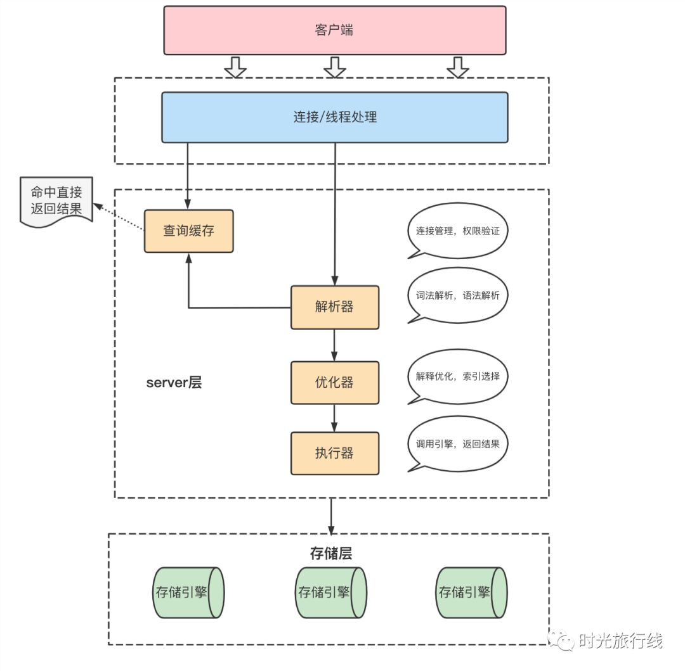

根据逻辑架构图我们大致能将MySQL分为三层：

1. 连接层：主要做连接处理、授权认证、安全保障等
2. server层：涵盖了MySQL大多数核心服务功能，包括查询解析、分析、优化、缓存以及所有内置函数（例如：日期，时间，数学和加密函数等）。存储过程，触发器，视图等跨存储引擎的功能也都在这一层实现。
3. 存储层：负责MySQL中的数据存储和提取。服务器通过API和存储引擎进行通信，API接口屏蔽了不同存储引擎之间的差异，使得这些差异对上层的查询过程透明。

主要的结构如下：
1. 连接器。MySQL使用tcp协议进行通讯。所以连接器负责维护与客户端建立连接、获取权限、维持和管理连接。
   - 我们可以使用命令查看所有连接： show processlist
   - 一般我们都使用长连接，wait_timeout=8h。如果一个连接超过8个小时没有操作，就会自动断开。
   - 数据库连接池一般都会设置，如果连接空闲超过一定时间，就会操作一次数据库，用来保持连接。
2. 查询缓存。以SQL语句作为key，缓存查询结果。
   - 缓存的更新策略：查询缓存的失效非常频繁，只要有对一个表的更新，这个表上所有的查询缓存都会被清空。所以这个缓存的用处不大。
   - MySQL8.0版本直接将查询缓存整个模块删除了。
3. 分析器。将SQL进行分析，知道要做什么。SQL的预处理就是这里完成的。
4. 优化器。知道SQL该怎么执行，比如使用哪个索引、执行顺序等。我们一般说的执行计划就是这个阶段产生的。
5. 执行器。选择存储引擎，执行SQL。
6. 存储引擎。MySQL替工可插拔的方式，对MySQL提供细粒度的数据操作接口

### 1.2.SQL执行过程

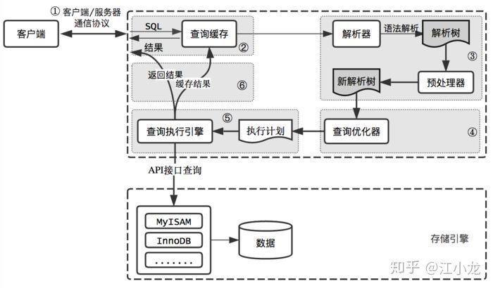

### 1.3.存储引擎

MySQL的存储引擎介绍：[https://blog.csdn.net/bbj12345678/article/details/120786449](https://blog.csdn.net/bbj12345678/article/details/120786449)

我们使用命令可以查看支持的存储引擎：SHOW ENGINES;

|Engine             |Support|Comment                                                       |Transactions|XA    |Savepoints |
|------------------|-------|--------------------------------------------------------------|------------|------|-----------|
|InnoDB             |DEFAULT|Supports transactions, row-level locking, and foreign keys    |YES         |YES   |YES        |
|MRG_MYISAM         |YES    |Collection of identical MyISAM tables                         |NO          |NO    |NO         |
|MEMORY             |YES    |Hash based, stored in memory, useful for temporary tables     |NO          |NO    |NO         |
|BLACKHOLE          |YES    |/dev/null storage engine (anything you write to it disappears)|NO          |NO    |NO         |
|MyISAM             |YES    |MyISAM storage engine                                         |NO          |NO    |NO         |
|CSV                |YES    |CSV storage engine                                            |NO          |NO    |NO         |
|ARCHIVE            |YES    |Archive storage engine                                        |NO          |NO    |NO         |
|PERFORMANCE_SCHEMA |YES    |Performance Schema                                            |NO          |NO    |NO         |
|FEDERATED          |NO     |Federated MySQL storage engine                                |(NULL)      |(NULL)|(NULL)     |

1. InnoDB：
   - MySQL5.5之后的默认存储引擎。支持事务安全表（ACID）、行锁、MVCC、隔离级别等。
   - 支持B+TREE（默认）、full text、hash、RTree。
   - InnoDB表对应两个文件，一个.frm表结构文件，一个.ibd数据文件(所有的索引都和数据在一个文件中)。InnoDB表最大支持64TB
2. MyISAM：
   - MySQL5.5之前默认存储引擎。不支持事务，只有表锁，
   - 支持B+TREE（默认）。
   - MyISAM表对应三个文件，一个.frm表结构文件，一个MYD表数据文件，一个.MYI索引文件。从MySQL5.0开始默认限制是256TB。
3. Memory：支持B+TREE（默认）
4. CSV
5. 基于rocksdb的MyRocks：LSM Tree

## 2.索引

- [深入了解索引](https://www.infoq.cn/article/OJKWYykjoyc2YGB0Sj2c)
- [BTree和B+Tree详解](https://www.cnblogs.com/vianzhang/p/7922426.html)
- [B+树、B-Link树、LSM树，解读一下常用的存储结构](https://blog.csdn.net/qq_38982302/article/details/127640096)

### 2.1.看前必读

<p style="color: red">索引是什么?</p>
索引是帮助MySQL高效获取数据的数据结构。使用更小的数据，更快的检索速度。

<p style="color: red">查看表的数据结构?</p>
排好序的快速查找数据结构！索引会影响where后面的查找，和order by 后面的排序。

```sql
SHOW INDEX FROM 表名;

Table        Non_unique  Key_name  Seq_in_index  Column_name   Collation  Cardinality  Sub_part  Packed  Null    Index_type  Comment  Index_comment
-----------  ----------  --------  ------------  ------------  ---------  -----------  --------  ------  ------  ----------  -------  ---------------
acc_account           0  PRIMARY              1  id            A                 5505    (NULL)  (NULL)          BTREE                               
acc_account           1  IDX_DATA             1  consume_date  A                 2351    (NULL)  (NULL)          BTREE
```

<p style="color: red">索引和存储引擎有什么关系?</p>
对于存储引擎而言，它需要存储的主要是数据文件和索引文件，存储引擎也决定了使用场景。

<p style="color: red">常见的《数据结构》与《存储结构》</p>

从基础的数组和链表，到哈希表，再到二叉搜索树、平衡二叉树、红黑树、跳跃表等，但是实际中作为存储结构的只有B树和LSM树两种。

这是因为：
- 存储结构需要磁盘存储。存储需要考虑磁盘IO，
    - 顺序与随机性能：一般情况下的性能： 内存顺序IO(100纳秒) > 内存随机IO 略大于 磁盘顺序IO 大于 磁盘随机IO（10ms）。
    - io次数：对于io操作次数越少越好，所有对存储引擎的存储单元要足够大，且连续。
- 存储结构要允许并发操作。
    - 在并发场景，要求引发的问题越少越好。这也要求必须有存储单元
    
所有基础的数据结构，没有存储单元无法解决io操作的问题。只有B树和LSM树同时满足条件。

B树是以页为单位组织的，InnoDB存储引擎中页的大小为16K，一般可以指出几百上千个指针，因而具有高扇出、低高度的特点，从而保证了B树是连续IO，并且IO次数极少。
同时也支持多种级别的锁和数据隔离级别。

<p style="color: red">索引结构数据如何更新？</p>

索引结构可以选择两种策略中的一种来处理更新，即就地（in place）更新和非就地（即异位，out of place）更新。
- 就地更新结构，如B+树，直接覆盖旧记录来存储新更新，可能出现 SMO（结构修改）
- 异位更新结构，如LSM-tree总是将更新存储到新的位置，而不是覆盖旧的条目。这种设计使用追加的顺序io提高了写性能，但是牺牲了读取性能，
  因为记录可能存储在多个位置中的任何一个。此外，这些结构通常需要一个独立的数据重组过程，以不断提高存储和查询效率。

<p style="color: red">SMO是什么呢</p>
Structure Modification Operation，也就是结构修改操作。向一个页中增加数据超过其大小，或者删除数据使其空间少于二分之一，
就会造成页的分裂或合并，影响关联节点或其父节点。并且，这种影响可能还会向上传递，甚至有可能造成根节点的分裂或合并。
所以为了保证出现SMO操作时读写的安全的话，就需要对有可能受SMO操作影响的节点加锁。
这也是大家一直诟病B树，一直在寻找其他存储结构的原因。后面就有了LSM

<p style="color: red">SSD技术的发展对数据库、索引结构都有什么影响？</p>

2014年，固态硬盘SSD开始进入大规模商用阶段。相比于传统的HDD，SSD除了性能大幅度提升外，还有两个显著的特性，
- 1.没有寻道时间，相比于机械硬盘，随机读性能有很大的提升；
- 2.SSD是基于闪存进行存储的，但闪存不能覆盖写，如果要修改一个块的内容的话，只能把整个闪存块擦除后才能写入。并且闪存的使用寿命就是和擦除次数直接关联的，
  如果能减少擦除次数，就相当于延长了SSD的使用寿命。这也是要求数据存储结构应该是单元化的。

SSD随机读取性能的提升，在很大程度上弥补了LSM树的读取性能弱这一短板；而LSM树追加写的写入模式，也有助于节省SSD擦除的损耗，并提升SSD的使用寿命

### 2.2.发展历史

- 1970年，Rudolf Bayer教授在“Organization and Maintenance of Large Ordered Indices”一文中提出了B树，从它基础上演化产生了B+树。
- B树成为主流后，因为其In-place update结构带来的先天写性能较差，学术界和工业界一直有对Out-of-place update结构的探索，
  直到LSM树的出现，成为了Out-of-place update结构特性的集大成者。
- 1996年 “The Log-Structured Merge-Tree (LSM-Tree)”论文发布，LSM树的概念正式诞生。
- 2003年 “The Google File System” Google分布式文件系统GFS发布，其对追加的一致性保证是要强于改写的，
  此后的分布式文件系统基本也都沿用了这个特性，推荐追加写文件，这就比较契合out-of-place update的特性。
- 2006年 “Bigtable: A Distributed Storage System for Structured Data” Google Bigtable发布，Bigtable基于GFS，
  采用了类似于LSM-Tree的存储结构，LSM树的存储结构在分布式场景下证实了其可行性。
- 同样是2006年，Intel发布了大家熟悉的酷睿（core）和至强（Xeon）系列多核处理器，标志着商用CPU全面迈入多核时代（此前已经有多核的处理器，但并不主流）。
  多核处理器的机制在很大程度上影响了存储机构的并发性能，无Latch（out-of-place update）的并发机制表现要远优于有Latch（in-place update）的并发机制。
- 2014年左右，固态硬盘SSD开始进入大规模商用阶段，LSM-Tree在SSD上有两个显著的优势。第一个是SSD没有寻道时间，相比于机械硬盘，
  读性能有很大的提升，很大程度上弥补了LSM树的读取性能弱这一短板；第二，SSD是基于闪存进行存储的，但闪存不能覆盖写，闪存块需要擦除才能写入。
  而LSM树追加写的写入模式，天然契合了SSD这种特性，从而很大程度上节省了擦除的损耗，并提升了SSD的使用寿命。

### 2.3.索引的分类

- 按照数据结构分类：
  - BTree索引、B+Tree索引、Hash索引、full-index全文索引、R-Tree索引
  - 目前索引结构主要分为两类：B树和LSM树两种。B树的变种主要有B+树、B*树、B-Link树、COW B树、惰性B树、Bw树等
- 按照应用层次分类
   - 普通索引：即一个索引只包含单个列，一个表可以有多个单列索引
   - 唯一索引：索引列的值必须唯一，但允许有空值
   - 复合索引：即一个索引包含多个列
- 根据中数据的物理顺序与键值的逻辑（索引）顺序关系：
  - 聚集索引。也叫 聚簇索引、主键索引。
  - 非聚集索引。也叫 二级索引、次级索引。

第一点描述的是索引存储时保存的形式，第二点是索引使用过程中进行的分类，两者是不同层次上的划分。
  
不过平时讲的索引类型一般是指在应用层次的划分。

<p style="color: red">索引的数据结构有哪些？</p>
- 哈希表（Hash Table）：哈希表的原理可以类比银行办业务取号，给每个人一个号（计算出的Hash值），叫某个号直接对应了某个人，索引效率是最高的O(1)，消耗的存储空间也相对更大。K-V存储组件以及各种编程语言提供的Map/Dict等数据结构，多数底层实现是用的哈希表。
- 二叉搜索树（Binary Search Tree）：有序存储的二叉树结构，在编程语言中广泛使用的红黑树属于二叉搜索树，确切的说是“不完全平衡的”二叉搜索树。从C++、Java的TreeSet、TreeMap，到Linux的CPU调度，都能看到红黑树的影子。Java的HashMap在发现某个Hash槽的链表长度大于8时也会将链表升级为红黑树，而相比于红黑树“更加平衡”的AVL树反而实际用的更少。
- 平衡多路搜索树（B-Tree）：这里的B指的是Balance而不是Binary，二叉树在大量数据场景会导致查找深度很深，解决办法就是变成多叉树，MongoDB的索引用的就是B-Tree。
- 叶节点相连的平衡多路搜索树（B+ Tree）：B+ Tree是B-Tree的变体，只有叶子节点存数据，叶子与相邻叶子相连，MySQL的索引用的就是B+树，Linux的一些文件系统也使用的B+树索引inode。其实B+树还有一种在枝桠上再加链表的变体：B*树，暂时没想到实际应用。
- 日志结构合并树（LSM Tree）：Log Structured Merge Tree，简单理解就是像日志一样顺序写下去，多层多块的结构，上层写满压缩合并到下层。LSM Tree其实本身是为了优化写性能牺牲读性能的数据结构，并不能算是索引，但在大数据存储和一些NoSQL数据库中用的很广泛，因此这里也列进去了。
- 字典树（Trie Tree）：又叫前缀树，从树根串到树叶就是数据本身，因此树根到枝桠就是前缀，枝桠下面的所有数据都是匹配该前缀的。这种结构能非常方便的做前缀查找或词频统计，典型的应用有：自动补全、URL路由。其变体基数树（Radix Tree）在Nginx的Geo模块处理子网掩码前缀用了；Redis的Stream、Cluster等功能的实现也用到了基数树（Redis中叫Rax）。
- 跳表（Skip List）：是一种多层结构的有序链表，插入一个值时有一定概率“晋升”到上层形成间接的索引。跳表更适合大量并发写的场景，不存在红黑树的再平衡问题，Redis强大的ZSet底层数据结构就是哈希加跳表。
- 倒排索引（Inverted index）：这样翻译不太直观，可以叫“关键词索引”，比如书籍末页列出的术语表就是倒排索引，标识出了每个术语出现在哪些页，这样我们要查某个术语在哪用的，从术语表一查，翻到所在的页数即可。倒排索引在全文索引存储中经常用到，比如ElasticSearch非常核心的机制就是倒排索引；Prometheus的时序数据库按标签查询也是在用倒排索引。

### 2.4.Latch和Lock

- Lock是用来维持数据库事务的ACID特性的，它是事务级隔离的，对用户是透明的，锁住的对象是用户的数据，是一个逻辑概念，我们熟知的Lock主要有共享锁和排他锁，一般称作S锁和X锁。
- Latch则是用来保护我们读取过程中加载到内存中数据结构的，它是线程级隔离的，主要是防止两个线程同时修改一块内存结构，或者一个线程读取另一个线程正在修改的内存结构。

比如假设我们修改一行数据，就需要数据所在的页加载到内存中，在修改前要防止别的线程也来修改这个页，所以要对它加Latch。
加好Latch后，就修改这行数据了，为了防止在事务提交之前别的事务读到修改后未提交的数据，所以要对它加一个Lock。

所以Latch锁一个页，Lock才锁一行数据，那Lock实际没必要啊。其实不然，在修改完成后，当前执行的SQL对这个页就不会做任何操作了，
所以Latch就可以释放了；而事务还没结束，所以Lock还要等到事务提交才能释放。在修改完成到事务提交这段时间里，Lock就能发挥作用了。

我们在对数据库做操作时，实际是有Latch和Lock共同生效的。

### 2.5.B树及其变种

#### 2.5.1.BTree

BTree能加快数据的访问速度，因为存储引擎不再需要进行全表扫描来获取数据，数据分布在各个节点之中。

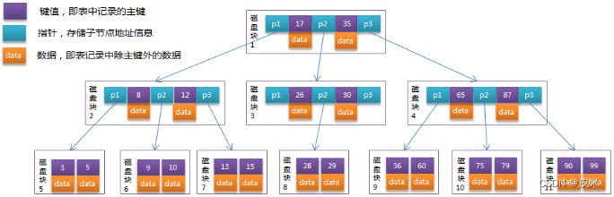

#### 2.5.2.B+Tree

是BTree的改进版本，同时也是数据库索引默认采用的存储结构。以页为单位存储数据，数据都在叶子节点上，并且增加了顺序访问指针，每个叶子节点都指向相邻的叶子节点的地址。

相比BTree来说，进行范围查找时只需要查找两个节点，进行遍历即可。而BTree需要获取所有节点，相比之下B+Tree效率更高。

如图为M阶B+Tree(M=3)，从图中可以看出，与BTree有所不同，具有高扇出、低高度的特点，3层就可以存在几千万的数据，查询单条数据最多3次io就可以实现。

1. 非叶子节点不保存data，只保存索引
2. 某一节点有几个子节点，就有几个key
3. 所有key都在叶子节点出现
4. 所有叶子节点链接成一个有序的链表
5. 利用二分查找，快速定位


<p style="color: red">缺点有哪些？</p>
1. 空间利用率为1/2。1/2是理论值。一个叶子节点满而分裂时，默认状态下会分裂成两个各占一半数据的节点。
2. B+树令人诟病的一点就是它在读写过程中需要对整个树、或一层层向下加Latch，从而造成SMO操作会阻塞其他操作

<p style="color: red">以下是案例</p>
假设有一张学生表，id为主键

|id      |name      |birthday      |
|--------|----------|--------------|
|1       |Tom       |1996-01-01    |
|2       |Jann      |1996-01-04    |
|3       |Ray       |1996-01-08    |
|4       |Michael   |1996-01-10    |
|5       |Jack      |1996-01-13    |
|6       |Steven    |1996-01-23    |
|7       |Lily      |1996-01-25    |

在MyISAM、B+TREE 的实现。

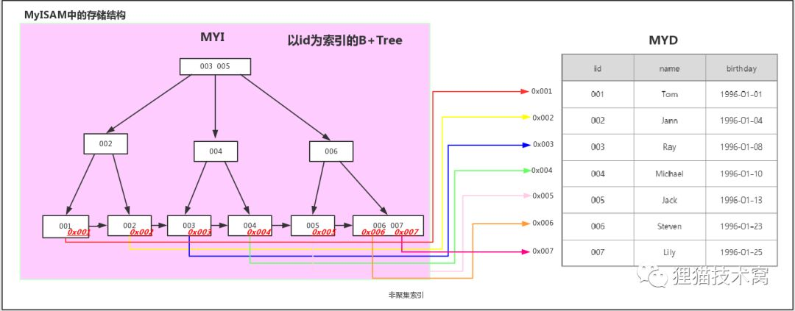

在InnoDB、B+TREE 的实现

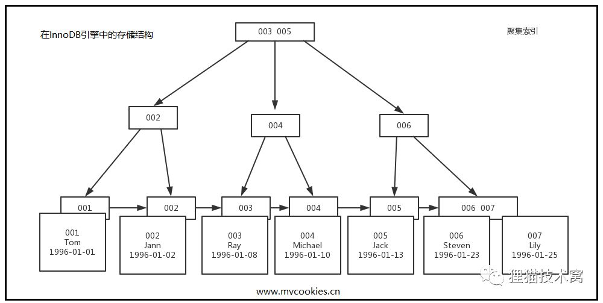

#### 2.5.3.B*树

相比B+Tree有更高的空间利用率2/3。在一个节点满了，却又有新数据要插入进来，他会把其部分数据搬迁到下一个兄弟节点，
直到两个节点空间都满了，就在中间生成一个节点，三个节点平分原来两个节点的数据。

这种设计虽然可以提升空间利用率，对减少层数，提升读性能有一定帮助，但这种模式还是增加了写入的复杂度，向右兄弟节点搬迁数据的过程也要视作一种SMO操作，
对写入和并发能力有极大的损耗，所以这种设计没有被大量使用

#### 2.5.4.B-Link树

B-Link树相比B+树主要有三点区别：
- 非叶子节点也都有指向右兄弟节点的指针
- 分裂模式上，采用和B*树类似的做法
- 每个节点都增加一个High key值，记录当前节点的最大key

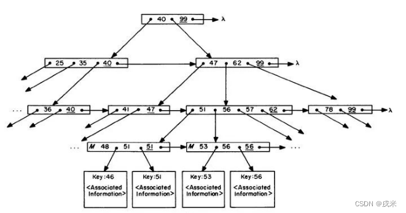

B+树令人诟病的一点就是它在读写过程中需要对整个树、或一层层向下加Latch，从而造成SMO操作会阻塞其他操作。而B-Link树通过对分裂和查找过程的调整，避免了这一点

基于B*树的思路。先把老节点的数据拷贝到新节点，然后建立同一层节点间的连接关系，最后再建立从父节点指向新节点的连接关系

B-Link树仍是一种非常优秀的存储结构，在很大程度上突破了B+树的性能瓶颈，在我们熟知的数据库中，PostgreSQL的B树索引类型，
就是基于B-Link树来实现的。这可能也是在很多场景下PG的性能要优于MySQL的原因之一吧。

#### 2.5.5.COW B树
也称写时复制B树。COW B树采用copy-on-write技术来保证并发操作时的数据完整性，从而避免使用Latch

当页要被修改时，就先复制这个页，然后在复制出来的页上进行修改。对叶子节点的修改，会产生一个全新的根节点。当然，你也可以认为产生了一个全新的树。

因为已经写入的页是不变的，所以COW B树可以像LSM树那样，完全不依赖Latch实现并发控制。
但是，为了达成这一点，写时复制B树付出的代价也十分之大，为了修改一点小小的数据，就要重新复制多个页，带来巨大的写放大。
因为写时复制B树的种种问题，所以其一直也没成为主流

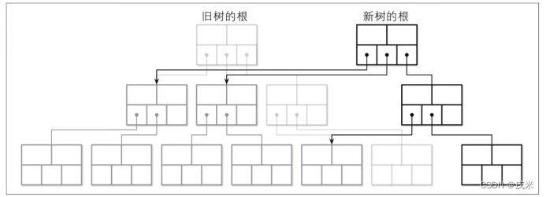

#### 2.5.6.惰性B树和LA树

惰性B树相比写时复制B树更进一步，为每个页都设置了一个更新缓冲区。这样，更新的内容就放在更新缓冲区中，读取时将原始页中的内容和更新缓冲区进行合并，来返回正确的数据。

惰性B树的每个页，就像一个小型的LSM树。更新缓冲区就像memtable，当更新缓冲区达到一定程度，就压缩到页中，就像一个小型的compaction过程。

惰性B树同样避免了Latch机制，但没有写时复制B树那么夸张的写放大代价，整体来讲，是非常优秀的一种存储结构。MongoDB的默认存储引擎WriedTiger就使用的这种存储结构

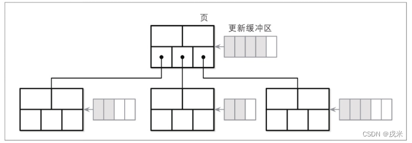

惰性B树还有一个分支，叫做惰性自适应树，Lazy-Adaptive Tree，称作LA树。整体思路和惰性B树一致，只是把更新缓冲区的对象变为子树，用来进一步减少写放大

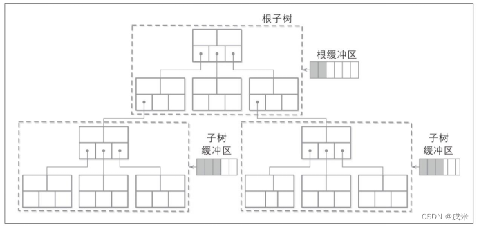

#### 2.5.7.Bw树

- [淘宝数据库内核月报 2018/11 期](http://mysql.taobao.org/monthly/2018/11/01)
- [微软提出的无锁 B 族树](https://zhuanlan.zhihu.com/p/422561790)
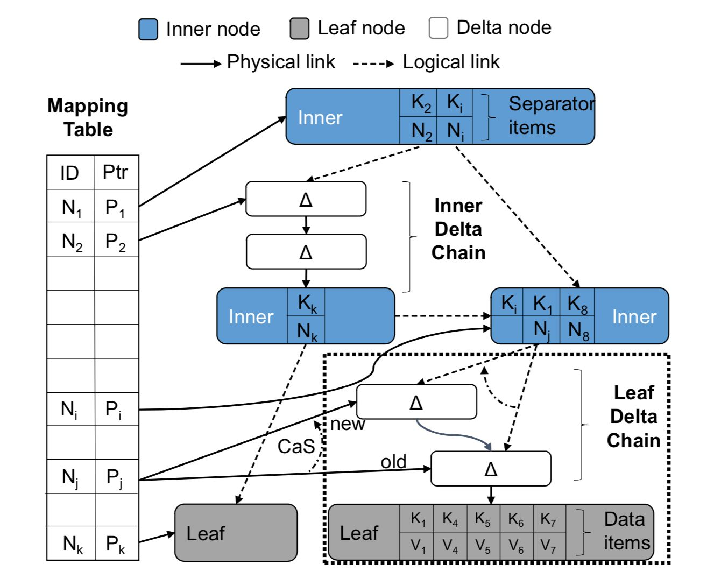


Bw树整体分为三层，从上而下分别是Bw树索引层、缓冲层和存储层


### 2.5.LSM Tree

- [LSM-based Storage Techniques: A Survey](https://blog.csdn.net/zj_18706809267/article/details/125044772)
- [LSM-tree基本原理及应用](https://blog.csdn.net/qq_45786945/article/details/124795889)

以下均已RocksDB为案例解释LSM Tree

<p style="color: red">LSM 发展历史</p>

- LSM树的概念起源于1996年的论文“The Log Structure Merge Tree”。
- 此后由Google Bigtable第一个商业化实现并于2006年发表论文，此后Google的两位专家基于Bigtable的经验实现了LevelDB，一个单机LSM树存储引擎，并开源。
- 此后FaceBook基于LevelDB开发了RocksDB。RocksDB做了相当多的迭代演进，如多线程、column family、compaction策略等
- 目前RocksDB已经成为LSM树领域的一个事实标准。

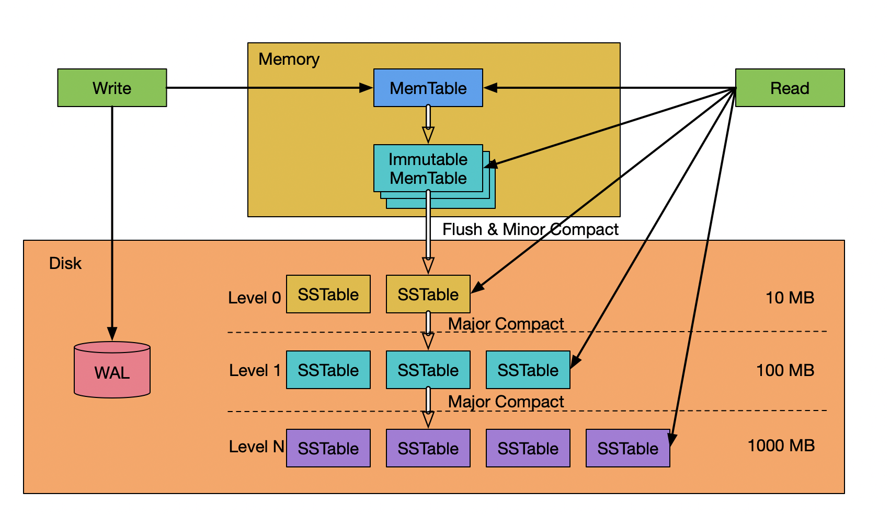

<p style="color: red">写入过程</p>

1. 写入的数据首先要记录WAL(类似于 mysql 的redo log)。用来做实时落盘，以实现持久性。
2. 然后数据有序的写入active Memtable中。active Memtable也是这里唯一可变的结构。 
3. 在一个active Memtable写满后，就把它转换为Immutable Memtable。
    - 两类Memtable都在内存中，使用的数据结构:skiplist、hash-skiplist、hash-linklist
4. Immutable Memtable达到指定的数量后，就把Immutable Memtable落盘到磁盘中的L0层，我们把这步操作称为minor merge。
   - 通常，对这步落盘操作的memtable不做整理，直接刷入磁盘。这也就意味着L0层可能有重复的数据。
5. 在L0层的数据满后，就会触发major merge，也就是关键的Compaction操作。默认7层，每层之间大小相差10倍。
   - 把L0的数据和L1层的数据进行合并，全部整理为固定大小的、不可变的数据块，我们称之为SSTable，并放在L1层。
   - SSTable是LevelDB最初实现的一种数据格式，称为有序字符串表，Sorted String Table
   - 一个SST通常由两部分组成：索引文件和数据文件。数据文件就是要存储的KV数据，索引文件可以是B树或哈希表。
     大家可以把SST理解成一个小型的聚簇索引结构，只是这个结构整体是不可变的。
   - 除了L0层之外磁盘中的每一层，都是由一个个SST组成的，它们互不重叠
   - 同层数据不重复，多层数据中数据重复 
6. SST的出现，使用Bloom过滤器，在很大程度上提升了LSM树的读性能。并且L1和之后层次间的合并，可以仅合并部分重叠的SST，使Compaction过程更灵活，效率更高

<p style="color: red">简述读写流程</p>
- 写：一条数据进入LSM树后，写入active memtable，然后进入immutable memtable，接下来被刷入L0层，然后随着Compaction操作一层层向下。 
  这个过程中如果碰到了更下层的同key数据，那么就会把对方合并；如果在Compaction过程遇到了从更高层来的同key新的数据，那么就会被合并。
- 读：读取的过程就是从上至下层层扫描，直至找到数据。

<p style="color: red">设计思路？</p>
- 按照冷热数据进行分层，
- 多路归并。

推迟写回硬盘的时间，进而达到快速地插入数据的目的


<p style="color: red">数据结构的缺点？</p>
- 写放大：一条数据被顺序写几次（还是那一份数据，只是需要一直往下流）。第一次写到L0，之后由于compaction可能在L1~LN各写一次
- 读放大：一个数据可能在多个sstable，而这些sstable分布在L0~LN
- 空间放大：一份数据被copy/overwritten（一份用于服务query，一份是snapshot之后用于compaction）

为了解决这些问题，我们一直在探索更好的Compaction算法。

<p style="color: red">布隆过滤器用的作用</p>

常用到MVCC进行并发情况下的快速读写和隔离，MVCC会需要扫描同一个key下多个timestamp下的值，但是由于LSM的特性，
SCAN操作的时候每个key可能出现在SSTable的任意层次，所以读放大明显。一般采用bloom filter降低IO读写次数，
但是在长key造成很大的key空间的情况下，这种方法也捉襟见肘。CockroachDB采用了prefix 前缀bloom filter来缓解这个问题。

- 它可能返回假阳性结果，也就是返回一个key在这层，但实际查找下来是不在的；
- 但不会返回假阴性结果，也就是如果布隆过滤器返回一个key不在这一层，那么这个key一定是不在的

<p style="color: red">mem中的数据结构？</p>

两类Memtable都在内存中，使用的数据结构基本上是跳表（rocksDb的实现方式）。内存操作的时候，最合适的结构是连续有序，
并且能支持并发操作（可以支持原子操作，可见性等，禁止指令重排序）

跳表插入的时候可以保证数据的有序，支持二分查找、范围查询。当然，删除的时候不是立即删除，因为会影响到数据的写放大，一般是在compact阶段进行真正的删除
hash-skiplist的索引既有hash索引，又有skiplit的二分索引，针对于有明确key或教完整key前缀的查询，如果要进行全表扫描，会非常耗费内存及低性能，因为要产生临时的有序表； hash-linklist也是一样的道理。


为什么不是B树呢？因为B树的以页为单元进行存储的，内存操作的时候会影响效率。

<p style="color: red">磁盘的数据如何存储？</p>

也就是SST。组成如下

- Footer。文件加载的引导数据，可以理解为 Block 的元数据
- Block。保存数据。
    - Meta Block。保存在多个 Block。存放 BloomFilter、Properity、RangeDel 等元数据。
    - Metaindex Block。保存在	一个 Block。Meta Block 的索引
    - Index Block。保存在一个 Block。Data Block 的索引
    - Data Block。保存在多个 Block。存放用户的数据，kv 对

### 2.6.常见问题

<p style="color: red">为什么索引结构默认使用B+Tree，而不是hash，二叉树，红黑树？</p>

存储性能，io性能，数据结构性能，三个方面

- hash：虽然可以快速定位，但是没有顺序，IO复杂度高。
- 二叉树 和 红黑树：
    - 树的高度不均匀，不能自平衡，查找效率跟数据有关（树的高度），并且IO代价高。
    - 树的高度随着数据量增加而增加，IO代价高。
    - 任意一种二叉树结构，都会在数据量大的时候出现树深度大，查询效率降低。
    - 在极端情况下出现数据倾斜，性能降低到链表维度。

<p style="color: red">数据库为什么不选择BTree，而选择B+Tree？</p>

1. B+Tree每个叶子节点都有一个指向相邻叶子节点的指针。数据库的查询往往会有针对范围的查找，
  不可避免的需要遍历整棵树或者部分子树，B+Tree只需要遍历叶子节点就可以遍历整棵树，查询效率要远远高于BTree
2. 非叶子节点不存储data，只存储key值，这样每个非叶子节点就可以存储更多的key，能读到内存中的key也就越多，
      内存操作的效率要远远高于磁盘I/O操作
      
注意：MySQL表创建索引后是序列化到磁盘里的，当我们查询数据的时候，会将查询涉及到的部分索引加载到内存中提交查询效率
   （可能将整个B+Tree索引全部加载到内存中）。所以，当一个数据库中索引创建的越多，可能导致内存的占用越大
   （由此原理推断出数据库的规范：1.数据库中表的数量不宜太多；2.单表的数据量不宜太多；3.单表的索引数量不宜超过8个）。
   
<p style="color: red">为什么官方建议使用自增长主键作为索引</p>

并且能减少数据的移动，每次插入都是插入到最后。总之就是减少分裂和移动的频率。

结合B+Tree的特点，自增主键是连续的，在插入过程中尽量减少页分裂，即使要进行页分裂，也只会分裂很少一部分。

<p style="color: red">mysql有哪些存储引擎，mysql的innodb引擎的索引结构，答出B+Tree以后问影响B+Tree的深度和宽度的因素</p>

mysql 存储引擎有： innodb、myisam、csv、memory等

innodb 兼容的索引结构：B+TREE, hash, full-text 三种（一本书里面说的）

默认是b+tree，其他的类型需要单独设置

索引保存在mysql定义的页中，一个页的大小是16kb, 一个B+tree的node就是一页，

我们使用主键为例子，一个关键字长度按8B，一个指针也是8B，可以计估算出一个节点有10K关键字，如果有3层的话就是10K * 10K * 10K = 10亿数据量

在索引的连续性不高时，node上的数据量也是不均匀的

所以影响深度和宽度的主要还是数据量、索引的长度，索引的连续性等

<p style="color: red">MySql 理论上数据量达到什么量级不影响索引的性能？</p>

[https://blog.csdn.net/qq_28474017/article/details/97018874](https://blog.csdn.net/qq_28474017/article/details/97018874)

说法不一，有说2000W的，有说500W的。 阿里巴巴《Java 开发手册》提出单表行数超过 500 万行或者单表容量超过2GB，才推荐进行分库分表
   
## 3.索引的应用   

### 3.1.索引下推

[https://www.jianshu.com/p/d0d3de6832b9](https://www.jianshu.com/p/d0d3de6832b9)

在联合索引中，符合最左匹配原则的基础上，如果查询条件也是联合索引中的字段，这样在匹配最左的基础上，
还会对右边的字段进行过滤，减少出现回表的次数。


### 3.2.回表与索引覆盖

[https://www.cnblogs.com/yanggb/p/11252966.html](https://www.cnblogs.com/yanggb/p/11252966.html)

[https://blog.csdn.net/qq_15037231/article/details/87891683](https://blog.csdn.net/qq_15037231/article/details/87891683)

SQL查询的字段数据，与使用的索引一致，这样通过索引就可以获得全部需要字段，这样的SQL查询叫做索引覆盖。

注意：这不是索引的类型，这是索引的一种使用方式。

要是索引满足不了的话，会按照索引的引用，继续查询主键一次，对主键的B+tree进行二次查询。这叫做索引回表查询。

其实，实际开发中，大多是回表查询为主

### 3.3.最左匹配原则

1.简单说下什么是最左匹配原则

顾名思义：最左优先，以最左边的为起点任何连续的索引都能匹配上。同时遇到范围查询(>、<、between、like)就会停止匹配。

例如：b = 2 如果建立(a,b)顺序的索引，是匹配不到(a,b)索引的；
但是如果查询条件是a = 1 and b = 2或者a=1(又或者是b = 2 and b = 1)就可以，
因为优化器会自动调整a,b的顺序。再比如a = 1 and b = 2 and c > 3 and d = 4 如果建立(a,b,c,d)顺序的索引，
d是用不到索引的，因为c字段是一个范围查询，它之后的字段会停止匹配。

2.最左匹配原则的原理

最左匹配原则都是针对联合索引来说的，所以我们有必要了解一下联合索引的原理。
了解了联合索引，那么为什么会有最左匹配原则这种说法也就理解了。

### 3.4.索引失效

### 3.5.常见问题

<p style="color: red">对于SQL select * from table where a=? and b=? 怎么加索引</p>

a int 值是1~8 字段的值少，离散度不高，不适合做索引

b varchar 32为随机值 32位，离散度非常高，一般UUID就是36位，去掉-就是32位。

分情况：
1. 表数据量特别少，就不用加了
2. 数据量非常大的时候，可以使用b设置普通索引

## 4.Innodb

### 4.1.存储结构

Innodb存储引擎的逻辑结构：[https://blog.haohtml.com/archives/19232](https://blog.haohtml.com/archives/19232)

Innodb数据的页结构：[https://www.cnblogs.com/joeysh/archive/2019/04/16/10720192.html](https://www.cnblogs.com/joeysh/archive/2019/04/16/10720192.html)

数据文件：[https://blog.csdn.net/Edwin_Hu/article/details/124698400](https://blog.csdn.net/Edwin_Hu/article/details/124698400)

上面的连接中有:delete where id=一条数据后，是怎么一个过程。不是真实删除，只是在底层打了一个删除的标识，不释放物理空间，为了不影响表的性能，可以被后面的数据覆盖。

innodb数据逻辑存储形式为表空间，而每一个独立表空间都会有一个.ibd数据文件,ibd文件从大到小组成：

一个ibd数据文件–>Segment（段）–>Extent（区）–>Page（页）–>Row（行）

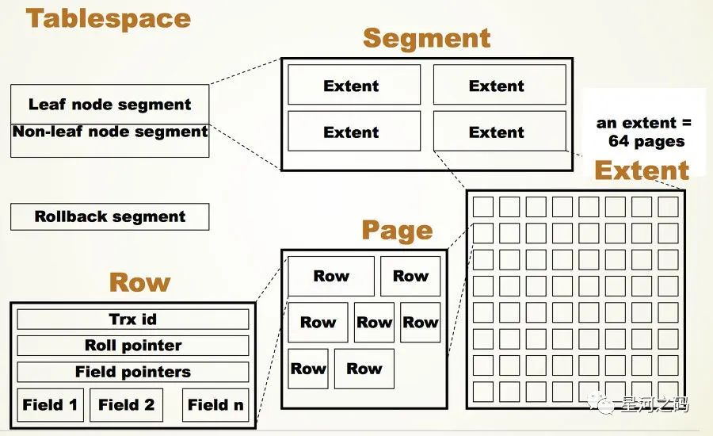

- 表空间(Tablesapce): 表空间，一般情况下一张表为一个ibd文件。用于存储多个ibd数据文件，用于存储表的记录和索引，一个文件包含多个段。
- 段(Segment)：段由数据段、索引段、回滚段组成，innodb存储引擎索引与数据共同存储，数据段即是B+树叶节点，索引段则存储非叶节点。
- 区(Extent)：区则是由连续页组成，每个区的大小为1M，一个区中一共有64个连续的页。
- 页(Page)：页是innodb存储引擎磁盘管理的最小单位，页的大小为16KB，即每次数据的读取与写入都是以页为单位。

### 4.2.页分裂

什么情况下回出现页的分裂？

因为一个page的size是固定的，page中保存的数据值是连续的（innodb的特性），所以当一个page数据空间已经满了的时候，继续向里面插入数据的话，
就会导致后面的数据被分裂出去。这样，被分裂出去的页中数据量会很少，在使用到这部分数据的时候，效率会比较低些。

场景：使用不规则的字段最为索引，比如UUID等。

避免方案：使用有递增规律的字段作为索引，比如自增ID、时间等


## 5.buffer poll

MySQL缓冲池？

[https://mp.weixin.qq.com/s/AbiYMbDUJsMWK-_g0mFNwg](https://mp.weixin.qq.com/s/AbiYMbDUJsMWK-_g0mFNwg)


## 6.存储引擎的选择

MySQL能有现在的地位，InnoDB功不可没。

在机械硬盘的时代，顺序读写的BTree家庭就非常的合适。而随着固体硬盘和分布式技术的发展，LSM tree就越来越被关注起来。


