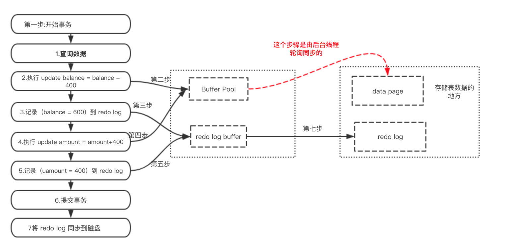
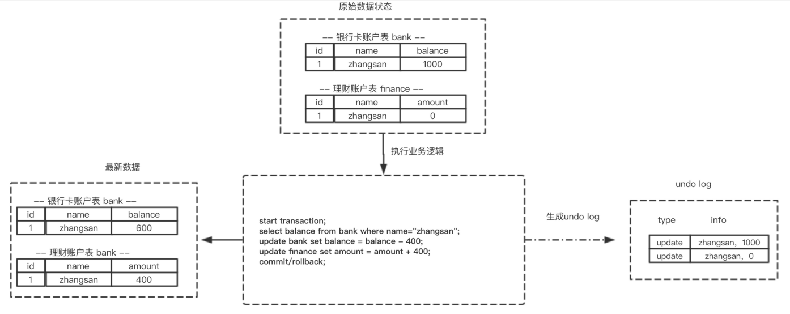
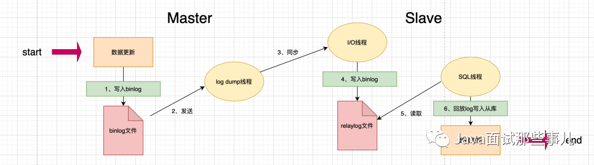

# 5.日志

mysql 的同步机制是基于binlog实现的。是一种异步同步，所以一定存在延迟，这也是mysql长期被诟病的原因。
但是也因此，mysql通过binlog实现了很多其他的功能，不如etl、缓存刷新、事件通知等功能

## 1.日志类型

- 错误日志：执行命令或SQL出现异常错误时，记录相关信息
- 查询日志：记录所有发送到数据库需要执行的命令或SQL
- 慢查询日志：跟着系统配置的时间阈值，将超过这个阈值的SQL记录进去
- 二进制日志：也就是binlog，记录所有对数据有写操作的SQL
- 中继日志-：也是二进制日志，slave同步数据
- 事务日志：重做日志redo与回滚日志undo

## 2.redo log

主要用于crash后恢复数据，redo日志分为两个部分重做日志缓冲(redo log buffer) 与 重做日志(redo log)，前置在内存中，后者是持久化到磁盘上。
为了提高性能，MySQL不是每次修改都实时同步到磁盘，而是先将数据保存到MySQL的缓冲池中（将数据所在的page加载进去），等事务提交之后，
将内存的数据保存到redo log，而真实的数据，是通过一个后台的线程进行轮询同步。




那么问题来了，如果还没来的同步的时候宕机或断电了怎么办？还没来得及执行上面图中红色的操作，这样会导致丢部分已提交事务的修改信息！

所以引入了redo log来记录已成功提交事务的修改信息，并且会把redo log持久化到磁盘，系统重启之后在读取redo log恢复最新数据。
redo log是MySQL在服务启动的时候，用来恢复数据的，用于保障，已提交事务的持久化特性。

注意：第7步中的操作，其实是将redo log buffer的数据写入 操作系统提供的page cache中，有可能还没有真实刷盘，但是这块内存是有操作系统维护的，
即使mysql故障重启了，操作系统也会定时进行刷盘的。但是如果是服务器故障重启了，那这部分数据就真的丢失了。

## 3.Undo log

Undo日志与redo是相反的，记录的是数据的逻辑变化，也就是变化前的状态。当在事务中出现异常时，会将数据恢复到事务开始前的状态。
undo log是用来回滚数据的用于保障 未提交事务的原子性



## 4.Binlog

### 4.1.什么是binlog

用于记录数据库执行的写入性操作(不包括查询)信息，以二进制的形式保存在磁盘中。可以简单理解为记录的就是sql语句

binlog 是 mysql 的逻辑日志，并且由 Server层进行记录，使用任何存储引擎的
mysql 数据库都会记录 binlog 日志

在实际应用中， binlog 的主要使用场景有两个：

- 用于主从复制，在主从结构中，binlog 作为操作记录从 master 被发送到 slave，slave服务器从 master 接收到的日志保存到 relay log 中。

- 用于数据备份，在数据库备份文件生成后，binlog保存了数据库备份后的详细信息，以便下一次备份能从备份点开始。

### 4.2.日志格式

binlog 日志有三种格式，分别为 STATMENT 、 ROW 和 MIXED

在 MySQL 5.7.7 之前，默认的格式是 STATEMENT ， MySQL 5.7.7
之后，默认值是 ROW

日志格式通过 binlog-format 指定。

- STATMENT ：基于 SQL 语句的复制，每一条会修改数据的sql语句会记录到 binlog 中
- ROW ：基于行的复制。当某个字段值变化后，会将整行数据写入binlog。
- MIXED ：基于 STATMENT 和 ROW。 两种模式的混合复制，比如一般的数据操作使用 row 格式保存，有些表结构的变更语句，使用 statement 来记录

我们还可以通过mysql提供的查看工具mysqlbinlog查看文件中的内容，例如

mysqlbinlog mysql-bin.00001 | more

### 4.3.mysql binlog同步原理

[https://blog.csdn.net/lzhcoder/article/details/88814364](https://blog.csdn.net/lzhcoder/article/details/88814364)

Master与slave之间会建立连接，当产生新的binlog的时候，会发生给slave。这也是一种发布订阅的模式。

Slave将binlog放到relaylog(中继日志)中按照顺序执行一遍SQL语句完成数据的同步。



可以看到mysql主从复制需要三个线程：master（binlog dump thread）、slave（I/O thread 、SQL thread）

- binlog dump线程：主库中有数据更新时，根据设置的binlog格式，将更新的事件类型写入到主库的binlog文件中，并创建log
  dump线程通知slave有数据更新。当I/O线程请求日志内容时，将此时的binlog名称和当前更新的位置同时传给slave的I/O线程。

- I/O线程：该线程会连接到master，向log dump线程请求一份指定binlog文件位置的副本，并将请求回来的binlog存到本地的relay log中。

- SQL线程：该线程检测到relay log有更新后，会读取并在本地做redo操作，将发生在主库的事件在本地重新执行一遍，来保证主从数据同步。

基本过程总结

- 主库写入数据并且生成binlog文件。该过程中MySQL将事务串行的写入二进制日志，即使事务中的语句都是交叉执行的。

- 在事件写入二进制日志完成后，master通知存储引擎提交事务。

- 从库服务器上的IO线程连接Master服务器，请求从执行binlog日志文件中的指定位置开始读取binlog至从库。

- 主库接收到从库的IO线程请求后，其上复制的IO线程会根据Slave的请求信息分批读取binlog文件然后返回给从库的IO线程。

- Slave服务器的IO线程获取到Master服务器上IO线程发送的日志内容、日志文件及位置点后，会将binlog日志内容依次写到Slave端自身的Relay
  Log（即中继日志）文件的最末端，并将新的binlog文件名和位置记录到master-info文件中，以便下一次读取master端新binlog日志时能告诉Master服务器从新binlog日志的指定文件及位置开始读取新的binlog日志内容。

- 从库服务器的SQL线程会实时监测到本地Relay
  Log中新增了日志内容，然后把RelayLog中的日志翻译成SQL并且按照顺序执行SQL来更新从库的数据。

- 从库在relay-log.info中记录当前应用中继日志的文件名和位置点以便下一次数据复制。

### 4.4.Binlog同步丢失数据

如果主库突然宕机，然后恰好数据还没同步到从库，那么有些数据可能在从库上是没有的，有些数据可能就丢失了。

mysql的两个机制：

- 半同步复制，用来解决主库数据丢失问题；

semi-sync复制，指的就是主库写入binlog日志之后，就会将强制此时立即将数据同步到从库，从库将日志写入自己本地的relay log之后，
接着会返回一个ack给主库，主库接收到至少一个从库的ack之后才会认为写操作完成了。缺点非常明显，就是导致SQL执行的效率降低很多。

- 并行复制，用来解决主从同步延时问题。

指的是从库开启多个线程，并行读取relay
log中不同库的日志，然后并行重放不同库的日志，这是库级别的并行。

### 4.5.主从同步延迟

[https://blog.csdn.net/wolf_love666/article/details/90444154](https://blog.csdn.net/wolf_love666/article/details/90444154)

[https://www.imooc.com/article/289364?block_id=tuijian_wz](https://www.imooc.com/article/289364?block_id=tuijian_wz)

我们来看下导致主从延迟的时间点：

- 主库 A 执行完成一个事务，写入 binlog，该时刻记为T1.
- 传给从库B，从库接受完这个binlog的时刻记为T2.
- 从库B执行完这个事务，该时刻记为T3.

主从延迟，就是同一个事务，从库执行完成的时间和主库执行完成的时间之间的差值，即T3-T1。

我们也可以通过在从库执行show slave status，返回结果会显示seconds_behind_master，表示当前从库延迟了多少秒。

延迟产生的原因

常情况下，如果网络不延迟，那么日志从主库传给从库的时间是相当短，所以T2-T1可以基本忽略。

最直接的影响就是从库消费中转日志（relaylog）的时间段，而造成原因一般是以下几种：

1、从库的机器性能比主库要差

比如将20台主库放在4台机器，把从库放在一台机器。这个时候进行更新操作，由于更新时会触发大量读操作，导致从库机器上的多个从库争夺资源，导致主从延迟。

2、从库的压力大

按照正常的策略，读写分离，主库提供写能力，从库提供读能力。将进行大量查询放在从库上，结果导致从库上耗费了大量的CPU资源，进而影响了同步速度，造成主从延迟。

对于这种情况，可以通过一主多从，分担读压力；也可以采取binlog输出到外部系统，比如Hadoop，让外部系统提供查询能力。

3、大事务的执行

一旦执行大事务，那么主库必须要等到事务完成之后才会写入binlog。

比如主库执行了一条insert … select非常大的插入操作，该操作产生了近几百G的binlog文件传输到只读节点，进而导致了只读节点出现应用binlog延迟。

因此，DBA经常会提醒开发，不要一次性地试用delete语句删除大量数据，尽可能控制数量，分批进行。

4、主库的DDL(alter、drop、create)

- 只读节点与主库的DDL同步是串行进行，如果DDL操作在主库执行时间很长，那么从库也会消耗同样的时间，比如在主库对一张500W的表添加一个字段耗费了10分钟，那么从节点上也会耗费10分钟。
- 从节点上有一个执行时间非常长的的查询正在执行，那么这个查询会堵塞来自主库的DDL，表被锁，直到查询结束为止，进而导致了从节点的数据延迟。

5、锁冲突

锁冲突问题也可能导致从节点的SQL线程执行慢，比如从机上有一些select .... for update的SQL，或者使用了MyISAM引擎等。

6、从库的复制能力

一般场景中，因偶然情况导致从库延迟了几分钟，都会在从库恢复之后追上主库。但若是从库执行速度低于主库，且主库持续具有压力，就会导致长时间主从延迟，很有可能就是从库复制能力的问题。

从库上的执行，即sql_thread更新逻辑，在5.6版本之前，是只支持单线程，那么在主库并发高、TPS高时，就会出现较大的主从延迟。

因此，MySQL自5.7版本后就已经支持并行复制了。可以在从服务上设置
slave_parallel_workers为一个大于0的数，然后把slave_parallel_type参数设置为LOGICAL_CLOCK，这就可以了

```text
mysql> show variables like 'slave_parallel%';
+------------------------+----------+
| Variable_name | Value |
+------------------------+----------+
| slave_parallel_type | DATABASE |
| slave_parallel_workers | 0 |
+------------------------+----------+
```

<p style="color: red">怎么减少主从延迟<p>


主从同步问题永远都是一致性和性能的权衡，得看实际的应用场景，若想要减少主从延迟的时间，可以采取下面的办法：

- 降低多线程大事务并发的概率，优化业务逻辑
- 优化SQL，避免慢SQL，减少批量操作，建议写脚本以update-sleep这样的形式完成。
- 提高从库机器的配置，减少主库写binlog和从库读binlog的效率差。
- 尽量采用短的链路，也就是主库和从库服务器的距离尽量要短，提升端口带宽，减少binlog传输的网络延时。
- 实时性要求的业务读强制走主库，从库只做灾备，备份。