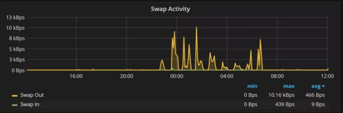
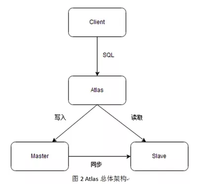
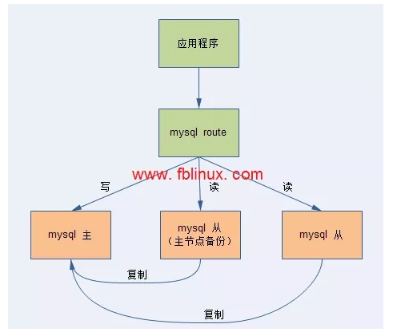
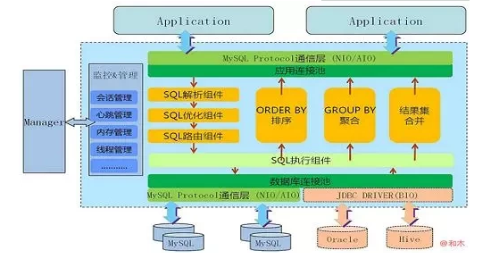
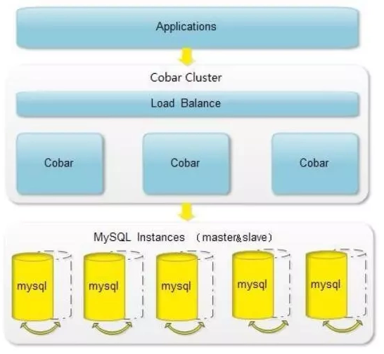
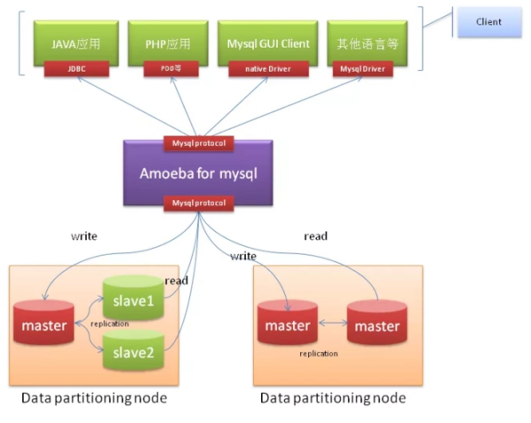

# 6.实践与优化

优化基本思路：
执行计划(SQL优化)->索引优化(结构优化)->数据库优化(架构优化)->硬件优化(SSD和带宽)

## 1.数据库性能优化

### 1.1.优化思路
从网络到底层使用上，依次可以操作的有：
- 网络（主要是距离），尽可能避免主从之间跨地域，跨可用区是可以的。并考虑使用同一种类型网络或者直接用BGP
- 带宽。不可太小，数据库操作时io密集型的
- 服务器磁盘类型，SSD比较好，提高读写性能
- 内存，帮助MySQL有足够的内存（主要是buffer pool足够大），可以提高查询效率
- MySQL架构。数据压力进行分表，读写压力进行分库，字段压力进行拆字段分表。或者读写分离
- SQL。查看慢语句，结合执行计划进行调整SQL或者索引。
- 表数据设计。使用正确的数据结构，适当冗余。参考AFK拆分原则，考虑是否进行分库分表。
- 事务隔离级别，考虑是否使用默认的可重复读。使用已提交读可提高查询效率
- 存储引擎选择。事务性的使用innodb也方便和兼容etl工具，比如canal，分布式数据库等
- 索引设计等。贴合实际业务需求，数据使用场景。比如在写多读少的时候，使用普通索引比唯一索引效率高，因为普通索引会将数据先写入change buffer，等待后续数据刷盘到磁盘上（异步刷盘）。 
- 主要使用监控工具，比如MySQL本身的slowlog,接口调用数据库接口的rt的监控等

### 1.2.配置优化(拒绝默认配置)

Mysql的默认配置只适合用于开发，不适用于生产。

Buffer Pool 是 InnoDB 性能的关键核心之一，合理配置和监控 Buffer Pool：
1. 可以有效减少磁盘 I/O；
2. 提升查询性能；
3. 降低服务器负载。

#### 1.2.1.innodb_buffer_pool_size
缓冲池用于存放缓存数据和索引。这是使用具有大容量内存的系统作为数据库服务器的主要原因。如果只运行InnoDB存储引擎，通常会将80%的内存分配给缓冲池。
如果您正在运行非常复杂的查询，或者有大量的并发数据库连接，或大量的表，可能需要将此值降低一个档次，以便为其他操作分配更多的内存。

在设置InnoDB缓冲池大小时，需要确保不要设置得太大，否则会导致交换。这绝对会影响数据库性能。
一种简单的检查方法是查看Percona Monitoring and Management中的系统概述图中的交换活动：



如图所示，有时进行一些交换是可以的。但是，如果看到持续每秒1MB或更多的交换活动，则需要减少缓冲池大小(或其他内存使用)。
如果在第一次访问时没有正确地获得innodb_buffer_pool_size的值，不用担心。
从MySQL5.7开始，便可以动态更改InnoDB缓冲池的大小，而无需重新启动数据库服务器。

#### 1.2.2.innodb_log_file_size
这是单个InnoDB日志文件的大小。默认情况下，InnoDB使用两个值，这样您就可以将这个数字加倍，从而获得InnoDB用于确保事务持久的循环重做日志空间的大小。
这也优化了将更改应用到数据库。设置innodb_log_file_size是一个权衡的问题。
分配的重做空间越大，对于写密集型工作负载而言，性能就越好，但是如果系统断电或出现其他问题，崩溃恢复的时间就越长。

如何知道MySQL的性能是否受到当前InnoDB日志文件大小的限制？
可以通过查看实际使用了多少可用的重做日志空间来判断。最简单的方法是查看Percona Monitor and Management InnoDB Metrics仪表板。
在下图中，InnoDB日志文件的大小不够大，因为使用的空间非常接近可用的重做日志空间(由红线表示)。日志文件的大小应该至少比保持系统最佳运行所用的空间大20%。


#### 1.2.3.max_connections

大型应用程序连接数通常需高于默认值。不同于其它变量，如果没有正确设置它，就不会有性能问题(本身)。
相反，如果连接的数量不足以满足您的应用程序的需要，那么您的应用程序将无法连接到数据库(在您的用户看来，这就像是停机时间)。所以正确处理这个变量很重要。

如果在多个服务器上运行多个组件的复杂应用程序，很难知道需要多少连接。幸运的是，MySQL可以很容易地看到在峰值操作时使用了多少连接。
通常，您希望确保应用程序使用的最大连接数与可用的最大连接数之间至少有30%的差距。
查看这些数字的一种简单方法是在Percona监控和管理的MySQL概述仪表板中使用MySQL连接图。下图显示了一个健全的系统，其中有大量的附加连接可用。


需要记住的一点是，如果数据库运行缓慢，应用程序通常会创建过多的连接。在这种情况下，您应该处理数据库的性能问题，而不是简单地允许更多的连接。更多的连接会使底层的性能问题变得更糟。

(注意：当将max_connections变量设置为明显高于默认值时，通常需要考虑增加其他参数，如表缓存的大小和打开的MySQL文件的数量。但是，这不属于本文讨论的范畴。)

#### 1.2.4.案例

```properties
## 1. 内存配置  ##    
# 缓冲池大小（核心参数，建议为物理内存的 70%-80%）
innodb_buffer_pool_size = 8G

# 日志缓冲大小（事务未提交时的日志缓存）
innodb_log_buffer_size = 16M

# 排序缓冲和连接缓冲（单线程排序和连接操作的内存）
sort_buffer_size = 2M
join_buffer_size = 2M

# 查询缓存（MySQL 8.0 已移除，建议使用 Redis 替代）
query_cache_type = 0

## 2.并发连接配置 ##
# 最大连接数（根据服务器性能调整，过高会导致上下文切换开销）
max_connections = 1000

# 连接超时时间（缩短不活跃连接的存活时间）
wait_timeout = 600

# 最大用户连接数（限制单用户的连接数）
max_user_connections = 500

## 3. 事务与日志配置 优化事务和日志性能，平衡数据安全性和写入性能。##
# 事务提交方式（0=每秒刷盘，1=每次提交刷盘，2=每次提交写缓存，每秒刷盘）
innodb_flush_log_at_trx_commit = 2

# 双写缓冲区（提高崩溃恢复能力，但增加IO）
innodb_doublewrite = 1

# 日志文件大小和数量（调整为较大值，减少日志切换）
innodb_log_file_size = 512M
innodb_log_files_in_group = 3

## 4. InnoDB 存储引擎配置 ## 
# 并发IO线程数（根据CPU核心数调整，一般为CPU核心数*2）
innodb_io_capacity = 2000
innodb_io_capacity_max = 4000

# 预读机制（提前加载数据页到缓冲池）
innodb_read_ahead_threshold = 56
innodb_random_read_ahead = 0

# 刷新脏页比例（控制后台刷脏页的速度）
innodb_max_dirty_pages_pct = 75

# Buffer Pool 分区数（多核机器建议开启多个实例，推荐CPU数）
innodb_buffer_pool_instances=4
```


### 1.3.监控

设计最好的系统时要考虑到可观察性-MySQL也不例外。当发生问题时，你需要迅速而有效地解决它们。这样做的唯一方法是设置某种监视解决方案并对其进行适当的初始化。
监控工具有诸如MySQL Enterprise Monitor、Monyog和 Percona Monitoring and Management(PMM)，后者具有免费和开源的额外优势。
这些工具为监视和故障排除提供了很好的可操作性。

#### 1.3.1.INNODB监控指标

使用SQL可以查看基础的性能指标：SHOW ENGINE INNODB STATUS

核心数据
- Buffer pool size：总页数
- Free buffers：空闲页数
- Database pages：缓存中的数据页数
- Modified db pages：脏页数量
- Pages read/written：页的读写总数

```shell
Per second averages calculated from the last 16 seconds
-----------------
BACKGROUND THREAD
-----------------
srv_master_thread loops: 4 srv_active, 0 srv_shutdown, 12 srv_idle
srv_master_thread log flush and writes: 16
----------
SEMAPHORES
----------
OS WAIT ARRAY INFO: reservation count 2
OS WAIT ARRAY INFO: signal count 2
RW-shared spins 0, rounds 4, OS waits 2
RW-excl spins 0, rounds 0, OS waits 0
RW-sx spins 0, rounds 0, OS waits 0
Spin rounds per wait: 4.00 RW-shared, 0.00 RW-excl, 0.00 RW-sx
------------
TRANSACTIONS
------------
Trx id counter 2959631
Purge done for trx's n:o < 0 undo n:o < 0 state: running but idle
History list length 0
LIST OF TRANSACTIONS FOR EACH SESSION:
---TRANSACTION 412053052545760, not started
0 lock struct(s), heap size 1136, 0 row lock(s)
---TRANSACTION 412053052544848, not started
0 lock struct(s), heap size 1136, 0 row lock(s)
--------
FILE I/O
--------
I/O thread 0 state: waiting for completed aio requests (insert buffer thread)
I/O thread 1 state: waiting for completed aio requests (log thread)
I/O thread 2 state: waiting for completed aio requests (read thread)
I/O thread 3 state: waiting for completed aio requests (read thread)
I/O thread 4 state: waiting for completed aio requests (read thread)
I/O thread 5 state: waiting for completed aio requests (read thread)
I/O thread 6 state: waiting for completed aio requests (write thread)
I/O thread 7 state: waiting for completed aio requests (write thread)
I/O thread 8 state: waiting for completed aio requests (write thread)
I/O thread 9 state: waiting for completed aio requests (write thread)
Pending normal aio reads: [0, 0, 0, 0] , aio writes: [0, 0, 0, 0] ,
 ibuf aio reads:, log i/o's:, sync i/o's:
Pending flushes (fsync) log: 0; buffer pool: 0
689 OS file reads, 60 OS file writes, 7 OS fsyncs
14.37 reads/s, 16384 avg bytes/read, 2.94 writes/s, 0.31 fsyncs/s
-------------------------------------
INSERT BUFFER AND ADAPTIVE HASH INDEX
-------------------------------------
Ibuf: size 1, free list len 0, seg size 2, 0 merges
merged operations:
 insert 0, delete mark 0, delete 0
discarded operations:
 insert 0, delete mark 0, delete 0
Hash table size 2365241, node heap has 0 buffer(s)
Hash table size 2365241, node heap has 0 buffer(s)
Hash table size 2365241, node heap has 0 buffer(s)
Hash table size 2365241, node heap has 0 buffer(s)
Hash table size 2365241, node heap has 0 buffer(s)
Hash table size 2365241, node heap has 0 buffer(s)
Hash table size 2365241, node heap has 0 buffer(s)
Hash table size 2365241, node heap has 0 buffer(s)
0.00 hash searches/s, 14.19 non-hash searches/s
---
LOG
---
Log sequence number 328020158
Log flushed up to   328020158
Pages flushed up to 328020158
Last checkpoint at  328020149
0 pending log flushes, 0 pending chkp writes
10 log i/o's done, 0.18 log i/o's/second
----------------------
BUFFER POOL AND MEMORY
----------------------
Total large memory allocated 8795455488
Dictionary memory allocated 197524
Buffer pool size   524224
Free buffers       523541
Database pages     683
Old database pages 0
Modified db pages  5
Pending reads      0
Pending writes: LRU 0, flush list 0, single page 0
Pages made young 0, not young 0
0.00 youngs/s, 0.00 non-youngs/s
Pages read 646, created 37, written 43
0.00 reads/s, 0.00 creates/s, 0.00 writes/s
Buffer pool hit rate 859 / 1000, young-making rate 0 / 1000 not 0 / 1000
Pages read ahead 0.00/s, evicted without access 0.00/s, Random read ahead 0.00/s
LRU len: 683, unzip_LRU len: 0
I/O sum[0]:cur[0], unzip sum[0]:cur[0]
----------------------
INDIVIDUAL BUFFER POOL INFO
----------------------
---BUFFER POOL 0
Buffer pool size   65528
Free buffers       65374
Database pages     154
Old database pages 0
Modified db pages  5
Pending reads      0
Pending writes: LRU 0, flush list 0, single page 0
Pages made young 0, not young 0
0.00 youngs/s, 0.00 non-youngs/s
Pages read 117, created 37, written 43
0.00 reads/s, 0.00 creates/s, 0.00 writes/s
Buffer pool hit rate 973 / 1000, young-making rate 0 / 1000 not 0 / 1000
Pages read ahead 0.00/s, evicted without access 0.00/s, Random read ahead 0.00/s
LRU len: 154, unzip_LRU len: 0
I/O sum[0]:cur[0], unzip sum[0]:cur[0]
---BUFFER POOL 1
Buffer pool size   65528
Free buffers       65475
Database pages     53
Old database pages 0
Modified db pages  0
Pending reads      0
Pending writes: LRU 0, flush list 0, single page 0
Pages made young 0, not young 0
0.00 youngs/s, 0.00 non-youngs/s
Pages read 53, created 0, written 0
0.00 reads/s, 0.00 creates/s, 0.00 writes/s
Buffer pool hit rate 632 / 1000, young-making rate 0 / 1000 not 0 / 1000
Pages read ahead 0.00/s, evicted without access 0.00/s, Random read ahead 0.00/s
LRU len: 53, unzip_LRU len: 0
I/O sum[0]:cur[0], unzip sum[0]:cur[0]
---BUFFER POOL 2
Buffer pool size   65528
Free buffers       65514
Database pages     14
Old database pages 0
Modified db pages  0
Pending reads      0
Pending writes: LRU 0, flush list 0, single page 0
Pages made young 0, not young 0
0.00 youngs/s, 0.00 non-youngs/s
Pages read 14, created 0, written 0
0.00 reads/s, 0.00 creates/s, 0.00 writes/s
Buffer pool hit rate 845 / 1000, young-making rate 0 / 1000 not 0 / 1000
Pages read ahead 0.00/s, evicted without access 0.00/s, Random read ahead 0.00/s
LRU len: 14, unzip_LRU len: 0
I/O sum[0]:cur[0], unzip sum[0]:cur[0]
---BUFFER POOL 3
Buffer pool size   65528
Free buffers       65429
Database pages     99
Old database pages 0
Modified db pages  0
Pending reads      0
Pending writes: LRU 0, flush list 0, single page 0
Pages made young 0, not young 0
0.00 youngs/s, 0.00 non-youngs/s
Pages read 99, created 0, written 0
0.00 reads/s, 0.00 creates/s, 0.00 writes/s
Buffer pool hit rate 514 / 1000, young-making rate 0 / 1000 not 0 / 1000
Pages read ahead 0.00/s, evicted without access 0.00/s, Random read ahead 0.00/s
LRU len: 99, unzip_LRU len: 0
I/O sum[0]:cur[0], unzip sum[0]:cur[0]
---BUFFER POOL 4
Buffer pool size   65528
Free buffers       65437
Database pages     91
Old database pages 0
Modified db pages  0
Pending reads      0
Pending writes: LRU 0, flush list 0, single page 0
Pages made young 0, not young 0
0.00 youngs/s, 0.00 non-youngs/s
Pages read 91, created 0, written 0
0.00 reads/s, 0.00 creates/s, 0.00 writes/s
Buffer pool hit rate 799 / 1000, young-making rate 0 / 1000 not 0 / 1000
Pages read ahead 0.00/s, evicted without access 0.00/s, Random read ahead 0.00/s
LRU len: 91, unzip_LRU len: 0
I/O sum[0]:cur[0], unzip sum[0]:cur[0]
---BUFFER POOL 5
Buffer pool size   65528
Free buffers       65431
Database pages     97
Old database pages 0
Modified db pages  0
Pending reads      0
Pending writes: LRU 0, flush list 0, single page 0
Pages made young 0, not young 0
0.00 youngs/s, 0.00 non-youngs/s
Pages read 97, created 0, written 0
0.00 reads/s, 0.00 creates/s, 0.00 writes/s
Buffer pool hit rate 215 / 1000, young-making rate 0 / 1000 not 0 / 1000
Pages read ahead 0.00/s, evicted without access 0.00/s, Random read ahead 0.00/s
LRU len: 97, unzip_LRU len: 0
I/O sum[0]:cur[0], unzip sum[0]:cur[0]
---BUFFER POOL 6
Buffer pool size   65528
Free buffers       65432
Database pages     96
Old database pages 0
Modified db pages  0
Pending reads      0
Pending writes: LRU 0, flush list 0, single page 0
Pages made young 0, not young 0
0.00 youngs/s, 0.00 non-youngs/s
Pages read 96, created 0, written 0
0.00 reads/s, 0.00 creates/s, 0.00 writes/s
Buffer pool hit rate 649 / 1000, young-making rate 0 / 1000 not 0 / 1000
Pages read ahead 0.00/s, evicted without access 0.00/s, Random read ahead 0.00/s
LRU len: 96, unzip_LRU len: 0
I/O sum[0]:cur[0], unzip sum[0]:cur[0]
---BUFFER POOL 7
Buffer pool size   65528
Free buffers       65449
Database pages     79
Old database pages 0
Modified db pages  0
Pending reads      0
Pending writes: LRU 0, flush list 0, single page 0
Pages made young 0, not young 0
0.00 youngs/s, 0.00 non-youngs/s
Pages read 79, created 0, written 0
0.00 reads/s, 0.00 creates/s, 0.00 writes/s
Buffer pool hit rate 762 / 1000, young-making rate 0 / 1000 not 0 / 1000
Pages read ahead 0.00/s, evicted without access 0.00/s, Random read ahead 0.00/s
LRU len: 79, unzip_LRU len: 0
I/O sum[0]:cur[0], unzip sum[0]:cur[0]
--------------
ROW OPERATIONS
--------------
0 queries inside InnoDB, 0 queries in queue
0 read views open inside InnoDB
Process ID=1, Main thread ID=130569051047680, state: sleeping
Number of rows inserted 0, updated 0, deleted 0, read 8
0.00 inserts/s, 0.00 updates/s, 0.00 deletes/s, 0.50 reads/s
```

#### 1.3.2.PMM

PMM 是 Percona 公司基于业界流行的组件 Prometheus 和 Grafana 设计开发的一体化数据库监控解决方案，是非常专业的MySQL监控工具。
[Percona 开源监控方案 PMM 详解](https://blog.csdn.net/qq_42768234/article/details/141885527)

### 1.4.读写分离

java读写分离的实现：[https://www.cnblogs.com/ngy0217/p/8987508.html](https://www.cnblogs.com/ngy0217/p/8987508.html)

方案从两个方面入手：应用层与中间件层

应用层：借助spring AbstractRoutingDataSource 类与aspectJ、注解实现数据源的切换

中间件层：使用shardingjdbc或mycat实现。

## 2.SQL优化

### exsists和 in比较

mysql exsists和 in的效率比较：http://www.cnblogs.com/meibao/p/4973043.html

in 是拿着里面的数据作为条件去查外面， exsists是相反的, 它就是个Boolean的条件，不需要字段比较。

### 执行计划

MySQL——执行计划——SQL案例：[https://www.cnblogs.com/sunjingwu/p/10755823.html](https://www.cnblogs.com/sunjingwu/p/10755823.html)

MySQL如何查询执行计划：[https://www.cnblogs.com/klvchen/p/10137117.html](https://www.cnblogs.com/klvchen/p/10137117.html)

执行计划详解： [https://www.cnblogs.com/yinjw/p/11864477.html](https://www.cnblogs.com/yinjw/p/11864477.html)

MySQL执行计划解读：http://www.cnblogs.com/liu-ke/p/4432774.html

复杂的应用程序可以有复杂的模式和查询。如果想得到应用程序所需要的性能和扩展性，不能仅仅依靠直觉来理解如何执行查询。
应该学习如何使用EXPLAIN命令，而不是随意的猜测和想象。此命令展示了如何执行查询，并让您了解所期望的性能，以及查询将如何随着数据大小的变化而伸缩。

在mysql5.7以上的版本中，现在执行结果“query cost”
query cost是指MySQL根据查询执行的总开销来考虑这个特定查询的代价，并且基于许多不同的因素。
简单查询的查询开销通常小于1000。开销在1,000到100,000之间的查询被认为是中等开销的查询，而且如果每秒只运行数百个这样的查询(而不是数万个)，通常会比较快。
开销超过100,000的查询可以当作是昂贵的。
通常，当您是系统上的单个用户时，这些查询仍会快速运行，但您应该仔细考虑在交互式应用程序中使用此类查询的频率(尤其是随着用户数量的增长)。
当然，这些数字只是性能的一个大概的体现，但它们展示了一般原则。您的系统可能更好地处理查询工作负载，也可能更糟，这取决于其体系结构和配置。
决定查询开销的主要因素是查询是否正确使用索引。
EXPLAIN 命令可以告诉您查询是否使用索引(通常是因为索引是如何在数据库中创建的，或者查询本身是如何设计的)。

1. 危险信号识别
   - type = ALL：全表扫描，这能不慢吗？
   - type = index：扫描了整个索引树，也很慢
   - Extra = Using filesort：需要额外排序，性能差
   - Extra = Using temporary：使用了临时表，更差
2. 理想状态
   - type = ref/eq_ref/const：用上了索引
   - Extra = Using index：覆盖索引，不需要回表
   - rows < 1000：扫描行数少

### sql优化

MySQL常用SQL语句优化：http://www.cnblogs.com/gomysql/p/3632209.html

数据库SQL优化大总结之 百万级数据库优化方案：http://database.51cto.com/art/201407/445934.htm

## 3.案例

### 3.1.INSERT ON DUPLICATE KEY 导致死锁

实际业务场景中，经常会有一个这样的需求，插入某条记录，如果已经存在了则更新它如果更新日期或者某些列上的累加操作等，我们肯定会想到使用INSERT
... ON DUPLICATE KEY
UPDATE语句，一条语句就搞定了查询是否存在和插入或者更新这几个步骤，但是使用这条语句在msyql的innodb5.0（MySQL5.7+）以上版本有很多的陷阱，即有可能导致death
lock死锁也有可能导致主从模式下的replication产生数据不一致。

对于insert...on duplicate key update这个语句会引发dealth
lock问题，官方文档也没有相关描述，只是进行如下描述：

An INSERT ... ON DUPLICATE KEY UPDATE statement against a table having
more than one unique or primary key is also marked as unsafe. (Bug#11765650, Bug #58637)

也就是如果一个表定义有多个唯一键或者主键时，是不安全的，这又引发了以一个问题，见https://bugs.mysql.com/bug.php?id=58637。

也就是当mysql执行INSERT ON DUPLICATE KEY的
INSERT时，存储引擎会检查插入的行是否会产生重复键错误。如果是的话，它会将现有的行返回给mysql，mysql会更新它并将其发送回存储引擎。
当表具有多个唯一或主键时，此语句对存储引擎检查密钥的顺序非常敏感。根据这个顺序，存储引擎可以确定不同的行数据给到mysql，因此mysql可以更新不同的行。
存储引擎检查key的顺序不是确定性的。例如，InnoDB按照索引添加到表的顺序检查键。

insert ... on duplicate key
在执行时，innodb引擎会先判断插入的行是否产生主键或唯一键冲突，如果存在，就对该现有的行加上S（共享锁）锁，然后mysql执行duplicate后的update操作，然后对该记录加上X（排他锁），最后进行update写入。

解决办法：

1、尽量不对存在多个唯一键的table使用该语句。

2、在有可能有并发事务执行的insert 的内容一样情况下不使用该语句。

### 3.2.对线上千万级大表加字段时，性能极慢问题如何处理

<p style="color: red">大表加字段为什么会锁表？</p>
数据库会扫描所有数据设置默认值，阻塞DML语句，时间持续几十分钟甚至几个小时，导致业务中断，主从复制延迟。

方案：
- 将字段添加到新的表中与主表进行关联（缺点是后面再增加字段的时候怎么办）
- 断网执行脚本（缺点是可能失败，并且影响业务）
- 使用迁移工具。例如GitHub的gh-ost、pt-online-schema-change（简称 pt-osc）等。本质上就是帮你建 shadow table，然后触发器+binlog 做数据同步。
- 升级到mysql8，提供了新的在线DDL算法。通过在alter语句之后增加ALGORITHM=INSTANT指定使用哪个在线DDL算法。
- 使用newSQL数据库，比如tidb等

<p style="color: red">MySQL8如何实现快速增加字段？</p>

MySQL的字段添加算法有三种：[MySQL 8.0.19亿级数据如何秒速增加字段](http://www.dreamwu.com/post-6761.html)
1. copy算法【5.5以前】：在ALTER TABLE操作期间，MySQL会为表创建一个临时副本，然后将数据复制到这个新表中，最后将原表删除并重命名临时表。
2. inplace算法【5.6新增】：在ALTER TABLE操作期间，MySQL会直接修改原表的数据文件，不需要创建临时副本。
3. instant算法【8.0新增】：在ALTER TABLE只修改表的元数据，不直接修改表。

算法1和2都是需要执行大事务和扫描全表的，都避免不了锁表。

instant算法的核心：延迟插入数据
1. 在 ALTER TABLE 操作中，不直接修改原表的数据文件，而是只修改表的元数据来。
2. 针对“加非空且有默认值的列”等必须全表扫描的场景，采用了查询时“动态补值”的方式。也就是查询数据时，如果发现物理数据中没有该列的值，
    数据库会根据数据字典中记录的 “默认值”，动态生成并返回，不修改磁盘数据。
3. DML 操作时 “惰性写入” 旧行。也就是说，在执行 DML 操作时，如果发现物理数据中没有该列的值，则根据元数据插入默认值。


### 3.3.在微服务中，分库分表带来的性能瓶颈

一个服务可能部署10台，每台服务都使用了数据库，这样连接到数据库的连接可能就是10 * 20 = 200

20为初始状连接数列，如果扩容到100台，那我们什么都不干的时候，数据库连接 100 * 20 = 2000.数据库是扛不住的。

反过来思考，使用分库分表的时候，如果分了100个数据库，这样一个服务上就需要创建100个数据库连接池。

一下子就使用了服务器上 100 * 20 = 2000 个 线程。

实际上，思路很简单：我们不让应用连接所有的数据库就可以了。

假设我们根据 range 分成了 10 个库，现在有 10 个应用，我们让每个应用只连一个库，当应用增多变成 20个，

数据库的连接不够用了，我们就将 10 个库分成 20 个库，这样，无论你应用扩容到多少个，

都可以解决数据库连接数过多的问题。

注意：做这件事的前提是：你必须保证，访问你这个应用的 request 请求的数据库一定是在这个应用的

换个说法，当用户从 DNS 那里进来的时候，就知道自己要去那个应用了，所以，规则在 DNS 之前就定好了，

虽然这有点夸张，但肯定在进应用之前就知道要去哪个库了。所以，这通常需要一个规则，例如通过用户 ID hash，

由配置中心广播 hash 规则。这样，所有的组件都能保持一致的规则，从而正确的访问到数据库。

例如使用dubbo，feign等可以自定义负载和路由算法。

方案二：可以把连接数据库的服务单独抽离出去，用户不直接访问该服务。

### 3.4.Buffer Pool 命中率低？

1. 提升 innodb_buffer_pool_size
2. 检查是否使用了大量临时表或大查询

## 4.数据稳定性

MySQL如何保障服务断电或者进程异常退出而数据不丢失？InnoDB 存储引擎主要借助了Checkpoint、redo log 和 double write buffer

### 4.1.redo log 

- 记录数据变化。 InnoDB是先修改内存中的数据，并不会立刻刷盘到磁盘中。同时，它会将数据的更改操作记录到 redo log 中，包括插入、更新和删除等操作。
- 数据恢复。服务重启后，InnoDB会读取 redo log 记录的操作，重新执行崩溃前已经提交但尚未持久化到磁盘的数据，将数据页恢复到崩溃前的正确状态，实现对数据进行恢复。

### 4.2.double write buffer

作用：防止因部分页写入（partial page write）导致的数据页损坏，属于数据页写入磁盘前的保护机制。

双写缓冲是一块2MB大小的内存区域，用于在数据写入磁盘之前进行双写操作。
- 数据写入。在数据从内存刷盘到磁盘之前，会先将数据写入到双写缓冲中，然后双写缓冲的数据刷盘到 双写文件，双写文件写入成功后，再将双写缓冲的数据刷盘到数据文件中。
- 数据恢复。在服务崩溃时，数据已经写入双写缓冲 和 双写文件，即使数据文件不完整，在重启过程，MySQL可以通过读取双写文件，恢复数据。

### 4.3.Checkpoint

Checkpoint 是 InnoDB 的一个机制，Checkpoint 有助于数据库在恢复过程中正确地重建数据和事务状态，保证数据库的一致性和完整性。

**Checkpoint的内容就是LSN（Log Sequence Number）**：
LSN 是一个单调递增的数字，用于标识 redo log 中的记录顺序。 Checkpoint 会记录当前已经刷新到磁盘的数据页对应的 LSN，
通过LSN，MySQL 在崩溃恢复时可以快速确定需要从 redo log 的哪个位置开始应用日志来恢复数据，从而减少恢复时间。

**Checkpoint的本质**：
1. InnoDB 通过 Checkpoint 机制将内存中的脏页（已提交但未写入磁盘的数据页）刷新到磁盘，Checkpoint 就是最近一个刷盘到磁盘的 LSN。
2. 因为刷盘的间隙可能又会产生新的脏页。Checkpoint 中会记录当前脏页的相关信息，包括哪些数据页是脏页，以及它们在缓冲池中的位置等，以便在需要时可以对这些脏页进行管理和后续的刷新操作。


**触发机制**：
- 定期由后台线程触发（如 innodb_io_capacity 控制的 I/O 能力）。一秒钟一次
- redo log 空间不足时触发。
- 脏页比例超过阈值（innodb_max_dirty_pages_pct）

查看Checkpoint
```sql
SHOW ENGINE INNODB STATUS; 

---
LOG  INNODB 引擎的信息非常多，这里只截图log部分的内容。
---
Log sequence number 7488481875
Log flushed up to   7488481875
Pages flushed up to 7488481875
Last checkpoint at  7488481866   ## 最后一次checkpoint的LSN，<= 7488481866 的redo log 记录都已经持久化到磁盘了。
0 pending log flushes, 0 pending chkp writes
26 log i/o's done, 0.18 log i/o's/second
```

### 4.4.数据恢复过程

1. 服务启动，InnoDB 读取 Checkpoint通过记录的LSN，找到redo log中LSN+1的日志，作为恢复起点。
2. 从该起点依次执行redo log的操作，找到已经提交事务但没有完成刷盘的事务，将其恢复数据。
3. 如果发现未提交的事务，则读取undo log对数据进行回滚。
4. 数据刷盘后，更新Checkpoint信息，完成数据恢复，使数据库正常启动并提供服务。

面试官：MySQL 故障恢复的过程中再次出现故障重启了，会发生什么问题？

答：不会有问题，故障恢复的大致过程是找到最近的一次 checkpoint 进行检查，找出未提交的事务进行 redo，然后再针对这些事务进行 undo，这个过程是幂等的

### 4.4.刷盘配置
此外，MySQL 还可以通过设置 innodb_flush_log_at_trx_commit 和 sync_binlog 等参数来进一步确保数据的安全性。
1. innodb_flush_log_at_trx_commit
   - 设置为 0：事务提交时，仅将 redo log 写入内存的log buffer，不主动触发刷盘。由后台线程每秒刷盘一次。此时事务提交后立即返回成功，但存在最多 1 秒的数据丢失风险。
   - 设置为 1：事务提交时，强制将 redo log 从内存（log buffer）同步写入磁盘（fsync）。此时即使系统崩溃，事务修改也不会丢失，严格保证持久性。
   - 设置为 2：事务提交时，将 redo log 写入操作系统的page cache，但不强制刷盘。由操作系统决定何时写入磁盘。此时事务立即返回成功，但若系统崩溃（如断电），页面缓存中的 redo log 会丢失，导致事务数据丢失。
2. sync_binlog 设置为 1，表示每次事务提交时都将 binlog 从缓存刷新到磁盘，这样可以确保二进制日志的一致性和完整性，但可能会对性能产生一定影响。

## 7.面试题

滴滴：能说说Mysql索引底层B+树结构与算法吗？

滴滴：聚集索引与覆盖索引与索引下推到底是什么？

阿里：能说说Mysql并发支撑底层Buffer Pool机制吗？

拼多多：能说下Mysql事务底层实现原理吗？

唯品会：MVCC机制是如何保证事务的隔离性的？

京东：超高并发下使用事务时如何避免死锁？

## 8.高可用

MHA和MGR的区别
- MHA：加入中间件方案，当主库挂了，中间件检测到，同时自动通知某个从库，提升为主库，实现故障转移，保证mysql数据库的高可用性。比如ProxySql
- MGR: mysql5.7提出的，MySQL group replication，是目前官方主推的集群方案。使用paxos协议组成的一致性系统。
结论：想要mysql高可用，在成本可控内，做到一主两从三副本，写数据库的时候，至少需要一个从节点写入成功了才返回服务端成功。
- 确保主挂了之后，至少还有一个从的副本是最新的，可以直接顶上去。

mysql作为互联网公司都会用到的数据库，在使用过程中。会用主从复制来提高性能。会用分库分表解决写入问题。以下介绍mysql中间件的一些实现方案

### 8.1.Atlas
Atlas时 360 公司开发维护的一个基于MySQL协议的数据中间层项目。

- atlas架构

Atlas是一个位于应用程序与MySQL之间中间件。在后端DB看来，Atlas相当于连接它的客户端，在前端应用看来，Atlas相当于一个DB。
Atlas作为服务端与应用程序通讯，它实现了MySQL的客户端和服务端协议，同时作为客户端与MySQL通讯。它对应用程序屏蔽了DB的细节，同时为了降低MySQL负担，它还维护了连接池。



- 主要功能
1. 读写分离
2. 从库负载均衡
3. IP过滤
4. 自动分表
5. DBA可平滑上下线DB
6. 自动摘除宕机的DB

### 8.2.Mysql router
MySQL Router是mysql官方发布的数据库中间件，是处于应用client和dbserver之间的轻量级代理程序，它能检测，分析和转发查询到后端数据库实例，并把结果返回给client。是mysql-proxy的一个替代品

- mysql router架构


1. Router实现读写分离，程序不是直接连接数据库IP，而是固定连接到mysql router。MySQL Router对前端应用是透明的。 
应用程序把MySQL Router当作是普通的mysql实例，把查询发给MySQL Router,而MySQL Router会把查询结果返回给前端的应用程序。
2. 从数据库服务器故障，业务可以正常运行。由MySQL Router来进行自动下线不可用服务器。 程序配置不需要任何修改。 
3. 主数据库故障，由MySQL Router来决定主从自动切换，业务可以正常访问。 程序配置不需要做任何修改。

- mysql router原理：

MySQL Router接受前端应用程序请求后，根据不同的端口来区分读写，把连接读写端口的所有查询发往主库，把连接只读端口的select查询以轮询方式发往多个从库，从而实现读写分离的目的。
读写返回的结果会交给MySQL Router,由MySQL Router返回给客户端的应用程序。

- 主要功能

读写分离，主主故障自动切换，负载均衡，连接池

### 8.3.Mycat

Mycat是基于开源cobar演变而来，对cobar的代码进行了彻底的重构，使用NIO重构了网络模块，并且优化了Buffer内核，增强了聚合，Join等基本特性，
同时兼容绝大多数数据库成为通用的数据库中间件。1.4 版本以后 完全的脱离基本cobar内核，结合Mycat集群管理、自动扩容、智能优化，成为高性能的中间件。

- 一个彻底开源的，面向企业应用开发的大数据库集群
- 支持事务、ACID、可以替代MySQL的加强版数据库
- 一个可以视为MySQL集群的企业级数据库，用来替代昂贵的Oracle集群
- 一个融合内存缓存技术、NoSQL技术、HDFS大数据的新型SQL Server
- 结合传统数据库和新型分布式数据仓库的新一代企业级数据库产品
- 一个新颖的数据库中间件产品

- mycat架构


mycat主要功能
- 支持SQL92标准
- 遵守Mysql原生协议，跨语言，跨平台，跨数据库的通用中间件代理。
- 基于心跳的自动故障切换，支持读写分离，支持MySQL主从，以及galera cluster集群。
- 支持Galera for MySQL集群，Percona Cluster或者MariaDB cluster
- 基于Nio实现，有效管理线程，高并发问题。
- 支持数据的多片自动路由与聚合，支持sum,count,max等常用的聚合函数。
- 支持单库内部任意join，支持跨库2表join，甚至基于caltlet的多表join。
- 支持通过全局表，ER关系的分片策略，实现了高效的多表join查询。
- 支持多租户方案。
- 支持分布式事务(弱xa)。
- 支持全局序列号，解决分布式下的主键生成问题。
- 分片规则丰富，插件化开发，易于扩展。
- 强大的web，命令行监控。
- 支持前端作为mysq通用代理，后端JDBC方式支持Oracle、DB2、SQL Server 、 mongodb 、巨杉。
- 支持密码加密
- 支持服务降级
- 支持IP白名单
- 支持SQL黑名单、sql注入攻击拦截
- 支持分表(1.6)
- 集群基于ZooKeeper管理，在线升级，扩容，智能优化，大数据处理(2.0开发版)。

### 8.4.Cobar
Cobar是提供关系型数据库(MySQL)分布式服务的中间件，它可以让传统的数据库得到良好的线性扩展，并看上去还是一个数据库,对应用保持透明。
产品在阿里巴巴稳定运行3年以上。接管了3000+个MySQL数据库的schema。集群日处理在线SQL请求50亿次以上。集群日处理在线数据流量TB级别以上。

- 架构


- cobar现状

2013年阿里的Cobar在社区使用过程中发现存在一些比较严重的问题，及其使用限制，后来在cobar的基础上改良诞生mycat，也就是目前cobar的代替版，而且2013年之后就没有版本更新了。

### 8.5.Amoeba
Amoeba(变形虫)项目,该开源框架于2008年 开始发布一款 Amoeba for Mysql软件。这个软件致力于MySQL的分布式数据库前端代理层，
它主要在应用层访问MySQL的 时候充当SQL路由功能，专注于分布式数据库代理层(Database Proxy)开发。座落与 Client、DB Server(s)之间,对客户端透明。
具有负载均衡、高可用性、SQL 过滤、读写分离、可路由相关的到目标数据库、可并发请求多台数据库合并结果。通过Amoeba你能够完成多数据源的高可用、负载均衡、数据切片的功能

**目前作者已经停止维护**

- amoeba架构


### 8.6.Mysql proxy
MySQL Proxy是一个处于你的client端和MySQL server端之间的简单程序，它可以监测、分析或改变它们的通信。
它使用灵活，没有限制，常见的用途包括：负载均衡，故障、查询分析，查询过滤和修改等等。
MySQL Proxy就是这么一个中间层代理，简单的说，MySQL Proxy就是一个连接池，负责将前台应用的连接请求转发给后台的数据库，
并且通过使用lua脚本，可以实现复杂的连接控制和过滤，从而实现读写分离和负载平衡。对于应用来说，MySQL Proxy是完全透明的，
应用则只需要连接到MySQL Proxy的监听端口即可。当然，这样proxy机器可能成为单点失效，但完全可以使用多个proxy机器做为冗余，
在应用服务器的连接池配置中配置到多个proxy的连接参数即可。MySQL Proxy更强大的一项功能是实现“读写分离”，基本原理是让主数据库处理事务性查询，
让从库处理SELECT查询。数据库复制被用来把事务性查询导致的变更同步到集群中的从库。

- mysql proxy现状

自从mysql官网出现mysql router之后，mysql proxy就已经停止维护了。

### 8.7.ProxySQL

ProxySQL 是基于 MySQL 的一款开源的中间件的产品，是一个灵活的 MySQL 代理层，可以实现读写分离，支持 Query 路由功能，
支持动态指定某个 SQL 进行缓存，支持动态加载（无需重启 ProxySQL 服务），故障切换和一些 SQL 的过滤功能。

- [https://www.proxysql.com/](https://www.proxysql.com/)
- [https://github.com/sysown/proxysql/wiki](https://github.com/sysown/proxysql/wiki)
- [ProxySQL 基础篇](https://www.cnblogs.com/keme/p/12290977.html )