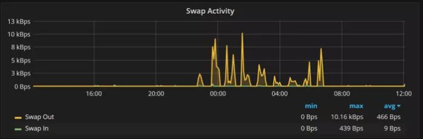
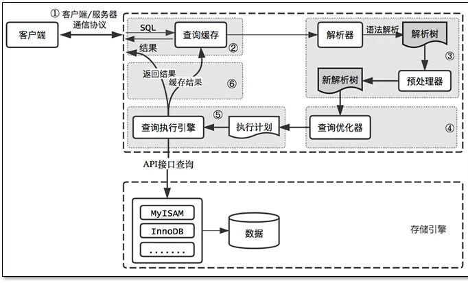
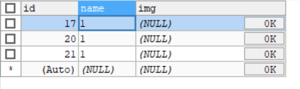
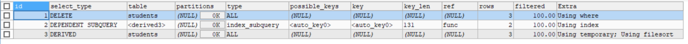
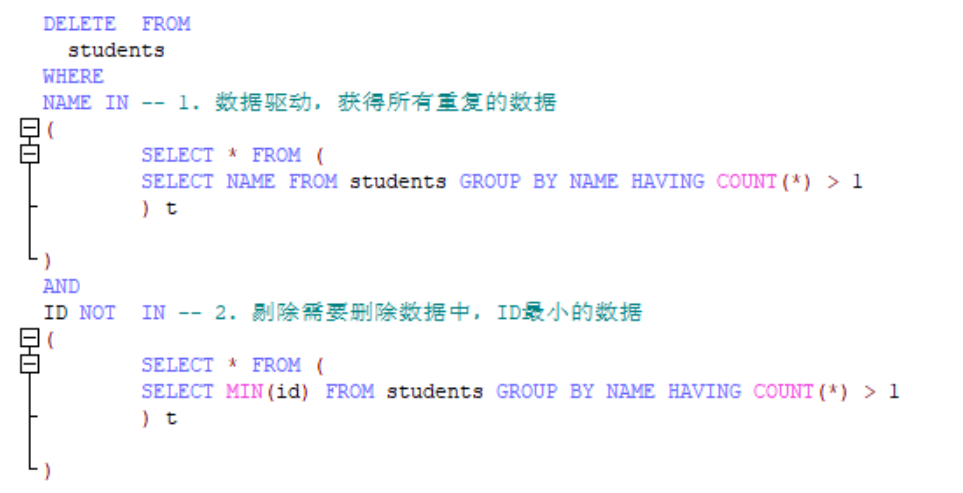

# MySQL—4.实践与优化

SQL优化 21 连击：https://mp.weixin.qq.com/s/A8OM449_JhKPIZa4P3w08Q

## 1.数据库瓶颈

不管是IO瓶颈，还是CPU瓶颈，最终都会导致数据库的活跃连接数增加，进而逼近甚至达到数据库可承载活跃连接数的阈值。在业务Service来看就是，可用数据库连接少甚至无连接可用。接下来就可以想象了吧（并发量、吞吐量、崩溃）。

1、IO瓶颈

第一种：磁盘读IO瓶颈，热点数据太多，数据库缓存放不下，每次查询时会产生大量的IO，降低查询速度
-> 分库和垂直分表。

第二种：网络IO瓶颈，请求的数据太多，网络带宽不够 -> 分库。

2、CPU瓶颈

第一种：SQL问题，如SQL中包含join，group by，order
by，非索引字段条件查询等，增加CPU运算的操作 ->
SQL优化，建立合适的索引，在业务Service层进行业务计算。

第二种：单表数据量太大，查询时扫描的行太多，SQL效率低，CPU率先出现瓶颈
-> 水平分表。

## 2.简单的SQL优化

mysql exsists和
in的效率比较：http://www.cnblogs.com/meibao/p/4973043.html

> http://www.cnblogs.com/beijingstruggle/p/5885137.html

MySQL执行计划解读：http://www.cnblogs.com/liu-ke/p/4432774.html

MySQL常用SQL语句优化：http://www.cnblogs.com/gomysql/p/3632209.html

数据库SQL优化大总结之 百万级数据库优化方案：

http://database.51cto.com/art/201407/445934.htm

现有数据表t_user_0

CREATE TABLE \`t_user_0\` (

\`id\` int(11) NOT NULL AUTO_INCREMENT,

\`name\` varchar(32) NOT NULL,

PRIMARY KEY (\`id\`),

KEY \`aaa\` (\`name\`)

) ENGINE=InnoDB AUTO_INCREMENT=10001 DEFAULT CHARSET=utf8

数据量为10000。

### 2.1.负向查询不能使用索引

IN 会使用索引

EXPLAIN SELECT * FROM \`t_user_0\` WHERE NAME IN('111', '222');

id select_type TABLE TYPE possible_keys KEY key_len ref ROWS Extra

1 SIMPLE t_user_0 RANGE aaa aaa 98 \\N 2 USING WHERE; USING INDEX

NOT IN 会使用索引

EXPLAIN SELECT * FROM \`t_user_0\` WHERE NAME NOT IN('111', '222');

id select_type TABLE TYPE possible_keys KEY key_len ref ROWS Extra

1 SIMPLE t_user_0 INDEX aaa aaa 98 \\N 10000 USING WHERE; USING INDEX

### 2.2.前导模糊查询不能使用索引

使用前导模糊不走索引

EXPLAIN SELECT * FROM \`t_user_0\` WHERE NAME LIKE '%1';

id select_type TABLE TYPE possible_keys KEY key_len ref ROWS Extra

1 SIMPLE t_user_0 INDEX \\N aaa 98 \\N 10000 USING WHERE; USING INDEX

使用后导模糊走索引

EXPLAIN SELECT * FROM \`t_user_0\` WHERE NAME LIKE '1%';

id select_type TABLE TYPE possible_keys KEY key_len ref ROWS Extra

1 SIMPLE t_user_0 RANGE aaa aaa 98 \\N 1111 USING WHERE; USING INDEX

### 2.3.数据区分不明显的不建议创建索引

如 user 表中的性别字段，可以明显区分的才建议创建索引，如身份证等字段。

### 2.4.字段的默认值不要为 null

这样会带来和预期不一致的查询结果。

### 2.5.在字段上进行计算不能命中索引

select name from user where FROM_UNIXTIME(create_time) < CURDATE();

应该修改为:

select name from user where create_time < FROM_UNIXTIME(CURDATE());

### 2.6.最左前缀问题

如果给 user 表中的 username pwd 字段创建了复合索引那么使用以下SQL
都是可以命中索引:

select username from user where username='zhangsan' and pwd ='axsedf1sd'

select username from user where pwd ='axsedf1sd' and username='zhangsan'

select username from user where username='zhangsan'

但是使用

select username from user where pwd ='axsedf1sd'

是不能命中索引的。

### 2.7.如果明确知道只有一条记录返回

select name from user where username='zhangsan' limit 1

可以提高效率，可以让数据库停止游标移动。

### 2.8.不要让数据库帮我们做强制类型转换

select name from user where telno=18722222222

这样虽然可以查出数据，但是会导致全表扫描。

需要修改为

select name from user where telno='18722222222'

### 2.9.如果需要进行 join 的字段两表的字段类型要相同

不然也不会命中索引。

### 2.10.如何提高数据库的性能

随着尺寸和负载的增长，MySQL的性能会趋于下降。

(1) 优化技巧 #1：学习如何使用 EXPLAIN

复杂的应用程序可以有复杂的模式和查询。如果想得到应用程序所需要的性能和扩展性，不能仅仅依靠直觉来理解如何执行查询。应该学习如何使用EXPLAIN命令，而不是随意的猜测和想象。此命令展示了如何执行查询，并让您了解所期望的性能，以及查询将如何随着数据大小的变化而伸缩。

在mysql5.7以上的版本中，现在执行结果“query cost”query
cost是指MySQL根据查询执行的总开销来考虑这个特定查询的代价，并且基于许多不同的因素。简单查询的查询开销通常小于1，000。开销在1，000到100，000之间的查询被认为是中等开销的查询，而且如果每秒只运行数百个这样的查询(而不是数万个)，通常会比较快。开销超过100，000的查询可以当作是昂贵的。通常，当您是系统上的单个用户时，这些查询仍会快速运行，但您应该仔细考虑在交互式应用程序中使用此类查询的频率(尤其是随着用户数量的增长)。当然，这些数字只是性能的一个大概的体现，但它们展示了一般原则。您的系统可能更好地处理查询工作负载，也可能更糟，这取决于其体系结构和配置。决定查询开销的主要因素是查询是否正确使用索引。EXPLAIN
命令可以告诉您查询是否使用索引(通常是因为索引是如何在数据库中创建的，或者查询本身是如何设计的)。这就是为什么学会使用
EXPLAIN 是如此重要

(1) 优化技巧 #2：创建正确的索引

(2) 优化技巧 #3：拒绝使用默认设置

Mysql的默认配置只适合用于开发，不适用于生产。

下面是三个MySQL性能优化设置，您应该始终仔细检查：

**innodb_ buffer_
pool_size**:缓冲池用于存放缓存数据和索引。这是使用具有大容量RAM的系统作为数据库服务器的主要原因。如果只运行InnoDB存储引擎，通常会将80%的内存分配给缓冲池。如果您正在运行非常复杂的查询，或者有大量的并发数据库连接，或大量的表，可能需要将此值降低一个档次，以便为其他操作分配更多的内存。

在设置InnoDB缓冲池大小时，需要确保不要设置得太大，否则会导致交换。这绝对会影响数据库性能。一种简单的检查方法是查看Percona
Monitoring and Management中的系统概述图中的交换活动：

如图所示，有时进行一些交换是可以的。但是，如果看到持续每秒1MB或更多的交换活动，则需要减少缓冲池大小(或其他内存使用)。如果在第一次访问时没有正确地获得innodb_
Buffer_ pool_
size的值，不用担心。从MySQL5.7开始，便可以动态更改InnoDB缓冲池的大小，而无需重新启动数据库服务器。

**innodb_ log_ file_
size**：这是单个InnoDB日志文件的大小。默认情况下，InnoDB使用两个值，这样您就可以将这个数字加倍，从而获得InnoDB用于确保事务持久的循环重做日志空间的大小。这也优化了将更改应用到数据库。设置innodb_
log_ file_
size是一个权衡的问题。分配的重做空间越大，对于写密集型工作负载而言，性能就越好，但是如果系统断电或出现其他问题，崩溃恢复的时间就越长。

如何知道MySQL的性能是否受到当前InnoDB日志文件大小的限制？可以通过查看实际使用了多少可用的重做日志空间来判断。最简单的方法是查看Percona
Monitor and Management InnoDB
Metrics仪表板。在下图中，InnoDB日志文件的大小不够大，因为使用的空间非常接近可用的重做日志空间(由红线表示)。日志文件的大小应该至少比保持系统最佳运行所用的空间大20%。

**MAX_
Connection**s：大型应用程序连接数通常需高于默认值。不同于其它变量，如果没有正确设置它，就不会有性能问题(本身)。相反，如果连接的数量不足以满足您的应用程序的需要，那么您的应用程序将无法连接到数据库(在您的用户看来，这就像是停机时间)。所以正确处理这个变量很重要。

如果在多个服务器上运行多个组件的复杂应用程序，很难知道需要多少连接。幸运的是，MySQL可以很容易地看到在峰值操作时使用了多少连接。通常，您希望确保应用程序使用的最大连接数与可用的最大连接数之间至少有30%的差距。查看这些数字的一种简单方法是在Percona监控和管理的MySQL概述仪表板中使用MySQL连接图。下图显示了一个健全的系统，其中有大量的附加连接可用。

需要记住的一点是，如果数据库运行缓慢，应用程序通常会创建过多的连接。在这种情况下，您应该处理数据库的性能问题，而不是简单地允许更多的连接。更多的连接会使底层的性能问题变得更糟。

(注意：当将max_Connections变量设置为明显高于默认值时，通常需要考虑增加其他参数，如表缓存的大小和打开的MySQL文件的数量。但是，这不属于本文讨论的范畴。)

(1) 优化技巧 #4：将数据库保存在内存中

近年来，我们看到了向固态磁盘(SSD)的过渡。尽管SSD比旋转硬盘快得多，但它们仍然无法与RAM中的数据相比。这种差异不仅来自存储性能本身，还来自数据库在从磁盘或SSD存储中检索数据时必须做的额外工作。

(1) 优化技巧 #5：使用SSD存储

提高DB服务器的io效率

(1) 优化技巧 #6：横向扩展

即使是高性能的服务器也有其局限性。有两种扩展方式：up和out。纵向扩展意味着购买更多的硬件。这可能很昂贵，而且硬件很快就会过时。横向扩展以处理更多的负载有几个好处：

- 可以利用较小且成本较低的系统。

- 通过横向扩展，进行线性扩展更快更容易。

- 数据库分布在多台物理机器上，所以数据库不会受到单个硬件故障点的影响。

虽然横向扩展是有好处的，但也有一定的局限性。扩展需要复制，例如基本的MySQL复制或Percona
XtraDB
Cluster，以实现数据同步。但是作为回报，可以获得额外的性能和高可用性。如果您需要更大的扩展，请使用MySQL分片。您还需要确保连接到集群体系结构的应用程序能够找到所需的数据–通常通过一些代理服务器和负载平衡器(如ProxySQL或HAProxy)。

(1) 优化技巧 #7：可观测性

设计最好的系统时要考虑到可观察性-MySQL也不例外。当发生问题时，你需要迅速而有效地解决它们。这样做的唯一方法是设置某种监视解决方案并对其进行适当的初始化。监控工具有诸如MySQL
Enterprise Monitor、Monyog和 Percona Monitoring and Management
(PMM)，后者具有免费和开源的额外优势。这些工具为监视和故障排除提供了很好的可操作性。

## 3.分库分表

### 3.1.水平分表和垂直分表

（x轴）水平分表就是我们常见的分表，已达到降低单表数据量的目标。

（y轴）垂直分表，就是一条记录的数据字段非常多，放在一个表中不合适，所以将其拆分出去

这个是符合AFK拆分原则的。

### 3.2.创建分片策略

- Hash取模，比如使用ID % 10 获得余数

优点： 数据可以均匀的放到那每个表中，操作时就不会有热点问题

缺点： 扩容不方便，需要对历史数据进行rehash以及数据的迁移。

- 范围分表，比如使用ID，1~1000W到表1，1000w~2000w到表2

优点： 有利于将来的扩容，不需要做数据迁移

缺点： 可能存在热点问题

- 时间分表，比如根据数据生成的时间，按日、按月、按年等

优点： 扩容能力一般，和hash取模策略的方式差不多

缺点： 扩容和热点问题都存在

- 其他策略，例如有OA系统使用公司分表，有地图类系统使用地区分表

优点： 功能性分片，不是为了数据量大才分片的

缺点： 扩容和热点问题都存在

PS：热点的含义：

热点的意思就是对数据操作集中到1个表中，其他表的操作很少。热点越分散越好

比如订单数据有个特点就是时间属性，一般用户操作订单数据，都会集中到这段时间产生的订单。

如果这段时间产生的订单
都在同一张订单表中，那就会形成热点，那张表的压力会比较大。

- 最佳实践：

没有真正意义上的最佳实践，只有根据业务的形式不同，数据的不同，设计出最佳的分片策略。

比如，
类型电商的订单的表，比较适合使用时间维度进行分表，但是后面随着业务的扩展，分表内数量还是太大了，这就需要扩容。之后数量大了，又继续扩容。这样就不太对了。

所以我们可以使用范围与hash结合在一起生成分表。

比如0~1000W，范围路由获得DB1，DB1内部通过hash的方式，可以将表分成10个，每个表的数据量都是可控的。后面数据量大的时候，我们就可以通过增加数据库的方式，进行扩展。

永不迁移数据、避免热点：
[https://mp.weixin.qq.com/s/54U3wbArCNZwGyRdZ2bkZg](https://mp.weixin.qq.com/s/54U3wbArCNZwGyRdZ2bkZg)

Ps:这里在实践的时候，会用到2个分布式的技术，一个是分布式ID生成算法，这样生产的ID可读性好，连续性强，业务性突出。另一个是分布式配置中心，这样可以动态的修改数据库的配置，而不用重启系统。

### 3.3.常见的分库分表技术有

基于cobar的mycat、当当的sharding-jdbc、阿里的Cobar等十几种开源的技术。

主要分为程序的插件与数据库代理两种方式。

其实最根本的解决方案是分布式数据库：比如阿里的oceanBase、TiDB。

有利网已经开始采用TiDB处理理财端订单

### 3.4.sharding-jdbc实现原理

[https://www.cnblogs.com/dalianpai/p/12312640.html](https://www.cnblogs.com/dalianpai/p/12312640.html)

确实用起来比较复杂，但是对于大量的分库分表的场景，简单的操作是非常方便的

实际工作中，简单的单表查询，与简单的跨表查询，使用Sharding jdbc。

对于复杂的表连接、分页查询、多字段排序等。使用的原生的SQL。消除Sharding
jdbc的不稳定性，与复杂场景的规则配置。

分布式事务：sharding-jdbc支持三种事务类型，local、xa、base

[https://blog.csdn.net/Howinfun/article/details/87371903](https://blog.csdn.net/Howinfun/article/details/87371903)

### 3.5.业界难题-“跨库分页”的四种方案

[https://mp.weixin.qq.com/s/h99sXP4mvVFsJw6Oh3aU5A?](https://mp.weixin.qq.com/s/h99sXP4mvVFsJw6Oh3aU5A?)

自己实现复杂查询的方案：

1.确认分表后，执行多个where .. order by .. limit x,
然后在程序中进行结果合并，排序等。

2.根据业务情况，禁止跨表差

3.使用es，将过去的历史数据进行合并

### 3.6.【拉钩】分表数据聚合

[https://blog.csdn.net/majunzhu/article/details/100163523](https://blog.csdn.net/majunzhu/article/details/100163523)

https://mp.weixin.qq.com/s/swH-3HUtNo9TAFFGybYTTg

分库分表时，我们一般选择业务上非常适合字段规则进行分片，比如时间、主键id等，但是如果查询的维度发生变化的时候，进行统计、分组、分页、排序等操作的时候就会变的非常麻烦。

方案1：数据进行物理聚合，设置字段完全相同的表，进行数据双写或同步，可以解决全部问题。或者依赖大数据es、hive等实现数据的聚合。

方案2：历史数据一般不会发生变化，所以可以在需要的数据提前进行聚合。

### 3.7.分布式ID生产器

[https://www.cnblogs.com/wuneng/p/11478160.html](https://www.cnblogs.com/wuneng/p/11478160.html)

常见的分案如下：

数据库，使用自增主键，专门有个表用来生产ID，普通的实现方案

Redis，数字自增，并不是十分合适的方案，因为数据可能丢失和重复ID

Uuid，数据是字符串，无法做到数量连续或者递增

雪花算法：完美的方案，推荐使用美团的算法（强依赖时间，所以最好关闭机器的时间同步）

双master集群，两个数据库自增id初始值不一样，自增步长是2，这样就是13,5,7和2,4,6,8

号段，不同的分片使用不同的区间,也是使用数据库实现的。

为什么需要分布式ID以及分布式ID的业务需求：[https://www.jianshu.com/p/1b5472fe4e77](https://www.jianshu.com/p/1b5472fe4e77)

分布式ID之UUID适合做分布式ID吗：
[https://www.itqiankun.com/article/1565060584](https://www.itqiankun.com/article/1565060584)

分布式ID之数据库自增ID实现分布式ID：[https://www.itqiankun.com/article/1565142723](https://www.itqiankun.com/article/1565142723)

分布式ID之Redis集群实现的分布式ID：[https://www.itqiankun.com/article/1565227901](https://www.itqiankun.com/article/1565227901)

分布式ID之雪法算法Snowflake实现分布式ID：[https://www.itqiankun.com/article/1565747019](https://www.itqiankun.com/article/1565747019)

实际可用的分布式ID优化方案-双buffer：[https://mp.weixin.qq.com/s/dEkkSCbQzfhH3NuXsbbY0w](https://mp.weixin.qq.com/s/dEkkSCbQzfhH3NuXsbbY0w)

### 3.8.【拉钩】数据库读写分离

java读写分离的实现：[https://www.cnblogs.com/ngy0217/p/8987508.html](https://www.cnblogs.com/ngy0217/p/8987508.html)

方案从两个方面入手：应用层与中间件层

应用层：借助spring AbstractRoutingDataSource
类与aspectJ、注解实现数据源的切换

中间件层：使用shardingjdbc或mycat实现。

## 4.案例

### 4.1.删除数据库中重复的数据

[https://mp.weixin.qq.com/s/i9snrTIpHvZjCr7AgVhydg](https://mp.weixin.qq.com/s/i9snrTIpHvZjCr7AgVhydg)

数据表如下： students

我们正常的思路如下：

DELETE FROM students WHERE NAME IN

( SELECT NAME FROM students GROUP BY NAME HAVING COUNT(*) > 1 );

错误异常如下：

You can't specify target table 'students' for update in FROM clause

原因：查询这个表的同时又去更新了这个表，可以简单理解为死锁。

解决方案：将子查询作为结果进行操作，也就是数据驱动（DERIVED）。使二者在事务上没有直接关系

DELETE FROM students WHERE NAME IN

(

SELECT * FROM (

SELECT NAME FROM students GROUP BY NAME HAVING COUNT(*) > 1

) t

)

Explain结果如下：

而删除重复数据的SQL如下：

### 4.2.INSERT ON DUPLICATE KEY

实际业务场景中，经常会有一个这样的需求，插入某条记录，如果已经存在了则更新它如果更新日期或者某些列上的累加操作等，我们肯定会想到使用INSERT
... ON DUPLICATE KEY
UPDATE语句，一条语句就搞定了查询是否存在和插入或者更新这几个步骤，但是使用这条语句在msyql的innodb5.0（MySQL5.7+）以上版本有很多的陷阱，即有可能导致death
lock死锁也有可能导致主从模式下的replication产生数据不一致。

对于insert...on duplicate key update这个语句会引发dealth
lock问题，官方文档也没有相关描述，只是进行如下描述：

An INSERT ... ON DUPLICATE KEY UPDATE statement against a table having
more than one unique or primary key is also marked as unsafe. (Bug
#11765650, Bug #58637)

也就是如果一个表定义有多个唯一键或者主键时，是不安全的，这又引发了以一个问题，见https://bugs.mysql.com/bug.php?id=58637。

也就是当mysql执行INSERT ON DUPLICATE KEY的
INSERT时，存储引擎会检查插入的行是否会产生重复键错误。如果是的话，它会将现有的行返回给mysql，mysql会更新它并将其发送回存储引擎。当表具有多个唯一或主键时，此语句对存储引擎检查密钥的顺序非常敏感。根据这个顺序，存储引擎可以确定不同的行数据给到mysql，因此mysql可以更新不同的行。存储引擎检查key的顺序不是确定性的。例如，InnoDB按照索引添加到表的顺序检查键。

insert ... on duplicate key
在执行时，innodb引擎会先判断插入的行是否产生主键或唯一键冲突，如果存在，就对该现有的行加上S（共享锁）锁，然后mysql执行duplicate后的update操作，然后对该记录加上X（排他锁），最后进行update写入。

解决办法：

1、尽量不对存在多个唯一键的table使用该语句。

2、在有可能有并发事务执行的insert 的内容一样情况下不使用该语句。

### 4.3.死锁解决思路

[https://mp.weixin.qq.com/s/csgzwxe8PIgMdgf2gEkMRA](https://mp.weixin.qq.com/s/csgzwxe8PIgMdgf2gEkMRA)

### 4.4.对线上千万级大表加字段时，性能极慢问题如何处理

[https://www.pianshen.com/article/47561758190/](https://www.pianshen.com/article/47561758190/)

卡不可怕，可怕的是最后还添加失败了。

方案：

- 将字段添加到新的表中与主表进行关联（缺点是后面再增加字段的时候怎么办）

- 断网执行脚本（缺点是可能失败，并且影响业务）

- 进行数据迁移，降低数据量

- 升级到mysql8.*。使用了新的算法

- 使用newSQL数据库，比如tidb等

## 5.面试

MySQL 高频 100 问：[https://mp.weixin.qq.com/s/r9QgbNkrMN3qihnK4oQudg](https://mp.weixin.qq.com/s/r9QgbNkrMN3qihnK4oQudg)

## 6.行行比较

SELECT * FROM IDC_IP WHERE (IP, MACHINE_SN) IN

(

('10.176.0.12', 'B7485Z2'),

('10.139.18.127', 'PC0841LW')

)

## 7.面试题

滴滴：能说说Mysql索引底层B+树结构与算法吗？

滴滴：聚集索引与覆盖索引与索引下推到底是什么？

阿里：能说说Mysql并发支撑底层Buffer Pool机制吗？

拼多多：能说下Mysql事务底层实现原理吗？

唯品会：MVCC机制是如何保证事务的隔离性的？

京东：超高并发下使用事务时如何避免死锁？

京东：对线上千万级大表加字段时，性能极慢问题如何处理

https://www.pianshen.com/article/47561758190/

卡不可怕，可怕的是最后还添加失败了

### 7.1.在微服务中，分库分表带来的性能瓶颈

一个服务可能部署10台，每台服务都使用了数据库，这样连接到数据库的连接可能就是10
* 20 = 200

20为初始状态的数据库连接池连接数量。这时如果我们扩容到100台机器的话，那我们什么都不干的时候，

数据库上的连接就是100 * 20 = 2000.数据库是扛不住的。

反过来思考，使用分库分表的时候，如果分了100个数据库，这样一个服务上就需要创建100个数据库连接池。

一下子就使用了服务器上 100 * 20 = 2000 个 线程。

实际上，思路很简单：我们不让应用连接所有的数据库就可以了。

假设我们根据 range 分成了 10 个库，现在有 10
个应用，我们让每个应用只连一个库，当应用增多变成 20个，

数据库的连接不够用了，我们就将 10 个库分成 20
个库，这样，无论你应用扩容到多少个，

都可以解决数据库连接数过多的问题。

注意：做这件事的前提是：你必须保证，访问你这个应用的 request
请求的数据库一定是在这个应用的

换个说法，当用户从 DNS
那里进来的时候，就知道自己要去那个应用了，所以，规则在 DNS
之前就定好了，

虽然这有点夸张，但肯定在进应用之前就知道要去哪个库了。所以，这通常需要一个规则，例如通过用户
ID hash，

由配置中心广播 hash
规则。这样，所有的组件都能保持一致的规则，从而正确的访问到数据库。

例如使用dubbo，feign等可以自定义负载和路由算法。

方案二：可以把连接数据库的服务单独抽离出去，用户不直接访问该服务。
