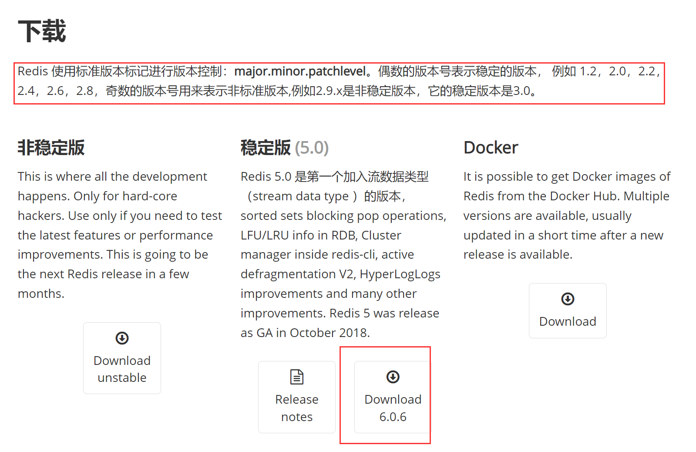

# 1.基础

- Redis组织官网（包含Redis、RedisJson、RedisSearch等项目）：[https://redis.io/](https://redis.io/)
- 中文官网：[https://www.redis.net.cn/](https://www.redis.net.cn/)
- 中文文档：[https://www.redisio.com/](https://www.redisio.com/)

推荐书籍
- 《Redis入门指南（第2版）》
- 《Redis设计与实现》
- 《Redis开发与运维》
- 《Redis实战》
- 《Redis深度历险：核心原理与应用实践》
- 《Redis使用手册》
- 《Redis设计与源码分析》
- 《Redis 4.x Cookbook中文版》
- 《深入理解Redis》
- 《Redis Essentials》
- 《Redis核心原理与实践》

## 1.介绍

**1.redis是什么**
> redis是开源的，内存型kv数据库。可以用来存储字符串、哈希结构、列表、集合等数据结构。

**2.使用场景**

Redis在国内各大公司都能看到其身影，比如我们熟悉的新浪，阿里，腾讯，百度，美团，小米等。
学习 Redis，这几方面尤其重要：Redis 客户端、Redis 高级功能、Redis 持久化和开发运维常用问题探讨、Redis 复制的原理和优化策略、Redis分布式解决方案等。
- String：缓存、限流、计数器、分布式锁、分布式Session
- Hash：存储用户信息、用户主页访问量、组合查询
- List：微博关注人时间轴列表、简单队列
- Set：赞、踩、标签、好友关系
- Zset：排行榜

## 2.安装

官方安装教程：[https://developer.redis.com/create](https://developer.redis.com/create)

**目录结构**
- redis-benchmark 性能测试，用以模拟同时由N个客户端发送M个SET/GET查询
- redis-check-aof aof日志文件检测工(比如断电宕机等造成日志损坏，可以检测并修复)
- redis-check-dump rdb快照文件检测工具
- redis-cli 命令行连接的客户端
- redis-server Redis服务进程

### 2.1.单机

#### 2.1.1.Linux安装
下载地址：[http://download.redis.io/releases/](http://download.redis.io/releases/)

下载最新版或者最新release版（redis只有3.0以上的版本开始支持集群），这里我们下载的是：redis-6.0.6.tar.gz，



```text
1.将压缩包存放在每个服务器的目录是：/usr/local
2.到该目录解压安装包
  tar -zxvf redis-6.0.6.tar.gz
3.进入redis目录
  cd redis-6.0.6
4.编译项目
  make
  显示编译成功即可
5.安装
    安装到指定的目录,比如 /usr/local/redis
    make PREFIX=/usr/local/redis install
6.启动项目
  注意这里必须指定redis.conf，否则都是默认的配置
  ./bin/redis-server redis.conf

7.测试端口是否正常
    netstat -nlt | grep 6379
    tcp 0 0 0.0.0.0:6379 0.0.0.0:* LISTEN
    tcp6 0 0 :::6379 :::* LISTEN
    ip为0.0.0.0即可远程访问，要是127.0.0.1或者localhost就不行了

8.使用ip访问redis
  ./reids-cli -h 192.168.3.101 -p 6379
```

**开启远程访问**：redis 3.2 以上的版本上入了新特性，默认只支持本地连接。想要远程连接需要以下操作

```shell
vim redis.conf

# 1.此处注释掉、或者将bind 127.0.0.1改为 0.0.0.0、 或者指定ip可供远程连接
bind 0.0.0.0

# 2.将保护模式 yes改为no 可供远程连接
protected-mode no

# 3.此处守护进程改为yes 可供后台启动
daemonize yes

# 4 使用密码连接，提高安全性
requirepass 123456
```

#### 2.1.2.window安装

官方不提供windows版本。市面上比较可靠的有两个。

- 微软移植版：[https://github.com/microsoftarchive/redis](https://github.com/microsoftarchive/redis)
最高只有3.2。
  
- 个人开发编译：[https://github.com/tporadowski/redis/releases](https://github.com/tporadowski/redis/releases)
最高是5.0。推荐使用这个。

### 2.2.主从

1、安装多个Redis
- 7001 master
- 7002 slaveof-0
- 7002 slaveof-1

2、修改redis.conf配置文件

```shell
#1.修改master
port 7001
bind 0.0.0.0
protected-mode no
daemonize yes

# 2.修改slaveof
port 7002
bind 0.0.0.0
protected-mode no
daemonize yes
# 增加行
slaveof 127.0.0.1 7001   

# 3.修改slaveof
port 7003
bind 0.0.0.0
protected-mode no
daemonize yes
# 增加行
slaveof 127.0.0.1 7001
```

3、启动服务，查看从redis是否存在主redis的数据

```shell
# 1.master 的日志
# 初始化Redis服务
[15500] 02 Dec 20:29:51.727 # Server initialized
# 加载rdb数据，耗时0.032s
[15500] 02 Dec 20:29:51.759 * DB loaded from disk: 0.032 seconds
# 已经准备好接受客户端的连接了
[15500] 02 Dec 20:29:51.759 * Ready to accept connections
# slave 启动了，开始订阅 master的数据，进行同步
[15500] 02 Dec 20:30:28.431 * Replica 127.0.0.1:7002 asks for synchronization
# 全量同步
[15500] 02 Dec 20:30:28.431 * Full resync requested by replica 127.0.0.1:7002
# 使用BGSAVE
[15500] 02 Dec 20:30:28.431 * Starting BGSAVE for SYNC with target: disk
# 后台【fork一个子进程】开始dump数据，子进程 ID = 15024
[15500] 02 Dec 20:30:28.476 * Background saving started by pid 15024
# 子进程操作成功
[15500] 02 Dec 20:30:28.688 # fork operation complete
[15500] 02 Dec 20:30:28.707 * Background saving terminated with success
# 向slave同步数据并成功
[15500] 02 Dec 20:30:28.714 * Synchronization with replica 127.0.0.1:7002 succeeded

# 2.slaveof 的日志
[23504] 02 Dec 20:30:28.398 # Server initialized
[23504] 02 Dec 20:30:28.429 * DB loaded from disk: 0.031 seconds
[23504] 02 Dec 20:30:28.429 * Ready to accept connections
# 连接master
[23504] 02 Dec 20:30:28.430 * Connecting to MASTER 127.0.0.1:7001
# 开始同步数据
[23504] 02 Dec 20:30:28.430 * MASTER <-> REPLICA sync started
# 使用非阻塞的方式同步(也就是psync函数)
[23504] 02 Dec 20:30:28.430 * Non blocking connect for SYNC fired the event.
# 同步过程中，使用ping的方式去保持连接
[23504] 02 Dec 20:30:28.430 * Master replied to PING, replication can continue...
# 不进行部分同步
[23504] 02 Dec 20:30:28.431 * Partial resynchronization not possible (no cached master)
# 开始进行全量同步，接收主节点的 同步副本的id 和 偏移量offset
[23504] 02 Dec 20:30:28.476 * Full resync from master: b1900a284495a00827d662583d9848c4c484061e:0
# 开始接受master的数据
[23504] 02 Dec 20:30:28.711 * MASTER <-> REPLICA sync: receiving 1054786 bytes from master
# 清空自己的旧数据
[23504] 02 Dec 20:30:28.715 * MASTER <-> REPLICA sync: Flushing old data
# 加载master同步过来的rdb
[23504] 02 Dec 20:30:28.724 * MASTER <-> REPLICA sync: Loading DB in memory
# 同步完成
[23504] 02 Dec 20:30:28.760 * MASTER <-> REPLICA sync: Finished with success
```

4、主从切换，master宕机后，手动切换
```shell
# 7002 作为新的master，执行下面的命令
127.0.0.1:7002> slaveof no one  # 本机关闭 slaveof
127.0.0.1:7002> config set slave-read-only no    # 关闭只读的状态

# 7003 还是slave，但是需要修改 master为7002
127.0.0.1:7003> slaveof 127.0.0.1:7002
```

5、备注
- 需要自己创建从redis相关目录
- 从redis只有读取权限
- 主故障后只能手动切换

### 2.3.哨兵

1、安装多个Redis
- 7001 master     不需要主从的配置
- 7002 slaveof-0  不需要主从的配置
- 7002 slaveof-1  不需要主从的配置
- 6000 sentinel

2、修改哨兵的配置文件
```shell
port 6000
bind 0.0.0.0
protected-mode no
daemonize yes

# 监视一个名为mymaster的主redis实例，地址是：127.0.0.1:7001，这个实例至少由1个哨兵判断为主观下线，就会切换主从
# 一般我们配置了3个哨兵，就可以配置2个同步切换就切换，如果只有1个哨兵，就必须配置1，否则永远不能切换了
sentinel monitor mymaster 127.0.0.1 7001 1
# 指定了Sentinel认为Redis实例已经失效所需的毫秒数。当 实例超过该时间没有返回PING，或者直接返回错误，
# 那么Sentinel将这个实例标记为主观下线。只有一个 Sentinel进程将实例标记为主观下线并不一定会引起实例的自动故障迁移：
# 只有在足够数量的Sentinel都将一个实例标记为主观下线之后，实例才会被标记为客观下线，这时自动故障迁移才会执行
sentinel down-after-milliseconds mymaster 5000
# 指定了在执行故障转移时，最多可以有多少个从Redis实例在同步新的主实例，在从Redis实例较多的情况下这个数字越小，同步的时间越长，
# 完成故障转移所需的时间就越长
sentinel parallel-syncs mymaster 1
# 如果在该时间（ms）内未能完成failover操作，则认为该failover失败
sentinel failover-timeout mymaster 15000
#**认证密码**
sentinel auth-pass mymaster 123            
# Generated by CONFIG REWRITE
sentinel config-epoch mymaster 144
sentinel leader-epoch mymaster 144
#**从redis**
sentinel known-slave mymaster 127.0.0.1 7002
sentinel known-slave mymaster 127.0.0.1 7003 
sentinel current-epoch 144
```

3、启动服务哨兵。需要增加一个特别的参数

```shell
# 启动服务 
./bin/redis-server redis.conf --sentinel

[25932] 02 Dec 21:39:16.599 # Sentinel ID is 5d478594edf2f5bf2f3c446741b7c613aaa88444
[25932] 02 Dec 21:39:16.600 # +monitor master mymaster 127.0.0.1 7001 quorum 1
[25932] 02 Dec 21:39:26.679 * +convert-to-slave slave 127.0.0.1:7002 127.0.0.1 7002 @ mymaster 127.0.0.1 7001
[25932] 02 Dec 21:39:26.679 * +convert-to-slave slave 127.0.0.1:7003 127.0.0.1 7002 @ mymaster 127.0.0.1 7001

## 当master宕机
# 主观下线
[9632] 02 Dec 21:51:30.318 # +sdown master mymaster 127.0.0.1 7001
# 法定人数是否符合阈值，到达的话就客观下线
[9632] 02 Dec 21:51:30.318 # +odown master mymaster 127.0.0.1 7001 #quorum 1/1
# 开启新朝代
[9632] 02 Dec 21:51:30.318 # +new-epoch 145
# 尝试去掉配置文件中的master
[9632] 02 Dec 21:51:30.318 # +try-failover master mymaster 127.0.0.1 7001
[9632] 02 Dec 21:51:30.321 # +vote-for-leader 5d478594edf2f5bf2f3c446741b7c613aaa88444 145
[9632] 02 Dec 21:51:30.321 # +elected-leader master mymaster 127.0.0.1 7001
[9632] 02 Dec 21:51:30.321 # +failover-state-select-slave master mymaster 127.0.0.1 7001
[9632] 02 Dec 21:51:30.411 # +selected-slave slave 127.0.0.1:7002 127.0.0.1 7002 @ mymaster 127.0.0.1 7001
[9632] 02 Dec 21:51:30.411 * +failover-state-send-slaveof-noone slave 127.0.0.1:7002 127.0.0.1 7002 @ mymaster 127.0.0.1 7001
[9632] 02 Dec 21:51:30.490 * +failover-state-wait-promotion slave 127.0.0.1:7002 127.0.0.1 7002 @ mymaster 127.0.0.1 7001
[9632] 02 Dec 21:51:31.113 # +promoted-slave slave 127.0.0.1:7002 127.0.0.1 7002 @ mymaster 127.0.0.1 7001
[9632] 02 Dec 21:51:31.114 # +failover-state-reconf-slaves master mymaster 127.0.0.1 7001
[9632] 02 Dec 21:51:31.172 # +failover-end master mymaster 127.0.0.1 7001
# 选举出新的master
[9632] 02 Dec 21:51:31.172 # +switch-master mymaster 127.0.0.1 7001 127.0.0.1 7002
# 切换master
[9632] 02 Dec 21:51:31.172 * +slave slave 127.0.0.1:7001 127.0.0.1 7001 @ mymaster 127.0.0.1 7002
[9632] 02 Dec 21:51:36.234 # +sdown slave 127.0.0.1:7001 127.0.0.1 7001 @ mymaster 127.0.0.1 7002
```

4、备注
- 如果主redis挂了,哨兵回去修改从redis的配置文件，和哨兵本身配置文件，将从的redis修改为主的redis
- 一般选择3个哨兵（哨兵高可用的最低配置，允许1个哨兵故障）、一主一备。

### 2.4.cluster集群
#### 2.4.1.Linux安装过程

以下是在单机上配置6节点集群

1.创建节点（当前位置在redis-3.2.1）

```shell
mkdir redis-cluster
mkdir 7000 7001 7002 7003 7004 7005
```

然后将redis.conf拷贝到各个节点：

```shell
cp /redis.conf ../7000
cp /redis.conf ../7001
cp /redis.conf ../7002
cp /redis.conf ../7003
cp /redis.conf ../7004
cp /redis.conf ../7005
```

2.修好配置文件

```shell
daemonize    yes                          //redis后台运行
pidfile  /var/run/redis_7000.pid          //pidfile文件对应7000,7002,7003
port  7000                                //端口7000,7002,7003
cluster-enabled  yes                      //开启集群  把注释#去掉
cluster-config-file  nodes_7000.conf      //集群的配置  配置文件首次启动自动生成 7000,7001,7002
cluster-node-timeout  5000                //请求超时  设置5秒够了
appendonly  yes                           //aof日志开启  有需要就开启，它会每次写操作都记录一条日志
bind 192.168.200.140                      //绑定ip	bind需要绑定当前服务器的IP
```

3.启动redis

```shell
./redis-server ../7000/redis.conf
./redis-server ../7001/redis.conf
./redis-server ../7002/redis.conf
./redis-server ../7003/redis.conf
./redis-server ../7004/redis.conf
./redis-server ../7005/redis.conf

./redis-cli -h ip -p port shutdown #终止服务
ps -ef | grep redis   #查看是否启动成功
netstat -tnlp | grep redis #可以看到redis监听端口
```

可以编写启动脚本（&是在后台启动redis）

```shell
./redis-server ../7000/redis.conf &
./redis-server ../7001/redis.conf &
./redis-server ../7002/redis.conf &
./redis-server ../7003/redis.conf &
./redis-server ../7004/redis.conf &
./redis-server ../7005/redis.conf &
```

4.创建集群 需要ruby环境

之前redis节点已经准备好了，但是要将redis串联起来就得需要redis的一个工具：redis-trib.rb

Ubuntu ：

```shell
sudo apt-get install zlib1g zlib1g-dev zlib1g-dpg
sudo apt-get install ruby-full
```

CentOS：

```shell
yum -y install ruby ruby-devel rubygems rpm-build
sudo yum install ruby
```

安装 GEM，Redis 的 ruby 支持环境（2.0以上自带gem）

切换源：[https://rubygems.org](https://rubygems.org)

由于 GFW的问题， GEM 的源在国内不可用，所以使用淘宝的映像：

使用cmd命令：

添加：

```gem sources -a https://ruby.taobao.org```

查看已存在的源：

```gem sources -l```

删除被墙的源：

```gem sources -r https://rubygems.org/```

在用gem命令安装redis接口，gem是ruby的一个工具包

```gem install redis```

5.下载redis-trib.rb，并启动集群(redis-trib.rb存放位置不限)

需要权限：chmod 777 redis-trib.rb

```shell
./redis-trib.rb create --replicas 1 127.0.0.1:7000 127.0.0.1:7001 127.0.0.1:7002 127.0.0.1:7003 127.0.0.1:7004 127.0.0.1:7005
```

注意：

--replicas 1 表示自动为每个master节点分配一个slave节点 ，如果想手动指定 Slave , 将该值变为 0 即可， 地址列表中，只需要3个实例即可

防火墙一定要开放监听的端口，否则会创建失败

由于使用的是 6个实例，自动分配 Slave ，所以前3个为 master , 后3 个为 slave， 并确定3个主节点的 slots 范围。

在运行过程中会提示：Can I set the above configuration? (type 'yes' to accept): yes //输入yes

```shell
运行./redis-trib.rb check 127.0.0.1:7000
```

如果确认没有问题， 输入 yes

如果群集创建成功， 会输出 OK XXXXX

如果出现：err slot xxx is already busy, 请删除 appendonly.aof 及 nodes-xxx.conf (cluster-config-file 所指的文件) 文件

6.测试

```shell
./redis-cli -c -p 7000
```

必须使用-c才能连接到真正的集群上，否则只是连接到普通的单机上

7.总结

- redis cluster在设计的时候，就考虑到了去中心化、去中间件，也就是说，集群中的每个节点都是平等关系，都是对等的，每个节点都
- 保存各自的数据和整个集群的状态。每个节点都和其他所有节点连接，而且这些连接保持活跃，这样就保证了我们只需要连接集群中的任
- 意一个节点，就可以获取到其他节点的数据。

#### 2.4.2.Ruby安装

安装依赖：

``` sudo apt-get install zlib1g zlib1g-dev zlib1g-dpg ```


安装 GEM，Redis 的 ruby 支持环境（2.0以上自带gem）

切换源：[https://rubygems.org](https://rubygems.org)

由于 GFW的问题， GEM 的源在国内不可用，所以使用淘宝的映像：

使用cmd命令：

添加：

```gem sources -a https://ruby.taobao.org```

查看已存在的源：

```gem sources -l```

删除被墙的源：

```gem sources -r https://rubygems.org/```

#### 2.4.3.集群命令

- 集群
    - cluster info ：打印集群的信息
    - cluster nodes ：列出集群当前已知的所有节点（node），以及这些节点的相关信息。

- 节点
    - cluster meet <ip> <port> ：将 ip 和 port 所指定的节点添加到集群当中，让它成为集群的一份子。
    - cluster forget <node_id> ：从集群中移除 node_id 指定的节点。
    - cluster replicate <node_id> ：将当前节点设置为 node_id 指定的节点的从节点。
    - cluster saveconfig ：将节点的配置文件保存到硬盘里面。

- 槽(slot)
    - cluster addslots <slot> [slot ...] ：将一个或多个槽（slot）指派（ assign）给当前节点。
    - cluster delslots <slot> [slot ...]：移除一个或多个槽对当前节点的指派。
    - cluster flushslots：移除指派给当前节点的所有槽，让当前节点变成一个没有指派任何槽的节点。
    - cluster setslot <slot> node <node_id> ：将槽 slot 指派给node_id指定的节点，如果槽已经指派给另一个节点，那么先让另一个节点删除该槽>，然后再进行指派。
    - cluster setslot <slot> migrating <node_id> ：将本节点的槽slot 迁移到 node_id 指定的节点中。
    - cluster setslot <slot> importing <node_id> ：从 node_id指定的节点中导入槽 slot 到本节点。
    - cluster setslot <slot> stable ：取消对槽 slot 的导入（import）或者迁移（ migrate）。

- 键
    - cluster keyslot <key> ：计算键 key 应该被放置在哪个槽上。
    - cluster countkeysinslot <slot> ：返回槽 slot目前包含的键值对数量。
    - cluster getkeysinslot <slot> <count> ：返回 count 个 slot槽中的键

#### 2.4.4.实现原理

Redis 集群没有并使用传统的一致性哈希来分配数据，而是采用另外一种叫做哈希槽 (hash slot)的方式来分配的。
redis cluster默认分配了 16384 个 slot，当我们 set 一个 key 时，会用CRC16算法来取模得到所属的slot，
然后将这个 key 分到哈希槽区间的节点上，具体算法就是：CRC16(key) %16384。
所以我们在测试的时候看到 set 和 get的时候，直接跳转到了7000端口的节点。

Redis 集群会把数据存在一个 master 节点，然后在这个 master 和其对应的salve 之间进行数据同步。
当读取数据时，也根据一致性哈希算法到对应的master 节点获取数据。只有当一个 master 挂掉之后，才会启动一个对应的 salve 节点，充当 master 。

需要注意的是：必须要3个或以上的主节点，否则在创建集群时会失败，并且当存活的主节点数小于总节点数的一半时，整个集群就无法提供服务了。

#### 2.4.5.常见问题

##### 2.4.5.1.创建集群卡住

以上是同一台机器上的群集部署方案，同一台虚拟机，使用不同的实例,创建群集时，一路顺利。

但是将实例部署到不同的机器上，我分别在6台虚拟机上安装了 Redis,但一开始创建群集的时候，就卡在这里：

```shell
>>> Nodes configuration updated
>>> Assign a different config epoch to each node
>>> Sending CLUSTER MEET messages to join the cluster

Waiting for the cluster to join....................
```

一直在这个 Waiting for the cluster to join 这里。。。

用Redis自带的检测工具检查

```shell
redis-trib.rb check 192.168.18.111:6379
[ERR] Not all 16384 slots are covered by nodes
```

具体的就是某台 master 上的 sloats 是 0

用客户端连接到那个没有分配 sloat 的 redis 实例，发送以下命令：

```shell
cluster meet 192.168.18.111 6379
```

回头在用 Redis-trib.rb check 检查， 发现

```shell
[OK] All 16384 slots covered.
```

但是群集的创建还是卡在那个 waiting 上 ,继续在其它节点上发送 cluster meet 命令，回头在用 redis-trib.rb check ,
神奇的 Not all 16384 slots are covered by nodes 居然又来了。

将那个slots 为 0的实例做为 slave（放到参数列表的最后），在创建，顺利通过！这个问题真是神奇啊！

##### 2.4.5.2.集群关闭后启动失败

Redis cluster 最小集群为6节点（3master 3slave），挂掉任意一个整个集群都会宕机。

redis cluster集群中的节点基本上都对等的，没有管理节点。如果要让所有节点都关闭，只能关闭进程了：pkill -9 redis

把所有集群都关闭，然后在重新启动，会报以下错误

```shell
# redis-trib.rb create --replicas 1
xxx.xxx.xxx.xxx:6379。。。。。。。。。
会报以下错误，

[ERR] Node 192.168.10.219:6379 is not empty. Either the node already knows other nodes (check with CLUSTER NODES) or contains some key in database 0.
```

第一次启动集群时，/etc/redis下只有redis.conf，所以我想把除了redis.conf外的其他文件全部删除，在启动肯定是可以的，但是集群是有数据的，所以保留了配置文件和数据文件。

```shell
# cd /etc/redis
# rm -f *.aof nodes-63*
# ll //保留了配置文件和数据文件

总用量 204
-rw-r--r-- 1 root root 18 5月 7 11:21 dump-6379.rdb
-rw-r--r-- 1 root root 18 5月 7 11:21 dump-6380.rdb
-rw-r--r-- 1 root root 18 5月 7 11:21 dump-6381.rdb
-rw-r--r-- 1 root root 41412 4月 30 23:30 redis-6379.conf
-rw-r--r-- 1 root root 41412 4月 30 23:39 redis-6380.conf
-rw-r--r-- 1 root root 41412 4月 30 23:39 redis-6381.conf
```

这样是可以启动的，但是原来的数据还是丢失了，不知道是自己的想法不对，还是redis cluster根本没考虑，所有节点都会挂掉的情况。

### 2.5.容器化部署

[https://developer.redis.com/create/docker/redis-on-docker](https://developer.redis.com/create/docker/redis-on-docker)

[https://zhuanlan.zhihu.com/p/70110697](https://zhuanlan.zhihu.com/p/70110697)

https://blog.csdn.net/qq_24958783/article/details/107541425

```shell
docker run -d --name myredis -p 6379:6379 --privileged=true -v \
    /usr/local/redis/data/:/data -v  \
    /usr/local/redis/redis.conf:/etc/redis/redis.conf redis:6.0.6 \
    redis-server /etc/redis/redis.conf --requirepass "pwd123"
```

打开客户端：

```shell
docker exec -it myredis redis-cli
```

配置文件：

- daemonize no 如果为YES 会的导致 redis 无法启动，因为后台会导致docker无任务可做而退出。
- 注释掉：bind 127.0.0.1
- protected-mode no
- appendonly yes

需要特别注意的：
- 数据的安全性，挂载本地数据盘到容器中，用来保存数据，防止容器重启后数据丢失
- 使用默认配置启动实例，所以我们需要自己手动挂载配置文件到容器中，并指定加载该配置文件
- 特殊配置，比如设置密码，可以在镜像后面增加Redis自己的配置。

### 2.6.其他集群方案

有一部分在客户端程序上面实现的分片功能。【现在几乎已经被舍弃了】

## 3.基础使用

### 3.1.常用命令

常见命令参考：[https://www.redisio.com/](https://www.redisio.com/)

快速命令查找
```shell
1.启动:redis-server redis.conf
2.关闭:redis-cli [-a 密码] shutdown
3.连接操作相关的命令
	auth 简单密码认证 #密码登陆(如果有密码)
    ping #测试服务器是否可用
    echo "some content" #测试服务器是否正常交互
    select 0/1/2... #选择数据库
    quit：关闭连接（connection）
4.持久化
    bgsave 后台开启子进程dump数据
    save 阻塞进程dump数据
	lastsave：返回上次成功将数据保存到磁盘的Unix时戳
	shundown：将数据同步保存到磁盘，然后关闭服务
6.对key操作的命令
	exists(key)：确认一个key是否存在
	del(key)：删除一个key
	type(key)：返回值的类型
	keys(pattern)：返回满足给定pattern的所有key
	randomkey：随机返回key空间的一个
	keyrename(oldname, newname)：重命名key
	dbsize：返回当前数据库中key的数目
	expire：设定一个key的活动时间（s）
	ttl：获得一个key的活动时间
	select(index)：按索引查询,redis有16个db，默认使用db0，使用select 选择使用的数据库
	move(key, dbindex)：移动当前数据库中的key到dbindex数据库
	flushdb：删除当前选择数据库中的所有key
	flushall：删除所有数据库中的所有key
	object encoding [k1]: 查看内部编码，例如：ziplist
7.对String操作的命令
	set(key, value)：给数据库中名称为key的string赋予值value
	get(key)：返回数据库中名称为key的string的value
	getset(key, value)：给名称为key的string赋予上一次的value
	mget(key1, key2,…, key N)：返回库中多个string的value
	setnx(key, value)：添加string，名称为key，值为value
	setex(key, time, value)：向库中添加string，设定过期时间time
	mset(key N, value N)：批量设置多个string的值
	msetnx(key N, value N)：如果所有名称为key i的string都不存在
	incr(key)：名称为key的string增1操作
	incrby(key, integer)：名称为key的string增加integer
	decr(key)：名称为key的string减1操作
	decrby(key, integer)：名称为key的string减少integer
	append(key, value)：名称为key的string的值附加value
	substr(key, start, end)：返回名称为key的string的value的子串
8.对List操作的命令
	rpush(key, value)：在名称为key的list尾添加一个值为value的元素
	lpush(key, value)：在名称为key的list头添加一个值为value的 元素
	llen(key)：返回名称为key的list的长度
	lrange(key, start, end)：返回名称为key的list中start至end之间的元素
	ltrim(key, start, end)：截取名称为key的list
	lindex(key, index)：返回名称为key的list中index位置的元素
	lset(key, index, value)：给名称为key的list中index位置的元素赋值
	lrem(key, count, value)：删除count个key的list中值为value的元素
	lpop(key)：返回并删除名称为key的list中的首元素
	rpop(key)：返回并删除名称为key的list中的尾元素
	blpop(key1, key2,… key N, timeout)：lpop命令的block版本。
	brpop(key1, key2,… key N, timeout)：rpop的block版本。
	rpoplpush(srckey, dstkey)：返回并删除名称为srckey的list的尾元素，并将该元素添加到名称为dstkey的list的头部
9.对Set操作的命令
	sadd(key, member)：向名称为key的set中添加元素member
	srem(key, member) ：删除名称为key的set中的元素member
	spop(key) ：随机返回并删除名称为key的set中一个元素
	smove(srckey, dstkey, member) ：移到集合元素
	scard(key) ：返回名称为key的set的基数
	sismember(key, member) ：member是否是名称为key的set的元素
	sinter(key1, key2,…key N) ：求交集
	sinterstore(dstkey, (keys)) ：求交集并将交集保存到dstkey的集合
	sunion(key1, (keys)) ：求并集
	sunionstore(dstkey, (keys)) ：求并集并将并集保存到dstkey的集合
	sdiff(key1, (keys)) ：求差集
	sdiffstore(dstkey, (keys)) ：求差集并将差集保存到dstkey的集合
	smembers(key) ：返回名称为key的set的所有元素
	srandmember(key) ：随机返回名称为key的set的一个元素
10.对Hash操作的命令
	hset(key, field, value)：向名称为key的hash中添加元素field
	hget(key, field)：返回名称为key的hash中field对应的value
	hmget(key, (fields))：返回名称为key的hash中field i对应的value
	hmset(key, (fields))：向名称为key的hash中添加元素field 
	hincrby(key, field, integer)：将名称为key的hash中field的value增加integer
	hexists(key, field)：名称为key的hash中是否存在键为field的域
	hdel(key, field)：删除名称为key的hash中键为field的域
	hlen(key)：返回名称为key的hash中元素个数
	hkeys(key)：返回名称为key的hash中所有键
	hvals(key)：返回名称为key的hash中所有键对应的value
	hgetall(key)：返回名称为key的hash中所有的键（field）及其对应的value
11.对Zset操作的命令
12.服务端操作命令
    time 返回时间戳+微秒
    dbsize 返回key的数量
    bgrewriteaof 重写aof
    slaveof host port 做host port的从服务器(数据清空,复制新主内容)
    slaveof no one 变成主服务器(原数据不丢失,一般用于主服失败后)
    flushdb 清空当前数据库的所有数据
    flushall 清空所有数据库的所有数据(误用了怎么办?)
    shutdown [save/nosave] 关闭服务器,保存数据,修改AOF(如果设置)
    slowlog get 获取慢查询日志
    slowlog len 获取慢查询日志条数
    slowlog reset 清空慢查询
    info 查看服务信息
    config get 选项(支持*通配)
    config set 选项 值
    config rewrite 把值写到配置文件
    config restart 更新info命令的信息
    debug object key #调试选项,看一个key的情况
    debug segfault #模拟段错误,让服务器崩溃
    object key (refcount|encoding|idletime)
    monitor #打开控制台,观察命令(调试用)
    client list #列出所有连接
    client kill #杀死某个连接 CLIENT KILL 127.0.0.1:43501
    client getname #获取连接的名称 默认nil
    client setname "名称" #设置连接名称,便于调试	
```

### 3.2.基础结构 
String、Hash、List、Set、ZSet

### 3.3.高级数据结构

#### 3.3.1.Bitmap 位图
[一看就懂 详解redis的bitmap](https://zhuanlan.zhihu.com/p/480386998)

在string的基础上进行位操作，可以实现节省空间的数据结构。非常时候用在需要记录是否的场景，比如：是否签到、是否登录

如果是放在表中 1:表急剧增大,2:要用group ,sum运算,计算较慢。解决方案: 位图法 bit-map

语法
```shell
# offset 就是第几位,string 最大512MB，所有offset最大就是 512*1024*1024=536,870,912 （5.37亿） 
# value只有0和1，否则就报错了
setbit key offset value

# 查看 某个位置的值
getbit key offset

# 统计为1的数量
bitcount key [begin end]

# 多个key进行异或非运算
# operation 是操作，参数有and , or, xor, not 
# destkey,报错运算的结果，方便后面继续使用。
bitop operation destkey k1 [k2 ...]

# 我们使用type命令查看，结果是string，所以我们可以使用get命令操作。
type Bitmap的key
```

如上例,优点:
1. 节约空间, 1亿人每天的登陆情况,用1亿bit,约1200WByte,约10M的字符就能表示
2. 计算方便

#### 3.3.2.Hyperloglog

用于估计一个 set中元素数量的概率性的数据结构。相比bitMap更加能保存大量的数据，占用更小的内存空间。 HyperLogLog是一种概率数据结构，用来估算数据的基数。。

使用 Redis 统计集合的基数一般有三种方法，分别是使用 Redis 的 HashMap，BitMap 和 HyperLogLog。
前两个数据结构在集合的数量级增长时，所消耗的内存会大大增加，但是HyperLogLog 则不会。

Redis 的 HyperLogLog通过牺牲准确率来减少内存空间的消耗，只需要12K内存，在标准误差0.81%的前提下，能够统计2^64个数据。
所以HyperLogLog 是否适合在比如统计日活月活此类的对精度要不不高的场景。 这是一个很惊人的结果，以如此小的内存来记录如此大数量级的数据基数。

常使用的命令有三个： pfadd pfcount pfmarge

```shell
# 向一个key中添加元素
> pfadd key1 v1 v2 v3 v4
(Integer) 1

# 统计key中元素的个数
> pfcount key1
(Integer) 4

# 向一个新key中添加元素
> pfadd key2 v4 v5 v6 v7
(Integer) 1

# 合并两个key的数据
> pfmarge key1 key2

# 统计key中元素的个数
> pfcount key1
(Integer) 7
```

- 优点：占用的内存很小，一个key只占用12KB。适用于需要统计多种数据的场景
- 缺点：无法确定一个数据是否已经存在过（也就是不能反查询）；存在误差。

#### 3.3.3.Geo

[https://www.runoob.com/redis/redis-geo.html](https://www.runoob.com/redis/redis-geo.html)

#### 3.3.4.Stream

Stream 主要用于消息队列，Redis 本身是有一个 Redis 发布订阅 (pub/sub) 来实现消息队列的功能，但它有个缺点就是消息无法持久化，如果出现网络断开、Redis 宕机等，消息就会被丢弃。

Stream 提供了消息的持久化和主备复制功能，可以让任何客户端访问任何时刻的数据，并且能记住每一个客户端的访问位置，还能保证消息不丢失。

### 3.4.key操作命令

#### 3.4.1.Keys

keys命令的作用是列出Redis所有的key,该命令的时间复杂度为O(N)，N随着Redis中key的数量增加而增加，因此Redis有大量的key，
keys命令会执行很长时间，而由于Redis是单线程，某个命令耗费过长时间，则会导致后面的的所有请求无法得到响应。
因此，千万不要在生产服务器上使用keys命令。

keys pattern 查询相应的key，在redis里,允许模糊查询key

有3个通配符 *, ? ,[]
- *: 通配任意多个字符
- ?: 通配单个字符
- []: 通配括号内的某1个字符

#### 3.4.2.Scan

使用keys指令可以扫出指定模式的key列表。但是由于redis的单线程的。keys指令会导致线程阻塞一段时间，线上服务会停顿，直到指令执行完毕，服务才能恢复。

这个时候可以使用scan指令，scan指令可以无阻塞的提取出指定模式的key列表，但是会有一定的重复概率，在客户端做一次去重就可以了，但是整体所花费的时间会比直接用keys指令长。

scan 游标位置 match 表达式 count 每次迭代的数量

```shell
scan 0 match Map count 10
```

Scan可以理解为
- 将redis所有的key当做一个列表
- 游标位置，0表示从头开始，1表示，从第count*1的位置开始。
- 每次迭代的数量，count默认=10，可以看做每次迭代里面有5个元素。
- 这两个变量结合起来可以看做是一个分页的功能，一个是第几页，另一个是每页的数量
- 注意：这个命令需要自己手动遍历，一般使用程序辅助实现

### 3.5.info信息

可以用作监控指标使用。

```shell
# Server
redis_version:6.0.6
redis_git_sha1:00000000
redis_git_dirty:0
redis_build_id:cc183340fc53ad9b
redis_mode:standalone
os:Linux 4.19.0-amd64-desktop x86_64
arch_bits:64
multiplexing_api:epoll
atomicvar_api:atomic-builtin
gcc_version:8.3.0
process_id:24070
run_id:fe1c962542abf778c67e85a84333b6ead6981c5a
tcp_port:6379
uptime_in_seconds:3140
uptime_in_days:0
hz:10
configured_hz:10
lru_clock:9003260
executable:/data/home/zhangxue/java/redis-6.0.6/./bin/redis-server
config_file:/data/home/zhangxue/java/redis-6.0.6/redis.conf

# Clients
connected_clients:3
client_recent_max_input_buffer:2
client_recent_max_output_buffer:0
blocked_clients:0
tracking_clients:0
clients_in_timeout_table:0


# Memory
# 1.Redis分配器分配的内存总量（单位是字节），包括使用的虚拟内存（即 swap）；used_memory_human 只是显示更友好。
used_memory:454906944
used_memory_human:433.83M

# 2.Redis 进程占据操作系统的内存（单位是字节），与 top 及 ps 命令看到的值是一致的。
# 除了分配器分配的内存之外，used_memory_rss 还包括进程运行本身需要的内存、内存碎片等，但是不包括虚拟内存。
used_memory_rss:539422720
used_memory_rss_human:514.43M

# 3.
used_memory_peak:468242000
used_memory_peak_human:446.55M

# 4.操作系统本身的内存大小
total_system_memory:67559575552
total_system_memory_human:62.92G

# 5.lua脚本占用内容的大小
used_memory_lua:37888
used_memory_lua_human:37.00K

# 6.Redis被限制使用的内存上限
maxmemory:4294967296
maxmemory_human:4.00G

# 7.内存达到上限后的回收策略
maxmemory_policy:volatile-lru

# 7.内存碎片比率，该值是 used_memory_rss / used_memory 的比值。
#   mem_fragmentation_ratio < 1，说明 Redis 使用了虚拟内存，说明可能内存不够了，由于虚拟内存的媒介是磁盘，比内存速度要慢很多。
#   mem_fragmentation_ratio 一般大于 1，且该值越大，内存碎片比例越大；
mem_fragmentation_ratio:1.19

# 8.Redis使用的内存分配器
# 指定编译时Redis使用的内存分配器：libc、jemalloc、tcmalloc，默认是jemalloc
mem_allocator:jemalloc-4.0.3

used_memory_peak_perc:33.85%
used_memory_overhead:1735678
used_memory_startup:328016
used_memory_dataset:1598218
used_memory_dataset_perc:53.17%
allocator_allocated:3375344
allocator_active:3706880
allocator_resident:6295552
total_system_memory:16283783168
total_system_memory_human:15.17G
used_memory_scripts:0
used_memory_scripts_human:0B
number_of_cached_scripts:0
allocator_frag_ratio:1.10
allocator_frag_bytes:331536
allocator_rss_ratio:1.70
allocator_rss_bytes:2588672
rss_overhead_ratio:1.93
mem_fragmentation_bytes:8832776
mem_not_counted_for_evict:0
mem_replication_backlog:0
mem_clients_slaves:0
mem_clients_normal:50958
mem_aof_buffer:0
active_defrag_running:0
lazyfree_pending_objects:0

# Persistence
loading:0
rdb_changes_since_last_save:0
rdb_bgsave_in_progress:0
rdb_last_save_time:1669946176
rdb_last_bgsave_status:ok
rdb_last_bgsave_time_sec:0
rdb_current_bgsave_time_sec:-1
rdb_last_cow_size:4640768
aof_enabled:0
aof_rewrite_in_progress:0
aof_rewrite_scheduled:0
aof_last_rewrite_time_sec:-1
aof_current_rewrite_time_sec:-1
aof_last_bgrewrite_status:ok
aof_last_write_status:ok
aof_last_cow_size:0
module_fork_in_progress:0
module_fork_last_cow_size:0

# Stats
total_connections_received:1818
total_commands_processed:428234
instantaneous_ops_per_sec:0
total_net_input_bytes:25379390
total_net_output_bytes:265337468
instantaneous_input_kbps:0.00
instantaneous_output_kbps:0.00
rejected_connections:0
sync_full:0
sync_partial_ok:0
sync_partial_err:0

# 过期相关信息
expired_keys:0              ## redis 从运行开始计数的过期key的数量
expired_stale_perc:0.00     ## 预估可能将要过期的key的数量
expired_time_cap_reached_count:0    ## 定时扫描过期key的时候，超时的次数，越大说明过期的key较多，CPU有压力
expire_cycle_cpu_milliseconds:69    ## 定时扫描过期key的时候，阻塞主线程的时间。累计值。单位ms
evicted_keys:0                      ## 被驱逐的key。只有内存达到上限后触发淘汰策略，才会被记录。需要特别关心

keyspace_hits:152057
keyspace_misses:2671
pubsub_channels:0
pubsub_patterns:0
latest_fork_usec:834               ## 最近一次进行rdb的时候，fork子进程的耗时，单位ms 
migrate_cached_sockets:0
slave_expires_tracked_keys:0
active_defrag_hits:0
active_defrag_misses:0
active_defrag_key_hits:0
active_defrag_key_misses:0
tracking_total_keys:0
tracking_total_items:0
tracking_total_prefixes:0
unexpected_error_replies:0

# Replication【master和slaveof的信息不太一样】
role:master
connected_slaves:1          # 连接的slaveof的数量
slave0:ip=127.0.0.1,port=7002,state=online,offset=84,lag=0    # slave的基本信息
master_replid:539b0990fec90c24ab9dfee3a1c442392e51c462
master_replid2:0000000000000000000000000000000000000000
master_repl_offset:882      # master的数据进度
second_repl_offset:-1
repl_backlog_active:0
repl_backlog_size:1048576
repl_backlog_first_byte_offset:0
repl_backlog_histlen:0

# 【这是slaveof的消息】
role:slave
master_host:127.0.0.1    # master的ip
master_port:7001         # master的端口
master_link_status:up    # master的连接状态
master_last_io_seconds_ago:9
master_sync_in_progress:0
slave_repl_offset:1050   # slaveof的数据进度,小于master的话，说明部分数据还没有同步过去呢
slave_priority:100       # slaveof的优先级，用于master宕机后选举的顺序
slave_read_only:1        # slaveof 是只读的，不能写操作
connected_slaves:0       # 连接的slaveof的数量, slaveof也可以被slaveof。
master_replid:b1900a284495a00827d662583d9848c4c484061e
master_replid2:0000000000000000000000000000000000000000
master_repl_offset:1050
second_repl_offset:-1
repl_backlog_active:1
repl_backlog_size:1048576
repl_backlog_first_byte_offset:1
repl_backlog_histlen:1050

# CPU
used_cpu_sys:9.002300
used_cpu_user:8.359404
used_cpu_sys_children:0.000000
used_cpu_user_children:0.056613

# Modules

# Cluster
cluster_enabled:0

# Keyspace
db0:keys=27364,expires=0,avg_ttl=0

# Sentinel【只有哨兵上面才有这个信息】
sentinel_masters:1
sentinel_tilt:0
sentinel_running_scripts:0
sentinel_scripts_queue_length:0
sentinel_simulate_failure_flags:0
master0:name=mymaster,status=ok,address=127.0.0.1:7001,slaves=1,sentinels=1
```

### 3.6.配置文件

Redis配置详细解读：https://www.cnblogs.com/guanshan/p/guan2019-10-09_001.html

#### 3.6.1.基本配置

```shell
daemonize no 				是否以后台进程启动，Redis默认不是以守护进程的方式运行，可以通过该配置项修改，使用yes启用守护进程
pidfile /var/run/redis.pid	当Redis以守护进程方式运行时，Redis默认会把pid写入/var/run/redis.pid文件，可以通过pidfile指定
databases 16 				设置数据库的数量(默认选中的是database 0)，可以使用SELECT <dbid>命令在连接上指定数据库id
port 6379					指定Redis监听端口，默认端口为6379，（因为6379在手机按键上MERZ对应的号码，而MERZ取自意大利歌女Alessia Merz的名字）
bind 127.0.0.1				绑定的主机地址
timeout 300					客户端连接超时时间，如果指定为0，表示关闭该功能
loglevel verbose			指定日志记录级别，Redis总共支持四个级别：debug、verbose、notice、warning，默认为verbose
logfile stdout				日志记录方式，默认为标准输出，如果配置Redis为守护进程方式运行，而这里又配置为日志记录方式为标准输出，则日志将会发送给/dev/null
```

#### 3.6.2.数据持久化

```shell
# rdb
save <seconds> <changes>	指定在多长时间内，有多少次更新操作，就将数据同步到数据文件，可以多个条件配合

save 900 1    				#刷新快照到硬盘中，必须满足两者要求才会触发，即900秒之后至少1个关键字发生变化。
save 300 10  				#必须是300秒之后至少10个关键字发生变化。
save 60 10000 				#必须是60秒之后至少10000个关键字发生变化。

stop-writes-on-bgsave-error yes    #后台存储错误停止写。
rdbcompression yes    		#指定存储至本地数据库时是否压缩数据，默认为yes，Redis采用LZF压缩，如果为了节省CPU时间，可以关闭该选项，但会导致数据库文件变的巨大
rdbchecksum yes    			#存储和加载rdb文件时校验。
dbfilename dump.rdb    		#指定本地数据库文件名，默认值为dump.rdb
dir ./    					#指定本地数据库存放目录，rdb文件会写入该目录。

# 数据持久化【aof】（也是种日志模式）
appendonly no	 			#是否仅要日志，默认为no
appendfsync no 				#表示等操作系统进行数据缓存同步到磁盘（快）
appendfsync always 			#表示每次更新操作后手动调用fsync()将数据写到磁盘（慢，安全） 
appendfsync everysec 		#表示每秒同步一次（折衷，默认值）
appendfilename appendonly.aof	#指定更新日志文件名，默认为appendonly.aof
no-appendfsync-on-rewrite no 	#为yes,则其他线程的数据放内存里,合并写入(速度快,容易丢失的多)
auto-AOF-rewrite-percentage 100 #当前aof文件是上次重写是大N%时重写
auto-AOF-rewrite-min-size 64mb 	#aof重写至少要达到的大小
```

#### 3.6.3.主从配置

```shell
slaveof <masterip> <masterport> 	#设置当本机为slave服务时，设置master服务的IP地址及端口，在Redis启动时，它会自动从master进行数据同步
masterauth <master-password>   		#当master服务设置了密码保护时，slave服务连接master的密码
slave-serve-stale-data yes  		# 当主从断开或正在复制中,从服务器是否应答
slave-read-only yes 				#从服务器只读
repl-ping-slave-period 10 			#从ping主的时间间隔,秒为单位
repl-timeout 60 					#主从超时时间(超时认为断线了),要比period大
slave-priority 100    				#如果master不能再正常工作，那么会在多个slave中，选择优先值最小的一个slave提升为master，优先值为0表示不能提升为master。
repl-disable-tcp-nodelay no			#主端是否合并数据,大块发送给slave
slave-priority 100 					#从服务器的优先级,当主服挂了,会自动挑slave priority最小的为主服
```

#### 3.6.4.安全

```shell
requirepass foobared 				#设置Redis连接密码，如果配置了连接密码，客户端在连接Redis时需要通过AUTH <password>命令提供密码，默认关闭
rename-command CONFIG b840fc02d524045429941cc15f59e41cb7be6c52 #如果公共环境,可以重命名部分敏感命令 如config
```

#### 3.6.5.限制

```shell
maxclients 10000 		#设置同一时间最大客户端连接数，默认无限制，Redis可以同时打开的客户端连接数为Redis进程可以打开的最大文件描述符数，
				#如果设置 maxclients 0，表示不作限制。当客户端连接数到达限制时，Redis会关闭新的连接并向客户端返回
				#max number of clients reached错误信息
maxmemory <bytes> 		#最大使用内存,Redis在启动时会把数据加载到内存中，达到最大内存后，Redis会先尝试清除已到期或即将到期的Key，
				#当此方法处理 后，仍然到达最大内存设置，将无法再进行写入操作，但仍然可以进行读取操作。
				#Redis新的vm机制，会把Key存放内存，Value会存放在swap区

maxmemory-policy volatile-lru 		#内存到极限后的处理
				volatile-lru 	-> LRU算法删除过期key
				allkeys-lru 	-> LRU算法删除key(不区分过不过期)
				volatile-random -> 随机删除过期key
				allkeys-random 	-> 随机删除key(不区分过不过期)
				volatile-ttl 	-> 删除快过期的key
				noeviction 		-> 不删除,返回错误信息
				#解释 LRU ttl都是近似算法,可以选N个,再比较最适宜T踢出的数据
maxmemory-samples 3

used_memory 859192 					#数据结构的空间
used_memory_rss	7634944 			#实占空间
mem_fragmentation_ratio 8.89 		#前2者的比例,1.N为佳,如果此值过大,说明redis的内存的碎片化严重。
```

#### 3.6.6.vm

```shell
vm-enabled no			#指定是否启用虚拟内存机制，默认值为no，简单的介绍一下，VM机制将数据分页存放，由Redis将访问量较少的页即冷数据swap到磁盘上，
				#访问多的页面由磁盘自动换出到内存中（在后面的文章我会仔细分析Redis的VM机制）

vm-swap-file /tmp/redis.swap	#虚拟内存文件路径，默认值为/tmp/redis.swap，不可多个Redis实例共享

vm-max-memory 0 		#将所有大于vm-max-memory的数据存入虚拟内存,无论vm-max-memory设置多小,所有索引数据都是内存存储的
				#(Redis的索引数据 就是keys),也就是说,当vm-max-memory设置为0的时候,其实是所有value都存在于磁盘。默认值为0

vm-page-size 32			#Redis swap文件分成了很多的page，一个对象可以保存在多个page上面，但一个page上不能被多个对象共享，
				#vm-page-size是要根据存储的 数据大小来设定的，作者建议如果存储很多小对象，page大小最好设置为32或者64bytes；
				#如果存储很大大对象，则可以使用更大的page，如果不 确定，就使用默认值

vm-pages 134217728		#设置swap文件中的page数量，由于页表（一种表示页面空闲或使用的bitmap）是在放在内存中的，在磁盘上每8个pages将消耗1byte的内存。

vm-max-threads 4		#设置访问swap文件的线程数,最好不要超过机器的核数,如果设置为0,那么所有对swap文件的操作都是串行的，可能会造成比较长时间的延迟。默认值为4
```

#### 3.6.7.慢查询

```shell
slowlog-log-slower-than 10000 #记录响应时间大于10000微秒的慢查询
slowlog-max-len 128   	# 最多记录128条

# 其他
glueoutputbuf yes				#设置在向客户端应答时，是否把较小的包合并为一个包发送，默认为开启
hash-max-zipmap-entries 64		#指定在超过一定的数量或者最大的元素超过某一临界值时，采用一种特殊的哈希算法
hash-max-zipmap-value 512
activerehashing yes				#指定是否激活重置哈希，默认为开启（后面在介绍Redis的哈希算法时具体介绍）
include /path/to/local.conf		#指定包含其它的配置文件，可以在同一主机上多个Redis实例之间使用同一份配置文件，而同时各个实例又拥有自己的特定配置文件
```

#### 3.6.8.内存自动整理

```shell
# 碎片整理总开关
activedefrag yes

# 内存碎片达到多少的时候开启整理
active-defrag-ignore-bytes 100mb

# 碎片率达到百分之多少开启整理
active-defrag-threshold-lower 10

# 碎片率小余多少百分比开启整理
active-defrag-threshold-upper 100

# Minimal effort for defrag in CPU percentage
active-defrag-cycle-min 25

# Maximal effort for defrag in CPU percentage
active-defrag-cycle-max 75
```

### 3.7.redis Bulk loading

有的时候需要插入大量数据，Redis就提供了Bulk loading机制，帮我我们插入大量数据。这里数据的格式有两种。

1、Luke协议。文件的格式如下
```text
SET Key0 Value0
SET Key1 Value1
...
SET KeyN ValueN
```

2、Redis协议。文件的格式如下
```text
*<args><cr><lf>
$<len><cr><lf>
<arg0><cr><lf>
<arg1><cr><lf>
...
<argN><cr><lf>
```

插入命令如下：其实就是pipeline
```shell
cat data.txt | redis-cli --pipe
All data transferred. Waiting for the last reply...
Last reply received from server.
errors: 0, replies: 1000000
```

## 4.特性

### 4.1.事务

教程：[https://www.runoob.com/redis/redis-transactions.html](https://www.runoob.com/redis/redis-transactions.html)

Redis支持简单的事务，Redis与 mysql事务的对比

|    操作 |   Mysql           | Redis|
|------ |------------------- |--------------|
|开启   |start transaction   |muitl|
|语句   |普通sql             |普通命令|
|失败   |rollback 回滚       |discard 取消|
|成功   |commit             | exec|

```shell
multi # 事务开始

命令1
命令2
discard 事务失败，不影响前面的执行结果，通常使用在lua脚步中
命令3

exec #事务结束
```

<p style="color: red">rollback与discard的区别</p>
1. SQL的rollback，如果已经成功执行了2条语句, 第3条语句出错，Rollback后,前2条的语句影响消失。
2. Redis的discard只是结束本次事务,前2条语句造成的影响仍然还在

<p style="color: red">在mutil后面的语句中, 语句出错可能有2种情况</p>
1. 命令错误，语法不正确，导致事务不能正常结束，只能调用 discard 才能结束
2. 运行错误，语法正确，但类型错误，事务可以调用 exec 正常结束。

<p style="color: red">watch命令</p>
WATCH机制：WATCH必须在事务中使用，用于监听一个或多个key，如果事务过程过，这些key被修改过，则事务失败，并退出。

<p style="color: red">Redis事务不支持回滚的话，有什么用？</p>
用于pipeline，批量执行命令，发现问题并及时退出执行

### 4.2.Pub/Sub

Redis提供简单的发布订阅模式，是一对多的模型，不具备失败重试、重新消费等功能，消息错过了就收不到了。

使用办法:
1. 订阅端: Subscribe 频道名称
2. 发布端: publish 频道名称 发布内容

1.服务端例子:

```shell
redis 127.0.0.1:6379> publish news 'good good study'
(integer) 1

redis 127.0.0.1:6379> publish news 'day day up'
(integer) 1
```

2.客户端例子:

```shell
redis 127.0.0.1:6379> subscribe news
Reading messages... (press Ctrl-C to quit)
1)"subscribe"
2)"news"
3)(integer) 1

1)"message"
2)"news"
3)"good good study"

1)"message"
2)"news"
3)"day day up"
```

3.查询当前活跃的频道：pubsub channels [*]

4.查询某个频道订阅的人：pubsub numsub 频道名

### 4.3.持久化

- [一杯茶的功夫，上手Redis持久化机制](https://mp.weixin.qq.com/s/WEc9MhAZFjE539MlpFuAOg)
- [彻底理解 Redis 的持久化机制：RDB和AOF](https://mp.weixin.qq.com/s/ij67XYJgYK2kYrAlSDz3sw)

Redis4.0之后使用了如下三种持久化策略：
- AOF日志：一种采用文件追加的方式将命令记录在日志中的策略，针对同步和异步追加还提供了三个配置项，有兴趣的可以查看官方文档。
- RDB快照：以快照的方式，将某一个时刻的内存数据，以二进制的方式写入磁盘。
- AOF和RDB混用：Redis4.0新增的方式，为了采用两种方式各自的优点，在RDB快照的时间段内使用的AOF日志记录这段时间的操作的命令，这样一旦发生宕机，将不会丢失两段快照中间的数据。

由于写入磁盘有IO性能瓶颈，因此不是将Redis作为数据库的话（可以从后端恢复），建议禁用持久化或者调整持久化策略。

#### 4.3.1.RDB

触发条件：每隔N分钟或N次写操作后，从内存中dump数据生成rdb文件，压缩存放在磁盘上。

工作流程：
1. 触发条件后会自动执行BGSAVE命令，redis会fork一个子进程，子进程会将Redis内存映射的页表复制一份，然后将内存数据dump到文件中。
2. 如果dump过程中，页表中某个页面发生变更，就将这块页面的数据从主内存复制到子进程中。**这就是Linux提供的写时复制机制。**
3. 子进程将当前内存中的数据生成一个临时文档，当快照完成后，用这个临时文件覆盖就的快照文件。

当然这种方式有触发条件，在条件没有触发的时候，可能出现数据部分丢失的情况。

```properties
触发条件：这3个选项都屏蔽,则rdb禁用
save 900 1 // 900秒内,有1条写入,则产生快照
#save 300 1000 // 如果300秒内有1000次写入,则产生快照
#save 60 10000 // 如果60秒内有10000次写入,则产生快照

# 当快照操作bgsave出错时，是否停止持久化？yes 表示“是”，no表示“否”。
stop-writes-on-bgsave-error yes

# 是否压缩？yes表示“是”，no表示“否”，默认选择yes。
rdbcompression yes

# 对rdb数据进行校验, 表示写入文件和读取文件时是否开启 RDB 文件检查。
# yes表示“是”，no表示“否”，默认选择yes。
# 选择yes表示在Redis加载RDB需要检查文件是否损坏，如果存在损坏会停止启动。
rdbchecksum yes

# 设置rdb的文件名
dbfilename dump.rdb

# RDB文件的路径，如果不单独指定，默认是redis的启动路径。
dir ./
```

#### 4.3.2.AOF

AOF 是 Redis 操作日志，记录所有的 Redis 指令的记录。如果要恢复Redis的数据，可以对 AOF 进行指令重放。

特点：
1. 恢复优先级：RDB与AOF同时开启 默认加载AOF的配置文件
2. 文件大小：AOF存储文本，所以AOF文件远大于RDB文件
3. 恢复速度：AOF是逐条命令重放，RDB是加载内存，RDB恢复速度快。 
4. 同步效率：RDB是完整的文件，AOF是逐条名称，所以AOF同步策略效率好。

日志重写:
- 因为AOF记录的是每一次的操作记录，所以随着时间的增加，AOF越开越大，且有大量的冗余，无效的数据。
- bgrewriteaof：Redis在2.4新增 bgrewriteaof 对 AOF 日志进行瘦身，会将内存中的所有数据，逆化生成命令去除所有的无效和冗余的数据。

AOF并非实时写入的，有一定的触发条件：也因为此原因，Redis 因为处理逻辑在前而记录操作日志在后，也是导致 Redis无法进行回滚的一个原因。

```properties
# 是否打开 aof日志功能
appendonly no                     

# 日志刷盘策略，以下三种
appendfsync always	            # 每1个写命令都立即同步到硬盘，这样会严重降低Redis的性能
appendfsync everysec	        # 每秒同步1次，显式的将多个命令同步到硬盘（折衷方案，推荐）
appendfsync no   	            # 写入工作交给操作系统,由操作系统判断缓冲区大小,统一写入到aof. 同步频率低,速度快

appendfilename appendonly.aof     # aof文件存储位置

no-appendfsync-on-rewrite yes     # 正在导出rdb快照的过程中,要不要停止同步aof

auto-aof-rewrite-percentage 100   #aof文件大小比起上次重写时的大小,增长率100%时,重写

auto-aof-rewrite-min-size 64mb    #aof文件，至少超过64M时,重写
```

<p style="color:red;">appendfsync always使用注意事项</p>
使用SSD硬盘的需要特别注意，这种少量的频繁的数据写入，可能引发严重的写入放大（write amplification），
严重影响SSD的使用寿命，严重的情况下甚至会将几年寿命降低到几个月

<p style="color:red;">在dump rdb过程中,aof如果停止同步,会不会丢失</p>
答: 不会,所有的操作缓存在内存的队列里, dump完成后,统一操作.

<p style="color:red;">如果rdb文件,和aof文件都存在,优先用谁来恢复数据?</p>
同时开启rdb和aof,默认使用aof优先恢复。所以启动时，如有rdb有数据，aof没有数据，启动后，redis是没有数据的。

<p style="color:red;">使用AOF重写是有啥需要注意的？</p>
在数量较大的Redis实例中，AOF文件的体积也会非常的大，在重写的时候，虽然是后台线程操作的，但是大量的写操作，导致CPU使用率非常高
（CPU load不会高，但是会把一个cpu核心打满），导致服务器的性能降低，直接影响Redis的性能。

### 4.4.过期策略和内存淘汰机制

- 【惰性删除】被动删除：当读/写一个已经过期的key时，会触发惰性删除策略，直接删除掉这个过期key
- 【定时删除】主动删除：由于惰性删除策略无法保证冷数据被及时删掉，所以Redis会定期主动淘汰一批已过期的key
- 当前已用内存超过maxmemory限定时，触发主动清理策略

#### 4.4.1.被动删除

当key被操作时（只有部分命令触发），redis才会被动检查该key是否过期，如果过期则删除之并且返回NIL。
1. 这种删除策略对CPU是友好的，删除操作只有在不得不的情况下才会进行，不会对其他的expire key上浪费无谓的CPU时间。
2. 但是这种策略对内存不友好，一个key已经过期，但是在它被操作之前不会被删除，仍然占据内存空间。如果有大量的过期键存在但是又很少被访问到，那会造成大量的内存空间浪费。

所以Redis中提供了多种清除策略配合使用。
```java
expireIfNeeded(redisDb *db, robj *key) 函数位于src/db.c。
```

#### 4.4.2.主动删除

Redis会定期对自身的资源和状态进行必要的检查和整理， 常规操作由 redis.c/serverCron 实现， 它主要执行以下操作：
- 更新服务器的各类统计信息，比如时间、内存占用、数据库占用情况等。
- 清理数据库中的过期键值对。
- 对不合理的数据库进行大小调整。
- 关闭和清理连接失效的客户端。
- 尝试进行 AOF 或 RDB 持久化操作。
- 如果服务器是主节点的话，对附属节点进行定期同步。
- 如果处于集群模式的话，对集群进行定期同步和连接测试。

其中清除过期数据由位于src/redis.c的activeExpireCycle(void)函数来完成。


定期删除的原理：Redis会将所有设置了过期时间的key放入一个字典中，然后每隔一段时间从字典中随机一些key检查过期时间并删除已过期的key。
1. 从过期字典中随机20个key 
2. 删除这20个key中已过期的
3. 如果超过25%的key过期，则重复第一步

PS：定时扫描采用了一种贪心算法，通过随机获得样本，当过期key占比超过25%时才进行进一步回收。

```properties
# 定时频率
hz 10 

# 最大阻塞时间：为了防止过长时间的阻塞，限制扫描的时间上限。默认25ms
#define ACTIVE_EXPIRE_CYCLE_SLOW_TIME_PERC 25 /* CPU max % for keys collection */
timelimit = 1000000*ACTIVE_EXPIRE_CYCLE_SLOW_TIME_PERC/server.hz/100;
```

#### 4.4.3.maxmemory

回收冷数据（redis默认只支持驱逐冷数据，冷数据的存储需要二次开发）。回收内存期间，整个redis会进入到只读状态，直到回收完成。

- volatile-lru：从已设置过期时间的数据集（server.db[i].expires）中挑选最近最少使用的数据淘汰
- volatile-ttl：从已设置过期时间的数据集（server.db[i].expires）中挑选将要过期的数据淘汰
- volatile-random：从已设置过期时间的数据集（server.db[i].expires）中任意选择数据淘汰
- allkeys-lru：从数据集（server.db[i].dict）中挑选最近最少使用的数据淘汰（推荐使用，目前项目在用这种）
- allkeys-random：从数据集（server.db[i].dict）中任意选择数据淘汰（不推荐，神经病的算法）
- no-enviction（驱逐）：禁止驱逐数据，新写入操作会报错

当mem_used内存已经超过maxmemory的设定，对于所有请求，都会触发redis.c/freeMemoryIfNeeded(void)函数以清理超出的内存。
注意这个清理过程是阻塞的，直到清理出足够的内存空间。所以如果在达到maxmemory并且调用方还在不断写入的情况下，可能会反复触发主动清理策略，导致请求会有一定的延迟。

清除原理：淘汰策略并不是针对的所有key，而是以配置文件中的maxmemory-samples个key作为样本池进行抽样清理。例如在redis-3.0.0中的默认配置为5，如果增加，会提高LRU或TTL的精准度，redis作者测试的结果是当这个配置为10时已经非常接近全量LRU的精准度了，
并且增加maxmemory-samples会导致在主动清理时消耗更多的CPU时间，建议：
- 尽量不要触发maxmemory，最好在mem_used内存占用达到maxmemory的一定比例后，需要考虑调大hz以加快淘汰，或者进行集群扩容。
- 如果能够控制住内存，则可以不用修改maxmemory-samples配置；如果Redis本身就作为LRU cache服务，可以适当调大maxmemory-samples。

这里提一句，实际上redis根本就不会准确的将整个数据库中最久未被使用的键删除，而是每次从数据库中随机取5个键并删除这5个键里最久未被使用的键。
上面提到的所有的随机的操作实际上都是这样的，这个5可以用过redis的配置文件中的maxmemeory-samples参数配置。

```properties
# 淘汰策略
maxmemory-policy volatile-ttl

# 样本池进行抽样清理的个数
maxmemory-samples 5
```

#### 4.4.4.Replication link中的过期处理

为了数据一致性，只有master才会执行淘汰策略，然后把删除操作“del key”同步到slave。

#### 4.4.5.常见问题
<p style="color:red;">比如你 Redis 只能存 5G 数据，可是你写了 10G，那会删 5G 的数据。怎么删的，这个问题思考过么？</p>
正解：Redis 采用的是定期删除+惰性删除策略。

<p style="color:red;">为什么不用定时删除策略?</p>
定时删除，用一个定时器来负责监视 Key，过期则自动删除。虽然内存及时释放，但是十分消耗 CPU 资源。
在大并发请求下，CPU 要将时间应用在处理请求，而不是删除Key，因此没有采用这一策略。

<p style="color:red;">定期删除+惰性删除如何工作?</p>
定期删除，Redis 默认每个 100ms 检查，有过期 Key 则删除。需要说明的是，Redis 不是每个 100ms 将所有的 Key 检查一次，
而是随机抽取进行检查。如果只采用定期删除策略，会导致很多 Key 到时间没有删除。于是，惰性删除派上用场。

<p style="color:red;">采用定期删除+惰性删除就没其他问题了么?</p>
不是的，如果定期删除没删除掉 Key。并且你也没及时去请求 Key，也就是说惰性删除也没生效。
这样，Redis 的内存会越来越高。那么就应该采用内存淘汰机制。

<p style="color:red;">Redis 如何设置过期时间&注意细节</p>

[在Redis中设置了过期时间的Key，需要注意哪些问题？](https://mp.weixin.qq.com/s/L5cOBqwEfJshSwtNpXZeSA)

### 4.5.Lua

[菜鸟教程 lua教程](https://www.runoob.com/lua/lua-tutorial.html)

Lua 是一种轻量小巧的脚本语言，用标准C语言编写并以源代码形式开放， 其设计目的是为了嵌入应用程序中，从而为应用程序提供灵活的扩展和定制功能。

```shell
redis 127.0.0.1:6379> EVAL "return {KEYS[1],KEYS[2],ARGV[1],ARGV[2]}" 2 key1 key2 first second
1) "key1"
2) "key2"
3) "first"
4) "second"
```

### 4.6.模块

以往我们想给 Redis 加个功能或类似事务的东西只能用 Lua 脚本，这个东西没有实现真正的原子性，另外也无法使用底层的 API，实质上比单纯的命令脚本提升有限。

Redis 4.0 终于加入了模块，暴露了必要的API，并且有自动内存管理（大大减轻编写负担），基于 C99（C++或者其它语言的 C 绑定接口当然也可以）。

官网： [https://redis.io/modules](https://redis.io/modules)

### 4.6.1.模块加载

1.动态加载。在 redis-cli 中执行，注意这里 mymodule.so 是文件名，基本语法：

```shell
module load /path/module.so [argv0] [argv1] # 客户端指令，加载模块，不需要重启redis，但是如果redis关闭后这个module需要重新加载
module list # 列出所有模块
module unload module #    卸载模块，模块名是函数中注册的名称，不是文件名
```

2.启动加载

```shell
redis-server --loadmodule /path/to/module/rejson.so
```

3.静态配置。redis.conf 配置文件，增加下面配置。后面可以加参数，这种方式需要重启redis

```shell
loadmoudule /path/module.so [argv0] [argv1]
```

### 4.6.2.rejson

- 官方文档： [https://oss.redis.com/redisjson/](https://oss.redis.com/redisjson/)
- Java客户端：[https://github.com/RedisJSON/JRedisJSON](https://github.com/RedisJSON/JRedisJSON)
- 官网地址：[https://github.com/RedisJSON/RedisJSON](https://github.com/RedisJSON/RedisJSON)

RedisJSON是RedisLabs公司开发的一款用于扩展Redis的JSON处理模块，能够让Redis像处理其他类型键一样处理JSON格式的数据，相当于扩展了Redis的数据类型。

1.Redis版本要求

Redis 4.0以后提供了模块功能，能够让开发者基于开放的API来扩展Redis自身的功能，因此要想使用Redis的模块功能，至少要求Redis4.0及以上版本。

2.下载。RedisJSON托管于Github，因此我们可以直接下载其源码，如下所示：

```shell
git clone https://github.com/RedisLabsModules/rejson.git
```

3.编译。手动编译出Redis需要的模块库，这里使用1.0分支的源码进行编译，如下所示：

```shell
cd rejson
git checkout 1.0
make
```

编译完成后，我们就可以在rejson/src目录下找到rejson.so文件了，这正是我们需要的。

4.加载模块。编译完成后，我们可以使用如下命令来加载模块，在redis-cli客户端中，如下所示：

```shell
module load /path/rejson/src/rejson.so
```

成功加载后返回 OK

### 4.6.3.Bloom Filter

redis服务至少4.x版本及以上（4.x版本及以下装起来会很麻烦，需要使用lua脚本，不建议使用或者自己实现功能。
redis现在最稳定的最新版是6.x版本了，4.x版本还不用感觉跟不上时代科技的进步了吧）

需要安装布隆过滤器插件才能使用，这是Redis的可扩展module

[Redis 布隆（Bloom Filter）过滤器](https://blog.csdn.net/weixin_42073629/article/details/124080180)

```shell
# 语法
BF.ADD    users tom         ##--添加一个元素到布隆过滤器
BF.EXISTS users tom         ##--判断元素是否在布隆过滤器
BF.MADD   users tom pony    ##--添加多个元素到布隆过滤器
BF.MEXISTS users tom pony   ##--判断多个元素是否在布隆过滤器
```

### 4.5.VM

#### 4.5.1.基本概念

Redis的VM（虚拟内存）机制默认是不会开启的。这一机制是Redis 2.0及之后版本新增的一个功能，用于处理在内存不足时，将不经常访问的数据（冷数据）从内存中移出，并保存到磁盘上。
通过VM功能可以实现冷热数据分离，使热数据仍在内存中、冷数据保存到磁盘。这样就可以避免因为内存不足而造成访问速度下降的问题。

Redis 提高数据库容量的办法有两种：
1. 一种是可以将数据分割到多个 RedisServer上；
2. 另一种是使用虚拟内存把那些不经常访问的数据交换到磁盘上。「需要特别注意的是 Redis 并没有使用 OS 提供的 Swap，而是自己实现。」

- 磁盘存储的数据：为了保证查找的速度，只会将 value 交换出去，内存中保留所有的Key。
- 适用场景：非常适合 Key 很小，Value 很大的存储结构。
- 触发条件：在redis 使用的内存没超过 vm-max-memory 时，是不会交换任何 value到磁盘上的。 
- 底层存储：通过vm-page-size设置每个数据页面的大小。Redis 规定同一个数据页面只能保存一个对象，但一个对象可以被拆分保存在多个数据页面中。 
- 存储数据选择条件：当使用内存超过vm-max-memory，会选择较老的对象(如果两个对象一样老会优先交换比较大的对象)将它从内存中移除，这样会更加节约内存。

#### 4.5.2.VM 的工作机制

redis 的 VM 的工作机制分为两种：一种是 vm-max-threads=0，一种是 vm-max-threads > 0。

##### 4.5.2.1.第一种：vm-max-threads = 0

数据换出：主线程定期检查使用的内存大小，如果发现内存超出最大上限，会直接以阻塞的方式，将选中的对象 换出 到磁盘上(保存到文件中)，
并释放对象占用的内存，此过程会一直重复直到下面条件满足任意一条才结束：
- 内存使用降到最大限制以下。
- 设置的交换文件数量达到上限。
- 几乎全部的对象都被交换到磁盘了。

数据换入：当有 client 请求 key 对应的 value 已被换出到磁盘中时，主线程会以阻塞的方式从换出文件中加载对应的 value 对象，
加载时此时会阻塞所有 client，然后再处理 client 的请求。「这种方式会阻塞所有的 client。」

##### 4.5.2.2.第二种：vm-max-threads > 0

数据换出：当主线程检测到使用内存超过最大上限，会将选中的要交换的数据放到一个队列中交由工作线程后台处理，主线程会继续处理 client 请求。

数据换入：当有 client 请求 key 的对应的 value 已被换出到磁盘中时，主线程先阻塞当前 client，然后将加载对象的信息放到一个队列中，
让工作线程去加载，此时进主线程继续处理其他 client 请求。加载完毕后工作线程通知主线程，主线程再执行被阻塞的 client的命令。
「这种方式只阻塞单个 client。」

### 4.6.事件监听

[监听 Redis Key 失效事件实现定时任务](https://mp.weixin.qq.com/s/27Ge0JHgIYMMANSnWdLwxg)

Redis配置
```properties
notify-keyspace-events "Ex"

相关参数说明如下：
K：keyspace 事件，事件以 keyspace@ 为前缀进行发布
E：keyevent 事件，事件以 keyevent@ 为前缀进行发布
g：一般性的，非特定类型的命令，比如del，expire，rename等
$：字符串特定命令
l：列表特定命令
s：集合特定命令
h：哈希特定命令
z：有序集合特定命令
x：过期事件，当某个键过期并删除时会产生该事件
e：驱逐事件，当某个键因 maxmemore 策略而被删除时，产生该事件
A：g$lshzxe的别名，因此“AKE”意味着所有事件
```

2.客户端程序配置监听，channel=__keyevent@0__:expired

### 4.7.UNLINK

Redis服务自身对Key的删除，可以分为「同步删除」和「异步删除」。
- DEL命令(同步删除)，如果Key是一个有很多元素的复杂类型，这个过程可能会堵塞一下Redis服务自身，从而影响用户的访问。
- UNLINK命令(智能删除)，Redis服务会先计算删除Key的成本，从而更智能地做出「同步删除」或「异步删除」的选择。注意，只有4.0版本后，才有UNLINK命令。

<p style="color: red">成本是如何计算？</p>
- 对于list,hash,set,zset的对象类型，如果长度大于64（由宏LAZYFREE_THRESHOLD定义），才会采用异步删除的手段。
- 对于string对象，底层的数据结构sds是一份连续的内存，内存分配器回收这块内存的复杂度是O(1)，所以采用同步删除也不会堵塞服务。

从当前db先释放该key，再由另外一个线程做异步删除。对于长度不大于64的复杂类型，异步删除比同步删除还多了一些函数调用与多线程同步的代价，所以同步删除更好。

总的来说，我们作为用户，都能用UNLINK替代DEL。

### 4.8.pipeline
redis客户端执行命令4个过程：发送命令－〉命令排队－〉命令执行－〉返回结果。网络传输占用的时间较多。

Pipeline是一次性发送多条命令，降低多次执行的往返时间。

Pipeline正确使用方式。pipeline组装命令不能太多，不然数据量过大，增加客户端的等待时间，造成网络阻塞，可将大量命令的拆分多个小pipeline命令。

为了保证pipeline原子性，redis提供了简单的事务

## 5.Redis相关产品

### 5.1.兼容Redis协议的产品

这些年，涌现了不少类似的 Redis 兼容型内存数据存储系统，例如 KeyDB、Skytable，Dragonfly，tendis。
作为一项基础性技术，每隔段时间总有人跳出来，想要替 Redis 换套新架构。

kvrocks
- 源码[https://github.com/apache/kvrocks](https://github.com/apache/kvrocks)
- Apache顶级项目，基于 RocksDB 之上兼容 Redis 协议的 NoSQL 存储服务，特点是存储低成本、大容量的，目前主要应用于大数据场景。
- [分布式磁盘 KV 存储 - Kvrocks](https://zhuanlan.zhihu.com/p/381670563)
- [Kvrocks 在货拉拉全链路 Trace 下的应用](https://zhuanlan.zhihu.com/p/597453571)

Tair：
- 源码：[https://github.com/alibaba/tair/](https://github.com/alibaba/tair/)
- [淘宝中间件——tair介绍](https://cloud.tencent.com/developer/article/1773770)
- 开源KV，提供三种存储引擎
  - mdb，定位于cache缓存，类似于memcache。支持k/v存取和prefix操作；
  - rdb，定位于cache缓存，采用了redis的内存存储结构。支持k/v，list，hash，set，sortedset等数据结构；
  - ldb，定位于高性能存储，采用了levelDB作为引擎，并可选择内嵌mdb cache加速

Tendis
- 官网地址： [http://tendis.cn](http://tendis.cn)
- [腾讯的Tendis用了这么多牛逼技术，能否干掉Redis？](https://mp.weixin.qq.com/s/fOt05aCA_8cn9LIskC0noQ)
- Tendis存储版是腾讯互娱CROS DBA团队 & 腾讯云数据库团队自主设计和研发的开源分布式高性能KV存储。
  完全兼容redis协议，并使用rocksdb作为存储引擎。用户可以通过redis client访问Tendis存储版，几乎不用修改代码。
  同时，Tendis存储版支持远超内存的磁盘容量，可以大大降低用户的存储成本，但是安装部署体验不好。

Dragonfly
- [介绍](https://mp.weixin.qq.com/s/x9B615N2LZHiRl8jFHcKrA)
  新型内存数据库，兼容 Memcached 和 Redis 协议

### 5.2.集群类方案产品

Twemproxy
- twitter开源的Redis proxy 工具。
- 源码：[https://github.com/twitter/twemproxy](https://github.com/twitter/twemproxy)
- [Redis+Twemproxy+HAProxy集群](https://blog.csdn.net/shmilychan/article/details/73433804)
- [Redis 集群之Redis+Twemproxy方案](https://www.jianshu.com/p/d94728fc8a91)
缺点：
- 虽然可以动态移除节点，但该移除节点的数据就丢失了，数据需要自行迁移。
- redis集群动态增加节点的时候，twemproxy不会对已有数据做重分布
- 性能上损耗

Codis
- 源码：[https://github.com/CodisLabs/codis](https://github.com/CodisLabs/codis)
- [Codis的原理以及部署](https://blog.csdn.net/ymeng9527/article/details/99658061)
- 豌豆荚开源的分布式 Redis 解决方案, 对于上层的应用来说, 连接到 Codis Proxy 和连接原生的 Redis Server 没有明显的区别，
  上层应用可以像使用单机的 Redis 一样使用，Codis 底层会处理请求的转发, 不停机的数据迁移等工作，所有后边的一切事情,
  对于前面的客户端来说是透明的, 可以简单的认为后边连接的是一个内存无限大的Redis 服务。
  源码已经停留在2018年，最新的codis基于Redis3.2.8分支。自从Redis官方提供了高可用方案后，逐步被抛弃。

### 5.3.管理系统

- CacheCloud 管理平台
  CacheCloud 提供一个 Redis 云管理平台：实现多种类型（Redis Standalone、Redis Sentinel、Redis Cluster）自动部署、解决 Redis 实例碎片化现象、
  提供完善统计、监控、运维功能、减少开发人员的运维成本和误操作，提高机器的利用率，提供灵活的伸缩性，提供方便的接入客户端

### 5.4.监控指标
- [讲讲 Redis 都有哪些监控指标？](https://mp.weixin.qq.com/s/c_98OwT84tST15i86JRWKA)
- [腾讯云的Redis监控指标](https://cloud.tencent.com/document/product/248/49729)

### 5.5.迁移工具
[Redis-Migrate-Tool， Redis集群迁移工具](https://github.com/vipshop/redis-migrate-tool)

### 5.6.性能测试

1.redis-benchmark可以为Redis做基准性能测试

```shell
redis-benchmark -h 127.0.0.1 -p 6379 -c 100 -n 20000

-h 服务器主机地址，默认127.0.0.1
-p 服务器端口，默认6379
-s 指定连接服务器的socket
-c（clients）选项代表客户端的并发数量（默认是50）
-n（num）选项代表客户端请求总量（默认是100000）
-d 指定set/get值的数据包大小，单位B，默认2
-r set/get/incr使用随机key,sadd使用随机value
-q 选项仅仅显示redis-benchmark的requests per second信息
-P 选项代表每个请求pipeline的数据量（默认为1）
-k 选项代表客户端是否使用keepalive，1为使用，0为不使用，默认值为1
-t 选项可以对指定命令进行基准测试。
-l 永久执行压测，不退出
--csv选项会将结果按照csv格式输出，便于后续处理，如导出到Excel

====== PING_INLINE ======
20000 requests completed in 1.35 seconds
100 parallel clients
3 bytes payload
keep alive: 1
14858.84 requests per second
====== PING_BULK ======
同上四行
19436.35 requests per second
====== SET ======
同上四行
9657.17 requests per second
====== GET ======
同上四行
17889.09 requests per second
====== INCR ======
同上四行
16736.40 requests per second
====== LPUSH ======
同上四行
19474.20 requests per second
====== RPUSH ======
同上四行
13995.80 requests per second
====== LPOP ======
同上四行
12853.47 requests per second
====== RPOP ======
同上四行
13422.82 requests per second
====== SADD ======
同上四行
14461.32 requests per second
====== HSET ======
同上四行
13568.52 requests per second
====== SPOP ======
同上四行
13840.83 requests per second
====== LPUSH (needed to benchmark LRANGE) ======
同上四行
14619.88 requests per second
====== LRANGE_100 (first 100 elements) ======
同上四行
5884.08 requests per second
====== LRANGE_300 (first 300 elements) ======
同上四行
2825.66 requests per second
====== LRANGE_500 (first 450 elements) ======
同上四行
1998.20 requests per second
====== LRANGE_600 (first 600 elements) ======
同上四行
1766.94 requests per second
====== MSET (10 keys) ======
同上四行
12012.01 requests per second
```

注意： 网络io的影响是非常大的。本地压测可能到3W QPS，通过局域网的话，可能降低到1.5W，再通过域名的话，可能只有7，8千了

2.Redis延迟分析。
```shell
## 1. 响应时间统计
redis-cli -h 127.0.0.1 -p 6379 --intrinsic-latency 60

Max latency so far: 1 microseconds.  
Max latency so far: 2 microseconds.
.......
Max latency so far: 4315 microseconds. ## 1.测试过程中最大的响应时间

## 564199353 是 60s内所有的请求量
#  avg latency，平均响应时间
564199353 total runs (avg latency: 0.1063 microseconds / 106.35 nanoseconds per run).
Worst run took 40575x longer than the average latency.

# 2.此时客户端B到redis的网络延迟：
redis-cli -h 127.0.0.1 -p 6379 --latency
min: 0, max: 1, avg: 0.07 (4211 samples)

# 3.latency-history。--latency的执行结果只有一条，如果想以分时段的形式了解延迟信息，可以使用--latency-history选项：
redis-cli -h 127.0.0.1 -p 6379 --latency-history
min: 0, max: 1, avg: 0.28 (1330 samples) -- 15.01 seconds range
min: 0, max: 1, avg: 0.05 (1364 samples) -- 15.01 seconds range

# 4.--latency-dist
# 该选项会使用统计图表的形式从控制台输出延迟统计信息
redis-cli -h 127.0.0.1 -p 6379 --latency-dist
```

3.统计分析
```shell
## 1. --stat 统计。-i 可以控制每隔几秒统计一次
redis-cli -h 127.0.0.1 -p 6379 --stat -i 5
------- data ------ --------------------- load -------------------- - child -
keys       mem      clients blocked requests            connections
27312      3.42M    1       0       374702 (+0)         1806
27312      3.42M    1       0       374703 (+1)         1806
27312      3.42M    1       0       374704 (+1)         1806
27312      3.42M    1       0       374705 (+1)         1806
27312      3.42M    1       0       374706 (+1)         1806

keys:redis中key的数量
mem:内存使用量
clients：客户端数量
blocked：阻塞的客户端数量
requests：redis接收到的客户端数量
connections：客户端连接次数


## 2. hotkeys。热key发现。只有 maxmemory-policy = volatile-lfu 或者 allkeys-lfu 时，才能生效。 
redis-cli -h 127.0.0.1 -p 6379 --hotkeys
[00.00%] Hot key 'counter:000000000204' found so far with counter 3
[00.00%] Hot key 'counter:000000008900' found so far with counter 3
[00.00%] Hot key 'key:000000009763' found so far with counter 3
[00.00%] Hot key 'counter:000000008099' found so far with counter 3
-------- summary -------
Sampled 27312 keys in the keyspace!
hot key found with counter: 3   keyname: counter:000000000204
hot key found with counter: 3   keyname: counter:000000008900


## 3. bigkeys，扫描发现大key
redis-cli -h 127.0.0.1 -p 6379 --bigkeys
[00.46%] Biggest hash   found so far 'myset:000000004430' with 7 fields
[07.13%] Biggest list   found so far 'mylist' with 40000 items

-------- summary -------
Sampled 27312 keys in the keyspace!
Total key length in bytes is 488821 (avg len 17.90)

Biggest   list found 'mylist' has 40000 items

1 lists with 40000 items (00.00% of keys, avg size 40000.00)
8676 hashs with 19998 fields (31.77% of keys, avg size 2.30)
18635 strings with 38643 bytes (68.23% of keys, avg size 2.07)
0 streams with 0 entries (00.00% of keys, avg size 0.00)
0 sets with 0 members (00.00% of keys, avg size 0.00)
0 zsets with 0 members (00.00% of keys, avg size 0.00)
```

### 5.7.桌面客户端

常见的8种客户端：[这应该是目前Redis可视化工具最全的横向评测](https://mp.weixin.qq.com/s/kIsosP_q1kRMurkqZd9nmg)

- redis diskmanager：最好用的界面客户端。高版本开始收费。
- RedisInsight。官方GUI：
  - [https://docs.redis.com/latest/ri/](https://docs.redis.com/latest/ri/)
  - 安装教程：[https://mp.weixin.qq.com/s/YAubcaqSGy7f0hXp0HaSnQ](https://mp.weixin.qq.com/s/YAubcaqSGy7f0hXp0HaSnQ)

### 5.8.程序客户端

#### 5.8.1.Jedis

Jedis底层使用的tcp协议的socket与redis服务器进行数据交互，交互协议是Resp，最终jedis会将数据转为byte[]以io流进行交互。
Jedis的使用方式基本与命令行的方式一致。

在使用pool的时候要注意，jedis提供两个pool：
- JedisPool。基于commons-pool2实现的连接池，内部采用队列维护连接，策略为LIFO。
- ShardedJedisPool。适用于连接量大的场景，ShardedJedis是基于一致性哈希算法实现的分布式Redis集群客户端

#### 5.8.2.Redission

##### 5.8.2.1.介绍

Redisson是架设在Redis基础上的一个Java驻内存数据网格（In-Memory DataGrid）。【Redis官方推荐】

Redisson在基于NIO的Netty框架上，充分的利用了Redis键值数据库提供的一系列优势，在Java实用工具包中常用接口的基础上，为使用者提供了一系列具有分布式特性的常用工具类。
使得原本作为协调单机多线程并发程序的工具包获得了协调分布式多机多线程并发系统的能力，大大降低了设计和研发大规模分布式系统的难度。
同时结合各富特色的分布式服务，更进一步简化了分布式环境中程序相互之间的协作。

兼容 Redis 2.6+ and JDK 1.6+，使用Apache License 2.0授权协议。

##### 5.8.2.2.特性

云Redis管理、多样Redis配置支持、丰富连接方式、分布式对象、分布式集合、分布式锁、分布式服务、多种序列化方式、三方框架整合、完善工具等。

1. 支持云托管服务模式（同时支持亚马逊云的ElastiCache Redis和微软云的Azure Redis Cache）:
   - 自动发现主节点变化
2. 支持Redis集群模式（同时支持亚马逊云的ElastiCache Redis Cluster和微软云的Azure Redis Cache）:
   - 自动发现主从节点
   - 自动更新状态和组态拓扑
   - 自动发现槽的变化
3. 支持Redis哨兵模式:
   - 自动发现主、从和哨兵节点
   - 自动更新状态和组态拓扑
4. 支持Redis主从模式
5. 支持Redis单节模式
6. 多节点模式均支持读写分离：从读主写，主读主写，主从混读主写
7. 所有对象和接口均支持异步操作
8. 自行管理的弹性异步连接池
9. 所有操作线程安全
10. 支持LUA脚本
11. 提供分布式对象
    - 通用对象桶（Object Bucket）、二进制流（Binary Stream）、地理空间对象桶（Geospatial Bucket）、BitSet、
      原子整长形（AtomicLong）、原子双精度浮点数（AtomicDouble）、话题（订阅分发）、布隆过滤器（Bloom Filter）和基数估计算法（HyperLogLog）
12. 提供分布式集合
    - 映射（Map）、多值映射（Multimap）、集（Set）、列表（List）、有序集（SortedSet）、计分排序集（ScoredSortedSet）、
      字典排序集（LexSortedSet）、列队（Queue）、双端队列（Deque）、阻塞队列（Blocking Queue）、
      有界阻塞列队（Bounded Blocking Queue）、阻塞双端列队（Blocking Deque）、阻塞公平列队（Blocking Fair Queue）、
      延迟列队（Delayed Queue）、优先队列（Priority Queue）和优先双端队列（Priority Deque）
13. 提供分布式锁和同步器
    - 可重入锁（Reentrant Lock）、公平锁（Fair Lock）、联锁（MultiLock）、红锁（RedLock）、读写锁（ReadWriteLock）、
      信号量（Semaphore）、可过期性信号量（PermitExpirableSemaphore）和闭锁（CountDownLatch）
14. 提供分布式服务
    - 分布式远程服务（Remote Service, RPC）、分布式实时对象（Live Object）服务、分布式执行服务（Executor Service）、
      分布式调度任务服务（Scheduler Service）和分布式映射归纳服务（MapReduce）
15. 支持Spring框架
16. 提供Spring Cache集成
17. 提供Hibernate Cache集成
18. 提供JCache实现
19. 提供Tomcat Session Manager
20. 提供Spring Session集成
21. 支持异步流方式执行操作
22. 支持Redis管道操作（批量执行）
23. 支持安卓（Andriod）系统
24. 支持断线自动重连
25. 支持命令发送失败自动重试
26. 支持OSGi
27. 支持采用多种方式自动序列化和反序列化（Jackson JSON,Avro,Smile,CBOR,MsgPack,Kryo,FST,LZ4,Snappy和JDK序列化）
28. 超过1000个单元测试

##### 5.8.2.3.与jedis对比

Jedis是Redis的Java实现的客户端，其API提供了比较全面的Redis命令的支持；
Redisson实现了分布式和可扩展的Java数据结构，和Jedis相比，功能更加具体。
Redisson的宗旨是促进使用者对Redis的关注分离，从而让使用者能够将精力更集中地放在处理业务逻辑上。

Jedis中的方法调用是比较底层的暴露的Redis的API，也即Jedis中的Java方法基本和Redis的API保持着一致， 了解Redis的API，也就能熟练的使用Jedis。
而Redisson中的方法则是进行比较高的抽象，每个方法调用可能进行了一个或多个Redis方法调用。

###### 5.8.2.3.1.编程模型

jedis是面向过程，Redisson是面向对象

###### 5.8.2.3.2.可伸缩性

Jedis使用阻塞的I/O，且其方法调用都是同步的，程序流需要等到sockets处理完I/O才能执行，不支持异步。
Jedis客户端实例不是线程安全的，所以需要通过连接池来使用Jedis。

Redisson使用非阻塞的I/O和基于Netty框架的事件驱动的通信层，其方法调用是异步的。
Redisson的API是线程安全的，所以可以操作单个Redisson连接来完成各种操作。

###### 5.8.2.3.3.数据结构

Jedis仅支持基本的数据类型如：String、Hash、List、Set、Sorted Set。

Redisson不仅提供了一系列的分布式Java常用对象，基本可以与Java的基本数据结构通用，还提供了许多分布式服务。

在分布式开发中，Redisson可提供更便捷的方法。

###### 5.8.2.3.4.第三方框架整合

- Redisson提供了和Spring框架的各项特性类似的，以Spring XML的命名空间的方式配置RedissonClient实例和它所支持的所有对象和服务；
- Redisson完整的实现了Spring框架里的缓存机制；
- Redisson在Redis的基础上实现了Java缓存标准规范；
- Redisson为Apache Tomcat集群提供了基于Redis的非黏性会话管理功能。该功能支持Apache Tomcat的6、7和8版。
- Redisson还提供了Spring Session会话管理器的实现。

##### 5.8.2.4.版本区别

Redisson目前分开源版本和商业版(Redisson PRO),所以选择的时候请谨慎。
（Map）和集（Set）数据分片功能仅限于Redisson PRO版本才有，另外Redis部署工具和集群管理工具功能仅限于Redisson PRO版本才有。

关于商业版和开源版本的区别和商业版收费标准详见官网：[https://redisson.pro/](https://redisson.pro/)


##### 5.8.2.5.使用

1. 支持Redis多种连接模式
   1. 集群模式
   2. 单例模式
   3. 哨兵模式
   4. 主从模式
2. Redisson支持自动重试策略，默认是重试3次，间隔为1000ms。除了支持同步操作外，还支持异步方式和响应方式。
3. 多种序列化方式
   - org.redisson.codec.JsonJacksonCodec
   - org.redisson.codec.CborJacksonCodec
   - org.redisson.codec.MsgPackJacksonCodec
   - org.redisson.codec.KryoCodec
   - org.redisson.codec.SerializationCodec
   - org.redisson.codec.FstCodec
   - org.redisson.codec.LZ4Codec
   - org.redisson.codec.SnappyCodec
   - org.redisson.client.codec.StringCodec
   - org.redisson.client.codec.LongCodec
4. 分布式对象
   - 分布式Object。RBucket
   - 分布式BitSet。RBitSet
   - 分布式Lock。RLock
   - 分布式MultiLock。RedissonMultiLock
   - 分布式ReadWriteLock。RReadWriteLock
   - 分布式Semaphore。RSemaphore
   - 分布式AtomicLong。RAtomicLong
   - 分布式AtomicDouble。RAtomicDouble
   - 分布式CountDownLatch。RCountDownLatch
   - Topic。RTopic
5. 分布式集合
   - 分布式Map
   - Map eviction。现在Redis没有过期清空Map中的某个entry的功能，只能是清空Map所有的entry。Redission提供了这种功能。
   - 分布式Set。除此之外还有，还支持Set eviction， SortedSet, ScoredSortedSet, LexSortedSet
   - 分布式List
   - 分布式Blocking Queue。除此之外，还支持Queue, Deque, Blocking Deque
   - 执行批量命令

#### 5.8.3.RedisTempate

RedisTempate底层是对默认使用lettuce（也是对Redis采用面向对象的设计）。我们也可以剔除lettuce，使用jedis作为RedisTempate的底层实现。

教程：
- [RedisTemplate操作Redis，这一篇文章就够了（一）](https://blog.csdn.net/lydms/article/details/105224210)
- [RedisTemplate操作Redis，这一篇文章就够了（二）](https://blog.csdn.net/lydms/article/details/105512006)
- [RedisTemplate操作Redis，这一篇文章就够了（三）](https://blog.csdn.net/lydms/article/details/106068364)
- [RedisTemplate方法详解](https://www.cnblogs.com/dw3306/p/12840012.html)


