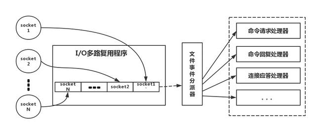
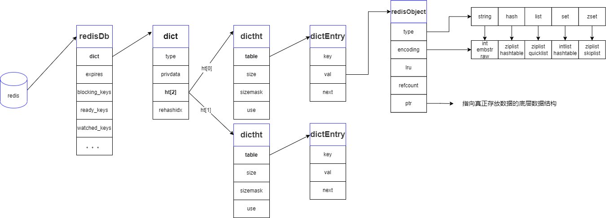
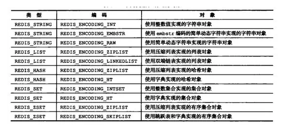
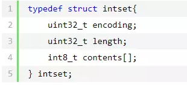
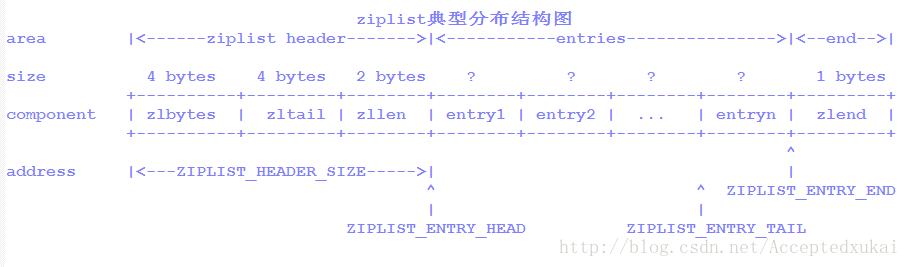
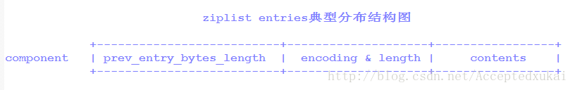
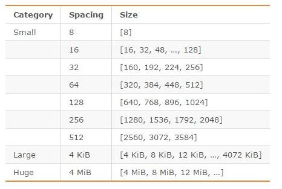

# 2.特性与原理

- redis 学习问题总结： [http://aperise.iteye.com/blog/2310639](http://aperise.iteye.com/blog/2310639)
- 不错的博客： [http://ifeve.com/redis-data-types/](http://ifeve.com/redis-data-types/)
- Redis学习笔记： [https://segmentfault.com/a/1190000015297408](https://segmentfault.com/a/1190000015297408)
- 全面剖析RedisCluster原理和应用：[https://blog.csdn.net/dc_726/article/details/48552531](https://blog.csdn.net/dc_726/article/details/48552531)
- 《吊打面试官》redis： [https://zhuanlan.zhihu.com/p/89620471](https://zhuanlan.zhihu.com/p/89620471)
- Redis高级客户端Lettuce详解：[https://www.cnblogs.com/throwable/articles/11601538.html](https://www.cnblogs.com/throwable/articles/11601538.html)
- Redis面试热点之底层实现篇：[https://mp.weixin.qq.com/s/3IptChwLLMN6aTeQhapSNw](https://mp.weixin.qq.com/s/3IptChwLLMN6aTeQhapSNw)
- [https://mp.weixin.qq.com/s/y18mX65b64GPjb85DFftlg](https://mp.weixin.qq.com/s/y18mX65b64GPjb85DFftlg)
- Redis面试热点之工程架构篇：[https://mp.weixin.qq.com/s/qONJaq0IU4Oe2T-1yS84vA](https://mp.weixin.qq.com/s/qONJaq0IU4Oe2T-1yS84vA)
- [https://mp.weixin.qq.com/s/CpiNqePf9x5VQZSc7MakQA](https://mp.weixin.qq.com/s/CpiNqePf9x5VQZSc7MakQA)
- 笔记整理：[https://mp.weixin.qq.com/s/Py4AdFh95HgcH0POXOxMzA](https://mp.weixin.qq.com/s/Py4AdFh95HgcH0POXOxMzA)
- 面试题整理：[https://mp.weixin.qq.com/s/I9CZHZu-EgRPSO9DrRKXCw](https://mp.weixin.qq.com/s/I9CZHZu-EgRPSO9DrRKXCw)
- 阿里：一文搞懂Redis：[https://mp.weixin.qq.com/s/7ct-mvSIaT3o4-tsMaKRWA](https://mp.weixin.qq.com/s/7ct-mvSIaT3o4-tsMaKRWA)
- [带你走进 Redis](https://mp.weixin.qq.com/s/4bAPVdUr_XbIw9xFCtWhfw)
- [为了拿捏 Redis 数据结构，我画了 40 张图（完整版） ](https://www.cnblogs.com/xiaolincoding/p/15628854.html)

## 1.性能解析

性能解析：
- [为啥快？持久化？高可用？最佳实践等](https://mp.weixin.qq.com/s/sRsmi3SGxS7U0P_kzgK9Ag)
- [Redis 核心篇：唯快不破的秘密](https://mp.weixin.qq.com/s/58m0ZjZOSeElYmggAZhznA)

为什么要使用Redis：高性能、丰富的数据类型、原子性操作、高可用分布式集群、简单易用等。
**其中高性能是其被使用的前提。**

Redis高性能的原因主要：
- 纯内存操作。
- 单线程操作。避免了频繁的上下文切换
- 采用IO多路复用机制。
- Resp协议：redis定义的简单的通讯协议，所以快
- 高效的数据结构（内部结构）

### 1.1.IO多路复用

采用多路 I/O 复用技术可以让单个线程高效的处理多个连接请求（尽量减少网络IO的时间消耗），且Redis在内存中操作数据的速度非常快（内存内的操作不会成为这里的性能瓶颈），

下面类比到真实的 Redis 线程模型，如图所示：



实现原理：[/article/16.Linux/1.Linux内核](/article/16.Linux/1.Linux内核)

IO多路复用是Linux常用的网络io方式。redis的多路复用，提供了select, epoll, evport, kqueue几种选择，在编译的时候来选择一种。

Redis请求处理流程：
1. 客户端连接Redis服务，会产生多个socket，epoll会将ready状态的socket放入队列中。
2. epoll回调Redis服务，Redis服务将socket转发给的文件事件分派器
3. 分派器转发到socket到不同的事件处理器中，完成事件处理，并返回给客户端

### 1.2.Resp协议
redis协议在以下几点之间做出了折衷：
- 简单的实现
- 快速地被计算机解析
- 简单得可以能被人工解析
- 网络层，Redis在TCP端口6379上监听到来的连接（本质就是socket），客户端连接到来时，Redis服务器为此创建一个TCP连接。
  在客户端与服务器端之间传输的每个Redis命令或者数据都以\\r\\n结尾。

Redis接收由不同参数组成的命令。一旦收到命令，将会立刻被处理，并回复给客户端

协议的规范：
```shell
*后面数量表示存在几个$
$后面数量表示字符串的长度

# 下面的是一个完整的协议体。真实的内容是
"*3\\r\\n$3\\r\\nSET\\r\\n$5\\r\\nmykey\\r\\n$7\\r\\nmyvalue\\r\\n"

# 展开后的内容是下面的
*3
$3
SET
$5
mykey
$7
myvalue
```

回复请求:Redis用不同的回复类型回复命令。它可能从服务器发送的第一个字节开始校验回复类型：
- 用单行回复，回复的第一个字节将是“+”
- 错误消息，回复的第一个字节将是“-”
- 整型数字，回复的第一个字节将是“:”
- 批量回复，回复的第一个字节将是“$”
- 多个批量回复，回复的第一个字节将是“*”

例子：状态回复（或者单行回复）
```shell
以“+”开始以“\\r\\n”结尾的单行字符串形式。例如：
"+OK\\r\\n
```

## 2.集群原理

### 2.1.Redis集群

Redis支持的集群模式：
1. 主从模式（redis2.8版本之前的模式）。不支持自动的主从切换，不推荐使用。
2. 哨兵模式 sentinel（redis2.8及之后的模式）。官方推荐的集群部署方式，支持自动的主从切换，但是不支持数据分片。
3. Redis Sharding(也叫redis cluster)（redis3.0版本之后）。官方推荐的集群部署方式，多主多从架构，支持数据分片。

**从节点只有只读权限**

### 2.2.主从模式

#### 2.2.1.主从复制原理

Redis官方给出方案主从复制，再结合Redis的哨兵模式，做到灾备的切换，主节点通知客户端，实现服务的高可用。

##### 2.2.1.1.核心概念

- Runid:每次Redis节点启动的时候，会生成一个uuid，作为节点的唯一标识
- Offset:主节点和从节点各自维护主从复制偏移量。master写操作offset=offset+命令的字节长度。slave接受写命令后offset=offset+命令的长度。同时offset也是用来判断主从节点数据是否一致的依据。
- Repl_backlog_size:复制缓冲区，只在主节点的一个FIFO的队列，数据长度固定，默认可以保持1M的数据。主节点发送数据给从节点的时候，主节点依旧会接受写操作，这部分数据会临时保持在队列中。
  当数据同步完后，会将队列中的数据继续同步给从节点，避免数据同步期间数据丢失。

##### 2.2.1.2.主从复制的命令

主要是有两个，sync（只支持全量数据同步）和psync（支持全量或部分数据同步）

使用psync同步数据的时候，从节点发送命令：psync [master_run_id] [offset]

这个时候主节点开始判断，返回给从节点的响应有三种
- FULLRESYNC 第一次同步，进行全量同步
- CONTINUE 进行增量同步
- ERR 不支持psync命令，进行全量同步

##### 2.2.1.3.全量同步

- 服务启动后，在从节点设置主节点，slaveof [master_ip : port]
- 从节点作为客户端开始连接主节点
- 连接成功后，从节点发送命令给主节点： psync [master_run_id] [offset]。 psync ? -1。
  因为是第一次同步，还不知道master的runid，所有传值为？，从节点本地的offset是默认值-1，表示全量同步。
- 主节点接受到psync命令后，
  1. 判断是否支持psync，否则返回响应值ERR。（就是进行全量复制） 
  2. 从节点的offset如果是-1的话，就将从节点的offset维护到本地，返回响应值FULLRESYNC [master_run_id] [offset]
- 主节点发送FULLRESYNC 命令后，开始执行bgsave命令，fork出一个子进程，异步生成rdb数据快照，同时这段时间内所有的写命令，会缓存到repl_backlog_size队列中。生成rdb文件后，将快照数据文件发生给从节点。
- 从节点接受到rdb后，将本地内存的数据全部清空，开始加载rdb的数据，恢复完成后，修改从节点的offset。如果开启aof了，会同时同步写入aof日志。
- 主节点推送repl_backlog_size的命令到从节点，各自维护offset

##### 2.2.1.4.增量同步

从Redis 2.8开始，如果遭遇连接断开，重新连接之后可以从中断处继续进行复制，而不必重新同步。

工作原理：master为复制流维护一个内存缓冲区（in-memory backlog）。主从服务器都维护一个复制偏移量（replication offset）和master run id，
当连接断开时，从服务器会重新连接上主服务器，然后请求继续复制，假如主从服务器的两个master run id相同，并且指定的偏移量在内存缓冲区中还有效，
复制就会从上次中断的点开始继续。如果其中一个条件不满足，就会进行全量同步（在2.8版本之前就是直接进行完全重新同步）。
因为主runid不保存在磁盘中，如果从服务器重启了的话就只能进行完全同步了。

增量同步这个新特性内部使用PSYNC命令，旧的实现中使用SYNC命令。Redis2.8版本可以检测出它所连接的服务器是否支持PSYNC命令，不支持的话使用SYNC命令。

##### 2.2.1.5.无磁盘复制

通常来讲，一个完全同步需要在磁盘上创建一个RDB文件，然后加载这个文件以便为从服务器发送数据。

如果使用比较低速的磁盘，这种操作会给主服务器带来较大的压力。Redis从2.8.18版本开始尝试支持无磁盘的复制。使用这种设置时，子进程直接将RDB通过网络发送给从服务器，不使用磁盘作为中间存储。

这一特性目前只是实验性的。

#### 2.2.2.注意

那主从复制会存在哪些问题呢？
- 一旦主节点宕机，从节点晋升为主节点，同时需要修改客户端的主节点地址，还需要命令所有从节点去复制新的主节点，整个过程需要人工干预。（所以需要哨兵）
- 主节点的写能力受到单机的限制。
- 主节点的存储能力受到单机的限制。
- 原生复制的弊端在早期的版本中也会比较突出，比如：redis复制中断后，从节点会发起psync。此时如果同步不成功，则会进行全量同步，主库执行全量备份的同时，可能会造成毫秒或秒级的卡顿。
- 从服务器在进行同步的时候，会清空自己全部的数据

### 2.3.Sentinel 哨兵模式

- [Redis第七课-AKF之X轴-主从复制-哨兵模式](https://blog.csdn.net/darkness0604/article/details/104685057/)
- [Redis主从复制原理总结](https://www.cnblogs.com/daofaziran/p/10978628.html)

#### 2.3.1.哨兵的作用

哨兵模式是在主从模式基础上，增加了哨兵实现的。客户端连接哨兵，哨兵告诉客户端连接哪个Redis节点。

哨兵之间采用发布/订阅进行通讯，哨兵的作用：
- 监控，哨兵定期向主节点发生消息，用于监控主节点是否正常运行。
- 通知客户端，如果主从切换后，哨兵会通过发布/订阅通知客户端最新的master。
- 同步配置，哨兵之间定时发送消息，同步自身的配置和主节点状态。用于达成共识。
- 自动故障迁移，当发现主节点不能正常运行的时候，会从从节点中选举出一个作为主节点，将告诉其他的从节点新的主节点是谁，当客户端通过sentinel模式尝试连接不能使用的主节点的时候，sentinel会通知客户端返回新的主节点。
- 配置提供者：在Redis Sentinel模式下，客户端应用在初始化时连接的是Sentinel节点集合，从中获取主节点的信息。

sentinel只是对于数据量少的场景中使用的单机Redis的一种补充，是一种灾备的方案，因为整个集群在对外提供服务的节点只有一个主节点。虽然实现了高可用，但却不是真正的集群。

#### 2.3.2.哨兵正常工作流程

1. 每个哨兵都以每秒钟一次的频率向整个集群中的master、slave以及其他哨兵发送一个 PING 命令。检测节点是否正常，并更新本地的服务列表节点的状态。 
2. 每个哨兵会以每 10 秒一次的频率向集群中的所有Master、Slave发送 INFO 命令。获得主从的基础信息，用于发生异常后进行故障转移

<p style="color: red">为什么要使用多个哨兵</p>

1. 3个Sentinel构成一个sentinel集群，确保sentinel的高可用，并且sentinel用于master投票选举。
2. 如果只有一个哨兵，如果因为某些原因导致哨兵与master通信超时或失败，直接认为master下线很武断。
   所以需要多个sentnel看守1个master,当N台(N可设置)sentinel都认为master失效,才正式失效

#### 2.3.3.故障转移流程

1. 主观下线(SDOWN)：以每秒钟一次的频率向整个集群中的master发送PING命令，检测节点是否正常。如果master超过down-after-milliseconds设置的时间内没有回复，则该哨兵认为master主观下线。
2. 客观下线(ODOWN)：当一个哨兵发现master主观下线后，它会询问其他哨兵，是否也认为master主观下线。当有足够数量的哨兵（大于等于配置文件指定的值）同意，则该master被标记为客观下线，触发故障转移。
    - 期间若没有足够数量的 哨兵同意 Master下线 或者 master重新恢复响应，Master的客观下线状态就会被移除。
3. 哨兵领导者选举：为了避免多个哨兵同时执行故障转移，造成混乱，哨兵集群需要从自己中选举一个哨兵领导者（leader），由它来负责故障转移的流程。
   选举过程基于Raft算法的变种，包括候选者发起选举请求、跟随者投票、统计票数等步骤。
4. 新master选举：当哨兵领导者选举出来后，它会从所有的从节点中选择一个最合适的从节点，作为新的master。选举标准通常包括优先级、复制偏移量、运行ID等因素。
5. 重新配置从节点：当新master选举出来后，哨兵领导者会向所有的从节点发送命令，让它们与新master建立复制关系，更新自己的master信息。同时，哨兵领导者也会向所有的哨兵发送命令，让它们更新自己的master信息，并通知客户端使用新的主节点地址。

<p style="color: red">redis 选举过程 & redis 哨兵怎么通知客户端新master</p>

一个哨兵发现master有问题，认为master主观下线。因为哨兵之间也是同步数据的，所以当大于一半的哨兵认为master主观下线，那master被认为是客观下线。
然后开始投票选举哨兵领导，让其去执行将slave升级为master的命令。投票的内容是：
1. 确认有效的slave
2. 找出slave的优先级。配置文件配置。
3. 找出slave同步偏移量最大的。info命令获得。
4. 找出runid最小的。启动时生成的。

投票数大于一半的哨兵，去将符合上面条件的slave升级为master，并通过pub/sub方式通知所有订阅了哨兵的客户端修改master信息。

### 2.4.Redis Cluster 原理

#### 2.4.1.集群工作原理
1. Redis3开始支持集群，是一种去中心化的架构。没有负责管理集群的元数据或者数据处理的主节点。
2. 集群中的每个节点都是相同的，通过Gossip协议来交换集群状态信息，从而共同维护整个集群的运行。
3. 多主多从结构，1个主至少对应1个从，一个集群至少需要3主3从。如果对集群的可用性要求很高的情况下，可以配置一主多从的架构，支持成本会直接翻倍。
4. 主节点 处理读写请求以及维护集群信息，从节点 负责复制主节点的数据和状态信息，从节点不读写请求。
5. Redis Cluster通过将数据划分为16384个slots，将其分布到各个节点上，每个节点只处理部分数据，实现数据的分布式存储和访问。

#### 2.4.2.集群状态感知原理
gossip协议是一种节点间不断交换信息的协议。当节点状态发生变化时，比如主从角色变化、新增节点或者节点出故障等情况，
通过Gossip协议的ping/pong消息通信机制，所有节点会不断交换信息，最终会知道整个集群全部节点的最新状态，从而达到集群状态同步的目的。

#### 2.4.3.ping/pong消息机制

- ping/pong消息通信机制：每个节点定时向特定规则选择出来的几个节点发送ping消息，节点接收到ping请求后，会使用pong消息进行响应，从而实现节点间数据交换。
- ping/pong消息的发送间隔无法设置，是由集群内部机制根据运行情况动态调整的，以确保集群的稳定性和性能。
- ping/pong消息体：它们用于维护集群状态、检测节点故障以及更新集群的元数据。

```json
Ping 消息内容示例
{  
    "sender": "node_id_of_sender", // 发送消息的节点ID  
    "current_epoch": 12345,         // 当前纪元（epoch），用于跟踪集群状态的变化  
    "cluster_state": "ok",          // 集群状态，例如"ok"、"fail"等  
    "slot_bitmap": [0b11001001],   // 槽位位图，表示节点负责的槽位  
    "meet_message": "node_id_to_meet", // 如果需要让接收者去认识一个新节点，则包含新节点的ID  
    "configEpoch": 1000,            // 配置纪元，用于跟踪节点的配置变化  
    "replication": {               // 复制信息  
    "master_node_id": "master_id",  
    "master_link_status": "up",  
    "slave_of": "master_id",  
    "slave_replication_offset": 123456789  
    },  
    "flags": "some_flags",          // 标志位，表示节点的特定状态或能力  
    "load": 1.23,                   // 节点负载信息  
    // ... 其他可能的字段，如节点IP、端口、故障转移状态等  
}

Pong 消息内容示例
{  
    "sender": "node_id_of_receiver", // 接收Ping消息的节点现在作为Pong消息的发送者  
    "current_epoch": 12345,         // 与Ping消息中的纪元相匹配或更新  
    "cluster_state": "ok",          // 集群状态更新  
    "slot_bitmap": [0b11001001],   // 槽位位图更新  
    "configEpoch": 1000,            // 配置纪元更新  
    "replication": {               // 复制信息更新  
    "master_node_id": "master_id",  
    "master_link_status": "up",  
    "slave_of": "master_id",  
    "slave_replication_offset": 123456789 // 可能已经更新  
    },  
    "pong_received": "timestamp",  // Pong消息接收的时间戳  
    "flags": "some_flags",          // 标志位更新  
    "load": 1.23,                   // 节点负载更新  
    // ... 其他可能的字段更新  
}
```

#### 2.4.4.slot重新分配过程

节点发生变化后，slot不会立即重新分配，而是执行相关命令触发重分配过程。重分配需要一定的时间来完成。
1. 增加节点，新节点没有任何slot，不参与处理请求。执行命令：CLUSTER ADDSLOTS 后才会进行功能
2. 移除节点，需要执行命令，才能迁移数据到其他节点。在数据迁移完成之前，该节点不会被立即从集群中移除。

重分配过程集群可用：操作由redis-trib负责执行的。redis-trib通过对源节点和目标节点发送命令来进行重新分片操作。
1. 首先，redis-trib会对目标节点发送指令，让其准备好从源节点导入属于某个槽（slot）的键值对。
2. 然后，它会对源节点发送指令，让源节点准备好将属于该槽的键值对迁移到目标节点。
3. 接着，如果槽上有存储键值对，redis-trib会向源节点发送指令，获取最多指定数量的属于该槽的键值对的键名。
4. 最后，对于每个获得的键名，redis-trib都会向源节点发送一个迁移命令，将被选中的键原子地从源节点迁移至目标节点。
   这个过程会重复执行，直到源节点保存的所有属于该槽的键值对都被迁移至目标节点为止。

#### 2.4.5.集群节点的选举过程

1. Redis cluster中如果主节点发生故障，因为节点都是对等的，所以需要节点发现该节点故障后，会进行投票选举，选举使用的还是Gossip
2. 选举过程依次选择优先级高的、数据同步进度最快的。

Redis 集群选举，不需要遵循半数以上原则，同样的也不需要全部节点都进行投票。
集群选举过程，会设置一个时间限制，参与投票的节点可能进行多轮选举，当发现时限内未完成选举，则会重新开始选举。

#### 2.4.6.客户端工作原理(ASK转向/MOVED转向机制)

客户端访问：客户端在连接集群时，会获得集群的槽位信息，然后根据key的哈希值找到对应的slot，再根据槽位配置信息找到这个slot所在的节点， 然后向目标节点发起请求。

客户端感知：有主动和被动两种方式：重定向机制 和 订阅/发布机制
1. ASK转向和MOVED转向机制是用于处理客户端与集群节点之间的通信重定向问题
    - MOVED转向机制：客户端向集群的节点发送消息时，如果key不在该节点，该节点会向返回一个MOVED重定向消息，消息向包含目标节点的信息，客户端根据信息重新发送命令。
      简而言之，“你想要的键不在我这里，它已经移动到了另一个节点，你去那里找吧。”
    - ASK转向机制：ASK重定向通常发生在集群伸缩时，即当集群中的槽正在迁移或已经迁移但尚未完全完成时。该节点会向返回一个ASK重定向消息，消息向包含目标节点的信息，客户端根据信息重新发送命令。
      简而言之，“你想要的键的数据现在或即将在另一个节点上，你去那里使用ASK命令获取它”
2. Redis的订阅/发布机制。当集群节点发生变化时，集群会发布事件通知，客户端订阅后就可以实时获取集群最新信息（槽位映射表）


#### 2.4.7.大规模架构的难点

1. 针对大规模部署的集群，例如100个节点的集群，集群内部的Gossip通讯，可能就会消耗CPU10%、带宽几十兆。
2. 最可怕的是一旦节点数量发生变化，故障后的选举、增删节点后的重新slot，持续时间会很久，导致问题自动恢复变慢。
3. 节点数量不变的话，如果只扩容也是不行的：因为集群必须开启rdb，内存越大生成快照的时间也就越大，主从同步数据的量就越大，主线程阻塞时间越久。

总结：Redis cluster不推荐大规模部署，集群的规模尽可能的小。如果必须使用的话，推荐使用其他类Redis的组件，例如kvrocks、Tendis等

- [美团大规模KV存储挑战与架构实践](https://mp.weixin.qq.com/s/KHoFJs4wRSkAThXw7F8acA)
  美团的解决方案：
1. 管理服务抽离，单独进行集群监控与管理
2. 服务快速发现：使用zk管理集群元数据，管理端一旦发现问题后，会立刻变更zk数据，客户端订阅变更后也会立刻修改连接。
3. Gossip协议优化：将传输的数据调整为摘要，极大的降低数据量；其次节点只需要对比摘要就知道是否需要变更消息，也降低了CPU的消耗

## 3.数据结构
- [Redis内部数据结构详解(1)——dict](https://mp.weixin.qq.com/s/qFDOFr4HYpgUg-J_VCNvQw)
- [Redis内部数据结构详解(2)——sds](https://mp.weixin.qq.com/s/_uqWOC1Gau-yCja1fmTdqA)
- [Redis内部数据结构详解(3)——robj](https://mp.weixin.qq.com/s/Jlv6AgaO4QrCXvjr6RipIQ)
- [Redis内部数据结构详解(4)——ziplist](https://mp.weixin.qq.com/s/SWaFXXbSFOQ9MYSztSyWww)
- [Redis内部数据结构详解(5)——quicklist](https://mp.weixin.qq.com/s/6aFwnnnYIv3mWm0YkXWn9w)
- [Redis内部数据结构详解(6)——skiplist](https://mp.weixin.qq.com/s/rXIVIW7RM56xwMaQtKnmqA)
- [Redis内部数据结构详解(7)——intset](https://mp.weixin.qq.com/s/Z6OZpDg1yQD5MaRmcLHcLw)

- [基于Redis的分布式锁到底安全吗（上）](https://mp.weixin.qq.com/s/JTsJCDuasgIJ0j95K8Ay8w)
- [基于Redis的分布式锁到底安全吗（下）](https://mp.weixin.qq.com/s/4CUe7OpM6y1kQRK8TOC_qQ)


- 底层数据结构: [https://www.jianshu.com/p/3dddb5ca05f7](https://www.jianshu.com/p/3dddb5ca05f7)
- Redis9种数据结构以及它们的内部编码实现：[https://mp.weixin.qq.com/s/J9XWe3VIG6NUCIvXj660fw](https://mp.weixin.qq.com/s/J9XWe3VIG6NUCIvXj660fw)
- Hash算法： [https://www.jianshu.com/p/7f53f5e683cf](https://www.jianshu.com/p/7f53f5e683cf)
- ziplist详细解析：[https://blog.csdn.net/weixin_35390390/article/details/84950485](https://blog.csdn.net/weixin_35390390/article/details/84950485)

### 3.1.Redis内存结构

- redisDb ：redis的顶层数据库结构，内部定义了数据存储结构字典dict，过期时间、用于阻塞key以及事务相关的监听。
- dict ：用于存储redis中的k-v数据的字段结构。其中定义了两个hashtable和rehash下标值。
- dictht ： redis中真正的hash表，二维数组结构，内部定义了存储k-v的entry、数组长度、确定数据存放位置的模、数组内的数据量。
- dictEntry ：用于存储k-v数据的entry对象，内部封装了key、value字段，以及用于处理hash冲突的指针。
- redisObject：用于封装value数字的对象；其内部包含了value的命令类型、底层存储结构、回收策略、lru信息等；



#### 3.1.1.redisServer

服务启动后会初始化一个redisServer对象。
- 作用：用于存储和管理 Redis 服务器的所有状态信息、各种参数、持久化信息、集群信息、统计和监控信息等。
- 其中redisServer中包含了 redisDb数组的引用。

#### 3.1.2.redisDb

redis默认有16个数据库，每个数据库包括两个hash表，一个用于存储无过期时间的kv,另一个用于存储有过期时间的kv。数据结构如下:

```cpp
typedef struct redisDb {
    dict *dict;                     //存储无过期时间的kv
    dict *expires;                  //存储有过期时间的kv
    dict *blocking_keys;            //用于阻塞操作，如 BLPOP、BRPOP 等命令。这些命令允许客户端阻塞（即暂停执行）直到有满足条件的元素出现或达到指定的超时时间
    dict *ready_keys;               //用于发布/订阅的key
    dict *watched_keys;             //Redis事务中，用于监视的key
    struct evictionPoolEntry *eviction_pool;    //淘汰池，让内存达到上限后触发淘汰策略时，从中选择key进行淘汰。
    int id;                         //dbid，例如0,1,2...15
    unsigned long avg_ttl;          
} redisDb;
```

#### 3.1.3.dict
dict不仅可以当做Redis的存储结构，也可以当中map、set等类型的底层结构使用，所以增加了dictType类型。
```cpp
typedef struct dict {
    dictType *type;         //指向 dictType 结构体的指针，dictType 包含了用于操作字典的函数指针，例如哈希函数、键比较函数、键的复制函数、值的销毁函数等。
    void *privdata;         
    dictht ht[2];           //两个字典对象，其中ht[1]的内存是ht[0]的两倍，用于渐进式rehash使用
    long rehashidx;         //记录要进行rehash的索引位置，值为-1表示rehash未进行
    unsigned int iterators;          // 用于记录当前正在运行的迭代器数量。当字典正在进行重新哈希时，Redis 不允许对字典进行任何修改操作（如添加、删除键等），以防止迭代器失效。
} dict;
```

#### 3.1.4.dictht
就是hashtable
```cpp
typedef struct dictht {
    dictEntry **table;          // dictEntry指针数组。每个dictEntry都是一个ducket，存储一个链表。
    unsigned long size;         // table数组的总长度，为2的倍数。
    unsigned long sizemask;     // sizemask=size - 1;用于计算元素在数组中的位置。idx= hash & sizemask。
    unsigned long used;         // table中元素数量
} dictht;
```

#### 3.1.5.dictEntry
```cpp
typedef struct dictEntry {
    void *key;          
    union {             // v。Redis的底层存储单元。union允许在相同的内存位置存储不同的数据类型。这里
        void *val;     
        uint64_t u64;
        int64_t s64;
        double d;
    } v;
    struct dictEntry *next;  //hash冲突时指向下一个数据节点
} dictEntry;
```
- key:redis的key，类型为void，可以是任意类型，但是通常为SDS
- v: redis的value，union(共用体)允许在相同的内存位置存储不同的数据类型。这里存储的内容可以是指向值的指针、64位整型、无符号64位整型 或者浮点值。
- next：指向下一个 dictEntry，用于解决哈希冲突问题。在64位系统中，一个 dictEntry 对象占 24 字节（key/val/next 各占 8 字节）。

#### 3.1.6.redisObject
```cpp
#define LRU_BITS 24
typedef struct redisObject {
    unsigned type:4;        //记录了该对象的类型【外部的数据类型】
    unsigned encoding:4;    //表示ptr指针指向的具体使用到的数据结构【底层数据类型】
    unsigned lru:LRU_BITS;  //对象最后一次被访问的时间，用于LRU策略，
    int refcount;           //引用计数
    void *ptr;              //指向实际值的指针
} robj;
```
Redis 对象有 5 种类型；无论是哪种类型，Redis 都不会直接存储，而是通过 RedisObject 对象进行存储。
- type：用于表示该对象的类型，其包含了string、list、hash、set、zset等；
- encoding：表示ptr指针指向的具体使用到的数据结构，也就是value用什么底层数据类型存储的；
- lru：对象最后一次被访问的时间，用户后续的过期策略；
- refcount：引用计数器；表明了redis中的垃圾回收算法是使用了引用计数法完成的。数据结构可以被复用。
- ptr指针：指向实际保存数据的底层结构对象；

<p style="color: red">redisObject大小计算</p>
通过定义可以看出，type 4bit, encoding 4bit, LRU_BITS 24bit, refcount int类型32bit，ptr指针类型64bit。
大小为：4+4+24+32+64=128bit=16byte。（不考虑内存对齐）

### 3.2.对象类型的内部编码

Redis 支持 5 种对象类型，而每种结构都有至少两种编码。

这样做的好处在于：一方面接口与实现分离，当需要增加或改变内部编码时，用户使用不受影响，另一方面可以根据不同的应用场景切换内部编码，提高效率。

Redis 各种对象类型支持的内部编码如下图所示(图中版本是 Redis3.0)：



关于 Redis 内部编码的转换，都符合以下规律：编码转换在 Redis 写入数据时完成，且转换过程不可逆，只能从小内存编码向大内存编码转换。

#### 3.3.1.string

字符串是最基础最常用的类型。在Redis中所有的key都是字符串，其他类型中的元素也是字符串。
且字符串之外的其他几种复杂类型的元素也是字符串，字符串长度不能超过 512MB。

内部编码：
- int：8Byte的长整型。字符串值是整型时，这个值使用 long 整型表示。
- embstr：长度<=44 字节的字符串。redis 3.2以下的版本，阈值是39。
- raw：大于 44 个字节的字符串。

embstr 与 raw 的区别
1. embstr： 
    - embstr中RedisObject 和 sds 是连续的，只分配一次内存空间。
    - 有助于减少内存碎片，提升内存利用率，提升Redis响应效率。
2. raw：
   - raw中RedisObject 和 sds是分开分配内存的，方便修改sds。

```java
#define OBJ_ENCODING_EMBSTR_SIZE_LIMIT 44
robj *createStringObject(const char *ptr, size_t len) {
    if (len <= OBJ_ENCODING_EMBSTR_SIZE_LIMIT)
        return createEmbeddedStringObject(ptr,len);
    else
        return createRawStringObject(ptr,len);
}

robj *createEmbeddedStringObject(const char *ptr, size_t len) {
    // 分配连续的内存空间。Redisobject+sdshdr8+字符串长度+1。
    robj *o = zmalloc(sizeof(robj)+sizeof(struct sdshdr8)+len+1);
    struct sdshdr8 *sh = (void*)(o+1);
    // 初始化 robj
    o->type = OBJ_STRING;
    o->encoding = OBJ_ENCODING_EMBSTR;
    o->ptr = sh+1;
    o->refcount = 1;
    // 初始化 sdshdr8
    sh->len = len;
    sh->alloc = len;
    sh->flags = SDS_TYPE_8;
    //复制字符串到sdshdr8中
    if (ptr == SDS_NOINIT)
        // 如果ptr为SDS_NOINIT（一个特殊标记，表示不需要初始化字符串数据），则只设置字符串的终止符\0。
        sh->buf[len] = '\0';
    else if (ptr) {
        // 如果ptr非空，则复制字符串数据到sh->buf，并设置终止符\0。
        memcpy(sh->buf,ptr,len);
        sh->buf[len] = '\0';
    } else {
        // 如果ptr为空，则使用memset将sh->buf及其后的一个字节（终止符\0）清零。
        memset(sh->buf,0,len+1);
    }
    return o;
}
```

<p style="color: red">为什么长度设置为44？</p>
因为 robj 的大小16B，embstr内部使用sdshdr8大小3B，在加上终止符1B。
如果字符串是44B，则加起来正好16+3+1+44=64B。
而Redis通常使用jemalloc，正好可以分配 64 字节的内存单元。不会产生太大的内存碎片，也提升了内存分配效率。

#### 3.3.2.list

列表（list）用来存储多个有序的字符串，每个字符串称为元素；一个列表可以存储 2^32-1 个元素。

Redis中的列表支持两端插入和弹出，并可以获得指定位置（或范围）的元素，可以充当数组、队列、栈等。

内部编码:
- 压缩列表（ziplist）：只有同时满足这两个条件，才会使用压缩列表：列表中元素数量小于 512 个；单个字符串不能超过 64 字节。
- 快速列表（quicklist）：redis3.2之后替代了linkedlist。
- 双端列表（linkedlist）:redis3.2之前使用，是普通的链表结构，随机访问性能差，所以被弃用了。

#### 3.3.3.hash

哈希，不仅是 Redis 对外提供的 5 种对象类型的一种，也是 Redis 作为 Key-Value 数据库所使用的数据结构。

内部编码
- 压缩列表（ziplist）：有同时满足这两个条件，才会使用压缩列表：列表中元素数量小于 512 个；单个字符串不能超过 64 字节。
- 哈希表（hashtable）：参考 dictht。

#### 3.3.4.set

set(集合)中的元素是无序的，因此不能通过索引来操作元素；集合中的元素不能有重复。一个集合中最多可以存储 2^32-1 个元素。

内部编码
- 整数集合（intset）。当数据为整数时，使用intset，操作效率高。
- 哈希表（hashtable）。

#### 3.3.5.zset

zset(有序集合)，元素都不能重复，但是元素是有顺序的。有序集合为每个元素设置一个分数（score）作为排序依据。

内部编码
- 压缩列表（ziplist）。只有同时满足下面两个条件时，才会使用压缩列表：有序集合中元素数量小于 128 个；有序集合中所有成员长度都不足 64 字节。
- 跳跃表（skiplist）。跳跃表是一种有序数据结构，通过在每个节点中维持多个指向其他节点的指针，从而达到快速访问节点的目的。
    有很好的随机访问和排序的性能，查询的时间复杂度为O(logn)

### 3.3.内部编码

server.h中定义了内部编码类似，有以下11种
```properties
#define OBJ_ENCODING_RAW 0     /* Raw representation */
#define OBJ_ENCODING_INT 1     /* Encoded as integer */
#define OBJ_ENCODING_HT 2      /* Encoded as hash table */
#define OBJ_ENCODING_ZIPMAP 3  /* Encoded as zipmap，这个没有被使用 */
#define OBJ_ENCODING_LINKEDLIST 4 /* No longer used: old list encoding. */
#define OBJ_ENCODING_ZIPLIST 5 /* Encoded as ziplist */
#define OBJ_ENCODING_INTSET 6  /* Encoded as intset */
#define OBJ_ENCODING_SKIPLIST 7  /* Encoded as skiplist */
#define OBJ_ENCODING_EMBSTR 8  /* Embedded sds string encoding */
#define OBJ_ENCODING_QUICKLIST 9 /* Encoded as linked list of ziplists */
#define OBJ_ENCODING_STREAM 10 /* Encoded as a radix tree of listpacks */
```

#### 3.3.1.SDS

为什么要设计SDS，因为在C语言，字符串有2个特点
1. 字符串(即以空字符'\0'结尾的字符数组)作为默认的字符串表示
2. 获得字符串长度需要遍历整个字符串的字符，时间复杂度是O(n)

所以Redis使用了SDS。SDS 是简单动态字符串(Simple Dynamic String)的缩写。
并且字符串是Redis中使用最多的类型，所以Redis对字符串做了深入的优化。

sds有5中类型，主要是为了优化内存使用和适应不同长度的字符串。这些不同类型的SDS头部结构（sdshdr）在内存占用、长度表示和灵活性方面有所不同。

```cpp
/* Note: sdshdr5 is never used, we just access the flags byte directly.
 * However is here to document the layout of type 5 SDS strings. */
struct __attribute__ ((__packed__)) sdshdr5 {
    unsigned char flags; /* 3 lsb of type, and 5 msb of string length */
    char buf[];
};
struct __attribute__ ((__packed__)) sdshdr8 {
    uint8_t len; /* used */
    uint8_t alloc; /* excluding the header and null terminator */
    unsigned char flags; /* 3 lsb of type, 5 unused bits */
    char buf[];
};
struct __attribute__ ((__packed__)) sdshdr16 {
    uint16_t len; /* used */
    uint16_t alloc; /* excluding the header and null terminator */
    unsigned char flags; /* 3 lsb of type, 5 unused bits */
    char buf[];
};
struct __attribute__ ((__packed__)) sdshdr32 {
    uint32_t len; /* used */
    uint32_t alloc; /* excluding the header and null terminator */
    unsigned char flags; /* 3 lsb of type, 5 unused bits */
    char buf[];
};
struct __attribute__ ((__packed__)) sdshdr64 {
    uint64_t len; /* used */
    uint64_t alloc; /* excluding the header and null terminator */
    unsigned char flags; /* 3 lsb of type, 5 unused bits */
    char buf[];
};

在各个header的定义中使用了__attribute__ ((packed))，是为了让编译器以紧凑模式来分配内存。
如果没有这个属性，编译器可能会为struct的字段做优化对齐，在其中填充空字节。
那样的话，就不能保证header和sds的数据部分紧紧前后相邻，也不能按照固定向低地址方向偏移1个字节的方式来获取flags字段了。
```

- len：   表示 buf 已使用的长度。这样就不用遍历数组，直接知道字符串长度。
- alloc： 最大容量。
- flags:  chat类型，其中的最低3个bit用来表示header的类型
- buf：   表示字符数组，存储数据。

特点：
1. 内存预分配。第一次分配内存后，如果在修改的时候发现空间足够，则只修改buff的内容和len长度，不需要重新分配内存
2. 惰性空间释放。修改后长度降低，不会回收内存，而是通过len和alloc记录修改后的信息。
3. 二进制安全。可以存储c语法无法存储的特殊字符。且可以是二进制的。
4. 结构紧凑。header和数据相邻，而不用分成两块内存空间来单独分配。有利于减少内存碎片，提高存储效率（memory efficiency）。


Redis中所有的key都是sds类型。
```cpp
void dbAdd(redisDb *db, robj *key, robj *val) {
    sds copy = sdsdup(key->ptr);// 创建key
    int retval = dictAdd(db->dict, copy, val); //创建value
}
```

字符串的append操作，内部调用sdscatlen来实现的。过程如下
1. 原sds的容量是否足够，足够的话就修改len并写入数据。
2. 原sds的容量不足，则判断是否可以扩容内存空间，如果可以则调用s_realloc（内部是jemalloc）。它尽量在原来分配好的地址位置重新分配，
   如果原来的地址位置有足够的空余空间完成重新分配，那么它返回的新地址与传入的旧地址相同；否则，它分配新的地址块，并进行数据搬迁。
3. 如果alloc容量位数不足(3,8,16,32,64等)，就需要替换sds的header，也就是需要重新分配内存。

#### 3.3.2.linkedlist

由一个 list 结构和多个 listNode 结构组成，双端列表同时保存了表头指针和表尾指针，并且每个节点都有指向前和指向后的指针。
Redis 3.2之后被quicklist代替。

#### 3.3.3.quicklist

Redis3.2使用，用来替换linkedlist。quicklist的每个节点都是一个ziplist。ziplist本身也是一个能维持数据项先后顺序的列表，而且内存是紧凑的。

- 本质：quicklist其实就是一个分段的ziplist。每个ziplist可以存储多个数据。
- 目的：优化redis的列表键底层存储，提高list的性能。linkedlist中每个节点都是一个节点，连续性差。而使用quicklist极大的降低节点的数量，很大程序提升了集合元素的连续性。


#### 3.3.4.hashtable
当写入 Redis 的数据越来越多的时候，哈希冲突不可避免。Redis 通过链式哈希解决冲突，与Java的hashMap一样

#### 3.3.5.intset

结构定义如下



- contents。存储的元素。
- encoding。contents 中存储内容的类型，虽然 contents（存储集合中的元素）是 int8_t 类型。但是可以存储 int16_t、int32_t 或 int64_t
- length。 元素个数。

#### 3.3.6.ziplist

Redis为了节约内存，使用一系列特殊编码的连续内存块组成的顺序型数据结构，具体结构相对比较复杂。
压缩列表不仅用于实现列表，也用于实现哈希、有序列表；使用非常广泛。



```text
<zlbytes><zltail><zllen><entry><entry><zlend>

<int32 zlbytes>   是一个4字节无符号整数，用来存储整个ziplist占用的字节数；
<int32 zltail>    是一个4字节无符号整数，用来存储ziplist最后一个节点的相对于ziplist首地址偏移量，用于快速定位到最后一个节点
<int16 zllen>     是一个2字节无符号整数，存储ziplist中节点的数目，最大值为(2^16 - 2)，当zllen大于最大值时，需要遍历整个ziplist才能获取ziplist节点的数目；
<T[]   entry>     ziplist存储的节点，各个节点的字节数根据内容而定；
<int8  zlend>     是一个1字节无符号整数，值为0xFF(255)，作为ziplist的结尾符
```

entries并没有使用redisObject。



```text
<prevlen><encoding><data>

prevlen: 前一个节点总字节数，作用是为了实现方便快速的从后向前遍历。该值的长度有两种
    1. 如果前节点总字节数量<254，则prevlen是1个字节。 
    2. 如果前节点总字节数量>=254，则prevlen是5个字节。其中第一个字节为常量=254，后面4字节存储总字节数。
    为什么这么设计？因为在遍历entry的时候根据第一个字节是255判断ziplist的结束。所以采用了254这个常量，表示字节在后面。
encoding：表示data的长度和编码方式。情况比多，encoding一个字节，根据位数中数值不同，映射不同的data长度。
data：具体的数据
```

ziplist设计初衷是为了降低内存占用，减少内存碎片，通过时间换空间。ziplist数据变更时、会引发内存realloc，可能导致内存拷贝。
所以使用ziplist时尽可能保存不会轻易修改的数据，或者保存数字。

#### 3.3.7.skiplist
Redis 的跳跃表实现由 zskiplist 和 zskiplistNode 两个结构组成：前者用于保存跳跃表信息（如头结点、尾节点、长度等），后者用于表示跳跃表节点，具体结构相对比较复杂。

跳跃表（skiplist）是一种有序数据结构，它通过在每个节点中维持多个指向其他节点的指针，从而达到快速访问节点的目的。

跳跃表支持平均 O（logN）、最坏 O（N）复杂度的节点查找，还可以通过顺序性操作来批量处理节点。

也是很多内存型数据库喜欢使用的数据存储结构。

### 3.4.渐进式rehash

Redis的kv存在是基于hashtable，跟java中的hashMap一样，Redis的hashtable也是数组+链表，且数量达到加载因子时也需要扩容。
而扩容就需要创建新的hashtable，并重新计算存储的索引值。这样就会导致Redis请求阻塞。 
所以Redis采用渐进式rehash，dict为了能够实现渐进式rehash，使用了两个全局哈希表：ht0 和 ht1。

rehash过程：
1. 开始默认使用 ht0，ht1没有分配空间。ht0 默认容量=8
2. rehash时给 ht1 分配  2倍ht0的空间(ht1容量=16)，并将记录ht0尚未进行迁移的索引位置  rehashidx=0(-1表示没有rehash)
3. 每次操作时(查询、插入、删除数据)，ht0迁移n个数组中的元素，rehashidx+=n，直到完成迁移。n 默认是100 
4. 将ht1赋值到ht0，rehashidx=-1，ht1引用甚至为null。

采用渐进式 rehash 原理：每次处理客户端请求的时候，先从 表1 中第一个索引开始，将这个位置的所有数据拷贝到 表2 中，就这样将 rehash 分散到多次请求过程中，避免耗时阻塞。

## 4.内存分配

### 4.1.内存分配

Redis进程的内存消耗主要包括：自身内存 + 对象内存 + 缓冲内存 + 内存碎片。

1. 自身内存。Redis自身内存消耗非常少。
2. 对象内存。对象内存是Redis内存占用最大的一块，存储着用户的所有数据，还包括慢查询日志等Redis帮我们维护的一些内存数据。
3. 缓冲内存
    1. 客户端缓冲。所有连到Redis服务器的TCP连接的输入缓冲和输出缓冲
    2. 复制积压缓冲。Redis在2.8版本之后提供了一个可重用的固定大小的缓冲区用于实现增量复制的功能，根据repl-backlog-size参数来控制，默认大小1MB
    3. AOF重写缓冲。用于在AOF重写期间保存写命令
4. 内存碎片。内存分配器，都是按照块申请的，申请之后内存可能没有全部都使用。不使用的部分就是碎片。以及正常缓存删除后没有被回收的内存也是碎片。

<p style="color: red">内存分配器</p>
Redis默认内存分配器采用jemalloc，可选的分配器还有：glibe、tcmalloc。
内存分配器是为了更好的管理和重复利用内存，分配内存策略一般采用固定范围的内存块进行内存分配。

jemalloc 在 64 位系统中，将内存空间划分为小、大、巨大三个范围；当 Redis存储数据时，会选择大小最合适的内存块进行存储。
jemalloc 划分的内存单元如下图所示：



<p style="color: red">内存分配情况的内部统计报表</p>
该命令目前仅实现了 jemalloc 作为内存分配器的内存统计，对其他分配器暂不支持。Redis>4

```shell
127.0.0.1:6379> memory malloc-stats
```

### 4.2.内存碎片

<p style="color:red;">怎么知道内存碎片高？</p>

使用 info memory 命令，查看 mem_fragmentation_ratio(内存碎片比率), 该值是 used_memory_rss / used_memory 的比值。

- mem_fragmentation_ratio < 1，说明 Redis 使用了虚拟内存，说明可能内存不够了，由于虚拟内存的媒介是磁盘，比内存速度要慢很多。
- mem_fragmentation_ratio 大于 1 但小于 1.5。这种情况是合理的。毕竟，内因的内存分配器是一定要使用的，分配策略都是通用的，不会轻易修改；而外因由
  Redis 负载决定，也无法限制。所以，存在内存碎片也是正常的。
- mem_fragmentation_ratio 大于 1.5 。这表明内存碎片率已经超过了 50%。一般情况下，这个时候，我们就需要采取一些措施来降低内存碎片率了。

<p style="color:red;">内存碎片高的原因？</p>
1. Redis通过jemalloc申请内存的时候，都是整块申请的，但是我们使用的时候，不一定全部使用，这部分没有使用的空间就是碎片。
2. 因为该redis主要是存储频繁更新的数据，redis会删除旧的数据，实际上，由于Redis释放了内存块，但内存分配器并不会立刻释放内存给操作系统

解决方法：
- Redis 4 以前的版本，重启服务。
- Redis4版本之后，可以手动清理【阻塞式清理】： `memory purge`
- Redis4版本之后开始支持内存碎片的清理，默认情况下自动清理碎片的参数是关闭的。配置如下：

自动回收，可能导致服务暂时不可用，可以设置小点的扫描样本。详细看配置详情

## 5.最佳实践

### 5.1.性能问题排查思路

1. 问题发生的位置
    1. 业务系统。
        1. 流量过大
        2. 系统fullGc导致的卡顿
        3. 部分服务性能有问题等
    2. 网络。重点查看是否跨网络（比如跨VLAN、机房、地区），观察是否存在网络延迟和抖动
    3. Redis集群
        1. 基准测试
        2. 基本耗时工具
2. 慢日志
    1. 动态开启慢日志。慢日志是内存维护的队列，需要定时拉取（slowlog get），防止数据丢失
    2. 慢日志报表。不支持，需要我们自己开发。
       1.修改源码，输出慢日志到磁盘或者mq
       2.增加Redis proxy，在代理层进行收集
    3. 命令时间复杂度。尽量使用O(1)的命令（string结构），到程序中反序列化为对象
    4. 大key问题。
        1. 使用 strlen,llen等查看缓存的数据大小和长度
        2. 【不推荐，给的数据太笼统】使用 ./redis-cli --bigkeys -i 0.01 (内部通过scan的方式扫描，每次扫描0.01s)
        3. 使用redis-rdb-tools 将获得的rdb文件进行离线分析
        4. 删除大key，使用异步删除，unlink。拆分或者压缩数据。
        5. 延迟删除过期key。通过异步的方式定时扫描，开发配置：lazyfree-lazy-expire yes
3. 性能有规律下降
    1. 内存碎片整理。一般是由频繁的数据删除操作
    2. 大量key集中过期。消耗CPU去回收资源。可以设置过期时间的时候增加随机值
    3. 内存上限。消耗CPU去回收资源，拆分Redis
    4. 触发Rdb和aof的rewrite。
        1. 避免频繁写操作，会增加CPU和网络资源的消耗
        2. 尽量减少Redis内存的使用量，因为10G内存fork子进程需要copy 页表大概是20M，fork的时候是阻塞的，影响性能
    5. Linux大页优化。一般一个=4K，而huge是4M。在分配内存的时候随访分配的大了，但是复制和fork等操作的时候性能也影响了

### 5.2.开发小技巧

#### 5.2.1.Key的过期时间在重新设置值之后会被清除
已有的key，可以重新执行set命令，修改TTL

#### 5.2.2.设置 string 类型的值可以覆盖任何其他类型
比如list、hash、set、zset等类型的数据，可以使用set命令被string覆盖。其他的类型不可被修改

#### 5.2.3.Redis lists 基于 Linked Lists 实现
头尾操作极速，检索较慢，不要用list存大量数据并检索。3.2以上使用quicklist（底层使用多个ziplist）,性能达到很大提升，但是性能依旧可能是性能瓶颈。

#### 5.2.4.Redis 线上做Keys正则匹配
在线上使用keys命令，在业务集中的环境中，导致CPU飙升，引起所有请求卡住，等所有的请求都超时后，所有的请求流量全部挤压到了rds数据库中，使数据库产生了雪崩效应，发生了数据库宕机事件。

一条铁律： 线上Redis禁止使用Keys正则匹配操作

分析原因：
1. redis是单线程的，其所有操作都是原子的，不会因并发产生数据异常
2. 使用高耗时的Redis命令是很危险的，会占用唯一的一个线程的大量处理时间，导致所有的请求都被拖慢。（例如时间复杂度为O(N)的KEYS命令，严格禁止在生产环境中使用）

怎么禁用这些命令呢？ 就是在redis.conf中，在SECURITY这一项中，我们新增以下命令：
```shell
rename-command FLUSHALL ""
rename-command FLUSHDB ""
rename-command CONFIG ""
rename-command KEYS ""
```

另外，对于FLUSHALL命令，需要设置配置文件中appendonly no，否则服务器是无法启动

注意了，上面的这些命令可能有遗漏，大家可以查官方文档。除了Flushdb这类和redis安全隐患有关的命令意外，但凡发现时间复杂度为O(N)的命令，都要慎重，不要在生产上随便使用。
例如hgetall、lrange、smembers、zrange、sinter等命令，它们并非不能使用，但这些命令的时间复杂度都为O(N)，使用这些命令需要明确N的值，否则也会出现缓存宕机。

业内建议使用scan命令来改良keys和SMEMBERS命令

#### 5.2.5.redis 延长过期时间

方案1： 每次访问缓存的时候，都修改过期时间。缺点:性能差点，优点：实现简单

方案2： 借助key的监听事件。缺点: 逻辑较为复杂。

[https://www.jianshu.com/p/ecf6b458194c](https://www.jianshu.com/p/ecf6b458194c)

需要延迟过期时间的数据 set k1 v1 ex 1000, 同时设置一个辅助的数据：set key value ex 800

开启对过期k事件的监听，以发布订阅的方式，通知应用程序k1需要延迟时间了。（注意：生产是多实例环境，会有多个实例同时执行命令的）

#### 5.2.6.禁止批量删除key

可能出现问题
- 缓存雪崩。大量流量达到数据库。
- Redis性能降低。Redis后台过期扫描过期的key。
- 删除的key过多后，Redis的内存碎片增多，触发内存整理，导致性能降低

因此开发中一定要禁止批量的给keys设置过期时间。

### 5.3.Redis配置优化

[Redis在Linux系统的配置优化](https://mp.weixin.qq.com/s/rBk3iGeJhDaGki7Vo5jLag)

1. 设置maxmemory，建议为物理内存的70%，为rdb和aof重写保留充足的内存空间。
2. 禁用huge page。rdb和aof重写时会极大的消耗内存。
3. 使用NTP。确保集群服务器的时钟保持一致，确保集群可用性。
4. ulimit。open file数量调整到65535。

## 6.Redis使用案例

### 6.1.高并发限流

案例是 redis+lua 的方案，整合到springboot项目中实现的限流

优点
1. 响应速度快，使用简单方便，侵入性少
2. 做到了分布式系统中方法级别的控制
3. 做到对单个方法限制到不同ip的限制

存在的问题
1. 使用redis string 类型操作。当用户量非常大的时候，不适合使用本方案。
2. 限制次数到达之后，向外抛出异常。暂时没有提供阻塞式的响应，体验不好

### 6.2.分布式锁

#### 6.2.1.实现方案

- 使用set key nx px。【主要使用方式和面试考察点】
- 使用Redisson提供的分布式锁，RLock。
- Redis作者提过的一致性强的 RedLock（多个集群都加锁）

#### 6.2.2.setNxPx注意事项

1. 设置过期时间，且需要在一条命令中执行。为什么这样？防止异常退出后，后续程序无法解锁。合成合成一个命令也是这个问题
2. value设置一个唯一值，什么这样？
   A线程获得锁后执行时间长，锁失效了。B线程获得锁成功，这时候锁是B线程的。之后A执行完了，删除的时候将B获得的锁删除了，这个场景其实就是锁存在失效的情况。
3. 对没有获得锁的逻辑进行控制，自旋重试或者定时重试等
4. master上锁后，没有同步slave就宕机了，slave切换成master后没有锁信息，导致锁失效。

#### 6.2.3.Redisson中的分布式锁

- [Redisson实现Redis分布式锁的原理](https://www.cnblogs.com/AnXinliang/p/10019389.html)
- [慢谈 Redis 实现分布式锁 以及 Redisson 源码解析](http://ifeve.com/慢谈-redis-实现分布式锁-以及-redisson-源码解析)

Redisson的RLock使用hash类型 + lua脚本原子性操作的基础上实现的。
Redisson 实现了分布式的公平/非公平锁、可重入、联锁、红锁、信号量等高级功能。

- RedissonLock(非公平锁、可重入锁)：hash
- 公平锁（RedissonFairLock）:底层是RedissonLock，公平使用list记录请求加锁的顺序，zset记录每个加锁的超时时间。
- 联锁（RedissonMultiLock）
- 红锁（RedissonRedLock）
- 读写锁（RedissonReadWriteLock）
- 信号量（RedissonSemaphore）
- 可过期性信号量（RedissonPermitExpirableSemaphore）
- 闭锁（RedissonCountDownLatch）

```shell
RedissonLock中的锁的结构
key=自定义的name, field=threadId, value=整数。

1. 加锁：返回null表示成功，返回数字表示需要等待的时间
    // key不存在就创建一个hash 
    if (redis.call('exists', KEYS[1]) == 0) then
      redis.call('hset', KEYS[1], ARGV[2], 1);
      redis.call('pexpire', KEYS[1], ARGV[1]);
      return nil;//正常返回null
    end;
    // key存在，就判断field是否相等，相等则value自增1
    if (redis.call('hexists', KEYS[1], ARGV[2]) == 1) then
      redis.call('hincrby', KEYS[1], ARGV[2], 1);
      redis.call('pexpire', KEYS[1], ARGV[1]);
      return nil;//正常返回null
    end;
    // 加锁失败，返回锁的剩余时间，方便进行等待
    return redis.call('pttl', KEYS[1]);
    
2. 解锁：返回1表示锁释放了，返回0表示重入锁可以被继续是否，null表示释放失败。
    // 首先检查key是否存在
    if (redis.call('exists', KEYS[1]) == 0) then
        // 如果锁不存在，则发布一个解锁消息。因为上面加锁失败的时候，会 subscribe redisson_lock__channel:name。
        // 订阅会线程阻塞，需要等待消息是重新进行加锁。
        redis.call('publish', KEYS[2], ARGV[1]);
        return 1;
    end;
    // 锁存在，则检查锁的field是否为本线程，如果不是本线程持有的锁，就返回null
    if (redis.call('hexists', KEYS[1], ARGV[3]) == 0) then
        return nil;
    end;
    // 将锁的重入计数器减1
    local counter = redis.call('hincrby', KEYS[1], ARGV[3], -1);
    // 减一后，如果计数器大于0，说明当前在使用重入锁。可以被多次解锁
    if (counter > 0) then
        // 更新锁的过期时间
        redis.call('pexpire', KEYS[1], ARGV[2]);
        return 0;
    else
        // 如果计数器减到0，说明当前客户端是最后一个持有者，就删除锁
        redis.call('del', KEYS[1]);
        // 发布一个解锁消息
        redis.call('publish', KEYS[2], ARGV[1]);
        return 1;
    end;
    return nil;
```

#### 6.2.4.RedLock

- [Redis集群下的RedLock算法实践](https://mp.weixin.qq.com/s/cNFwL8Y-FJcemyvmw9fmDA)
- [Redlock（redis分布式锁）原理分析](https://www.cnblogs.com/rgcLOVEyaya/p/RGC_LOVE_YAYA_1003days.html)

RedLock是官方提供的分布式锁实现方案，虽然对于性能带来了损坏，但是lock的可靠性极大的提高了。 文中提到的多个节点，可以理解为多个哨兵集群，多个cluster集群。因为在一个集群中实现的redlock会更加复杂。

## 7.面试题

<p style="color: red">如果Redis中 value的大小是10KB，这个时候Redis有1000个并发的话，单机的Redis能够撑得住？</p>

【大key问题】10Kb算是大key。如果QPS是1k，流量就是10KB*1000=9.8MB，带宽接近百兆带宽。
1K并发的话，理论上QPS应该会更高，可能导致服务器网络拥堵，CPU飙升，影响性能。

<p style="color: red">Redis是如何优化内存占用的？</p>

- 短结构，比如使用压缩列表、intset、int value等，
- 分片结构，按照规则将大value拆分成若干小value。小value最好也是短结构
- 打包存储二进制位和字节，将value进行压缩、编码等


<p style="color: red">如果不小心运行了flushall怎么处理</p>
立即执行 shutdown nosave, 关闭服务器。然后 手工编辑aof文件, 去掉文件中的 “flushall ”相关行, 然后开启服务器,就可以导入回原来数据。

如果,flushall之后,系统恰好bgrewriteaof了,那么aof就清空了,数据丢失.

<p style="color: red">Slowlog 显示慢查询 注:多慢才叫慢?</p>
由slowlog-log-slower-than 10000 ,来指定,(单位是微秒)

<p style="color: red">服务器储存多少条慢查询的记录?</p>
由 slowlog-max-len 128 ,来做限制


<p style="color: red">【分布式锁】分布式锁是将并发转为串行话，当并发高到一定程度性能会急剧降低</p>
在不考虑服务器性能、网络的前提下。可以参考 concurrentHashMap 旧的实现方式，采用分段保存。

比如商品有100个，分成10组，key=goods:group:0 到 goods:group:9。根据一定规则采用hash的方式，将数据定位到某个key上，进行商品库存的预减

如果商品下单的时候数量大于某个组的剩余，则需要开始遍历的去获得锁，直到获得需要的数据量时。

<p style="color: red">【分布式锁】使用分布式锁的时候，如果这个线程突然阻塞了。怎么办？</p>
方式1：阻塞了之后，防止锁过期后，被别的线程获得锁。
- 新增延时任务【看门狗】，延迟分布式锁的过期时间，期望线程还能恢复。
- 新增延时任务【看门狗】，提前缓存正在使用分布式锁的线程，通过定时任务扫描线程状态，如果出现上时间的block状态，就调用intupter线程，强制唤醒。

方式2：通过自己实现线程的监控管理，及时发现问题线程，进行相应的处理， 比如，重启服务器，强制停止线程等方式。

注意：锁的粒度尽可能的小一点，防止出现阻塞导致大的影响。

<p style="color: red">【分布式锁】秒杀场景，商品超卖</p>

[记一次由Redis分布式锁造成的重大事故，避免以后踩坑！](https://mp.weixin.qq.com/s/PSoVaY9sSf3-07ls0oxm2w)

方案是在操作时进行一次原子性的校验，性能上比开一个线程给key续时间好些。