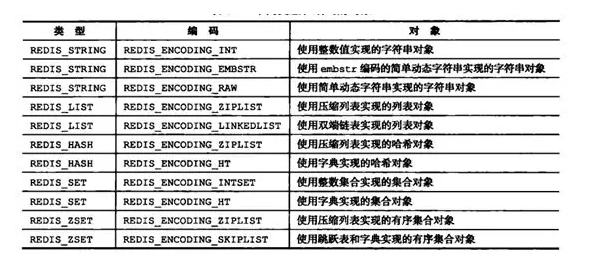
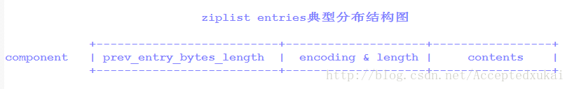
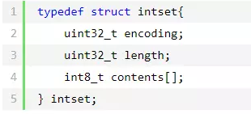

# 2.特性与原理

- redis 学习问题总结： [http://aperise.iteye.com/blog/2310639](http://aperise.iteye.com/blog/2310639)
- 不错的博客： [http://ifeve.com/redis-data-types/](http://ifeve.com/redis-data-types/)
- Redis学习笔记： [https://segmentfault.com/a/1190000015297408](https://segmentfault.com/a/1190000015297408)
- 全面剖析RedisCluster原理和应用：[https://blog.csdn.net/dc_726/article/details/48552531](https://blog.csdn.net/dc_726/article/details/48552531)
- 《吊打面试官》redis： [https://zhuanlan.zhihu.com/p/89620471](https://zhuanlan.zhihu.com/p/89620471)
- Redis高级客户端Lettuce详解：[https://www.cnblogs.com/throwable/articles/11601538.html](https://www.cnblogs.com/throwable/articles/11601538.html)
- Redis面试热点之底层实现篇：[https://mp.weixin.qq.com/s/3IptChwLLMN6aTeQhapSNw](https://mp.weixin.qq.com/s/3IptChwLLMN6aTeQhapSNw)
- [https://mp.weixin.qq.com/s/y18mX65b64GPjb85DFftlg](https://mp.weixin.qq.com/s/y18mX65b64GPjb85DFftlg)
- Redis面试热点之工程架构篇：[https://mp.weixin.qq.com/s/qONJaq0IU4Oe2T-1yS84vA](https://mp.weixin.qq.com/s/qONJaq0IU4Oe2T-1yS84vA)
- [https://mp.weixin.qq.com/s/CpiNqePf9x5VQZSc7MakQA](https://mp.weixin.qq.com/s/CpiNqePf9x5VQZSc7MakQA)
- 笔记整理：[https://mp.weixin.qq.com/s/Py4AdFh95HgcH0POXOxMzA](https://mp.weixin.qq.com/s/Py4AdFh95HgcH0POXOxMzA)
- 面试题整理：[https://mp.weixin.qq.com/s/I9CZHZu-EgRPSO9DrRKXCw](https://mp.weixin.qq.com/s/I9CZHZu-EgRPSO9DrRKXCw)
- 阿里：一文搞懂Redis：[https://mp.weixin.qq.com/s/7ct-mvSIaT3o4-tsMaKRWA](https://mp.weixin.qq.com/s/7ct-mvSIaT3o4-tsMaKRWA)
- [带你走进 Redis](https://mp.weixin.qq.com/s/4bAPVdUr_XbIw9xFCtWhfw)
- [为了拿捏 Redis 数据结构，我画了 40 张图（完整版） ](https://www.cnblogs.com/xiaolincoding/p/15628854.html)
## 0.性能解析

绝大部分写业务的程序员，在实际开发中使用 Redis 的时候，只会 Set 和 Get 两个操作，对 Redis 整体缺乏一个认知。
这里对 Redis 常见问题做一个总结，解决大家的知识盲点。以下方案只针对多用户共享资源，当并发量达到百万级别时，需要考虑缓存击穿和缓存雪崩问题。

性能解析：
- [为啥快？持久化？高可用？最佳实践等](https://mp.weixin.qq.com/s/sRsmi3SGxS7U0P_kzgK9Ag)
- [Redis 核心篇：唯快不破的秘密](https://mp.weixin.qq.com/s/58m0ZjZOSeElYmggAZhznA)

### 0.1.为什么用Redis

在项目中使用Redis，主要考虑两个角度：性能和并发。 如果只是为了分布式锁这些其他功能，还有其他中间件 Zookpeer 等代替。

1.性能

我们在碰到需要执行耗时特别久，且结果不频繁变动的 SQL，就特别适合将运行结果放入缓存。这样，后面的请求就去缓存中读取，使得请求能够迅速响应。
特别是在秒杀系统，在同一时间，几乎所有人都在点，都在下单。。。执行的是同一操作———向数据库查数据。
根据交互效果的不同，响应时间没有固定标准。在理想状态下，我们的页面跳转需要在瞬间解决，对于页内操作则需要在刹那间解决。

2.并发

在大并发的情况下，所有的请求直接访问数据库，数据库会出现连接异常。这个时候，就需要使用 Redis 做一个缓冲操作，让请求先访问到 Redis，而不是直接访问数据库。

### 0.2.单线程的 Redis 为什么这么快
这个问题是对 Redis 内部机制的一个考察。很多人都不知道 Redis 是单线程工作模型。

原因主要是以下三点：
- 纯内存操作
- 单线程操作，避免了频繁的上下文切换
- 采用了io多路复用机制，非阻塞
- Resp协议：redis定义的简单的通讯协议，所以快
- 高效的数据结构（内部结构）

#### 0.2.1.什么是多路复用

下面类比到真实的 Redis 线程模型，如图所示：


实现原理：[/article/16.Linux/1.Linux内核](/article/16.Linux/1.Linux内核)

IO多路复用是Linux常用的网络io方式。redis的多路复用， 提供了select, epoll, evport, kqueue几种选择，在编译的时候来选择一种。

Redis-client 在操作的时候，会产生具有不同事件类型的 Socket。在服务端，有一段 I/O 多路复用程序，将其置入队列之中。
然后，文件事件分派器，依次去队列中取，转发到不同的事件处理器中。 I/O 多路复用模型是利用select、poll、epoll可以同时监察多个流的 I/O 事件的能力，
在空闲的时候，会把当前线程阻塞掉，当有一个或多个流有I/O事件时，就从阻塞态中唤醒，于是程序就会轮询一遍所有的流（epoll是只轮询那些真正发出了事件的流），
依次顺序的处理就绪的流，这种做法就避免了大量的无用操作。
采用多路 I/O 复用技术可以让单个线程高效的处理多个连接请求（尽量减少网络IO的时间消耗），且Redis在内存中操作数据的速度非常快（内存内的操作不会成为这里的性能瓶颈），
主要以上两点造就了Redis具有很高的吞吐量。

#### 0.2.2.Resp协议
redis协议在以下几点之间做出了折衷：
- 简单的实现
- 快速地被计算机解析
- 简单得可以能被人工解析
- 网络层，Redis在TCP端口6379上监听到来的连接（本质就是socket），客户端连接到来时，Redis服务器为此创建一个TCP连接。
  在客户端与服务器端之间传输的每个Redis命令或者数据都以\\r\\n结尾。

Redis接收由不同参数组成的命令。一旦收到命令，将会立刻被处理，并回复给客户端

协议的规范：

```shell
*后面数量表示存在几个$
$后面数量表示字符串的长度

# 下面的是一个完整的协议体。真实的内容是
"*3\\r\\n$3\\r\\nSET\\r\\n$5\\r\\nmykey\\r\\n$7\\r\\nmyvalue\\r\\n"

# 展开后的内容是下面的
*3
$3
SET
$5
mykey
$7
myvalue
```

回复请求:Redis用不同的回复类型回复命令。它可能从服务器发送的第一个字节开始校验回复类型：
- 用单行回复，回复的第一个字节将是“+”
- 错误消息，回复的第一个字节将是“-”
- 整型数字，回复的第一个字节将是“:”
- 批量回复，回复的第一个字节将是“$”
- 多个批量回复，回复的第一个字节将是“*”

例子：状态回复（或者单行回复）
```shell
以“+”开始以“\\r\\n”结尾的单行字符串形式。例如：
"+OK\\r\\n
```

## 1.特性
### 1.1.事务

教程：[https://www.runoob.com/redis/redis-transactions.html](https://www.runoob.com/redis/redis-transactions.html)

Redis支持简单的事务，Redis与 mysql事务的对比

|    操作 |   Mysql           | Redis|
|------ |------------------- |--------------|
|开启   |start transaction   |muitl|
|语句   |普通sql             |普通命令|
|失败   |rollback 回滚       |discard 取消|
|成功   |commit             | exec|

```shell
multi # 事务开始

命令1
命令2
discard 事务失败，不影响前面的执行结果
命令3

exec #事务结束
```

<p style="color: red">rollback与discard的区别</p>
1. SQL的rollback，如果已经成功执行了2条语句, 第3条语句出错，Rollback后,前2条的语句影响消失。
2. Redis的discard只是结束本次事务,前2条语句造成的影响仍然还在

<p style="color: red">在mutil后面的语句中, 语句出错可能有2种情况</p>
1. 命令错误，语法不正确，导致事务不能正常结束，只能调用 discard 才能结束
2. 运行错误，语法正确，但类型错误，事务可以调用 exec 正常结束。

<p style="color: red">watch命令</p>
用watch后， multi失效，事务失效

WATCH机制：事务EXEC执行时，Redis检查被WATCH的key，只有被WATCH的key从WATCH起始时至今没有发生过变更，EXEC才会被执行，变化则失败。

<p style="color: red">Redis事务不支持回滚的话，有什么用？</p>
用于pipeline，批量执行命令，发现问题并及时退出执行

### 1.2.Pub/Sub

使用办法:

订阅端: Subscribe 频道名称

发布端: publish 频道名称 发布内容

1.服务端例子:

```shell
redis 127.0.0.1:6379> publish news 'good good study'
(integer) 1

redis 127.0.0.1:6379> publish news 'day day up'
(integer) 1
```

2.客户端例子:

```shell
redis 127.0.0.1:6379> subscribe news
Reading messages... (press Ctrl-C to quit)
1)"subscribe"
2)"news"
3)(integer) 1

1)"message"
2)"news"
3)"good good study"

1)"message"
2)"news"
3)"day day up"
```

3.查询当前活跃的频道：pubsub channels [*]

4.查询某个频道订阅的人：pubsub numsub 频道名

### 1.3.持久化

持久化原理：[https://mp.weixin.qq.com/s/WEc9MhAZFjE539MlpFuAOg](https://mp.weixin.qq.com/s/WEc9MhAZFjE539MlpFuAOg)

[https://mp.weixin.qq.com/s/ij67XYJgYK2kYrAlSDz3sw](https://mp.weixin.qq.com/s/ij67XYJgYK2kYrAlSDz3sw)

Redis4.0之后使用了如下三种持久化策略：

AOF日志：一种采用文件追加的方式将命令记录在日志中的策略，针对同步和异步追加还提供了三个配置项，有兴趣的可以查看官方文档。

RDB快照：以快照的方式，将某一个时刻的内存数据，以二进制的方式写入磁盘。

AOF和RDB混用：Redis4.0新增的方式，为了采用两种方式各自的优点，在RDB快照的时间段内使用的AOF日志记录这段时间的操作的命令，这样一旦发生宕机，将不会丢失两段快照中间的数据。

由于写入磁盘有IO性能瓶颈，因此不是将Redis作为数据库的话（可以从后端恢复），建议禁用持久化或者调整持久化策略。

#### 1.3.1.RDB

工作原理：每隔N分钟或N次写操作后，从内存中dump数据生成rdb文件，压缩存放在磁盘上。目前较新的版本中，redis会fork一个子进程，子进程将当前内存中的数据生成一个临时文档，当快照完成后，用这个临时文件覆盖就的快照文件，这也就是我们常说的copy-on-write。这种方式有触发条件，在条件没有触发的时候，可能出现数据部分丢失的情况。

- save 900 1 // 900秒内,有1条写入,则产生快照
- save 300 1000 // 如果300秒内有1000次写入,则产生快照
- save 60 10000 // 如果60秒内有10000次写入,则产生快照

(这3个选项都屏蔽,则rdb禁用)

```properties
# 当快照操作bgsave出错时，是否停止持久化？yes 表示“是”，no表示“否”。
stop-writes-on-bgsave-error yes

# 是否压缩？yes表示“是”，no表示“否”，默认选择yes。
rdbcompression yes

# 对rdb数据进行校验, 表示写入文件和读取文件时是否开启 RDB 文件检查。
# yes表示“是”，no表示“否”，默认选择yes。
# 选择yes表示在Redis加载RDB需要检查文件是否损坏，如果存在损坏会停止启动。
rdbchecksum yes

# 设置rdb的文件名
dbfilename dump.rdb

# RDB文件的路径，如果不单独指定，默认是redis的启动路径。
dir ./
```

#### 1.3.2.AOF

AOF 是 Redis 操作指令的日志存储，类同于 MySQL 的 Binlog、zookeeper的事务日志，假设 AOF 从 Redis 创建以来就一直执行，那么AOF 就记录了所有的 Redis 指令的记录。

如果要恢复 Redis，可以对 AOF 进行指令重放，便可修复整个 Redis 实例。

不过 AOF 日志也有两个比较大的问题：
- 一个是 AOF 的日志会随着时间递增，如果一个数据量大运行的时间久，AOF日志量将变得异常庞大。
- 另一个问题是 AOF 在做数据恢复时，由于重放的量非常庞大，恢复的时间将会非常的长。

AOF 写操作是在 Redis 处理完业务逻辑之后，按照一定的策略才会进行些 AOF日志存盘，这点跟 MySQL 的 Redolog 和 Binlog 有很大的不同。

也因为此原因，Redis 因为处理逻辑在前而记录操作日志在后，也是导致 Redis无法进行回滚的一个原因。

bgrewriteaof：针对上述的问题，Redis 在 2.4 之后也使用了 bgrewriteaof 对AOF 日志进行瘦身。

bgrewriteaof 命令用于异步执行一个 AOF 文件重写操作。重写会创建一个当前AOF 文件的体积优化版本

常用的配置如下：

- appendonly no                     # 是否打开 aof日志功能
- appendfsync                       # 日志刷盘策略，以下三种
    - appendfsync always	        # 每1个写命令都立即同步到硬盘，这样会严重降低Redis的性能
    - appendfsync everysec	        # 每秒同步1次，显式的将多个命令同步到硬盘（折衷方案，推荐）
    - appendfsync no	            # 写入工作交给操作系统,由操作系统判断缓冲区大小,统一写入到aof. 同步频率低,速度快
- appendfilename appendonly.aof     # aof文件存储位置
- no-appendfsync-on-rewrite yes     # 正在导出rdb快照的过程中,要不要停止同步aof
- auto-aof-rewrite-percentage 100   #aof文件大小比起上次重写时的大小,增长率100%时,重写
- auto-aof-rewrite-min-size 64mb    #aof文件，至少超过64M时,重写

<p style="color:red;">appendfsync always使用注意事项</p>
使用SSD硬盘的需要特别注意，这种不多地写入少量数据的方式，可能引发严重的写入放大（write amplification），
严重影响SSD的使用寿命，严重的情况下甚至会将几年寿命降低到几个月

<p style="color:red;">在dump rdb过程中,aof如果停止同步,会不会丢失</p>
答: 不会,所有的操作缓存在内存的队列里, dump完成后,统一操作.

<p style="color:red;">aof重写是指什么?</p>
因为aof记录的是每一次的操作记录，所以随着时间的增加，aof非常大，且有大量的冗余，无效的数据。对redis的运行和启动都不好。而aof重写是把内存中的所有数据,逆化成命令去除所有的无效和冗余的数据,
写入到.aof日志里.以解决 aof日志过大的问题。

<p style="color:red;">如果rdb文件,和aof文件都存在,优先用谁来恢复数据?</p>
同时开启rdb和aof,默认使用aof优先恢复。所以启动时，如有rdb有数据，aof没有数据，启动后，redis是没有数据的。

<p style="color:red;">Redis 持久化 之 AOF 和 RDB 同时开启，Redis听谁的？</p>

[https://www.jianshu.com/p/9cdf6c6d4cb0](https://www.jianshu.com/p/9cdf6c6d4cb0)

<p style="color:red;">2种是否可以同时用?</p>
可以，而且推荐这么做，并且如果条件允许的话，需要将两者文件保存到不同的硬盘（或者服务器、NFS等）上面

<p style="color:red;">恢复时rdb和aof哪个恢复的快</p>
rdb快,因为其是数据的内存映射,直接载入到内存,而aof是文本文件，保存的是命令,需要逐条执行。

<p style="color:red;">使用AOF重写是有啥需要注意的？</p>
在数量两较大的Redis实例中，AOF文件的体积也会非常的大，在重写的时候，虽然是后台线程操作的，但是大量的写操作，导致CPU使用率非常高（CPU
load可能不高，但是会把一个cpu核心打满），导致服务器的性能降低，直接影响Redis的性能

### 1.4.过期策略和内存淘汰机制

#### 1.4.1.举个例子

当我们使用客户端统计key的数量： redis-cli keys '*'|wc -l

和我们直接使用命令： dbsize 获得的数值可能是不一样的

原来是redis对过期键处理机制导致的误差。 dbsize返回的是包含过期键的总数

#### 1.4.2.Redis过期键的清除策略

- 被动删除：当读/写一个已经过期的key时，会触发惰性删除策略，直接删除掉这个过期key
- 主动删除：由于惰性删除策略无法保证冷数据被及时删掉，所以Redis会定期主动淘汰一批已过期的key
- 当前已用内存超过maxmemory限定时，触发主动清理策略

##### 1.4.2.1.被动删除

只有key被操作时(如GET)，REDIS才会被动检查该key是否过期，如果过期则删除之并且返回NIL。

1、这种删除策略对CPU是友好的，删除操作只有在不得不的情况下才会进行，不会对其他的expire key上浪费无谓的CPU时间。

2、但是这种策略对内存不友好，一个key已经过期，但是在它被操作之前不会被删除，仍然占据内存空间。如果有大量的过期键存在但是又很少被访问到，那会造成大量的内存空间浪费。

expireIfNeeded(redisDb *db, robj *key) 函数位于src/db.c。

但仅是这样是不够的，因为可能存在一些key永远不会被再次访问到，这些设置了过期时间的key也是需要在过期后被删除的，
我们甚至可以将这种情况看作是一种内存泄露—-无用的垃圾数据占用了大量的内存，而服务器却不会自己去释放它们，
这对于运行状态非常依赖于内存的Redis服务器来说，肯定不是一个好消息。

##### 1.4.2.2.主动删除

先说一下时间事件，对于持续运行的服务器来说，服务器需要定期对自身的资源和状态进行必要的检查和整理，
从而让服务器维持在一个健康稳定的状态， 这类操作被统称为常规操作（cron job）

在 Redis 中， 常规操作由 redis.c/serverCron 实现， 它主要执行以下操作

- 更新服务器的各类统计信息，比如时间、内存占用、数据库占用情况等。
- 清理数据库中的过期键值对。
- 对不合理的数据库进行大小调整。
- 关闭和清理连接失效的客户端。
- 尝试进行 AOF 或 RDB 持久化操作。
- 如果服务器是主节点的话，对附属节点进行定期同步。
- 如果处于集群模式的话，对集群进行定期同步和连接测试。

Redis 将 serverCron 作为时间事件来运行，从而确保它每隔一段时间就会自动运行一次， 又因为 serverCron 需要在 Redis
服务器运行期间一直定期运行， 所以它是一个循环时间事件： serverCron 会一直定期执行，直到服务器关闭为止。

在 Redis 2.6 版本中， 程序规定 serverCron 每秒运行 10 次， 平均每 100 毫秒运行一次。
从 Redis 2.8 开始， 用户可以通过修改 hz选项来调整 serverCron 的每秒执行次数，
具体信息请参考 redis.conf 文件中关于 hz 选项的说明也叫定时删除，这里的“定期”指的是Redis定期触发的清理策略，

由位于src/redis.c的activeExpireCycle(void)函数来完成。

serverCron是由redis的事件框架驱动的定位任务，这个定时任务中会调用activeExpireCycle函数，针对每个db在限制的时间REDIS_EXPIRELOOKUPS_TIME_LIMIT内迟可能多的删除过期key，之所以要限制时间是为了防止过长时间的阻塞影响redis的正常运行。这种主动删除策略弥补了被动删除策略在内存上的不友好。

因此，Redis会周期性的随机测试一批设置了过期时间的key并进行处理。测试到的已过期的key将被删除。典型的方式为,Redis每秒做10次如下的步骤：

1.  随机测试100个设置了过期时间的key
2.  删除所有发现的已过期的key
3.  若删除的key超过25个则重复步骤1

这是一个基于概率的简单算法，基本的假设是抽出的样本能够代表整个key空间，redis持续清理过期的数据直至将要过期的key的百分比降到了25%以下。这也意味着在任何给定的时刻已经过期但仍占据着内存空间的key的量最多为每秒的写操作量除以4.

Redis-3.0.0中的默认值是10，代表每秒钟调用10次后台任务。

除了主动淘汰的频率外，Redis对每次淘汰任务执行的最大时长也有一个限定，这样保证了每次主动淘汰不会过多阻塞应用请求，以下是这个限定计算公式：

```properties
#define ACTIVE_EXPIRE_CYCLE_SLOW_TIME_PERC 25 /* CPU max % for keys collection */
timelimit = 1000000*ACTIVE_EXPIRE_CYCLE_SLOW_TIME_PERC/server.hz/100;
```

hz调大将会提高Redis主动淘汰的频率，如果你的Redis存储中包含很多冷数据占用内存过大的话，可以考虑将这个值调大，但Redis作者建议这个值不要超过100。我们实际线上将这个值调大到100，观察到CPU会增加2%左右，但对冷数据的内存释放速度确实有明显的提高（通过观察keyspace个数和used_memory大小）。

可以看出timelimit和server.hz是一个倒数的关系，也就是说hz配置越大，timelimit就越小。换句话说是每秒钟期望的主动淘汰频率越高，则每次淘汰最长占用时间就越短。这里每秒钟的最长淘汰占用时间是固定的250ms（1000000*ACTIVE_EXPIRE_CYCLE_SLOW_TIME_PERC/100），而淘汰频率和每次淘汰的最长时间是通过hz参数控制的。

从以上的分析看，当redis中的过期key比率没有超过25%之前，提高hz可以明显提高扫描key的最小个数。假设hz为10，则一秒内最少扫描200个key（一秒调用10次*每次最少随机取出20个key），如果hz改为100，则一秒内最少扫描2000个key；另一方面，如果过期key比率超过25%，则扫描key的个数无上限，但是cpu时间每秒钟最多占用250ms。

当REDIS运行在主从模式时，只有主结点才会执行上述这两种过期删除策略，然后把删除操作”del key”同步到从结点。

##### 1.4.2.3.maxmemory

回收冷数据（redis默认只支持驱逐冷数据，冷数据的存储需要二次开发）。回收内存期间，整个redis会进入到只读状态，直到回收完成。

- volatile-lru：从已设置过期时间的数据集（server.db[i].expires）中挑选最近最少使用的数据淘汰
- volatile-ttl：从已设置过期时间的数据集（server.db[i].expires）中挑选将要过期的数据淘汰
- volatile-random：从已设置过期时间的数据集（server.db[i].expires）中任意选择数据淘汰
- allkeys-lru：从数据集（server.db[i].dict）中挑选最近最少使用的数据淘汰（推荐使用，目前项目在用这种）
- allkeys-random：从数据集（server.db[i].dict）中任意选择数据淘汰（不推荐，神经病的算法）
- no-enviction（驱逐）：禁止驱逐数据，新写入操作会报错

当mem_used内存已经超过maxmemory的设定，对于所有的读写请求，都会触发redis.c/freeMemoryIfNeeded(void)函数以清理超出的内存。注意这个清理过程是阻塞的，直到清理出足够的内存空间。所以如果在达到maxmemory并且调用方还在不断写入的情况下，可能会反复触发主动清理策略，导致请求会有一定的延迟。

清理时会根据用户配置的maxmemory-policy来做适当的清理（一般是LRU或TTL），这里的LRU或TTL策略并不是针对redis的所有key，而是以配置文件中的maxmemory-samples个key作为样本池进行抽样清理。

maxmemory-samples在redis-3.0.0中的默认配置为5，如果增加，会提高LRU或TTL的精准度，redis作者测试的结果是当这个配置为10时已经非常接近全量LRU的精准度了，并且增加maxmemory-samples会导致在主动清理时消耗更多的CPU时间，建议：

- 尽量不要触发maxmemory，最好在mem_used内存占用达到maxmemory的一定比例后，需要考虑调大hz以加快淘汰，或者进行集群扩容。

- 如果能够控制住内存，则可以不用修改maxmemory-samples配置；如果Redis本身就作为LRU
  cache服务（这种服务一般长时间处于maxmemory状态，由Redis自动做LRU淘汰），可以适当调大maxmemory-samples。

这里提一句，实际上redis根本就不会准确的将整个数据库中最久未被使用的键删除，而是每次从数据库中随机取5个键并删除这5个键里最久未被使用的键。上面提到的所有的随机的操作实际上都是这样的，这个5可以用过redis的配置文件中的maxmemeory-samples参数配置。

##### 1.4.2.4.Replication link和AOF文件中的过期处理

为了获得正确的行为而不至于导致一致性问题，当一个key过期时DEL操作将被记录在AOF文件并传递到所有相关的slave。也即过期删除操作统一在master实例中进行并向下传递，而不是各salve各自掌控。这样一来便不会出现数据不一致的情形。当slave连接到master后并不能立即清理已过期的key（需要等待由master传递过来的DEL操作），slave仍需对数据集中的过期状态进行管理维护以便于在slave被提升为master会能像master一样独立的进行过期处理。

#### 1.4.3.配置

- 主动删除，定时刷新策略配置

```properties
# Redis calls an internal function to perform many background tasks, like 
# closing connections of clients in timeout, purging expired keys that are 
# never requested, and so forth. 
# 
# Not all tasks are performed with the same frequency, but Redis checks for 
# tasks to perform according to the specified "hz" value. 
# 
# By default "hz" is set to 10. Raising the value will use more CPU when 
# Redis is idle, but at the same time will make Redis more responsive when 
# there are many keys expiring at the same time, and timeouts may be 
# handled with more precision. 
# 
# The range is between 1 and 500, however a value over 100 is usually not 
# a good idea. Most users should use the default of 10 and raise this up to 
# 100 only in environments where very low latency is required. 
hz 10 
```

- 内存驱逐策略

```properties
# MAXMEMORY POLICY: how Redis will select what to remove when maxmemory 
# is reached. You can select among five behaviors: 
# 
# volatile-lru -> remove the key with an expire set using an LRU algorithm 
# allkeys-lru -> remove any key according to the LRU algorithm 
# volatile-random -> remove a random key with an expire set 
# allkeys-random -> remove a random key, any key 
# volatile-ttl -> remove the key with the nearest expire time (minor TTL) 
# noeviction -> don't expire at all, just return an error on write operations 
# 
# Note: with any of the above policies, Redis will return an error on write 
#       operations, when there are no suitable keys for eviction. 
# 
#       At the date of writing these commands are: set setnx setex append 
#       incr decr rpush lpush rpushx lpushx linsert lset rpoplpush sadd 
#       sinter sinterstore sunion sunionstore sdiff sdiffstore zadd zincrby 
#       zunionstore zinterstore hset hsetnx hmset hincrby incrby decrby 
#       getset mset msetnx exec sort 
# 
# The default is: 
# 
maxmemory-policy volatile-ttl
```

- 样本池进行抽样清理的个数

```properties
# LRU and minimal TTL algorithms are not precise algorithms but approximated 
# algorithms (in order to save memory), so you can tune it for speed or 
# accuracy. For default Redis will check five keys and pick the one that was 
# used less recently, you can change the sample size using the following 
# configuration directive. 
# 
# The default of 5 produces good enough results. 10 Approximates very closely 
# true LRU but costs a bit more CPU. 3 is very fast but not very accurate. 
# 
maxmemory-samples 5
```

#### 1.4.4.常见问题
<p style="color:red;">比如你 Redis 只能存 5G 数据，可是你写了 10G，那会删 5G 的数据。怎么删的，这个问题思考过么？</p>
正解：Redis 采用的是定期删除+惰性删除策略。

<p style="color:red;">为什么不用定时删除策略?</p>
定时删除，用一个定时器来负责监视 Key，过期则自动删除。虽然内存及时释放，但是十分消耗 CPU 资源。
在大并发请求下，CPU 要将时间应用在处理请求，而不是删除Key，因此没有采用这一策略。

<p style="color:red;">定期删除+惰性删除如何工作?</p>
定期删除，Redis 默认每个 100ms 检查，有过期 Key 则删除。需要说明的是，Redis 不是每个 100ms 将所有的 Key 检查一次，
而是随机抽取进行检查。如果只采用定期删除策略，会导致很多 Key 到时间没有删除。于是，惰性删除派上用场。

<p style="color:red;">采用定期删除+惰性删除就没其他问题了么?</p>
不是的，如果定期删除没删除掉 Key。并且你也没及时去请求 Key，也就是说惰性删除也没生效。
这样，Redis 的内存会越来越高。那么就应该采用内存淘汰机制。

<p style="color:red;">Redis 如何设置过期时间&注意细节</p>

[https://mp.weixin.qq.com/s/L5cOBqwEfJshSwtNpXZeSA](https://mp.weixin.qq.com/s/L5cOBqwEfJshSwtNpXZeSA)

### 1.5.VM

#### 1.5.1.基本概念

Redis 的 VM (虚拟内存)机制就是暂时把不经常访问的数据(冷数据)从内存交换到磁盘中，从而腾出宝贵的内存空间用于其它需要访问的数据(热数据)。
通过VM功能可以实现冷热数据分离，使热数据仍在内存中、冷数据保存到磁盘。这样就可以避免因为内存不足而造成访问速度下降的问题。Redis
提高数据库容量的办法有两种：一种是可以将数据分割到多个 RedisServer上；另一种是使用虚拟内存把那些不经常访问的数据交换到磁盘上。「需要特别注意的是
Redis 并没有使用 OS 提供的 Swap，而是自己实现。」

Redis 为了保证查找的速度，只会将 value 交换出去，而在内存中保留所有的Key。
所以它非常适合 Key 很小，Value 很大的存储结构。如果 Key 很大，value 很小，那么vm可能还是无法满足需求。

redis 规定同一个数据页面只能保存一个对象，但一个对象可以保存在多个数据页面中。
在redis 使用的内存没超过 vm-max-memory 时，是不会交换任何 value到磁盘上的。
当超过最大内存限制后，redis会选择较老的对象(如果两个对象一样老会优先交换比较大的对象)将它从内存中移除，这样会更加节约内存。

对于 Redis 来说，一个数据页面只会保存一个对象，也就是一个 Value 值，所以应该将 vm-page-size 设置成大多数 value
可以保存进去。如果设置太小，一个 value 对象就会占用几个数据页面，如果设置太大，就会造成页面空闲空间浪费。

#### 1.5.2.VM 的工作机制

redis 的 VM 的工作机制分为两种：一种是 vm-max-threads=0，一种是 vm-max-threads > 0。

##### 1.5.2.1.第一种：vm-max-threads = 0

数据换出：主线程定期检查使用的内存大小，如果发现内存超出最大上限，会直接以阻塞的方式，将选中的对象
换出 到磁盘上(保存到文件中)，并释放对象占用的内存，此过程会一直重复直到下面条件满足任意一条才结束：

- 内存使用降到最大限制以下。
- 设置的交换文件数量达到上限。
- 几乎全部的对象都被交换到磁盘了。

数据换入：当有 client 请求 key 对应的 value 已被换出到磁盘中时，主线程会以阻塞的方式从换出文件中加载对应的 value 对象，
加载时此时会阻塞所有 client，然后再处理 client 的请求。「这种方式会阻塞所有的 client。」

##### 1.5.2.2.第二种：vm-max-threads > 0

数据换出：当主线程检测到使用内存超过最大上限，会将选中的要交换的数据放到一个队列中交由工作线程后台处理，主线程会继续处理 client 请求。

数据换入：当有 client 请求 key 的对应的 value 已被换出到磁盘中时，主线程先阻塞当前 client，然后将加载对象的信息放到一个队列中，
让工作线程去加载，此时进主线程继续处理其他 client 请求。加载完毕后工作线程通知主线程，主线程再执行被阻塞的 client的命令。
「这种方式只阻塞单个 client。」

### 1.6.事件监听

监听 Redis Key 失效事件实现定时任务：
[https://mp.weixin.qq.com/s/27Ge0JHgIYMMANSnWdLwxg](https://mp.weixin.qq.com/s/27Ge0JHgIYMMANSnWdLwxg)

配置如下：


1.Redis配置：notify-keyspace-events "Ex"

2.客户端程序配置监听，channel=__keyevent@0__:expired

### 1.7.UNLINK

Redis服务自身对Key的删除，可以分为「同步删除」和「异步删除」。
- DEL命令(同步删除)，如果Key是一个有很多元素的复杂类型，这个过程可能会堵塞一下Redis服务自身，从而影响用户的访问。
- UNLINK命令(智能删除)，Redis服务会先计算删除Key的成本，从而更智能地做出「同步删除」或「异步删除」的选择。注意，只有4.0版本后，才有UNLINK命令。

<p style="color: red">成本是如何计算？</p>
- 对于list,hash,set,zset的对象类型，如果长度大于64（由宏LAZYFREE_THRESHOLD定义），才会采用异步删除的手段。
- 对于string对象，底层的数据结构sds是一份连续的内存，内存分配器回收这块内存的复杂度是O(1)，所以采用同步删除也不会堵塞服务。

从当前db先释放该key，再由另外一个线程做异步删除。对于长度不大于64的复杂类型，异步删除比同步删除还多了一些函数调用与多线程同步的代价，所以同步删除更好。

总的来说，我们作为用户，都能用UNLINK替代DEL。

### 1.8.pipeline
redis客户端执行命令4个过程：发送命令－〉命令排队－〉命令执行－〉返回结果。网络传输占用的时间较多。

Pipeline是一次性发送多条命令，降低多次执行的往返时间。

Pipeline正确使用方式。pipeline组装命令不能太多，不然数据量过大，增加客户端的等待时间，造成网络阻塞，可将大量命令的拆分多个小pipeline命令。

为了保证pipeline原子性，redis提供了简单的事务

## 2.深入了解redis
- [Redis内部数据结构详解(1)——dict](https://mp.weixin.qq.com/s/qFDOFr4HYpgUg-J_VCNvQw)
- [Redis内部数据结构详解(2)——sds](https://mp.weixin.qq.com/s/_uqWOC1Gau-yCja1fmTdqA)
- [Redis内部数据结构详解(3)——robj](https://mp.weixin.qq.com/s/Jlv6AgaO4QrCXvjr6RipIQ)
- [Redis内部数据结构详解(4)——ziplist](https://mp.weixin.qq.com/s/SWaFXXbSFOQ9MYSztSyWww)
- [Redis内部数据结构详解(5)——quicklist](https://mp.weixin.qq.com/s/6aFwnnnYIv3mWm0YkXWn9w)
- [Redis内部数据结构详解(6)——skiplist](https://mp.weixin.qq.com/s/rXIVIW7RM56xwMaQtKnmqA)
- [Redis内部数据结构详解(7)——intset](https://mp.weixin.qq.com/s/Z6OZpDg1yQD5MaRmcLHcLw)

- [基于Redis的分布式锁到底安全吗（上）](https://mp.weixin.qq.com/s/JTsJCDuasgIJ0j95K8Ay8w)
- [基于Redis的分布式锁到底安全吗（下）](https://mp.weixin.qq.com/s/4CUe7OpM6y1kQRK8TOC_qQ)


- 底层数据结构: [https://www.jianshu.com/p/3dddb5ca05f7](https://www.jianshu.com/p/3dddb5ca05f7)
- Redis9种数据结构以及它们的内部编码实现：[https://mp.weixin.qq.com/s/J9XWe3VIG6NUCIvXj660fw](https://mp.weixin.qq.com/s/J9XWe3VIG6NUCIvXj660fw)
- Hash算法： [https://www.jianshu.com/p/7f53f5e683cf](https://www.jianshu.com/p/7f53f5e683cf)
- ziplist详细解析：[https://blog.csdn.net/weixin_35390390/article/details/84950485](https://blog.csdn.net/weixin_35390390/article/details/84950485)

### 2.1.内存分配

Redis进程的内存消耗主要包括：自身内存 + 对象内存 + 缓冲内存 + 内存碎片。

1. 自身内存。Redis自身内存消耗非常少。
2. 对象内存。对象内存是Redis内存占用最大的一块，存储着用户的所有数据，还包括慢查询日志等Redis帮我们维护的一些内存数据。
3. 缓冲内存
   1. 客户端缓冲。所有连到Redis服务器的TCP连接的输入缓冲和输出缓冲
   2. 复制积压缓冲。Redis在2.8版本之后提供了一个可重用的固定大小的缓冲区用于实现增量复制的功能，根据repl-backlog-size参数来控制，默认大小1MB
   3. AOF重写缓冲。用于在AOF重写期间保存写命令
4. 内存碎片。内存分配器，都是按照块申请的，申请之后内存可能没有全部都使用。不使用的部分就是碎片。以及正常缓存删除后没有被回收的内存也是碎片。

<p style="color: red">内存分配器</p>
Redis默认内存分配器采用jemalloc，可选的分配器还有：glibe、tcmalloc。
内存分配器是为了更好的管理和重复利用内存，分配内存策略一般采用固定范围的内存块进行内存分配。

jemalloc 在 64 位系统中，将内存空间划分为小、大、巨大三个范围；当 Redis存储数据时，会选择大小最合适的内存块进行存储。
jemalloc 划分的内存单元如下图所示：


<p style="color: red">内存分配情况的内部统计报表</p>
该命令目前仅实现了 jemalloc 作为内存分配器的内存统计，对其他分配器暂不支持。Redis>4

```shell
127.0.0.1:6379> memory malloc-stats
```

<p style="color: red">内存统计</p>
info 命令可以显示 Redis服务器的许多信息，包括服务器基本信息、CPU、内存、持久化、客户端连接信息等等；

### 2.2.Redis存储结构

redis默认有16个数据库，每个数据库包括两个hash表，一个用于存储无过期时间的kv,另一个用于存储有过期时间的kv。数据结构如下

- redisDb的结构如下
```cpp
typedef struct redisDb {
    dict *dict;                 /* The keyspace for this DB */  //存储无过期时间的kv
    dict *expires;              /* Timeout of keys with a timeout set */  //存储有过期时间的kv
    dict *blocking_keys;        /* Keys with clients waiting for data (BLPOP) */ 
    dict *ready_keys;           /* Blocked keys that received a PUSH */ 
    dict *watched_keys;         /* WATCHED keys for MULTI/EXEC CAS */
    struct evictionPoolEntry *eviction_pool;    /* Eviction pool of keys */
    int id;                     /* Database ID */
    PORT_LONGLONG avg_ttl;      /* Average TTL, just for stats */
} redisDb;
```

- dict 的结构如下
```cpp
typedef struct dict {
    dictType *type;  //存储了一下hashtable的函数操作，包括对key的hash以及比较key的函数等
    void *privdata;
    dictht ht[2];    //两个字典对象，其中ht[1]的内存是ht[0]的两倍，用于渐进式rehash使用
    //记录rehash 进度的标志，值为-1表示rehash未进行
    PORT_LONG rehashidx; /* rehashing not in progress if rehashidx == -1 */ 
    int iterators; /* number of iterators currently running */
} dict;
```

- dictht的结构如下
```cpp
typedef struct dictht {
    dictEntry **table;   //hash表
    PORT_ULONG size;  //hash表大小
    PORT_ULONG sizemask;  // 等于size - 1;会用于后续与hash一起确定该数据存放的索引位
    PORT_ULONG used;  //hash表中已使用的大小
} dictht;
```

- dictEntry的结构如下
```cpp
typedef struct dictEntry {
    void *key;   //redis的key 封装为SDS
    union {
        void *val;     //value, 指向底层数据结构
        uint64_t u64;
        int64_t s64;
        double d;
    } v;
    struct dictEntry *next;  //hash冲突时指向下一个数据节点
} dictEntry;
```

dictEntry：Redis 是 Key-Value 数据库，因此对每个键值对都会有一个 dictEntry，里面存储了指向 Key 和 Value 的指针；next 指向下一个 dictEntry，与本 Key-Value 无关。

- redisObject的结构如下
```cpp
typedef struct redisObject {
    unsigned type:4;  //记录了该对象的类型
    unsigned encoding:4;  //表示ptr指针指向的具体使用到的数据结构
    unsigned lru:LRU_BITS; /* lru time (relative to server.lruclock) */ //对象最后一次被访问的时间
    int refcount; // 引用计数
    void *ptr;  //指向实际值的指针
} robj;
```
Redis 对象有 5 种类型；无论是哪种类型，Redis 都不会直接存储，而是通过 RedisObject 对象进行存储。
- type：用于表示该对象的类型，其包含了string、list、hash、set、zset等；
- encoding：表示ptr指针指向的具体使用到的数据结构，也就是value用什么底层数据类型存储的；
- lru：对象最后一次被访问的时间，用户后续的过期策略；
- refcount：引用计数器；表明了redis中的垃圾回收算法是使用了引用计数法完成的
- ptr指针：指向实际保存数据的底层结构对象；

总结
- redisDb ：redis的顶层数据库结构，内部定义了数据存储结构字典dict，过期时间、用于阻塞key以及事务相关的监听。
- dict ：用于存储redis中的k-v数据的字段结构。其中定义了两个hashtable和rehash下标值。
- dictht ： redis中真正的hash表，二维数组结构，内部定义了存储k-v的entry、数组长度、确定数据存放位置的模、数组内的数据量。
- dictEntry ：用于存储k-v数据的entry对象，内部封装了key、value字段，以及用于处理hash冲突的指针。
- redisObject：用于封装value数字的对象；其内部包含了value的命令类型、底层存储结构、回收策略、lru信息等；


### 2.3.Redis的对象类型与内部编码

Redis 支持 5 种对象类型，而每种结构都有至少两种编码。

这样做的好处在于：一方面接口与实现分离，当需要增加或改变内部编码时，用户使用不受影响，另一方面可以根据不同的应用场景切换内部编码，提高效率。



Redis 各种对象类型支持的内部编码如下图所示(图中版本是 Redis3.0)：

关于 Redis 内部编码的转换，都符合以下规律：编码转换在 Redis 写入数据时完成，且转换过程不可逆，只能从小内存编码向大内存编码转换。

#### 2.3.1.字符串

字符串是最基础的类型，因为所有的键都是字符串类型，且字符串之外的其他几种复杂类型的元素也是字符串，字符串长度不能超过 512MB。

内部编码。 字符串类型的内部编码有 3 种，它们的应用场景如下：
- int：8 个字节的长整型。字符串值是整型时，这个值使用 long 整型表示。
- embstr：<=39 字节的字符串。embstr 与 raw 都使用 RedisObject 和 sds 保存数据。
- raw：大于 39 个字节的字符串。

区别在于：embstr 的使用只分配一次内存空间（因此 RedisObject 和 sds 是连续的），而 raw 需要分配两次内存空间（分别为 RedisObject 和 sds 分配空间）。

embstr 和 raw 进行区分的长度，是 39；是因为 RedisObject 的长度是 16 字节，sds 的长度是 9+ 字符串长度。
因此当字符串长度是 39 时，embstr 的长度正好是 16+9+39=64，jemalloc 正好可以分配 64 字节的内存单元。

#### 2.3.2.列表

列表（list）用来存储多个有序的字符串，每个字符串称为元素；一个列表可以存储 2^32-1 个元素。

Redis中的列表支持两端插入和弹出，并可以获得指定位置（或范围）的元素，可以充当数组、队列、栈等。

内部编码
- 双端列表（linkedlist）:由一个 list 结构和多个 listNode 结构组成，双端列表同时保存了表头指针和表尾指针，并且每个节点都有指向前和指向后的指针
- 压缩列表（ziplist）:是 Redis为了节约内存而开发的，是由一系列特殊编码的连续内存块(而不是像双端列表一样每个节点是指针)组成的顺序型数据结构，具体结构相对比较复杂。
- 快速列表（quicklist）：redis3.2之后替代了linkedlist。
  
当节点数量较少时，可以使用压缩列表；压缩列表不仅用于实现列表，也用于实现哈希、有序列表；使用非常广泛。

压缩列表的使用条件：
- 只有同时满足下面两个条件时，才会使用压缩列表：列表中元素数量小于 512 个；列表中所有字符串对象都不足 64 字节。
- 如果有一个条件不满足，则使用双端列表；且编码只可能由压缩列表转化为双端列表，反方向则不可能。

其中，单个字符串不能超过 64 字节，是为了便于统一分配每个节点的长度。

#### 2.3.3.哈希

哈希（作为一种数据结构），不仅是 Redis 对外提供的 5 种对象类型的一种（与字符串、列表、集合、有序结合并列），
也是 Redis 作为 Key-Value 数据库所使用的数据结构。

内部编码
- 压缩列表（ziplist）
- 哈希表（hashtable）结构是：一个 hashtable 由 1 个 dict 结构、2 个 dictht 结构、1 个 dictEntry 指针数组（称为 bucket）和多个 dictEntry 结构组成。

key：键值对中的键。
val：键值对中的值，使用union(即共用体)实现，存储的内容既可能是一个指向值的指针，也可能是 64 位整型，或无符号 64 位整型。
next：指向下一个 dictEntry，用于解决哈希冲突问题。 在 64 位系统中，一个 dictEntry 对象占 24 字节（key/val/next 各占 8 字节）。
bucket：bucket 是一个数组，数组的每个元素都是指向 dictEntry 结构的指针。Redis 中 bucket 数组的大小计算规则如下：大于 dictEntry 的、最小的 2^n。

例如，如果有 1000 个 dictEntry，那么 bucket 大小为 1024；如果有 1500 个 dictEntry，则 bucket 大小为 2048。

#### 2.3.4.集合

集合中的元素是无序的，因此不能通过索引来操作元素；集合中的元素不能有重复。一个集合中最多可以存储 2^32-1 个元素。

内部编码
- 整数集合（intset）
- 哈希表（hashtable）


#### 2.3.5.有序集合
有序集合与集合一样，元素都不能重复；但与集合不同的是，有序集合中的元素是有顺序的。有序集合为每个元素设置一个分数（score）作为排序依据。

内部编码
- 压缩列表（ziplist）
- 跳跃表（skiplist）。跳跃表是一种有序数据结构，通过在每个节点中维持多个指向其他节点的指针，从而达到快速访问节点的目的。

Redis 的跳跃表实现由 zskiplist 和 zskiplistNode 两个结构组成：前者用于保存跳跃表信息（如头结点、尾节点、长度等），后者用于表示跳跃表节点，具体结构相对比较复杂。

压缩列表的使用条件：
- 只有同时满足下面两个条件时，才会使用压缩列表：有序集合中元素数量小于 128 个；有序集合中所有成员长度都不足 64 字节。
- 如果有一个条件不满足，则使用跳跃表；且编码只可能由压缩列表转化为跳跃表，反方向则不可能。

### 2.4.内部结构

#### 2.4.1.sds
C语言，字符串有2个特点
1. 字符串(即以空字符'\0'结尾的字符数组)作为默认的字符串表示
2. 获得字符串长度需要变量整个字符串，时间复杂度是O(n)

所以Redis使用了SDS。SDS 是简单动态字符串(Simple Dynamic String)的缩写。

```cpp
struct sdshdr {
    int len;
    int free;
    char buf[];
};
```

- len 表示 buf 已使用的长度。时间复杂度是O(1)
- free 表示 buf 未使用的长度。
- buf 表示字节数组，用来存储字符串

特点：
1. 内存预分配。第一次分配内存后，如果在修改的时候发现free空间足够，则只修改buff的内容和len长度，不需要重新分配内存
2. 惰性空间释放。修改后长度降低，不会回收内存，而是通过len和free记录修改后的信息。
3. 二进制安全。可以存储c语法无法存储的特殊字符。且可以是二进制的。

#### 2.4.2.linkedlist

#### 2.4.3.ziplist

[Redis内部数据结构详解之压缩链表(ziplist)](https://blog.csdn.net/qiezikuaichuan/article/details/46574301)

结构图如下：




```cpp
struct ziplist<T> {
    int32 zlbytes; // 整个压缩列表占用字节数
    int32 zltail_offset; // 最后一个元素距离压缩列表起始位置的偏移量，用于快速定位到最后一个节点
    int16 zllength; // 元素个数
    T[] entries; // 元素内容列表，挨个挨个紧凑存储
    int8 zlend; // 标志压缩列表的结束，值恒为 0xFF
}
```

#### 2.4.4.hashtable
当写入 Redis 的数据越来越多的时候，哈希冲突不可避免。Redis 通过链式哈希解决冲突，与Java的hashMap一样

但是当链表过长就会导致查找性能变差可能，所以 Redis 为了追求快，使用了两个全局哈希表。用于 rehash 操作，增加现有的哈希桶数量，减少哈希冲突。

rehash过程：
1. 开始默认使用 表1 保存键值对数据，表2 此刻没有分配空间
2. rehash时， 给 表2 分配 表1 2倍的空间
3. 将 表1 的数据重新映射拷贝到 表2 中
4. 释放 表1 的空间

步骤3，将 表1 的数据重新映射到 表2 的不是一次性的，这样会造成 Redis 阻塞，无法提供服务。所有Redis采用渐进式 rehash。

原理：每次处理客户端请求的时候，先从 表1 中第一个索引开始，将这个位置的所有数据拷贝到 表2 中，就这样将 rehash 分散到多次请求过程中，避免耗时阻塞。

#### 2.4.5.intset

结构定义如下



encoding 代表 contents 中存储内容的类型，虽然 contents（存储集合中的元素）是 int8_t 类型。

但实际上其存储的值是 int16_t、int32_t 或 int64_t，具体的类型便是由 encoding 决定的，length 表示元素个数。

#### 2.4.6.skiplist


跳跃表（skiplist）是一种有序数据结构，它通过在每个节点中维持多个指向其他节点的指针，从而达到快速访问节点的目的。

跳跃表支持平均 O（logN）、最坏 O（N）复杂度的节点查找，还可以通过顺序性操作来批量处理节点。

也是很多内存型数据库喜欢使用的数据存储结构。

#### 2.4.7.quicklist

Redis3.2使用，用来替换linkedlist。quicklist的每个节点都是一个ziplist。ziplist本身也是一个能维持数据项先后顺序的列表，而且内存是紧凑的。

- 本质：quicklist其实就是一个分段的ziplist。每个ziplist可以存储多个数据。也避免了元素增加够类型转换导致的性能影响。
- 目的：优化redis的列表键底层存储，提高list的性能

[快速表、压缩表和双向链表（重点介绍quicklist）](https://blog.csdn.net/MarkusZhang/article/details/109000894)


### 2.6.降低内存占用

解决方案：
- 短结构，比如使用压缩列表，整数集合，
- 分片结构，按照规则将大value拆分成若干小value。小value最好也是短结构
- 打包存储二进制位和字节，将value进行压缩、编码等

## 3.集群

Redis各个集群模式优缺点

主从模式（redis2.8版本之前的模式）

哨兵sentinel模式（redis2.8及之后的模式）

redis cluster模式（redis3.0版本之后）

[https://mp.weixin.qq.com/s/Q2ghAdE8dg_5TMr2ATj3pg](https://mp.weixin.qq.com/s/Q2ghAdE8dg_5TMr2ATj3pg)

### 3.1.Redis集群

#### 3.1.1.集群的作用

- 主从备份，防止主机宕机

- 读写分离，分担master的任务

- 任务分离，比如主机备份数据，从机计算数据

#### 3.1.2.搭建Redis集群的方式有哪些

1、单机版 不解释

2、主从模式 低版本的Redis自带的方式，不支持主从切换，非HA，不推荐

3、Sentinel 哨兵模式 官方推荐的集群部署方式，满足HA，不支持数据分片

4、Redis Sharding集群（也叫Redis Cluster Redis）
官方推荐的集群部署方式，满足HA，支持数据分片，但是需要部署大量节点

#### 3.1.3.什么是真正的集群

真正的redis集群，首先要实现redis数据的自由均匀自由分片(sharding)，当数据分不到集群中各个节点之后，为保障该sharding节点的高可用性，该节点必须有足够多的从节点不断同步和备份数据，以便在该节点出现问题后，迅速通过某种方式（比如选举制）夺取出问题的主节点的原有角色位置。

简单理解：redis集群要满足两个条件之一。

- 支持分片sharding，比如：sharding集群，多主多从

- 能够进行主备切换，主备间数据一直，比如：sentinel集群

#### 3.1.4.官方推荐的集群部署方式

在官网介绍了关于redis高可用的两种部署方式，一是redis
Sharding（是通过ruby脚本redis-trib.rb灵活实现redis
cluster模式），另一种方式是通过sentinel方式实现redis的高可用

|官网介绍的redis部署方式   |redis Sharding                  |     Redis Sentinel             |
|-----------------|-------------------------------|------------------------------------|
|是否支持数据分片         | 支持                             |    不支持，需要用户实现        |
|是否高可用            |    高可用，节点故障后自动切换          | 高可用，节点故障后自动切换 |
|使用场景             |     数据量大，数据均匀分布于各个节点；   | 数据量小，服务器个数有限；  |
|                 |       支持节点的横向扩展；               |  单个节点已经能存储所有数据； |
|                 |       各个节点高可用。                 |    避免单节点故障，引入sentinel   |
|集群最少服务数          |  6台（3主3从）                      |  3台（3sentinel与1主2从复用） |

场景一：在数据量超级大的情况下，单台redis服务器无法横向扩展，所以此时首先就要保证数据分布于能横向扩展的各个节点机器之上，这个就是sharding，这之后，为了保证数据有效性，每个sharding分片又必须有足够多的机器来做好备份，以便出问题时候能迅速被顶替上。这么看来，这种方式首先你要很多机器来存放sharding数据，需要很多机器来对sharding进行备份，对于机器资源本来不多的小公司，毕竟是一笔大的开销，最小的redis
Sharding部署方式下需要6台机器，3台主服务器做sharding，3台从服务器。

这6个节点只要有一个节点出现问题，整个集群就不可用了

场景二：数据量非常小，基本单台redis服务器就能存储所有缓存数据，而且戳戳有余。但又怕单节点故障问题，所以引入了sentinel，其实sentinel就是一个哨兵服务了，它已经知道哪台机器是主节点，哪台机器是从节点，主节点不可用时，能迅速从从节点选举新的从节点作为主节点。但毕竟sentinel也存在单节点故障，所以最好sentinel也要大于或等于3台。此部署方式下，最少3台机器，3台sentinel，1台主1台从，最稳定最少机器为3台sentinel1台主2台从，且此方式不属于redis集群范畴，因为不具备sharding功能。

#### 3.1.5.集群的实现方式（了解即可）

实现集群HA，不一定必须在Redis节点上进行操作，可以使用客户端、服务代理等方式实现

纵观redis的发展历程，redis走到今天，经过社区的不断贡献，目前redis集群实现方式有3种，列表如下：

|redis集群种类   |方式一(客户端分片)                   |       方式二(代理分片）                  |  方式三(服务端分片)                   |
|--------------|-----------------------------------|--------------------------------------|-------------------------|
|分片sharding   |sharding在客户端；                       |   sharding不在服务端更不在客户端；    | sharding在服务端，                |
|              |目前的实现有jedis                        |   sharding由代理完成；               |  服务端自带sharding实现           |
|              |                                   |         目前有Twemproxy和两种实现方式 |                                              |
|优点           |不依赖于第三方分布式中间件；            |    程序不用关心后端Redis                |无中心节点（和代理模式的重要不同之处）；故障自动切换     |
|              |实现方法和代码都自己掌控;              |    实例，运维起来也方便                                 |                            |
|              |静态分片技术；                       |                                                      |                            |
|              |性能比代理式更好（少了一个中间分发环节）; |                                                       |                            |
|缺点           |可运维性较差。出现故障，               |    多了一道环节，相对客户端          |   一种非常“重”的方案。                             |
|              |定位和解决都得研发和运维配             |   分片集群方式性能稍微降低            | 已经不是Redis单实例的“简单、可依赖”
|              |合着解决，故障时间变长。               |                                                                                   |

### 3.2.单机版

没啥好说的，可以满足简单的需求。生产中基本不可能使用到这个。

### 3.3.主从模式

#### 3.3.1.主从复制原理

为了避免单机Redis的单机问题出现，Redis官方给出方案主从复制，做到一主一备的作用，再结合Redis的哨兵模式，做到灾备的切换，主节点通知客户端，实现服务的高可用。

##### 3.3.1.1.核心概念

Runid:每次Redis节点启动的时候，会生成一个uuid。作为节点的唯一标识

Offset:主节点和从节点各自维护主从复制偏移量。当主节点有写入操作的时候，主节点的offset=offset+命令的字节长度。从节点接受到主节点发送过来的命令后，从节点维护的offset就会变成offset+命令的长度。同时offset也是用来判断主从节点数据是否一致的依据。

Repl_backlog_size:复制缓冲区，只在主节点的一个FIFO的队列，数据长度固定，默认可以保持1M的数据。主节点发送数据给从节点的时候，主节点依旧会接受写操作，这部分数据会临时保持在队列中。当数据同步完后，会将队列中的数据继续同步给从节点，避免数据同步期间数据丢失。

##### 3.3.1.2.主从复制的命令

主要是有两个，sync（只支持全量数据同步）和psync（支持全量或部分数据同步）

使用psync同步数据的时候，从节点发送命令：psync [master_run_id] [offset]

这个时候主节点开始判断，返回给从节点的响应有三种

- FULLRESYNC 第一次同步，进行全量同步

- CONTINUE 进行部分数据同步

- ERR 不支持psync命令，进行全量同步

##### 3.3.1.3.全量同步

- 服务启动后，在从节点设置主节点，slaveof [master_ip : port]

- 从节点作为客户端开始连接主节点

- 连接成功后，从节点发送命令给主节点： psync [master_run_id] [offset]。 psync ? -1。
  因为是第一次同步，还不知道master的runid，所有传值为？，从节点本地的offset是默认值-1，表示全量同步。

- 主节点接受到psync命令后，

  （1）判断是否支持psync，否则返回响应值ERR。（就是进行全量复制）

  （2）从节点的offset如果是-1的话，就将从节点的offset维护到本地，返回响应值FULLRESYNC [master_run_id] [offset]


- 主节点发送FULLRESYNC 命令后，开始执行bgsave命令，fork出一个子进程，异步生成rdb数据快照，同时这段时间内所有的写命令，会缓存到repl_backlog_size队列中。生成rdb文件后，将快照数据文件发生给从节点。

- 从节点接受到rdb后，将本地内存的数据全部清空，开始加载rdb的数据，恢复完成后，修改从节点的offset。如果开启aof了，会同时同步写入aof日志。

- 主节点推送repl_backlog_size的命令到从节点，各自维护offset

##### 3.3.1.4.部分同步

从Redis 2.8开始，如果遭遇连接断开，重新连接之后可以从中断处继续进行复制，而不必重新同步。

它的工作原理是这样，主服务器端为复制流维护一个内存缓冲区（in-memory backlog）。主从服务器都维护一个复制偏移量（replication offset）和master run id，
当连接断开时，从服务器会重新连接上主服务器，然后请求继续复制，假如主从服务器的两个master run id相同，并且指定的偏移量在内存缓冲区中还有效，
复制就会从上次中断的点开始继续。如果其中一个条件不满足，就会进行完全重新同步（在2.8版本之前就是直接进行完全重新同步）。因为主运行id不保存在磁盘中，如果从服务器重启了的话就只能进行完全同步了。

部分重新同步这个新特性内部使用PSYNC命令，旧的实现中使用SYNC命令。Redis2.8版本可以检测出它所连接的服务器是否支持PSYNC命令，不支持的话使用SYNC命令。

##### 3.3.1.5.无磁盘复制

通常来讲，一个完全重新同步需要在磁盘上创建一个RDB文件，然后加载这个文件以便为从服务器发送数据。

如果使用比较低速的磁盘，这种操作会给主服务器带来较大的压力。Redis从2.8.18版本开始尝试支持无磁盘的复制。使用这种设置时，子进程直接将RDB通过网络发送给从服务器，不使用磁盘作为中间存储。

这一特性目前只是实验性的。

#### 3.3.2.配置方式

1:创建从redis目录，在原有redis服务中复制如下文件：

redis-benchmark

redis-cli

redis.conf

redis-server

2:修改redis.conf配置文件

a:修改服务端口号，保证端口号唯一

port 6380

b:添加从配置

slaveof 127.0.0.1 6379

3：启动服务，查看从redis是否存在主redis的数据(./redis-server redis.conf)

4：备注

- 需要自己创建从redis相关目录

- 从redis只有读取权限

那主从复制会存在哪些问题呢？

- 一旦主节点宕机，从节点晋升为主节点，同时需要修改应用方的主节点地址，还需要命令所有从节点去复制新的主节点，整个过程需要人工干预。（所以需要哨兵）

- 主节点的写能力受到单机的限制。

- 主节点的存储能力受到单机的限制。

- 原生复制的弊端在早期的版本中也会比较突出，比如：redis复制中断后，从节点会发起psync。此时如果同步不成功，则会进行全量同步，主库执行全量备份的同时，可能会造成毫秒或秒级的卡顿。

- 从服务器在进行同步的时候，会清空自己全部的数据

#### 3.3.3.注意

注：内存限制

主服务器需要生产rdb以及aof文件，这个是后台子进程操作，也会把内存也一并copy出一份，这就要求我们主服务器的Redis实例，mem最多使用率尽可能在总内存的50%~70%之间，否则会严重影响持久化的效率。剩下的30~50%的内存就可以去进行bgsave和创建记录写命令的缓冲区了。所有我们最好还是跟Redis设置最大使用内存

redis 为什么不支持主主复制？

被相互设置为主服务器的两个Redis实例会持续的占用大量处理器资源并且连续不断地尝试与对方进行通信(bgsave后发送)。根据客户端连接的服务器的不同，客户端的请求可能会得到不一致的数据，或者完全得不到数据。即便真的实现了相互复制，那一个写命令就会形成一个死循环。

### 3.4.Sentinel 哨兵模式

[https://blog.csdn.net/darkness0604/article/details/104685057/](https://blog.csdn.net/darkness0604/article/details/104685057/)

[https://www.cnblogs.com/daofaziran/p/10978628.html](https://www.cnblogs.com/daofaziran/p/10978628.html)

#### 3.4.1.原理

哨兵模式是一主多从的结构，并不属于真正的集群，真正的集群应该是多主多从的结构，需要有多台不同物理地址的主机。

Sentinel的作用：

- 监控，sentinel会监控主节点是否正常运行
- 提醒，sentinel监控到主节点出现问题的时候，会通过API通知客户端、应用程序等。
- 自动故障迁移，当发现主节点不能正常运行的时候，会从从节点中选举出一个作为主节点，将告诉其他的从节点新的主节点是谁，当客户端通过sentinel模式尝试连接不能使用的主节点的时候，sentinel会通知客户端返回新的主节点。
- 配置提供者：在Redis Sentinel模式下，客户端应用在初始化时连接的是Sentinel节点集合，从中获取主节点的信息。

通过上面的内容，我们可以知道，sentinel只是对于数据量少的场景中使用的单机Redis的一种补充，是一种灾备的方案，因为整个集群在对外提供服务的节点只有一个主节点。虽然实现了高可用，但却不是真正的集群。

#### 3.4.2.Sentinel进程的工作原理

1、每个Sentinel（哨兵）进程以每秒钟一次的频率向整个集群中的master主服务器、Slave从服务器以及其他Sentinel（哨兵）进程发送一个 PING 命令。

2、如果一个实例（instance）距离最后一次有效回复 PING 命令的时间超过 down-after-milliseconds 选项所指定的值， 则这个实例会被Sentinel（哨兵）进程标记为主观下线（SDOWN）。

3、如果一个Master主服务器被标记为主观下线（SDOWN），则正在监视这个Master主服务器的所有Sentinel（哨兵）进程要以每秒一次的频率确认Master主服务器的确进入了主观下线状态。

4、当有足够数量的Sentinel（哨兵）进程（大于等于配置文件指定的值）在指定的时间范围内确认Master主服务器进入了主观下线状态（SDOWN），则Master主服务器会被标记为客观下线（ODOWN）。

5、在一般情况下， 每个 Sentinel（哨兵）进程会以每 10 秒一次的频率向集群中的所有Master主服务器、Slave从服务器发送 INFO 命令。

6、当Master主服务器被Sentinel（哨兵）进程标记为客观下线（ODOWN）时，Sentinel（哨兵）进程向下线的 Master主服务器的所有 Slave从服务器发送 INFO 命令的频率会从 10秒一次改为每秒一次。

7、若没有足够数量的 Sentinel（哨兵）进程同意 Master主服务器下线，Master主服务器的客观下线状态就会被移除。若 Master主服务器重新向Sentinel（哨兵）进程发送 PING命令返回有效回复，Master主服务器的主观下线状态就会被移除

#### 3.4.3.总结

Sentinel方式部署集群。其实就是使用了Redis的两个特性： 主从复制 与sentinel模式

Redis单节点存在单点故障问题，为了解决单点问题，一般都需要对redis配置从节点

然后使用哨兵来监听主节点的存活状态，如果主节点挂掉，从节点能继续提供缓存功能，并通知客户端应该链接到新的主节点。

#### 3.4.4.常见问题

sentinel与master通信,如果某次因为master IO操作频繁,导致超时?

此时,认为master失效,很武断.

解决: sentnel允许多个实例看守1个master,当N台(N可设置)sentinel都认为master失效,才正式失效

【拉钩】redis 选举过程 & redis 哨兵怎么通知客户端新master

一个哨兵发现master有问题，认为master主观下线。

因为哨兵之间也是同步数据的，所以当大于一半的哨兵认为master主观下线，那master被认为是客观下线

开始投票选举，哪个哨兵去执行将slave升级为master的命令。投票的内容是：

1. 确认有效的slave，
2. 找出slave的优先级
3. 找出slave同步偏移量最大的
4. 找出runid最小的

投票数大于一半的哨兵，去将符合上面条件的slave升级为master，并通过pub/sub方式通知所有订阅了哨兵的客户端修改master信息。

【FGA】Redis中sentinel为啥有三个？

3个Sentinel构成一个sentinel集群，确保sentinel的高可用，并且sentinel用于master投票选举。

### 3.5.Redis Cluster Redis集群

Redis3.0之后的版本支持集群。

1.节点自动发现

2.slave->master选举，集群容错

3.Hot resharding:在线分片

4.集群管理，cluster xxx

5.给予配置(nodes-port.conf)的集群管理

6.ASK转向/MOVED转向机制

### 3.6.代理中间件


