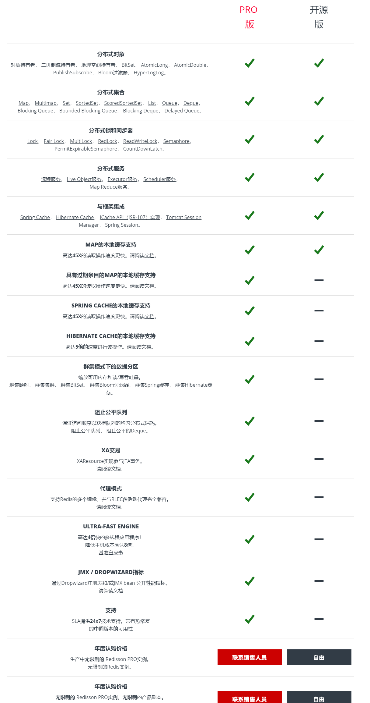

# 3.实战

## 1.最佳实践

### 1.1.Redis 和数据库双写一致性问题

一致性问题还可以再分为最终一致性和强一致性。数据库和缓存双写，就必然会存在不一致的问题。
- 前提是如果对数据有强一致性要求，不能放缓存。我们所做的一切，只能保证最终一致性。
- 另外，我们所做的方案从根本上来说，只能降低不一致发生的概率。因此，有强一致性要求的数据，不能放缓存。
- 首先，采取正确更新策略，先更新数据库，再删缓存。
- 其次，因为可能存在删除缓存失败的问题，提供一个补偿措施即可，例如利用消息队列。

### 1.2.如何应对缓存穿透和缓存雪崩问题

这两个问题，一般中小型传统软件企业很难碰到。如果有大并发的项目，流量有几百万左右，这两个问题一定要深刻考虑。
缓存穿透，即黑客故意去请求缓存中不存在的数据，导致所有的请求都怼到数据库上，从而数据库连接异常。

#### 1.2.1.缓存穿透解决方案

- 利用互斥锁，缓存失效的时候，先去获得锁，得到锁了，再去请求数据库。没得到锁，则休眠一段时间重试【double check】。
- 采用异步更新策略，无论 Key 是否取到值，都直接返回。Value 值中维护一个缓存失效时间，缓存如果过期，异步起一个线程去读数据库，更新缓存。
  需要做缓存预热(项目启动前，先加载缓存)操作。
- 提供一个能迅速判断请求是否有效的拦截机制，比如，利用布隆过滤器，内部维护一系列合法有效的 Key。
  迅速判断出，请求所携带的 Key 是否合法有效。如果不合法，则直接返回。
- Redis设置过期时间是-1，表示永不过期。这个时候开启一个定时任务，定时刷新缓存

#### 1.2.2.缓存雪崩解决方案
缓存雪崩，即缓存同一时间大面积的失效，这个时候又来了一波请求，结果请求都怼到数据库上，从而导致数据库连接异常。

针对异常情况可以使用服务降级、熔断、限流、多级缓存等
- 给缓存的失效时间，加上一个随机值，避免集体失效。
- 使用互斥锁，但是该方案吞吐量明显下降了。
- 多级缓存，比如我们有两个缓存，缓存 A 和缓存 B。缓存 A 的失效时间为 20 分钟，缓存 B 不设失效时间。自己做缓存预热操作。 然后细分以下几个小点：
  - 从缓存 A 读，有则直接返回；
  - A 没有数据，从 B  读数据，直接返回
  - B 没有数据，B异步启动一个更新线程，更新线程同时更新缓存 A 和缓存 B。

### 1.3.如何解决 Redis 的并发竞争 Key 问题

这个问题大致就是，同时有多个子系统去 Set 一个 Key。这个时候要注意什么呢？

如果对这个 Key 操作，不要求顺序。这种情况下，准备一个分布式锁，大家去抢锁，抢到锁就做 set操作即可，比较简单。

如果对这个 Key 操作，要求顺序。假设有一个 key1，系统 A 需要将 key1 设置为 valueA，系统 B 需要将 key1 设置为 valueB，系统 C 需要将 key1 设置为 valueC。

期望按照 key1 的 value 值按照 valueA > valueB > valueC 的顺序变化。这种时候我们在数据写入数据库的时候，需要保存一个时间戳。

假设时间戳如下：
- 系统 A key 1 {valueA 3:00}
- 系统 B key 1 {valueB 3:05}
- 系统 C key 1 {valueC 3:10}

那么，假设系统 B 先抢到锁，将 key1 设置为{valueB 3:05}。接下来系统 A 抢到锁，发现自己的 valueA 的时间戳早于缓存中的时间戳，
那就不做 set 操作了，以此类推。其他方法，比如利用队列，将 set 方法变成串行访问也可以。

### 1.4.性能测试

1.redis-benchmark可以为Redis做基准性能测试

[https://www.cnblogs.com/lxs1314/p/8399069.html](https://www.cnblogs.com/lxs1314/p/8399069.html)

```shell
$redis-benchmark -c 100 -n 20000 -r 10000

-c（clients）选项代表客户端的并发数量（默认是50）
-n（num）选项代表客户端请求总量（默认是100000）
-q选项仅仅显示redis-benchmark的requests per second信息
-P选项代表每个请求pipeline的数据量（默认为1）
-k选项代表客户端是否使用keepalive，1为使用，0为不使用，默认值为1
-t选项可以对指定命令进行基准测试。
--csv选项会将结果按照csv格式输出，便于后续处理，如导出到Excel
```

注意： 网络io的影响是非常大的。本地压测可能到3W QPS，通过局域网的话，可能降低到1.5W，再通过域名的话，可能只有7，8千了

2.使用Redis自动测试工具

由于AOF日志的重写对磁盘的压力较大，很可能会阻塞，如果需要使用到持久化，建议使用高速的固态硬盘作为日志写入设备。

推荐使用物理机部署Redis。由于虚拟机增加了虚拟化软件层，与物理机相比，虚拟机本身就存在性能的开销，可以使用如下命令来分别测试下物理机和虚拟机的基线性能：

```shell
redis-cli -h 127.0.0.1-p 6379 --intrinsic-latency 60


Max latency so far: 1 microseconds.  
Max latency so far: 2 microseconds.
Max latency so far: 7 microseconds.
Max latency so far: 14 microseconds.
Max latency so far: 18 microseconds.
Max latency so far: 23 microseconds.
Max latency so far: 85 microseconds.
Max latency so far: 951 microseconds.
Max latency so far: 1222 microseconds.
Max latency so far: 4038 microseconds.
Max latency so far: 4173 microseconds.
Max latency so far: 4315 microseconds. ## 1.测试过程中最大的响应时间

## 564199353 是 60s内所有的请求量
#  avg latency，平均响应时间
564199353 total runs (avg latency: 0.1063 microseconds / 106.35 nanoseconds per run).
Worst run took 40575x longer than the average latency.
```

3.性能监控
latency有三个选项，分别是--latency、--latency-history、--latency-dist。它们都可以检测网络延迟，对于Redis的开发和运维非常有帮助。

```shell
# 1.此时客户端B到redis的网络延迟：
redis-cli -h {machineB} --latency
min: 0, max: 1, avg: 0.07 (4211 samples)

# 2.latency-history
--latency的执行结果只有一条，如果想以分时段的形式了解延迟信息，可以使用--latency-history选项：
redis-cli -h 10.10.xx.xx --latency-history
min: 0, max: 1, avg: 0.28 (1330 samples) -- 15.01 seconds range …
min: 0, max: 1, avg: 0.05 (1364 samples) -- 15.01 seconds range

# 3.--latency-dist
# 该选项会使用统计图表的形式从控制台输出延迟统计信息
```

### 1.5.Redis中存在热key，存在单机的性能瓶颈

可能是C10K问题，也可能是CPU处理的问题，内存的问题

[https://www.cnblogs.com/rjzheng/p/10874537.html](https://www.cnblogs.com/rjzheng/p/10874537.html)

1. 采用多级缓存(将压力分散到应用服务)
2. 采用数据分片到多台机器上。按照一定的负载均衡算法进行请求分发
    - 使用代理 twemproxy
    - 使用Redis cluster

发现hot key的方法：按照经验预测、客户端收集（有赞方案）、使用代理收集（Twemproxy）

### 1.6.如果Redis中 value的大小是10KB，这个时候Redis有1000个并发的话，单机的Redis能够撑得住？

【大value问题】10Kb算是大value。单个服务器本地性能测试可能问题不是很大。

我们一般认为1KB的value就算是比较大的。1K的QPS，流量就是10KB*1000=9.8MB。带宽接近百兆带宽。
1K并发的话，QPS应该会更高，可能导致服务器网络拥堵，影响性能。

### 1.7.禁止批量的给key设置相同的过期时间
可能出现问题
- 缓存雪崩。大量流量达到数据库。
- Redis性能降低。Redis后台过期扫描过期的key。
- 删除的key过多后，Redis的内存碎片增多，触发内存整理，导致性能降低

因此开发中一定要禁止批量的给keys设置过期时间。

### 1.8.内存碎片

<p style="color:red;">怎么知道内存碎片高？</p>

使用 info memory 命令，查看 mem_fragmentation_ratio(内存碎片比率), 该值是 used_memory_rss / used_memory 的比值。

- mem_fragmentation_ratio < 1，说明 Redis 使用了虚拟内存，说明可能内存不够了，由于虚拟内存的媒介是磁盘，比内存速度要慢很多。
- mem_fragmentation_ratio 大于 1 但小于 1.5。这种情况是合理的。毕竟，内因的内存分配器是一定要使用的，分配策略都是通用的，不会轻易修改；而外因由
  Redis 负载决定，也无法限制。所以，存在内存碎片也是正常的。
- mem_fragmentation_ratio 大于 1.5 。这表明内存碎片率已经超过了 50%。一般情况下，这个时候，我们就需要采取一些措施来降低内存碎片率了。

<p style="color:red;">内存碎片高的原因？</p>
1. Redis通过jemalloc申请内存的时候，都是整块申请的，但是我们使用的时候，不一定全部使用，这部分没有使用的空间就是碎片。
2. 因为该redis主要是存储频繁更新的数据，redis会删除旧的数据，实际上，由于Redis释放了内存块，但内存分配器并没有返回内存给操作系统

解决方法：

- Redis 4 以前的版本，重启服务。
- Redis4版本之后，可以手动清理【阻塞式清理】： `memory purge`
- Redis4版本之后开始支持内存碎片的清理，默认情况下自动清理碎片的参数是关闭的。配置如下：

自动回收，可能导致服务暂时不可用，可以设置小点的扫描样本

```properties
# 碎片整理总开关
activedefrag yes

# Minimum amount of fragmentation waste to start active defrag
# 内存碎片达到多少的时候开启整理
active-defrag-ignore-bytes 100mb

# Minimum percentage of fragmentation to start active defrag
# 碎片率达到百分之多少开启整理
active-defrag-threshold-lower 10

# Maximum percentage of fragmentation at which we use maximum effort
# 碎片率小余多少百分比开启整理
active-defrag-threshold-upper 100

# Minimal effort for defrag in CPU percentage
active-defrag-cycle-min 25

# Maximal effort for defrag in CPU percentage
active-defrag-cycle-max 75
```

### 1.9.Redis在Linux系统的配置优化

[https://mp.weixin.qq.com/s/rBk3iGeJhDaGki7Vo5jLag](https://mp.weixin.qq.com/s/rBk3iGeJhDaGki7Vo5jLag)

### 1.10.开发小技巧

#### 1.10.1.Key的过期时间在重新设置值之后会被清除
已有的key，可以重新执行set命令，修改TTL

#### 1.10.2.设置 string 类型的值可以覆盖任何其他类型
比如list、hash、set、zset等类型的数据，可以使用set命令被string覆盖。其他的类型不可被修改

#### 1.10.3.Redis lists 基于 Linked Lists 实现
头尾操作极速，检索较慢，不要用list存大量数据并检索

#### 1.10.4.Redis 线上做Keys正则匹配
在线上使用keys命令，在业务集中的环境中，导致CPU飙升，引起所有请求卡住，等所有的请求都超时后，所有的请求流量全部挤压到了rds数据库中，使数据库产生了雪崩效应，发生了数据库宕机事件。

一条铁律： 线上Redis禁止使用Keys正则匹配操作

分析原因：
1. redis是单线程的，其所有操作都是原子的，不会因并发产生数据异常
2. 使用高耗时的Redis命令是很危险的，会占用唯一的一个线程的大量处理时间，导致所有的请求都被拖慢。（例如时间复杂度为O(N)的KEYS命令，严格禁止在生产环境中使用）

怎么禁用这些命令呢？ 就是在redis.conf中，在SECURITY这一项中，我们新增以下命令：
```shell
rename-command FLUSHALL ""
rename-command FLUSHDB ""
rename-command CONFIG ""
rename-command KEYS ""
```

另外，对于FLUSHALL命令，需要设置配置文件中appendonly no，否则服务器是无法启动

注意了，上面的这些命令可能有遗漏，大家可以查官方文档。除了Flushdb这类和redis安全隐患有关的命令意外，但凡发现时间复杂度为O(N)的命令，都要慎重，不要在生产上随便使用。
例如hgetall、lrange、smembers、zrange、sinter等命令，它们并非不能使用，但这些命令的时间复杂度都为O(N)，使用这些命令需要明确N的值，否则也会出现缓存宕机。

业内建议使用scan命令来改良keys和SMEMBERS命令

#### 1.10.5.redis 延长过期时间

方案1： 每次访问缓存的时候，都修改过期时间。缺点:性能差点，优点：实现简单

方案2： 借助key的监听事件。缺点: 逻辑较为复杂。

[https://www.jianshu.com/p/ecf6b458194c](https://www.jianshu.com/p/ecf6b458194c)

需要延迟过期时间的数据 set k1 v1 ex 1000, 同时设置一个辅助的数据：set key value ex 800

开启对过期k事件的监听，以发布订阅的方式，通知应用程序k1需要延迟时间了。（注意：生产是多实例环境，会有多个实例同时执行命令的）

#### 1.10.6.批量删除key

下面操作可以使用pipeline加速。redis 4.0已经支持key的异步删除，欢迎使用。

### 1.11.其他

<p style="color: red">如果不小心运行了flushall</p>
立即 shutdown nosave ,关闭服务器。然后 手工编辑aof文件, 去掉文件中的 “flushall ”相关行, 然后开启服务器,就可以导入回原来数据.

如果,flushall之后,系统恰好bgrewriteaof了,那么aof就清空了,数据丢失.

<p style="color: red">Slowlog 显示慢查询 注:多慢才叫慢?</p>
由slowlog-log-slower-than 10000 ,来指定,(单位是微秒)

<p style="color: red">服务器储存多少条慢查询的记录?</p>
由 slowlog-max-len 128 ,来做限制

### 1.12.性能问题排查思路

1. 问题发生的位置
   1. 业务系统。
      1. 流量过大
      2. 系统fullGc导致的卡顿
      3. 部分服务性能有问题等
   2. 网络。重点查看是否跨网络（比如跨VLAN、机房、地区），观察是否存在网络延迟和抖动
   3. Redis集群
      1. 基准测试
      2. 基本耗时工具
2. 慢日志
   1. 动态开启慢日志。慢日志是内存维护的队列，需要定时拉取（slowlog get），防止数据丢失
   2. 慢日志报表。不支持，需要我们自己开发。
      1.修改源码，输出慢日志到磁盘或者mq
      2.增加Redis proxy，在代理层进行收集
   3. 命令时间复杂度。尽量使用O(1)的命令（string结构），到程序中反序列化为对象
   4. 大key问题。
      1. 使用 strlen,llen等查看缓存的数据大小和长度
      2. 【不推荐，给的数据太笼统】使用 ./redis-cli --bigkeys -i 0.01 (内部通过scan的方式扫描，每次扫描0.01s)
      3. 使用redis-rdb-tools 将获得的rdb文件进行离线分析
      4. 删除大key，使用异步删除，unlink。拆分或者压缩数据。
      5. 延迟删除过期key。通过异步的方式定时扫描，开发配置：lazyfree-lazy-expire yes
3. 性能有规律下降
   1. 内存碎片整理。一般是由频繁的数据删除操作
   2. 大量key集中过期。消耗CPU去回收资源。可以设置过期时间的时候增加随机值
   3. 内存上限。消耗CPU去回收资源，拆分Redis
   4. 触发Rdb和aof的rewrite。
      1. 避免频繁写操作，会增加CPU和网络资源的消耗
      2. 尽量减少Redis内存的使用量，因为10G内存fork子进程需要copy 页表大概是20M，fork的时候是阻塞的，影响性能
   5. Linux大页优化。一般一个=4K，而huge是4M。在分配内存的时候随访分配的大了，但是复制和fork等操作的时候性能也影响了

## 2.扩展

### 2.1.Lua

菜鸟教程 lua教程： [https://www.runoob.com/lua/lua-tutorial.html](https://www.runoob.com/lua/lua-tutorial.html)

### 2.2.Stream

教程[https://www.runoob.com/redis/redis-stream.html](https://www.runoob.com/redis/redis-stream.html)

Stream 主要用于消息队列，Redis 本身是有一个 Redis 发布订阅 (pub/sub) 来实现消息队列的功能，但它有个缺点就是消息无法持久化，如果出现网络断开、Redis 宕机等，消息就会被丢弃。

Stream 提供了消息的持久化和主备复制功能，可以让任何客户端访问任何时刻的数据，并且能记住每一个客户端的访问位置，还能保证消息不丢失。

### 2.3.模块

以往我们想给 Redis 加个功能或类似事务的东西只能用 Lua 脚本，这个东西没有实现真正的原子性，另外也无法使用底层的 API，实质上比单纯的命令脚本提升有限。

Redis 4.0 终于加入了模块，暴露了必要的API，并且有自动内存管理（大大减轻编写负担），基于 C99（C++或者其它语言的 C 绑定接口当然也可以）。

官网： [https://redis.io/modules](https://redis.io/modules)

#### 2.3.1.模块加载

1.动态加载。在 redis-cli 中执行，注意这里 mymodule.so 是文件名

```shell
module load /path/mymodule/src/mymodule.so
```

基本语法

- module load /path/module.so [argv0] [argv1] # 客户端指令，加载模块，不需要重启redis，但是如果redis关闭后这个module需要重新加载
- module list # 列出所有模块
- module unload module #    卸载模块，模块名是函数中注册的名称，不是文件名

2.启动加载

```shell
redis-server --loadmodule /path/to/module/rejson.so
```

3.静态配置

redis.conf 配置文件，增加下面配置。后面可以加参数，这种方式需要重启redis

```shell
loadmoudule /path/module.so [argv0] [argv1]
```

#### 2.3.2.rejson

- 官方文档： [https://oss.redis.com/redisjson/](https://oss.redis.com/redisjson/)
- Java客户端：[https://github.com/RedisJSON/JRedisJSON](https://github.com/RedisJSON/JRedisJSON)
- 官网地址：[https://github.com/RedisJSON/RedisJSON](https://github.com/RedisJSON/RedisJSON)

RedisJSON是RedisLabs公司开发的一款用于扩展Redis的JSON处理模块，能够让Redis像处理其他类型键一样处理JSON格式的数据，相当于扩展了Redis的数据类型。

1.Redis版本要求

Redis 4.0以后提供了模块功能，能够让开发者基于开放的API来扩展Redis自身的功能，因此要想使用Redis的模块功能，至少要求Redis4.0及以上版本。

2.下载。RedisJSON托管于Github，因此我们可以直接下载其源码，如下所示：

```shell
git clone https://github.com/RedisLabsModules/rejson.git
```

3.编译

由于我们下载的是RedisJSON的源码，因此我们需要手动编译出Redis需要的模块库，这里需要说明一下，默认下载的master分支的代码，不知道是什么原因一直编译报错，这里我们使用
1.0分支的源码进行编译，如下所示：

```shell
cd rejson
git checkout 1.0
make
```

编译完成后，我们就可以在rejson/src目录下找到rejson.so文件了，这正是我们需要的。

4.加载模块

编译完成后，我们可以使用如下命令来加载模块，在redis-cli客户端中，如下所示：

```shell
module load /path/rejson/src/rejson.so
```

成功加载后返回 OK

#### 2.3.3.Bloom Filter

redis服务至少4.x版本及以上（4.x版本及以下装起来会很麻烦，需要使用lua脚本，不建议使用或者自己实现功能。
redis现在最稳定的最新版是6.x版本了，4.x版本还不用感觉跟不上时代科技的进步了吧）

需要安装布隆过滤器插件才能使用，这是Redis的可扩展module

[Redis 布隆（Bloom Filter）过滤器](https://blog.csdn.net/weixin_42073629/article/details/124080180)

```shell
# 语法
BF.ADD    users tom         ##--添加一个元素到布隆过滤器
BF.EXISTS users tom         ##--判断元素是否在布隆过滤器
BF.MADD   users tom pony    ##--添加多个元素到布隆过滤器
BF.MEXISTS users tom pony   ##--判断多个元素是否在布隆过滤器
```

## 3.桌面客户端

常见的8种客户端：[https://mp.weixin.qq.com/s/kIsosP_q1kRMurkqZd9nmg](https://mp.weixin.qq.com/s/kIsosP_q1kRMurkqZd9nmg)

- redis diskmanager：最好用的界面客户端。高版本为收费的，可使用破解版：rdm-2021.0.0.0.exe
- RedisInsight。官方GUI：
  - [https://docs.redis.com/latest/ri/](https://docs.redis.com/latest/ri/)
  - 安装教程：[https://mp.weixin.qq.com/s/YAubcaqSGy7f0hXp0HaSnQ](https://mp.weixin.qq.com/s/YAubcaqSGy7f0hXp0HaSnQ)
- cachecloud

市面上开源的比较好的是CacheCloud ：[https://github.com/sohutv/cachecloud](https://github.com/sohutv/cachecloud)

CacheCloud是一个Redis云管理平台：支持Redis多种架构(Standalone、Sentinel、Cluster)高效管理、有效降低大规模redis运维成本，
提升资源管控能力和利用率。平台提供快速搭建/迁移，运维管理，弹性伸缩，统计监控，客户端整合接入等功能。

cachecloud 使用几个月的情况与坑：[https://my.oschina.net/superwen/blog/1935011](https://my.oschina.net/superwen/blog/1935011)

## 4.程序客户端

案例：

- [https://gitee.com/luckSnow/spring-boot-example/tree/master/lab_020_redis_jedis](https://gitee.com/luckSnow/spring-boot-example/tree/master/lab_020_redis_jedis)
- [https://gitee.com/luckSnow/spring-boot-example/tree/master/lab_021_redis_redisson](https://gitee.com/luckSnow/spring-boot-example/tree/master/lab_021_redis_redisson)
- [https://gitee.com/luckSnow/spring-boot-example/tree/master/lab_022_redis_lettuce](https://gitee.com/luckSnow/spring-boot-example/tree/master/lab_022_redis_lettuce)
- redis客户端redisson实战：[https://blog.csdn.net/zilong_zilong/article/details/78252037](https://blog.csdn.net/zilong_zilong/article/details/78252037)

### 4.1.Jedis

在使用pool的时候要注意，jedis提供两个pool：

- JedisPool
- ShardedJedisPool。数据量大的时候使用，ShardedJedis是基于一致性哈希算法实现的分布式Redis集群客户端

jedis底层使用的tcp协议的socket与redis服务器进行数据交互，交互协议是Resp，最终jedis会将数据转为byte[]以io流进行交互

Jedis的使用方式基本与命令行的方式一致

### 4.2.Redission

#### 4.2.1.介绍

Redisson是架设在Redis基础上的一个Java驻内存数据网格（In-Memory DataGrid）。【Redis官方推荐】

Redisson在基于NIO的Netty框架上，充分的利用了Redis键值数据库提供的一系列优势，在Java实用工具包中常用接口的基础上，为使用者提供了一系列具有分布式特性的常用工具类。使得原本作为协调单机多线程并发程序的工具包获得了协调分布式多机多线程并发系统的能力，大大降低了设计和研发大规模分布式系统的难度。同时结合各富特色的分布式服务，更进一步简化了分布式环境中程序相互之间的协作。

兼容 Redis 2.6+ and JDK 1.6+，使用Apache License 2.0授权协议。

注意： redisson.shutdown(); 关闭Redisson客户端连接，服务关闭的时候使用，平常使用Redisson不需要关闭资源
创建连接的时候非常消耗时间

#### 4.2.2.特性

云Redis管理、多样Redis配置支持、丰富连接方式、分布式对象、分布式集合、分布式锁、分布式服务、多种序列化方式、三方框架整合、完善工具等。

1. 支持云托管服务模式（同时支持亚马逊云的ElastiCache Redis和微软云的Azure Redis Cache）:
   - 自动发现主节点变化
2. 支持Redis集群模式（同时支持亚马逊云的ElastiCache Redis Cluster和微软云的Azure Redis Cache）:
   - 自动发现主从节点
   - 自动更新状态和组态拓扑
   - 自动发现槽的变化
3. 支持Redis哨兵模式:
   - 自动发现主、从和哨兵节点
   - 自动更新状态和组态拓扑
4. 支持Redis主从模式
5. 支持Redis单节模式
6. 多节点模式均支持读写分离：从读主写，主读主写，主从混读主写
7. 所有对象和接口均支持异步操作
8. 自行管理的弹性异步连接池
9. 所有操作线程安全
10. 支持LUA脚本
11. 提供分布式对象
    - 通用对象桶（Object Bucket）、二进制流（Binary Stream）、地理空间对象桶（Geospatial Bucket）、BitSet、
      原子整长形（AtomicLong）、原子双精度浮点数（AtomicDouble）、话题（订阅分发）、布隆过滤器（Bloom Filter）和基数估计算法（HyperLogLog）
12. 提供分布式集合
    - 映射（Map）、多值映射（Multimap）、集（Set）、列表（List）、有序集（SortedSet）、计分排序集（ScoredSortedSet）、
      字典排序集（LexSortedSet）、列队（Queue）、双端队列（Deque）、阻塞队列（Blocking Queue）、
      有界阻塞列队（Bounded Blocking Queue）、阻塞双端列队（Blocking Deque）、阻塞公平列队（Blocking Fair Queue）、
      延迟列队（Delayed Queue）、优先队列（Priority Queue）和优先双端队列（Priority Deque）
13. 提供分布式锁和同步器
    - 可重入锁（Reentrant Lock）、公平锁（Fair Lock）、联锁（MultiLock）、红锁（RedLock）、读写锁（ReadWriteLock）、
      信号量（Semaphore）、可过期性信号量（PermitExpirableSemaphore）和闭锁（CountDownLatch）
14. 提供分布式服务
    - 分布式远程服务（Remote Service, RPC）、分布式实时对象（Live Object）服务、分布式执行服务（Executor Service）、
      分布式调度任务服务（Scheduler Service）和分布式映射归纳服务（MapReduce）
15. 支持Spring框架
16. 提供Spring Cache集成
17. 提供Hibernate Cache集成
18. 提供JCache实现
19. 提供Tomcat Session Manager
20. 提供Spring Session集成
21. 支持异步流方式执行操作
22. 支持Redis管道操作（批量执行）
23. 支持安卓（Andriod）系统
24. 支持断线自动重连
25. 支持命令发送失败自动重试
26. 支持OSGi
27. 支持采用多种方式自动序列化和反序列化（Jackson JSON,Avro,Smile,CBOR,MsgPack,Kryo,FST,LZ4,Snappy和JDK序列化）
28. 超过1000个单元测试

#### 4.2.3.与jedis对比

Jedis是Redis的Java实现的客户端，其API提供了比较全面的Redis命令的支持；
Redisson实现了分布式和可扩展的Java数据结构，和Jedis相比，功能更加具体。
Redisson的宗旨是促进使用者对Redis的关注分离，从而让使用者能够将精力更集中地放在处理业务逻辑上。
Jedis中的方法调用是比较底层的暴露的Redis的API，也即Jedis中的Java方法基本和Redis的API保持着一致，
了解Redis的API，也就能熟练的使用Jedis。而Redisson中的方法则是进行比较高的抽象，每个方法调用可能进行了一个或多个Redis方法调用。

##### 4.2.3.1.编程模型

jedis是面向过程，Redisson是面向对象

##### 4.2.3.2.可伸缩性

Jedis使用阻塞的I/O，且其方法调用都是同步的，程序流需要等到sockets处理完I/O才能执行，不支持异步。
Jedis客户端实例不是线程安全的，所以需要通过连接池来使用Jedis。

Redisson使用非阻塞的I/O和基于Netty框架的事件驱动的通信层，其方法调用是异步的。
Redisson的API是线程安全的，所以可以操作单个Redisson连接来完成各种操作。

##### 4.2.3.3.数据结构

Jedis仅支持基本的数据类型如：String、Hash、List、Set、Sorted Set。

Redisson不仅提供了一系列的分布式Java常用对象，基本可以与Java的基本数据结构通用，还提供了许多分布式服务。

在分布式开发中，Redisson可提供更便捷的方法。

##### 4.2.3.4.第三方框架整合

- Redisson提供了和Spring框架的各项特性类似的，以Spring XML的命名空间的方式配置RedissonClient实例和它所支持的所有对象和服务；
- Redisson完整的实现了Spring框架里的缓存机制；
- Redisson在Redis的基础上实现了Java缓存标准规范；
- Redisson为Apache Tomcat集群提供了基于Redis的非黏性会话管理功能。该功能支持Apache Tomcat的6、7和8版。
- Redisson还提供了Spring Session会话管理器的实现。

#### 4.2.4.版本区别

Redisson是一个基于java编程框架netty进行扩展了的redis，想了解Redisson源码首先你必须熟悉netty网络编程框架。

Redisson目前分开源版本和商业版(Redisson PRO),所以选择的时候请谨慎。
（Map）和集（Set）数据分片功能仅限于Redisson PRO版本才有，另外Redis部署工具和集群管理工具功能仅限于Redisson PRO版本才有。

关于商业版和开源版本的区别和商业版收费标准详见官网：[https://redisson.pro/](https://redisson.pro/)



#### 4.2.5.使用

1. 支持Redis多种连接模式
   1. 集群模式
   2. 单例模式
   3. 哨兵模式
   4. 主从模式
2. Redisson支持自动重试策略，默认是重试3次，间隔为1000ms。除了支持同步操作外，还支持异步方式和响应方式。
3. 多种序列号方式
   - org.redisson.codec.JsonJacksonCodec
   - org.redisson.codec.CborJacksonCodec
   - org.redisson.codec.MsgPackJacksonCodec
   - org.redisson.codec.KryoCodec
   - org.redisson.codec.SerializationCodec
   - org.redisson.codec.FstCodec
   - org.redisson.codec.LZ4Codec
   - org.redisson.codec.SnappyCodec
   - org.redisson.client.codec.StringCodec
   - org.redisson.client.codec.LongCodec
4. 分布式对象
   - 分布式Object。RBucket
   - 分布式BitSet。RBitSet
   - 分布式Lock。RLock
   - 分布式MultiLock。RedissonMultiLock
   - 分布式ReadWriteLock。RReadWriteLock
   - 分布式Semaphore。RSemaphore
   - 分布式AtomicLong。RAtomicLong
   - 分布式AtomicDouble。RAtomicDouble
   - 分布式CountDownLatch。RCountDownLatch
   - Topic。RTopic
5. 分布式集合
   - 分布式Map
   - Map eviction。现在Redis没有过期清空Map中的某个entry的功能，只能是清空Map所有的entry。Redission提供了这种功能。
   - 分布式Set。除此之外还有，还支持Set eviction， SortedSet, ScoredSortedSet, LexSortedSet
   - 分布式List
   - 分布式Blocking Queue。除此之外，还支持Queue, Deque, Blocking Deque
   - 执行批量命令

### 4.3.RedisTempate

教程：

- RedisTemplate操作Redis，这一篇文章就够了（一）：[https://blog.csdn.net/lydms/article/details/105224210](https://blog.csdn.net/lydms/article/details/105224210)
- RedisTemplate操作Redis，这一篇文章就够了（二）：[https://blog.csdn.net/lydms/article/details/105512006](https://blog.csdn.net/lydms/article/details/105512006)
- RedisTemplate操作Redis，这一篇文章就够了（三）：[https://blog.csdn.net/lydms/article/details/106068364](https://blog.csdn.net/lydms/article/details/106068364)
- RedisTemplate方法详解：[https://www.cnblogs.com/dw3306/p/12840012.html](https://www.cnblogs.com/dw3306/p/12840012.html)
- RedisTempate底层是对默认使用lettuce（也是对Redis采用面向对象的设计）。我们也可以剔除lettuce，使用jedis作为RedisTempate的底层实现。

### 4.4.Redis使用案例

#### 4.4.1.高并发限流

案例是 redis+lua 的方案，整合到springboot项目中实现的限流

优点
1. 响应速度快，使用简单方便，侵入性少
2. 做到了分布式系统中方法级别的控制
3. 做到对单个方法限制到不同ip的限制

存在的问题
1. 使用redis string 类型操作。当用户量非常大的时候，不适合使用本方案。
2. 限制次数到达之后，向外抛出异常。暂时没有提供阻塞式的响应，体验不好

### 4.5.分布式锁

#### 4.5.1.实现方式有哪些？

- 使用set key nx px。【主要使用方式和面试考察点】
- 使用Redisson提供的分布式锁，RLock。
- Redis作者提过的一致性强的 RedLock（多个集群都加锁）

#### 4.5.1.Redis分布式锁需要注意什么

1. 设置过期时间，且需要在一条命令中执行。为什么这样？防止异常退出后，后续程序无法解锁。合成合成一个命令也是这个问题
2. value设置一个唯一值，什么这样？
   A线程获得锁后执行时间长，锁失效了。B线程获得锁成功，这时候锁是B线程的。之后A执行完了，删除的时候将B获得的锁删除了，这个场景其实就是锁存在失效的情况。
3. 对没有获得锁的逻辑进行控制，自旋重试或者定时重试等
4. master上锁后，没有同步slave就宕机了，slave切换成master后没有锁信息，导致锁失效。

#### 4.5.2.RedLock

- RedLock 

[基于Redis的分布式锁和Redlock算法](https://zhuanlan.zhihu.com/p/101216704?utm_source=wechat_session&utm_medium=social&utm_oi=847183261330460672)

这样虽然对于性能带来了损坏，但是lock的可靠性极大的提高了。 文中提到的多个节点，可以理解为多个哨兵集群，多个cluster集群。因为在一个集群中实现的redlock会更加复杂。

- Redis分布式锁高级实现方案--基于Redisson，使用hash类型，在lua脚本原子性操作的基础上实现的。

[https://www.cnblogs.com/AnXinliang/p/10019389.html](https://www.cnblogs.com/AnXinliang/p/10019389.html)

[http://ifeve.com/慢谈-redis-实现分布式锁-以及-redisson-源码解析](http://ifeve.com/慢谈-redis-实现分布式锁-以及-redisson-源码解析)

Redisson 默认的 CommandExecutor 实现是通过 eval 命令来执行 Lua 脚本，所以要求 Redis 的版本必须为 2.6 或以上，
否则可能要自己来实现。使用netty做通讯，jedis使用的是socket  

Redisson 实现了分布式的公平/非公平锁、可重入、联锁、红锁、信号量。

Redlock，红锁，也就是 Redis Distributed Lock，就是我们平时说的分布式锁。

[https://www.cnblogs.com/rgcLOVEyaya/p/RGC_LOVE_YAYA_1003days.html](https://www.cnblogs.com/rgcLOVEyaya/p/RGC_LOVE_YAYA_1003days.html)

还是推荐使用Redis的高级客户端工具，redission

是官方提供的分布式锁实现方案
[https://mp.weixin.qq.com/s/cNFwL8Y-FJcemyvmw9fmDA](https://mp.weixin.qq.com/s/cNFwL8Y-FJcemyvmw9fmDA)

#### 4.5.3.分布式锁是将并发转为串行话，当并发高到一定程度性能会急剧降低

在不考虑服务器性能、网络的前提下。可以参考 concurrentHashMap 旧的实现方式，采用分段保存。

比如商品有100个，分成10组，key=goods:group:0 到 goods:group:9。根据一定规则采用hash的方式，将数据定位到某个key上，进行商品库存的预减

如果商品下单的时候数量大于某个组的剩余，则需要开始遍历的去获得锁，直到获得需要的数据量时。

#### 4.5.4.使用分布式锁的时候，如果这个线程突然阻塞了。怎么办？

方式1：阻塞了之后，防止锁过期后，被别的线程获得锁。
- 新增延时任务【看门狗】，延迟分布式锁的过期时间，期望线程还能恢复。
- 新增延时任务【看门狗】，提前缓存正在使用分布式锁的线程，通过定时任务扫描线程状态，如果出现上时间的block状态，就调用intupter线程，强制唤醒。
[https://blog.csdn.net/weixin_33943347/article/details/88009397](https://blog.csdn.net/weixin_33943347/article/details/88009397)

方式2：通过自己实现线程的监控管理，及时发现问题线程，进行相应的处理， 比如，重启服务器，强制停止线程等方式。
注意：锁的粒度尽可能的小一点，防止出现阻塞导致大的影响。

#### 4.5.5.秒杀场景，商品超卖

[https://mp.weixin.qq.com/s/PSoVaY9sSf3-07ls0oxm2w](https://mp.weixin.qq.com/s/PSoVaY9sSf3-07ls0oxm2w)

方案是在操作时进行一次原子性的校验，性能上比开一个线程给key续时间好些。

## 6.监控

Redis监控指标： [https://mp.weixin.qq.com/s/c_98OwT84tST15i86JRWKA](https://mp.weixin.qq.com/s/c_98OwT84tST15i86JRWKA)

腾讯云的Redis监控指标：[https://cloud.tencent.com/document/product/248/49729](https://cloud.tencent.com/document/product/248/49729)

Redis监控指标：[https://pinocc.cn/2020/04/05/redis-监控的关键指标](https://pinocc.cn/2020/04/05/redis-监控的关键指标)
