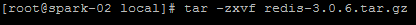
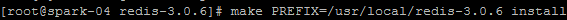
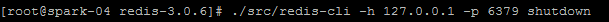
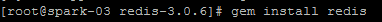
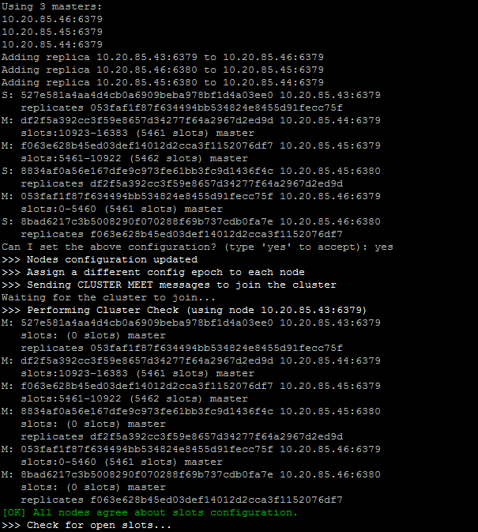
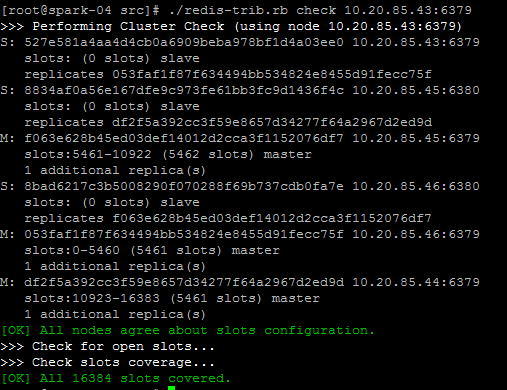
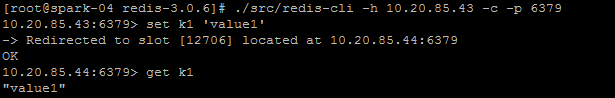

# redis集群部署手册

## 1.Redis下载安装

1.  官方站点: redis.io
    下载最新版或者最新stable版（redis只有3.0以上的版本开始支持集群），这里我们下载的是：redis-3.0.6.tar.gz，将压缩包存放在每个服务器的目录是：/usr/local

2.  解压源码；

3、进入到redis目录，编译源码 (如果是32位机器 make 32bit)；

4.  安装redis到指定的目录（PREFIX要大写）；

    

    5、启动redis（末尾使用&，是为了进行后台运行）

    

    6、停止redis（6379为redis设置的端口号）

    

## 2.集群搭建

这里是以4台物理机搭建redis集群，最终搭建成3个master节点，3个slave节点的6节点redis集群（redis集群搭建要求）。

1.  创建节点配置文件

10.20.85.43执行命令：

cp redis.conf node1.conf

10.20.85.44执行命令：

cp redis.conf node2.conf

10.20.85.45执行命令：

cp redis.conf node3.conf

cp redis.conf node4.conf

10.20.85.46执行命令：

cp redis.conf node5.conf

cp redis.conf node6.conf

1.  修改配置信息

（1）redis后台运行：daemonize yes

（2）pidfile文件对应：pidfile /var/run/redis_6379.pid
（注意：这里的6379应该与redis节点的端口保持一致）。

（3）redis端口：port 7000

（4）开启集群，把注释#去掉：cluster-enabled yes

（5）集群的配置，cluster-config-file
nodes_6379.conf（注意：这里的6379应该与redis节点的端口保持一致）。

（6）请求超时，设置5秒：cluster-node-timeout 5000

（7）aof日志开启：appendonly yes

（8）绑定当前服务器的IP：bind 10.20.85.43

注意：

10.20.85.43 redis节点端口为：6379；

10.20.85.44 redis节点端口为：6379；

10.20.85.45 redis节点端口为：6379 和 6380；

10.20.85.46 redis节点端口为：6379 和 6380；

1.  在各自的安装目录下启动所有的节点：

10.20.85.43 执行命令：

./src/redis-server node1.conf

10.20.85.44 执行命令：

./src/redis-server node2.conf

10.20.85.45 执行命令：

./src/redis-server node3.conf

./src/redis-server node4.conf

10.20.85.46 执行命令：

./src/redis-server node5.conf

./src/redis-server node6.conf

1.  查看是否启动成功

    ps -ef | grep redis #查看是否启动成功

    netstat -tnlp | grep redis
    #可以看到redis监听端口

2.  安装ruby运行环境

（之前redis节点已经准备好了，但是要将redis串联起来就得需要redis的一个工具：redis-trib.rb）

1.  gem命令安装redis接口（gem是ruby的一个工具包）

注意：如果命令无法执行或执行异常，则需要手动下载并安装。

下载路径：https://rubygems.global.ssl.fastly.net/gems/redis-3.0.6.gem

执行安装命令：

7.redis cluster管理工具redis-trib.rb

redis-trib.rb是redis官方推出的管理redis集群的工具，集成在redis的源码src目录下，是基于redis提供的集群命令封装成简单、便捷、实用的操作工具。

1.  修改redis-trib.rb执行权限:

1.  创建集群（在其中一个redis-master节点执行命令即可）

执行命令：./redis-trib.rb create --replicas 2 10.20.85.43:6379
10.20.85.44:6379 10.20.85.45:6379 10.20.85.45:6380 10.20.85.46:6379
10.20.85.46:6380

在运行过程中会提示：Can I set the above configuration? (type 'yes' to
accept): 输入yes即可。

注意：

--replicas 1 表示自动为每个master节点分配一个slave节点；

防火墙一定要开放监听的端口，否则会创建失败。

（3）检验集群

在各自计算机中执行：./redis-trib.rb check
10.20.85.43:6379。如下就是启动正常的界面，出现的信息是各个redis节点的信息

4.  更多redis集群管理命令

参考：http://blog.csdn.net/huwei2003/article/details/50973967

（5）集群示意图。

根据集群创建时的信息可以知道：redis集群的master节点是46、45、44服务器6379端口的redis节点。

目前搭建的redis集群示意图如下：

8. Redis集群原理

Redis
cluster在设计的时候，就考虑到了去中心化，去中间件，也就是说，集群中的每个节点都是平等的关系，都是对等的，每个节点都保存各自的数据和整个集群的状态。每个节点都和其他所有节点连接，而且这些连接保持活跃，这样就保证了我们只需要连接集群中的任意一个节点，就可以获取到其他节点的数据。

Redis
集群没有并使用传统的一致性哈希来分配数据，而是采用另外一种叫做哈希槽
(hash slot)的方式来分配的。redis cluster 默认分配了 16384
个slot，当我们set一个key
时，会用CRC16算法来取模得到所属的slot，然后将这个key
分到哈希槽区间的节点上，具体算法就是：CRC16(key) %
16384。所以我们在测试的时候看到set 和 get
的时候，直接跳转到了7000端口的节点。

Redis 集群会把数据存在一个 master 节点，然后在这个 master
和其对应的salve
之间进行数据同步。当读取数据时，也根据一致性哈希算法到对应的 master
节点获取数据。只有当一个master 挂掉之后，才会启动一个对应的 salve
节点，充当 master 。

需要注意的是：必须要3个或以上的主节点，否则在创建集群时会失败，并且当存活的主节点数小于总节点数的一半时，整个集群就无法提供服务了。

9.使用集群

使用命令连接到任意一个redis节点：

./redis-cli -h 10.20.85.43 -c -p 6379

这里比之前的连上redis多了一个参数：-c，-c表示这次连接到集群上，否则，无法正常使用集群。

如下是连接到集群的使用范例：

