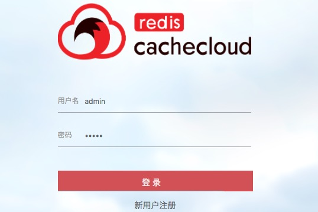
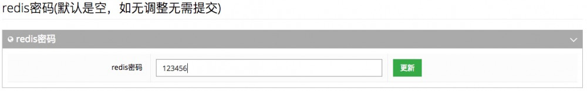

# 集群管理平台CacheCloud

#### 0.0.1.**一、CacheCloud是什么？**

最近在使用CacheCloud管理Redis，所以简单说一下，这里主要说一下我碰到的问题。CacheCloud官网从安装到使用文档非常详细了。

CacheCloud提供一个Redis云管理平台：实现多种类型(**Redis
Standalone**、**Redis Sentinel**、**Redis
Cluster**)自动部署、解决Redis实例碎片化现象、提供完善统计、监控、运维功能、减少运维成本和误操作，提高机器的利用率，提供灵活的伸缩性，提供方便的接入客户端。

具体看GitHub：https://github.com/sohutv/cachecloud

#### 0.0.2.**二、源码安装CacheCloud**

我这里使用的是最新版CacheCloud，支持客户端密码的。系统使用的是CentOS
7，Redis使用的是3.2版本。

**1. 下载CacheCloud**

  --- -------------------------------------------------------
  1   $ git clone https://github.com/sohutv/cachecloud.git
  --- -------------------------------------------------------

**2. 准备MySQL数据库**

MySQL 5.7多方式安装

**3. 安装Java环境**

不要使用openJdk，需要使用Oracle提供的JDK，确保jdk
1.7+，去Oracle官网下载二进制版本。

  --- -----------------------------------------------------
  1   $ tar xvf jdk-8u141-linux-x64.tar.gz -C /usr/local
      
  2   $ ln -sv /usr/local/jdk1.8.0_141/ /usr/local/jdk
  --- -----------------------------------------------------

提供环境变量

  --- ----------------------------------------------------------------------
  1   $ cat /etc/profile.d/jdk.sh
      
  2   #!/bin/bash
      
  3   export JAVA_HOME=/usr/local/jdk
      
  4   export JRE_HOME=/usr/local/jdk/jre
      
  5   export PATH=$PATH:$JAVA_HOME/bin
      
  6   export CLASSPATH=$JAVA_HOME/jre/lib/ext:$JAVA_HOME/lib/tools.jar
  --- ----------------------------------------------------------------------

查看Java版本

  --- ------------------------------------------------------------------
  1   $ source /etc/profile.d/jdk.sh
      
  2   $ java -version
      
  3   java version "1.8.0_141"
      
  4   Java(TM) SE Runtime Environment (build 1.8.0_141-b15)
      
  5   Java HotSpot(TM) 64-Bit Server VM (build 25.141-b15, mixed mode)
  --- ------------------------------------------------------------------

**4. 初始化CacheCloud数据**

导入项目中cachecloud.sql初始化库表结构，默认插入admin超级管理员。

由于MySQL
5.7使用了严格SQL模式，会导致cachecloud.sql导入报错的，所以直接取消SQL模式即可（最好也修改一下my.cnf配置文件）。

  --- -------------------------------------
  1   mysql> set global sql_mode='';
      
  2   mysql> set session sql_mode='';
  --- -------------------------------------

创建字符集为utf8的数据库并导入数据

  --- ----------------------------------------------------------
  1   mysql> create database cachecloud charset utf8;
      
  2   mysql> use cachecloud;
      
  3   mysql> source /root/cachecloud/script/cachecloud.sql;
  --- ----------------------------------------------------------

创建CacheCloud连接用户

  --- ----------------------------------------------------------------------------
  1   mysql> grant all on *.* to 'admin'@'localhost' identified by 'admin';
      
  2   mysql> grant all on *.* to 'admin'@'127.0.0.1' identified by 'admin';
      
  3   mysql> flush privileges;
  --- ----------------------------------------------------------------------------

**5.CacheCloud项目配置**

CacheCloud使用了maven作为项目构建的工具，所以先按照maven。

  --- ----------------------
  1   $ yum install maven
  --- ----------------------

CacheCloud提供了local.properties和online.properties两套配置作为测试、线上的隔离。属性配置说明：

  ------------------------ ------------------------------- -----------------------------------------
  **属性名**               **说明**                        **示例**
  cachecloud.db.url        mysql驱动url                    jdbc:mysql://127.0.0.1:3306/cache-cloud
  cachecloud.db.user       mysql用户名                     admin
  cachecloud.db.password   mysql密码                       admin
  web.port                 spring-boot内嵌tomcat启动端口   测试9999,线上8585(可修改)
  ------------------------ ------------------------------- -----------------------------------------

下面可以修改local.properties和online.properties这两套配置了，改成如下配置即可：

  ---- --------------------------------------------------------------------------------------------------------
  1    $ cat /root/cachecloud/cachecloud-open-web/src/main/swap/{online.properties,local.properties}
       
  2    cachecloud.db.url = jdbc:mysql://127.0.0.1:3306/cachecloud?useUnicode=true&amp;characterEncoding=UTF-8
       
  3    cachecloud.db.user = admin
       
  4    cachecloud.db.password = admin
       
  5    cachecloud.maxPoolSize = 20
       
  6    
       
  7    isClustered = true
       
  8    isDebug = false
       
  9    spring-file=classpath:spring/spring-online.xml
       
  10   log_base=/opt/cachecloud-web/logs
       
  11   web.port=8585
       
  12   log.level=WARN
  ---- --------------------------------------------------------------------------------------------------------

这里就是用来设置数据库连接，以及web端口的，可自行修改。但是一定注意cachecloud.db.user参数，用户名不能有多余的空格，不然后面会一直报连接不上数据库。使用vim编辑器编辑用户时行尾可能会多出一个空格，记得去掉，多移动几次光标看看是否有空格（我就在这里坑了很久）。

另外设置**“cachecloud?useUnicode=true&amp;characterEncoding=UTF-8″**是用来支持中文的，记得一定与数据库字符集一样哦，都是UTF8。又有一点要注意的就是对于自己编译的CacheCloud，这里的”&amp;”不是乱码，就是这样的，会被转义为&符号。如果是使用二进制版本的，这里就需要写成**“cachecloud?useUnicode=true&characterEncoding=UTF-8″**才行。

完事后就可以使用maven编译了。

**6. 开始编译CacheCloud生成war包**

**6.1 本地启动**

- 在cachecloud根目录下运行

  --- -----------------------------------
  1   mvn clean compile install -Plocal
  --- -----------------------------------

- 在cachecloud-open-web模块下运行

  --- ---------------------
  1   mvn spring-boot:run
  --- ---------------------

本地启动CacheCloud，如果没有问题，此时9999端口就会打开，可以使用浏览器访问了（注意安装maven时会安装openjdk）。

**6.2 生产部署**

- 在cachecloud根目录下运行

  --- ------------------------------------
  1   mvn clean compile install -Ponline
  --- ------------------------------------

执行完成后，就可以执行script/deploy.sh脚本开始部署了。这个脚本会：

- 拷贝war包(cachecloud-open-web/target/cachecloud-open-web-1.0-SNAPSHOT.war)到/opt/cachecloud-web下；

- 拷贝配置文件(cachecloud-open-web/src/main/resources/cachecloud-web.conf)到/opt/cachecloud-web下，并改名为cachecloud-open-web-1.0-SNAPSHOT.conf（spring-boot要求，否则配置不生效）；

- 拷贝start.sh和stop.sh脚本到/opt/cachecloud-web目录下。

执行deploy.sh脚本：

  --- --------------------------------------------------
  1   $ bash /root/cachecloud/script/deploy.sh /root/
  --- --------------------------------------------------

后面是跟上cachecloud源码所在的目录，我这里是在/root下。

安装maven时会安装openjdk，会导致跟你安装的oracle
jdk有冲突，所以编译完CacheCloud后可以卸载openjdk。

  --- ------------------------------------
  1   $ yum remove java-1.8.0-openjdk*
      
  2   $ source /etc/profile.d/jdk.sh
  --- ------------------------------------

**7. 启动CacheCloud**

  --- -----------------------------------------------------
  1   $ bash /opt/cachecloud-web/start.sh
      
  2   Starting the cachecloud ....OK!
      
  3   PID: 18785
      
  4   STDOUT: /opt/cachecloud-web/logs/cachecloud-web.log
  --- -----------------------------------------------------

Java启动有点慢，没有什么问题过会就可以看到8585端口的启动了。

如果你使用的是openjdk，启动时很有可能会报这个错误：

  --- -----------------------------------------------------------
  1   Unrecognized VM option 'UnlockCommercialFeatures'
      
  2   Error: Could not create the Java Virtual Machine.
      
  3   Error: A fatal exception has occurred. Program will exit.
  --- -----------------------------------------------------------

我也测试过openjdk，报什么参数错误去掉不用就可以了。

没什么问题就登录CacheCloud的了，输入默认的用户名admin和密码admin即可。

#### 0.0.3.**三、二进制版本安装CacheCloud**

二进制版本比较简单，做好如下几步即可：

1. 初始化好cachecloud.sql

2. 安装好Java

然后下载对应release版本的环境，例如1.2，将其在/opt下解压，解压后文件目录如下

- cachecloud-open-web-1.0-SNAPSHOT.war: cachecloud war包

- cachecloud.sql: 数据库schema，默认数据名为cache_cloud，可以自行修改

- jdbc.properties：jdbc数据库配置，自行配置

- start.sh：启动脚本

- stop.sh： 停止脚本

- logs：存放日志的目录

二进制版本相对比较简单，也没有什么好说的，同样也是对于jdbc.properites文件中数据库的用户名空格需要注意，配置如下：

  --- ------------------------------------------------------------------------------------------------------
  1   $ cat /opt/cachecloud-web/jdbc.properties
      
  2   cachecloud.db.url = jdbc:mysql://127.0.0.1:3306/cache_cloud?useUnicode=true&characterEncoding=UTF-8
      
  3   cachecloud.db.user = admin
      
  4   cachecloud.db.password = admin
      
  5   cachecloud.maxPoolSize = 20
      
  6   jdbc.driver = com.mysql.jdbc.Driver
      
  7   jdbc.validationQuery = select 1 from dual
  --- ------------------------------------------------------------------------------------------------------

这里就把“&amp;”缓存“&”了，不然会报错，这是我测试下来的结果，可能你下载时版本不同了，问题也不一定有了。然后就可以启动了，默认端口是8585，可以修改start.sh中的server.port进行重置。

最后对于CacheCloud部署使用常见问题，去https://cachecloud.github.io里面看即可。

#### 0.0.4.**四、CacheCloud使用实例**

首先在客户端执行cachecloud/script/cachecloud-init.sh初始化脚本，这个脚本默认会下载redis
3.0版本（你下载的不知道会不会变啊）。我这里要使用redis
3.2版本，所以修改一下脚本。

  --- ---------------------------------------
  1   $ bash cachecloud-init.sh cachecloud
  --- ---------------------------------------

创建一个系统用户cachecloud，我这里密码也是cachecloud，这是CacheCloud默认的用户和密码。当然你也可以自行修改，但是需要所有机器都统一，另外需要在CacheCloud后台系统配置中改好。

由于我使用的是Redis
3.2版本，从这个版本开始提供了protected-mode(虽然比较鸡肋)和默认只监听本地回环地址，而且它是默认开启的，所以在使用CacheCloud部署时，需要修改Redis配置模板管理中的添加新配置：

  --- -------------------
  1   protected-mode no
      
  2   bind 0.0.0.0
  --- -------------------

针对Sentinal和Cluster模板也需要关闭protected-mode参数。

然后就可以进行添加如下操作了：

1、后台添加主机

2、前台申请应用

3、后台部署应用

如果你需要部署带密码的，在部署应用时填写这个实例的密码，然后点击更新即可。

#### 0.0.5.**五、相关表结构说明**

在CacheCloud中，每个应用都会有一个唯一ID（app_id），这个ID会从1000开始自增长。另外，Redis相关实例的端口号也是会从6379开始自增长。所以了解一下相关表的作用还是有用的。

  ---- ---------------------------------------------------
  1    # Quartz定时任务相关的表;
       
  2    QRTZ_BLOB_TRIGGERS
       
  3    QRTZ_CALENDARS
       
  4    QRTZ_CRON_TRIGGERS
       
  5    QRTZ_FIRED_TRIGGERS
       
  6    QRTZ_JOB_DETAILS
       
  7    QRTZ_LOCKS
       
  8    QRTZ_PAUSED_TRIGGER_GRPS
       
  9    QRTZ_SCHEDULER_STATE
       
  10   QRTZ_SIMPLE_TRIGGERS
       
  11   QRTZ_SIMPROP_TRIGGERS
       
  12   QRTZ_TRIGGERS
       
  13   
       
  14   # 应用申请相关的表,app_id自增长就在这个表中;
       
  15   app_audit
       
  16   app_audit_log
       
  17   
       
  18   # 应用相关的监控统计信息;
       
  19   app_client_costtime_minute_stat
       
  20   app_client_costtime_minute_stat_total
       
  21   app_client_datasize_minute_stat
       
  22   app_client_exception_minute_stat
       
  23   app_client_instance
       
  24   app_client_value_distri_minute_stat
       
  25   app_client_value_minute_stats
       
  26   app_client_version_statistic
       
  27   app_daily
       
  28   app_data_migrate_status
       
  29   app_hour_command_statistics
       
  30   app_hour_statistics
       
  31   app_minute_command_statistics
       
  32   app_minute_statistics
       
  33   
       
  34   # 应用描述信息和用户信息;
       
  35   app_desc
       
  36   app_to_user
       
  37   app_user
       
  38   
       
  39   # 应用相关的Redis、sentinel信息分布在这几个表中;
       
  40   instance_alert
       
  41   instance_alert_configs
       
  42   instance_config
       
  43   instance_fault
       
  44   instance_host
       
  45   instance_info
       
  46   instance_reshard_process
       
  47   instance_slow_log
       
  48   instance_statistics
       
  49   
       
  50   # 主机配置和主机统计信息在这几个表中;
       
  51   machine_info
       
  52   machine_statistics
       
  53   server
       
  54   server_stat
       
  55   standard_statistics
       
  56   system_config
  ---- ---------------------------------------------------

#### 0.0.6.**六、迁移工具使用**

CacheCloud迁移使用的是redis-migrate-tool这个强大的工具，**Github地址：**https://github.com/vipshop/redis-migrate-tool。

在CacheCloud中使用，只需要把源码下载到/opt/cachecloud目录下编译一下（编译报错自行安装相关依赖包）：

  --- ------------------------------------------------------------
  1   $ cd /opt/cachecloud
      
  2   $ git clone https://github.com/vipshop/redis-migrate-tool
      
  3   $ cd redis-migrate-tool
      
  4   $ autoreconf -fvi
      
  5   $ ./configure
      
  6   $ make
  --- ------------------------------------------------------------

然后需要在redis-migrate-tool主机添加cachecloud用户和密码：

  --- -----------------------
  1   $ useradd cachecloud
  --- -----------------------

然后需要在redis-migrate-tool目录下创建一个data目录，并且需要给/opt/cachecloud目录：

  --- ---------------------------------------------------
  1   $ mkdir /opt/cachecloud/redis-migrate-tool/data
      
  2   $ chown cachecloud.cachecloud -R /opt/cachecloud
  --- ---------------------------------------------------

更多详细文档看官方文档：https://github.com/sohutv/cachecloud/wiki
