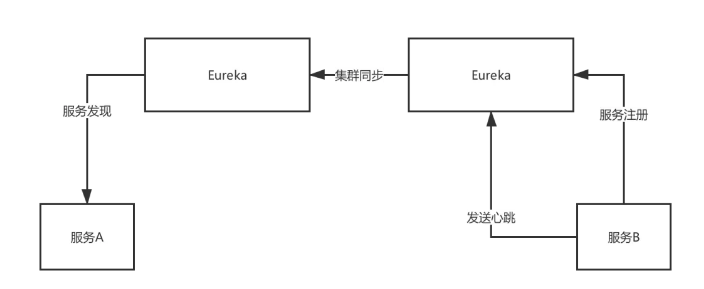
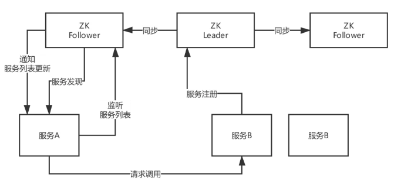

# 1.微服务

分布式系统”三驾马车“：GFS,mapreduce,Bigtable。是当前一切分布式技术基石。

- [The Google File System 论文解读](https://blog.csdn.net/qq_30031221/article/details/117037874)
- [MapReduce论文精读](https://blog.csdn.net/weixin_46840831/article/details/121111841)
- [Bigtable](https://blog.csdn.net/zj_18706809267/article/details/125044619)

## 1.微服务

### 1.1.架构演变过程

随着架构的演变，由 大而全的单体应用 演变到 简化服务间关系的 SOA架构，再演变到 大规模服务集群的 微服务架构，再到现在逐步出现的 ServiceMesh。
架构演变过程，不是哪种类型的的架构更好，而是哪种架构更适合公司的需求，符合使用场景，而目前大行其道的微服务架构，几乎能满足绝大部分公司的需求。

- 单体架构与微服务架构对比：
  - 通过单体式架构，所有进程紧密耦合，并可作为单项服务运行。这意味着，如果应用程序的一个进程遇到需求峰值，则必须扩展整个架构。
  随着代码库的增长，添加或改进单体式应用程序的功能变得更加复杂。这种复杂性限制了试验的可行性，并使实施新概念变得困难。
  单体式架构增加了应用程序可用性的风险，因为许多依赖且紧密耦合的进程会扩大单个进程故障的影响。
  - 使用微服务架构，将每个应用程序进程作为一项服务运行。这些服务通过明确定义的rpc接口进行通信。
  这些服务是围绕业务功能构建的，每项服务执行一项功能。由于它们是独立运行的，因此可以针对各项服务进行更新、部署和扩展，以满足对应用程序特定功能的需求。

### 1.2.微服务的优缺点

优点
- 自主性:可以对微服务架构中的每个服务进行开发、部署、运营和扩展，而不影响其他服务的功能。这些服务不需要与其他服务共享任何代码或实施。各个之间的任何通信都是通过明确定义的 API 进行的。
- 专用性:每项服务都是针对一组功能而设计的，并专注于解决特定的问题。如果开发人员逐渐将更多代码增加到一项服务中并且这项服务变得复杂，那么可以将其拆分成多项更小的服务。
- 敏捷性:微服务促进若干小型独立团队形成一个组织，这些团队负责自己的服务。各团队在小型且易于理解的环境中行事，并且可以更独立、更快速地工作。这缩短了开发周期时间。
- 灵活扩展:可以独立扩展各项服务以满足其支持的应用程序功能的需求。这使团队能够适当调整基础设施需求，准确衡量功能成本，并在服务需求激增时保持可用性。
- 轻松部署:通过持续集成和持续交付，可以轻松尝试新想法，并在无法正常运行时回滚。由于故障成本较低，因此可以大胆试验，更轻松地更新代码，并缩短新功能的上市时间。
- 技术自由：微服务架构不遵循“一刀切”的方法。团队可以自由选择最佳工具来解决他们的具体问题。
- 可重复使用的代码：将软件划分为小型且明确定义的模块，让团队可以将功能用于多种目的。专为某项功能编写的服务可以用作另一项功能的构建块。
- 弹性：在单体架构中，如果一个出现故障，可能导致整个应用程序无法运行。 通过微服务，应用程序可以通过降低功能而不导致整个应用程序崩溃来处理总体服务故障。

缺点
1. 多服务运维难度，随着服务的增加，运维的压力也在增大；解决方案：容器化 配合 devops流水钱，实现Nop。
2. 服务间依赖复杂；解决方案：1.整体规划服务之间关系，避免多层调用；2.增加工作流，规范化调用流程。3.增加全链路追踪工具辅助问题排查。
3. 学习难度曲线加大：需要掌握一系列的微服务开发技术。解决方案：学习。
4. 处理分布式事务较棘手，难以保障数据一致性：解决方案：增加分布式事务技术或者对业务数据进行对账。
5. 测试难度大。解决方案：在开发阶段就需要实现单元测试。
6. 人力成本大。解决方案：合理拆分微服务，合理规划团队人员，不能为了拆分而拆分。

### 1.3.微服务构成

以下案例为Spring Cloud的生态: [https://spring.io/projects/spring-cloud](https://spring.io/projects/spring-cloud)

```text
服务治理：
	1.Eureka
	2.Consul
	3.Zookeeper
	4.Nacos
断路器：
	1.Hystrix
	2.Sentinel
声明式服务调用
	1.OpenFeign
	2.Dubbo
	3.GRpc
API网关服务
	1.zuul
	2.zuul2
	3.Gateway
分布式配置中心
	1.Config
	2.Nacos
	3.Apollo
负载均衡：
	2.Ribbon
	3.LoadBalancer
消息总线：
    1.Spring Cloud Bus
	2.Turbine
	3.Spring Cloud Stream
	4.Kafka
	5.RocketMQ
任务调度：
	1.Spring Cloud Task
链路追踪：
	1.Spring Cloud Sleuth
	2.Zipkin
	3.Sleuth
安全：
	1.Spring Cloud Security
大数据：
	1.Spring Cloud Data Flow
构建与部署：
	1.Gradle
	2.Maven
	3.Jenkins
	4.Docker
	5.Kubernetes
```

### 1.4.SOA

SOA全英文是Service-Oriented Architecture，中文意思是中文面向服务编程，是一种思想，一种方法论，一种分布式的服务架构。

用途：SOA解决多服务凌乱问题，SOA架构解决数据服务的复杂程度，同时SOA又有一个名字，叫做服务治理。是单体应用演变为分布式应用的重要转折点。

第一阶段：大而全的单体应用


第二阶段：服务拆分：当项目比较小时，只需要一个系统，代码写到一起，部署到一个服务器上。但是随着平台越来越大，数据库与系统进行拆分。


企业数据总线：企业数据总线不是对多个模块的集成，而是充当数据通道的作用，数据总线不关心业务，数据总线根据给的地址和协议去调服务，上端不关心服务在哪里是什么，只找数据总线。

数据总线通过域名解析实现:一个域名绑定多台服务器，ajax也可以，dns也可以，解析域名嘛。

其实数据总线还有一些高级应用，比如心跳检测，实现负载均衡等等。 SOA的好处：

1. 降低用户成本，用户不需要关心各服务之间是什么语言的、不需要知道如果调用他们，只要通过统一标准找数据总线就可以了。
2. 程序之间关系服务简单
3. 识别哪些程序有问题（挂掉）

## 2.分布式理论

### 2.1.CAP理论

CAP理论最早在1998年提出，当时的分布式技术还在探索阶段，关注点也与现在不同，主要关注集群中数据副本。

- [浅谈CAP原理](https://www.jianshu.com/p/b0c8c9fb4763)
- [cap理论进阶理解](https://www.cnblogs.com/summer108/p/9783033.html)
- [CAP理论之CP模型ZK、AP模型Eureka](https://blog.csdn.net/yxd179/article/details/85200432)

#### 2.1.1.含义

- 一致性（C）：在分布式系统中的所有数据备份，在同一时刻是否同样的值。（等同于所有节点访问同一份最新的数据副本）
- 可用性（A）：在集群中一部分节点故障后，集群整体是否还能响应客户端的读写请求。（对数据更新具备高可用性）
- 分区容忍性（P）：就是当由于网络故障之时，导致集群里的机器不能保证其互相保持正常通信之时，每台机器所具备各自为战能力，保证服务能否正常使用

CAP原则的精髓就是要么AP，要么CP，要么AC，但是不存在CAP。

#### 2.1.2.案例
1.Eureka



Eureka采用peer-to-peer的架构集群模式，部署一个集群，但是集群里每个机器的地位是对等的。
各个服务可以向任何一个Eureka实例服务注册和服务发现，集群里任何一个Euerka实例接收到写请求之后，
会自动同步给其他所有的Eureka实例。但是他就会有一个问题，可能还没同步数据过去，结果自己就死了

此时还是可以继续从别的机器上拉取注册表，但是看到的就不是最新的数据了，但是保证了可用性，这就是AP。

2.zk


ZooKeeper是有一个leader节点会接收写数据，然后同步写其他节点，一旦leader挂了，要重新选举leader。
这个过程里为了保证C，就牺牲了A，不可用一段时间，但是一个leader选举好了，那么就可以继续写数据了，保证一致性。

3.Redis的CAP架构演变
- 主从/哨兵模式，可以通过配置，实现数据的基本一致。至于可用性，也只是基本可用。所有哨兵也就满足BASE原理
- Cluster数据是分片的，一致性保证不了，所以是AP的。

#### 2.1.3.脑裂

想要实现数据强一致性，目前主流的理论是Paxos及其变种（raft、zab等）都是一主多从的结构。
而脑裂就是因为故障导致集群中出现两个主的现象。分CAP理论中，最不能容忍的就是脑裂。

### 2.2.BASE定理

BASE理论论文： [https://queue.acm.org/detail.cfm?id=1394128](https://queue.acm.org/detail.cfm?id=1394128)

BASE并非CAP的扩展，甚至说两者没有太大的联系。
- 目标：ACID的替换方案。
- 作用：提升在分布式数据库的可用性。

BASE与ACID对比：BASE与ACID完全相反，ACID是悲观思想，在每次操作结束时强制要求保持一致性。而BASE是乐观思想，可以接受数据库一致性处于不断变化的状态。

1. 基本可用（Basically Available） ：是指分布式系统在出现故障的时候，允许损失部分可用性。
    - RT的损失：正常情况下，功能RT是0.5秒，出现故障RT增加到1-2秒。
    - 功能上的损失：双十一大促期间，关闭退款功能，保障下单可用。
2. 软状态（Soft state）：和硬状态相对，是指允许系统中的数据存在中间状态，并认为该中间状态的存在不会影响系统的整体可用性，即允许不同的副本之间存在数据延时。
3. 最终一致性（Eventually consistent）：最终一致性强调的是系统中所有的数据副本，在经过一段时间的同步后，最终能够达到一个一致的状态。
   因此，最终一致性的本质是需要系统保证最终数据能够达到一致，而不需要实时保证系统数据的强一致性。

BASE理论与CAP对比。
1. BASE理论提出在2008年，比CAP晚10年，所面对的分布式环境也更加复杂、成熟、稳定。所以要解决的问题也是更加清晰的。
2. 一致性概念不同：CPA是数据一致性，而BASE是状态的最终一致性。
3. 可用性不同：CPA是只集群部分节点故障后，集群任然能够提供完整的功能。BASE是部分功能是可以的。
4. BASE不需要考虑分区容忍性。 
5. 应用领域：CAP在实际应用中很难应用，多是在一些中间件中使用（全是分布式存储）。实际工程中BASE理论是最适合落地应用的（分布式应用）。

### 2.3.AKF拆分原则

https://blog.csdn.net/liangyulong419/article/details/88315504

比如redis，

- x轴，水平扩展，加机器，就是redis中的主从复制
- y轴，按照功能业务拆分，就是Redis中不同的实例，有的保存缓存，有的进行逻辑运算
- z轴，数据区分，就是Redis集群中的分配，或者机房的异地多活

### 2.4.共识算法

共识算法，也称为分布式数据一致性算法。

1. Paxos：被认为是分布式共识算法的根本，其他都是其变种，但是 paxos 论文中只给出了单个提案的过程，
   并没有给出复制状态机中需要的 multi-paxos 的相关细节的描述，实现 paxos 具有很高的工程复杂度 （如多点可写，允许日志空洞等）。
2. Zab：被应用在 zookeeper 中，业界使用广泛，但没用抽象成通用 library。
3. Raft： 以容易理解著称，业界也涌现出很多 Raft 实现，比如 etcd、bRaft、tikv 等。
    - https://mp.weixin.qq.com/s/ZE3sXRWoZYgbSIPTYIHWoA
    - [分布式一致性Raft与JRaft](https://www.cnblogs.com/yulinfu/p/15410107.html)
    - [深入解读Raft算法与etcd工程实现](https://mp.weixin.qq.com/s/x-AdmN0UN5KT58XWO1BCOA)
    - 开源的代码：
        - bRaft。百度开源的使用c++实现的Raft算法。 [https://github.com/baidu/bRaft](https://github.com/baidu/bRaft)
        - SOFAJRaft。蚂蚁金服借鉴bRaft使用Java使用的Raft算法。[https://www.sofastack.tech/projects/sofa-jRaft/overview/](https://www.sofastack.tech/projects/sofa-jRaft/overview/)
4. Gossip： 与上面三种不同，是一种数据复制算法，比如 redis： https://zhuanlan.zhihu.com/p/41228196

## 3.微服务组件

- [微服务治理技术白皮书](https://developer.aliyun.com/ebook/7565)

### 3.2.断路器

### 3.3.RPC

1、如何实现服务间调用

在微服务中，需要调用很多服务才能完成一项功能。服务之间如何互相调用就变成微服务架构中的一个关键问题。
服务调用有两种方式，一种是RPC方式，另一种是事件驱动（Event-driven）方式，也就是发消息方式。
消息方式是松耦合方式，比紧耦合的RPC方式要优越，但RPC方式如果用在适合的场景也有它的一席之地。

2、耦合是什么

第一，时间耦合，对于多数应用来讲，你希望能马上得到回答，因此即使使用消息队列，后台也需要一直工作。
第二，容量耦合，如果你对回复有时间要求，那么消息队列的缓冲功能作用不大，因为你希望及时响应。
真正需要的是自动伸缩（Auto-scaling），它能自动调整服务端处理能力去匹配请求数量。
第三，接口耦合和发送方式耦合，这两个确实是RPC方式的软肋，但也是优点

3、如何设计RPC:
https://www.cnblogs.com/ice-image/p/14554250.html#_labelTop

### 3.4.服务网关

什么是服务网关

当UI需要调用很多微服务时，它需要了解每个服务的接口，这个工作量很大。于是就用服务网关创建了一个Facade，
把几个微服务封装起来，这样UI就只调用服务网关就可以了，不需要去对付每一个微服务。

### 3.5.配置中心

### 3.5.负载均衡

### 3.6.消息总线

### 3.7.任务调度

### 3.8.链路追踪

### 3.9.安全

### 3.10.大数据

### 3.11.CI/CD

## 4.优雅停机&优雅停服

### 4.1.介绍

什么叫优雅结束？

- 第一步：停止接收请求和内部线程。
- 第二步：判断是否有线程正在执行。
- 第三步：等待正在执行的线程执行完毕。
- 第四步：停止容器。

何为优雅关机？ 简单来说就是为确保应用关闭时，通知应用进程释放所占用的资源：

- 线程池，shutdown（不接受新任务等待处理完）还是 shutdownNow（调用 Thread.interrupt 进行中断）
- Socket 链接，比如：Netty、MQ
- 告知注册中心快速下线（靠心跳机制客服早都跳起来了），比如：Eureka
- 清理临时文件，比如：POI
- 各种堆内堆外内存释放

总之，进程强行终止会带来数据丢失或者终端无法恢复到正常状态，在分布式环境下还可能导致数据不一致的情况。

JVM 是如何接受处理 Linux 信号量的？ 当然是在 JVM 启动时就加载了自定义 SignalHandler，关闭 JVM 时触发对应的 handle。

```java
public interface SignalHandler {
    SignalHandler SIG_DFL = new NativeSignalHandler(0L);
    SignalHandler SIG_IGN = new NativeSignalHandler(1L);
 
    void handle(Signal var1);
}
class Terminator {
    private static SignalHandler handler = null;
    Terminator() {
    }
    //jvm设置SignalHandler，在System.initializeSystemClass中触发
    static void setup() {
        if (handler == null) {
            SignalHandler var0 = new SignalHandler() {
                public void handle(Signal var1) {
                    Shutdown.exit(var1.getNumber() + 128);//调用Shutdown.exit
                }
            };
            handler = var0;
            try {
                Signal.handle(new Signal("INT"), var0);//中断时
            } catch (IllegalArgumentException var3) {
                ;
            }
            try {
                Signal.handle(new Signal("TERM"), var0);//终止时
            } catch (IllegalArgumentException var2) {
                ;
            }
 
        }
    }
}
```

### 4.2.kill命令

kill可将指定的信息送至程序。预设的信息为SIGTERM(15)，可将指定程序终止。若仍无法终止该程序，可使用SIGKILL(9)信息尝试强制删除程序

```shell
#查看jvm进程pid
jps
#列出所有信号名称
kill -l
 
# Windows下信号常量值
# 简称   全称        数值    备注
# INT   SIGINT     2       Ctrl+C中断
# ILL   SIGILL     4       非法指令
# FPE   SIGFPE     8       floating point exception(浮点异常)
# SEGV  SIGSEGV    11      segment violation(段错误)
# TERM  SIGTERM    5       Software termination signal from kill(Kill发出的软件终止)
# BREAK SIGBREAK   21      Ctrl-Break sequence(Ctrl+Break中断)
# ABRT  SIGABRT    22      abnormal termination triggered by abort call(Abort)
 
#linux信号常量值
# 简称   全称        数值   备注
# HUP   SIGHUP      1     终端断线  
# INT   SIGINT      2     中断（同 Ctrl + C）  
# QUIT  SIGQUIT     3     退出（同 Ctrl + \）   
# KILL  SIGKILL     9     强制终止   
# TERM  SIGTERM     15    终止   
# CONT  SIGCONT     18    继续（与STOP相反， fg/bg命令）   
# STOP  SIGSTOP     19    暂停（同 Ctrl + Z）  
#....
 
#可以理解为操作系统从内核级别强行杀死某个进程
kill -9 pid 
#理解为发送一个通知，等待应用主动关闭
kill -15 pid
#也支持信号常量值全称或简写（就是去掉SIG后）
kill -l KILL
```

### 4.3.【方式1】Runtime.addShutdownHook

tomcat可以使用shutdown.bat/shutdown.sh进行优雅结束。方式是JVM启动的时候中增加一个关闭的钩子，当 JVM 关闭的时候调用

核心是：`Runtime.getRuntime().addShutdownHook(shutdownHook);`

```java
public class Runtime {
    public void addShutdownHook(Thread hook) {
        SecurityManager sm = System.getSecurityManager();
        if (sm != null) {
            sm.checkPermission(new RuntimePermission("shutdownHooks"));
        }
        ApplicationShutdownHooks.add(hook);
    }
}
class ApplicationShutdownHooks {
    /* The set of registered hooks */
    private static IdentityHashMap<Thread, Thread> hooks;
    static synchronized void add(Thread hook) {
        if(hooks == null)
            throw new IllegalStateException("Shutdown in progress");
 
        if (hook.isAlive())
            throw new IllegalArgumentException("Hook already running");
 
        if (hooks.containsKey(hook))
            throw new IllegalArgumentException("Hook previously registered");
 
        hooks.put(hook, hook);
    }
}
//它含数据结构和逻辑管理虚拟机关闭序列
class Shutdown {
    /* Shutdown 系列状态*/
    private static final int RUNNING = 0;
    private static final int HOOKS = 1;
    private static final int FINALIZERS = 2;
    private static int state = RUNNING;
    /* 是否应该运行所以finalizers来exit? */
    private static boolean runFinalizersOnExit = false;
    // 系统关闭钩子注册一个预定义的插槽.
    // 关闭钩子的列表如下:
    // (0) Console restore hook
    // (1) Application hooks
    // (2) DeleteOnExit hook
    private static final int MAX_SYSTEM_HOOKS = 10;
    private static final Runnable[] hooks = new Runnable[MAX_SYSTEM_HOOKS];
    // 当前运行关闭钩子的钩子的索引
    private static int currentRunningHook = 0;
    /* 前面的静态字段由这个锁保护 */
    private static class Lock { };
    private static Object lock = new Lock();
 
    /* 为native halt方法提供锁对象 */
    private static Object haltLock = new Lock();
 
    static void add(int slot, boolean registerShutdownInProgress, Runnable hook) {
        synchronized (lock) {
            if (hooks[slot] != null)
                throw new InternalError("Shutdown hook at slot " + slot + " already registered");
 
            if (!registerShutdownInProgress) {//执行shutdown过程中不添加hook
                if (state > RUNNING)//如果已经在执行shutdown操作不能添加hook
                    throw new IllegalStateException("Shutdown in progress");
            } else {//如果hooks已经执行完毕不能再添加hook。如果正在执行hooks时，添加的槽点小于当前执行的槽点位置也不能添加
                if (state > HOOKS || (state == HOOKS && slot <= currentRunningHook))
                    throw new IllegalStateException("Shutdown in progress");
            }
 
            hooks[slot] = hook;
        }
    }
    /* 执行所有注册的hooks
     */
    private static void runHooks() {
        for (int i=0; i < MAX_SYSTEM_HOOKS; i++) {
            try {
                Runnable hook;
                synchronized (lock) {
                    // acquire the lock to make sure the hook registered during
                    // shutdown is visible here.
                    currentRunningHook = i;
                    hook = hooks[i];
                }
                if (hook != null) hook.run();
            } catch(Throwable t) {
                if (t instanceof ThreadDeath) {
                    ThreadDeath td = (ThreadDeath)t;
                    throw td;
                }
            }
        }
    }
    /* 关闭JVM的操作
     */
    static void halt(int status) {
        synchronized (haltLock) {
            halt0(status);
        }
    }
    //JNI方法
    static native void halt0(int status);
    // shutdown的执行顺序：runHooks > runFinalizersOnExit
    private static void sequence() {
        synchronized (lock) {
            /* Guard against the possibility of a daemon thread invoking exit
             * after DestroyJavaVM initiates the shutdown sequence
             */
            if (state != HOOKS) return;
        }
        runHooks();
        boolean rfoe;
        synchronized (lock) {
            state = FINALIZERS;
            rfoe = runFinalizersOnExit;
        }
        if (rfoe) runAllFinalizers();
    }
    //Runtime.exit时执行，runHooks > runFinalizersOnExit > halt
    static void exit(int status) {
        boolean runMoreFinalizers = false;
        synchronized (lock) {
            if (status != 0) runFinalizersOnExit = false;
            switch (state) {
            case RUNNING:       /* Initiate shutdown */
                state = HOOKS;
                break;
            case HOOKS:         /* Stall and halt */
                break;
            case FINALIZERS:
                if (status != 0) {
                    /* Halt immediately on nonzero status */
                    halt(status);
                } else {
                    /* Compatibility with old behavior:
                     * Run more finalizers and then halt
                     */
                    runMoreFinalizers = runFinalizersOnExit;
                }
                break;
            }
        }
        if (runMoreFinalizers) {
            runAllFinalizers();
            halt(status);
        }
        synchronized (Shutdown.class) {
            /* Synchronize on the class object, causing any other thread
             * that attempts to initiate shutdown to stall indefinitely
             */
            sequence();
            halt(status);
        }
    }
    //shutdown操作，与exit不同的是不做halt操作(关闭JVM)
    static void shutdown() {
        synchronized (lock) {
            switch (state) {
            case RUNNING:       /* Initiate shutdown */
                state = HOOKS;
                break;
            case HOOKS:         /* Stall and then return */
            case FINALIZERS:
                break;
            }
        }
        synchronized (Shutdown.class) {
            sequence();
        }
    }
}
```

### 4.4.【方式2】Spring

Spring 中通过 ContextClosedEvent 事件来触发一些动作（可以拓展），主要通过 LifecycleProcessor.onClose 来做 stopBeans。

由此可见 Spring 也基于 JVM 做了拓展

```java
public abstract class AbstractApplicationContext extends DefaultResourceLoader {
 public void registerShutdownHook() {
  if (this.shutdownHook == null) {
   // No shutdown hook registered yet.
   this.shutdownHook = new Thread() {
    @Override
    public void run() {
     doClose();
    }
   };
   Runtime.getRuntime().addShutdownHook(this.shutdownHook);
  }
 }
 protected void doClose() {
  boolean actuallyClose;
  synchronized (this.activeMonitor) {
   actuallyClose = this.active && !this.closed;
   this.closed = true;
  }
 
  if (actuallyClose) {
   if (logger.isInfoEnabled()) {
    logger.info("Closing " + this);
   }
 
   LiveBeansView.unregisterApplicationContext(this);
 
   try {
    //发布应用内的关闭事件
    publishEvent(new ContextClosedEvent(this));
   }
   catch (Throwable ex) {
    logger.warn("Exception thrown from ApplicationListener handling ContextClosedEvent", ex);
   }
 
   // 停止所有的Lifecycle beans.
   try {
    getLifecycleProcessor().onClose();
   }
   catch (Throwable ex) {
    logger.warn("Exception thrown from LifecycleProcessor on context close", ex);
   }
 
   // 销毁spring 的 BeanFactory可能会缓存单例的 Bean.
   destroyBeans();
 
   // 关闭当前应用上下文（BeanFactory）
   closeBeanFactory();
 
   // 执行子类的关闭逻辑
   onClose();
 
   synchronized (this.activeMonitor) {
    this.active = false;
   }
  }
 } 
}
public interface LifecycleProcessor extends Lifecycle {
 /**
  * Notification of context refresh, e.g. for auto-starting components.
  */
 void onRefresh();
 
 /**
  * Notification of context close phase, e.g. for auto-stopping components.
  */
 void onClose();
}
```

### 4.5.【方式3】SpringBoot

SpringBoot 中有 spring-boot-starter-actuator 模块提供了一个 restful 接口，用于优雅停机。

执行请求 curl -X POST http://127.0.0.1:8088/shutdown ，待关闭成功则返回提示。

注：线上环境该 url 需要设置权限，可配合 spring-security 使用或在 nginx 中限制内网访问。

```properties
#启用shutdown
endpoints.shutdown.enabled=true
#禁用密码验证
endpoints.shutdown.sensitive=false
#可统一指定所有endpoints的路径
management.context-path=/manage
#指定管理端口和IP
management.port=8088
management.address=127.0.0.1
 
#开启shutdown的安全验证（spring-security）
endpoints.shutdown.sensitive=true
#验证用户名
security.user.name=admin
#验证密码
security.user.password=secret
#角色
management.security.role=SUPERUSER
```

SpringBoot 的 shutdown 原理也不复杂，其实还是通过调用 AbstractApplicationContext.close 实现的

```java
@ConfigurationProperties(
    prefix = "endpoints.shutdown"
)
public class ShutdownMvcEndpoint extends EndpointMvcAdapter {
    public ShutdownMvcEndpoint(ShutdownEndpoint delegate) {
        super(delegate);
    }
    //post请求
    @PostMapping(
        produces = {"application/vnd.spring-boot.actuator.v1+json", "application/json"}
    )
    @ResponseBody
    public Object invoke() {
        return !this.getDelegate().isEnabled() ? new ResponseEntity(Collections.singletonMap("message", "This endpoint is disabled"), HttpStatus.NOT_FOUND) : super.invoke();
    }
}
@ConfigurationProperties(
    prefix = "endpoints.shutdown"
)
public class ShutdownEndpoint extends AbstractEndpoint<Map<String, Object>> implements ApplicationContextAware {
    private static final Map<String, Object> NO_CONTEXT_MESSAGE = Collections.unmodifiableMap(Collections.singletonMap("message", "No context to shutdown."));
    private static final Map<String, Object> SHUTDOWN_MESSAGE = Collections.unmodifiableMap(Collections.singletonMap("message", "Shutting down, bye..."));
    private ConfigurableApplicationContext context;
 
    public ShutdownEndpoint() {
        super("shutdown", true, false);
    }
    //执行关闭
    public Map<String, Object> invoke() {
        if (this.context == null) {
            return NO_CONTEXT_MESSAGE;
        } else {
            boolean var6 = false;
 
            Map var1;
 
            class NamelessClass_1 implements Runnable {
                NamelessClass_1() {
                }
 
                public void run() {
                    try {
                        Thread.sleep(500L);
                    } catch (InterruptedException var2) {
                        Thread.currentThread().interrupt();
                    }
                    //这个调用的就是AbstractApplicationContext.close
                    ShutdownEndpoint.this.context.close();
                }
            }
 
            try {
                var6 = true;
                var1 = SHUTDOWN_MESSAGE;
                var6 = false;
            } finally {
                if (var6) {
                    Thread thread = new Thread(new NamelessClass_1());
                    thread.setContextClassLoader(this.getClass().getClassLoader());
                    thread.start();
                }
            }
 
            Thread thread = new Thread(new NamelessClass_1());
            thread.setContextClassLoader(this.getClass().getClassLoader());
            thread.start();
            return var1;
        }
    }
}
```

### 4.6.难题

以上场景均为单一服务场景，很多情况下服务上游有网关、nginx、SLB等，对于连接可能出现各种类型的问题。比如SLB不会断开已经与不健康服务建立的连接，新的连接不再创建于不健康服务的连接。

[优雅上下线之如何安全的关闭Tomcat持久连接](https://heapdump.cn/article/6347626)

## 5.服务治理

服务治理包括：
- 服务发现：注册中心
- 负载均衡：在微服务体系中，通常是客户端负载均衡，例如Ribbon 和 loadbalancer
- 服务降低：限流、熔断、超时、重试
- 服务追踪


阿里巴巴2022年发布的微服务治理白皮书[微服务治理技术白皮书.pdf](file/微服务治理技术白皮书.pdf)

### 5.1.OpenSergo

OpenSergo 是一套开放通用的、面向云原生服务、覆盖微服务及上下游关联组件的微服务治理标准，并根据标准提供一系列的 API 与 SDK 实现。
OpenSergo 从微服务的角度出发，涵盖流量治理、服务容错、服务元信息治理、安全治理等关键治理领域，提供一系列的治理能力与标准、生态适配与最佳实践
OpenSergo 的最大特点就是以统一的一套配置/DSL/协议定义服务治理规则，面向多语言异构化架构，覆盖微服务框架及上下游关联组件。

- 官网[https://opensergo.io/zh-cn/](https://opensergo.io/zh-cn/)
- 源码[https://github.com/opensergo/opensergo-specification](https://github.com/opensergo/opensergo-specification)

目前还在发展阶段，参与的人数较少。

### 5.2.服务降级与熔断

### 5.2.1.基本概念

- 服务降级：服务的访问压力剧增的时候，根据当前的业务情况以及流量对一些服务和页面有策略的降级，帮助缓解服务的压力，保证服务能够正常运行不受影响（这里的服务包括应用和数据等）。
同时也得保证部分甚至是大部分客户能得到正确的响应，至于请求处理不了或出错的，给一个默认的响应即可。

举个比较简单的例子，当服务器的TCP请求数量大于500的时候，大于500的请求会直接返回提示信息--服务繁忙请稍后再试，500以内的请求正常跑即可。

- 服务熔断：在股票市场，熔断这个词大家都不陌生，是指当股指波幅达到某个点后，交易所为控制风险采取的暂停交易措施。
   相应的，服务熔断一般是指软件系统中，由于某些原因使得服务出现了过载现象，为防止造成整个系统故障，从而采用的一种保护措施，所以很多地方把熔断亦称为过载保护。

- 降级的目的：保障服务不出现问题
- 熔断的目的：问题不会扩大。


### 5.2.2.降级分类
- 按照是否自动化：自动开关降级、人工开关降级
- 按照功能分类：读服务降级、写服务降级
- 按照系统层级降级分类：多级降级

自动降级分类
1. 超时降级：主要配置好超时时间和超时重试次数和机制，并使用异步机制探测回复情况
2. 失败次数降级：主要是一些不稳定的api，当失败调用次数达到一定阀值自动降级，同样要使用异步机制探测回复情况
3. 故障降级：比如要调用的远程服务挂掉了（网络故障、DNS故障、http服务返回错误的状态码、rpc服务抛出异常），则可以直接降级。
   降级后的处理方案有：默认值（比如库存服务挂了，返回默认现货）、兜底数据（比如广告挂了，返回提前准备好的一些静态页面）、缓存（之前暂存的一些缓存数据）
4. 限流降级：当我们去秒杀或者抢购一些限购商品时，此时可能会因为访问量太大而导致系统崩溃，此时开发者会使用限流来进行限制访问量，当达到限流阀值，后续请求会被降级；
  降级后的处理方案可以是：排队页面（将用户导流到排队页面等一会重试）、无货（直接告知用户没货了）、错误页（如活动太火爆了，稍后重试）。


### 5.2.3.服务熔断和服务降级比较
两者其实从有些角度看是有一定的类似性的：

目的很一致，都是从可用性可靠性着想，为防止系统的整体缓慢甚至崩溃，采用的技术手段；

最终表现类似，对于两者来说，最终让用户体验到的是某些功能暂时不可达或不可用；

粒度一般都是服务级别，当然，业界也有不少更细粒度的做法，比如做到数据持久层（允许查询，不允许增删改）；

自治性要求很高，熔断模式一般都是服务基于策略的自动触发，降级虽说可人工干预，但在微服务架构下，完全靠人显然不可能，开关预置、配置中心都是必要手段；

而两者的区别也是明显的：
- 触发原因不太一样，服务熔断一般是某个服务（下游服务）故障引起，而服务降级一般是从整体负荷考虑；
- 管理目标的层次不太一样，熔断其实是一个框架级的处理，每个微服务都需要（无层级之分），而降级一般需要对业务有层级之分（比如降级一般是从最外围服务开始）

### 5.2.4.服务降级需要考虑的问题
1. 降级的服务是否是核心服务
2. 是否支持降级，降级的策略是什么
3. 业务场景