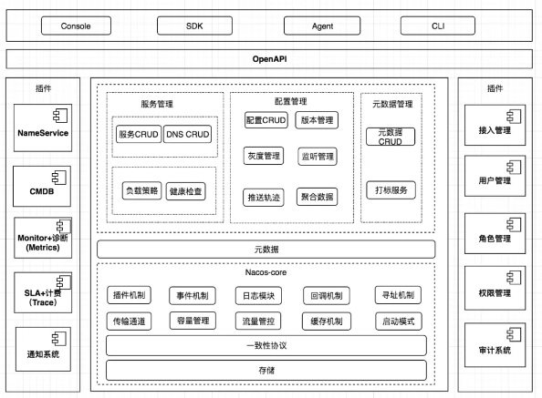
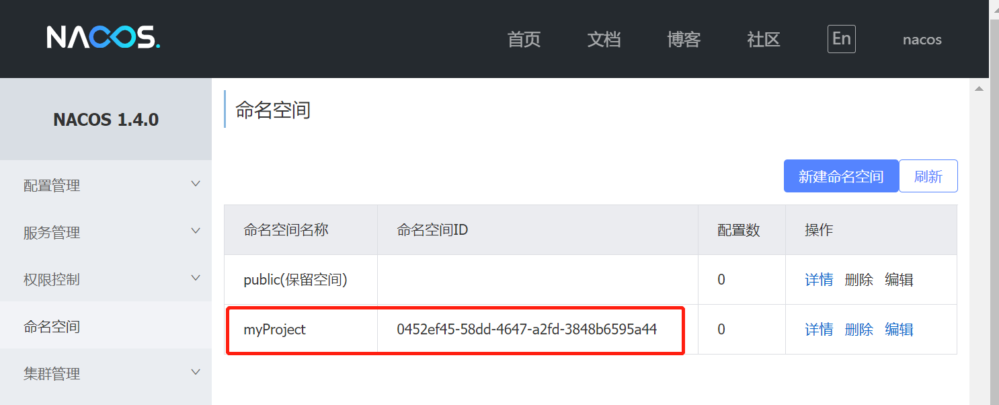
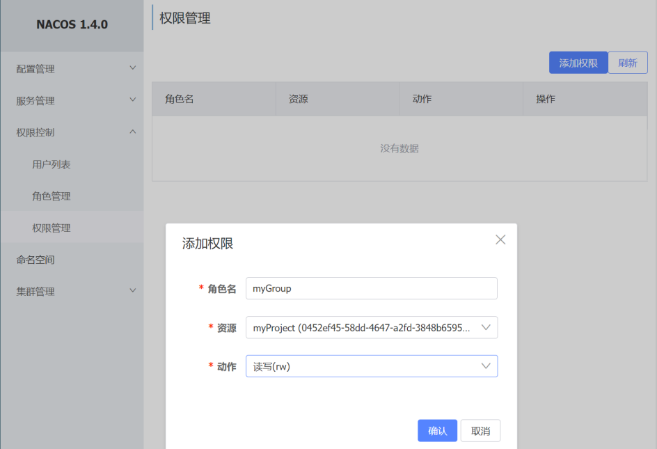
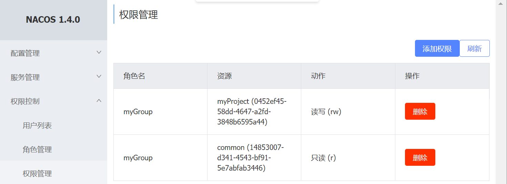
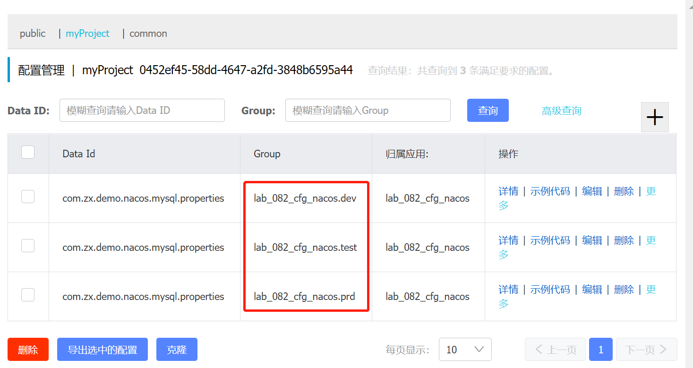
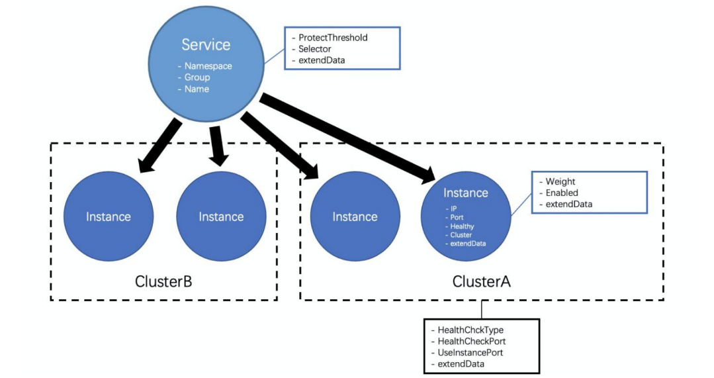

# Nacos

## 1.基础

### 1.1.概述
根据业务架构、各业务系统本身需求与要求，特构建了动态配置&服务发现，其主要能解决的问题如下：

1. 动态配置服务：敏感配置数据的存储、频繁变更的配置数据(热更新)、生产环境批量推送到各个系统以及研发系统存在配置乱的问题；
2. 服务注册与发现；
3. dns服务管理；

- 官网：[https://nacos.io/](https://nacos.io/)
- 源码：[https://github.com/alibaba/nacos](https://github.com/alibaba/nacos)
- 官方书籍：[https://developer.aliyun.com/ebook/36](https://developer.aliyun.com/ebook/36)

### 1.2.架构设计



整体架构分为用户层、业务层、内核层和插件层：
1. 用户层主要解决用户使用的易用性问题
2. 业务层主要解决服务发现和配置管理的功能问题
3. 内核层解决分布式系统一致性、存储、高可用等核心问题
4. 插件层解决扩展性问题。

1. 用户层
   - OpenAPI：暴露标准Rest风格HTTP接口，简单易用，方便多语言集成
   - Console：易用控制台，做服务管理、配置管理等操作
   - SDK：多语言 SDK，目前几乎支持所有主流编程语言
   - Agent：Sidecar 模式运行，通过标准 DNS 协议与业务解耦
   - CLI：命令行对产品进行轻量化管理，像 git 一样好用
2. 业务层
   - 服务管理：实现服务 CRUD，域名 CRUD，服务健康状态检查，服务权重管理等功能
   - 配置管理：实现配置管 CRUD，版本管理，灰度管理，监听管理，推送轨迹，聚合数据等功能
   - 元数据管理：提供元数据 CURD 和打标能力，为实现上层流量和服务灰度非常关键
3. 内核层
   - 插件机制：实现三个模块可分可合能力，实现扩展点 SPI 机制，用于扩展自己公司定制
   - 事件机制：实现异步化事件通知，SDK 数据变化异步通知等逻辑，是Nacos高性能的关键部分
   - 日志模块：管理日志分类，日志级别，日志可移植性（尤其避免冲突），日志格式，异常码+帮助文档
   - 回调机制：SDK 通知数据，通过统一的模式回调用户处理。接口和数据结构需要具备可扩展性
   - 寻址模式：解决 Server IP 直连，域名访问，Nameserver 寻址、广播等多种寻址模式，需要可扩展
   - 推送通道：解决 Server 与存储、Server 间、Server 与 SDK 间高效通信问题
   - 容量管理：管理每个租户，分组下的容量，防止存储被写爆，影响服务可用性
   - 流量管理：按照租户，分组等多个维度对请求频率，长链接个数，报文大小，请求流控进行控制
   - 缓存机制：容灾目录，本地缓存，Server 缓存机制，是 Nacos 高可用的关键
   - 启动模式：按照单机模式，配置模式，服务模式，DNS 模式，启动不同的模块
   - 一致性协议：解决不同数据，不同一致性要求情况下（包括AP 协议和CP协议）的诉求
   - 存储模块：解决数据持久化、非持久化存储，解决数据分片问题
4. 插件
   - Nameserver：解决 Namespace 到 ClusterID 的路由问题，解决用户环境与 Nacos 物理环境映射问题
   - CMDB：解决元数据存储，与三方 CMDB 系统对接问题，解决应用，人，资源关系
   - Metrics：暴露标准 Metrics 数据，方便与三方监控系统打通
   - Trace：暴露标准 Trace，方便 SLA 系统打通，日志白平化，推送轨迹等能力，并且可以和计量计费系统关联
   - 接入管理：相当于阿里云开通服务，分配身份、容量、权限过程
   - 用户管理：解决用户管理，登录，SSO 等问题
   - 权限管理：解决身份识别，访问控制，角色管理等问题
   - 审计系统：扩展接口方便与不同公司审计系统打通
   - 通知系统：核心数据变更，或者操作，方便通过SMS系统打通，通知到对应人数据变更

[nacos架构演变](https://mp.weixin.qq.com/s/q8MkXtQ6YGy32KqrQUNb_g)
1. 将协议层抽象到内核层
2. 逻辑计算层与逻辑存储层分析。

## 2.安装

部署方式：
- 单机模式 - 用于测试和单机试用。
- 集群模式 - 用于生产环境，确保高可用。
- 多集群模式 - 用于多数据中心场景。

集群模式可以选择mysql作为底层存储，以下为使用技巧。

- Nacos 安装与基础配置：[https://blog.csdn.net/qq_40523572/article/details/89364340](https://blog.csdn.net/qq_40523572/article/details/89364340)

### 2.1.高可用设计

nacos设计遵循了公有云的网络架构。Nacos 部署架构上是单 Region 封闭，Region 间独立，跨 Region 通过网关或者 Nacos-sync 完 成服务互通。
从而降低 Region 间网络故障风险。

> 在公有云的维度，一般情况下，region之间网络是不通，同一个region下的zone之间网络互通。

用户如果选择跨region构建nacos集群，为了避免出现服务跨region调用，推荐使用cluster设置Region，确保在一个同一个cluster的服务都在一个region内。

### 2.2.高可用集群配置
Nacos并未提供高可用的支持，需要依赖于Nginx、SLB等来实现高可用。

- Nacos 高可用特性：[https://mp.weixin.qq.com/s/WipvefNF2a2Heru3BZV-3A](https://mp.weixin.qq.com/s/WipvefNF2a2Heru3BZV-3A)
- 高可用部署：[https://mp.weixin.qq.com/s/hmH5bprfQ6Q7XEjHMw1Yhw](https://mp.weixin.qq.com/s/hmH5bprfQ6Q7XEjHMw1Yhw)

nginx案例
```shell
upstream nacos_cluster {
   server 127.0.0.1:8848;
   server 127.0.0.1:8858;
   server 127.0.0.1:8868;
}

server {
    listen       8838;
    server_name  localhost;
    location / {
        proxy_pass http://nacos_cluster;
        proxy_set_header Host $host:$server_port;
    }
}
## nacos 2.x版本支持 grpc 长链接，需要配置四层负载。端口=http port+1000。
stream {
    upstream nacos-server-grpc {
        server 127.0.0.1:9848;
        server 127.0.0.1:9858;
        server 127.0.0.1:9868;
    }
    server {
        listen 9838;
        proxy_pass nacos-server-grpc;
    }
}
```

### 2.3.多级容灾

1. Nacos 持久化存储做了主备容灾，而且底层存储数据多副本高可用保障。
2. Nacos Server 有全量缓存数据，即使存储挂或者不可用，只影响写，核心的读服务不受影响。
3. Nacos SDK 有所需服务和配置缓存，Server 即使全挂，走本地缓存，保证核心业务调用不受影响。

### 2.4.操作技巧

#### 2.4.1.用户管理

从这里开始，假设我们有一个项目，叫做myProject，这个项目归属的组为myGroup

我们可以创建一个用户，账号，密码都是myProject


#### 2.4.2.命名空间

我们一般选择使用项目的名称为命名空间的名字。命名空间ID使我们经常使用的



#### 2.4.3.角色管理

我们一般使用项目组为一个角色，目前nacos只支持一个角色绑定一个账号，还是太简单了。


#### 2.4.4.权限管理

用来给角色分配操作资源的权限。




一个角色可以创建多个权限，用来分配权限。



#### 2.4.5.配置管理

我们主要使用的功能。需要注意的配置，是data id 和 group。我们可以使用group去区分dev,test,prd。

DataId尽可能的设置成能够明显的区分出项目和具体的配置类型。
注意：dataId的后缀为配置文件的类型，不能随意定义，比如.properties, .yml, .json等



## 3.配置中心原理

Nacos 并不是通过推的方式将服务端最新的配置信息发送给客户端的，而是客户端维护了一个长轮询的任务，
定时去nacos拉取发生变更的配置信息，然后将最新的数据推送给 Listener 的持有者，也就是客户端。
其中有个MD5值就是用来校验服务端的值是否与客户端的一直。

由客户端主动拉取数据的优势：
1. 不用维护长链接了，减少相关资源的消耗，而且长链接需要考虑session是否过期的问题，参考zk通过心跳检测的方式处理。
2. nacos客户端只需定时发送无状态的http请求即可。

流程如下：
1. 客户端的请求到达服务端后，服务端将该请求加入到一个叫 allSubs 的队列中，等待配置发生变更时 DataChangeTask 主动去触发，并将变更后的数据写入响应对象，
2. 与此同时服务端也将该请求封装成一个调度任务去执行，等待调度的期间就是等待 DataChangeTask 主动触发的。
   如果延迟时间到了 DataChangeTask 还未触发的话，则调度任务开始执行数据变更的检查，然后将检查的结果写入响应对象


- nacos 1.x：采用http长轮询的方式，客户端与服务端保持长连接，由客户端拉取配置。
  1. Nacos 客户端会循环请求服务端变更的数据，并且超时时间设置为30s，当配置发生变化时，请求的响应会立即返回，否则会一直等到 29.5s+ 之后再返回响应
  2. Nacos 客户端能够实时感知到服务端配置发生了变化。
  3. 实时感知是建立在客户端拉和服务端“推”的基础上，但是这里的服务端“推”需要打上引号，因为服务端和客户端直接本质上还是通过
     http进行数据通讯的，之所以有“推”的感觉，是因为服务端主动将变更后的数据通过 http 的 response 对象提前写入了。
- nacos 2.x：SDK 与 服务端建立GRPC长连接，当配置变更后主动推送配置到SDK。
[支持gRPC长链接，深度解读Nacos2.0架构设计及新模型](https://baijiahao.baidu.com/s?id=1688267648806940996&wfr=spider&for=pc)

## 4.注册中心原理

- Nacos1.x版本，服务注册是通过Http接口实现的
- Nacos2.x版本，服务注册是通过gRPC接口实现的。主要是因为Http请求会频繁创建和销毁连接，白白浪费资源。
  但是依旧保留了http接口，方便兼容老的版本。

### 4.1.服务注册与发现

Nacos提供了两种服务发现方式：
1. 主动查询（pull）。
2. 服务订阅（push）。nacos默认采用。

nacos 1.x和2.x都是通过SDK中的NamingService#subscribe方法来发起订阅。
当有服务实例数据变动的时，客户端就会回调EventListener，就可以拿到最新的服务实例数据了。但是两者的实现方式不同。

nacos 1.x
1. 客户端在启动的时候，会去构建一个叫PushReceiver的类。这个类会去创建一个UDP Socket，端口是随机的。
2. 调用NamingService#subscribe，拉取所有需要的服务实例信息。同时会将UDP的信息上传到nacos服务端，用于nacos推送服务变更。
3. nacos服务端，当注册的服务发生变化时，会发送UDP信息，通知客户端。
4. 客户端每10s会从nacos服务端查询一次全量的服务实例信息。因为UDP通讯不稳定，避免未能及时变更。作为一种兜底的方案。
nacos 2.x
1. 采用GRPC，让服务实例发生变化时，nacos服务端主动推送变更后的数据到客户端。

### 4.2.redo操作

在eureka中，客户端与eureka服务端连接后，客户端注册的信息会被删除掉。当服务重新连接后会重新走一遍注册的流程，服务发现的效率很慢。

而在nacos中，SDK会将从nacos拉取到的服务实例信息缓存到客户端的缓存中。当服务重新连接后，这个缓存就可以直接用于注册了。
这个缓存的是全部服务的数据，而不是某个节点的数据，所以重新注册的效率会很快。
服务发现与订阅都会使用这个缓存，这回极大的提升服务发现的效率，提升服务的可用性。

### 4.3.心跳检测

nacos 1.x
1. 客户端注册成功后，每5s一次向服务端发送心跳。
2. 服务端每5s检查一次状态。
   - 如果超过15s但没有超过30s，则标记服务为不健康。
   - 如果超过30s，则从服务端剔除该服务。

nacos 2.x
1. 因为采用GRPC建立连接，连接本身就是一种心跳检测。如果连接断开，则nacos删除该服务。
2. nacos每3s检查所有的连接，如果连接20s内没有接受到请求，则主动向客户端发送连接检查，出现异常时也会主动断开连接，剔除服务实例。


### 4.4.永久与临时实例

nacos对外提供了两种类型的实例：永久实例和临时实例。这两种实例可以设置每个实例的类型。两者的应用场景不同。
1. 临时实例：注册之后实例信息不回持久化到磁盘，仅仅保留信息再内存中
   - 适合业务服务，当服务下线后就不需要再注册中心中看到。
   - 当服务实例出现异常或者下线之后，就会把这个服务实例从服务注册表中剔除
2. 永久实例：注册之后实例信息会持久化到磁盘，例如MySQL、Redis等。同时也会缓存到内存中
    - 当服务实例出现异常或者下线，Nacos只会将服务实例的健康状态设置为不健康，并不会对将其从服务注册表中剔除

PS：在同一个服务中，其中每个实例的类型只能全部是临时或者永久，不能混合使用。

临时实例和永久实例的区别
1. 健康检查机制不同
   - 临时实例，使用心跳机制
   - 永久实例，server端主动发起探测请求，http,tcp,mysql
2. 注册数据一致性方案不同
   - 临时实例，使用自研Distro协议，属于AP
   - 永久实例，使用jRaft协议，属于CP


### 4.5.服务实例数据模型

Nacos中服务实例的数据分为三个维度管理（页面维护也是这三个维度）。对于nacos的操作时都需要使用这三个维度的参数，进行数据隔离。
- 命名空间（Namespace）：Nacos 数据模型中最顶层、也是包含范围最广的概念，用于在类似环境或租户等需要强制隔离的场景中定义。
- 分组（Group）：Nacos 数据模型中次于命名空间的⼀种隔离概念，区别于命名空间的强制隔离属性，分组属于⼀个弱隔离概念，主要用于逻辑区分⼀些服务使用场景或不同应用的同名服务，
   最常用的情况主要是同⼀个服务的测试分组和生产分组、或者将应用名作为分组以防止不同应用提供的服务重名。
- 服务名（name）：该服务实际的名字，⼀般用于描述该服务提供了某种功能或能力。


```json
curl --location 'http://127.0.0.1:8848/nacos/v2/ns/instance/list?serviceName=lab_082_cfg_nacos&accessToken=鉴权信息&namespaceId=cd825704-40ec-444a-bcbb-97a9bd31e2c3&groupName=lab_082_cfg_nacos' \

{
    "code": 0,
    "message": "success",
    "data": {
        "name": "lab_082_cfg_nacos@@lab_082_cfg_nacos",  #分组名@@服务名
        "groupName": "lab_082_cfg_nacos",                #分组名
        "clusters": "",                                  #集群名
        "cacheMillis": 10000,                            #缓存时间
        "hosts": [                                       #服务实例列表
            {
                "ip": "192.168.56.1",                    #服务实例ip
                "port": 8080,                            #服务实例端口
                "weight": 1.0,                           #权重
                "healthy": true,                         #是否健康
                "enabled": true,                         #实例是否可用   
                "ephemeral": true,                       #持久化属性：是否临时实例
                "clusterName": "DEFAULT",                #实例所在的集群名称
                "serviceName": "lab_082_cfg_nacos@@lab_082_cfg_nacos",  #分组名@@服务名
                "metadata": {                          #实例的元数据，例如版本号等信息
                    "preserved.register.source": "SPRING_CLOUD"
                },
                "instanceHeartBeatInterval": 5000,       #心跳间隔时间,5s检查一次
                "instanceHeartBeatTimeOut": 15000,       #心跳超时时间,超过15s，则标记为不健康
                "ipDeleteTimeout": 30000                 #实例删除超时时间,超过30s，则剔除实例
            }
        ],
        "lastRefTime": 1703039815143,                    # 上次心跳时间
        "checksum": "",                                  #校验值，用于与服务端数据是否一致
        "allIPs": false,   
        "reachProtectionThreshold": false,               #是否达到保护阈值
        "valid": true                                    #是否有效 
    }
}
```

### 4.6.健康保护阈值

为了防止因过多实例 (Instance) 不健康导致流量全部流向健康实例 (Instance) ，继而造成流量压力把健康实例 (Instance) 压垮并形成雪崩效应，应将健康保护阈值定义为一个 0 到 1 之间的浮点数。
当域名健康实例数 (Instance) 占总服务实例数 (Instance) 的比例小于该值时，无论实例 (Instance) 是否健康，都会将这个实例 (Instance) 返回给客户端。
这样做虽然损失了一部分流量，但是保证了集群中剩余健康实例 (Instance) 能正常工作。

设置的方式是注册服务实例的时候，设置protectThreshold，默认是0。这个参数是服务维度的。


### 4.7.实例选择器

注册服务的时候，可以设置selector。用于在获取服务下的实例列表时，过滤和筛选实例。
该选择器也被称为路由器，目前 Nacos 支持通过将实例的部分信息存储在外部元数据管理 CMDB 中，
并在发现服务时使用 CMDB 中存储的元数据标签来进行筛选的能力。

### 4.8.集群属性

服务实例数据模型中可以看到，服务实例列表中有一个字段叫clusterName，这个字段就是集群属性。
集群是 Nacos 中⼀组服务实例的⼀个逻辑抽象的概念，它介于服务和实例之间，是⼀部分服务属性的下沉和实例属性的抽象。

注册服务时，可以设置实例的clusterName集群名称，默认为DEFAULT。获得服务时，可以将clusterName作为参数，筛选集群下的实例。



## 5.一致性协议

### 5.1.协议选择
nacos同时支持AP和CP两种模型，所以需要对于的一致性算法支撑：
- CP: 基于简化的raft的cp模型，由leader写入，一致性并不严格，但是可以保证一半一致，数据会进行持久化。
    - 对于强一致性共识算法，当前实际生产中，最多使用的就是 Raft 协议，Raft 更容易让人理解，并且有很多成熟的算法实现。
    - 比如蚂蚁金服的 JRaft、Zookeeper 的 ZAB、Consul 的 Raft、百度的 braft、Apache Ratis等。
    - 因为 Nacos 是Java技术栈，并且是阿里系产品，所以选择JRaft。不仅方便交流，而且 JRaft 支持多 RaftGroup，为 Nacos 后面的多数据分片带来了可能。
- AP: 基于Distro的ap模型，参考了eureka，并做出了优化
    - Distro 协议是阿里自研的最终一致性协议，是一种面向临时实例的分布式协议。
    - Distro 是集 Gossip 以及 Eureka 协议的优点并加以优化而出来的。Gossip协议随机选择节点发送消息，消息存在重复消费的问题且去中心化设计，每次发送全量消息，增加网络带宽压力
    - Distro 优化：算引入了权威 Server 的概念，每个节点负责一部分数据以及将自己的数据同步给其他节点，减少了数据量、有效的降低了消息冗余的问题。

1. 注册中心：可以根据创建服务时设置的持久化参数选择，默认AP模型。
   - 临时节点：Nacos优先保证可用性，采用AP模型。
   - 永久节点：Nacos优先保证一致性，采用CP模型。
2. 配置中心：采用的CP模型


### 5.2.Distro

Distro 协议是 Nacos 社区自研的一种 AP 分布式协议，是面向临时实例设计的一种分布式协议，其保证了在某些 Nacos 节点宕机后，整个临时实例处理系统依旧可以正常工作。
作为一种有状态的中间件应用的内嵌协议，Distro 保证了各个 Nacos 节点对于海量注册请求的统一协调和存储。

设计思想Distro协议的主要设计思想如下：
1. Nacos 每个节点是平等的都可以处理写请求，同时把新数据同步到其他节点。
2. 每个节点都存储了完整的数据，但是每个节点只负责部分数据的一致性，定时发送自己负责数据的校验值到其他节点来保持数据一致性。
3. 每个节点独立处理读请求，及时从本地发出响应。

Distro工作流程如下：
1. 数据初始化。新加入的Distro节点，会轮询所有的Distro节点从这些节点中全量拉取数据。新Distro节点会将拉取到的数据进行合并，确保自己有全量的数据。
2. 数据校验。Distro节点之间定时发送心跳。心跳信息主要为本地所有数据的元数据（为了降低传输的数据）。如果发现本地与其他节点的数据不一致，则发起全量拉取。
3. 写操作。客户端调用vip，请求会转发到某个节点。写入的流程如下：
    - 前置过滤器DistroFilter会读取请求参数中的ip和port，计算应该是哪个Distro节点负责该请求。并将请求转发到对应的Distro节点。
    - 如果当前请求是客户端第一次写入，则默认在当前节点写入数据，当前节点为该客户端数据的责任节点，并在响应中返回Distro节点的ip和port，用于下次请求中设置参数。
    - 责任节点负责处理请求。
    - Distro节点定时执行数据同步任务，将数据同步到其他节点。
4. 读操作。因为每个Distro节点都保存的全部数据，所以客户端读操作是直接读取全部数据（当然，这里的全部数据指的是某个namespace的注册的全部实例）

总结：
1. 当该节点接收到属于该节点负责的实例的写请求时，直接写入。
2. 当该节点接收到不属于该节点负责的实例的写请求时，将在集群内部路由，转发给对应的节点，从而完成读写。
3. 当该节点接收到任何读请求时，都直接在本机查询并返回（因为所有实例都被同步到了每台机器上）。

### 5.3.Raft

Nacos的CP实现是基于Raft算法来实现的。
- 在1.x版本早期，Nacos是自己手动实现Raft算法
- 在2.x版本，Nacos移除了手动实现Raft算法，转而拥抱基于蚂蚁开源的JRaft框架

数据一致性：
1. 集群节点之间：节点之间采用raft保证数据一致性。一致性的核心是节点与数据库之间的一致性，从而保证节点之间的一致性。
   任意一个节点写入数据后，先持久化到数据库，然后再通知其他节点从数据库拉取最新的配置，并通知客户端拉取最新配置。
2. SDK与节点间：为了保证配置中心的高可用，并未采用raft算法，而是通过对比MD5来实现，如果不一致SDK就拉取节点中的最新配置。

## 6.原理

- [nacos专题](https://www.jianshu.com/c/a43af0cc4698?order_by=added_at)
- Nacos 实现原理详细讲解：[https://mp.weixin.qq.com/s/xk-1m5UVuwrObfoYwpi_DQ](https://mp.weixin.qq.com/s/xk-1m5UVuwrObfoYwpi_DQ)
- 实现原理教材：[https://mp.weixin.qq.com/s/nbNEYn5YwK3rVo8CX4rb8A](https://mp.weixin.qq.com/s/nbNEYn5YwK3rVo8CX4rb8A)

### 6.1.通讯通道

Nacos 1.x 版本 Config/Naming 模块各自的推送通道都是按照自己的设计模型来实现的。

1. Nacos Config
   - 推送模型：客户端通过http长连接查询，。
   - 数据⼀致性：校验MD5
   - 痛点：http 短连接，30 秒定 期创建销毁连接，性能低，浪费资源。
2. Nacos Naming
   - 推送模型：服务端采用UDP推送，客户端通过UDP接收。以及客户端采用http定时查询的方式
   - 数据⼀致性：客户端直接更新数据。服务端之间采用一致性算法。
   - 痛点：UDP 不可靠，不稳定。且在公有云下可能无法通讯等问题

Nacos 2.x 版本，Config/Naming 都采用了 gRPC 作为通讯通道。可以直接由服务端推送数据到客户端。
优点
1. 低成本的服务快速感知。
2. 网络防抖。合理的重试机制，通过逐步递增的重试时间，以期待服务恢复。

## Nacos与Eureka

- [https://blog.csdn.net/fly910905/article/details/100023415](https://blog.csdn.net/fly910905/article/details/100023415)
- [https://www.cnblogs.com/skj0330insn/p/12057416.html](https://www.cnblogs.com/skj0330insn/p/12057416.html)
- [https://blog.csdn.net/xc123_java/article/details/90200189](https://blog.csdn.net/xc123_java/article/details/90200189)

相比eureka的对等星型同步AP模型，nacos虽然也保留了这种模型，自研的AP模型Distro协议，nacos对所有服务实例进行分片，
将服务实例均匀分配到不同的server进行续约和数据同步（内部使用grpc维护），降低了整个集群的压力。

总所周知：eureka在服务实例较大时，会产生较高的延迟。默认配置下最大可能产生180s的延迟，即使优化配置，也会产生几十秒的延迟。
而nacos在2.0版本中，使用了grpc长连接，极大的降低了延迟，数据变更毫秒级推送生效；
- 1w 级，SLA 承诺 1w 实例上下线 1s，99.9% 推送完成；
- 10w 级，SLA 承诺 1w 实例上下线 3s，99.9% 推送完成；
- 100w 级别，SLA 承诺 1w 实例上下线 9s 99.9% 推送完成。

3节点集群支持的规模：十万级服务/配置，百万级连接