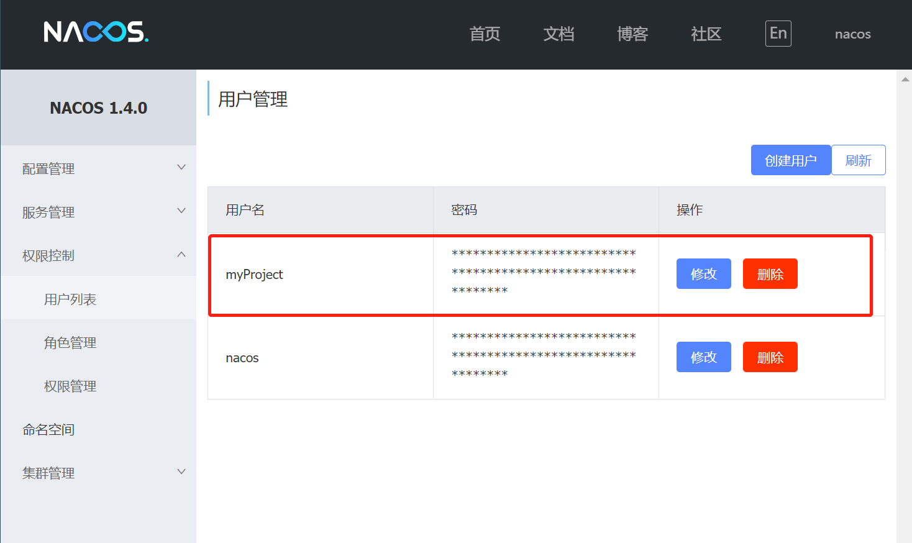
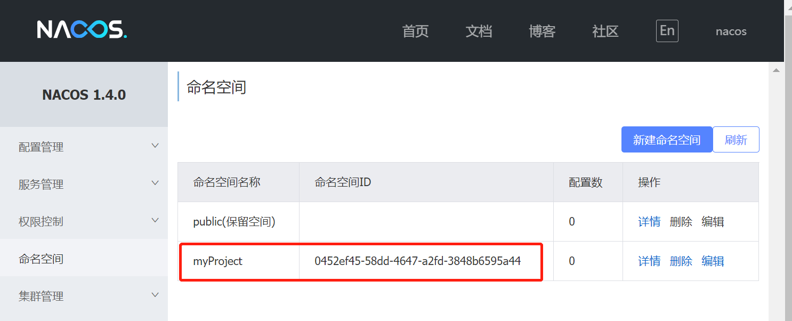
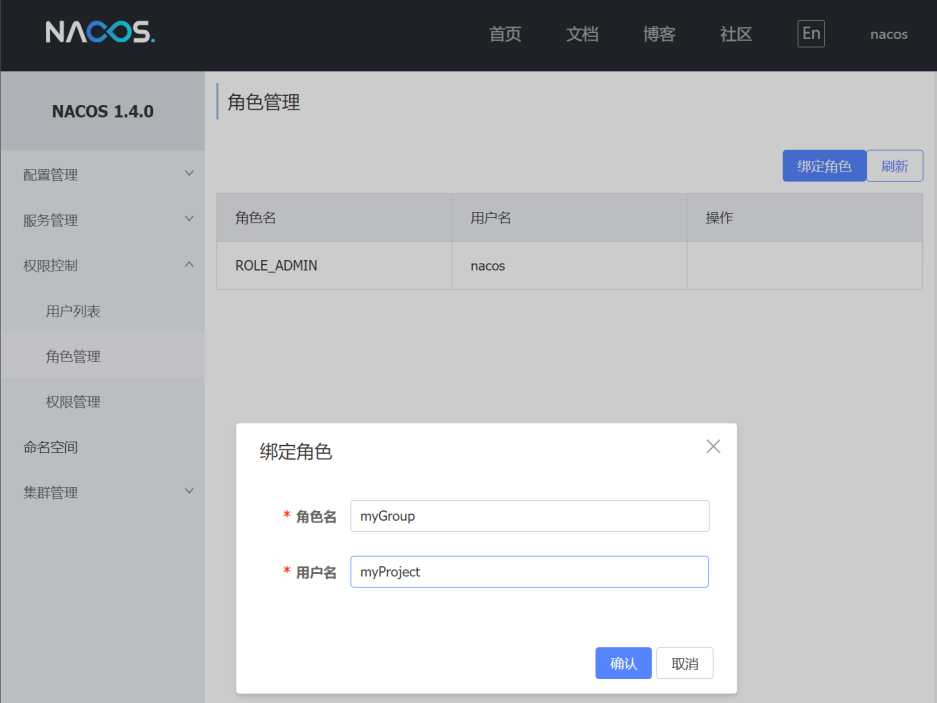
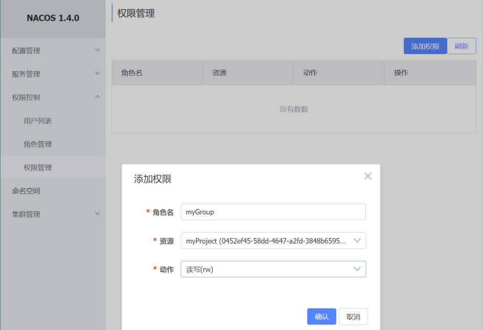
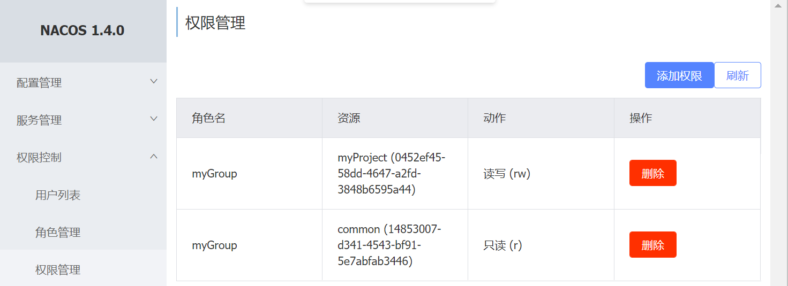
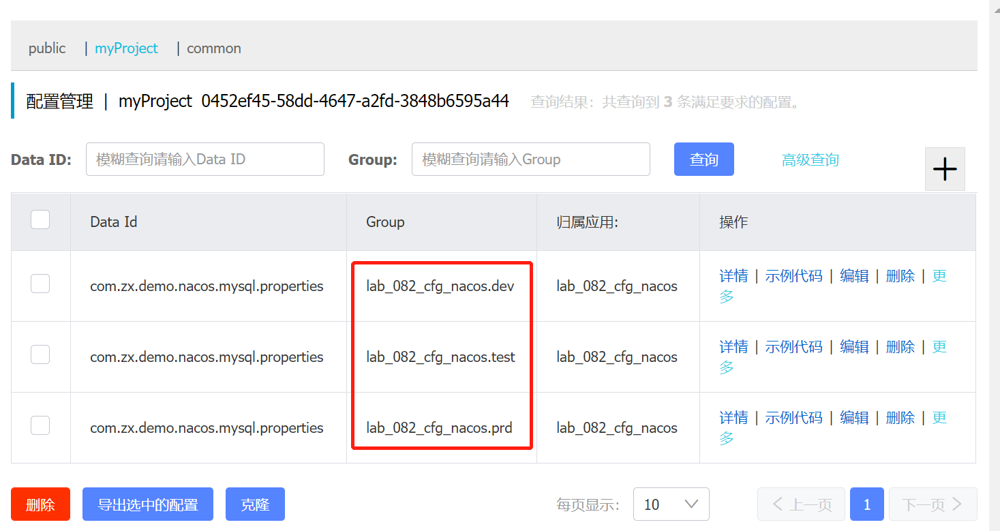
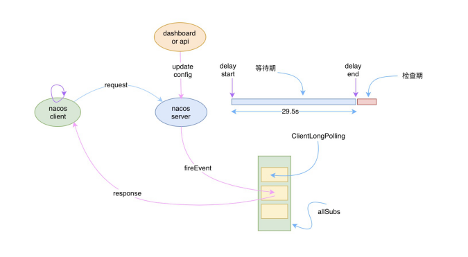
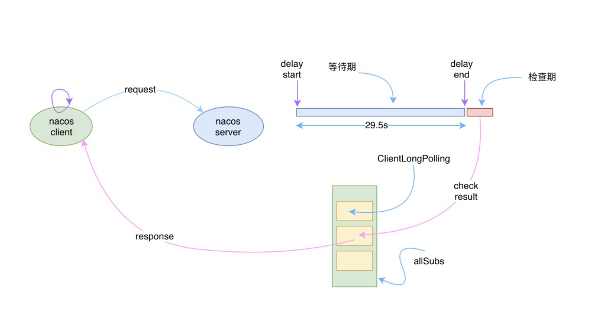

# nacos

## 1.基本介绍

根据业务架构、各业务系统本身需求与要求，特构建了动态配置&服务发现，其主要能解决的问题如下：

1. 动态配置服务：敏感配置数据的存储、频繁变更的配置数据(热更新)、生产环境批量推送到各个系统以及研发系统存在配置乱的问题；
2. 服务注册与发现；
3. dns服务管理；

- 官网：[https://nacos.io/zh-cn/](https://nacos.io/zh-cn/)
- 源码：[https://github.com/alibaba/nacos](https://github.com/alibaba/nacos)
- 官方文档： [https://nacos.io/zh-cn/docs/what-is-nacos.html](https://nacos.io/zh-cn/docs/what-is-nacos.html)
- 案例：[https://gitee.com/luckSnow/spring-boot-example/tree/master/lab_082_cfg_nacos](https://gitee.com/luckSnow/spring-boot-example/tree/master/lab_082_cfg_nacos)

教程：
- nacos安装与基础配置：[https://blog.csdn.net/qq_40523572/article/details/89364340](https://blog.csdn.net/qq_40523572/article/details/89364340)
- Nacos 高可用特性：[https://mp.weixin.qq.com/s/WipvefNF2a2Heru3BZV-3A](https://mp.weixin.qq.com/s/WipvefNF2a2Heru3BZV-3A)
- Nacos实现原理详细讲解：[https://mp.weixin.qq.com/s/zFqNe7TDD8am-_jOYX7PhQ](https://mp.weixin.qq.com/s/zFqNe7TDD8am-_jOYX7PhQ)
- 实现原理教材：[https://mp.weixin.qq.com/s/nbNEYn5YwK3rVo8CX4rb8A](https://mp.weixin.qq.com/s/nbNEYn5YwK3rVo8CX4rb8A)

## 2.安装

- 部署手册：[https://nacos.io/zh-cn/docs/deployment.html](https://nacos.io/zh-cn/docs/deployment.html)
- 集群部署手册：[https://nacos.io/zh-cn/docs/cluster-mode-quick-start.html](https://nacos.io/zh-cn/docs/cluster-mode-quick-start.html)
- 控制台：[https://nacos.io/zh-cn/docs/console-guide.html](https://nacos.io/zh-cn/docs/console-guide.html)
- 监控：[https://nacos.io/zh-cn/docs/monitor-guide.html](https://nacos.io/zh-cn/docs/monitor-guide.html)

部署方式：
- 单机模式 - 用于测试和单机试用。
- 集群模式 - 用于生产环境，确保高可用。
- 多集群模式 - 用于多数据中心场景。

可以使用内嵌的Derby数据库，也可以更换为mysql。 可以参考[nacos集群搭建](https://blog.csdn.net/qq_44027353/article/details/125828993)

## 3.使用技巧

### 3.1.用户管理

从这里开始，假设我们有一个项目，叫做myProject，这个项目归属的组为myGroup

我们可以创建一个用户，账号，密码都是myProject

### 3.2.命名空间

我们一般选择使用项目的名称为命名空间的名字。命名空间ID使我们经常使用的

### 3.3.角色管理

我们一般使用项目组为一个角色，目前nacos只支持一个角色绑定一个账号，还是太简单了。

### 3.4.权限管理

用来给角色分配操作资源的权限。

一个角色可以创建多个权限，用来分配权限。

### 3.5.配置管理

我们主要使用的功能。需要注意的配置，是data id 和
group。我们可以使用group去区分dev,test,prd。

DataId尽可能的设置成能够明显的区分出项目和具体的配置类型。\
注意：dataId的后缀为配置文件的类型，不能随意定义，比如.properties, .yml,
.json等

## 4.Nacos配置中心实现原理

https://www.jianshu.com/c/a43af0cc4698?order_by=added_at

Nacos 并不是通过推的方式将服务端最新的配置信息发送给客户端的，而是客户端维护了一个长轮询的任务，
定时去nacos拉取发生变更的配置信息，然后将最新的数据推送给 Listener 的持有者，也就是客户端。
其中有个MD5值就是用来校验服务端的值是否与客户端的一直。

由客户端主动拉取数据的优势：
1. 不用维护长链接了，减少相关资源的消耗，而且长链接需要考虑session是否过期的问题，参考zk通过心跳检测的方式处理。
2. nacos客户端只需定时发送无状态的http请求即可。

流程如下：
1. 客户端的请求到达服务端后，服务端将该请求加入到一个叫 allSubs 的队列中，等待配置发生变更时 DataChangeTask 主动去触发，并将变更后的数据写入响应对象，

2. 与此同时服务端也将该请求封装成一个调度任务去执行，等待调度的期间就是等待 DataChangeTask 主动触发的，
   如果延迟时间到了 DataChangeTask 还未触发的话，则调度任务开始执行数据变更的检查，然后将检查的结果写入响应对象

1. Nacos 客户端会循环请求服务端变更的数据，并且超时时间设置为30s，当配置发生变化时，请求的响应会立即返回，
   否则会一直等到 29.5s+ 之后再返回响应
2. Nacos 客户端能够实时感知到服务端配置发生了变化。
3. 实时感知是建立在客户端拉和服务端“推”的基础上，但是这里的服务端“推”需要打上引号，因为服务端和客户端直接本质上还是通过 
   http进行数据通讯的，之所以有“推”的感觉，是因为服务端主动将变更后的数据通过 http 的 response 对象提前写入了。

## 5.分别说下Nacos与Eureka

[https://blog.csdn.net/fly910905/article/details/100023415](https://blog.csdn.net/fly910905/article/details/100023415)

[https://www.cnblogs.com/skj0330insn/p/12057416.html](https://www.cnblogs.com/skj0330insn/p/12057416.html)

[https://blog.csdn.net/xc123_java/article/details/90200189](https://blog.csdn.net/xc123_java/article/details/90200189)
