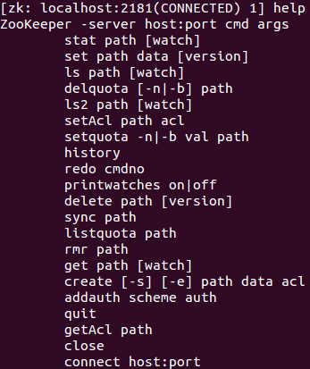
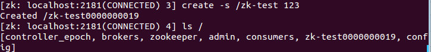
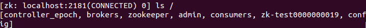
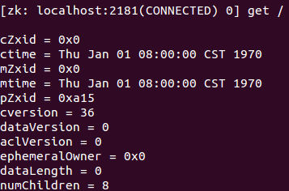
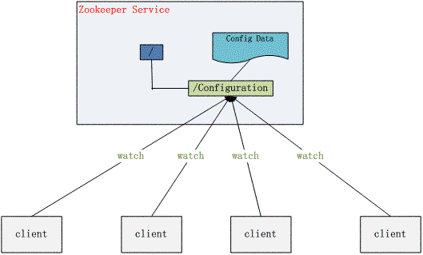
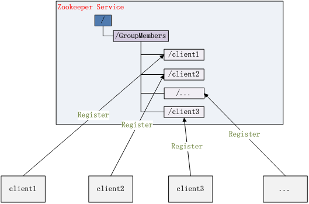

# zookeeper

- 官方：[https://zookeeper.apache.org/](https://zookeeper.apache.org/)
- 中文教程： [https://www.w3cschool.cn/zookeeper/](https://www.w3cschool.cn/zookeeper/)
- Zk原理目录：[https://www.cnblogs.com/leesf456/p/6239578.html](https://www.cnblogs.com/leesf456/p/6239578.html)
- zK简单介绍：[https://www.cnblogs.com/51life/p/10265864.html](https://www.cnblogs.com/51life/p/10265864.html)

源码研究：
- ZooKeeper源码研究系列（1）源码环境搭建：[https://my.oschina.net/pingpangkuangmo/blog/484955](https://my.oschina.net/pingpangkuangmo/blog/484955)
- ZooKeeper源码研究系列（2）客户端创建连接过程分析：[https://my.oschina.net/pingpangkuangmo/blog/486780](https://my.oschina.net/pingpangkuangmo/blog/486780)
- ZooKeeper源码研究系列（3）单机版服务器介绍：[https://my.oschina.net/pingpangkuangmo/blog/491673](https://my.oschina.net/pingpangkuangmo/blog/491673)
- ZooKeeper源码研究系列（4）集群版服务器介绍：[https://my.oschina.net/pingpangkuangmo/blog/495311](https://my.oschina.net/pingpangkuangmo/blog/495311)
- ZooKeeper源码研究系列（5）集群版建立连接过程：[https://my.oschina.net/pingpangkuangmo/blog/496136](https://my.oschina.net/pingpangkuangmo/blog/496136)

[ZooKeeper 核心通识](https://mp.weixin.qq.com/s/uustNtBOGvPOx4Q3oPFmSw)
## 1.介绍

名字的由来：在Apache的开源项目中有很多是以动物形象取名字的，比如，Tomcat、hive等。Zookeeper的工作就是协调这些动物工作。

### 1.1.关键概念

- 是一种分布式系统的协调框架。
- Zookeeper的数据模型是树结构，数据保存在内存中（数据保存所有的节点路径、节点数据、ACL信息等），并且Zookeeper也会定时将数据持久化到磁盘上（以事务日志与数据快照的方式）
- 可以帮助我们实现分布式系统中的配置中心、注册中心、分布式锁等。
- 天然支持高可用的集群，只要保证集群中的大部分服务器是可用即可（既可以选举出一个leader）

### 1.2.特性

- 顺序一致性，从同一个客户端发起的事务请求，最终将会严格地按照其发起顺序被应用到Zookeeper中去。
- 原子性，所有事务请求的处理结果在整个集群中所有机器上的应用情况是一致的，即整个集群要么都成功应用了某个事务，要么都没有应用。
- 单一视图，无论客户端连接的是哪个Zookeeper服务器，其看到的服务端数据模型都是一致的。
- 可靠性，一旦服务端成功地应用了一个事务，并完成对客户端的响应，那么该事务所引起的服务端状态变更将会一直被保留，除非有另一个事务对其进行了变更。
- 实时性，Zookeeper保证在一定的时间段内，客户端最终一定能够从服务端上读取到最新的数据状态


## 2.安装

### 2.1.下载

下载地址：http://www.apache.org/dyn/closer.cgi/zookeeper

下载zookeeper-3.4.9.tar.gz文件，解压即可，Zookeeper解压包是可以跨平台使用的，目录如下。

需要注意的是这里下载的版本尽量和程序中使用的zk版本保持一致。


```text
bin ---> 包括了linux和window的运行程序的运行目录
conf ---> zookeeper的配置zoo.cfg
contrib ---> 其他一些组件和发行版本
dist-maven ---> maven发布下的一些jar包
docs ---> 文档
lib ---> 库
recipe ---> 一些应用实例
src ---> zookeeper的源码，因为zookeeper是java写出来的
```

### 2.2.启动

打开bin目录，其中zkServer是zookeeper服务端，zkCli是客户端。 cmd是window平台使用的。sh是Mac和Linux平台使用的。


bin目录下常用的脚本解释
```text
zkCleanup　　清理Zookeeper历史数据，包括事务日志文件和快照数据文件
zkCli　　　　 Zookeeper的一个简易客户端
zkEnv　　　　设置Zookeeper的环境变量
zkServer　　 Zookeeper服务器的启动、停止、和重启脚本
```

1. windows环境双击zkServer.cmd。
2. Linux执行命令: ./zkServer.sh start。

注意：一般情况下启动服务的时候会出现闪退(window)或启动失败的现象。继续往下读操作完3后重新启动zk，即可。

### 2.3.修改配置文件

#### 2.3.1.Window平台

1. 打开 zkServer.cmd 进行编辑，在尾部加 pause, 如下图


2. 进入 conf 文件夹下，将 zoo_sample.cfg 文件复制一份修改为 zoo.cfg,
如下图。


3. 修改 zoo.cfg


#### 2.3.2.Linux和Mac平台

执行上面的2和3即可。（但是需要注意的是，所有配置的目录尽量不要有中文）

#### 2.3.3.中文目录

如果你非要使用中文目录的话，这里有一个比较简单的方式。

因为zookeeper的配置文件是zoo.cfg，我们需要了解都有哪几个地方使用到了这个文件。

第一步：java程序中，在启动zk的时候，会加载配置文件。这里使用的是Properties加载的。


Properties文件默认的文本编码是unicode，Java程序读取的时候会自动将unicode转为本地编码(一般在程序中都是UTF-8)。所以需要我们在zoo.cfg中写入unicode编码的中文。


比如zk的安装目录是， /media/zhangxue/工作空间/java/zookeeper-3.4.9

我想要将dataDir配置在/media/zhangxue/工作空间/java/zookeeper-3.4.9/zookeeper

我们在eclipse创建一个properties文件，我们把中文复制进去，eclipse自动帮我们转为

\\u5DE5\\u4F5C\\u7A7A\\u95F4

所以dataDir的配置如下。

dataDir=/media/zhangxue/\\u5DE5\\u4F5C\\u7A7A\\u95F4/java/zookeeper-3.4.9/zookeeper

这个操作保证的Java程序能正常的调用到配置文件，初始化zk。但是这还不能保证zk能正常启动。

第二步：在zk启动时，会校验目录是否存在(命令在zkServer.sh中)。


这个地方使用shell进行操作，shell进行编码比较麻烦。所以我在zoo.cfg中增加了一个配置

dataDirChinese=/media/zhangxue/工作空间/java/zookeeper-3.4.9/zookeeper

之后修改zkServer.sh中的dataDir为dataDirChinese。这样就保证执行shell脚本的时候能正常操作目录了。其他的中文路径配置同上。

之后的启动和验证继续往下读

### 2.4.客户端的命令操作

这个操作有点类似与redis的操作。

启动客户端： ./zkCli.sh -server 127.0.0.1:2181


#### 2.4.1.查看根节点的内容


#### 2.4.2.help

可以使用帮助命令help来查看客户端的操作



#### 2.4.3.创建节点

创建节点的时候只能一级一级的创建，

比如： create /a create /a/b 这两个命令是对的

Create /b/c/d 是错误的，会提示/b NodeNotExistsException

使用create命令，可以创建一个Zookeeper节点， 如

create [-s] [-e] path data acl

其中，-s或-e分别指定节点特性，顺序或临时节点，若不指定，则表示持久节点；acl用来进行权限控制。

① 创建顺序节点

使用create -s /zk-test 123命令创建zk-test顺序节点




可以看到创建的zk-test节点后面添加了一串数字以示区别。

② 创建临时节点

使用create -e /zk-temp 123命令创建zk-temp临时节点


临时节点在客户端会话结束后，就会自动删除，下面使用quit命令退出客户端


再次使用客户端连接服务端，并使用ls / 命令查看根目录下的节点




可以看到根目录下已经不存在zk-temp临时节点了。

③ 创建永久节点

使用create /zk-permanent 123命令创建zk-permanent永久节点


可以看到永久节点不同于顺序节点，不会自动在后面添加一串数字。

#### 2.4.4.读取节点

与读取相关的命令有ls 命令和get
命令，ls命令可以列出Zookeeper指定节点下的所有子节点，只能查看指定节点下的第一级的所有子节点；get命令可以获取Zookeeper指定节点的数据内容和属性信息。其用法分别如下

```text
ls path [watch]
get path [watch]
ls2 path [watch]
```

若获取根节点下面的所有子节点，使用ls /命令即可


若想获取根节点数据内容和属性信息，使用get /命令即可




也可以使用ls2 /命令查看


可以看到其子节点数量为8。

若想获取/zk-permanent的数据内容和属性，可使用如下命令：get /zk-permanent


可以看到其数据内容为123，还有其他的属性，之后会详细介绍。

#### 2.4.5.更新节点

使用set命令，可以更新指定节点的数据内容，用法如下

set path data [version]

其中，data就是要更新的新内容，version表示数据版本，如将/zk-permanent节点的数据更新为456，可以使用如下命令：set /zk-permanent 456


现在dataVersion已经变为1了，表示进行了更新。

#### 2.4.6.删除节点

使用delete命令可以删除Zookeeper上的指定节点，用法如下

delete path [version]

其中version也是表示数据版本，使用delete /zk-permanent命令即可删除/zk-permanent节点


可以看到，已经成功删除/zk-permanent节点。值得注意的是，若删除节点存在子节点，那么无法删除该节点，必须先删除子节点，再删除父节点。

#### 2.4.7.设置监听

当指定的znode或znode的子数据更改时，监视器会显示通知。你只能在 get
命令中设置watch。（ls和ls2也行）

get /path [watch] 1

例如：

get /FirstZnode 1

后面跟着的数字1，是监听的时间类型。*事件类型*

#### 2.4.8.其他命令

检查状态：stat /path

移除Znode：rmr /path（移除指定的znode并递归其所有子节点。只有在这样的znode可用的情况下才会发生）

### 2.5.命名规范

节点名称除下列限制外，可以使用任何unicode字符：

1. null字符(\\u0000)不能作为路径名的一部分；

2. 以下字符不能使用，因为它们不能很好地显示，或者以令人困惑的方式呈现:\\u0001 - \\u0019和\\u007F - \\u009F。

3. 不允许使用以下字符:\\ud800 - uf8fff， \\uFFF0 - uFFFF。

4. “.”字符可以用作另一个名称的一部分，但是“.”和“..”不能单独用于指示路径上的节点，因为ZooKeeper不使用相对路径。

下列内容无效:“/a/b/. / c”或“c / a / b / . . /”。

5. “zookeeper”是保留节点名。

### 2.6.基本服务命令

```text
启动         ./zkServer.sh start
查看状态     ./zkServer.sh status
重启         ./zkServer.sh restart
停止         ./zkServer.sh stop
启动客户端   ./zkCli.sh -server 127.0.0.1:2181
```

### 2.7.zoo.cfg配置信息

**tickTime**：这个时间是作为 Zookeeper 服务器之间或客户端与服务器之间维持心跳的时间间隔，也就是每个 tickTime
时间就会发送一个心跳。

**dataDir**：顾名思义就是 Zookeeper保存数据的目录，默认情况下，Zookeeper将写事务日志与数据快照都保存在这个目录里。

**dataLogDir**：顾名思义就是 Zookeeper保存事务日志的目录，可以单独设置事务日志目录

**clientPort**：这个端口就是客户端连接 Zookeeper 服务器的端口，Zookeeper会监听这个端口，接受客户端的访问请求。

**initLimit**：这个配置项是用来配置 Zookeeper接受客户端（这里所说的客户端不是用户连接 Zookeeper 服务器的客户端，
而是 Zookeeper 服务器集群中连接到 Leader 的 Follower 服务器）初始化连接时最长能忍受多少个心跳时间间隔数。
当已经超过 10 个心跳的时间（也就是 tickTime）长度后 Zookeeper 服务器还没有收到客户端的返回信息，
那么表明这个客户端连接失败。总的时间长度就是 5*2000=10 秒。

**syncLimit**：这个配置项标识 Leader 与 Follower 之间发送消息，请求和应答时间长度，最长不能超过多少个 tickTime
的时间长度，总的时间长度就是 2*2000=4 秒

**server.A=B:C:D** 其中 A 是一个数字，表示这个是第几号服务器；B 是这个服务器的 ip 地址；
C 表示的是这个服务器与集群中的 Leader 服务器交换信息的端口；
D 表示的是万一集群中的 Leader 服务器挂了，需要一个端口来重新进行选举，选出一个新的 Leader，而这个端口就是用来执行选举时服务器相互通信的端口。
如果是伪集群的配置方式，由于 B 都是一样，所以不同的 Zookeeper 实例通信端口号不能一样，所以要给它们分配不同的端口号。

**autopurge.purgeInterval**
这个参数指定了清理频率，单位是小时，需要填写一个1或更大的整数，默认是0，表示不开启自己清理功能。

**autopurge.snapRetainCount**
这个参数和上面的参数搭配使用，这个参数指定了需要保留的文件数目。默认是保留3个。

配置案例
```properties
# 服务器之间或客户端与服务器之间维持心跳的时间间隔
# tickTime以毫秒为单位。
tickTime=2000

# 集群中的follower服务器(F)与leader服务器(L)之间的初始连接心跳数
initLimit=10

#集群中的follower服务器与leader服务器之间请求和应答之间能容忍的最多心跳数
syncLimit=5

# 快照保存目录
# 不要设置为/tmp，该目录重新启动后会被自动清除
dataDir=D:/java/zookeeper-cluster/zookeeper-3.4.9-node1/dataDir

# 日志保存目录
dataLogDir=D:/java/zookeeper-cluster/zookeeper-3.4.9-node1/dataLogDir

# 客户端连接端口
clientPort=2181

# 客户端最大连接数。
# 根据自己实际情况设置，默认为60个
# maxClientCnxns=60
# 三个接点配置，格式为：
# server.服务编号=服务地址、LF通信端口、选举端口
server.1=127.0.0.1:2881:3881
server.2=127.0.0.1:2882:3882
server.3=127.0.0.1:2883:3883

# 保留最近20个事务日志和快照，默认关闭该功能
autopurge.snapRetainCount=20

# 保留近24个小时内事务日志和快照，默认关闭该功能
autopurge.purgeInterval=24
```

## 3.集群部署

[https://blog.csdn.net/zyq_2014/article/details/84608475](https://blog.csdn.net/zyq_2014/article/details/84608475)

[https://www.jianshu.com/p/1a99eebdf075](https://www.jianshu.com/p/1a99eebdf075)

### 3.1.配置zoo.cfg

配置很简单，只需要在所有的节点配置所有的配置信息即可

```properties
# server.服务编号=服务地址、LF通信端口、选举端口
server.1=10.129.205.242:28881:38881
server.2=10.129.205.242:28882:38882
server.3=10.129.205.242:28883:38883
```

### 3.2.创建myid

配置dataDir目录下配置myid， 内容为server后面的服务号

### 3.3.自定义脚本

Window集群启动日志
```shell
echo -------------------zk集群启动-------------------
start /d "D:\\java\\zookeeper-cluster\\zookeeper-3.4.9-node1\\bin" zkServer.cmd
start /d "D:\\java\\zookeeper-cluster\\zookeeper-3.4.9-node2\\bin" zkServer.cmd
start /d "D:\\java\\zookeeper-cluster\\zookeeper-3.4.9-node3\\bin" zkServer.cmd
```

Linux集群脚本。脚本命令切换为start status stop
```shell
echo -------------------zk集群启动-------------------
bash /usr/local/java/zookeeper-3.4.9-cluster/zookeeper-node1/bin/zkServer.sh start &
bash /usr/local/java/zookeeper-3.4.9-cluster/zookeeper-node2/bin/zkServer.sh start &
bash /usr/local/java/zookeeper-3.4.9-cluster/zookeeper-node3/bin/zkServer.sh start &
```

### 3.4.设置系统日志

zkEnv.sh

1.修改ZOO_LOG_DIR的配置


将"." 修改为"${ZOOKEEPER_PREFIX}/logs"


2.修改ZOO_LOG4J_PROP

将

ZOO_LOG4J_PROP="INFO,CONSOLE"

修改为：

ZOO_LOG4J_PROP="INFO,CONSOLE,ROLLINGFILE"

3.修改conf/log4j.properties文件

将

zookeeper.root.logger=INFO,ROLLINGFILE

修改为：

zookeeper.root.logger=INFO,CONSOLE,ROLLINGFILE

日志文件的格式还可以使用
```properties
log4j.appender.ROLLINGFILE.File=zookeeper.log
log4j.appender.ROLLINGFILE.DataPattern='.'yyyy-MM-dd-HH-mm
log4j.appender.ROLLINGFILE.Threshold=debug
log4j.appender.ROLLINGFILE.encoding=UTF-8
log4j.appender.ROLLINGFILE.Append=false
log4j.appender.ROLLINGFILE.layout=org.apache.log4j.PatternLayout
log4j.appender.ROLLINGFILE.layout.ConversionPattern= [%d{yyyy-MM-dd HH\\:mm\\:ss}]%-5p %c(line\\:%L) %x-%m%n
```

4.将修改的文件同步到其他节点即可

### 3.5.动态增减集群节点

https://blog.csdn.net/admin_15082037343/article/details/100060014

### 3.6.常见问题

- 查看状态时Error contacting service. It is probably not running

Windows不支持查看状态。Linux下，只要启动正常即可正常使用。

## 4.基本概念

### 4.1.Zk数据结构

#### 4.1.1.DataTree

DataTree是zk内存数据结构的核心。一个DataTree对象表示一个完成的数据结构。

#### 4.1.2.DataNode

DataNode是数据存储的最小单元。DataTree存储的数据主要就是DataNode。同时提供了对子节点操作的接口。

DataNode parent: 父节点的对象引用

byte data[]：节点数据的字节数组。

Long acl：Datatree的ReferenceCountedACLCache中使用Map<Long,
List<ACL>>缓存着所有DataNode的权限列表，这里的acl就是Map<Long,
List<ACL>>的Key。

StatPersisted stat：节点状态信息。

Set<String>
children：数据节点的子节点列表，这是只是节点Path的字符串路径，并且是相对路径。

数据量控制在1M以内。


StatPersisted保存的信息如下：


可以先看Zxid
```text
cZxid：创建该节点的zxid
mZxid：该节点的最后修改zxid
ctime：该节点的创建时间
mtime：该节点的最后修改时间
cversion：该节点的子节点变更次数
aclVersion：该节点的ACL（权限）变更次数
aphemeraOwner：临时节点所有者会话id，非临时的为0
pZxid：该节点的最后子节点修改zxid
dataVersion：该节点数据被修改的次数
dataLength：该节点数据长度
numChildren：子节点数
```

#### 4.1.3.ZKDatabase

是zk的内存数据库，管理zk所有会话、DataTree存储、事务日志等。

ZKDatabase负责向磁盘序列化快照文件，以及在启动的时候通过事务日志与快照文件恢复zk全部的内存数据库


其中FileTxnSnapLog提供了操作数据文件的接口


### 4.2.事务日志

#### 4.2.1.文件存储

事务日志保存在dataDir目录下。我们也可以为事务日志单独存储在一个目录下：dataLogDir。

在日志的目录下，zk会创建一个version-2的目录。这个目录用来确认当前事务日志格式的版本号。当zk的事务日志的格式发生变化的时候，会自动生成version-3、version-4、version-5等目录。用来控制版本。这些目录下的会跟着生成一些列大小一致的文件（64M）。

#### 4.2.2.查看日志文件

使用zk自带的工具查看日志: org.apache.zookeeper.server.LogFormatter

使用main方法，传入日志文件位置即可。


日志的内容如下


完成如下操作

(1) 创建/test_log节点，初始值为v1。

(2) 更新/test_log节点的数据为v2。

(3) 创建/test_log/c节点，初始值为v1。

(4) 删除/test_log/c节点。


(1) ZooKeeper Transactional Log File with dbid 0 txnlog format version 2
：是文件头信息，主要是事务日志的DBID和日志格式版本。

(2) ...session 0x159...0xcec createSession
30000：表示客户端会话创建操作。

(3) ...session 0x159...0xced create '/test_log,...
：表示创建/test_log节点，数据内容为#7631(v1)。

(4) ...session 0x159...0xcee setData
‘/test_log,...：表示设置了/test_log节点数据，内容为#7632(v2)。

(5) ...session 0x159...0xcef create
’/test_log/c,...：表示创建节点/test_log/c。

(6) ...session 0x159...0xcf0 delete
'/test_log/c：表示删除节点/test_log/c。

#### 4.2.3.事务日志写入

FileTxnLog负责维护事务日志对外的接口，包括事务日志的写入和读取等。Zookeeper的事务日志写入过程大体可以分为如下6个步骤。

(1)
确定是否有事务日志可写：当Zookeeper服务器启动完成需要进行第一次事务日志的写入，或是上一次事务日志写满时，都会处于与事务日志文件断开的状态，即Zookeeper服务器没有和任意一个日志文件相关联。因此在进行事务日志写入前，Zookeeper首先会判断FileTxnLog组件是否已经关联上一个可写的事务日志文件。若没有，则会使用该事务操作关联的ZXID作为后缀创建一个事务日志文件，同时构建事务日志的文件头信息，并立即写入这个事务日志文件中去，同时将该文件的文件流放入streamToFlush集合，该集合用来记录当前需要强制进行数据落盘的文件流。

(2)
确定事务日志文件是否需要扩容(预分配)：Zookeeper会采用磁盘空间预分配策略。当检测到当前事务日志文件剩余空间不足4096字节时，就会开始进行文件空间扩容，即在现有文件大小上，将文件增加65536KB(64MB)，然后使用"0"填充被扩容的文件空间。

(3)
事务序列化：对事务头和事务体的序列化，其中事务体又可分为会话创建事务、节点创建事务、节点删除事务、节点数据更新事务等。

(4)
生成Checksum：为保证日志文件的完整性和数据的准确性，Zookeeper在将事务日志写入文件前，会计算生成Checksum。

(5)
写入事务日志文件流：将序列化后的事务头、事务体和Checksum写入文件流中，此时并为写入到磁盘上。

(6)
事务日志刷入磁盘：由于步骤5中的缓存原因，无法实时地写入磁盘文件中，因此需要将缓存数据强制刷入磁盘。

#### 4.2.4.日志截断（异常日志处理）

在Zookeeper运行过程中，可能出现非Leader记录的事务ID比Leader上大，这是非法运行状态。此时，需要保证所有机器必须与该Leader的数据保持同步，即Leader会发送TRUNC命令给该机器，要求进行日志截断，Learner收到该命令后，就会删除所有包含或大于该事务ID的事务日志文件。

### 4.3.数据快照 - snapshot

数据快照是Zookeeper数据存储中非常核心的运行机制，数据快照用来记录Zookeeper服务器上某一时刻的全量内存数据内容，并将其写入指定的磁盘文件中。

#### 4.3.1.文件存储

与事务文件类似，Zookeeper快照文件也可以指定特定磁盘目录，通过dataDir属性来配置。若指定dataDir为/home/admin/zkData/zk_data，则在运行过程中会在该目录下创建version-2的目录，该目录确定了当前Zookeeper使用的快照数据格式版本号。在Zookeeper运行时，会生成一系列文件。

#### 4.3.2.数据快照

FileSnap负责维护快照数据对外的接口，包括快照数据的写入和读取等，将内存数据库写入快照数据文件其实是一个序列化过程。针对客户端的每一次事务操作，Zookeeper都会将他们记录到事务日志中，同时也会将数据变更应用到内存数据库中，Zookeeper在进行若干次事务日志记录后，将内存数据库的全量数据Dump到本地文件中，这就是数据快照。其步骤如下

(1)确定是否需要进行数据快照：每进行一次事务日志记录之后，Zookeeper都会检测当前是否需要进行数据快照，考虑到数据快照对于Zookeeper机器的影响，需要尽量避免Zookeeper集群中的所有机器在同一时刻进行数据快照。采用过半随机策略进行数据快照操作。

(2)切换事务日志文件：表示当前的事务日志已经写满，需要重新创建一个新的事务日志。

(3)创建数据快照异步线程：创建单独的异步线程来进行数据快照以避免影响Zookeeper主流程。

(4) 获取全量数据和会话信息：从ZKDatabase中获取到DataTree和会话信息。

(5)生成快照数据文件名：Zookeeper根据当前已经提交的最大ZXID来生成数据快照文件名。

(6)数据序列化：首先序列化文件头信息，然后再对会话信息和DataTree分别进行序列化，同时生成一个Checksum，一并写入快照数据文件中去

### 4.4.日志清理

配置实现自动清理日志：[https://blog.csdn.net/reblue520/article/details/52311314](https://blog.csdn.net/reblue520/article/details/52311314)

### 4.5.server id（myid）

集群中的每台ZK
server都会有一个用于惟一标识自己的id，有两个地方会使用到这个id：myid文件和zoo.cfg文件中

- myid文件存储在dataDir目录中，指定了当前server的server id

- 在zoo.cfg文件中，根据server
    id，配置了每个server的ip和相应端口。Zookeeper启动的时候，读取myid文件中的server
    id，然后去zoo.cfg 中查找对应的配置

### 4.6.Zxid

ZooKeeper节点状态改变的每一个操作都将使节点接收到一个Zxid格式的时间戳，并且这个时间戳全局有序。也就是说，每个对节点的改变都将产生一个唯一的Zxid。如果Zxid1的值小于Zxid2的值，那么Zxid1所对应的事件发生在Zxid2所对应的事件之前。实际上，ZooKeeper的每个节点维护者两个Zxid值，为别为：cZxid、mZxid。

（1）cZxid： 是节点的创建时间所对应的Zxid格式时间戳。

（2）mZxid：是节点的修改时间所对应的Zxid格式时间戳。

现实中Zxid是一个64位的数字，高32位是epoch用来标识Leader关系是否改变，每次一个Leader被选出来，它都会有一个新的epoch。低32位是个递增计数。

## 5.文件系统与通知机制

zookeeper=文件系统+通知机制

### 5.1.节点类型

文件系统：Zookeeper维护一个类似文件系统的数据结构


这个是通过文件系统创建出来的四种类型。每个子目录项如NameService都被称为znoed,和文件系统一样，我们能够自由的增加、删除znode,在znode下增加、删除子znode,唯一不同的在于znode是可以存储数据的。

有7种类型的znode（有三种数3.5+增加的）

1、PERSISTENT--持久化目录节点

客户端与zookeeper断开连接后，该节点依旧存在

2、PERSISTENT_SEQUENTIAL-持久化顺序编号目录节点

客户端与zookeeper断开连接后，该节点依旧存在，只是Zookeeper给该节点名称进行顺序编号

3、EPHEMERAL-临时目录节点

客户端与zookeeper断开连接后，该节点被删除

4、EPHEMERAL_SEQUENTIAL-临时顺序编号目录节点

客户端与zookeeper断开连接后，该节点被删除，只是Zookeeper给该节点名称进行顺序编号

5、CONTAINER：容器节点，用于Leader、Lock等特殊用途，当容器节点不存在任何子节点时，容器将成为服务器在将来某个时候删除的候选节点。（3.5+新增的类型）

6、PERSISTENT_WITH_TTL：带TTL（time-to-live，存活时间）的永久节点，节点在TTL时间之内没有得到更新并且没有孩子节点，就会被自动删除。（3.5+新增的类型）

7、PERSISTENT_SEQUENTIAL_WITH_TTL：带TTL（time-to-live，存活时间）和单调递增序号的永久节点，节点在TTL时间之内没有得到更新并且没有孩子节点，就会被自动删除。（3.5+新增的类型）

### 5.2.通知机制

客户端注册监听它关心的目录节点，当目录节点发生变化（数据改变、被删除、子目录节点增加删除）等，zookeeper会通知客户端。

当客户端对ZooKeeper的某个事件上添加Watcher时，客户端会保持一个EventThread线程接收事件通知，根据绑定的Event来触发Watcher执行process方法。Watcher是一次性的，只会触发一次。

#### 5.2.1.事件类型
```java
/**
 * Enumeration of types of events that may occur on the ZooKeeper
 * 可能发生在ZooKeeper上的事件的类型枚举
 */
public enum EventType {
    None (-1),
    NodeCreated (1),
    NodeDeleted (2),
    NodeDataChanged (3),
    NodeChildrenChanged (4);
}

```
#### 5.2.2.事件状态
```java
 /**
 * Enumeration of states the ZooKeeper may be at the event
 * ZooKeeper可能在事件中所处的状态的枚举
 */
public enum KeeperState {
    /** Unused, this state is never generated by the server */
    @Deprecated
    Unknown(-1),

    /** The client is in the disconnected state - it is not connected
     * to any server in the ensemble. */
    Disconnected(0),

    /** Unused, this state is never generated by the server */
    @Deprecated
    NoSyncConnected(1),

    /** The client is in the connected state - it is connected
     * to a server in the ensemble (one of the servers specified
     * in the host connection parameter during ZooKeeper client
     * creation). */
    SyncConnected(3),

    /**
     * Auth failed state
     */
    AuthFailed(4),

    /**
     * The client is connected to a read-only server, that is the
     * server which is not currently connected to the majority.
     * The only operations allowed after receiving this state is
     * read operations.
     * This state is generated for read-only clients only since
     * read/write clients aren't allowed to connect to r/o servers.
     */
    ConnectedReadOnly(5),

    /**
     * SaslAuthenticated: used to notify clients that they are SASL-authenticated,
     * so that they can perform Zookeeper actions with their SASL-authorized permissions.
     */
    SaslAuthenticated(6),

    /** The serving cluster has expired this session. The ZooKeeper
     * client connection (the session) is no longer valid. You must
     * create a new client connection (instantiate a new ZooKeeper
     * instance) if you with to access the ensemble. */
    Expired(-112);
}    
```

## 6.Zk的用途

### 6.1.命名服务

命名服务也是分布式系统中比较常见的一类场景。在分布式系统中，通过使用命名服务，客户端应用能够根据指定名字来获取资源或服务的地址，提供者等信息。被命名的实体通常可以是集群中的机器，提供的服务地址，远程对象等等——这些我们都可以统称他们为名字（Name）。其中较为常见的就是一些分布式服务框架中的服务地址列表。通过调用ZK提供的创建节点的API，能够很容易创建一个全局唯一的path，这个path就可以作为一个名称。

### 6.2.数据发布与订阅(配置中心)

程序总是需要配置的，如果程序分散部署在多台机器上，要逐个改变配置就变得困难。发布者将将配置信息发布到zk的节点上，订阅者可以动态获得消息。这样就实现了消息的统一管理，动态更新。

一般的场景是：
程序启动的时候，到zk主动获取一次消息，并在节点上注册一个watcher，以后每次配置有更新的时候，都会实时通知到订阅的客户端，从来达到获取最新配置信息的目的。这样的场景适合数据量很小，但是数据更新可能会比较快的需求。



### 6.3.负载均衡

这里说的负载均衡是指软负载均衡。在分布式环境中，为了保证高可用性，通常同一个应用或同一个服务的提供方都会部署多份，达到对等服务。而消费者就须要在这些对等的服务器中选择一个来执行相关的业务逻辑，其中比较典型的是消息中间件中的生产者，消费者负载均衡。

### 6.4.集群管理与master选举

所谓集群管理无在乎两点：是否有机器退出和加入、选举master。

对于第一点，所有机器约定在父目录GroupMembers下创建临时目录节点，然后监听父目录节点的子节点变化消息。一旦有机器挂掉，该机器与
zookeeper的连接断开，其所创建的临时目录节点被删除，所有其他机器都收到通知：某个兄弟目录被删除。新机器加入
也是类似，所有机器收到通知：新兄弟目录加入，highcount又有了。

对于第二点，我们稍微改变一下，所有机器创建临时顺序编号目录节点，每次选取编号最小的机器作为master就好。



### 6.5.分布式通知/协调

ZooKeeper中特有watcher注册与异步通知机制，能够很好的实现分布式环境下不同系统之间的通知与协调，实现对数据变更的实时处理。使用方法通常是不同系统都对ZK上同一个znode进行注册，监听znode的变化（包括znode本身内容及子节点的），其中一个系统update了znode，那么另一个系统能够收到通知，并作出相应处理

### 6.6.分布式锁

有了zookeeper的一致性文件系统，锁的问题变得容易。锁服务可以分为两类，一个是保持独占，另一个是控制时序。

对于第一类，临时节点，我们将zookeeper上的一个znode看作是一把锁，通过createznode的方式来实现。所有客户端都去创建
/distribute_lock
节点，最终成功创建的那个客户端也即拥有了这把锁。厕所有言：来也冲冲，去也冲冲，用完删除掉自己创建的distribute_lock
节点就释放出锁。

对于第二类，临时有序节点 /distribute_lock
已经预先存在，所有客户端在它下面创建临时顺序编号目录节点，和选master一样，编号最小的获得锁，用完删除。（生产中推荐这种方式）


由于Watcher是一次性的，所以触发后还要重新注册。所以效率不高。

获取到锁的客户端执行结束后删除该节点，此时会触发下一个客户端的监听器去获取锁

- 多个客户端去创建节点时，ZooKeeper会自动根据请求到达的时间顺序对节点进行编号

- 每个客户端需要判断自己所创建的节点是否是所有子节点中最小的一个，如果是则说明获取到锁，可以直接执行方法，否则监听上一个节点等待锁。

如果客户端在创建节点后由于某些原因断开了与ZooKeeper的连接，则该客户端的Session失效时会删除其创建的节点，并进行通知

若持有/lock/000的客户端还在执行方法，持有/lock/001的客户端突然断开连接，为了不让后面的节点收到错误的通知顺序，要尽可能保证在该客户端之前获取锁的所有客户端都能执行完成，需适当加大SessionTimeOut的值来延长节点的存活时间。

### 6.7.队列管理

两种类型的队列：

1、同步队列，当一个队列的成员都聚齐时，这个队列才可用，否则一直等待所有成员到达。

2、队列按照 FIFO 方式进行入队和出队操作。

第一类，在约定目录下创建临时目录节点，监听节点数目是否是我们要求的数目。

第二类，和分布式锁服务中的控制时序场景基本原理一致，入列有编号，出列按编号。

终于了解完我们能用zookeeper做什么了，可是作为一个程序员，我们总是想狂热了解zookeeper是如何做到这一点的，单点维护一个文件系统没有什么难度，可是如果是一个集群维护一个文件系统保持数据的一致性就非常困难了。

### 6.8.实践应用

Zk作为Hadoop的子项目，现在已经是成熟的可商用的框架。

#### 6.8.1.HA高可用

比如 hadoop、hdfs、yarn 等很多大数据系统，都选择基于 zookeeper 来开发 HA
高可用机制。

具体来说就是一个重要进程一般会做主备两个，主进程挂了立马通过 zookeeper 感知到切换到备用进程。


#### 6.8.2.dubbo

Dubbo2.7的使用方式（非常简单的使用）

生产者，zk保存生产者的列表，

```shell
[zk: localhost:2181(CONNECTED) 3] ls /dubbo/org.demo.api.chapter_07_failfast.UserFacade/providers
[
	dubbo://172.20.25.108:29012/org.demo.api.chapter_07_failfast.UserFacade?anyhost=true&application=dubbo-demo-provider&dubbo=2.6.0&generic=false&group=dubbo-demo-group&interface=org.demo.api.chapter_07_failfast.UserFacade&methods=get\insert&owner=zhangxue&pid=13156&revision=1.0.0&side=provider&timeout=5000&timestamp=1578295038734&version=1.0.0, 
	dubbo://172.20.25.108:29011/org.demo.api.chapter_07_failfast.UserFacade?anyhost=true&application=dubbo-demo-provider&dubbo=2.6.0&generic=false&group=dubbo-demo-group&interface=org.demo.api.chapter_07_failfast.UserFacade&methods=get\insert&owner=zhangxue&pid=12272&revision=1.0.0&side=provider&timeout=5000&timestamp=1578295031440&version=1.0.0
]
```

这个目录下的value = null。

```shell
get /dubbo/org.demo.api.chapter_07_failfast.UserFacade/providers/dubbo%3A%2F%2F172.20.25.108%3A29012%2Forg.
demo.api.chapter_07_failfast.UserFacade%3Fanyhost%3Dtrue%26application%3Ddubbo-demo-provider%26dubbo%3D2.6.0%26generic%3Dfalse%26group%3Ddubbo-demo-group%26interface%3Dorg.demo.api.chapter_07_failfast.UserFacade%26methods%3Dget%2Cinsert%26owner%3Dzhangxue%26pid%3D13156%26revision%3D1.0.0%26side%3Dprovider%26timeout%3D5000%26timestamp%3D1578295038734%26version%3D1.0.0
```

## 7.集群原理

### 7.1.集群搭建

这里选择3个服务器，各自安装一台zk节点

1.  下载，解压

2.  删除无用的文件(也可以不删除)

cd zookeeper-3.4.9

rm -rf *.xml *.txt dist-maven/ docs/ src/ *.asc *.md5 *.sha1

3.  进入conf文件，修改文件名为zoo.cfg

cd conf/

mv zoo_sample.cfg zoo.cfg

4.  修改zk的配置（详细看zoo.cfg）

```properties
tickTime=2000
initLimit=5
syncLimit=2
dataDir=/home/yqzk/zk_data
clientPort=2181
server.1=127.0.0.1:2800:3800
server.2=127.0.0.1:2801:3801
server.3=127.0.0.1:2802:3802
```

5.  创建dataDir对应的目录

mkdir /home/zkdata

//必须向/home/zkdata 路径下创建myid文件，同时写入内容1
，命令如下，这个1就是serverID。

echo 1 > /home/zkdata/myid

6.  到这里一个节点就配置好了，通过scp
    把zk的安装目录和数据目录拷贝到其他服务上

scp -r zookeeper-3.4.9/ zkdata/ ip2:/home

scp -r zookeeper-3.4.9/ zkdata/ ip3:/home

scp之后需要将myid文件中的数据分别改为2和3.这就是各自几点的serverID，作为节点在集群中的唯一标识。

7.  启动服务

    到各自的目录下执行命令即可

./zkServer.sh start

8.  查看状态

./zkServer.sh status


### 7.2.Zk角色

Zk集群中有四种角色：在集群中，每个节点都有且只能有一个角色。

- leader 就是我们说的mater

- follower就是我们说的slave

- Observer 观察者， 可以选择配置与不配置。

- Client
    客户端，请求的发起者。（客户端既可以是从集群外发起，也可以从集群内部发起）


节点的状态存在四种：

- looking:    寻找leader状态。这个状态是当集群没有leader的时候，会进入这个状态
- following: follower的状态，接受leader节点的同步和指挥
- leading: leader的状态
- observing: Observer的状态，表示当前服务器的observing

比如针对事务决议的表决，通过投票表决。过半同意事务就更新。

如果从性能角度来看，参与投票的机器越少越好。（但至少满足过半投票人数）

5台机器最多有2个观察者,
3台机器最多有1个观察者。这样的话，剩余的节点一旦出现异常，集群不可用。

所以zookeeper引入了observer观察者的状态

observer观察者的特点

1.不参与投票

2.观察和监听投票结果，然后去更新状态。

如何来设置观察者：

1.在要变成观察者的机器的zk的配置文件

加：peerType=observer

server.3=ip:2888:3888:observer

2.更改其他机器的配置文件，加：

server.3=ip:2888:3888:observer

引入观察者，一是通过减少投票机器数量，从而提高性能。

此外，也可以从降低每一台zk服务器的负载压力角度来看，能够降低负载压力。

因为观察者如果宕机，影响也不大，因为不是核心人员。

但是注意，引入观察者，从性能角度来看，是好东西。但是如果从集群高可用的角度来看，要
慎用。(5台机器,2个观察者,1个follower挂掉,此时不满足过半统一机制,选不出leader,集群无法启动)

此外再注意，比如3台机器，把两台配置成观察者，这么做是不行的，因为不满足过半机制，
所以选不出leader,导致集群启动不了

### 7.3.数据复制

Zk作为一个给集群提供一致性的数据服务，在集群中需要做到所有的节点之间进行数据复制。这样的好处有：

- 容错:一个节点出现异常了，不会导致整个集群都通知工作，别的节点可以节点异常节点的工作

- 提高系统的扩展性：使用均衡负载，通过增加节点，通过集群的负载能力

- 提高性能：让客户端访问最近的节点，提供用户的访问速度

    数据复制集群主要可以分成两类

    写主：对数据的写操作交给leader节点，读取数据的时候没有限制，可以读取任意节点的数据。这种情况下客户端需要对读与写进行区别，俗称读写分离。

    写任意：对数据的写操作可以提交给任意的节点，这种情况下，客户端对集群节点的角色与变化是透明的。

    对于zk来说，它采用的方式是写任意。通过增加机器，它的读吞吐能力与响应能力扩展性非常好，而写，随着机器的增多吞吐能力可能下降（这也是它建立observer的原因），而响应能力则取决于具体实现方式，是延迟复制保持最终一致性，还是立即复制快速响应。

### 7.4.投票策略

Zk投票主要使用到3个数据

- 节点选举出来的leader的serverID
- Zxid
- selectionEpoch

Epoch判断，自身 logicEpoch 与 SelectionEpoch 判断：大于、小于、等于。

优先检查 ZXID 。 ZXID 比较大（也就是最新启动）的服务器优先作为 Leader。

如果 ZXID 相同，那么就比较 myid 。 myid 较大的服务器作为 Leader 服务器。

Ps: leader 发现没有超过半数的follower跟随自己。集群便不会对外提供服务了。

比如集群有3个节点，一个leader，2个follower，一旦2个follower出现问题的话，集群就不可用了。

所以在生产环境，最少应该使用4个节点搭建集群。

### 7.5.过半选举算法

zk提供了四种选择机制,分别为

```text
0 基于UDP的LeaderElection
1 基于UDP的FastLeaderElection
2 基于UDP和认证的FastLeaderElection
3 基于TCP的FastLeaderElection
```

在3.4.10版本中,默认值为3,可通过electionAlg配置项设置,另外三种算法被弃用了,并且有计划在之后的版本中将它们彻底删除.

FastLeaderElection 和 AuthLeaderElection 是类似的选举算法，唯一区别是后者加入了认证信息。

### 7.6.脑裂问题

脑裂问题出现在集群中leader死掉，follower选出了新leader而原leader又复活了的情况下，因为ZK的过半机制是允许损失一定数量的机器而扔能正常提供给服务，当leader死亡判断不一致时就会出现多个leader。

解决方案：

1. zk节点的数量以3,5,7奇数部署，方便出现问题后进行过半机制选举
2. zk采用epoch机制，每次选举的时候自增1，当进群通讯的时候发现epoch不一致，比如自己的epoch小，自己就会由leader变成follower
```java
// If notification > current, replace and send messages out
if (n.electionEpoch > logicalclock.get()) {
    logicalclock.set(n.electionEpoch);
    recvset.clear();
    if (totalOrderPredicate(n.leader, n.zxid, n.peerEpoch, getInitId(), getInitLastLoggedZxid(), getPeerEpoch())) {
        updateProposal(n.leader, n.zxid, n.peerEpoch);
    } else {
        updateProposal(getInitId(), getInitLastLoggedZxid(), getPeerEpoch());
    }
    sendNotifications();
} else if (n.electionEpoch < logicalclock.get()) {
    if (LOG.isDebugEnabled()) {
        LOG.debug(
            "Notification election epoch is smaller than logicalclock. n.electionEpoch = 0x" + Long.toHexString(n.electionEpoch)
            + ", logicalclock=0x" + Long.toHexString(logicalclock.get()));
    }
    break;
} else if (totalOrderPredicate(n.leader, n.zxid, n.peerEpoch, proposedLeader, proposedZxid, proposedEpoch)) {
    updateProposal(n.leader, n.zxid, n.peerEpoch);
    sendNotifications();
}
```

## 8.Java API

ZooKeeper有一个绑定Java和C的官方API。Zookeeper社区为大多数语言（.NET，python等）提供非官方API，比较出名的是zkClient与curator。使用ZooKeeper
API，应用程序可以连接，交互，操作数据，协调，最后断开与ZooKeeper集合的连接。

ZooKeeper API具有丰富的功能，以简单和安全的方式获得ZooKeeper集群的所有功能。ZooKeeper API提供同步和异步方法。

客户端与zk服务的*过程*

```java
org.apache.zookeeper.server.DataNode：数据节点
org.apache.zookeeper.server.DataTree：数据节点树，管理着DataNode，负责触发watch通知。
org.apache.zookeeper.server.ZKDatabase：管理sessions，DataTree，Committed logs，在Zookeeper启动时从磁盘读取快照和提交日志以后创建。
org.apache.zookeeper.server.RequestProcessor：用于处理所有的客户端请求，Zookeeper采用调用链的设计，最后一个请求处理者为org.apache.zookeeper.server.FinalRequestProcessor，FinalRequestProcessor管理着ZKDatabase。
org.apache.zookeeper.server.ZooKeeperServer：ZK服务核心类，控制所有的节点操作流程，跟踪会话等。每种角色创建的该实例不同：单机模式为ZooKeeperServer实例。Quorum模式中Leader角色为LearnerZooKeeperServer，Follower角色为FollowerZooKeeperServer，Observer角色为ObserverZooKeeperServer。
org.apache.zookeeper.server.ServerCnxnFactory：管理着所有的客户端连接。主要有两种实现：org.apache.zookeeper.server.NIOServerCnxnFactory和org.apache.zookeeper.server.NettyServerCnxnFactory。

引用关系：
ServerCnxnFactory 持有ZookeeperServer，ZookeeperServer持有ZKDatabase和RequestProcessor链表，ZKDatabase持有DataTree，DataTree持有DataNode集合。
```
eeperServer持有ZKDatabase和RequestProcessor链表，ZKDatabase持有DataTree，DataTree持有DataNode集合。

### 8.1.创建会话

```java
Zookeeper(String connectString,int sessionTimeout,Watcher watcher)
Zookeeper(String connectString,int sessionTimeout,Watcherwatcher,boolean canBeReadOnly)
Zookeeper(String connectString,int sessionTimeout,Watcher watcher,long sessionId,byte[] sessionPasswd)
Zookeeper(String connectString,int sessionTimeout,Watcher watcher,long sessionId,byte[] sessionPasswd,boolean canBeReadOnly)
```

参数说明：

connectString -- host:port[，host:port][basePath]
指定的服务器列表，多个host:port之间用英文逗号分隔。还可以可选择的指定一个基路径，如果指定了一个基路径，则所有后续操作基于这个及路径进行。

sessionTimeOut --
会话超时时间。以毫秒为单位。客户端和服务器端之间的连接通过心跳包进行维系，如果心跳包超过这个指定时间则认为会话超时失效。

watcher -- 指定默认观察者。如果为null表示不需要观察者。

canBeReadOnly --
是否支持只读服务。只当一个服务器失去过半连接后不能再进行写入操作时，是否继续支持读取操作。略

sessionId、SessionPassword -- 会话编号 会话密码，用来实现会话恢复。

注意，整个创建会话的过程是异步的，构造方法会在初始化连接后即返回，并不代表真正建立好了一个会话，此时会话处于"CONNECTING"状态。

当会话真正创建起来后，服务器会发送事件通知给客户端，只有客户端获取到这个通知后，会话才真正建立。

### 8.2.创建节点

```java
String create(final String path,byte data[],List<ACL> acl,CreateMode createMode);//同步方式创建
void create(final String path,byte data[],List<ACL> acl,CreateMode createMode,StringCallback cb,Object ctx);//异步方式创建
```

参数说明:

path 要创建的数据节点的路径

data [] 节点创建时初始数据内容

acl 节点acl安全策略

createMode 创建模式

PERSISTENT 持久

PERSISTENT_SEQUENTIAL 持久顺序

EPHEMERAL 临时

EPHEMERAL_SEQUENTIAL 临时顺序

cb 回调接口

ctx 传递对象，用来在回调方法中使用 通常是个上下文对象

注意：不支持递归创建，即不能在无父节点的情况下创建出子节点

尝试创建已经存在的节点将失败并抛出异常

在不需要进行任何权限控制时，只需传入Ids.OPEN_ACL_UNSAFE即可

### 8.3.删除节点

```java
public void delete(final String path,int version)
public void delete(final String path,int version,VoidCallback cb,Object ctx)
```

注意：无法删除存在子节点的节点，即如果要删除一个节点，必须要先删除其所有子节点

### 8.4.读取子节点

```java
getChildren
//同步方式
List<String> getChildren(final String path,Watcher watcher)
List<String> getChildren(String path,boolean watch)
List<String> getChildren(final String path,Watcher watcher,Stat stat)
List<String> getChildren(String path,boolean watch,Stat stat)
//异步方式
void getChildred(final String path,Watcher watcher,ChildrenCallback cb,Object ctx)
void getChildred(String path,boolean watch,ChildrednCallback cb,Object ctx)
void getChildred(final String path,Watcher watcher,Children2Callback cb,Object ctx)
void getChildred(String path,boolean watch,Children2Callback cb,Object ctx)
```

参数说明

path 要创建的数据节点的路径

watcher观察者，一旦在本子节点获取之后，子节点列表发生变更，服务器端向客户端发送消息，触发watcher中的回调。注意，仅仅是通知而已，如果需要新的子节点列表，需要自己再次去获取。允许传入null。

watch表明是否需要注册一个Watcher。为true则通知默认到默认watcher，如果为false则不使用

cb 回掉函数

ctx 上下文对象

stat 指定数据节点的状态信息。用法是在接口中传入一个旧的stat变量，该stat变量会在方法执行过程中，被来自服务端响应的新stat对象替换。

### 8.5.读取数据
```java
getData
//同步方式
byte [] getData(final String path,Watcher watcher, Stat stat)
byte [] getData(String path,boolean watch, Stat stat)
//异步方式
void getData(final String path,Watcher watcher, DataCallback cb,Object ctx)
void getData(String path,boolean watch, DataCallback cb,Object ctx)
```

可以通过注册Watcher进行监听，一旦该节点数据被更新会通知客户端

### 8.6.更新数据

```java
//同步方式
Stat setData(final String path,byte data[],int version)//version可以传入-1，表明要基于最新版本进行更新操作
//异步方式
void setData(final String path,byte data[],int version,StatCallback cb,Object ctx)
```

### 8.7.检查节点是否存在
```java
//同步方式
public Stat exists(final String path,Watcher watcher)
public Stat exists(String path,boolean watch)
//异步方式
public Stat exists(final String path,Watcher watcher,StatCallback cb,Object ctx)
public Stat exists(String path,boolean watch,StatCallback cb,Object ctx)
```

可以通过注册Watcher进行监听，一旦节点被创建、删除、数据被更新都会通知客户端

### 8.8.zookeeper权限控制

addAuthInfo(String schema,byte [] auth)

参数说明：

schema 权限模式，可以是world auth digest ip super，我们使用digest

byte[] auth
权限控制标识，由"foo:123".getByte()方式组成，后续操作只有auth值相同才可以进行

注意删除操作，如果在增加节点时指定了权限，则对于删除操作，认为权限加在了子节点上，删除当前结点不需要权限，删除子节点需要权限。

## 9.工作原理

Zk客户端工作流程中使用到的组件

写                                  写入过程由leader节点处理。leader将写入请求转发到所有节点，并等待节点的回复。要么全部成功，要么全部失败

读                                  客户端只连接一个节点，所以读取的时候只读当前练级的节点，不涉及到集群的问题

数据库副本（replicated database）   每个zk节点都有自己的数据库，每个数据库在zk集群的数据同步复制下，所有节点的数据都是一直到（数据的最终一致性）

leader                              负责集群全部的写操作的处理

follower                            负责从客户端接收到写的操作，并转发给leader

请求处理器（request process）       只在leader节点，管理所有从follower转发过来的请求

原子广播（atomic broadcasts）       负责将leader的写操作广播到所有的follower


### 9.1.客户端连接的过程 

- Zk启动之后，当我们开启一个zk客户端的时候，我们可以从集群中任意一个节点创建连接，这个节点既可以是leader也可以是follower。
- 当客户端确定要连接哪个节点之后，创建连接，节点会分配一个会话ID，并返回给客户端，表示连接成功。
- 如果客户端在一定的时间内，没有接受到节点返回的会话ID，客户端就去连接别的节点。
- 客户端连接成功后，按照一个规律的时间间隔，向节点发送心跳检查，确保连接不会失效。否则zk会将会话ID过期。

客户端创建连接之后，会只连接一个节点。除非这个节点断开，客户端才会去连接别的节点

### 9.2.客户端写操作的过程

客户端想要保存数据的时候，会将请求发送到已经创建好连接的节点。

节点收到写操作的请求后，会将请求转发到leader节点

Leader节点收到请求后，使用原子广播，通知所有的follower的进行写的操作的请求。

当大部分的follower都返回成功的响应后，表示写操作成功了，否则失败。这个大多数节点指的是Quorum，表示当前全部存活有效的follower。

### 9.3.集群启动过程

服务器1启动,此时只有它一台服务器启动了,它发出去的Vote没有任何响应,所以它的选举状态一直是LOOKING状态；

服务器2启动,它与最开始启动的服务器1进行通信,互相交换自己的选举结果,由于两者都没有历史数据,所以id值较大的服务器2胜出,但是由于没有达到超过半数以上的服务器都同意选举它(这个例子中的半数以上是3),所以服务器1,2还是继续保持LOOKING状态.

服务器3启动,根据前面的理论，分析有三台服务器选举了它,服务器3成为服务器1,2,3中的老大,所以它成为了这次选举的leader.

服务器4启动,根据前面的分析，理论上服务器4应该是服务器1,2,3,4中最大的,但是由于前面已经有半数以上的服务器选举了服务器3,所以它只能接收当小弟的命了.

服务器5启动,同4一样,当小弟.

假设5台中挂了2台（3、4），其中leader也挂掉：

leader和follower间有检查心跳，需要同步数据
Leader节点挂了，整个Zookeeper集群将暂停对外服务，进入新一轮Leader选举

1）服务器1、2、5发现与leader失联，状态转为looking，开始新的投票

2）服务器1、2、5分别开始投票并广播投票信息，自身Epoch自增；

3) 服务器1、2、5分别处理投票，判断出leader分别广播

4）根据投票处理逻辑会选出一台（2票过半）

5）各自服务器重新变更为leader、follower状态

6）重新提供服务

### 9.4.Zab协议与Paxos算法

Zab（zookeeper atomic broadCast） 是基于Paxos进行裁剪出来的

ZAB（ZooKeeper Atomic Broadcast 原子广播） 协议是为分布式协调服务 ZooKeeper 专门设计的一种支持崩溃恢复的原子广播协议。 
在 ZooKeeper 中，主要依赖 ZAB 协议来实现分布式数据一致性，基于该协议，ZooKeeper 实现了一种主备模式的系统架构来保持集群中各个副本之间的数据一致性。

Zab 协议可以分为以下阶段：
- Phase 0，Leader 选举（Leader Election)。一个节点只要求获得半数以上投票，就可以当选为准 Leader；
- Phase 1，发现（Discovery）。准 Leader 收集其他节点的数据信息，并将最新的数据复制到自身；
- Phase 2，同步（Synchronization）。准 Leader 将自身最新数据复制给其他落后的节点，并告知其他节点自己正式当选为 Leader；
- Phase 3，广播（Broadcast）。Leader 正式对外服务，处理客户端写请求，对消息进行广播。当收到一个写请求后，它会生成 Proposal 广播给各个 Follower 节点，一半以上 Follower 节点应答之后，Leader 再发送 Commit 命令给各个 Follower，告知它们提交相关提案；

关于 ZAB 中的两种模式：
- 崩溃恢复：当整个服务框架在启动过程中，或是当 Leader 服务器出现网络中断、崩溃退出与重启等异常情况时，
  ZAB 协议就会进人恢复模式并选举产生新的Leader服务器。 
  当选出 leader ,并且完成了上面 Phase 2 的同步过程，就退出崩溃恢复模式
- 消息广播：当准 Leader 将自身最新数据复制给其他落后的节点，并告知其他节点自己正式当选为 Leader。
  这时候就可以进入广播模式，当有客户端进行数据写入操作的时候，就可以通过广播模式通知所有的 follower 了。 
  当集群中已经有过半的Follower服务器完成了和Leader服务器的状态同步，那么整个服务框架就可以进入消息广播模式了。


## 10.curator

### 10.1.介绍

Curator是Netflix公司开源的一个Zookeeper客户端，2013年2月提出与2013年3月被正式录取进入孵化器，2013年9月毕业于顶级项目。
与Zookeeper提供的原生客户端相比，Curator的抽象层次更高，简化了Zookeeper客户端的开发量。

-  Framework：    简化Zookeeper的使用,提供了一系列高阶API, 在Zookeeper集群连接的管理, 以及重连操作上化繁为简.
-  Receipts：    实现了一些ZooKeeper的基本"模式", 该实现基于Curator Framework.
-  Utilities：  一系列工具
-  Client：       ZooKeeper类的替代
-  Errors：       定义了curator如何处理错误,连接问题,可恢复的异常等.
-  Extensions：   实现了一些Zookeeper文档中提及的通用模式.

版本支持

Curator 2.x.x - ZooKeeper 3.4.x, ZooKeeper 3.5.x

Curator 3.x.x - 只兼容ZooKeeper 3.5.x; 支持dynamic reconfiguration等新feature.

### 10.2.基础功能

#### 10.2.1.介绍

既然Maven包叫做curator-recipes，那说明Curator有它独特的“菜谱”：
- 锁：包括共享锁、共享可重入锁、读写锁等。
- 选举：Leader选举算法。
- Barrier：阻止分布式计算直至某个条件被满足的“栅栏”，可以看做JDK 的 Concurrent包中Barrier的分布式实现。
- 缓存：前面提到过的三种Cache及监听机制。
- 持久化结点：连接或Session终止后仍然在Zookeeper中存在的结点。
- 队列：分布式队列、分布式优先级队列等。

```java
// 首先, 获取一个连接实例(CuratorFramework). 对于每个集群,只需要创建一个实例
CuratorFrameworkFactory.newClient(zookeeperConnectionString, retryPolicy);

// 这里我们需要指定一个retryPolicy, 这里用一个指数补偿策略:
RetryPolicy retryPolicy = new ExponentialBackoffRetry(1000, 3);
CuratorFramework client = CuratorFrameworkFactory.newClient(zookeeperConnectionString, retryPolicy);
client.start();

// 然后我们就可以调用Zookeeper的一系列操作了, 比如创建:
// 这里如果出现了连接问题,curator也会帮你自动重连        
client.create().forPath("/my/path", myData);
```

Curator的Maven依赖如下，一般直接使用curator-recipes就行了，如果需要自己封装一些底层些的功能的话，
例如增加连接管理重试机制等，则可以引入curator-framework包。

#### 10.2.2.Pom依赖

```xml
<dependency>
  <groupId>org.apache.curator</groupId>
  <artifactId>curator-recipes</artifactId>
  <version>2.7.0</version>
</dependency>
```

#### 10.2.3.Client操作

利用Curator提供的客户端API，可以完全实现上面原生客户端的功能。值得注意的是，Curator采用流式风格API。

#### 10.2.4.监听器

Curator提供了三种Watcher(Cache)来监听结点的变化：

Path Cache：监视一个路径下1）孩子结点的创建、2）删除，3）以及结点数据的更新。产生的事件会传递给注册的PathChildrenCacheListener。

Node Cache：监视一个结点的创建、更新、删除，并将结点的数据缓存在本地。

Tree Cache：Path Cache和Node Cache的“合体”，监视路径下的创建、更新、删除事件，并缓存路径下所有孩子结点的数据。

#### 10.2.5.分布式锁

分布式编程时，比如最容易碰到的情况就是应用程序在线上多机部署，于是当多个应用同时访问某一资源时，就需要某种机制去协调它们。例如，现在一台应用正在rebuild缓存内容，要临时锁住某个区域暂时不让访问；又比如调度程序每次只想一个任务被一台应用执行等等。

下面的程序会启动两个线程t1和t2去争夺锁，拿到锁的线程会占用5秒。运行多次可以观察到，有时是t1先拿到锁而t2等待，有时又会反过来。Curator会用我们提供的lock路径的结点作为全局锁，这个结点的数据类似这种格式：[_c_64e0811f-9475-44ca-aa36-c1db65ae5350-lock-0000000005]，每次获得锁时会生成这种串，释放锁时清空数据。

#### 10.2.6.Leader选举

当集群里的某个服务down机时，我们可能要从slave结点里选出一个作为新的master，这时就需要一套能在分布式环境中自动协调的Leader选举方法。
Curator提供了LeaderSelector监听器实现Leader选举功能。同一时刻，只有一个Listener会进入takeLeadership()方法，
说明它是当前的Leader。注意：当Listener从takeLeadership()退出时就说明它放弃了“Leader身份”，
这时Curator会利用Zookeeper再从剩余的Listener中选出一个新的Leader。
autoRequeue()方法使放弃Leadership的Listener有机会重新获得Leadership，如果不设置的话放弃了的Listener是不会再变成Leader的。


## 11.面试题

### 11.1.为什么规则要求 可用节点数量 > 集群总结点数量/2 ？

注意:这里的节点个数是配置zoo.conf中的server.id的个数，项目启动后数量就是确定了的。和节点存活的数量无关。

如果不这样限制，在集群出现脑裂的时候，可能会出现多个子集群同时服务的情况（即子集群各组选举出自己的leader），
这样对整个zookeeper集群来说是紊乱的。

换句话说，如果遵守上述规则进行选举，即使出现脑裂，集群最多也只能回出现一个子集群可以提供服务的情况（能满足节点数量>
总结点数量/2 的子集群最多只会有一个）。所以要限制 可用节点数量 >
集群总结点数量/2 。

### 11.2.Zookeeper集群节点数量为什么要是奇数个？

首先需要明确zookeeper选举的规则：leader选举，要求 可用节点数量 > 总节点数量/2 。注意 是 > , 不是 ≥。

注意:这里的节点个数是配置zoo.conf中的server.id的个数，项目启动后数量就是确定了的。和节点存活的数量无关。

采用奇数个的节点主要是出于两方面的考虑：

- 防止由脑裂造成的集群不可用。

首先，什么是脑裂？集群的脑裂通常是发生在节点之间通信不可达的情况下，集群会分裂成不同的小集群，小集群各自选出自己的master节点，导致原有的集群出现多个master节点的情况，这就是脑裂。

下面举例说一下为什么采用奇数台节点，就可以防止由于脑裂造成的服务不可用：

(1) 假如zookeeper集群有 5
个节点，发生了脑裂，脑裂成了A、B两个小集群：（推荐生产环境使用5个节点）

  (a) A ： 1个节点 ，B ：4个节点 ， 或 A、B互换

  (b) A ： 2个节点， B ：3个节点， 或 A、B互换

  可以看出，上面这两种情况下，A、B中总会有一个小集群满足 可用节点数量
> 总节点数量/2。所以zookeeper集群仍然能够选举出leader ，
仍然能对外提供服务，只不过是有一部分节点失效了而已。

(2) 假如zookeeper集群有4个节点，同样发生脑裂，脑裂成了A、B两个小集群：

  (a) A：1个节点 ， B：3个节点，  或 A、B互换

  (b) A：2个节点 ， B：2个节点

  可以看出，情况(a) 是满足选举条件的，与（1）中的例子相同。
但是情况(b) 就不同了，因为A和B都是2个节点，都不满足可用节点数量 >
总节点数量/2 的选举条件， 所以此时zookeeper就彻底不能提供服务了。

综合上面两个例子可以看出： 在节点数量是奇数个的情况下，
zookeeper集群总能对外提供服务（即使损失了一部分节点）；如果节点数量是偶数个，会存在zookeeper集群不能用的可能性（分裂成两个均等的子集群的时候，集群完全不可用）。

在生产环境中，如果zookeeper集群不能提供服务，那将是致命的 ，
所以zookeeper集群的节点数一般采用奇数个。

- 在容错能力相同的情况下，奇数台更节省资源。

leader选举，要求可用节点数量 > 总节点数量/2。注意 是 > , 不是 ≥。

举两个例子：

(1) 假如zookeeper集群1 ，有3个节点，3/2=1.5 ,
即zookeeper想要正常对外提供服务（即leader选举成功），至少需要2个节点是正常的。换句话说，3个节点的zookeeper集群，允许有一个节点宕机。

(2) 假如zookeeper集群2，有4个节点，4/2=2 ,
即zookeeper想要正常对外提供服务（即leader选举成功），至少需要3个节点是正常的。换句话说，4个节点的zookeeper集群，也允许有一个节点宕机。

那么问题就来了， 集群1与集群2都有 允许1个节点宕机
的容错能力，但是集群2比集群1多了1个节点。在相同容错能力的情况下，本着节约资源的原则，zookeeper集群的节点数维持奇数个更好一些。

### 11.3.Zookeeper集群能保证数据的一致性吗？为什么？

zab与选举：[https://www.cnblogs.com/ZhuChangwu/p/11619270.html](https://www.cnblogs.com/ZhuChangwu/p/11619270.html)

[https://blog.csdn.net/aa518189/article/details/101172247](https://blog.csdn.net/aa518189/article/details/101172247)

Zab协议：[https://mp.weixin.qq.com/s/k0zAExTvMsrugCaNJxs7hQ](https://mp.weixin.qq.com/s/k0zAExTvMsrugCaNJxs7hQ)

主要是atomic broadcast(Zab协议的作用)

- 使用一个单独的进程,保持leader和Learner之间的socket通信,阅读源码这个Thread就是learnerHandler,任何写请求都将由Leader在集群中进行原子广播事务

- 保证了全部的变更序列在全局被顺序引用,写操作中都需要先check然后才能写,比如我们向create
    /a/b 它在创建b时,会先检查a存在否?
    而且,事务性的request存在于队列中,先进先出,保证了他们之间的顺序

    Zab协议原理

- 选举: 在Follower中选举中一个Leader

- 发现: Leader中会维护一个Follower的列表并与之通信

- 同步: Leader会把自己的数据同步给Follower,
    做到多副本存储,体现了CAP的A和P 高可用和分区容错

- 广播:
    Leader接受Follower的事务Proposal,然后将这个事务性的proposal广播给其他learner

注意：zk和Redis一样都是纯内存的操作，所有写操作的整个过程比较复杂，但是响应的时间却还是很快的。

而且leader是接收到大于n/2的follower
ack命令就算完毕，这其实只是一个单调一致性，并非强一致性

### 11.4.zookeeper如何实现负载均衡的？（具体连接哪一个zookeeper服务器的选择）

[https://www.cnblogs.com/aspirant/p/8994227.html#top](https://www.cnblogs.com/aspirant/p/8994227.html#top)

### 11.5.你能说说Zookeeper实现注册中心的原理是怎样的吗？

以dubbo为例子，生产者启动的时候在zk上注册信息：/dubbo/{sercice}/providers/[服务路径...多个]（dubbo默认临时节点）

在zookeeper中，进行服务注册，实际上就是在zookeeper中创建了一个znode节点，该节点存储了该服务的IP、端口、调用方式(协议、序列化方式)等。该节点承担着最重要的职责，它由服务提供者(发布服务时)创建，以供服务消费者获取节点中的信息，从而定位到服务提供者真正网络拓扑位置以及得知如何调用。RPC服务注册、发现过程简述如下：

- 服务提供者启动时，会将其服务名称，ip地址注册到配置中心。

- 服务消费者在第一次调用服务时，会通过注册中心找到相应的服务的IP地址列表，并缓存到本地，以供后续使用。当消费者调用服务时，不会再去请求注册中心，而是直接通过负载均衡算法从IP列表中取一个服务提供者的服务器调用服务。

    
    

- 当服务提供者的某台服务器宕机或下线时，相应的ip会从服务提供者IP列表中移除。同时，注册中心会将新的服务IP地址列表发送给服务消费者机器，缓存在消费者本机。

- 当某个服务的所有服务器都下线了，那么这个服务也就下线了。

- 同样，当服务提供者的某台服务器上线时，注册中心会将新的服务IP地址列表发送给服务消费者机器，缓存在消费者本机。

- 服务提供方可以根据服务消费者的数量来作为服务下线的依据。

### 11.6.分布式服务集群主节点宕机，如何保证整体服务可用？

zk为其他系统提供集群服务，能提供其master选举的作用。（这个选举和zk自己的选举是不一样的，也是使用zk文件目录的特性）

这里的分布式服务指的是Hadoop、kafka、HBASE等服务。可以使用zk创建临时有序znode的方式进行控制。

比如：znode的path是/leader/sq。当集群心跳检测，发现master宕机了，就开始创建znode，/leader/sq00001，/leader/sq00002......，最后可以选择序号最小的最为master。

### 11.7.【FGA】Leader 挂了之后，重新启动这个leader的节点状态是什么？

Follower状态，同步leader的数据。Epoch的值发生了变化。

### 11.8.【FGA】要是因为网络问题呢？ Leader 还有数据没有同步呢，那这些数据改怎么办？

Zookeeper集群"脑裂"问题：
[https://www.cnblogs.com/kevingrace/p/12433503.html](https://www.cnblogs.com/kevingrace/p/12433503.html)

假死的leader恢复后，进行写操作，别的节点校验epoch值，旧的节点会被拒绝写的操作，别被通知已经重新选举过了，这是旧的leader修改自己的状态并同步最新的数据。

### 11.9.多线程存在线程安全的问题，分布式多进程下这样的问题如何解决？

分布式锁，可以使用zk、Redis、数据库实现。

各自的实现方式..........

### 11.10.Zookeeper中FastLeaderElection算法的选举机制是怎样的？

[https://www.jianshu.com/p/81bc7bd26ae8](https://www.jianshu.com/p/81bc7bd26ae8)

关键：
Zxid就是事务id,这个是全局唯一且递增的，所有在恢复选举的时候，使用zxid最大的为leader是为了保证数据的一致性。因为事务的传播，是以超过半数成功为标准的。

启动时选举：

比如：集群中有三个服务，分别是S1,S2,S3,他们各自的myid是 1,2,3

第一步：每个服务各自产生一个投票，投票的格式是（myid,
zxid）。第一张投票，每个服务选的都是自己。

比如S1(1,0), S2(2,0), S3(3,0)

第二步：接受各个服务的投票。每个节点都有这三张投票，需求校验投票是否是本轮的投票，以及是否是来自looking状态节点的投票

第三步：处理投票。每个节点拿到这三张投票的时候，分别与自己的投票进行对比。

- 先检验zxid，zxid大的是leader

- 要是所有的zxid都是一样的话，比较myid，myid大的是leader

    比如上面的例子就是：这个时候s1会将自己的投票变成(3,0)，s2的投票也变成(3,0)，s3不变。

第四步：各个节点统计所有的投票，如果有投票超过半数的话，那他就是leader。没有的话重新投票

第五步：修改几点服务的状态，从looking变成following与leader。

服务运行期间发生选举：

如果运行期间服务发生网络问题、宕机等，所有的非observer节点会变成looking状态，并开始选举。

### 11.11.分布式RPC服务框架中，如何做到客户端无感知，服务端自动上下线的？

zookeeper提供了“心跳检测”功能，它会定时向各个服务提供者发送一个请求（实际上建立的是一个
socket
长连接），如果长期没有响应，服务中心就认为该服务提供者已经“挂了”，并将其剔除，比如100.19.20.02这台机器如果宕机了，那么zookeeper上的路径就会只剩/HelloWorldService/1.0.0/100.19.20.01:16888。

服务消费者会去监听相应路径（/HelloWorldService/1.0.0），一旦路径上的数据有任务变化（增加或减少），zookeeper都会通知服务消费方服务提供者地址列表已经发生改变，从而进行更新。

更为重要的是zookeeper
与生俱来的容错容灾能力（比如leader选举），可以确保服务注册表的高可用性。

使用 zookeeper 作为注册中心时，客户端订阅服务时会向 zookeeper
注册自身；主要是方便对调用方进行统计、管理。但订阅时是否注册 client
不是必要行为，和不同的注册中心实现有关，例如使用 consul 时便没有注册。

### 11.12.Zookeeper的Watch机制可以监听几类事件？

可以监听ZNode的create和delete事件，本ZNode数据变化事件以及本ZNode的子节点变化的事件。并且事件注册之后只能触发一次，触发之后需要重新注册事件。

### 11.13.Zookeeper工作原理

Zookeeper
的核心是原子广播，这个机制保证了各个Server之间的同步。实现这个机制的协议叫做Zab协议。Zab协议有两种模式，它们分别是恢复模式（选主）和广播模式（同步）。当服务启动或者在leader崩溃后，Zab就进入了恢复模式，当领导者被选举出来，且大多数Server完成了和
leader的状态同步以后，恢复模式就结束了。状态同步保证了leader和Server具有相同的系统状态

### 11.14.zookeeper负载均衡和nginx负载均衡区别

zk的负载均衡是可以调控，nginx只是能调权重，其他需要可控的都需要自己写插件；但是nginx的吞吐量比zk大很多，应该说按业务选择用哪种方式

### 11.15.Zk使用中存在什么问题

- 客户端创建临时接口后，客户端发生gc、网络问题、卡顿等，导致session失效。数据缺失。

- Zk集群运行中进行主从选举，会造成短暂的服务不可用。10s左右。这就是注册中心选择CP还是AP的问题。依赖zk的服务越多，zk的压力越大，zk需要的节点越多，zk出现问题后恢复的时间越长。

阿里为什么不用 ZK
做服务发现？：[https://mp.weixin.qq.com/s/0NcsKVtwLVUlgtzX0vUk-A](https://mp.weixin.qq.com/s/0NcsKVtwLVUlgtzX0vUk-A)


