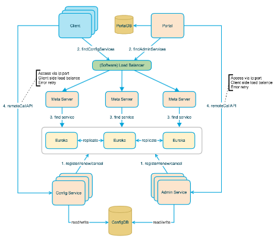
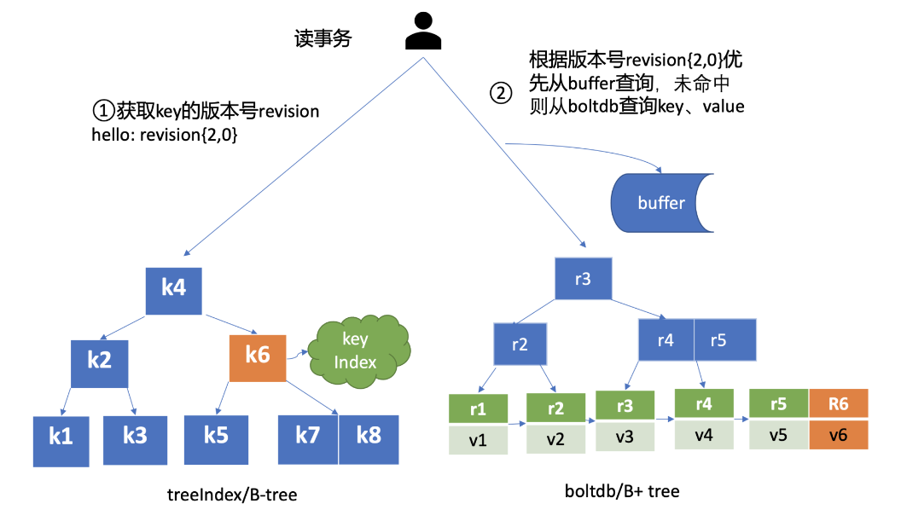

# 1.注册中心&配置中心

- [注册中心ZooKeeper、Eureka、Consul 、Nacos对比](https://blog.csdn.net/fly910905/article/details/100023415)
- [主流微服务注册中心浅析和对比](https://developer.aliyun.com/article/698930)

- zk、etcd、consul等本身算是一种KV存储，但是具备了很多特性，同时可以作为配置中心和注册中心使用。
- nacos，本身设计成配置中心和注册中心，内部的实现原理是两套。
- eureka，只能作为注册中心使用。提供的功能太过单一
- Apollo，本身设计成配置中心。

## 注册中心

### 1.常见注册中心

- zookeeper 注册量可以到20K
- Eureka 注册量可以到30K。
- consul
- nacos 注册量可以到200K

|                 | Nacos                      | Eureka      | Consul            | CoreDNS    | Zookeeper  |
| ----------------- | ---------------------------- | ------------- | ------------------- | ------------ | ------------ |
| 一致性协议      | CP+AP                      | AP          | CP                | —         | CP         |
| 健康检查        | TCP/HTTP/MYSQL/Client Beat | Client Beat | TCP/HTTP/gRPC/Cmd | —         | Keep Alive |
| 服务注册&发现   | 支持                       | 支持        | 支持              | 支持       | 支持       |
| 服务治理        | 支持                       | 不支持      | 不支持            | 支持       | 不支持     |
| 负载均衡策略    | 权重 metadata/Selector     | Ribbon      | Fabio             | RoundRobin | —         |
| 雪崩保护        | 有                         | 有          | 无                | 无         | 无         |
| 自动注销实例    | 支持                       | 支持        | 不支持            | 不支持     | 支持       |
| 访问协议        | TCP/HTTP/DNS               | HTTP        | HTTP/DNS          | DNS        | TCP        |
| 监听支持        | 支持                       | 支持        | 支持              | 不支持     | 支持       |
| 多数据中心      | 支持                       | 支持        | 支持              | 不支持     | 不支持     |
| 跨注册中心同步  | 支持                       | 不支持      | 支持              | 不支持     | 不支持     |
| SpringCloud集成 | 支持                       | 支持        | 支持              | 不支持     | 不支持     |
| Dubbo集成       | 支持                       | 不支持      | 不支持            | 不支持     | 支持       |
| K8S集成         | 支持                       | 不支持      | 支持              | 支持       | 不支持     |
| 多语言能力      | 支持                       | 支持        | 支持              | 不支持     | 支持的不好 |
| watch 支持      | 支持                       | 不支持      | 支持              | 支持       | 支持       |

时效性：

- zk，时效性更好，注册或者是挂了，一般秒级就能感知到
- eureka，默认配置非常糟糕，服务发现感知要到几十秒，甚至分钟级别
  上线一个新的服务实例，到其他人可以发现他，极端情况下，可能要1分钟的时间，ribbon去获取每个服务上缓存的eureka的注册表进行负载均衡
  服务故障，隔60秒才去检查心跳，发现这个服务上一次心跳是在60秒之前，隔60秒去检查心跳，超过90秒没有心跳，才会认为他死了。
  30秒会更新缓存，30秒其他服务才会来拉取最新的注册表。三分钟都过去了，如果你的服务实例挂掉了，此时别人感知到，可能要两三分钟的时间，一两分钟的时间，很漫长
- nacos。2.X以前的架构设计参考了eureka，服务发现速度稍慢。2.X之后使用了rpc协议，服务感知是实时的。

容量：
- zk，不适合大规模的服务实例，因为服务上下线的时候，需要瞬间推送数据通知到所有的其他服务实例
  所以一旦服务规模太大，到了几千个服务实例的时候，会导致网络带宽被大量占用
- eureka，也很难支撑大规模的服务实例，因为每个eureka实例都要接受所有的请求，实例多了压力太大，扛不住，也很难到几千服务实例
  之前dubbo技术体系都是用zk当注册中心，spring cloud技术体系都是用eureka当注册中心这两种是运用最广泛的

watch支持:就是客户单监听服务端的变化情况。
- zk 通过订阅监听来实现（服务端主动推送）
- eureka，不支持，客户端主动发送心跳检测并拉取实例信息，有时间延迟。
- nacos， 2.X以前通过http长轮询的方式。2.X之后通过rpc实时通讯。

适用场景:
- zk：    通用性强，基于CP，不适合大规模集群使用，尽可能不要使用，dubbo服务推荐使用nacos。
- eureka：不具备隔离性，适合小规模部署使用，特别是单个微服务内部使用，禁止作为公共服务使用。
- nacos:  性能卓越、功能性强、具备用户和隔离性，运行时同时支持CP和AP，可以用于大规模生产环境。

### 2.我们对于注册中心的诉求

1.注册中心的高可用诉求

问：CAP中注册中心一定要保证的是谁？
是分区容错性（P）。分布式服务依赖网络进行节点连通，在遇到任何网络分区故障时，仍然需要能够保证系统可以对外提供服务（一致性 或可用性的服务），
除非是整个网络环境都发生了故障。我们不允许当节点间通信出现故障时，被孤立节点都不能提供服务。最简单的，可以让所有节点拥有所有数据。
但是我们对于注册中心的可用性诉求，要比数据一致性要大的多。也可以说，生产环境，我们是无法容忍注册中心无法保证可用性。这对实际生产的影响是灾难性的。

2.注册中心的容灾诉求

在实践中，注册中心不能因为自身的任何原因破坏服务之间本身的可连通性。所以，如果整个注册中心宕机了呢？
因为，zk只能存在一个leader，Leader是所有写操作的入口，所有zk是无法实现跨机房、跨地域容灾的。

3.服务规模、容量的增长

互联网的发展，有一定的偶发性，现在的节点上限、带宽能满足业务发展，1年后也能满足么? 3年后呢？

当扛不住后，ZK能水平扩展么？

### 3.事故案例

- 2015年JD 大促时由Zookeeper引发服务的全链路雪崩

zookeeper实现的是CP原则。当在Leader选举过程中或一些极端情况下，整个服务是不可用的。

原因：大促期间由于秒杀活动多，增加了很多服务节点。这个时候zk的某个节点挂了或者zk相关的网络被打满了，导致zk开始选举了。
出现部分服务不可用的问题，负责人开始重启服务，想要连接上zk，导致服务不断的重试连接zk。选举变得更慢。
用户请求开始向正常的服务上打，导致正常的服务扛不住陆续崩掉，直到所有的服务都不可用。

### 4.自研注册中心注意哪些

既然要自研注册中心了 那么肯定要开发其对应的客户端以及服务端， 两端都要考虑各自的东西

1.客户端

- 服务拉取：每次肯定不是全量拉取，这个时候你就要思考服务端有可能提供一个最近的变更队列，供客户端拉取。并且一定要有一个用于校验拉取增量数据之后数据是否完整的指标数据，用于校验数据是否有异常，异常则做一次全量拉取。
- 心跳发送：告诉服务端自己是否存活进行服务的一个续约。
- 服务下线：进行服务下线，修改运行状态的标记位，当然这个标记位要保证其可见性。

2.服务端

- 服务注册：要对java并发包的拥有着深刻的理解，在服务注册表一定一定要注意读写并发控制，既要保证线程安全，同时也要降低锁的争用，最大限度保证其性能。
- 对所注册服务的健康检查：在单位时间内，如果所注册服务没进行服务的续约，则要将该服务下线。
- 集群同步：要根据自己实际的业务需求，制定合适的集群架构方案，在这个前提下，在制定合适的数据传输方案，保证吞吐量。

还有就是要考虑，注册中心与主流技术框架兼容性。

现在很多新兴注册中心，还在挑战路由、环境隔离、多地部署、

## 配置中心

### 1.为什么使用配置中心

集中管理、动态更新、环境隔离、安全性、版本控制、可扩展性、版本控制和审计，从而简化应用的配置管理，提高系统的可靠性和灵活性。

- 本地配置，使用properties、yml等
- 配置中心，nacos、Apollo、Spring Cloud Config 等

### 2.如何设计配置中心

[springboot配置中心](https://code2life.top/2021/05/31/0061-spring-boot-dynamic-config/)

配置中心是微服务系统必不可少的组件之一，乍一看好像没多少技术含量，很多人角色配置中心就是一个kv存储，可是，真的是这样吗？
以Java Spring技术栈为例，主流的配置中心有阿里的Nacos、携程的Apollo、以及Spring Cloud Config Server。我们拆解一下其中共通的技术点：

服务端：
- 认证和权限控制：某个服务可以拿到哪些Key？人员的增删改查权限如何控制？
- 存储层的选型：文件系统，Git仓库，数据库？
- 安全性：传输加TLS，密钥需要落盘加密，本身用来加密密钥的密钥如何安全存储？
- 高可用、数据一致性：多实例部署，甚至跨区域同步，进而又带来分布式存储一致性问题，如何解决？
- 版本控制：修改记录需要保留，随时可能回退到历史版本，另外，灰度版本的配置隔离如何实现？
- 即时发布：配置变更后，实时通知客户端进行变更。

客户端：
- SDK如何兼容不同的技术栈？
- 大量客户端同时启动，如何做并发控制？同时还要尽可能减少额外的请求，对服务启动时间的负面影响？
- 如何实现与本地配置的优先级控制、合并、缓存、变化实时感知？
- 热更新

## 【配置中心】Apollo

- 源码： [https://github.com/ctripcorp/apollo](https://github.com/ctripcorp/apollo)
- 中文文档：[https://www.apolloconfig.com/#/zh/README](https://www.apolloconfig.com/#/zh/README)
- [学习使用Apollo配置中心](https://www.cnblogs.com/andyfengzp/p/7243847.html)

Apollo（阿波罗）是一款可靠的分布式配置管理中心，诞生于携程框架研发部，能够集中化管理应用不同环境、不同集群的配置，
配置修改后能够实时推送到应用端，并且具备规范的权限、流程治理等特性，适用于微服务配置管理场景。

### 1.架构设计
[微服务架构~携程Apollo配置中心架构剖析](https://mp.weixin.qq.com/s/-hUaQPzfsl9Lm3IqQW3VDQ)


Apoll核心微服务分为以下四个：
- ConfgService，核心模块，提供配置服务，向客户端推送配置等
- AdminService，权限模块，主要用于控制台。
- Client，客户端，作用与业务系统，接收配置和连接MetaServer
- Portal，控制台模块，界面操作的接口来自MetaServer

中间件：
- Eureka：Config 和 Admin之间服务发现。内嵌到ConfigService中
- MetaServer：内嵌到ConfigService中，被客户端连接着。
- SLB：客户端中使用软负载的方式，调用MetaServer



### 2.客户端设计

1. 配置变更实时推送：客户端发送http长连接，如果期间有变更则返回客户端，否则直到超时客户端发起下一次长连接。
2. 客户端定时拉取最新的配置：fallback机制，防止长连接出现问题
3. 客户端，会将配置缓存到系统本地，防止Apollo出现问题，服务重启时加载本地缓存。

### 3.与spring整合原理

作用于Spring的ConfigurableEnvironment和PropertySource。

核心代码: [PropertySourcesProcessor](https://github.com/apolloconfig/apollo-java/blob/main/apollo-client/src/main/java/com/ctrip/framework/apollo/spring/config/PropertySourcesProcessor.java)

1. spring boot启动，入口是ApolloApplicationContextInitializer
2. spring mvc启动，入口是ConfigPropertySourcesProcessor

核心思路：
1. 启动阶段向Environment注册CompositePropertySource。
2. 通过配置从远程读取全部配置信息，并缓存到本地。
3. 将配置插入到CompositePropertySource的第一个位置（防止配置被本地自己的变量覆盖）。这就完成了注入。

配置变更
1. Apollo通过长连接获得最新的配置后，向spring发送配置变更事件。
2. Apollo自定义事件监听器，当配置变更后，触发spring的配置变更。
3. 会重新加载并解析@Value注解所在的Bean，并将新的配置值注入到Bean的属性中。

### 4.数据一致性

Apollo底层使用数据库存储配置信息，所以不存在集群中配置不一致的情况。

## 【配置中心】confd

源码：[https://github.com/kelseyhightower/confd](https://github.com/kelseyhightower/confd)

- Confd是一个轻量级的工具，用于管理分布式系统中的配置文件。它通过将配置文件和模板分离来解决配置管理的挑战。
- Confd监视由Etcd、Zookeeper、Consul等后端存储的配置更改，然后根据定义的模板生成配置文件，并将其分发到系统中的所有节点。
- Confd还支持从命令行或环境变量中读取配置参数，并将其注入到模板中。

在实践中，Confd可以用于管理诸如Nginx、Apache等Web服务器的配置文件，以及运行在Docker或Kubernetes容器中的应用程序的配置文件。
Confd还可以通过与Vault等密钥管理工具的集成来提供安全的配置存储和传输。

## 【配置中心】Spring Cloud Config

在Spring Cloud的早期版本中，使用Git作为配置中心是一种常见且推荐的做法。

Spring Cloud Config是Spring Cloud生态系统中的一个核心组件，用于提供集中化的外部配置支持，分为服务端（Config Server）和客户端（Config Client）。

服务端通常是一个独立的微服务应用，用于连接配置服务器（如Git仓库）并为客户端提供获取配置信息的接口。

通过Spring Cloud Config，可以在需要时动态刷新应用程序的配置，而不需要重新启动应用。

支持多种后端存储，如Git仓库、文件系统、Vault、Consul等。

## 【注册中心】consul

### 1.介绍

- 官网地址[https://www.consul.io/](https://www.consul.io/)
- 源码：[https://github.com/hashicorp/consul](https://github.com/hashicorp/consul)
- [consul-常用命令](https://www.cnblogs.com/xiajq/p/11687270.html)
- [Consul详细命令](https://blog.csdn.net/y435242634/article/details/78769147)

Consul 是 HashiCorp 公司推出的开源产品，用于实现分布式系统的服务发现、服务隔离、服务配置。
和nacos类似，Consul 也具备“一站式”服务的能力：服务注册与发现、分布一致性、健康检查、KV存储、多数据中心方案。
Consul 本身使用 go 语言开发，具有跨平台、运行高效等特点。

在国外consul更加流行，但是consul的界面和权限管理太简单了，国内使用的不多。

### 2.教程
```text
第一章 consul简介：				https://www.cnblogs.com/java-zhao/p/5356507.html
第二章 consul的安装和启动：		    https://www.cnblogs.com/java-zhao/p/5356744.html
第三章 consul服务注册与服务查询：	https://www.cnblogs.com/java-zhao/p/5359806.html
第四章 consul cluster：			https://www.cnblogs.com/java-zhao/p/5375132.html
第五章 consul key/value：		    https://www.cnblogs.com/java-zhao/p/5381892.html
第六章 consul UI：				https://www.cnblogs.com/java-zhao/p/5387105.html
附1 consul常用命令+常用选项：	    https://www.cnblogs.com/java-zhao/p/5378876.html

启动命令脚本：
	@echo off
	rem 简单启动：	consul agent -dev
	rem 其中X.X.X.X为服务器ip,即可使用http://X.X.X.X:8500 访问ui
	consul.exe agent -server -ui -bootstrap -client 0.0.0.0 -data-dir="D:\java\consul\data" -bind 127.0.0.1
```

consul 是B/C架构。自带 客户端 与 服务端。

### 3.原理

[consul架构设计](https://developer.hashicorp.com/consul/docs/architecture)

Consul使用了Raft协议来确保分布式一致性，同时还采用了Gossip协议，两者在集群中扮演着不同的角色

1. 强一致性保证。consul基于raft协议，选举leader，leader处理全部的读写操作，并日志复制到其他follower。
2. 高可用。基于 Raft，当leader故障时能快速选举出一个新的leader。
3. 集群状态同步。Gossip是去中心化的数据同步协议，在consul中用于在节点之间传播集群状态和配置信息。
  相比Raft的心跳（150~300ms）Gossip更加轻量，减轻Raft协议的处理负担。

Consul 天然支持多数据中心，但是多数据中心内的服务数据并不会跨数据中心同步，各个数据中心的 Server 集群是独立的，
Consul 提供了 Prepared Query 功能，它支持根据一定的策略返回多数据中心下的最佳的服务实例地址，使你的服务具备跨数据中心容灾。

### 4.读请求处理
Raft协议对读请求给出了多种处理方式，而consul选择了其中的几种。

Consul 支持以下三种模式的读请求：
- 默认（default）。默认是此模式，绝大部分场景下它能保证数据的强一致性。也就是raft的Lease Read模式。
  但在老的 Leader 出现网络分区被隔离、新的 Leader 被选举出来的一个极小时间窗口内，可能会导致 stale read。
  这是因为 Consul 为了提高读性能，使用的是基于 Lease 机制来维持 Leader 身份，避免了与其他节点进行交互确认的开销。

- 强一致性（consistent）。强一致性读与 etcd 默认线性读模式一样，每次请求需要集群多数节点确认 Leader 身份，
  因此相比 default 模式读，性能会有所下降。也就是raft的Read Index模式。

- 弱一致性（stale)。任何节点都可以读，无论它是否 Leader。可能读取到陈旧的数据，类似 etcd 的串行读。
  这种读模式不要求集群有 Leader，因此当集群不可用时，只要有节点存活，它依然可以响应读请求。不是Raft给出的方案。

## 【注册中心】etcd

官网: [https://etcd.io/](https://etcd.io/)
源码: [https://github.com/etcd-io/etcd](https://github.com/etcd-io/etcd)

etcd是典型的基于raft实现的KV存储，底层设计更像是一个数据库。但是其能够存储的数据量有限，不能太多。
并且etcd中没有锁的概念，所以事务只是能解决多key操作全部成功与失败。

### 1.介绍

etcd 是一个一致的分布式键值存储。在分布式系统中主要用作单独的协调服务。并且旨在保存可以完全放入内存的少量数据（默认2G）。

随着CoreOS和Kubernetes等项目在开源社区日益火热，它们项目中都用到的etcd组件作为一个高可用、强一致性的服务发现存储仓库，渐渐为开发人员所关注。

etcd作为一个受到Zookeeper启发的项目，有以下特点。
- 简单：基于HTTP+JSON的API让你用curl命令就可以轻松使用。
- 安全：可选SSL客户认证机制。
- 快速：每个实例每秒支持一千次写操作。这个其实不算特性，因为写操作需要大部分节点通过才能提交，真实的快是类似Redis百万次写操作。
- 可信：使用Raft算法充分实现了分布式。
- 线性一致性。通过将所有写请求转发到leader上实现。

etcd 使用go开发，属于非常新的框架。目前还处于迭代阶段，借由云原生应运而生，后期可期。

### 2.使用教程

入门教程：https://juejin.cn/post/6844904031186321416

基本命令与zk基本一致。
- [etcd学习(1)-etcd的使用场景](https://www.cnblogs.com/ricklz/p/15033193.html)
- [etcd学习(2)-etcd中的watch源码阅读](https://www.cnblogs.com/ricklz/p/15037925.html)
- [etcd学习(3)-grpc使用etcd做服务发现](https://www.cnblogs.com/ricklz/p/15059497.html)
- [etcd学习(4)-centos7中部署etcd](https://www.cnblogs.com/ricklz/p/15074924.html)
- [etcd学习(5)-etcd的Raft一致性算法原理](https://www.cnblogs.com/ricklz/p/15094389.html)
- [etcd学习(6)-etcd实现raft源码解读](https://www.cnblogs.com/ricklz/p/15155095.html)
- [etcd学习(7)-etcd中如何实现线性一致性](https://www.cnblogs.com/ricklz/p/15204381.html)
- [etcd学习(8)-etcd中的lease](https://www.cnblogs.com/ricklz/p/15232204.html)
- [etcd学习(9)-etcd中的存储实现](https://www.cnblogs.com/ricklz/p/15253404.html)
- [etcd学习(10)-etcd对比Consul和zooKeeper如何选型](https://www.cnblogs.com/ricklz/p/15292306.html)

- [etcd自动化安装配置教程](https://zcs2312.blog.csdn.net/article/details/135938561)

### 3.特性
- Lease 机制

即租约机制（TTL，Time To Live），Etcd 可以为存储的 Key-Value 对设置租约，当租约到期，Key-Value 将失效删除；
同时也支持续约，通过客户端可以在租约到期之前续约，以避免 Key-Value 对过期失效。Lease 机制可以保证分布式锁的安全性，
为锁对应的 Key 配置租约，即使锁的持有者因故障而不能主动释放锁，锁也会因租约到期而自动释放。

- Revision 机制

每个 Key 带有一个 Revision 号，每进行一次事务便加一，因此它是全局唯一的，如初始值为 0，进行一次 put(key, value)，
Key 的 Revision 变为 1，同样的操作，再进行一次，Revision 变为 2；换成 key1 进行put(key1, value)操作，Revision将变为 3；
这种机制有一个作用：通过 Revision 的大小就可以知道写操作的顺序。在实现分布式锁时，多个客户端同时抢锁，
根据 Revision 号大小依次获得锁，可以避免 “羊群效应” （也称“惊群效应”），实现公平锁。

- Prefix 机制

即前缀机制，也称目录机制，例如，一个名为 /mylock 的锁，两个争抢它的客户端进行写操作，
实际写入的Key分别为：key1="/mylock/UUID1",key2="/mylock/UUID2"，其中，UUID表示全局唯一的ID，确保两个Key的唯一性。
很显然，写操作都会成功，但返回的Revision不一样，那么，如何判断谁获得了锁呢？通过前缀“/mylock”查询，
返回包含两个Key-Value对的Key-Value列表，同时也包含它们的Revision，通过Revision大小，客户端可以判断自己是否获得锁，
如果抢锁失败，则等待锁释放（对应的 Key 被删除或者租约过期），然后再判断自己是否可以获得锁。

- Watch 机制

即监听机制，Watch机制支持监听某个固定的Key，也支持监听一个范围（前缀机制），当被监听的Key或范围发生变化，客户端将收到通知；
在实现分布式锁时，如果抢锁失败，可通过Prefix机制返回的Key-Value列表获得Revision比自己小且相差最小的 Key（称为 Pre-Key），
对Pre-Key进行监听，因为只有它释放锁，自己才能获得锁，如果监听到Pre-Key的DELETE事件，则说明Pre-Key已经释放，自己已经持有锁。

- 安全性
  - 使用TLS/SSL进行通信加密和认证
  - etcd 2.1版本之后增加了用户(User)和角色(Role)，引入了用户认证的功能，以及权限管理功能，包括用户的认证和授权。

### 4.原理

#### 4.1.选举

etcd使用raft实现数据的强一致性，由leader完成所有写的操作。

节点间通讯(包括心跳和日志复制)都使用gRPC，实现高性能、跨语言通讯。

#### 4.2.存储

etcd采用KV存储，且支持目录结构来组织Key，从而实现数据的树状结构管理。数据本地化存储分为两部分：
1. 后端使用Boltdb，一个纯Go写的高性能键值对数据库，Boltdb通过使用B+树提供顺序读写操作的高效率，并且能保持事务的ACID属性。
2. WAL（Write Ahead Log）。类似与数据库，写入的数据会先写入WAL中，其中也包括了日志提交记录，以确保数据的一致性和可恢复性


1. 数据一致性的保障：写入数据时，数据被封装为Entry数据，先被raft模块处理，并保存到WAL日志中。如果发生故障或重启，也可以通过重放WAL日志来恢复数据。
2. 提高容错性：WAL日志采用追加写的方式，在发生故障时，只需要重放最后一部分的日志记录，而不需要处理整个日志文件，从而提高了容错性和恢复效率。
3. 快照与日志结合：etcd使用WAL日志和快照相结合的方式来解决日志过长的问题。etcd会定期执行快照，将内存中的数据库状态复制一份并转换为json格式存储。
    当节点恢复时，只需要将快照内容之后的日志进行重放即可恢复数据。这种方式既保证了数据的完整性，又减少了日志占用的存储空间。
4. 减少I/O开销：直接写入BoltDB可能会产生较大的I/O开销。而WAL日志采用异步写入的方式，然后再异步同步到BoltDB中。这种方式可以减少I/O开销，提高系统的吞吐量。

#### 4.3.读模式

使用raft协议，就免不了对读取模式选择方案，有以下两种
- 强一致性读取：默认模式，就是Raft的Read Index模式，每次读取都会强制发送一次心跳，确认领导是否正常。
  并确认read index(leader的commit index)小于等于follower的apply index，保证不会脏读。
- 随机一致性读取：客户端可以从任意一个etcd节点获取数据，这种方式可能会读到稍微陈旧的数据，但响应更快，适用于对一致性要求不是非常高的情况。

#### 4.4.MVCC

为了解决 etcd v2 不支持保存 key 的历史版本（防止幻读）、不支持多 key 事务（用于事务回滚）等问题而产生的。

v2 还和 zookeeper 一样是全内存型KV存储，而v3增加了磁盘存储逻辑，极大的降低了对内存的依赖。

核心工具
1. 全局递增的版本号。由etcd节点控制，每次写操作都会生成一个revision，可以理解为事务ID
2. treeIndex。基于 Google 内存版 btree 库实现。btree节点其实是kv结构，key保存的是revision，value是历史数据。
    一旦数据事务提交，treeIndex数据就会被清除。
    - treeIndex是内存中的一条btree。存储的数据有限，且服务重启后数据就都没了。




### 4.与其中注册中心对比

etcd 默认只保存 1000 个历史事件，所以不适合有大量更新操作的场景，这样会导致数据的丢失。

相比于 zookeeper，etcd 使用起来要简单很多。不过要实现真正的服务发现功能，etcd 还需要和其他工具（比如 registrator、confd 等）一起使用来实现服务的自动注册和更新。

相比于zk，etcd 采用 raft 协议作为一致性算法，比基于Paxos的zab协议实现更加简单，选主阶段时间更短。

[ETCD的内存问题与最佳实践](https://coolshell.cn/articles/22242.html)

## 【注册中心】北极星
北极星：注册中心，支持多语言、多框架的云原生服务发现和治理中心。
   
- 官网:[https://github.com/polarismesh/polaris](https://github.com/polarismesh/polaris)
- 文档:[https://www.bookstack.cn/books/polarismesh-1.11-zh](https://www.bookstack.cn/books/polarismesh-1.11-zh)
- [腾讯服务注册中心演进及性能优化实践](https://polarismesh.cn/blog/2022/09/28/service-registry-best-practice/)

北极星采用的是CP模型，底层使用数据库存储注册信息。store层与计算层分离，采用异步方式同步数据到store层。


