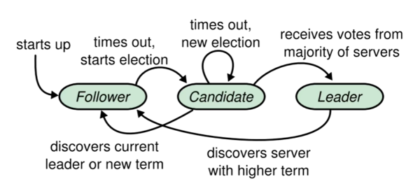

# 2.共识算法

## Paxos

### 1.基础

#### 1.1.介绍
Paxos 1990 年被提出。作用是解决分布式系统中数据一致性问题，尤其是在网络延迟、分区和节点故障的情况下。

应用：Paxos 被广泛应用于需要高可用性和数据一致性的分布式系统中，如分布式数据库、分布式存储系统、分布式锁服务等。
- Chubby: Google提出的一种分布式锁服务。应用于 GFS和Bigtable等大型系统
- Spanner：是一个功能强大、可扩展性高的全球分布式数据库，强一致性、事务支持
- OceanBase：使用Paxos实现强一致性的分布式数据库。

#### 1.2.发展
Paxos 最初也是少有人知的。直到后面被谷歌发现并实现后，Paxos时隔十几年才被人们重新提起

[Paxos 1990最初论文](https://courses.cs.washington.edu/courses/csep590/04wi/papers/lamport-part-time-parliament.pdf)
[Paxos 2001简化后的论文-Paxos Made Simple](https://lamport.azurewebsites.net/pubs/paxos-simple.pdf)

Paxos 算法也因其复杂性而闻名。它的协议步骤和角色交互相对复杂，使得理解和实现起来都具有一定的挑战性。
因此，在实际应用中，人们通常会选择使用 Paxos 的变种或简化版本，如 Multi-Paxos、Raft 等，
这些算法在保持 Paxos 核心思想的同时，通过简化协议步骤和角色交互来降低实现的复杂性。

Paxos的主要分类如下：
- Basic-Paxos：兰伯特论文中提到的Paxos算法，只具备单决策能力；
- Multi-Paxos：《Paxos Made Simple》论文最后拓展提到的算法，具备多决策能力。
- 其他变种：Zab和Raft

#### 1.3.关键特性
- 多数派原则：确保在任何时候，只有得到多数节点支持的提案才能被接受为选定提案。这有助于防止网络分区导致的数据不一致性问题。
- 安全性：一旦某个提案被选定，它将永远保持选定状态，不会被后续的提案所覆盖或撤销（除非系统完全重置）。
- 活性：只要系统中存在多数节点是活动的且能够相互通信，那么系统就能够持续处理新的提案并最终达成一致。

#### 1.4.拜占庭将军问题
经典分布式一致性问题的典故：如何在“有内奸、信使不可靠”的情况下，确保首都决策的正确性。

落地到分布式集群中就是：如何在不可靠的分布式系统中，快速且正确地使各节点能够达成一致状态。也就是大部分集群达成共识。

### 2.Basic-Paxos

#### 2.1.核心思想

- 提案：将数据、日志等任意的事物抽象为提案。
- 核心思想：通过协议让集群各节点就某个提案（Proposal）达成一致。
- 节点角色：Proposer（提案者）、Acceptor（接受者）、Learner（学习者）
- 提案状态：Prepare、Propose、Learn

#### 2.2.角色

Paxos 有三种角色：
- Proposer（提案者）：发起提案；整个集群只有一个节点作为Proposer，负责所有的写操作。
- Acceptor（接受者）：通知Proposer自己是否接受提案
- Learner（学习者） ：学习通过的提案。

#### 2.3.提案编号

提案编号是全局唯一的，可自增的变量。由Proposer维护，Acceptor和Learner用于校验Proposer的提案是否有效。

#### 2.4.议会决策

1. Prepare 阶段：提案者 向所有 接受者 发送 Prepare请求（包括提案 + 编号n）。接受者 已经接受的编号 与 提案请求中的编号进行对比。
   接受者 只同意接受大于等于本地编号的提案，并向提案者返回自己当前已接受的最大提案编号。
2. Accept 阶段：如果提案者收到大多数接受者的同意的响应，那么提案者就会生成一个新的提案（n+1），向所有 接受者 发送 Accept请求（包括提案 + 编号n+1）。
3. Learn 阶段：提案被大多数接受者接受，提案者会将提案发送给所有学习者，以便它们了解并应用这个提案。提案者 不关注 学习者是否应用提案。

#### 2.5.缺点

Basic-Paxos 没有明确 提案者 的数量，如果有多个 提案者 ，整个处理流程就会陷入混乱。
所以解决方案就是：只有一个提案者

### 3.Multi-Paxos

Basic-Paxos是一种单决策算法，一轮决策中只能确认一个Value，并且至少经过Prepare、Accept两个阶段，这样的模式效率太低了。

Multi-Paxos是对Basic-Paxos一种优化形式。
1. 增加leader概念，表示只有一个提案者
2. 删除Prepare阶段，直接进入Accept阶段。减少通讯次数，也降低了 提案编号的维护难度。
3. 脑裂：当发生时，会退化为Basic-Paxos模式，进行选举。

## Raft

- Raft官网，可以可视化观察选举和日志复制: [https://raft.github.io/](https://raft.github.io/)
- Raft论文：[https://raft.github.io/raft.pdf](https://raft.github.io/raft.pdf)

- [深度解析 Raft 分布式一致性协议](https://juejin.cn/post/6907151199141625870)

### 1.基础

#### 1.1.介绍

Raft是Paxos的一个变种，比Paxos更易理解和实现。相比Paxos做出了以下简化
1. Raft将共识算法拆分成3个模块：leader选举、日志复制、安全性，使其更易理解和工程实现。
2. Raft简化了节点的状态，节点只继续状态切换。

#### 2.2.应用

目前很多中间件都开始使用Raft协议，例如：etcd、 consul、nacos 和 TiKV。

- etcd。基于Raft实现的分布式kv存储。
- consul 和 nacos，都是将Raft作为可选的一致性协议
- TiKV，作为分布式数据库TiDB的底层实现，采用了Multi Raft，将数据划分为多个region，每个region都是一个Raft集群。
- Kafka Raft（KRaft）。用于替换zookeeper在kafka集群中的作用，简化操作，降低程序的维护成本，提升故障恢复速度。

缺点：
1. Raft不适合大数据量存储
2. 节点数量并非越多越好

### 2.选举

Raft采用Quorum机制，将对Raft的操作称之提案，每当发起一个提案，都必须得到超过半数（>N/2）的节点同意才能提交。

#### 2.1.节点状态

节点状态：leader（发出提案）、follower（参与决策）、candidate（选举中的临时状态）。



每个节点只有一个状态，只需考虑状态切换，不向paxos存在状态共存的情况。

#### 2.2.任期term

任期的就是从开始选举开始计算，直到下一次选举。即，任期是发起两次选举的时间间隔。

任期以整数计算，每经过一次任期（每发起一次选举），任期+1。
任期期间可能无法选举出leader就立即进入下一个任期，重新选举，任期+1。
所以任期期间，可能没有leader，即使有leader也是不可靠的，candidate状态不会接受选举期间leader的写日志。

#### 2.3.节点间通讯
Raft定义了节点间通讯采用rpc协议。根据通讯的内容可以分为两类：
1. RequestVote：请求投票，由candidate节点在选举期间发起，向所有的节点发生自己的投票信息。
2. AppendEntries：追加条目，由leader发起，用于日志复制 以及 心跳检查。

通讯的内容会携带当前节点的任期号。根据角色不同，做出反应也不同
1. candidate和leader发现接收到的任期号小于收到的，会判定自己任期号过期了，会立即进入follower状态。
    - 原因：例如发生了脑裂或者其他问题，导致其他节点已经完成了选举，所以先进入follower进行通讯，再进行下一步操作（参与选举或者作为follower工作）
2. follower 接收到的任期号小于自己的，判断收到的信息是过期的，拒绝这条消息。
3. 如果当前节点任期号小了，就会更新自己的任期号。


#### 2.4.心跳机制

心跳机制：leader周期性地发送心跳给所有的follower，follower收到后就保持follower状态，如果超时没有收到心跳，
follower节点切换到candidate状态，并发起投票。

follower超时时间：每个节点的心跳超时时间通常是随机的，论文中是介于150ms到300ms之间。

#### 2.5.领导选举

选举发生场景
1. 服务启动时，所有节点都是follower，当超时没法收到leader的心跳，就切换到candidate进行选举。
2. 运行期间，leader因为宕机或网络问题中断心跳，follower心跳超时，就切换到candidate进行选举。


选举过程如下：
1. 首先把当前term计数加1，自己的状态切换到candidate。
2. 然后给自己投票并向其它结点发投票请求（term, index）。直到以下三种情况：
    - 它赢得选举，立即切换到leader状态，并向所有节点发送心跳，告诉大家我是leader。
    - 另一个节点成为leader。收到leader的心跳，且任期大于等于自己的任务。
    - 一段时间没有节点成为leader。选举超时，默认为150~300ms。
3. 在选举期间，candidate可能收到来自其它自称为leader的写请求，如果该leader的term不小于candidate的当前term，
   那么candidate承认它是一个合法的leader并切换到follower状态，否则拒绝请求。
4. 如果出现两个candidate得票一样多，则它们都无法获取超过半数投票，这种情况会持续到超时，然后进行新一轮的选举，
   这时失败的概率就很低了，那么首先发出投票请求的的candidate就会得到大多数同意，成为leader。

选举的消息，伪代码
```golang
//请求投票RPCRequest
type RequestVoteRequest struct {
    term int            //自己当前的任期号
    candidateld int     //自己的ID
    lastLogIndex int    //自己最后一个日志号
    lastLogTerm int     //自己最后一个日志的任期
}

//请求投票RPCResponse
type RequestVoteResponse struct {
    term int       //自己当前任期号
    voteGranted bool //自己会不会投票给这 candidate
}    
```

<p style="color: red">如果某个follower超时发起选举，其他follower也会跟着选举吗？</p>

follower状态切换到candidate的条件：follower心跳超时才会转换为candidate状态并发起选举。
如果集群中某个节点因为一些原因，切换状态并发起选举，其他节点不会跟随他一起选举，并返回拒绝投票。
该节点无法正常选举，会一直重试尝试发起选举，无法正常工作。

<p style="color: red">选票逻辑</p>

1. 比较term，term最大的当选
2. term最大有多个相同的时候，lastLogIndex 最大的当选
2. lastLogIndex最大有多个相同的时候，收到的第一条选票中的节点当选

所以在第一次服务启动时，第一个发起选举的节点会当选leader。

### 3.日志复制

#### 3.1.复制过程

集群中leader接受所有客户端的请求，所有写入操作都在leader进行。写入操作过程如下：
1. 当leader接收到写入请求后，leader 并发向所有follower发送AppendEntries（term1,index1）请求，要求它们复制日志。
2. 当收到过半的节点的回复（不需要全部节点）时，leader就执行提交命令，然后向给客户端返回成功。
3. 这时 follower 中的日志状态是未提交的
4. leader发送心跳给所有follower（term1,index2），follower检查心跳，发现在同一个term1中。
    - index2>=节点最大index1， 则提交现有所有所有未提交的日志。
    - index2< 节点最大index1， 则提交小于等于index1的日志。

LogIndex 也是全局唯一的自增整数，且一旦服务启动，这个数字只会增加（可能存在回退），不会重置。
LogIndex 与 term 一起组成一个全局唯一标识。

PS: 缺点，论文中的日志复制，leader 和 follower 之间数据是有延迟的。

#### 3.2.客户端连接

客户端是如何知道leader节点的？ 常用的方式，启动后向任意节点发生连接请求，会出现三种情况
1. 这个节点就是leader，就建立连接
2. 这个节点是Follower，Follower会保存其他节点的信息，会告诉客户端leader的地址，客户端重新连接。
3. 这个节点不可用，客户端会循环尝试其他的节点，直到找到leader。

#### 3.3.数据一致性检查

follower的一致性检查：
- leader发送AppendEntries时，会发送上一条的LogIndex与 term。
- follower如果找不到这个LogIndex与 term，说明follower延迟了，就会拒绝掉这些复制请求
- leader收到拒绝请求后，会向follower发送一个日志列表
- follower 收到列表后，逐一对比，找到自己需要同步的位置，并发起同步请求。

<p style="color: red">follower与leader数据不一致？</p>

每个节点随时都有奔溃、缓慢的情况出现，所以Raft必须保证发生以上情况，日志复制任然可以继续，要保证每一个副本中的日志顺序一致。

原因：
1. follower 同步缓慢。
    - leader发送AppendEntries命令是，follower 由于某些原因，没有及时响应（超时），leader会不断的重试，直到成功。
      这个过程中，leader可能已经提交了日志。
2. follower 崩溃。
    - follower恢复后，会启动一致性检查，与leader对比term 与 commitLogIndex，找到需要同步的开始位置，进行同步。
3. leader 崩溃。
    - 可能是奔溃，或者网络问题导致脑裂，恢复期间，可能已经经过多轮任期，数据已经不是最新的。
    - 可能恢复后，新的leader数据也不是最新的。脑裂的时候，旧leader继续写入数据，导致commitLogIndex大于新leader。

#### 3.4.日志压缩

就是定期生成日志快照。快照一般包含以下内容：
- 日志的元数据：最后一条被该快照 apply 的日志 term 及 index
- 状态机：前边全部日志 apply 后最终得到的状态机

日志同步：
1. 当 leader 需要给某个 follower 同步一些旧日志，但这些日志已经被 leader 做了快照并删除掉了时，leader 就需要把该快照发送给 follower。
2. 同样，当集群中有新节点加入，或者某个节点宕机太久落后了太多日志时，leader 也可以直接发送快照，大量节约日志传输和回放时间。

### 4.安全

raft为了便于理解，简化了很多操作，所以在这些操作的过程中，存在一些问题，需要优化。
1. 选举中的限制：每个 candidate 必须在 RequestVote RPC 中携带自己本地日志的最新 (term, index)，如果 follower 发现这个 candidate 的日志还没有自己的新，则拒绝投票给该 candidate。
2. 日志复制的限制：Leader 只允许 commit 包含当前 term 的日志。因为可能选举过程中，上一个leader有数据没有提交，导致follower中的数据也没有提交。
   所以新选举的leader中可能有未提交的数据。选举中选票的index是已提交，而未提交的日志，在后续新leader日志复制过程中，被leader覆盖掉。

### 5.集群成员变更

raft允许不停机变更集群成员。集群节点的增删操作，一定会有延迟，延迟的过程，就会出现节点之间配置不一致的情况，就可能发生脑裂问题。

#### 5.1.联合发布(两阶段切换集群成员配置)

论文中提供的方案，阶段一：
1. 提供变更命令，从leader写入新的配置：C-new
2. leader将新旧配置 进行并集操作，生成一个联合配置 C-old,new
3. leader以日志的方式发送给所有follower。
4. follower 收到 C-old,new 后立即 apply，当超过半数节点都切换后，leader 将该日志 commit。

阶段二：
1. leader 提交日志后，立即发送C-new给所有follower。
2. follower 接收都C-new后立即应用，如果发现自己被移除了，就会可以退出集群
3. leader 收到当超过半数节点切换成功的响应后，立即返回客户端操作结果。

#### 5.2.渐进式变更

一次只变更一个节点。参考具体实现： [https://github.com/ongardie/dissertation](https://github.com/ongardie/dissertation)

### 6.读性能优化

#### 6.1.主写从读
raft协助中，leader写操作，日志复制时大部分通过即可，且follower本地日志提交依赖于leader下一次心跳消息。
所以follower中日志是有延迟的，且存在不一致的情况。所以这种主写从读的方式是不成立的。

#### 6.1.主写主读

也是存在问题。例如：
1. 日志未提交（还在日志复制过程中），被读取到的话就产生了脏读。
2. 网络分区导致脏读，此时如果连接的是旧leader，用户写入数据后，可能被连接旧leader的其他用户读取到。当集群恢复后这些数据都没了，这就产生了脏读。

从leader读取数据是有必要的，所以以上问题需要优化，方案如下，这些方案任选其一即可。
- Raft log read
- Read Index
- Lease Read
- Follower Read

目标：
1. 保证在读取时的最新 commit index 已经被 follower 提交。
2. 保证在读取时 leader 仍拥有领导权。

#### 6.1.1.Raft log read

raft log read。将读操作也作为一种提案，在raft集群中走一遍日志复制过程。这样可以很大程度上保证连接到的leader节点是有效的。

缺点：读操作与写操作一样耗时，性能不好。

#### 6.1.2.Read Index

- Leader 接收到读操作，记录下当前的 commit index，称之为 read index。
- 为了确保领导权，主动让 Leader 向 所有 follower 发起一次心跳，同时也是为了让follower上未提交的数据提前提交。
- 当大半follower都回复成功后，即 apply index 大于等于 read index
- 执行读请求，将结果返回给客户端。

就是将心跳与读操作合并一起，很多程度的提升读取性能，这么做为了保证Leader有效，follower数据即使提交。

#### 6.1.3.Lease Read

- 设置一个比选举超时更短的时间作为租期，在租期内我们可以相信其它节点一定没有发起选举，集群也就一定不会存在脑裂。
- 在租期内可以直接读主，而租期过期后使用Read Index。
- 下一次读操作使用Read Index后，刷新租期，续租。

缺点：依赖于系统时间，为算法带来一些不确定性，如果时钟发生漂移会引发一系列问题，因此需要谨慎的进行配置。

#### 6.1.4.Follower Read

Follower 在收到客户端的读请求时，向 leader 询问当前最新的 commit index，反正所有日志条目最终一定会被同步到自己身上，
follower 只需等待该日志被自己 commit 并 apply 到状态机后，返回给客户端本地状态机的结果即可。

## Zab

## Gossip

[一致性算法-Gossip协议详解](https://cloud.tencent.com/developer/article/1662426)

### 1.介绍

Gossip协议又被称为流行病协议（Epidemic Protocol），也有人叫它反熵（Anti-Entropy）。

Gossip协议于1987年在ACM上发表的论文 《Epidemic Algorithms for Replicated Database Maintenance》中被提出，
主要用在分布式数据库系统中各个副本节点间的数据同步，这种场景的一个最大特点就是组成网络的节点都是对等的，网络中即使有的节点因宕机而重启，
或有新节点加入，但经过一段时间后，这些节点的状态也会与其他节点达成一致。

**简而言之，Gossip是一种数据复制算法，并不是共识算法。作用是在将数据传播到集群各个节点，因此Gossip也算是一种带冗余的分布式容错的算法，可以实现数据的最终一致性。**

使用场景：最终一致性的场景（也就是AP场景）：
- 失败检测
- 路由同步
- Pub/Sub
- 动态负载均衡。

Gossip 协议被广泛应用在多个知名项目中，使用案例
- Bitcoin:使用 Gossip 协议来传播交易和区块信息，
- Redis： cluster方式使用Gossip进行检活和数据同步
- Consul：集群间状态同步
- Apache Cassandra
- AWS Dynamo。


缺点也很明显：
- 消息延迟：节点随机向少数几个节点发送消息，消息最终是通过多个轮次的散播才能遍布集群。
- 消息冗余：节点定期随机选择周围节点发送消息，而收到消息的节点也会重复该步骤。节点越多，对带宽和CPU的消耗越大。
- 拜占庭问题：如果有一个恶意传播消息的节点，Gossip协议的分布式系统就会出问题。

### 2.六度分隔理论

- 原文：“你与任何一个陌生人之间间隔的人不会超过6个”
- 案例：Facebook研究发现已经注册的15.9亿用户，网络半径为4.57。

### 3.节点状态

- S:Suspective(病原)：处于 susceptible 状态的节点代表其并没有收到来自其他节点的更新。
- I:Infective(感染)：处于 infective 状态的节点代表其有数据更新，并且会将这个数据分享给其他节点。
- R:Removed(愈除):其已经接收到来自其他节点的更新，但是其并不会将这个更新分享给其他节点。

R状态的引入，是为了避免产生传播风暴，及时出现也会在可控的时间范围内自行恢复。

### 4.复制方式
Gossip将数据复制协议分为两种
- 反熵传播：定时随机选择节点，几个节点相互交换全部数据来消除数据差异。
   - 参与节点只有两种状态(SI)
   - 缺点：交换数据会带来很大的通讯负担，通常不会频繁使用
   - 使用场景：通常用于新加入集群的节点初始化数据
- 谣言传播：定时随机选择节点，将某段时间内最新的数据进行发送（同一条数据可能发送多次），直到消息被标记为R，就停止传播。
   - 参与节点有三种状态(SIR)
   - 缺点：有一定的概率出现数据不一致的情况
   - 使用场景：通常用于节点间数据增量同步

Gossip实际使用中，为了在通信代价和可靠性之间取得折中，需要将这两种方法结合使用。启动是反熵传播，之后谣言传播。

### 5.通讯方式
Gossip 协议最终目的是将数据分发到网络中的每一个节点。节点间通信方式：Push、Pull 以及 Push&Pull：
- Push: 产生新数据的节点作为发起节点。发起信息交换的节点 A 随机选择联系节点 B，并向其发送自己的信息，节点 B 在收到信息后更新比自己新的数据。
- Pull：无新数据的节点作为发起节点。发起信息交换的节点 A 随机选择联系节点 B，并从对方获取信息。
- Push&Pull：发起信息交换的节点 A 向选择的节点 B 发送信息，同时从对方获取数据，用于更新自己的本地数据。

如果把两个节点数据同步一次定义为一个周期，则在一个周期内，Push 需通信 1 次，Pull 需 2 次，Push&Pull 则需 3 次。
虽然消息次数多了，但从效果上来讲，Push&Pull 最好，理论上一个周期内可以使两个节点完全一致。直观上，Push&Pull 的收敛速度也是最快的。
