# rocketmq

## 1.介绍

- 官网： [http://rocketmq.apache.org](http://rocketmq.apache.org)
- 源码：[https://github.com/apache/rocketmq](https://github.com/apache/rocketmq)
- 中文文档[https://github.com/apache/rocketmq/tree/master/docs/cn](https://github.com/apache/rocketmq/tree/master/docs/cn)
- 基础介绍：[https://mp.weixin.qq.com/s/uX2058WQmZbfzDQFvM7w5A](https://mp.weixin.qq.com/s/uX2058WQmZbfzDQFvM7w5A)
- MQ 消息丢失、重复、积压问题，如何解决[https://mp.weixin.qq.com/s/ZuDbrDf9pWKXy3QJjxOJeQ](https://mp.weixin.qq.com/s/ZuDbrDf9pWKXy3QJjxOJeQ)

### 1.1.什么是rocketmq
RcoketMQ 是一款低延迟、高可靠、可伸缩、易于使用的消息中间件。具有以下特性：
- 支持发布/订阅（Pub/Sub）和点对点（P2P）消息模型
- 在一个队列中可靠的先进先出（FIFO）和严格的顺序传递
- 支持拉（pull）和推（push）两种消息模式
- 单一队列百万消息的堆积能力（前提是足够的内存、硬盘空间）
- 支持多种消息协议，如 JMS、MQTT 等
- 分布式高可用的部署架构,满足至少一次消息传递语义
- 提供 docker 镜像用于隔离测试和云集群部署
- 提供配置、指标和监控等功能丰富的 Dashboard

RcoketMQ 是阿里巴巴开源的项目之一，被广泛的使用到实际当中。RcoketMQ 3+已经是高性能稳定的版本了。
目前最新的版本是RcoketMQ 4.3，帶來了很多新特性。


### 1.2.Rocketmq的优势

相比主流的MQ具有主要优势特性有：
- 支持事务型消息（消息发送和DB操作保持两方的最终一致性，rabbitmq和kafka不支持）
- 支持结合rocketmq的多个系统之间数据最终一致性（多方事务，二方事务是前提）
- 支持18个级别的延迟消息（rabbitmq和kafka不支持）
- 支持指定次数和时间间隔的失败消息重发（kafka不支持，rabbitmq需要手动确认）
- 支持consumer端tag过滤，减少不必要的网络传输（rabbitmq和kafka不支持）
- 支持消息回溯（rabbitmq不支持，kafka支持）

### 1.3.基本概念

- Producer   
    - 消息生产者，生产者的作用就是将消息发送到MQ。
    - Producer 与 随机一个Name Server建立长连接，定时（30s）从Name Server获得所有的topic的路由信息。【意味着master不可用后，最多有30s的延迟恢复时间】
    - Producer每隔30s向所有关联的broker发送心跳，Broker每隔10s中扫描所有存活的连接，如果Broker在2分钟内没有收到心跳数据，则关闭与Producer的连接。
    
- Producer Group   
    - 生产者组，简单来说就是多个发送同一类消息的生产者称之为一个生产者组。在编写程序的时候可以不用关心，只要知道有这么一个概念即可。Group主要是rocket自己维护使用。

- Consumer   
    - 消息消费者，简单来说，消费 MQ上的消息的应用程序就是消费者。
    - 与producer一样，与随机一个Name Server建立长连接，定时（30s）从Name Server获得所有的topic的路由信息。【意味着master不可用后，最多有30s的延迟恢复时间】
    - Consumer每隔30s向所有关联的broker发送心跳，Broker每隔10s中扫描所有存活的连接，如果Broker在2分钟内没有收到心跳数据，则关闭与Consumer的连接。
      并向该Consumer Group的所有Consumer发出通知，Group内的Consumer重新分配队列，然后继续消费。
    
- Consumer Group   
    消费者组，和生产者类似，消费同一类消息的多个 consumer实例组成一个消费者组。在编写程序的时候可以不用关心，只要知道有这么一个概念即可。Group主要是rocket自己维护使用。

- Topic
    - Topic是一种消息的逻辑分类，非广播模式下，一个生产者向一个topic中发送消息后，只会被一个消费者消费一次。
    - topic一般由多个队列组成，队列会平均的散列到多个Broker上面。Producer的发送机制会保证消息尽量平均的散列到所有队列上面去，最终的效果是所有的消息会平均的落在每个Broker上面。
    
- Message   
  - Message 是消息的载体。一个 Message 必须指定topic，相当于寄信的地址。
  - Message 还有一个可选的 tag 设置，以便消费端可以基于 tag 进行过滤消息。 
    也可以添加额外的键值对，例如你需要一个业务 key 来查找 broker 上的消息，方便在开发过程中诊断问题。

- Tag   
    - Tag属于子Topic，主要的作用是给业务提供更大的灵活性，用以分流信息。比如生产者的标签包括{"tagA", "tagB", "tagC"}。每次发送消息的时候，都会指定消息的标签。

场景有两个
- 1：消费者可以订阅一部分，比如"tagA"，这样就只消费"tagA"的数据，其他四个标签的消息在进入消费者的时候自动被销毁。非tagA的消息不会进入我们自己编写的程序中
- 2：消费者全部订阅，所有的消息都会进入我们编写的程序中，我们可以使用messageExt.getTags()在程序中进行逻辑判断

- Broker   
    - 负责消息的中转、存储和转发。是 RocketMQ 系统的主要角色
    - Broker可以分为Master和Slave。Master可以有多个。一旦master无法工作时，客户端就会切换到slave上进行操作。
    - Broker与Name Server集群中的所有节点建立长连接，定时(每隔30s)注册Topic信息到所有Name Server。 
    - Name Server定时(每隔10s)扫描所有存活broker的连接，如果Name Server超过2分钟没有收到心跳，则Name Server断开与Broker的连接。
    
- Name Server：
  - 维护topic和broker的对应关系，与所有broker保持心跳连接，在producer和consumer需要发布或者消费消息的时候，向nameserver发出请求来获取连接的broker的信息
  - 每个 NameServer 记录完整的路由信息，提供等效的读写服务，并支持快速存储扩展。
  - NameServer类似kafka中zookeeper的角色。 但是rocketmq只需要元数据存储，不需要选举。所有不使用zk。

- Offset
    - 消息在Broker上的每个分区都是组织成一个文件列表，消费者拉取数据的时候需要知道数据在文件中的偏移量，这个偏移量就是offset。
      Offset是一个绝对的偏移量，服务器会将offset转化为具体文件的相对偏移量。

### 1.4.RocketMQ架构


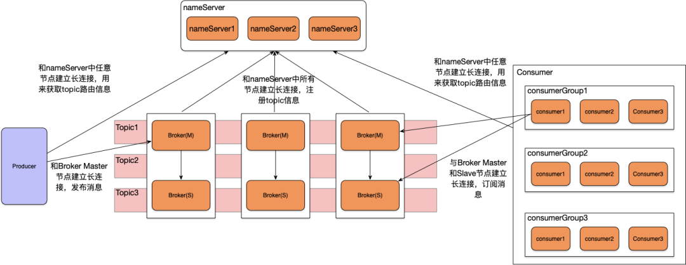

由这张图可以看到有四个集群，分别是 NameServer 集群、Broker 集群、Producer 集群和 Consumer 集群：

- NameServer: 命名服务，提供轻量级的服务发现和路由。 
- Broker: 通过提供轻量级的 Topic 和 Queue 机制来处理消息存储,同时支持推（push）和拉（pull）模式以及主从结构的容错机制。
- Producer：生产者，产生消息的实例，拥有相同 Producer Group 的 Producer组成一个集群。
- Consumer：消费者，接收消息进行消费的实例，拥有相同 Consumer Group 的 Consumer 组成一个集群。

简单说明一下图中箭头含义，从 Broker 开始，Broker Master1 和 Broker Slave1 是主从结构，它们之间会进行数据同步，即 Data Sync。
同时每个 Broker 与 NameServer 集群中的所有节点建立长连接，定时注册 Topic 信息到所有 NameServer 中。

Producer 与 NameServer集群 中的其中一个节点（随机选择）建立长连接，定期从 NameServer 获取 Topic 路由信息，
并向提供 Topic 服务的 Broker Master 建立长连接，且定时向Broker 发送心跳。

Producer 只能将消息发送到 Broker master，但是 Consumer 则不一样，它同时和提供 Topic 服务的 Master 和 Slave
建立长连接，既可以从 Broker Master 订阅消息，也可以从 Broker Slave 订阅消息。

## 2.安装与部署

### 2.1.快速入门
[快速入门](https://rocketmq.apache.org/docs/quick-start/)

[中文文档](https://rocketmq-1.gitbook.io/rocketmq-connector/quick-start/qian-qi-zhun-bei)

### 2.2.基本案例
[基本案例](https://github.com/apache/rocketmq/blob/master/docs/cn/RocketMQ_Example.md)


### 2.3.扩展

[externals](https://github.com/apache/rocketmq-externals/blob/master/docs/connect/cn/README.md)

扩展rocketmq能力，比如与hbase、spark、Redis、mysql进行通讯。

使用 console 进行可视化管理

使用 sentinel 进行限流等

### 2.4.集群部署

[集群部署](https://rocketmq-1.gitbook.io/rocketmq-connector/quick-start/qian-qi-zhun-bei/ji-qun-huan-jing)

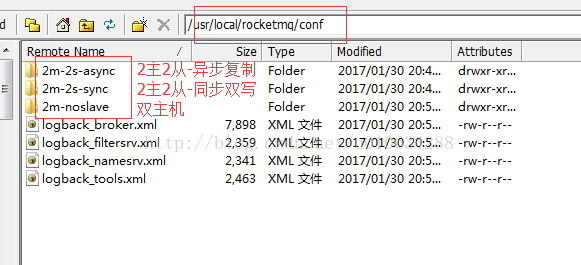

1. 单 master 模式

只有一个 master 节点，称不上是集群，一旦这个 master 节点宕机，那么整个服务就不可用，适合个人学习使用。

2. 多 master 模式

多个 master 节点组成集群，单个 master 节点宕机或者重启对应用没有影响。

优点：所有模式中性能最高

缺点：单个 master 节点宕机期间，未被消费的消息在节点恢复之前不可用，消息的实时性就受到影响。

注意：使用同步刷盘可以保证消息不丢失，同时 Topic 相对应的 queue应该分布在集群中各个节点，
而不是只在某各节点上，否则，该节点宕机会对订阅该 topic 的应用造成影响。

3. 多 master 多 slave 异步复制模式

在多 master 模式的基础上，每个 master 节点都有至少一个对应的 slave。
master 节点可读可写，但是 slave 只能读不能写，类似于 mysql 的主备模式。

优点：在 master 宕机时，slave升级为master，消费者可以从 slave 读取消息，消息的实时性不会受影响，性能几乎和多 master 一样。

缺点：使用异步复制的同步方式有可能会有消息丢失的问题。

4. 多 master 多 slave 同步双写模式

同多 master 多 slave 异步复制模式类似，区别在于 master 和 slave 之间的数据同步方式。

优点：同步双写的同步模式能保证数据不丢失。

缺点：发送单个消息 RT 会略长，性能相比异步复制低10%左右。

刷盘策略：同步刷盘和异步刷盘（指的是节点自身数据是同步还是异步存储）

同步方式：同步双写和异步复制（指的一组 master 和 slave 之间数据的同步）

注意：要保证数据可靠，需采用同步刷盘和同步双写的方式，但性能会较其他方式低

## 3.消费者-consumer

### 3.1.消息获取方式

系统接收消息方被称为消费者-consumer，获取消息的方式有两种

- DefultMQPushConsumerImpl：默认的方式，本质还是pull，但是由异步线程批量pull，提高了消息的实时处理速度
- DefaultMQPullConsumerImpl：由客户端主动拉取消息，相比默认的方式，存在一定的延迟性

### 3.2.消息消费模式

主要分为：集群模式 和 广播模式

集群模式:

- 消费进度保存到broker上，也就是consumerOffset.json文件保存在mq的服务器上
- 订阅同一个topic的consumer（在同一个ConsumerGroup下）只能消费一次
- 消息消费失败了，consumer会把消息发送会broker，broker会根据失败的原因、次数，设置不同级别的delayLevel进行消息重发
- 相同的topic，不同的ConsumerGroup可以伪装成广播模式，从而达到所有的consumer都能接受到消息的目的 
  
广播模式：

- 消费进度保存到consumer的服务器上，也就是这个consumerOffset.json文件
- 所有的consumer都会接受到topic的消息
- 消息消费失败后，这条消息会被丢弃，不会发送给broker重新投递

### 3.3.消费顺序

设置Consumer第一次启动是从队列头部开始消费还是队列尾部开始消费。如果非第一次启动，那么按照上次消费的位置继续消费

```java
consumer.setConsumeFromWhere(ConsumeFromWhere.CONSUME_FROM_FIRST_OFFSET);
```

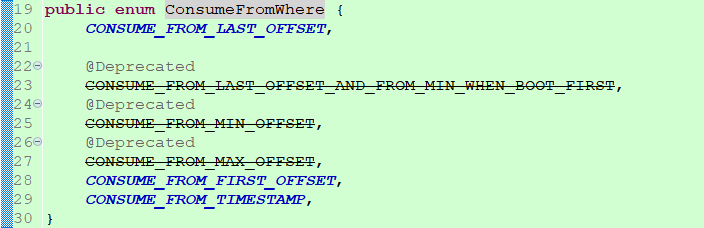

DefaultMQPushConsumerImpl内部有一个类RebalancePushImpl，首先客户端需要拉取队列，然后到broker获取消费进度，
获取消费offset代码在computePullFromWhere方法

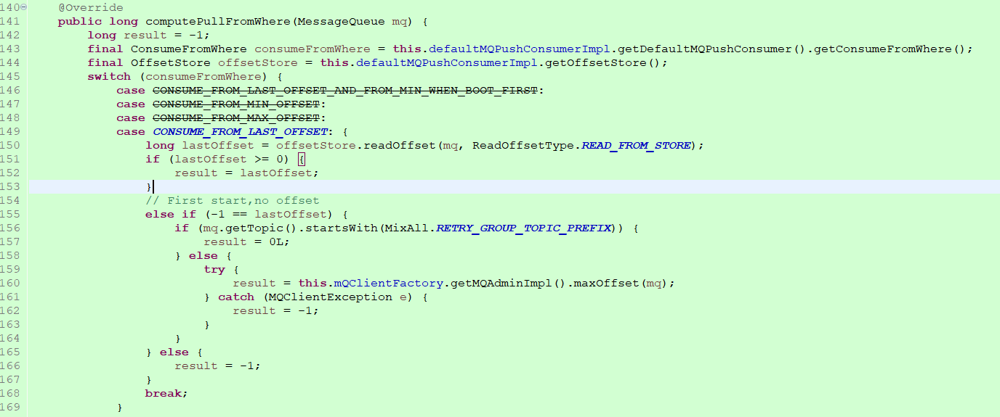


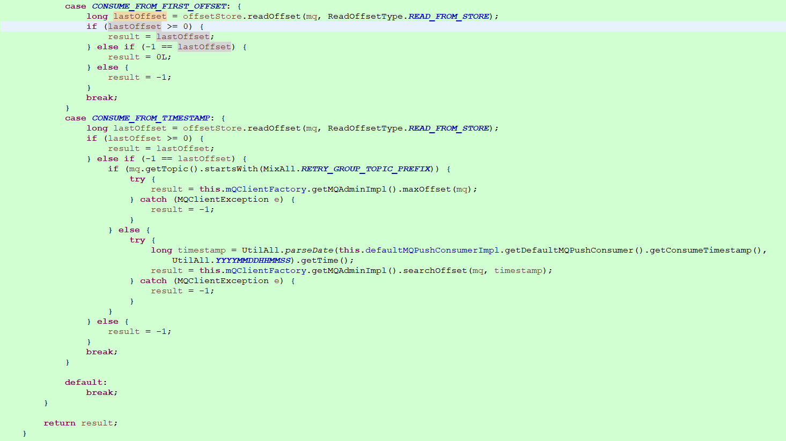


首先看CONSUME_FROM_LAST_OFFSET的逻辑，lastOffset >= 0，意味着broker端有消费进度了，说明之前已经启动且消费了一些消息，
那么就从返回的offset开始消费。当-1 == lastOffset，如果为重试队列，从头消费，为普通队列则从最大offset处消费。

CONSUME_FROM_TIMESTAMP，如果为第一次启动，即-1 == lastOffset时，为普通队列的话，从设置的时间点开始消费，
如果未设置时间点，默认从半小时前开始消费。

### 3.4.消费者启动过程

#### 3.4.1.自定义程序启动mq消费者监听器

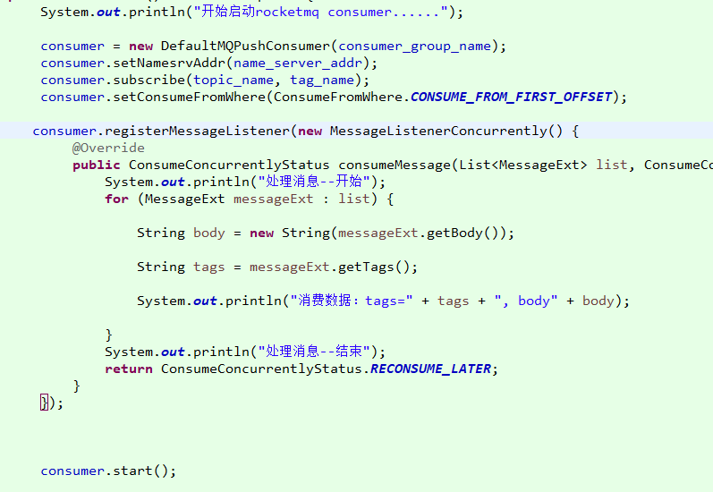

设置消费者参数后，我们将监听注册到 DefaultMQPushConsumer 的对象中。
DefaultMQPushConsumer 对象内部维护着 defaultMQPushConsumerImpl实例。

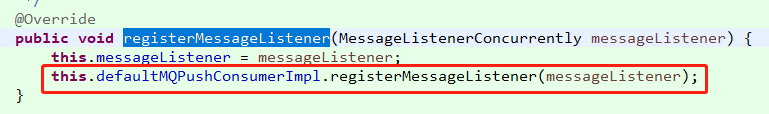


#### 3.4.2.启动监听

当我们自定义的程序调用start()方法的时候，DefaultMQPushConsumer调用的是defaultMQPushConsumerImpl的start()方法

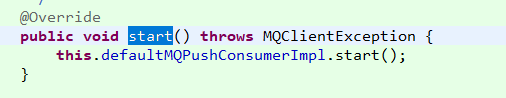

初始化消费者的信息。以及通过实现的MessageListenerConcurrently类型，创建消费处理业务类。
一般我们不选择顺序执行的时候，会创建ConsumeMessageConcurrentlyService。
下面是defaultMQPushConsumerImpl的start()。

再创建ConsumeMessageConcurrentlyService实例的时候，调用了ConsumeMessageConcurrentlyService的start()去初始化mq消息处理业务类。

Consumer的启动源码如下:DefaultMQPushConsumerImpl

```java
public synchronized void start() throws MQClientException {
        switch (this.serviceState) {
            case CREATE_JUST:
                log.info("the consumer [{}] start beginning. messageModel={}, isUnitMode={}", this.defaultMQPushConsumer.getConsumerGroup(),
                    this.defaultMQPushConsumer.getMessageModel(), this.defaultMQPushConsumer.isUnitMode());
                this.serviceState = ServiceState.START_FAILED;

                this.checkConfig();

                this.copySubscription();

                if (this.defaultMQPushConsumer.getMessageModel() == MessageModel.CLUSTERING) {
                    this.defaultMQPushConsumer.changeInstanceNameToPID();
                }

                this.mQClientFactory = MQClientManager.getInstance().getAndCreateMQClientInstance(this.defaultMQPushConsumer, this.rpcHook);

                this.rebalanceImpl.setConsumerGroup(this.defaultMQPushConsumer.getConsumerGroup());
                this.rebalanceImpl.setMessageModel(this.defaultMQPushConsumer.getMessageModel());
                this.rebalanceImpl.setAllocateMessageQueueStrategy(this.defaultMQPushConsumer.getAllocateMessageQueueStrategy());
                this.rebalanceImpl.setmQClientFactory(this.mQClientFactory);

                this.pullAPIWrapper = new PullAPIWrapper(
                    mQClientFactory,
                    this.defaultMQPushConsumer.getConsumerGroup(), isUnitMode());
                this.pullAPIWrapper.registerFilterMessageHook(filterMessageHookList);

                if (this.defaultMQPushConsumer.getOffsetStore() != null) {
                    this.offsetStore = this.defaultMQPushConsumer.getOffsetStore();
                } else {
                    switch (this.defaultMQPushConsumer.getMessageModel()) {
                        case BROADCASTING:
                            this.offsetStore = new LocalFileOffsetStore(this.mQClientFactory, this.defaultMQPushConsumer.getConsumerGroup());
                            break;
                        case CLUSTERING:
                            this.offsetStore = new RemoteBrokerOffsetStore(this.mQClientFactory, this.defaultMQPushConsumer.getConsumerGroup());
                            break;
                        default:
                            break;
                    }
                    this.defaultMQPushConsumer.setOffsetStore(this.offsetStore);
                }
                this.offsetStore.load();

                if (this.getMessageListenerInner() instanceof MessageListenerOrderly) {
                    this.consumeOrderly = true;
                    this.consumeMessageService =
                        new ConsumeMessageOrderlyService(this, (MessageListenerOrderly) this.getMessageListenerInner());
                } else if (this.getMessageListenerInner() instanceof MessageListenerConcurrently) {
                    this.consumeOrderly = false;
                    this.consumeMessageService =
                        new ConsumeMessageConcurrentlyService(this, (MessageListenerConcurrently) this.getMessageListenerInner());
                }

                this.consumeMessageService.start();

                boolean registerOK = mQClientFactory.registerConsumer(this.defaultMQPushConsumer.getConsumerGroup(), this);
                if (!registerOK) {
                    this.serviceState = ServiceState.CREATE_JUST;
                    this.consumeMessageService.shutdown();
                    throw new MQClientException("The consumer group[" + this.defaultMQPushConsumer.getConsumerGroup()
                        + "] has been created before, specify another name please." + FAQUrl.suggestTodo(FAQUrl.GROUP_NAME_DUPLICATE_URL),
                        null);
                }

                mQClientFactory.start();
                log.info("the consumer [{}] start OK.", this.defaultMQPushConsumer.getConsumerGroup());
                this.serviceState = ServiceState.RUNNING;
                break;
            case RUNNING:
            case START_FAILED:
            case SHUTDOWN_ALREADY:
                throw new MQClientException("The PushConsumer service state not OK, maybe started once, "
                    + this.serviceState
                    + FAQUrl.suggestTodo(FAQUrl.CLIENT_SERVICE_NOT_OK),
                    null);
            default:
                break;
        }

        this.updateTopicSubscribeInfoWhenSubscriptionChanged();
        this.mQClientFactory.checkClientInBroker();
        this.mQClientFactory.sendHeartbeatToAllBrokerWithLock();
        this.mQClientFactory.rebalanceImmediately();
    }
```

#### 3.4.2.1.加载消费进度this.offsetStore.load();

根据consumer配置的消费模式，广播模式实例化LocalFileOffsetStore，集群模式实例化RemoteBrokerOffsetStore。
之后consumer对offset的读写操作都是直接操作加载到内存的实例化对象。
Consumer会单独开启一个线程5S一次的频次将offset同步到磁盘上。

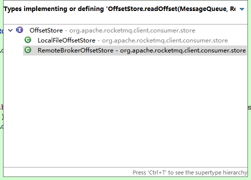


#### 3.4.2.2.启动服务this.consumeMessageService.start();

启动消费者的业务服务，实现类是ConsumeMessageConcurrentlyService，内部采用多线程的方式并发处理消息

其中需要注意的是核心线程数与最大线程数，读取的是DefaultMQPushConsumer的数据。如果程序中，开启很多这样的mq消息的时候，需要注意这些。降低创建线程的数量，避免不必要的浪费。

```java
int consumeThreadMin = 20
int consumeThreadMax = 64;
```

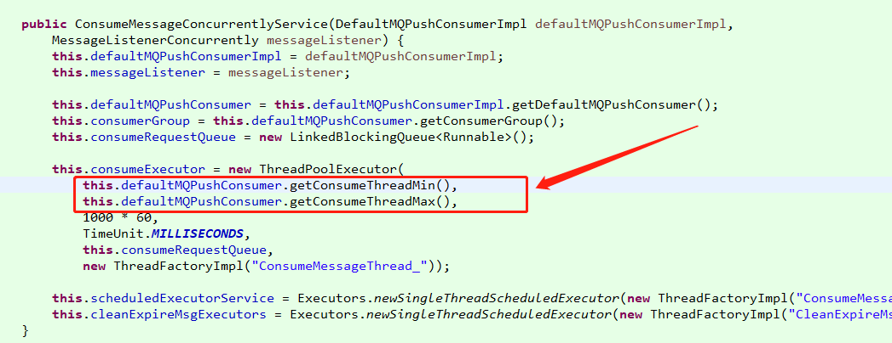

除此之外，还会开启两个单例的线程。一个用于接受mq消息，一个用于处理过期的mq消息。

消费者在获的消息的时候（消费者通过开启一个线程向nameserver发送数据请求获取数据）

submitConsumeRequest用于提交一个消费者的拉去请求。

#### 3.4.2.3.连接broker mQClientFactory.start();

mQClientFactory的启动会建立和broker通道，定时任务，拉消息服务，负载均衡服务。
由于拉消息的请求是由负载均衡发起，所以先说负载均衡服务。

负载均衡服务由RebalanceService线程每隔20s做一次，跟踪代码最终会调用到

mQClientFactory.start();

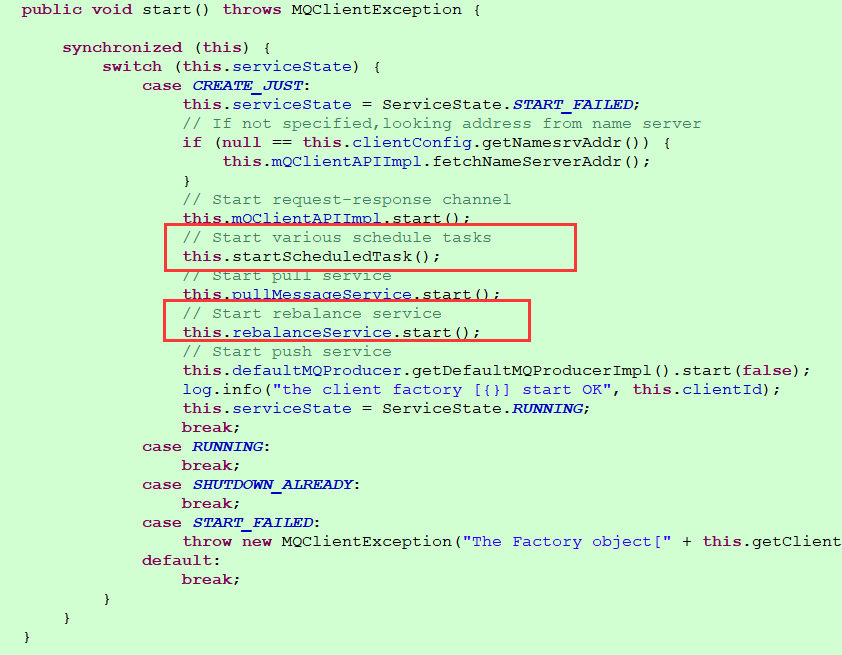

this.rebalanceService.start(); 

这个rebalanceService实现的RebalanceService：  
```java 
this.rebalanceService = new RebalanceService(this);
```

RebalanceService调用了doReblanceff1

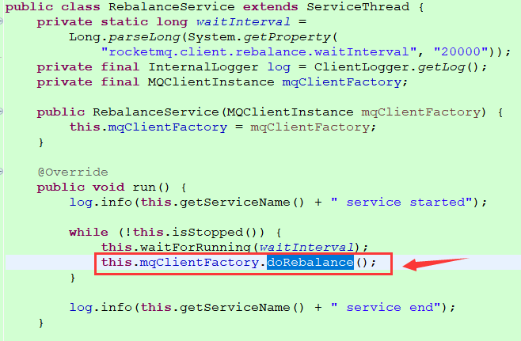

调用链如下：

负载均衡服务由RebalanceService线程每隔20s做一次，最终调用到RebalanceImpl#rebalanceByTopic方法

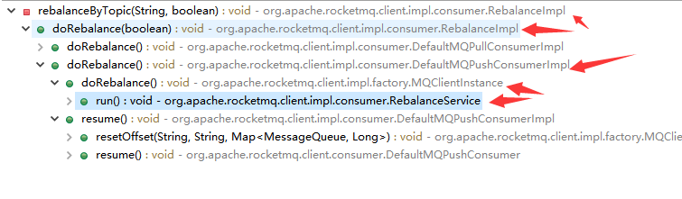


广播模式，由于所有consumer都需要收到消息，所以不存在负载均衡策略

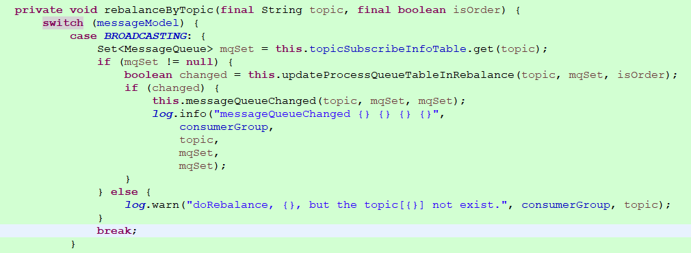


集群模式，首先通过topic和consumerGroup获取consumer列表，然后分配拉取消息队列，默认为平均分配策略AllocateMessageQueueAveragely。

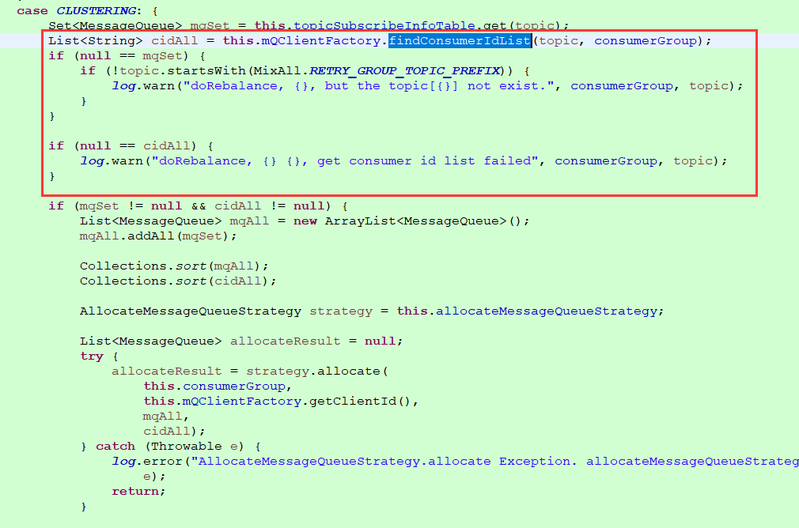


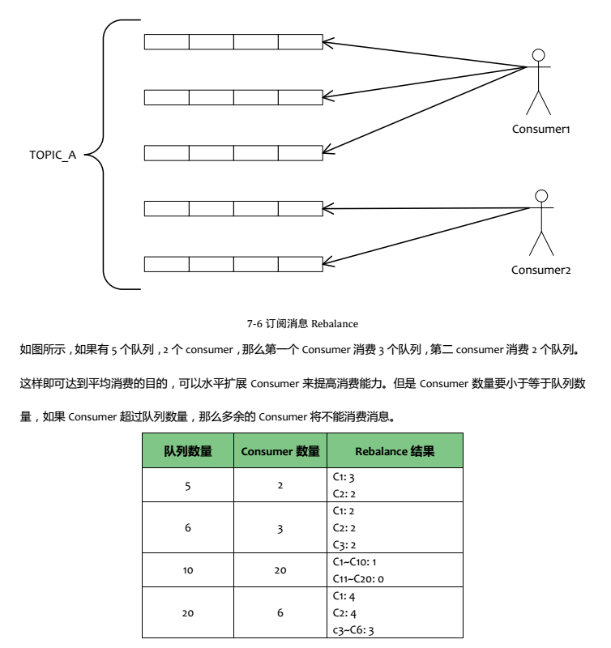


通过上面的测试数据，可以看到AllocateMessageQueueAveragely的allocate方法，就是以上结论。


#### 3.4.3.处理消息

submitConsumeRequest在获的消息的时候，调用ConsumeRequest的run()方法。

当处理消息之后，需要返回ConsumeConcurrentlyStatus类型的结果，一个是成功，另一个是稍后再试。

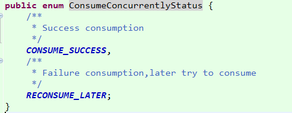

这两个是正常的返回值，如果消息返回null甚至抛出异常。程序会自动判断出来，并做出对用的结果返回值。

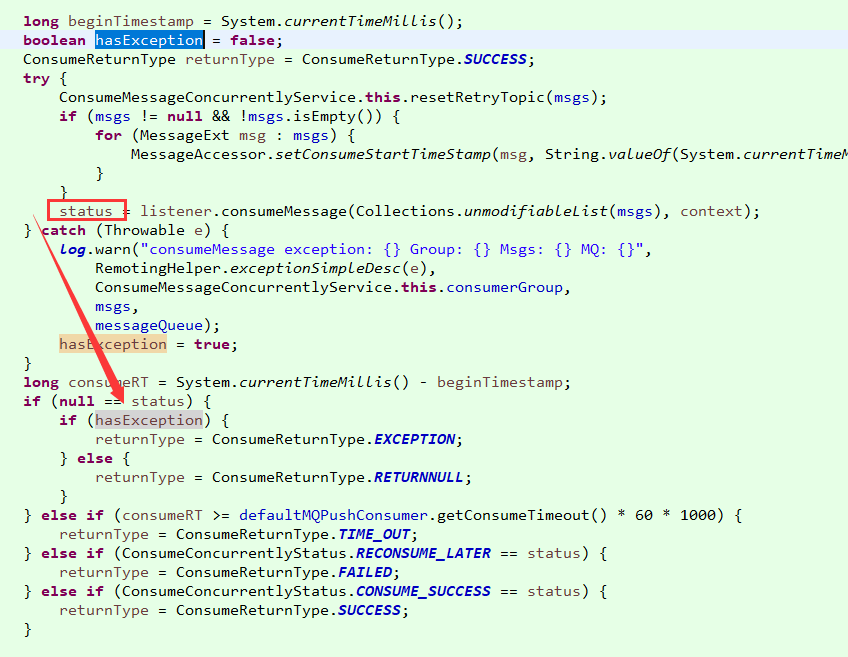

然后进入到结果处理：ConsumeMessageConcurrentlyService#processConsumeResult

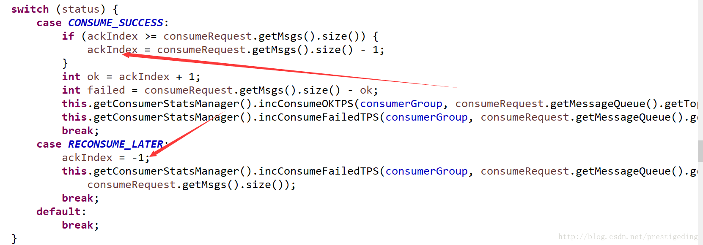

- 如果返回结果是 CONSUME_SUCCESS，此时 ackIndex = msg.size() - 1,,再看发送sendMessageBack 循环的条件，for (int i = ackIndex + 1; i < msg.size() ;;)从这里可以看出如果消息成功，则无需发送sendMsgBack给broker
- 如果返回结果是RECONSUME_LATER， 此时 ackIndex = -1 ，则这批所有的消息都会发送消息给Broker,也就是这一批消息都得重新消费。
- 如果发送ack消息失败，则会延迟5S后重新在消费端重新消费。

1. 根据消费结果，设置ackIndex的值
2. 如果是消费失败，根据消费模式（集群消费还是广播消费），广播模式，直接丢弃，集群模式发送sendMessageBack
3. 更新消息消费进度，不管消费成功与否，上述这些消息消费成功，其实就是修改消费偏移量。（失败的，会进行重试，会创建新的消息)

### 3.5.推送消息（DefaultMQPushConsumerImpl）

得到当前consumer需要拉取的消息队列后，到RebalanceImpl#updateProcessQueueTableInRebalance进行拉取数据请求PullRequest构造，
到DefaultMQPushConsumerImpl#pullMessage进行拉取消息前的逻辑整合，最终通过mQClientFactory内部的mQClientAPIImpl通道到broker异步拉取数据。

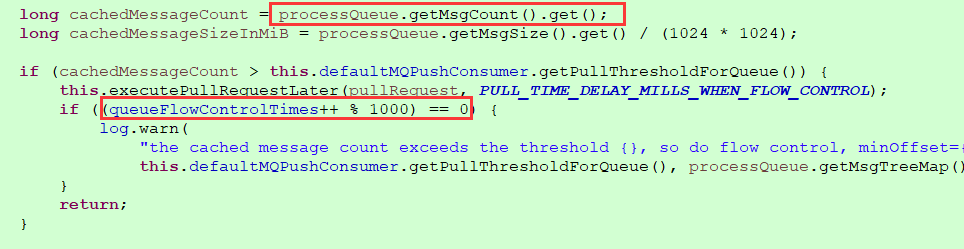

由于拉取的消息，会放到本地队列ProcessQueue进行处理，当发现本地队列大小超过1000，就延迟50ms再拉取。

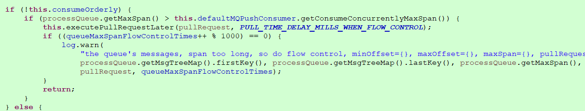


由于消息以offset为key，放入本地队列ProcessQueue的TreeMap中，所以这里有一步span检查。
当span值(即this.msgTreeMap.lastKey() - this.msgTreeMap.firstKey()) 大于2000时，延迟拉取。
由于业务关系，消息消费快慢无法保证，如果offset大的消息处理的快，本地队列就会积压offset小的消息，所以span的值可能会越来越大。

由于是异步拉取消息，所以这里需要构造一个PullCallback对象。onSuccess方法内

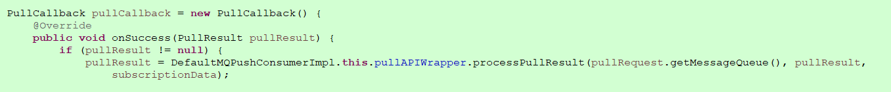


对拉取结果进行处理，如果有消息，反序列化，再进行一步tag的比较去重。broker的ConsumeQueue中保存tag的hashcode值，
所以consumer的此步去重是保证消息的准确性。

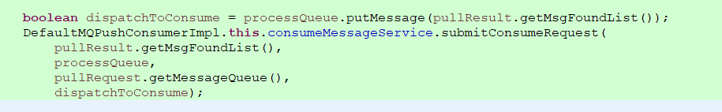

然后将消息放入本地队列，并通过submitConsumeRequest方法构造ConsumeRequest，由于consumeBatchSize为1，
提交任务到consumeExecutor线程池(20个线程)，每线程每消息并发处理，
ConsumeRequest会调用consumeMessageService触发MessageListener#consumeMessage，执行业务处理。

在ConsumeRequest#run业务处理完后，执行processConsumeResult方法

### 3.6.拉取消息（DefaultMQPullConsumerImpl）

consumer是长轮询拉消息，当consumer拉消息时，broker端如果没有新消息，broker会通过PullRequestHoldService服务hold住这个请求
```java
if (brokerAllowSuspend && hasSuspendFlag) {  
	long pollingTimeMills = suspendTimeoutMillisLong;  
	if (!this.brokerController.getBrokerConfig().isLongPollingEnable()) {  
		pollingTimeMills = this.brokerController.getBrokerConfig().getShortPollingTimeMills();  
	}  

	String topic = requestHeader.getTopic();  
	long offset = requestHeader.getQueueOffset();  
	int queueId = requestHeader.getQueueId();  
	PullRequest pullRequest = new PullRequest(request, channel, pollingTimeMills,  
			this.brokerController.getMessageStore().now(), offset, subscriptionData);  
	this.brokerController.getPullRequestHoldService().suspendPullRequest(topic, queueId, pullRequest);  
	response = null;  
	break;  
}  
```

Broker通过ReputMessageService异步构建ConsumeQueue并通过注册的MessageArrivingListener通知PullRequestHoldService#notifyMessageArriving达到有消息，
立即推送给consumer。ReputMessageService#doReput:
```java
if (BrokerRole.SLAVE != DefaultMessageStore.this.getMessageStoreConfig().getBrokerRole()  
		&& DefaultMessageStore.this.brokerConfig.isLongPollingEnable()) {  
	DefaultMessageStore.this.messageArrivingListener.arriving(dispatchRequest.getTopic(),  
			dispatchRequest.getQueueId(), dispatchRequest.getConsumeQueueOffset() + 1,  
			dispatchRequest.getTagsCode());  
}  

public void arriving(String topic, int queueId, long logicOffset, long tagsCode) {  
	this.pullRequestHoldService.notifyMessageArriving(topic, queueId, logicOffset, tagsCode);  
}  
```

### 3.7.消费进度consumerOffset.json

如何维护消费进度：https://blog.csdn.net/GAMEloft9/article/details/103999826

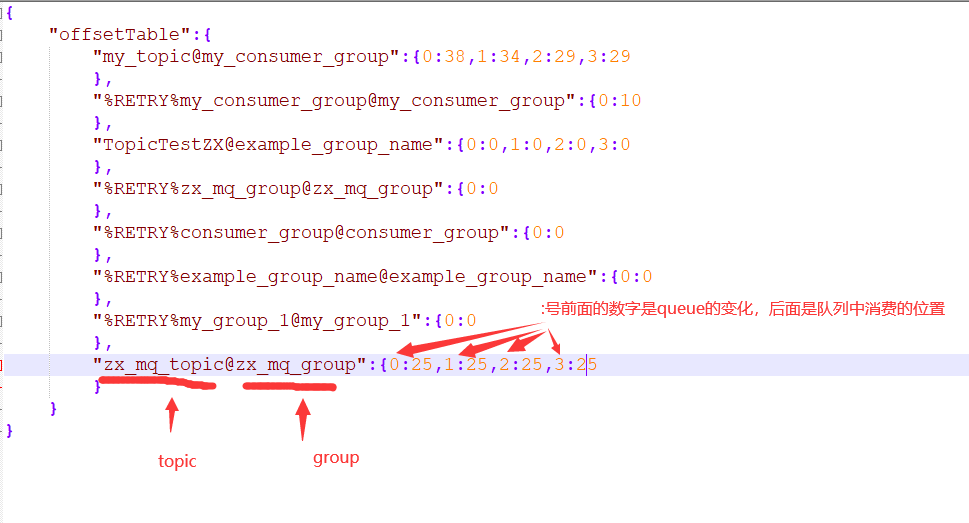

### 3.8.批量消费

设置消费者在每次push消息的时候，设置最大消费数量。consumeMessageBatchMaxSize值默认是1。
设置数量之后，在消息堆积的时候，可以在一定的程度上加速消息消费。
```java
public static void main(String[] args) throws InterruptedException, MQClientException {
    DefaultMQPushConsumer consumer = new DefaultMQPushConsumer("please_rename_unique_group_name_4");
    consumer.setNamesrvAddr("192.168.100.145:9876;192.168.100.146:9876");
    consumer.setConsumeMessageBatchMaxSize(10);
    /**
     * 设置Consumer第一次启动是从队列头部开始消费还是队列尾部开始消费<br>
     * 如果非第一次启动，那么按照上次消费的位置继续消费
     */
    consumer.setConsumeFromWhere(ConsumeFromWhere.CONSUME_FROM_FIRST_OFFSET);
    consumer.subscribe("TopicTest", "*");
    consumer.registerMessageListener(new MessageListenerConcurrently() {
        public ConsumeConcurrentlyStatus consumeMessage(List<MessageExt> msgs, ConsumeConcurrentlyContext context) {
            try {
                System.out.println("msgs的长度" + msgs.size());
                System.out.println(Thread.currentThread().getName() + " Receive New Messages: " + msgs);
            } catch (Exception e) {
                e.printStackTrace();
                return ConsumeConcurrentlyStatus.RECONSUME_LATER;
            }
            return ConsumeConcurrentlyStatus.CONSUME_SUCCESS;
        }
    });
    consumer.start();
    System.out.println("Consumer Started.");
}
```

<p style="color: red">消费批拉超过32条不生效</p>
https://www.jianshu.com/p/4a2d8dfc71b6
Pull数据的时候，最大拉取数据在broker限制为32了。这个是为了让broker上内存的合理使用设计的。我们可以通过设置配置文件配置最大限制。


## 4.生产者


## 5.broker

### 5.1.刷盘方式

同步刷盘：在消息到达MQ后，RocketMQ需要将数据持久化，同步刷盘是指数据到达内存之后，必须刷到commitlog日志之后才算成功，然后返回producer数据已经发送成功。

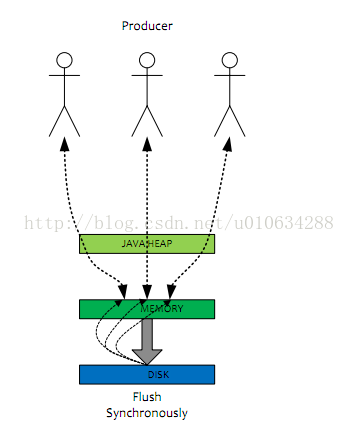


异步刷盘：异步刷盘是指数据到达内存之后,返回producer说数据已经发送成功。然后再写入commitlog日志。

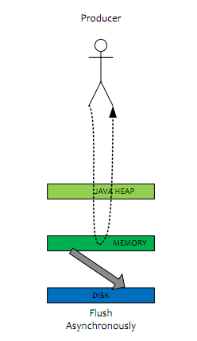


commitlog：commitlog就是来存储所有的元信息，包含消息体，类似于Mysql、Oracle的redolog,所以主要有CommitLog在，Consume
Queue即使数据丢失，仍然可以恢复出来。

consumequeue：记录数据的位置,以便Consume快速通过consumequeue找到commitlog中的数据


## 6.NameServer

## 7.特性

### 7.3.自动创建topic

### 7.3.1.不建议设置topic自动创建

很多网友会问，为什么明明集群中有多台Broker服务器，autoCreateTopicEnable设置为true，表示开启Topic自动创建，
但新创建的Topic的路由信息只包含在其中一台Broker服务器上，这是为什么呢？

预期：为了消息发送的高可用，希望新创建的Topic在集群中的每台Broker上创建对应的队列，避免Broker的单节点故障。

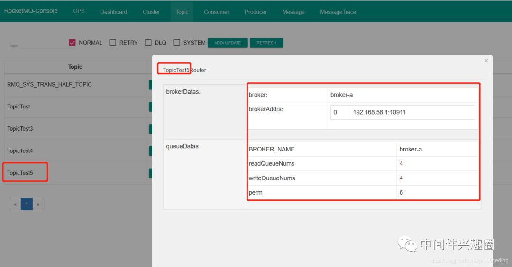

正如上图所示，自动创建的topicTest5的路由信息：

- topicTest5只在broker-a服务器上创建了队列，并没有在broker-b服务器创建队列，不符合期望。
- 默认读写队列的个数为4。

我们再来看一下RocketMQ默认topic的路由信息截图如下：

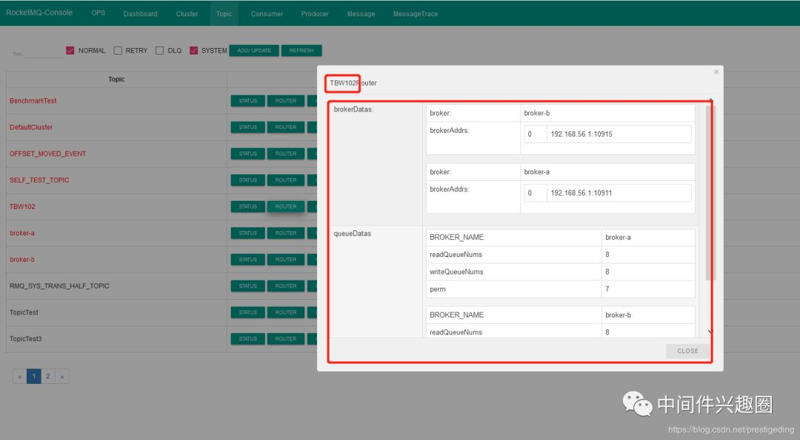

从图中可以默认Topic的路由信息为broker-a、broker-b上各8个队列。

### 7.3.2.思考

默认Topic的路由信息是如何创建的？
- Topic的路由信息是存储在哪里？Nameserver？broker?
- RocketMQ Topic默认队列个数是多少呢？

### 7.3.3.原理

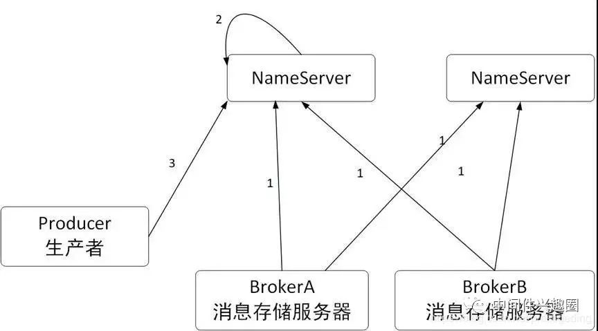

- Broker在启动时向Nameserver注册存储在该服务器上的路由信息，并每隔30s向Nameserver发送心跳包，并更新路由信息。
- Nameserver每隔10s扫描路由表，如果检测到Broker服务宕机，则移除对应的路由信息。
- 消息生产者每隔30s会从Nameserver重新拉取Topic的路由信息并更新本地路由表；在消息发送之前，如果本地路由表中不存在对应主题的路由消息时，会主动向Nameserver拉取该主题的消息。

回到本文的主题：autoCreateTopicEnable，开启自动创建主题，试想一下，如果生产者向一个不存在的主题发送消息时，
上面的任何一个步骤都无法获取到路由信息，那该如何处理这种情况呢？
在RocketMQ中，如果autoCreateTopicEnable设置为true，消息发送者向NameServer查询主题的路由消息返回空时，
会尝试用一个系统默认的主题名称(MixAll.AUTO_CREATE_TOPIC_KEY_TOPIC)，此时消息发送者得到的路由信息为


默认Topic在集群的每一台Broker上创建8个队列，那问题来了，为啥新创建的Topic只在一个Broker上创建4个队列呢？

### 7.3.4.autoCreateTopicEnable机制

温馨提示：本文不会详细跟踪整个创建过程，只会点出源码的关键入口点，如想详细了解NameServer路由消息、消息发送高可用的实现原理，建议查阅笔者的书籍《RocketMQ技术内幕》第二、三章。

Step1：在Broker启动流程中，会构建TopicConfigManager对象，其构造方法中首先会判断是否开启了允许自动创建主题，如果启用了自动创建主题，则向topicConfigTable中添加默认主题的路由信息。

该topicConfigTable中所有的路由信息，会随着Broker向Nameserver发送心跳包中，Nameserver收到这些信息后，更新对应Topic的路由信息表。

BrokerConfig的defaultTopicQueueNum默认为8。两台Broker服务器都会运行上面的过程，故最终Nameserver中关于默认主题的路由信息中，会包含两个Broker分别各8个队列信息。

Step2：生产者寻找路由信息

生产者首先向NameServer查询路由信息，由于是一个不存在的主题，故此时返回的路由信息为空，RocketMQ会使用默认的主题再次寻找，由于开启了自动创建路由信息，NameServer会向生产者返回默认主题的路由信息。然后从返回的路由信息中选择一个队列（默认轮询）。消息发送者从Nameserver获取到默认的Topic的队列信息后，队列的个数会改变吗？答案是会的

消息发送者在到默认路由信息时，其队列数量，会选择DefaultMQProducer#defaultTopicQueueNums与Nameserver返回的的队列数取最小值，DefaultMQProducer#defaultTopicQueueNums默认值为4，故自动创建的主题，其队列数量默认为4。

Step3：发送消息

在消息发送时的请求报文中，设置默认topic名称，消息发送topic名称，使用的队列数量为DefaultMQProducer#defaultTopicQueueNums，即默认为4。

Step4：Broker端收到消息后的处理流程

服务端收到消息发送的处理器为：SendMessageProcessor，在处理消息发送时，会调用super.msgCheck方法：

在Broker端，首先会使用TopicConfigManager根据topic查询路由信息，如果Broker端不存在该主题的路由配置(路由信息),此时如果Broker中存在默认主题的路由配置信息，则根据消息发送请求中的队列数量，在Broker创建新Topic的路由信息。这样Broker服务端就会存在主题的路由信息。

在Broker端的topic配置管理器中存在的路由信息，一会向Nameserver发送心跳包，汇报到Nameserver，另一方面会有一个定时任务，定时存储在broker端，具体路径为${ROCKET_HOME}/store/config/topics.json中，这样在Broker关闭后再重启，并不会丢失路由信息。

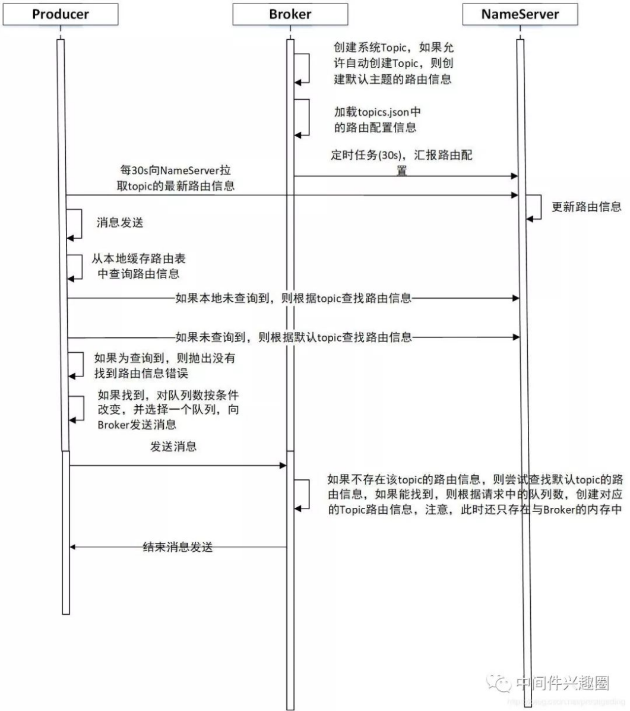

### 7.3.5.现象分析

经过上面自动创建路由机制的创建流程，我们可以比较容易的分析得出如下结论：

因为开启了自动创建路由信息，消息发送者根据Topic去NameServer无法得到路由信息，但接下来根据默认Topic从NameServer是能拿到路由信息(在每个Broker中，存在8个队列)，因为两个Broker在启动时都会向NameServer汇报路由信息。此时消息发送者缓存的路由信息是2个Broker，每个Broker默认4个队列（原因见3.2.1:Step2的分析）。

消息发送者然后按照轮询机制，发送第一条消息选择(broker-a的messageQueue:0)，向Broker发送消息，Broker服务器在处理消息时，首先会查看自己的路由配置管理器(TopicConfigManager)中的路由信息，此时不存在对应的路由信息，然后尝试查询是否存在默认Topic的路由信息，如果存在，说明启用了autoCreateTopicEnable，则在TopicConfigManager中创建新Topic的路由信息，此时存在与Broker服务端的内存中，然后本次消息发送结束。此时，在NameServer中还不存在新创建的Topic的路由信息。

这里有三个关键点：

启用autoCreateTopicEnable创建主题时，在Broker端创建主题的时机为，消息生产者往Broker端发送消息时才会创建。

然后Broker端会在一个心跳包周期内，将新创建的路由信息发送到NameServer，于此同时，Broker端还会有一个定时任务，定时将内存中的路由信息，持久化到Broker端的磁盘上。

消息发送者会每隔30s向NameServer更新路由信息，如果消息发送端一段时间内未发送消息，就不会有消息发送集群内的第二台Broker，那么NameServer中新创建的Topic的路由信息只会包含Broker-a，然后消息发送者会向NameServer拉取最新的路由信息，此时就会消息发送者原本缓存了2个broker的路由信息，将会变为一个Broker的路由信息，则该Topic的消息永远不会发送到另外一个Broker，就出现了上述现象。

原因就分析到这里了，现在我们还可以的大胆假设，开启autoCreateTopicEnable机制，什么情况会在两个Broker上都创建队列，其实，我们只需要连续快速的发送9条消息，就有可能在2个Broker上都创建队列，验证代码如下

```java
public static void main(String[] args) throws MQClientException, InterruptedException {
     DefaultMQProducer producer = new DefaultMQProducer("please_rename_unique_group_name");
     producer.setNamesrvAddr("127.0.0.1:9876");
     producer.start();
     for (int i = 0; i < 9; i++) {
         try {
             Message msg = new Message("TopicTest10" ,"TagA" , ("Hello RocketMQ " + i).getBytes(RemotingHelper.DEFAULT_CHARSET));
             SendResult sendResult = producer.send(msg);
             System.out.printf("%s%n", sendResult);
        } catch (Exception e) {
            e.printStackTrace();
            Thread.sleep(1000);
        }
    }
    producer.shutdown();
}
```

### 7.4.容器环境使用

问题主要是Rocketmq的客户端发生。在例如k8s中，有一下两者场景：

- 每次上线的时候，容器其实都是重新拉取的镜像，所以项目启动后，环境都重新初始化了。
- K8s集群，每次上线我们的服务可能都在不同的k8s Node中启动，node的ip变化了，pod的ip也会变化

根据上面的两个场景，广播模式，出现消息重复消费，偶尔出现broker消费者发现异常的问题等2个问题

1. 消息重复消费，原因是容器中pod的ip会发生变化，而rocketmq broker 与  客户端连接的时候使用的是
client=客户端ip + @ + 客户端进程id，ip是重要的校验指标。尤其是当ip发生变化的时候，
这个pod会被认为是一个新的客户端实例，这样这个实例就会重新消费。
2. 因为上线后，环境重新初始化了，原本保存在本地消费进度（consumeroffset.json）消失了。
   这个时候客户端可能会在之前的node中启动，这样broker认为这个服务还是原来的服务，因为ip没有发生变化，
   但是客户端本地的offset文件不见了，这个和broker校验的时候是校验不过的，到时broker心跳检测client的时候出现异常，
   就是两边的消费进度不匹配。

综上我们发现，无论是node的ip变化与否，都是有问题的。

解决方案：
1. 不使用Rocketmq broadcase model。使用redis的发布/订阅模式
2. 不使用Rocketmq broadcase model。采用dubbo
   容错机制中的broadcastCluster模式，需要返回值的话，还可以自定义dubbo 的
   merge result 采集调用结果
3. 使用rocketmq cluster model
   的伪广播，每个节点都有不同的group，这个实现的时候需要注意group是启动后生成的，可以使用zk临时节点发方式去实现作为唯一性的分布式锁。（生产中有这样的问题，pod上线后，新的3个pod启动后，旧的pod还得运行一段时间才能暂停，所以还是有可能出现重复消费的问题）
4. 携程的方案是对rocketmq进行二次开发，可能是offset的存储方式获clientid的校验方式进行改造
5. pod启动脚本增加统一挂载的共享磁盘。这样offset文件不会丢失；然后，我们重复消费的问题，我们可以使用一个在消息中增加一个version，每次上线启动的时候，version+1，如果当前的version版本一直的话就消费。（这个方案也存在一定的不稳定性）


## 8.原理分析

```text
分析了NameServer实现原理、消息发送与高可用设计、消息存储、消息消费、消息拉取、消息队列负载、消息重试机制、定时消息、消息消费进度管理、消息文件、消息消费队列文件、消息Hash索引机制、消息过滤机制、过期文件删除、顺序消息实现原理、消息主从同步实现原理等。
https://blog.csdn.net/prestigeding/column/info/20603

RocketMQ原理解析-Index： https://www.iteye.com/blog/technoboy-2367786
RocketMQ原理解析-Setup：https://www.iteye.com/blog/technoboy-2368078
RocketMQ原理解析-Name Server：https://www.iteye.com/blog/technoboy-2368379
RocketMQ原理解析-Broker：https://www.iteye.com/blog/technoboy-2368391
RocketMQ原理解析-Producer：https://www.iteye.com/blog/technoboy-2353663
RocketMQ原理解析-Consumer：https://www.iteye.com/blog/technoboy-2368553
RocketMQ原理解析-HA：https://www.iteye.com/blog/technoboy-2368458


https://www.jianshu.com/p/b9d4439599a8
客户端配置详情：https://blog.csdn.net/yousite1/article/details/79101469

常见面试题
https://mp.weixin.qq.com/s/D6mWrkr8Cy2XKMzImkxQCA
https://mp.weixin.qq.com/s/tLiEj_eofWe62d5WlVZe6w
https://github.com/apache/rocketmq/blob/master/docs/cn
https://www.sohu.com/a/129521820_487514

架构流程图：https://www.javazhiyin.com/44018.html
```

## 9.集群

### 9.1.集群模式
1. 低版本的rocketmq只有一种master-slave的冷备方案。正常情况下slave节点资源的利用率很低。且每个进程中只有一个broker。
2. 高版本，增加了DLedger集群方案。使用raft算法，实现集群的高可用。每个进程中有一个BrokerContainer，进程中分为多个broker（Master Broker、Slave Broker、DLedger Broker）。

### 9.2.DLedger集群

[DLedger —基于 raft 协议的 commitlog 存储库](https://zhuanlan.zhihu.com/p/77166786)

[RocketMQ源码分析之Dledger模式](https://blog.csdn.net/qq_25145759/article/details/115110730)

作用：
1. 通过内部混部的方式提高单节点资源利用率（其实还是参考的kafka）；
2. 实现进程内多个commitlog写入。降低单文件的读写压力。

#### 9.2.1.Slave代理Master模式：

作为Master-Slave部署模式的升级。在原先Master-Slave部署模式下，通过备代理主、轻量级心跳、副本组信息获取、broker预上线机制、二级消息逃逸等方式，当同组Master发生故障时，Slave将承担更加重要的作用。

1. 当Master下线后，该组中brokerId最小的Slave会承担备读 以及 一些 客户端和管控会访问 但却只能在Master节点上完成的任务。
2. 当Master下线后，故障Broker组上的二级消息消费将不会中断，由该组中该组中brokerId最小的Slave承担起该任务，定时消息、Pop消息、事务消息等仍然可以正常运行。
3. 当Master下线后，在Slave代理Master一段时间主后，然后当Master再次上线后，通过预上线机制，Master会自动完成元数据的反向同步后再上线，不会出现元数据回退，造成消息大量重复消费或二级消息大量重放。

#### 9.2.2.二级消息与消息逃逸
二级消息一般分为两个阶段，发送或者消费时会发送到一个特殊topic中，后台会有线程会扫描，最终的满足要求的消息会被重新投递到Commitlog中。

在代理模式下，如果存在二级消息的话，就会出现slave节点写数据。破坏slave不可写的语义。所以提出了一种二级消息的逃逸机制。

将重放的二级消息远程或本地投放到其他Master的Commitlog中。 事物消息大概是： half主题 -----> op主题 -----> 消费主题 ----- consumer消费。

默认情况下，会向本地master进行逃逸。分区情况下，可以进行远程逃逸

#### 9.2.3.预上线机制

1. Master Broker向NameServer获取Slave Broker地址（GetBrokerMemberGroup请求），但不注册 
2. Master Broker向Slave Broker发送自己的状态信息和地址 
3. Slave Broker得到Master Broker地址后和状态信息后，建立HA连接，并完成握手，进入Transfer状态 
4. Master Broker再完成握手后，反向获取备的元数据，包括消费位点、定时消息进度等，根据版本号决定是否更新。 
5. Master Broker对broker组内所有Slave Broker都完成1-4步操作后，正式上线，向NameServer注册，正式对外提供服务。

因为master下线期间，消费进度已经落后了，如果直接注册到nameserver，可能造成消息的重新消费。


## 10.Mq配置
### 10.1.broker配置
```properties
#broker所属的集群名字
brokerClusterName=rocketmq-cluster

#broker名字，同个集群中的每个broker应当具有它自己独有的名字
brokerName=broker-a

#设置主broker和从broker 其中0 表示 主机，>0 表示 从机
brokerId=0

#nameServer地址（地址为ip：端口），多个地址之间用分号分割
namesrvAddr=rocketmq-nameserver1:9876;rocketmq-nameserver2:9876

#在发送消息时，自动创建服务器不存在的topic，默认创建的队列数
defaultTopicQueueNums=4
#是否允许 Broker 自动创建Topic，测试时可以开启，实用时关闭，生产建议关闭
autoCreateTopicEnable=true

#是否允许 Broker 自动创建订阅组，测试时可以开启，实用时关闭
#在pull形式消费时若设置了falsename会报subscription group not exist，且收不到消息，在push形式消费时没有影响
autoCreateSubscriptionGroup=true

#Broker 对外服务的监听端口
listenPort=10911

#haService中使用
haListenPort=10912

#主要用于slave同步master
fastListenPort=10909

#定时删除文件时间点，默认凌晨 4点
deleteWhen=04

#文件保留最长时间，默认 72 小时，也就是3天
fileReservedTime=72

#commitLog每个文件的大小默认1G
mapedFileSizeCommitLog=1073741824

#ConsumeQueue每个文件默认存30W条，根据业务情况调整
mapedFileSizeConsumeQueue=300000

#强制删除文件时间间隔（单位毫秒）
#destroyMapedFileIntervalForcibly=120000

#定期检查Hanged文件间隔时间（单位毫秒）
#redeleteHangedFileInterval=120000

#检测物理文件磁盘空间,磁盘空间使用率不能超过88%
diskMaxUsedSpaceRatio=88

#存储总路径
storePathRootDir=/usr/local/rocketmq/store

#commitLog 存储路径
storePathCommitLog=/usr/local/rocketmq/store/commitlog

#消费队列存储路径存储路径
storePathConsumeQueue=/usr/local/rocketmq/store/consumequeue

#消息索引存储路径
storePathIndex=/usr/local/rocketmq/store/index

#异常退出产生的文件存储路径
storeCheckpoint=/usr/local/rocketmq/store/checkpoint

#abort 文件存储路径
abortFile=/usr/local/rocketmq/store/abort

#限制的消息大小，4M
maxMessageSize=4194304

#Commitlog每次刷盘最少页数，每页4kb
flushCommitLogLeastPages=4

#ConsumeQueue每次刷盘最页数，每页4kb
#flushConsumeQueueLeastPages=2

#刷盘时间间隔（单位毫秒），此间隔时间优先级高于上面两个参数，即当时间间隔超过之后直接进行刷盘，不考虑页数问题
#flushCommitLogThoroughInterval=10000
#flushConsumeQueueThoroughInterval=60000

#Broker 的角色 （1） ASYNC_MASTER 异步复制Master （2） SYNC_MASTER 同步双写Master （3） SLAVE
brokerRole=ASYNC_MASTER

#刷盘方式 （1） ASYNC_FLUSH 异步刷盘 （2）SYNC_FLUSH 同步刷盘
flushDiskType=ASYNC_FLUSH

#是否开启事务check过程，消息体量大的时候可以不开启，默认为关闭状态
checkTransactionMessageEnable=false

#发消息线程池数量（如果不做配置，个数为16+（核*线程）*4）
#sendMessageThreadPoolNums=128

#拉消息线程池数量（如果不做配置，个数为16+（核*线程）*4）
#pullMessageThreadPoolNums=12
```

## 11.面试题

<p style="color: red">如果一次拉取消息n条（n > 0），消费的时候，最后一条消费失败了，前n-1条是成功的。重试的时候是怎么消费的?</p>
这n条都会重新消费

RocketMQ的消费过程：https://www.jianshu.com/p/7126aaee5f55

<p style="color: red">rocketmq 顺序消息实现原理</p>
rocketmq 发送消息，提供了两种消息的负载均衡的规则。随机和hash。 SelectMessageQueueByRandom 和 SelectMessageQueueByHash
我们一个可以自定义消息发送负载均衡算法，我们可以指定一个queue中。实现消息的FIFO。
但是需要注意的是，我们的消费方，应该使用单线程进行消费。否则可以出现多线程乱序消费，导致有序失败

<p style="color: red">延迟消息实现原理</p>

https://blog.csdn.net/qq924862077/article/details/84987179

rocketmq 中有一个topic是 schedule_message_xxxx的消息队列，用来保存延迟的消息，这个topic是不能被订阅的。

rocketmq 使用的是jdk的timer类实现的定时轮询，重队列里面根据每个延迟消息的offset（保存的位置）将消息拿出来，

并还原到原来的消息队列中（默认队列尾），这样消费者就能看到消息了。

消息失败达到最大重试次数的消息会被发送到死信队列，销毁消息。
<p style="color: red">事务消息原理</p>

https://www.cnblogs.com/qdhxhz/p/11191399.html

https://blog.csdn.net/d729332647/article/details/79324767

https://www.jianshu.com/p/7f517398d27e

代码入口： TransactionalMessageCheckService。这里涉及到3个topic

RMQ_SYS_TRANS_HALF_TOPIC保存半消息，每60s取一次消息，判断是否有需要会查的消息。

RMQ_SYS_TRANS_OP_HALF_TOPIC保存完成半消息的数据。要是判断需要校验的话，就像生产者发送消息进行会查，否则就将消息转移到真正的topic中。

<p style="color: red">消息重试机制</p>
1. Producer端重试

也就是Producer往MQ上发消息没有发送成功，我们可以设置发送失败重试的次数，重试的场景也是比较简单的。比如下面的：

```java
DefaultMQProducer producer = new DefaultMQProducer("please_rename_unique_group_name");
producer.setNamesrvAddr("192.168.100.145:9876;192.168.100.146:9876");
//失败的情况发送10次，默认是2次
producer.setRetryTimesWhenSendFailed(10);
```

2. Consumer端重试
   
触发条件：程序抛出Exception或者我们自己返回重试的状态

一般重复16次 10s、30s、1分钟、2分钟、3分钟等等。触发的机制如下。一般消费出现异常向外抛出的时候，
客户端程序会自动判别异常，进行重试，不需要return 状态值。
如果程序中出现异常后，可以我们进行try-catch进行判断，手动return状态值进行重试与否。

```java
// 上面的代码中消费异常的情况返回
return ConsumeConcurrentlyStatus.RECONSUME_LATER;//重试
// 正常则返回：
return ConsumeConcurrentlyStatus.CONSUME_SUCCESS;//成功
```

在消费者是多实例集群的时候，如果发生异常，触发的重试机制，消息是在同一个节点上重试的，
不会再不同的机器上重试（这个地方是客户端程序进行重试的）。
但是要是这个机器宕机了，会换到另一个节点上重试（重试次数从0开始）

3. 超时的情况

场景是程序消费消息的时间过长，这种情况MQ会无限制的发送给消费端。就是由于网络的情况，
MQ发送数据之后，Consumer端并没有收到导致超时。也就是消费端没有给我返回return
ConsumeConcurrentlyStatus.CONSUME_SUCCESS;这样的就认为没有到达Consumer端。

<p style="color: red">如何保证消息不丢失</p>
大致的方案：https://www.jianshu.com/p/3213d8c29fd0

结合源码分析分案：https://www.cnblogs.com/goodAndyxublog/p/12563813.html

分别从Producer发送机制、Broker的持久化机制，以及消费者的offSet机制来最大程度保证消息不易丢失

要保证数据可靠，需采用同步刷盘和同步双写的方式，但性能会较其他方式低

或者再实时性和数据量不大的情况下，采用多master同步刷盘性能最好，但可用性较低。

实际中，mq作为公共资源，是没有办法轻易修改刷盘与同步方式的。所以对数据要求严格的场景，
我们会在生产者端记录消息到数据库，之后去生产者端进行数据校验。

<p style="color: red"></p>
<p style="color: red"></p>