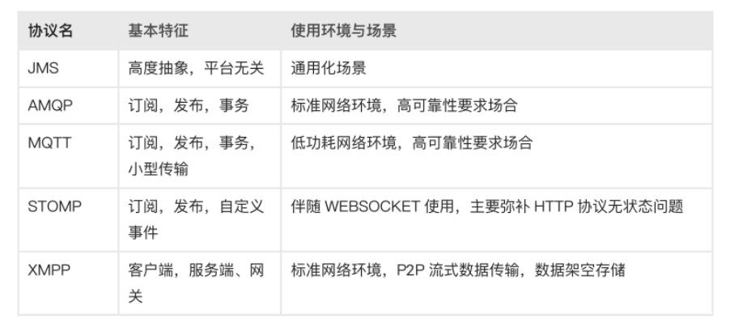
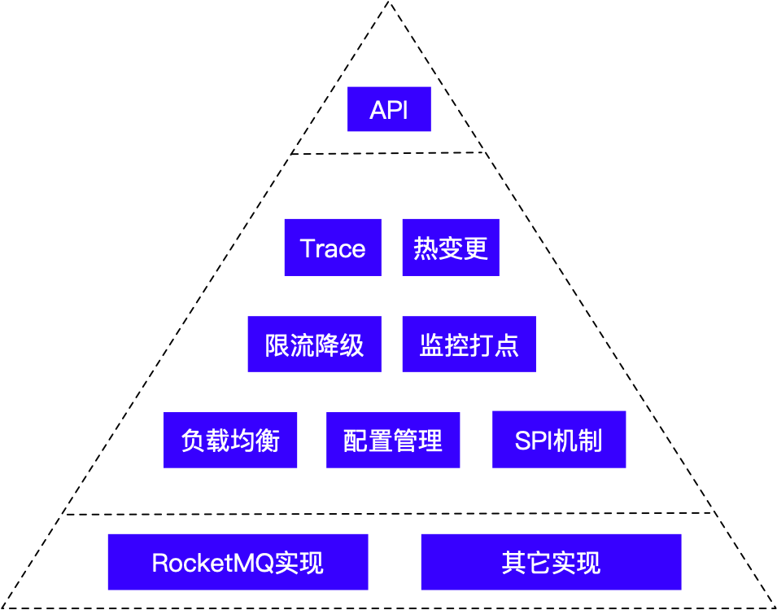

# 消息队列

## 1.基础

### 1.1.什么是MQ

消息队列作为高并发系统的核心组件之一，能够帮助业务系统解构提升开发效率和系统稳定性。主要具有以下优势：

- 削峰填谷（主要解决瞬时写压力大于应用服务能力导致消息丢失、系统奔溃等问题）
- 系统解耦（解决不同重要程度、不同能力级别系统之间依赖导致一死全死）
- 提升性能（当存在一对多调用时，可以发一条消息给消息系统，让消息系统通知相关系统）
- 蓄流压测（线上有些链路不好压测，可以通过堆积一定量消息再放开来压测）

### 1.2.主流MQ协议

[消息中间件系列介绍—作用及协议](https://zhuanlan.zhihu.com/p/575516606)

1. JMS
- 即Java消息服务（Java Message Service）应用程序接口，不仅仅是一种协议也是是J2EE定义的规范。绝大多数MOM提供商都对JMS提供支持。
- 典型案例：ActiveMQ

2. AMQP协议
- AMQP即Advanced Message Queuing Protocol，一个提供统一消息服务的应用层标准高级消息队列协议，是应用层协议的一个开放标准，
为面向消息的中间件设计。基于此协议的客户端与消息中间件可传递消息， 并不受客户端/中间件不同产品，不同开发语言等条件的限制。 
- 优点：可靠、通用
- 比较知名的产品有 StormMQ、RabbitMQ、Apache Qpid等

3. MQTT协议
- MQTT（Message Queuing Telemetry Transport，消息队列遥测传输）是IBM开发的一个即时通讯协议， 是物联网的重要组成部分。
  该协议支持所有平台，几乎可以把所有联网物品和外部连接起来， 被用来当做传感器和致动器（比如通过Twitter让房屋联网）的通信协议。 
- 优点：格式简洁、占用带宽小、移动端通信、PUSH、嵌入式系统
- [MQTT中文网](http://mqtt.p2hp.com/)
- 支持的产品：RocketMQ、RabbitMQ 通过插件支持。

4. STOMP协议
- STOMP（Streaming Text Orientated Message Protocol）是流文本定向消息协议， 是一种为MOM(Message Oriented Middleware，面向消息的中间件)设计的简单文本协议。 
  STOMP提供一个可互操作的连接格式，允许客户端与任意STOMP消息代理（Broker）进行交互。 
- 优点：命令模式（非topic\queue模式）

5. XMPP协议
- XMPP（可扩展消息处理现场协议，Extensible Messaging and Presence Protocol）
   是基于可扩展标记语言（XML）的协议，多用于即时消息（IM）以及在线现场探测。适用于服务器之间的准即时操作。
   核心是基于XML流传输，这个协议可能最终允许因特网用户向因特网上的其他任何人发送即时消息，即使其操作系统和浏览器不同。 
- 优点：通用公开、兼容性强、可扩展、安全性高，但XML编码格式占用带宽大

6. 其他基于TCP/IP自定义的协议
- 有些特殊框架（如：redis、kafka、zeroMq等）根据自身需要未严格遵循MQ规范，而是基于TCP\IP自行封装了一套协议，
通过网络socket接口进行传输，实现了MQ的功能。

## 2.选型

- [我与消息队列的八年情缘](https://mp.weixin.qq.com/s/PphJjWrihspgDfRWTo-xOw)
- [哈啰在分布式消息治理和微服务治理中的实践](https://mp.weixin.qq.com/s/N-vd6he4nsZp-G3Plc4m6A)
- [新一代消息队列 Pulsar](https://mp.weixin.qq.com/s/wYb9UQWYJf8ay1DbLXaZDQ)

### 2.1.比较
[消息队列基本原理和选型对比](https://mp.weixin.qq.com/s/WuIjtx1PjICG4gFZE5X6-g)

| 特性              | ActiveMQ                | RabbitMQ   | RocketMQ         | Kafka            |
| ------------------- | ------------------------- | ------------ | ------------------ | ------------------ |
| producer-comsumer | 支持                    | 支持       | 支持             | 支持             |
| publish-subscribe | 支持                    | 支持       | 支持             | 支持             |
| request-replay    | 支持                    | 支持       | 支持             | 支持             |
| 多语言支持        | 支持                    | 支持       | 不支持           | 支持             |
| 单机高吞吐        | 万级                    | 万级       | 万级             | 十万级           |
| 消息延迟          |                         | 微秒级     | 毫秒级           | 毫秒级           |
| 可用性            | 高（主从）              | 高（主从） | 非常高（分布式） | 非常高（分布式） |
| 消息丢失          | 低                      | 低         | 理论上不丢失数据 | 理论上不丢失数据 |
| 消息重复          | 会重复                  | 可控制     | 会重复           | 会重复           |
| api完整性         | 高                      | 高         | 高               | 高               |
| 文档完整性        | 高                      | 高         | 高               | 高               |
| 提供快速入门      | 有                      | 有         | 有               | 有               |
| 首次部署难度      | 低                      | 低         | 低               | 中               |
| 部署方式          | 独立或者嵌入式          | 独立       | 独立             | 独立             |
| 社区活跃度        | 低                      | 高         | 中               | 高               |
| 商业支持          | 无                      | 无         | 阿里云           | 无               |
| 成熟度            | 成熟                    | 成熟       | 成熟             | 成熟（日志领域） |
| 协议              | AMQP，REST，XMPP          | AMQP       | 自定义           | 无               |
| 持久化            | 内存、文件、数据库 可选 | 内存、文件 | 文件             | 文件             |
| 消息事务          | 支持                    | 支持       | 支持             | 不支持           |
| 负载均衡          | 支持                    | 支持       | 支持             | 支持             |
| 管理界面          | 一般                    | 好         | 好               | 不好             |

1. ActiveMQ
- 优点：产品成熟、使用广泛、跨语言客户端多、文档丰富、协议支持的多
- 缺点：高吞吐下，堆积消息容易Hang住；某些不稳定的环境容易丢失数据；无法支持大规模多队列的场景。

2. RabbitMQ
- 优点：erlang的特性就是高性能。可视化界面支持的好，支持中文，可搭建大规模集群
- 缺点：不好扩展，集群不支持动态扩展。是管子不是池子。RabbitMQ对消息堆积的支持并不好，当大量消息积压的时候，会导致 RabbitMQ 的性能急剧下降

3. RocketMQ
- 优点：接口易用，架构简单，易扩展。支持的特性多。社区活跃，使用Java开发易扩展。淘宝使用50台服务器搭建集群，实现日处理百亿消息。
- 缺点：内部实现的协议，客户端只支持Java/C/GO。

4. Kafka
- 优点：性能最好的mq，大量使用在大数据领域。
- 缺点：不适合大规模集群，功能单一，需要用户进行二次封装。

### 1.2.选型原则

根据场景选型，比如
- 金融场景适合 RocketMQ，可实现公司级超大规模集群
- 大数据应用场景，适合 kafka。重点在于日志传输，以及消息总线
- OA办公软件，适合 ActiveMQ，功能多，文档丰富。

## 2.MQ需要注意的问题

1. 发送消息   
   消息已经在broker上已经接收到（甚至已经完成持久化），由于网络闪断、客户端宕机等问题，导致服务端对客户端应答失败，
   如果此时生产者意识到消息发送失败并尝试再次发送消息。
2. 消费消息  
   消息已投递到消费者并完成业务处理，当客户端给服务端反馈应答的时候网络闪断。
3. reblance   
   包括但不限于网络抖动、Broker或客户端重启、扩容或缩容时

出现上面问题时，可能出现
- 消息丢失
- 消息重复

语义：Exactly Once(即消息肯定会被成功消费，并且只会被消费一次)
RocketMQ Exactly-Once方案：
[https://help.aliyun.com/document_detail/102777.html](https://help.aliyun.com/document_detail/102777.html)

而大多数情况下，都需要我们应用程序自己实现幂等性；通过数据库实现消息的最终一致性。

## 3.封装三方包

### 3.1.设计思想
我们的思维认知是封装一层可以减少研发人员使用第三方组件的心智投入，统一技术栈，也就如此了。

但是一个糟糕的封装却是灾难的开始，消息的SDK封装策略：

1. 对外只提供最基本的 API，所有访问必须经过SDK提供的接口。
   简洁的 API 就像冰山的一个角，除了对外的简单接口，下面所有的东西都可以升级更换，而不会破坏兼容性;
2. 业务开发起来也很简单，只要需要提供 Topic（全局唯一）和 Group
   就可以生产和消费，不用提供环境、NameServer 地址等。SDK 内部会根据
   Topic 解析出集群 NameServer
   的地址，然后连接相应的集群。生产环境和测试环境环境会解析出不同的地址，从而实现了隔离；
3. 上图分为 3 层，第二层是通用的，第三层才对应具体的 MQ
   实现，因此，理论上可以更换为其它消息中间件，而客户端程序不需要修改；
4. SDK 内部集成了热变更机制，可以在不重启 Client
   的情况下做动态配置，比如下发路由策略（更换集群 NameServer
   的地址，或者连接到别的集群去），Client 的线程数、超时时间等。通过
   Maven 强制更新机制，可以保证业务使用的 SDK 基本上是最新的。

### 3.2.短信服务

短信服务应用很广泛，比如用户注册登录验证码，营销短信，下单成功短信通知等等。最开始设计短信服务的时候，
我想学习业界是怎么做的。于是把目标锁定在腾讯云的短信服务上。腾讯云的短信服务有如下特点：

- 统一的SDK，后端入口是http/https服务 ， 分配appId/appSecret鉴权；
- 简洁的API设计：单发，群发，营销单发，营销群发，模板单发，模板群发。

于是，我参考了这种设计思路。

1. 模仿腾讯云的SDK设计，提供简单易用的短信接口；
2. 设计短信服务API端，接收发短信请求，发送短信信息到消息队列；
3. worker服务消费消息，按照负载均衡的算法，调用不同渠道商的短信接口；
4. Dashboard可以查看短信发送记录，配置渠道商信息。
