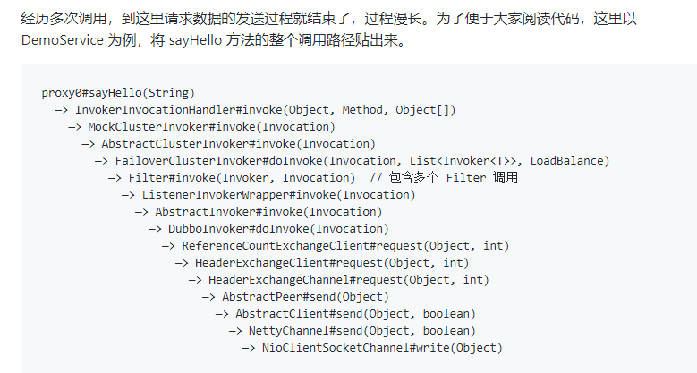

# dubbo笔记

官网：[https://dubbo.apache.org/zh/](https://dubbo.apache.org/zh/)

Dubbo高级面试题：[http://dubbo.apache.org/zh-cn/docs/source_code_guide/dubbo-spi.html](http://dubbo.apache.org/zh-cn/docs/source_code_guide/dubbo-spi.html)
- [5 分钟读懂开源服务框架 Dubbo 及其最新规划](https://mp.weixin.qq.com/s/GvDES9uXlboA8t3sk_ko1Q)
- [提升集群吞吐量与稳定性的秘诀： Dubbo 自适应负载均衡与限流策略实现解析](https://mp.weixin.qq.com/s/WoqbJWw_Q3u6wWjWJ9UoGg)
- [如何用一个端口同时暴露 HTTP1/2、gRPC、Dubbo 协议？](https://mp.weixin.qq.com/s/3Qr6diH6WJSwv8HIma7-eA)
Dubbo 框架底层可灵活的选用 HTTP/2、HTTP/REST、TCP、gRPC、JsonRPC、Hessian2 等任一 RPC 通信协议，同时享用统一的 API 与对等的服务治理能力。同时，我们还介绍了 Dubbo 的单端口多协议能力，也就是在单个端口同时监听、处理多个协议，这对于简化多协议同时发布的场景非常有用。


## 1.概念介绍

Apache Dubbo 是一款 RPC 微服务框架，提供了包括 Java、Golang 等在内的多种语言 SDK 实现。

整体架构：https://dubbo.apache.org/zh/docs3-v2/java-sdk/concepts-and-architecture/overall-architecture/

十层代码架构：https://dubbo.apache.org/zh/docs3-v2/java-sdk/concepts-and-architecture/code-architecture/

服务调用扩展点：https://dubbo.apache.org/zh/docs3-v2/java-sdk/concepts-and-architecture/service-invocation/

## 2.使用教程

springboot使用案例：https://dubbo.apache.org/zh/docs3-v2/java-sdk/quick-start/spring-boot/

跨语言服务：https://dubbo.apache.org/zh/docs3-v2/java-sdk/quick-start/idl/

特性：https://dubbo.apache.org/zh/docs3-v2/java-sdk/advanced-features-and-usage/

## 3.Dubbo Admin

通过dubbo监控中心和后台管理可以很好的监控dubbo服务，监控服务端服务和客户端调用情况，调用次数，调用日志，
方便问题查找。下面我们看看dubbo的管理后台和监控中心怎么部署。

源码:[https://github.com/apache/dubbo-admin/blob/develop/README_ZH.md](https://github.com/apache/dubbo-admin/blob/develop/README_ZH.md)

## 4.工作原理

Dubbo值得学习的地方，是他自己实现了一套SPI，自己实现了一套IOC容器，维护内部对象。


### 4.2.扩展点
SPI原理：https://dubbo.apache.org/zh/docs3-v2/java-sdk/reference-manual/spi/description/dubbo-spi/

扩展点：https://dubbo.apache.org/zh/docs3-v2/java-sdk/reference-manual/spi/description/

### 4.2.集群容错模式

服务保护的原则上是避免发生类似雪崩效应，尽量将异常控制在服务周围，不要扩散开。

dubbo自身的重试机制，默认3次，当失败时会进行重试，这样在某个时间点出现性能问题，然后调用方再连续重复调用，很容易引起雪崩，建议的话还是很据业务情况规划好如何进行异常处理，何时进行重试。

在生产环境默认是不推荐使用失败重试的。

服务保护的话，目前我们主要从以下几个方面来实施：

1. 考虑服务的dubbo线程池类型（fix线程池的话考虑线程池大小）、数据库连接池、dubbo连接数限制是否都合适。

2. 考虑服务超时时间和重试的关系，设置合适的值。

3. 一定时间内服务异常数较大，则可考虑使用failfast让客户端请求直接返回或者让客户端不再请求。


#### 4.2.1.Failover Cluster 失败自动切换

调用实例失败后，继续调用其他实例。假如有 3 个实例：A, B, C，当调用 A
失败后，再调用 B，如果还是失败，则调用 C。

这里的异常不是服务端程序出现的异常，而是dubbo的RpcException才会触发重试（*异常类型*）

#### 4.2.2.Failfast Cluster 快速失败，抛出异常

调用实例失败后，如果有报错，则直接抛出异常。

这里的异常不是服务端程序出现的异常，而是dubbo的RpcException才会触发重试（*异常类型*）

#### 4.2.3.Failsafe Cluster 快速失败，不抛出异常

调用实例失败后，如果有报错，则忽略掉异常，返回一个正常的空结果。

这里的异常不是服务端程序出现的异常，而是dubbo的RpcException才会触发重试（*异常类型*）

#### 4.2.4.Failback Cluster 失败后定时重试

调用实例发生异常后，一段时间后重新再调用，直到调用成功。

这里的异常不是服务端程序出现的异常，而是dubbo的RpcException才会触发重试（*异常类型*）

#### 4.2.5.Forking Cluster 并行调用多个实例，只要一个成功就返回

并行调用多个实例，只要一个成功即返回。通常用于实时性要求较高的读操作，但需要浪费更多服务资源。可通过
forks=”2” 来设置最大并行数。通过 timeout=”1000” 来设置调用超时时间。

如何使用(forks默认就是2，在使用forking的时候生效，forks该版本不能设置)

#### 4.2.6.Broadcast Cluster 广播调用所有实例，有一个报错则抛出异常

广播调用所有提供者，逐个调用，任意一台报错则报错。通常用于通知所有提供者更新缓存或日志等本地资源信息。

#### 4.2.7.Available Cluster 可用的实例

调用目前可用的实例（只调用一个），如果当前没有可用的实例，则抛出异常。

#### 4.2.8.Mergeable Cluster 合并结果

该集群容错模式下，可以合并结果集，一般和 group 一起使用。

假如有 4 个provider，

A(group=dubbo_provider_1) B(group=dubbo_provider_1)

C(group=dubbo_provider_2) D(group=dubbo_provider_2)

消费者 E(group=*)

消费端配置： <dubbo:reference merger="true" />

现在有两个分组，dubbo_provider_1 和 dubbo_provider_2 。消费者会从AB中选择一个调用，CD中选择一个调用。

其实合并结果就是分组聚合。如果只有AB两个服务的话就只会调用其中一个。

### 4.3.Dubbo的异常

Dubbo的异常只有一个类型：RpcException

Dubbo在设计的时候，使用RpcException代表的6中类型


### 4.4.Zk的作用

zk在dubbo中是服务注册与发现的注册中心,dubbo的调用过程是consumer和provider在启动的时候就和注册中心建立一个socket长连接。provider将自己的服务注册到注册中心上,注册中心将可用的提供者列表notify给consumer,consumer会将列表存储到本地缓存,consumer选举出一个要调用的提供者,去远程调用。

(1) 如果这时候使用的是单点的zk,当zk宕机了,会发生什么呢？

zk宕机后不会影响现有consumer和provider之间的调用,但是新的provider想要注册到注册中心上是不行的,因为zk已经宕机了。因此单点zk一旦宕机就会影响新的提供者的注册,和新的消费者去订阅可用列表。

(1) 搭建集群时搭建几台呢？

建议是搭建奇数台,最少搭建三台,搭建偶数可以吗?是可以的,但是在选举过程中没有太大用处,因为zk的leader也是遵从半数规则,使用公式计算半数(zk服务器的总数/2+1),3的半数是2,4的半数是3,因此3台和4台允许宕机的机器数都是1台。

(1) 数据的一致性如何保证呢?

zk的数据结构,是类似于树形结构的，我们可以看到在com.foo.BarService这个接口下的providers下可以有多个节点,也即多个提供者,假设BarService这个接口对应的提供者有两个,这时有两个客户端同时请求这个接口,一个客户端请求提供者1,另一个客户端请求提供者2,同时执行的业务逻辑是将a的值加1,他们请求到的a的值都是0,这时,最终的结果是什么呢?在分布式情况下保证数据一致性是一个必须思考的问题,解决办法有很多,例如,分布式锁,版本控制等。

zk有自己的机制,在集群的情况下,zk会选举出一个leader负责写操作,剩下的都可以负载读操作,这样就可以将读写分离,保证的单一性,因此就不会出现上述数据不一致的情况了

### 4.5. Dubbo调用过程

学习笔记：[https://www.cnblogs.com/aspirant/p/9002663.html](https://www.cnblogs.com/aspirant/p/9002663.html)

服务调用过程源码分析：[https://my.oschina.net/LucasZhu/blog/1928494](https://my.oschina.net/LucasZhu/blog/1928494)

RPC调用过程：
[https://blog.csdn.net/sinat_41721615/article/details/97919847](https://blog.csdn.net/sinat_41721615/article/details/97919847)

服务之间是怎么进行消费的:
[https://mp.weixin.qq.com/s/en-LDZiI9Rd3jB5aFjFnHQ](https://mp.weixin.qq.com/s/en-LDZiI9Rd3jB5aFjFnHQ)

官网讲的最好。

Consumer端的调用方法栈如下（集群模式）




Provider调用过程


### 4.6.dubbo 怎么判断一个响应是哪个请求的？

我们一般使用dubbo作为同步调用的接口，但是dubbo默认使用的是netty作为底层网络通信，netty是异步的

有总结性的教学博客：

1.原理浅析： [https://www.cnblogs.com/aspirant/p/9002631.html](https://www.cnblogs.com/aspirant/p/9002631.html)

2.集群容错模式-负载均衡模式：[https://www.cnblogs.com/aspirant/p/9001498.html](https://www.cnblogs.com/aspirant/p/9001498.html)

4.dubbo的特点，8种通信协议之对比：[https://www.cnblogs.com/aspirant/p/9006670.html](https://www.cnblogs.com/aspirant/p/9006670.html)

5.Dubbo从下载到编译成功：[https://www.cnblogs.com/aspirant/p/9007288.html](https://www.cnblogs.com/aspirant/p/9007288.html)

6.dubbo 架构图以及调用过程：[https://www.cnblogs.com/aspirant/p/9002663.html](https://www.cnblogs.com/aspirant/p/9002663.html)

源码讲解dubbo：[https://www.jianshu.com/nb/32484773](https://www.jianshu.com/nb/32484773)

简单说：在接口时同步调用的情况下

1.在消费者端，一次dubbo接口调用，会在被封装成一个request对象，其中包括一个id值，id是一个自增的id值，每次请求id都会自增，所有请求都有一个独一无二的id（在一个消费端），这个id保存在map中，key=id,
value=调用方信息封装成对象。发送请求后，dubbo就会生产一个FutureTask的对象，通过condition的await方法阻塞式的等待消费返回。消息返回后，根据id找到找到调用方对象，获得FutureTask进行single，线程运行，获得调用结果。这样就是一个同步阻塞式的接口调用

2.生产者端的话，接口请求的时候，包括这个id，通过RPCContext获得消费者的ip:port，后面的调用也一样，通过一个新的request的id，去执行service、dao等，最终将结果根据id找到消费者的请求id，后面是一样的了

### 4.7.自己如何写一个装饰器模式 如何实现一个rpc框架

[https://blog.csdn.net/u014513171/article/details/93161597](https://blog.csdn.net/u014513171/article/details/93161597)

### 4.8.【好未来】dubbo的扩展机制介绍下？如何自己扩展一个dubbo的扩展协议

[https://blog.csdn.net/qq_33589510/article/details/95177225](https://blog.csdn.net/qq_33589510/article/details/95177225)

### 4.9.服务暴露过程

[https://mp.weixin.qq.com/s/VGEONhIw8JZLGHS72iGZMg](https://mp.weixin.qq.com/s/VGEONhIw8JZLGHS72iGZMg)

Dubbo服务在暴露的时候是会进行远程暴露与本地暴露。本地暴露是为了本地方法调用，不用去远程走一遍。

### 4.10.平滑迁移 Dubbo 服务

双注册中心方案。比如zk迁移到nacos。

[https://mp.weixin.qq.com/s/UpcS_gmh39nMS07N6ih-xg](https://mp.weixin.qq.com/s/UpcS_gmh39nMS07N6ih-xg)

## 5.最佳实践

### 5.1.dubbo一个提供方和一个消费方，默认使用单一长连接

如果消费方调用提供方其中一个服务比较慢，则会造成其它服务缓慢，解决办法是设置多个连接。

但连接数过多也会造成服务端连接暴满的问题，需要根据实际情况设置。

全局设置：

<dubbo:protocol name="dubbo" connections="2" />

单个服务设置：

<dubbo:service connections=”2”>或<dubbo:reference connections=”2”>表示该服务使用独立两条长连接。

### 5.2.事件分发模式

Dispatcher调度策略

- all
  所有消息都派发到线程池，包括请求，响应，连接事件，断开事件，心跳等。

- direct 所有消息都不派发到线程池，全部在IO线程上直接执行。

- message
  只有请求响应消息派发到线程池，其它连接断开事件，心跳等消息，直接在IO线程上执行。

- execution
  只请求消息派发到线程池，不含响应，响应和其它连接断开事件，心跳等消息，直接在
  IO 线程上执行。

- connection 在 IO
  线程上，将连接断开事件放入队列，有序逐个执行，其它消息派发到线程池。

<dubbo:protocol name="dubbo" port="20880" dispatcher="all" />

通过代码可以知道默认的是all
```java
@SPI(AllDispatcher.NAME)
public interface Dispatcher {
    /**
      * dispatch the message to threadpool.
      * @param handler
      * @param url
      * @return channel handler
      */
    @Adaptive({Constants.DISPATCHER_KEY, "dispather", "channel.handler"})
    // The last two parameters are reserved for compatibility with the old configuration
    ChannelHandler dispatch(ChannelHandler handler, URL url);
}
```

### 5.3.线程池配置
- fixed 固定大小线程池，启动时建立线程，不关闭，一直持有。(缺省)
- cached 缓存线程池，空闲一分钟自动删除，需要时重建。
- limited   可伸缩线程池，但池中的线程数只会增长不会收缩。只增长不收缩的目的是为了避免收缩时突然来了大流量引起的性能问题。
- eager   优先创建Worker线程池。在任务数量大于corePoolSize但是小于maximumPoolSize时，优先创建Worker来处理任务。当任务数量大于maximumPoolSize时，将任务放入阻塞队列中。阻塞队列充满时抛出RejectedExecutionException。(相比于cached:cached在任务数量超过maximumPoolSize时直接抛出异常而不是将任务放入阻塞队列)

<dubbo:protocol name="dubbo" port="${dubbo.protocol.port}"
server="netty" client="netty" serialization="dubbo" charset="UTF-8"
threadpool="fixed" threads="500" queues="0" buffer="8192" accepts="0"
payload="8388608"
iothreads=“9” />

默认线程池核心线程数为：200,最大线程数为200,queue为SyncronouseQueue。

考虑下，如果出现请求200个处理线程都不够，再来一个请求会发生什么情况？

底层会抛一个RejectedExecutionException，使用的是dubbo自己的拒绝策略：AbortPolicyWithReport。

这里最好不要设置queues。

如果设置了，因为在请求比较多时，如果服务提供方处理不过来，会将请求存储在queue，但因为是先进先出，所以之前早点的请求会被先处理，处理完后由于有dubbo超时时间这批请求实际是无效的。

接着导致之后新的请求就算服务已经恢复正常速度，由于还要先处理之前旧的请求导致这批请求都无效。

### 5.4.超时时间设置

根据不同业务设置超时时间，有些后台任务，需要设置长点。默认超时时间为6秒。

面向用户的服务，超时时间不能过长，如果这个服务出现问题，会导致雪崩。

项目超时一般的场景

1. 客户端耗时大，也就是超时异常时的client elapsed xxx，这个是从创建Future对象开始到使用channel发出请求的这段时间，中间没有复杂操作，只要CPU没问题基本不会出现大耗时，顶多1ms属于正常
2. IOThread繁忙，默认情况下，dubbo协议一个客户端与一个服务提供者会建立一个共享长连接，如果某个客户端处于特别繁忙而且一直往一个服务提供者塞请求，可能造成IOThread阻塞，一般非常特殊的情况才会出现
3. 服务端工作线程池中线程全部繁忙，接收消息后塞入队列等待，如果等待时间比预想长会引起超时
4. 网络抖动，如果上述情况都排除了，还出现在请求发出后，服务接收请求前超过预想时间，只能归类到网络抖动了，需要SA一起查看问题
5. 服务自身耗时大，这个需要应用自身做好耗时统计，当出现这种情况的时候需要用数据来说明问题及规划优化方案，建议采用缓存埋点的方式统计服务中各个执行阶段的耗时情况，最终如果超过预想时间则把缓存统计的耗时情况打日志，减少日志量，且能够得到更明确的信息


### 5.5.dubbo限流
针对某个接口做限流

服务消费方：
<dubbo:reference>connections

防止服务提供方接收过多连接：
<dubbo:protocol name="dubbo"accepts="1000"/>

### 5.7.请求响应数据大小限制

<dubbo:protocal> payload

默认8M

不要传送大包

### 5.8.业务的熔断降级

dubbo默认不提供，可以使用hystrix/sentinel

### 5.9.服务提供方及消费者限制调用某个服务的并发数

//限制服务端，这个服务可以同时并发的线程数

<dubbo:service interface="com.foo.BarService" executes="10" />

//限制服务端，这个服务可以同时存在的连接数

<dubbo:service interface="com.foo.BarService" actives="10" />

<dubbo:reference interface="com.foo.BarService" actives="10" />

### 5.10.dubbo本身上层有心跳，底层还设置了tcp的keepAlive

这样做的原因可能是担心dubbo线程池无可用线程用于心跳检测，导致服务端连接不释放。

### 5.11.服务不能拆的太细

原因：

1.在组装某个业务结果时，涉及远程调用太多

2.服务方过多，消费方建立的socket也会比较多。

### 5.12.Dubbo请求拥堵场景分析&优化

[https://blog.51cto.com/nxlhero/2515849](https://blog.51cto.com/nxlhero/2515849)

[https://mp.weixin.qq.com/s/dPbLLrltH5K7ul82lkxHUg](https://mp.weixin.qq.com/s/dPbLLrltH5K7ul82lkxHUg)

[https://mp.weixin.qq.com/s/yUe30i4qVopD0LEpaQbbPw](https://mp.weixin.qq.com/s/yUe30i4qVopD0LEpaQbbPw)


## 6.事故分析

[dubbo线程池耗尽问题](./dubbo/生产问题/dubbo线程池耗尽问题.docx)

[zookeeper网络异常引发的dubbo服务provider丢失事故](./dubbo/生产问题/zookeeper网络异常引发的dubbo服务provider丢失事故.docx)

[【携程案例】dubbo升级采坑](./dubbo/生产问题/【携程案例】dubbo升级采坑.docx)

[【有利网案例】基于dubbo实现分布式定时任务管理](./dubbo/生产问题/【有利网案例】基于dubbo实现分布式定时任务管理.docx)