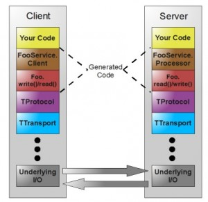

# 其他

## 1.openFeign

Feign和OpenFeign的区别
- Feign是Netflix开发的、一个轻量级RestFul的http客户端，内置了Ribbon用来做客户端负载均衡，去调用服务注册中心的服务。与服务端没有任何关系。
- openFeign是Spring Cloud又对Feign进行了增强开发，其支持Spging MVC注解，其注解@FeignClient可以解析SpringMVC的@RequestMappeing注解下的接口，使用更加方便。

- [Feign使用和原理的总结](https://blog.csdn.net/shuoyueqishilove/article/details/124351504)
- [常用配置与实现原理【非常详细】](https://blog.csdn.net/qq_45043381/article/details/122319952)
- [OpenFeign介绍和使用注意](https://blog.csdn.net/hundan_520520/article/details/123799231)
- [Feign HTTP连接的几点建议](https://cloud.tencent.com/developer/article/1554074)

- [OpenFeign是如何工作的](https://www.zhihu.com/question/494983725/answer/2454206541)
- [OpenFeign的9个坑](https://mp.weixin.qq.com/s/K-Q106lmg8nOZIr6LPVCyQ)

优化项：
1. http优化：Feign默认使用的JDK自带的HTTP方式(没有连接池，连接速率不够)，Feign最大的优化点是更换HTTP底层实现(比如 Apache HttpClient、OKhttp等)。
  需要引入openFeign提供的扩展组件。
2. 解压缩。一般外网访问会通过Nginx来进行数据的压缩gzip，但微服务之间HTTP调用是不经过Nginx的。所以开启解压缩以降低带宽的使用，提供网络传输效率。
   解压缩需要在客户端与服务器同时开启。并且解压缩是把双刃剑，需要结合场景。
3. 日志输出内容[debug级别的日志才会开启日志增强]
4. 超时设置
5. 开启http2.0。
6. fallback。熔断处理类。默认是 Hystrix。也支持ali的sentinel
7. 拦截器。Feign有提供一个接口，RequestInterceptor，可以操作header，通常用于向下传递数据，比如token，全链路信息等
8. 负载均衡。内部集成了Ribbon
   
注意：原生的 Feign 是不支持 Spring MVC 注解的； Spring Cloud 在 Feign 的基础上做了扩展产生了OpenFeign，使用 Spring MVC 的注解来完成Feign的功能；

在spring boot3.x之后，spring cloud 2022以及不对openFeign添加新的特性了，只维护问题。并且提供了新的http interface技术，
未来大概率会废弃。

## 2.Thrift

官网：	[http://thrift.apache.org/tutorial/php](http://thrift.apache.org/tutorial/php)

### 2.1.介绍

Apache Thrift软件框架用于可扩展的跨语言服务开发，简单来说就是RPC远程调用，它是一个完整的 RPC 框架体系。

它结合了功能强大的软件堆栈和代码生成引擎，以构建在 C++, Java, Go,Python, PHP, Ruby, Erlang, Perl, Haskell,
C#, Cocoa, JavaScript, Node.js, Smalltalk, and OCaml 这些编程语言间无缝结合的、高效的服务。

thrift最初由facebook开发用做系统内各语言之间的RPC通信 。

2007年由facebook贡献到apache基金 ，08年5月进入apache孵化器 ，是Apache的顶级项目之一，目前是市场中常用的RPC框架之一。

### 2.2.工作原理

- TProtocol（协议层），定义数据传输格式，例如：
    - TBinaryProtocol：二进制格式；
    - TCompactProtocol：压缩格式；
    - TJSONProtocol：JSON格式；
    - TSimpleJSONProtocol：提供JSON只写协议, 生成的文件很容易通过脚本语言解析；
    - TDebugProtocol：使用易懂的可读的文本格式，以便于debug

- TTransport（传输层），定义数据传输方式，可以为TCP/IP传输，内存共享或者文件共享等）被用作运行时库。
    - TSocket：阻塞式socker；
    - TFramedTransport：以frame为单位进行传输，非阻塞式服务中使用；
    - TFileTransport：以文件形式进行传输；
    - - TMemoryTransport：将内存用于I/O，java实现时内部实际使用了简单的ByteArrayOutputStream；
    - TZlibTransport：使用zlib进行压缩， 与其他传输方式联合使用，当前无java实现；

- Thrift支持的服务模型
    - TSimpleServer：简单的单线程服务模型，常用于测试；
    - ThreadPoolServer：多线程服务模型，使用标准的阻塞式IO；
    - TNonblockingServer：多线程服务模型，使用非阻塞式IO（需使用TFramedTransport数据传输方式）；

Thrift实际上是实现了C/S模式，通过代码生成工具将thrift文生成服务器端和客户端代码（可以为不同语言），从而实现服务端和客户端跨语言的支持。
用户在Thirft文件中声明自己的服务，这些服务经过编译后会生成相应语言的代码文件，然后客户端调用服务，服务器端提服务便可以了。

### 2.3.使用教程
官方文档：[https://thrift.apache.org/docs/](https://thrift.apache.org/docs/)

语法：[https://blog.csdn.net/litao31415/article/details/106329425](https://blog.csdn.net/litao31415/article/details/106329425)

### 2.4.使用场景

1.类似开源软件对比
- thrift 提供多语言的支持，RPC，序列化等功能。
- protobuf 提供了序列化功能。
- avro  和thrift类似，但多了动态动态类型。
- 压缩率的话，protobuf要好一点

2.HDFS中的使用

在ThriftHadoopFileSystem内部可以其他文件操作接口的具体实现，都可以看到时调用的DistributedFileSystem的接口。
因此，可以知道，hdfs对于多语言的支持是通过独立提供一个thrift server(达到和hdfs内部协议分离)，在server端通过java实现底层调用的是真正的HDFS客户端接口，客户端只要是thrift支持的语言，就可以与thrift server通信，从而达到对hdfs的文件操作。

3.storm		

java去实现这些接口，而是用clojure在核心代码中去完成对接口的实现，从而可以知道，storm和外部多语言的支持是基于thrift的RPC。

4.dubbo

dubbo支持的thrift是对thrift原生协议的扩展。也是通过生产代码的使用使用。
目前该部分功能只支持java接口。后续的版本应该会对其进行加强

5.启发

hdfs和storm都是用thrift作为多语言的支持，但使用的形式不同，对于我们自己的云存储以后对多语言的支持可以考虑使用hdfs类似的方式，
这样内部协议和外部thrift的协议分开，内部协议的改动都只局限在集群内部和Client，而thrift的server只要类似hdfs这样在server内部调用真正的接口就ok。

6.不错的博客

基础介绍：	https://www.ibm.com/developerworks/cn/java/j-lo-apachethrift/index.html
php thrift：	http://thrift.apache.org/tutorial/php

## 3.gRPC

gRPC 是一个高性能、开源和通用的 RPC 框架，基于http2协议实现，数据传输使用的protocol buffer。提供多种语言的SDK支持。

特点：
- 默认使用 ProtoBuf 对请求/响应进行序列化和反序列化，这使得传输的请求体和响应体比 JSON 等序列化方式包体更小、更轻量。
- 基于 HTTP/2 协议传输报文，HTTP/2 具有多路复用、头部压缩等特性，基于 HTTP/2 的帧设计，实现了多个请求复用一个 TCP 连接，
  基本解决了 HTTP/1.1 的队头阻塞问题，相对 HTTP/1.1 带来了巨大的性能提升

这些特性使得其在移动设备上表现更好，更省电和节省空间占用。

- 官网：[https://grpc.io/](https://grpc.io/)
- 中文文档：[http://doc.oschina.net/grpc?t=60134](http://doc.oschina.net/grpc?t=60134)
- 工作原理：[https://www.jianshu.com/p/d0a3611819b1](https://www.jianshu.com/p/d0a3611819b1)
- 博客：[https://blog.csdn.net/xuduorui/article/details/78278808](https://blog.csdn.net/xuduorui/article/details/78278808)
- [gRPC 使用体验](https://mp.weixin.qq.com/s/6XXJfbnIaKzSFtXyDDB72g)
- [grpc服务发现注册中心负载均衡的实现的几点思考](https://www.csdn.net/tags/MtTaEg2sNjk3OTA5LWJsb2cO0O0O.html)

grpc是不具有注册和发现以及负载均衡的功能的，所有我们要自己实现

## 4.motan

开源： [https://github.com/weibocom/motan](https://github.com/weibocom/motan)
- motan是新浪微博开源的一套轻量级、方便使用的RPC框架，从功能角度来讲，RPC框架可以分为服务治理型和多语言型；
- motan显然属于前者，因此对motan框架可以简单的理解为：分离方法的调用和实现，并具双端服务治理功能；
- 微博的Motan RPC服务，底层通讯引擎采用了Netty网络框架，序列化协议支持Hessian和Java序列化，通讯协议支持Motan、http、tcp、mc等；

## 5.brpc

源码：[https://github.com/apache/brpc](https://github.com/apache/brpc)

百度开源的RPC框架BRPC，以其高性能、低延迟、易用性等优势，使得其在高性能的C++开发领域非常受欢迎。

[高性能原理分析](https://zhuanlan.zhihu.com/p/113427004)

## 6.Trpc

尚未开源。

tRPC是由全腾讯内部开源社区OTeam共建的一款高性能，多语言，插件化，平台无关，开源协同，对接存量，面向未来，致力统一 的远程过程调用开发框架。 你可以使用tRPC：
- 内置了统一tRPC通信协议, 通过与多语言特性的结合, 为复杂产品形态下的多技术栈提供了通用解决方案
- 快速构建的支持多协议服务, 协议包括通用协议和公司内部私有协议
- 快速搭建流式服务，实现push，文件上传，消息下发等流式模型
- 通过tRPC插件生态, 业务自己选择服务治理体系, 实现和存量系统对接
- 基于框架接口进行二次开发, 包括: 通信协议, 插件, 存储接口, 拦截器等定制开发
- 通过tRPC测试工具和框架自动生成mock代码, 使服务的测试更简单, 更便捷

tRPC提供了6种开发语言(C++, Golang, Java, Python, Nodejs, Rust)的开发框架, 各个语言在设计原则和基本功能上进行了对齐, 
同时各语言也与自身的语言生态紧密结合, 比如tRPC-Java实现了和SpringCloud, Springboot等开源生态的对接.
tRPC-Python打通了tensorflow, pytorch, sklearn等机器学习生态组件, 整合AI全流程, 实现模型服务的快速服务化.

- [tRPC介绍](./Trpc/tRPC介绍.pdf)
- [架构概述](./Trpc/架构概述.pdf)
- [插件生态](./Trpc/插件生态.docx)