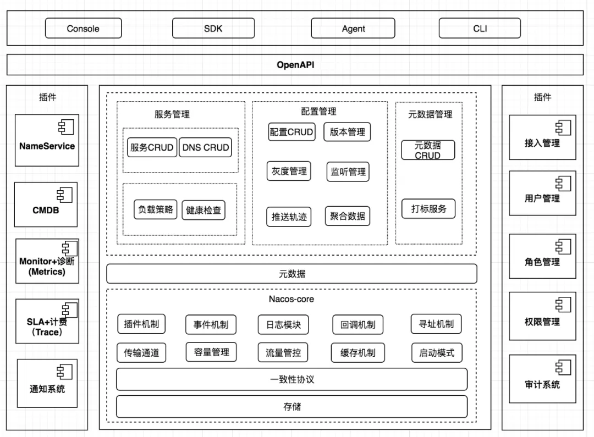
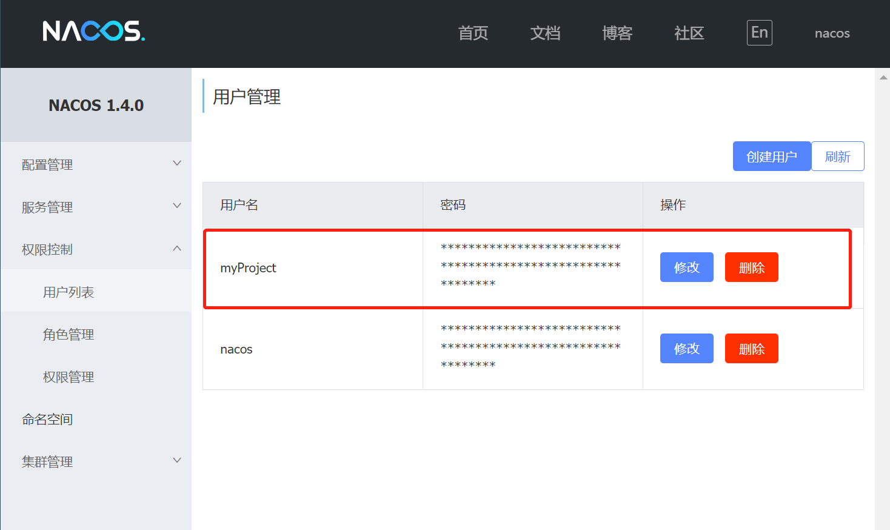
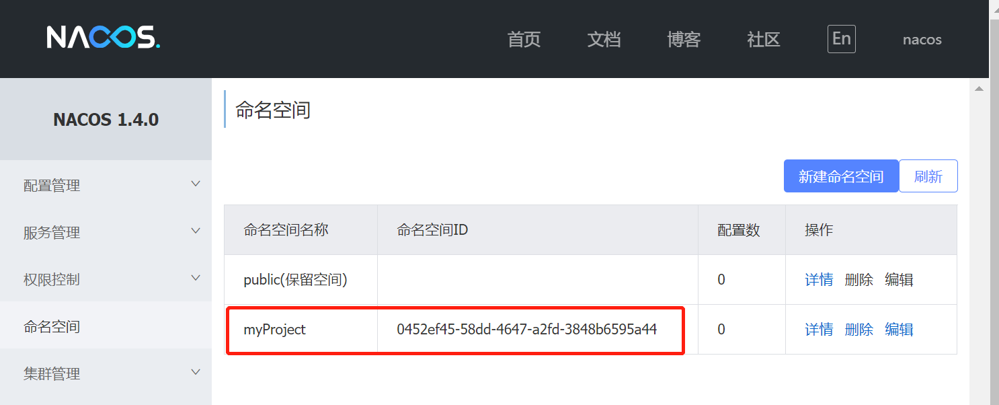
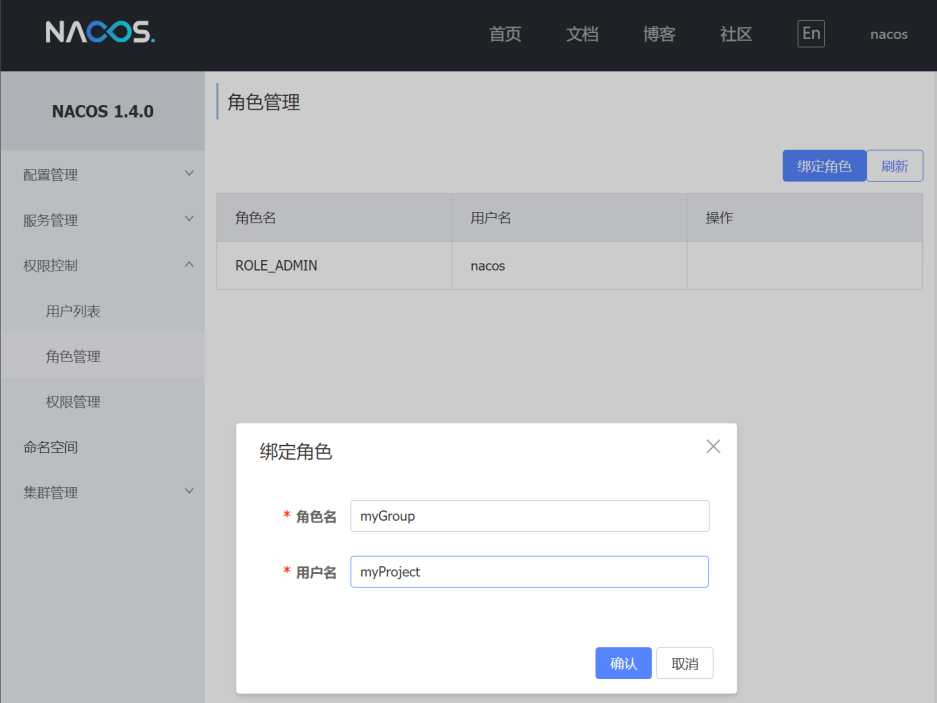
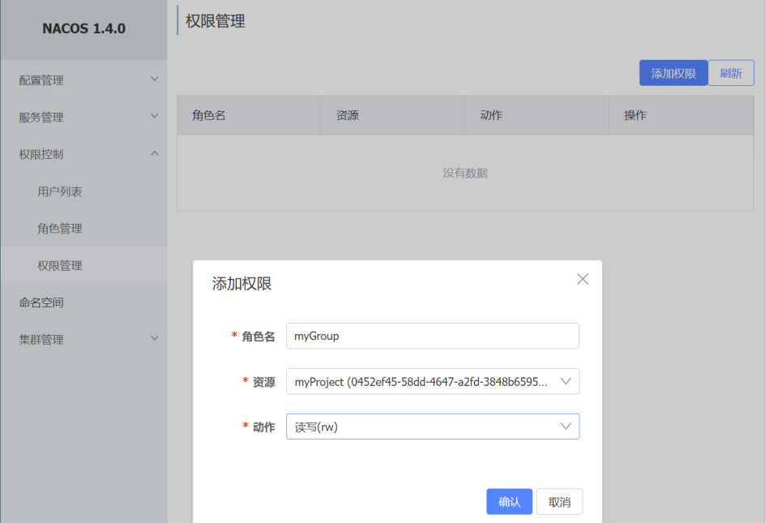
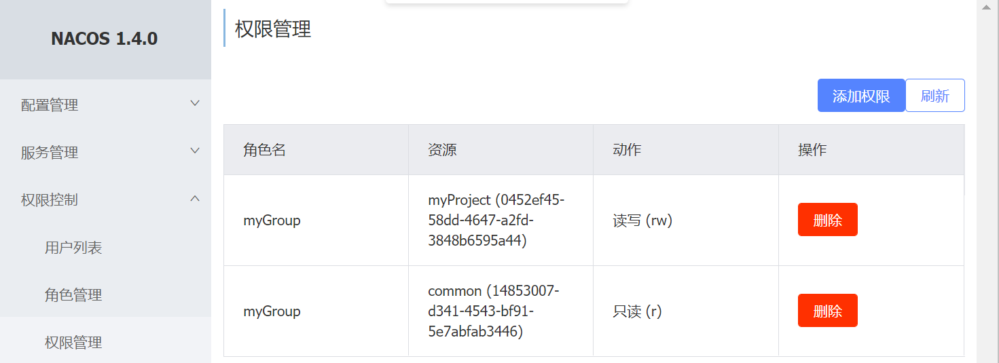
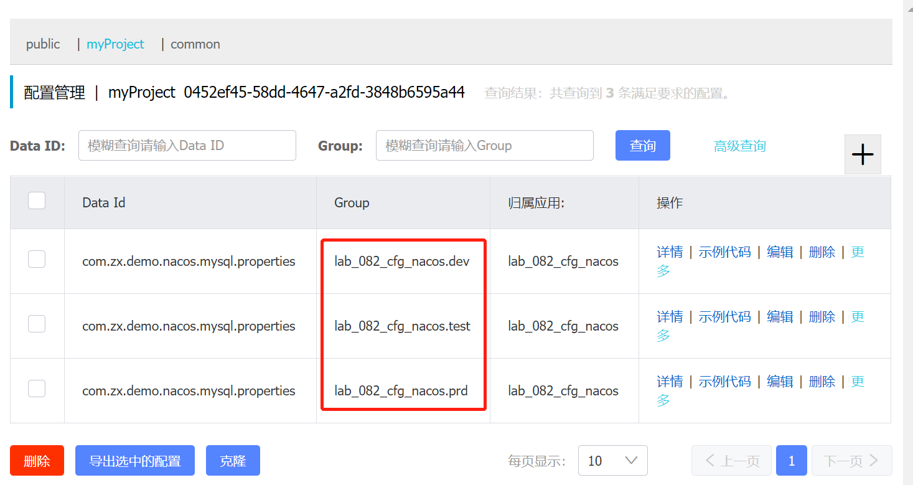
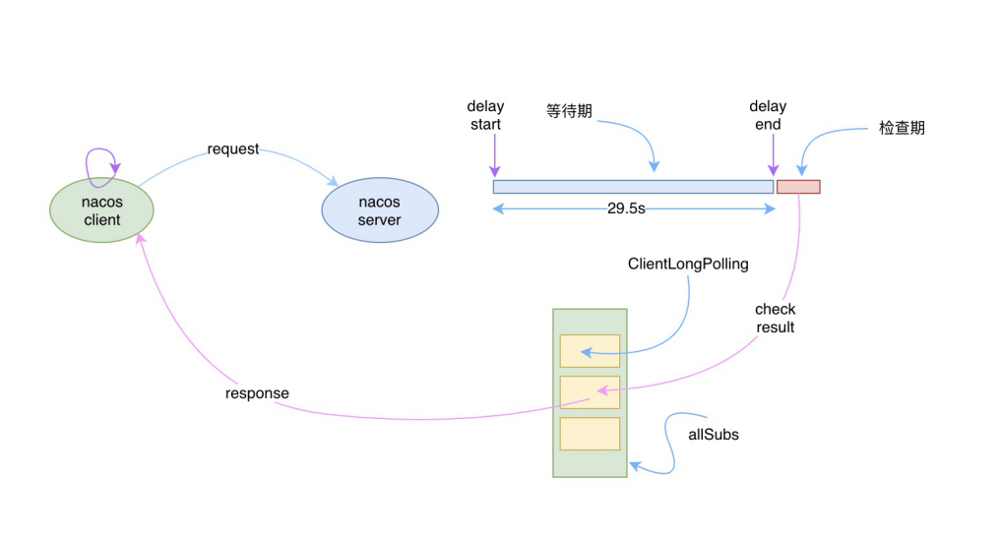
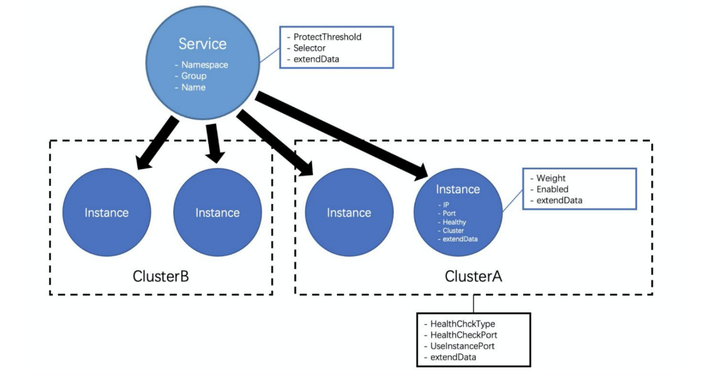
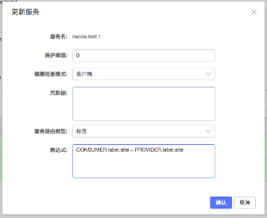

# Nacos

## 1.基础

### 1.1.概述
根据业务架构、各业务系统本身需求与要求，特构建了动态配置&服务发现，其主要能解决的问题如下：

1. 动态配置服务：敏感配置数据的存储、频繁变更的配置数据(热更新)、生产环境批量推送到各个系统以及研发系统存在配置乱的问题；
2. 服务注册与发现；
3. dns服务管理；

- 官网：[https://nacos.io/](https://nacos.io/)
- 源码：[https://github.com/alibaba/nacos](https://github.com/alibaba/nacos)
- 官方书籍：[https://developer.aliyun.com/ebook/36](https://developer.aliyun.com/ebook/36)

- [nacos专题](https://www.jianshu.com/c/a43af0cc4698?order_by=added_at)
- Nacos 实现原理详细讲解：[https://mp.weixin.qq.com/s/xk-1m5UVuwrObfoYwpi_DQ](https://mp.weixin.qq.com/s/xk-1m5UVuwrObfoYwpi_DQ)
- 实现原理：[https://mp.weixin.qq.com/s/nbNEYn5YwK3rVo8CX4rb8A](https://mp.weixin.qq.com/s/nbNEYn5YwK3rVo8CX4rb8A)

### 1.2.Nacos与Eureka

- [https://blog.csdn.net/fly910905/article/details/100023415](https://blog.csdn.net/fly910905/article/details/100023415)
- [https://www.cnblogs.com/skj0330insn/p/12057416.html](https://www.cnblogs.com/skj0330insn/p/12057416.html)
- [https://blog.csdn.net/xc123_java/article/details/90200189](https://blog.csdn.net/xc123_java/article/details/90200189)

相比eureka的对等星型同步AP模型，nacos虽然也保留了这种模型，自研的AP模型Distro协议，nacos对所有服务实例进行分片，
将服务实例均匀分配到不同的server进行续约和数据同步（内部使用grpc维护），降低了整个集群的压力。

总所周知：eureka在服务实例较大时，会产生较高的延迟。默认配置下最大可能产生180s的延迟，即使优化配置，也会产生几十秒的延迟。
而nacos在2.0版本中，使用了grpc长连接，极大的降低了延迟，数据变更毫秒级推送生效；
- 1w 级，SLA 承诺 1w 实例上下线 1s，99.9% 推送完成；
- 10w 级，SLA 承诺 1w 实例上下线 3s，99.9% 推送完成；
- 100w 级别，SLA 承诺 1w 实例上下线 9s 99.9% 推送完成。

3节点集群支持的规模：十万级服务/配置，百万级连接。且具备很好的横向扩展的能力。
例如：eureka、zk等注册中心，在性能达到瓶颈时，横向扩展并不会提升整体集群的性能，甚至会带来额外的性能损耗。

### 1.2.架构设计



整体架构分为用户层、业务层、内核层和插件层：
1. 用户层主要解决用户使用的易用性问题
2. 业务层主要解决服务发现和配置管理的功能问题
3. 内核层解决分布式系统一致性、存储、高可用等核心问题
4. 插件层解决扩展性问题。

1. 用户层
   - OpenAPI：暴露标准Rest风格HTTP接口，简单易用，方便多语言集成
   - Console：易用控制台，做服务管理、配置管理等操作
   - SDK：多语言 SDK，目前几乎支持所有主流编程语言
   - Agent：Sidecar 模式运行，通过标准 DNS 协议与业务解耦
   - CLI：命令行对产品进行轻量化管理，像 git 一样好用
2. 业务层
   - 服务管理：实现服务 CRUD，域名 CRUD，服务健康状态检查，服务权重管理等功能
   - 配置管理：实现配置管 CRUD，版本管理，灰度管理，监听管理，推送轨迹，聚合数据等功能
   - 元数据管理：提供元数据 CURD 和打标能力，为实现上层流量和服务灰度非常关键
3. 内核层
   - 插件机制：实现三个模块可分可合能力，实现扩展点 SPI 机制，用于扩展自己公司定制
   - 事件机制：实现异步化事件通知，SDK 数据变化异步通知等逻辑，是Nacos高性能的关键部分
   - 日志模块：管理日志分类，日志级别，日志可移植性（尤其避免冲突），日志格式，异常码+帮助文档
   - 回调机制：SDK 通知数据，通过统一的模式回调用户处理。接口和数据结构需要具备可扩展性
   - 寻址模式：解决 Server IP 直连，域名访问，Nameserver 寻址、广播等多种寻址模式，需要可扩展
   - 推送通道：解决 Server 与存储、Server 间、Server 与 SDK 间高效通信问题
   - 容量管理：管理每个租户，分组下的容量，防止存储被写爆，影响服务可用性
   - 流量管理：按照租户，分组等多个维度对请求频率，长链接个数，报文大小，请求流控进行控制
   - 缓存机制：容灾目录，本地缓存，Server 缓存机制，是 Nacos 高可用的关键
   - 启动模式：按照单机模式，配置模式，服务模式，DNS 模式，启动不同的模块
   - 一致性协议：解决不同数据，不同一致性要求情况下（包括AP 协议和CP协议）的诉求
   - 存储模块：解决数据持久化、非持久化存储，解决数据分片问题
4. 插件
   - Nameserver：解决 Namespace 到 ClusterID 的路由问题，解决用户环境与 Nacos 物理环境映射问题
   - CMDB：解决元数据存储，与三方 CMDB 系统对接问题，解决应用，人，资源关系
   - Metrics：暴露标准 Metrics 数据，方便与三方监控系统打通
   - Trace：暴露标准 Trace，方便 SLA 系统打通，日志白平化，推送轨迹等能力，并且可以和计量计费系统关联
   - 接入管理：相当于阿里云开通服务，分配身份、容量、权限过程
   - 用户管理：解决用户管理，登录，SSO 等问题
   - 权限管理：解决身份识别，访问控制，角色管理等问题
   - 审计系统：扩展接口方便与不同公司审计系统打通
   - 通知系统：核心数据变更，或者操作，方便通过SMS系统打通，通知到对应人数据变更

[nacos架构演变](https://mp.weixin.qq.com/s/q8MkXtQ6YGy32KqrQUNb_g)
1. 将协议层抽象到内核层
2. 逻辑计算层与逻辑存储层分析。

## 2.安装

部署方式：
- 单机模式 - 用于测试和单机试用。
- 集群模式 - 用于生产环境，确保高可用。
- 多集群模式 - 用于多数据中心场景。

集群模式可以选择mysql作为底层存储，以下为使用技巧。

- Nacos 安装与基础配置：[https://blog.csdn.net/qq_40523572/article/details/89364340](https://blog.csdn.net/qq_40523572/article/details/89364340)

### 2.1.高可用设计

nacos设计遵循了公有云的网络架构。Nacos 部署架构上是单 Region 封闭，Region 间独立，跨 Region 通过网关或者 Nacos-sync 完 成服务互通。
从而降低 Region 间网络故障风险。

> 在公有云的维度，一般情况下，region之间网络是不通，同一个region下的zone之间网络互通。

用户如果选择跨region构建nacos集群，为了避免出现服务跨region调用，推荐使用cluster设置Region，确保在一个同一个cluster的服务都在一个region内。

### 2.2.高可用集群配置
Nacos并未提供高可用的支持，需要依赖于Nginx、SLB等来实现高可用。

- Nacos 高可用特性：[https://mp.weixin.qq.com/s/WipvefNF2a2Heru3BZV-3A](https://mp.weixin.qq.com/s/WipvefNF2a2Heru3BZV-3A)
- 高可用部署：[https://mp.weixin.qq.com/s/hmH5bprfQ6Q7XEjHMw1Yhw](https://mp.weixin.qq.com/s/hmH5bprfQ6Q7XEjHMw1Yhw)

nginx案例
```shell
upstream nacos_cluster {
   server 127.0.0.1:8848;
   server 127.0.0.1:8858;
   server 127.0.0.1:8868;
}

server {
    listen       8838;
    server_name  localhost;
    location / {
        proxy_pass http://nacos_cluster;
        proxy_set_header Host $host:$server_port;
    }
}
## nacos 2.x版本支持 grpc 长链接，需要配置四层负载。端口=http port+1000。
stream {
    upstream nacos-server-grpc {
        server 127.0.0.1:9848;
        server 127.0.0.1:9858;
        server 127.0.0.1:9868;
    }
    server {
        listen 9838;
        proxy_pass nacos-server-grpc;
    }
}
```

### 2.3.多级容灾

1. Nacos 持久化存储做了主备容灾，而且底层存储数据多副本高可用保障。
2. Nacos Server 有全量缓存数据，即使存储挂或者不可用，只影响写，核心的读服务不受影响。
3. Nacos SDK 有所需服务和配置缓存，Server 即使全挂，走本地缓存，保证核心业务调用不受影响。

### 2.4.操作技巧

#### 2.4.1.用户管理

从这里开始，假设我们有一个项目，叫做myProject，这个项目归属的组为myGroup

我们可以创建一个用户，账号，密码都是myProject



#### 2.4.2.命名空间

我们一般选择使用项目的名称为命名空间的名字。命名空间ID使我们经常使用的



#### 2.4.3.角色管理

我们一般使用项目组为一个角色，目前nacos只支持一个角色绑定一个账号，还是太简单了。



#### 2.4.4.权限管理

用来给角色分配操作资源的权限。




一个角色可以创建多个权限，用来分配权限。



#### 2.4.5.配置管理

我们主要使用的功能。需要注意的配置，是data id 和 group。我们可以使用group去区分dev,test,prd。

DataId尽可能的设置成能够明显的区分出项目和具体的配置类型。
注意：dataId的后缀为配置文件的类型，不能随意定义，比如.properties, .yml, .json等



## 3.配置中心原理

### 3.1.工作流程
Nacos 并不是通过推的方式将服务端最新的配置信息发送给客户端的，而是客户端维护了一个长轮询的任务，
定时去nacos拉取发生变更的配置信息，然后将最新的数据推送给 Listener 的持有者，也就是客户端。
其中有个MD5值就是用来校验服务端的值是否与客户端的一直。

由客户端主动拉取数据的优势：
1. 不用维护长链接了，减少相关资源的消耗，而且长链接需要考虑session是否过期的问题，参考zk通过心跳检测的方式处理。
2. nacos客户端只需定时发送无状态的http请求即可。

流程如下：
1. 客户端的请求到达服务端后，服务端将该请求加入到一个叫 allSubs 的队列中，等待配置发生变更时 DataChangeTask 主动去触发，并将变更后的数据写入响应对象，
2. 与此同时服务端也将该请求封装成一个调度任务去执行，等待调度的期间就是等待 DataChangeTask 主动触发的。
   如果延迟时间到了 DataChangeTask 还未触发的话，则调度任务开始执行数据变更的检查，然后将检查的结果写入响应对象



- nacos 1.x：采用http长轮询的方式，客户端与服务端保持长连接，由客户端拉取配置。
  1. Nacos 客户端会循环请求服务端变更的数据，并且超时时间设置为30s，当配置发生变化时，请求的响应会立即返回，否则会一直等到 29.5s+ 之后再返回响应
  2. Nacos 客户端能够实时感知到服务端配置发生了变化。
  3. 实时感知是建立在客户端拉和服务端“推”的基础上，但是这里的服务端“推”需要打上引号，因为服务端和客户端直接本质上还是通过
     http进行数据通讯的，之所以有“推”的感觉，是因为服务端主动将变更后的数据通过 http 的 response 对象提前写入了。
- nacos 2.x：SDK 与 服务端建立GRPC长连接，当配置变更后主动推送配置到SDK。
[支持gRPC长链接，深度解读Nacos2.0架构设计及新模型](https://baijiahao.baidu.com/s?id=1688267648806940996&wfr=spider&for=pc)

### 3.2.动态刷新配置 

## 4.注册中心原理

- Nacos1.x版本，服务注册是通过Http接口实现的
- Nacos2.x版本，服务注册是通过gRPC接口实现的。主要是因为Http请求会频繁创建和销毁连接，白白浪费资源。
  但是依旧保留了http接口，方便兼容老的版本。

### 4.1.服务注册与发现

Nacos提供了两种服务发现方式：
1. 主动查询（pull）。
2. 服务订阅（push）。nacos默认采用。

nacos 1.x和2.x都是通过SDK中的NamingService#subscribe方法来发起订阅。
当有服务实例数据变动的时，客户端就会回调EventListener，就可以拿到最新的服务实例数据了。但是两者的实现方式不同。

nacos 1.x
1. 客户端在启动的时候，会去构建一个叫PushReceiver的类。这个类会去创建一个UDP Socket，端口是随机的。
2. 调用NamingService#subscribe，拉取所有需要的服务实例信息。同时会将UDP的信息上传到nacos服务端，用于nacos推送服务变更。
3. nacos服务端，当注册的服务发生变化时，会发送UDP信息，通知客户端。
4. 客户端每10s会从nacos服务端查询一次全量的服务实例信息。因为UDP通讯不稳定，避免未能及时变更。作为一种兜底的方案。
nacos 2.x
1. 采用GRPC，让服务实例发生变化时，nacos服务端主动推送变更后的数据到客户端。

### 4.2.redo操作

在eureka中，客户端与eureka服务端连接后，客户端注册的信息会被删除掉。当服务重新连接后会重新走一遍注册的流程，服务发现的效率很慢。

而在nacos中，SDK会将从nacos拉取到的服务实例信息缓存到客户端的缓存中。当服务重新连接后，这个缓存就可以直接用于注册了。
这个缓存的是全部服务的数据，而不是某个节点的数据，所以重新注册的效率会很快。
服务发现与订阅都会使用这个缓存，这回极大的提升服务发现的效率，提升服务的可用性。

### 4.3.心跳检测

nacos 1.x
1. 客户端注册成功后，每5s一次向服务端发送心跳。
2. 服务端每5s检查一次状态。
   - 如果超过15s但没有超过30s，则标记服务为不健康。
   - 如果超过30s，则从服务端剔除该服务。

nacos 2.x
1. 因为采用GRPC建立连接，连接本身就是一种心跳检测。如果连接断开，则nacos删除该服务。
2. nacos每3s检查所有的连接，如果连接20s内没有接受到请求，则主动向客户端发送连接检查，出现异常时也会主动断开连接，剔除服务实例。


### 4.4.永久与临时实例

nacos对外提供了两种类型的实例：永久实例和临时实例。这两种实例可以设置每个实例的类型。两者的应用场景不同。
1. 临时实例：注册之后实例信息不回持久化到磁盘，仅仅保留信息再内存中
   - 适合业务服务，当服务下线后就不需要再注册中心中看到。
   - 当服务实例出现异常或者下线之后，就会把这个服务实例从服务注册表中剔除
2. 永久实例：注册之后实例信息会持久化到磁盘，例如MySQL、Redis等。同时也会缓存到内存中
    - 当服务实例出现异常或者下线，Nacos只会将服务实例的健康状态设置为不健康，并不会对将其从服务注册表中剔除

PS：在同一个服务中，其中每个实例的类型只能全部是临时或者永久，不能混合使用。

临时实例和永久实例的区别
1. 健康检查机制不同
   - 临时实例，使用心跳机制
   - 永久实例，server端主动发起探测请求，http,tcp,mysql
2. 注册数据一致性方案不同
   - 临时实例，使用自研Distro协议，属于AP
   - 永久实例，使用jRaft协议，属于CP


### 4.5.服务实例数据模型

Nacos中服务实例的数据分为三个维度管理（页面维护也是这三个维度）。对于nacos的操作时都需要使用这三个维度的参数，进行数据隔离。
- 命名空间（Namespace）：Nacos 数据模型中最顶层、也是包含范围最广的概念，用于在类似环境或租户等需要强制隔离的场景中定义。
- 分组（Group）：Nacos 数据模型中次于命名空间的⼀种隔离概念，区别于命名空间的强制隔离属性，分组属于⼀个弱隔离概念，主要用于逻辑区分⼀些服务使用场景或不同应用的同名服务，
   最常用的情况主要是同⼀个服务的测试分组和生产分组、或者将应用名作为分组以防止不同应用提供的服务重名。
- 服务名（name）：该服务实际的名字，⼀般用于描述该服务提供了某种功能或能力。


```json
curl --location 'http://127.0.0.1:8848/nacos/v2/ns/instance/list?serviceName=lab_082_cfg_nacos&accessToken=鉴权信息&namespaceId=cd825704-40ec-444a-bcbb-97a9bd31e2c3&groupName=lab_082_cfg_nacos' \

{
    "code": 0,
    "message": "success",
    "data": {
        "name": "lab_082_cfg_nacos@@lab_082_cfg_nacos",  #分组名@@服务名
        "groupName": "lab_082_cfg_nacos",                #分组名
        "clusters": "",                                  #集群名
        "cacheMillis": 10000,                            #缓存时间
        "hosts": [                                       #服务实例列表
            {
                "ip": "192.168.56.1",                    #服务实例ip
                "port": 8080,                            #服务实例端口
                "weight": 1.0,                           #权重
                "healthy": true,                         #是否健康
                "enabled": true,                         #实例是否可用   
                "ephemeral": true,                       #持久化属性：是否临时实例
                "clusterName": "DEFAULT",                #实例所在的集群名称
                "serviceName": "lab_082_cfg_nacos@@lab_082_cfg_nacos",  #分组名@@服务名
                "metadata": {                          #实例的元数据，例如版本号等信息
                    "preserved.register.source": "SPRING_CLOUD"
                },
                "instanceHeartBeatInterval": 5000,       #心跳间隔时间,5s检查一次
                "instanceHeartBeatTimeOut": 15000,       #心跳超时时间,超过15s，则标记为不健康
                "ipDeleteTimeout": 30000                 #实例删除超时时间,超过30s，则剔除实例
            }
        ],
        "lastRefTime": 1703039815143,                    # 上次心跳时间
        "checksum": "",                                  #校验值，用于与服务端数据是否一致
        "allIPs": false,   
        "reachProtectionThreshold": false,               #是否达到保护阈值
        "valid": true                                    #是否有效 
    }
}
```

### 4.6.健康保护阈值

为了防止因过多实例 (Instance) 不健康导致流量全部流向健康实例 (Instance) ，继而造成流量压力把健康实例 (Instance) 压垮并形成雪崩效应，应将健康保护阈值定义为一个 0 到 1 之间的浮点数。
当域名健康实例数 (Instance) 占总服务实例数 (Instance) 的比例小于该值时，无论实例 (Instance) 是否健康，都会将这个实例 (Instance) 返回给客户端。
这样做虽然损失了一部分流量，但是保证了集群中剩余健康实例 (Instance) 能正常工作。

设置的方式是注册服务实例的时候，设置protectThreshold，默认是0。这个参数是服务维度的。


### 4.7.实例选择器

注册服务的时候，可以设置selector。用于在获取服务下的实例列表时，过滤和筛选实例。
该选择器也被称为路由器，目前 Nacos 支持通过将实例的部分信息存储在外部元数据管理 CMDB 中，
并在发现服务时使用 CMDB 中存储的元数据标签来进行筛选的能力。

### 4.8.集群属性

服务实例数据模型中可以看到，服务实例列表中有一个字段叫clusterName，这个字段就是集群属性。
集群是 Nacos 中⼀组服务实例的⼀个逻辑抽象的概念，它介于服务和实例之间，是⼀部分服务属性的下沉和实例属性的抽象。

注册服务时，可以设置实例的clusterName集群名称，默认为DEFAULT。获得服务时，可以将clusterName作为参数，筛选集群下的实例。



## 5.一致性协议

### 5.1.协议选择
nacos同时支持AP和CP两种模型，所以需要对于的一致性算法支撑：
- CP: 基于简化的raft的cp模型，由leader写入，一致性并不严格，但是可以保证一半一致，数据会进行持久化。
    - 对于强一致性共识算法，当前实际生产中，最多使用的就是 Raft 协议，Raft 更容易让人理解，并且有很多成熟的算法实现。
    - 比如蚂蚁金服的 JRaft、Zookeeper 的 ZAB、Consul 的 Raft、百度的 braft、Apache Ratis等。
    - 因为 Nacos 是Java技术栈，并且是阿里系产品，所以选择JRaft。不仅方便交流，而且 JRaft 支持多 RaftGroup，为 Nacos 后面的多数据分片带来了可能。
- AP: 基于Distro的ap模型，参考了eureka，并做出了优化
    - Distro 协议是阿里自研的最终一致性协议，是一种面向临时实例的分布式协议。
    - Distro 是集 Gossip 以及 Eureka 协议的优点并加以优化而出来的。Gossip协议随机选择节点发送消息，消息存在重复消费的问题且去中心化设计，每次发送全量消息，增加网络带宽压力
    - Distro 优化：算引入了权威 Server 的概念，每个节点负责一部分数据以及将自己的数据同步给其他节点，减少了数据量、有效的降低了消息冗余的问题。

1. 注册中心：可以根据创建服务时设置的持久化参数选择，默认AP模型。
   - 临时节点：Nacos优先保证可用性，采用AP模型。
   - 永久节点：Nacos优先保证一致性，采用CP模型。
2. 配置中心：采用的CP模型

### 5.2.Distro

Distro 协议是 Nacos 社区自研的一种 AP 分布式协议，是面向临时实例设计的一种分布式协议，其保证了在某些 Nacos 节点宕机后，整个临时实例处理系统依旧可以正常工作。
作为一种有状态的中间件应用的内嵌协议，Distro 保证了各个 Nacos 节点对于海量注册请求的统一协调和存储。

设计思想Distro协议的主要设计思想如下：
1. Nacos 每个节点是平等的都可以处理写请求，同时把新数据同步到其他节点。
2. 每个节点都存储了完整的数据，但是每个节点只负责部分数据的一致性，定时发送自己负责数据的校验值到其他节点来保持数据一致性。
3. 每个节点独立处理读请求，及时从本地发出响应。

Distro工作流程如下：
1. 数据初始化。新加入的Distro节点，会轮询所有的Distro节点从这些节点中全量拉取数据。新Distro节点会将拉取到的数据进行合并，确保自己有全量的数据。
2. 数据校验。Distro节点之间定时发送心跳。心跳信息主要为本地所有数据的元数据（为了降低传输的数据）。如果发现本地与其他节点的数据不一致，则发起全量拉取。
3. 写操作。客户端调用vip，请求会转发到某个节点。写入的流程如下：
    - 前置过滤器DistroFilter会读取请求参数中的ip和port，计算应该是哪个Distro节点负责该请求。并将请求转发到对应的Distro节点。
    - 如果当前请求是客户端第一次写入，则默认在当前节点写入数据，当前节点为该客户端数据的责任节点，并在响应中返回Distro节点的ip和port，用于下次请求中设置参数。
    - 责任节点负责处理请求。
    - Distro节点定时执行数据同步任务，将数据同步到其他节点。
4. 读操作。因为每个Distro节点都保存的全部数据，所以客户端读操作是直接读取全部数据（当然，这里的全部数据指的是某个namespace的注册的全部实例）

总结：
1. 当该节点接收到属于该节点负责的实例的写请求时，直接写入。
2. 当该节点接收到不属于该节点负责的实例的写请求时，将在集群内部路由，转发给对应的节点，从而完成读写。
3. 当该节点接收到任何读请求时，都直接在本机查询并返回（因为所有实例都被同步到了每台机器上）。

### 5.3.Raft

Nacos的CP实现是基于Raft算法来实现的。
- 在1.x版本早期，Nacos是自己手动实现Raft算法
- 在2.x版本，Nacos移除了手动实现Raft算法，转而拥抱基于蚂蚁开源的JRaft框架

数据一致性：
1. 集群节点之间：节点之间采用raft保证数据一致性。一致性的核心是节点与数据库之间的一致性，从而保证节点之间的一致性。
   任意一个节点写入数据后，先持久化到数据库，然后再通知其他节点从数据库拉取最新的配置，并通知客户端拉取最新配置。
2. SDK与节点间：为了保证配置中心的高可用，并未采用raft算法，而是通过对比MD5来实现，如果不一致SDK就拉取节点中的最新配置。

### 5.4.通讯通道

Nacos 1.x 版本 Config/Naming 模块各自的推送通道都是按照自己的设计模型来实现的。

1. Nacos Config
   - 推送模型：客户端通过http长连接查询，。
   - 数据⼀致性：校验MD5
   - 痛点：http 短连接，30 秒定 期创建销毁连接，性能低，浪费资源。
2. Nacos Naming
   - 推送模型：服务端采用UDP推送，客户端通过UDP接收。以及客户端采用http定时查询的方式
   - 数据⼀致性：客户端直接更新数据。服务端之间采用一致性算法。
   - 痛点：UDP 不可靠，不稳定。且在公有云下可能无法通讯等问题

Nacos 2.x 版本，Config/Naming 都采用了 gRPC 作为通讯通道。可以直接由服务端推送数据到客户端。
优点
1. 低成本的服务快速感知。
2. 网络防抖。合理的重试机制，通过逐步递增的重试时间，以期待服务恢复。

## 6.最佳实践

官方最佳实践[https://nacos.io/blog/case-cmdb/](https://nacos.io/blog/case-cmdb/)

### 6.1.NacosSync

NacosSync 是⼀个支持多种注册中心的同步组件。可以单独部署，支持nacos与其他注册中心相互同步数据。
这里支持的服务类型

目前已支持的同步类型：
- Nacos 数据同步到 Nacos
- Nacos 数据同步到 Zookeeper：同步dubbo服务
- Zookeeper 数据同步到 Nacos：同步dubbo服务
- Eureka 数据同步到 Nacos：同步spring cloud服务。Eureka本身存储的服务信息非常少。
- Consul 数据同步到 Nacos

### 6.2.插件机制

案例：https://github.com/nacos-group/nacos-examples/tree/master/nacos-cmdb-plugin-example

Nacos从2.1.0版本开始，支持通过SPI的方式注入鉴权相关插件，并在nacos的application.properties配置文件中选择某一种插件实现。

插件单独开发完成后，打包为jar放入到nacos根目录下的plugins中（需要手动创建）

1. 鉴权插件。Nacos自带的弱鉴权体系，默认不开启，允许用户自定义实现，将鉴权信息主要抽象为身份信息，资源和操作类型3类。
2. 配置信息加密。Nacos 默认提供 AES 的实现。用户也可以自定义加解密的实现方式。
3. 轨迹追踪。Nacos 的轨迹主要目的是追踪和记录一些Nacos的相关操作，如服务注册、注销、推送、状态变更等，并非追踪微服务间的相互访问链路。
   插件中订阅并处理追踪事件，并按照您期望的方式进行处理（如打日志，写入存储等）。
4. 自定义环境变量处理器。自定义配置处理。例如nacos的数据库密码配置文件中是加密的，需要启动时进行解密。
5. 反脆弱。对访问服务端的某种资源的频率和次数达到一定程度时进行的限制访问的策略，用于保护服务端在高压情况下能快速拒绝请求，防止过多的资源访问导致服务端资源耗尽引起的大面积不可用。
6. 配置变更监听。当配置中心中的配置发生变更的时候，能够接收到变更事件，从而通知一些特定系统，用于发送记录、警告等审计功能

### 6.3.就近访问

在服务进行多机房或者多地域部署时，跨地域的服务访问往往延迟较高，⼀个城市内的机房间的典型网络延迟在 1ms 左右，而跨城市的网络延迟，例如上海到北京大概为 30ms 。
此时自然而然的⼀个想法就是能不能让服务消费者和服务提供者进行同地域访问。

为了实现就近访问，Nacos提供的一系列SPI帮助企业进行扩展。
1. CMDB：在服务发现组件中，对接 CMDB，然后通过配置的访问规则，来实现服务消费者到服务提供者的同地域优先。
2. Selector：拿到 CMDB 的数据之后，就可以运用 CMDB 数据的强大威力来实现多种灵活的负载均衡策略了

#### 6.3.1.CMDB

CMDB 在企业中，⼀般用于存放与机器设备、应用、服务等相关的元数据。⼀般当企业的机器及应用达到⼀定规模后就需要这样⼀个系统来存储和管理它们的元数据。
有⼀些广泛使用的属性例如机器的 IP、主机名、机房、应用、region 等，这些数据⼀般会在机器部署时录入到 CMDB，
运维或者监控平台会使用这些数据进行展示或者相关的运维操作。其中重要的概念如下：

1. 实体（Entity）：CMDB核心数据，⼀个实体可以指⼀个 IP、应用或者服务。而这个实体会有很多属性，例如 IP 的机房信息，服务的版本信息等。 
2. 实体类型（Entity Type）：Entity中的一个属性，用于设置实体是 IP、应用或者服务，针对服务发现的实体类型是 IP。 
3. 标签（Label）：Entity中的一个属性，用于描述 Entity 属性的 K-V 键值对，用于Selector实现负载均衡。
   ⼀个常见的 Label 的例子是 IP 的机房信息，机房（site）是 Label 的 key，而机房的集合（site1, site2, site3）是 Label 的value，
   这个 Label 的定义就是：site: {site1, site2, site3}。 
4. 实体事件（Entity Event）：实体的标签的变更事件。当 CMDB 的实体属性发生变化，需要有⼀个事件机制来通知所有订阅方。
   为了保证实体事件携带的变更信息是最新准确的，这个事件里只会包含变更的实体的标识以及变更事件的类型，不会包含变更的标签的值。

对接cmdb需要实现nacos提供的spi:CmdbService，接口主要的方法如下:
- getLabelNames()
  - 描述：获取存储在CMDB中的所有标签名。
  - 返回值：一个包含字符串的Set集合，每个字符串代表一个标签名。
- getEntityTypes()
  - 描述：获取CMDB中所有可能的实体类型。
  - 返回值：一个包含字符串的Set集合，每个字符串代表一个实体类型。
- getLabel(String labelName)
  - 描述：根据标签名获取标签信息。
  - 参数：labelName - 目标标签的名称。
  - 返回值：一个Label对象，包含标签的详细信息。
- getLabelValue(String entityName, String entityType, String labelName)
  - 描述：根据实体名、实体类型和标签名获取标签值。
  - 参数：
    - entityName - 实体的名称。
    - entityType - 实体的类型。
    - labelName - 目标标签的名称。
  - 返回值：一个字符串，表示标签的值。
- getLabelValues(String entityName, String entityType)
  - 描述：根据实体名和实体类型获取该实体的所有标签值。
  - 参数：
    - entityName - 实体的名称。
    - entityType - 实体的类型。
  - 返回值：一个Map，键为标签名，值为对应的标签值。
- getAllEntities()
  - 描述：导出CMDB中的所有实体。
  - 返回值：一个Map，外层键为实体类型，内层键为实体名，值为Entity对象，代表具体的实体。
- getEntityEvents(long timestamp)
  - 描述：查询大于这段时间发现的cmdb变化。
  - 参数：timestamp - 生成事件的开始时间。
  - 返回值：一个List，包含EntityEvent对象，每个对象代表一个实体事件。
- getEntity(String entityName, String entityType)
  - 描述：根据实体名和实体类型获取单个实体。
  - 参数：
    - entityName - 实体的名称。
    - entityType - 实体的类型。
  - 返回值：一个Entity对象，代表具体的实体。

nacos修改配置，加载插件开关。application.properties
```properties
nacos.cmdb.loadDataAtStart=true
```

#### 6.3.2.Selector
Selector是对于CMDB数据进行的负载均衡策略。一般不需要实现。而是在管理后台的页面中配置相关的策略即可。



表达式：
```properties
1. 左右两边依次是生产者与消费者。固定格式
2. 过滤的条件类型为：label。目前仅支持label，后续会支持cluster、health、enable等。
3. 便签的名称。例如beijing
CONSUMER.label.labelName = PROVIDER.label.labelName
```

