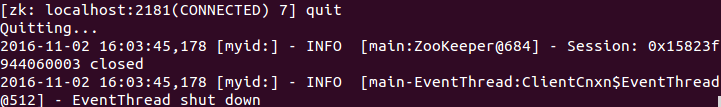
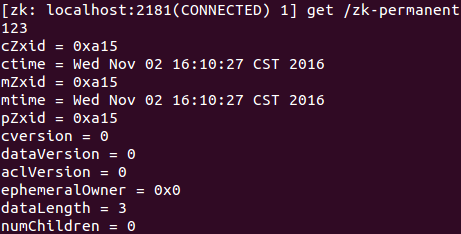
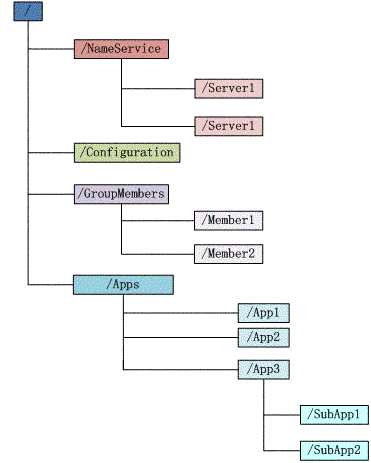
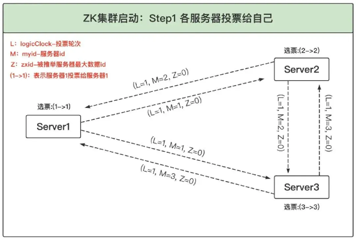

# ZooKeeper

- 官方：[https://zookeeper.apache.org/](https://zookeeper.apache.org/)
- 源码：[https://github.com/apache/zookeeper](https://github.com/apache/zookeeper)
- 中文教程： [https://www.w3cschool.cn/zookeeper/](https://www.w3cschool.cn/zookeeper/)
- Zk原理：[https://www.cnblogs.com/leesf456/p/6239578.html](https://www.cnblogs.com/leesf456/p/6239578.html)
- zK简单介绍：[https://www.cnblogs.com/51life/p/10265864.html](https://www.cnblogs.com/51life/p/10265864.html)
- [ZooKeeper 核心通识](https://mp.weixin.qq.com/s/uustNtBOGvPOx4Q3oPFmSw)

## 1.介绍

名字的由来：在Apache的开源项目中有很多是以动物形象取名字的，比如，Tomcat、hive等，Zookeeper就是动物管理员。

### 1.1.关键概念

- 是一种分布式系统的协调框架。
- Zookeeper的数据模型是树结构，数据保存在内存中（数据保存所有的节点路径、节点数据、ACL信息等），并且Zookeeper也会定时将数据持久化到磁盘上（以事务日志与数据快照的方式）
- 可以帮助我们实现分布式系统中的配置中心、注册中心、分布式锁等。
- 天然支持高可用的集群，只要保证集群中的大部分服务器是可用即可（既可以选举出一个leader）

### 1.2.特性

- 顺序一致性，从同一个客户端发起的事务请求，最终将会严格地按照其发起顺序被应用到Zookeeper中去。
- 原子性，所有事务请求的处理结果在整个集群中所有机器上的应用情况是一致的，即整个集群要么都成功应用了某个事务，要么都没有应用。
- 单一视图，无论客户端连接的是哪个Zookeeper服务器，其看到的服务端数据模型都是一致的。
- 可靠性，一旦服务端成功地应用了一个事务，并完成对客户端的响应，那么该事务所引起的服务端状态变更将会一直被保留，除非有另一个事务对其进行了变更。
- 实时性，Zookeeper保证在一定的时间段内，客户端最终一定能够从服务端上读取到最新的数据状态


### 1.3.当前局面

zk作为早期应用Paxos协议的中间件，实现了CAP中的CP，被许多中间件使用（hadoop、kafka、dubbo等），但是也存在一些缺点导致一些中间件逐渐放弃使用它。

1. 选举时间长。崩溃恢复的期间服务不可用，且时间较长。3.6.0增加了多服务器模式，每个节点可以设置一个备用节点，当服务异常后，可以切换到备用节点，尽可能避免选举。
2. 写入性能差。虽然zk是基于内存的框架，但是每次写操作都需要和大多数节点达成共识，写入时完全依赖于全局的zxid，事务提交采用2PC，导致性能较差。
3. 非典型场景。例如大事务、zxid溢出各种异常容易出现重新选主、选主无法成功等问题，导致服务不可用。
4. 集群扩展性差。通常3、5个节点的集群。在继续增加节点并不会显著的提升性能。3.6.0版本增加了灾备节点。

当前大部分场景需要的是可用性，AP模型更适合作为注册中心。作为其他分布式技术的协调工具也逐步被raft协议的工具所代替。

## 2.安装

### 2.1.下载

下载地址：[https://zookeeper.apache.org/releases.html](https://zookeeper.apache.org/releases.html)

下载后解压即可使用，目录如下(注意zk客户端版本尽量和zk服务版本一致)：


```text
bin ---> 包括了linux和window的运行程序的运行目录
conf ---> zookeeper的配置zoo.cfg
contrib ---> 其他一些组件和发行版本
dist-maven ---> maven发布下的一些jar包
docs ---> 文档
lib ---> 库
recipe ---> 一些应用案例
src ---> zookeeper的源码，因为zookeeper是java写出来的
```

### 2.2.Cli命令

```text
启动         ./zkServer.sh start
状态         ./zkServer.sh status
重启         ./zkServer.sh restart
停止         ./zkServer.sh stop
启动客户端    ./zkCli.sh -server 127.0.0.1:2181
zkCleanup　　清理Zookeeper历史数据，包括事务日志文件和快照数据文件
zkEnv　　　　 设置Zookeeper的环境变量
zkSnapShotToolkit.sh     将快照数据转换成标准输出或者json文件
        ./zkSnapShotToolkit.sh -d  ../dataDir/version-2/snapshot.40000b802  ../str22589
zkTxnLogToolkit.sh       能够恢复带有损坏CRC的事务日志条目
        ./zkTxnLogToolkit.sh        ../dataDir/version-2/log.100000001        
```

注意：windows环境双击zkServer.cmd。但是可能会出现闪退或启动失败的现象，继续往下读操作完3后重新启动zk，即可。

### 2.3.修改配置文件

#### 2.3.1.Window平台

第一步：打开 zkServer.cmd 进行编辑，在尾部加 pause, 如下图


第二步：进入 conf 文件夹下，将 zoo_sample.cfg 文件复制一份修改为 zoo.cfg, 如下图。


第三步：修改 zoo.cfg。将数据目录修改到zk目录下，否则将使用tmp目录，服务器重启后数据丢失。


#### 2.3.2.Linux和Mac平台

执行上面的2和3即可。（但是需要注意的是，所有配置的目录不要有中文）

#### 2.3.3.中文目录【可选】

如果你非要使用中文目录的话，这里有一个比较简单的方式。

因为zookeeper的配置文件是zoo.cfg，我们需要了解都有哪几个地方使用到了这个文件。

第一步：java程序中，在启动zk的时候，会加载配置文件。这里使用的是properties加载的。


properties文件默认的文本编码是unicode，Java程序读取的时候会自动将unicode转为本地编码(一般在程序中都是UTF-8)。
所以需要我们在zoo.cfg中写入unicode编码的中文。


比如zk的安装目录是， /media/zhangxue/工作空间/java/zookeeper-3.4.9，将 工作空间 转为 \\u5DE5\\u4F5C\\u7A7A\\u95F4

第二步：在zk启动时，会校验目录是否存在(命令在zkServer.sh中)。


这个地方使用shell进行操作，shell进行编码比较麻烦。所以我在zoo.cfg中增加了一个配置

dataDirChinese=/media/zhangxue/工作空间/java/zookeeper-3.4.9/zookeeper

之后修改zkServer.sh中的dataDir为dataDirChinese。这样就保证执行shell脚本的时候能正常操作目录了。其他的中文路径配置同上。

### 2.4.基础命令
启动客户端： ./zkCli.sh -server 127.0.0.1:2181


#### 2.4.1.查看根节点的内容


#### 2.4.2.help
可以使用帮助命令help来查看客户端的操作


#### 2.4.3.创建节点
创建节点的时候只能一级一级的创建。

比如： create /a create /a/b 这两个命令是对的

Create /b/c/d 是错误的，会提示/b NodeNotExistsException

使用create命令，可以创建一个Zookeeper节点， 如：create [-s或-e] path data acl

其中，-s或-e分别指定节点特性，顺序或临时节点，若不指定，则表示持久节点；acl用来进行权限控制。

① 创建顺序节点：使用create -s /zk-test 123命令创建zk-test顺序节点


可以看到创建的zk-test节点后面添加了一串数字以示区别。

② 创建临时节点：使用create -e /zk-temp 123命令创建zk-temp临时节点


临时节点在客户端会话结束后，就会自动删除，下面使用quit命令退出客户端



再次使用客户端连接服务端，并使用ls / 命令查看根目录下的节点


可以看到根目录下已经不存在zk-temp临时节点了。

③ 创建永久节点：使用create /zk-permanent 123命令创建zk-permanent永久节点


可以看到永久节点不同于顺序节点，不会自动在后面添加一串数字。

#### 2.4.4.读取节点
与读取相关的命令有ls 命令和get命令，
- ls命令可以列出Zookeeper指定节点下的所有子节点，只能查看指定节点下的第一级的所有子节点；
- get命令可以获取Zookeeper指定节点的数据内容和属性信息。

```text
ls path [watch]
get path [watch]
ls2 path [watch]
```

若获取根节点下面的所有子节点，使用ls /命令即可


若想获取根节点数据内容和属性信息，使用get /命令即可


也可以使用ls2 /命令查看，可以看到其子节点数量为8。


若想获取/zk-permanent的数据内容和属性，可使用如下命令：get /zk-permanent



可以看到其数据内容为123，还有其他的属性，之后会详细介绍。

#### 2.4.5.更新节点
使用set命令，可以更新指定节点的数据内容，用法：set path data [version]

其中，data是新内容，version是节点数据的版本，如将/zk-permanent节点的数据更新为456，可以使用如下命令：set /zk-permanent 456


现在dataVersion已经变为1了，表示进行了更新。

#### 2.4.6.删除节点
使用delete命令可以删除Zookeeper上的指定节点，用法：delete path [version]

使用delete /zk-permanent命令即可删除/zk-permanent节点


可以看到，已经成功删除/zk-permanent节点。

注意：若删除节点存在子节点，那么无法删除该节点，必须先删除子节点，再删除父节点。

#### 2.4.7.设置监听

当指定的znode或znode的子数据更改时，监视器会进行通知。语法：get path watchEvent。
或者 ls和ls2也行

```shell
get /FirstZnode 1
事件包括：
    NodeCreated (1)
    NodeDeleted (2)
    NodeDataChanged (3)
    NodeChildrenChanged (4)
```

#### 2.4.8.其他命令

```shell
检查状态：stat /path
移除Znode：rmr /path（移除指定的znode并递归其所有子节点）
集群状态： config
```

### 2.5.命名规范

节点名称除下列限制外，可以使用任何unicode字符：
1. null字符(\\u0000)不能作为路径名的一部分；
2. 以下字符不能使用，因为它们不能很好地显示，或者以令人困惑的方式呈现: \\u0001 - \\u0019 和 \\u007F - \\u009F。
3. 不允许使用以下字符:\\ud800 - \\uf8fff， \\uFFF0 - \\uFFFF。
4. “.”字符可以用作另一个名称的一部分，但是“.”和“..”不能单独用于指示路径上的节点，因为ZooKeeper不使用相对路径。
所以下列内容无效:“/a/b/./ c”或“c/a/b/../”。
5. “zookeeper”是保留节点名，禁止创建。

### 2.6.zoo.cfg

[官方配置说明](https://zookeeper.apache.org/doc/r3.9.2/zookeeperReconfig.html)

```properties
# 服务器之间或客户端与服务器之间维持心跳的时间间隔，毫秒单位。
tickTime=2000

# initLimit：集群中的follower与leader之间 初始连接 时能容忍的最多心跳数（tickTime的数量），默认10次。
# 大于10次就连接初始化超时。通常如果集群保存的数据量太大时，容易超时。可以适当增加。
initLimit=10

# 集群中的follower与leader之间 请求和应答 之间能容忍的最多心跳数（tickTime的数量），默认5次
syncLimit=5

# 持久化数据的目录，保存 事务日志 与 数据快照。默认是/tmp，该目录重新启动后会被自动清除
dataDir=D:/java/zookeeper-cluster/zookeeper-3.4.9-node1/dataDir

# 保存 事务日志 的目录，可以单独设置事务日志目录。默认是dataDir
dataLogDir=D:/java/zookeeper-cluster/zookeeper-3.4.9-node1/dataLogDir

# 客户端连接端口
# v3.5.0 clientPort 被移除，使用“;”追加到集群配置中。；例如server.1=127.0.0.1:2881:3881;2181
clientPort=2181

# 生成快照文件的事务阈值
snapCount=100

# 客户端最大连接数。根据自己实际情况设置，默认为60个
maxClientCnxns=60

# 集群配置，格式为:server.num=A:B:C:D;E
#   num 是一个数字，表示这个是第几号服务器；例如server.1
#   A 服务的 ip 地址
#   B 与集群中的 Leader 服务器交换信息的端口；
#   C 选举投票使用的端口。
#   D 节点角色。目前有两种：participant=参与投票和读写；observer=不参与投票，只参与读写。
#   E 分号后面，可以设置客户端的ip和端口。默认不用配置。可以只配置端口，也可以ip和端口一起设置。
server.1=127.0.0.1:2881:3881
server.2=127.0.0.1:2882:3882
server.3=127.0.0.1:2883:3883
server.4=127.0.0.1:2884:3884:observer

# 清理频率，单位是小时，默认是0，表示关闭自动清理功能。以下为保留近24个小时内事务日志和快照
autopurge.purgeInterval=24

# 保留日志数量，默认关闭该功能。和上面的参数搭配使用，保留最近20个事务日志和快照。
autopurge.snapRetainCount=20

# v3.5.0 新增的配置
# 1. 单机运行模式标识，默认true。false表示分布式集群。
standaloneEnabled=true

# 2. 动态重新配置。支持动态变更成员，需要配合dynamicConfigFile配置一起使用。
reconfigEnabled=true
# 3. 可以动态修改的成员配置。也是server.A的格式
dynamicConfigFile=/zookeeper/conf/zoo.cfg.dynamic

# v3.6.0 新增的配置方式。
# 1. 指定多个服务器地址。设置多个服务为集群节点1，有助于提高可用性并为 ZooKeeper 增加网络级弹性。
# ip2作为ip1的热备节点，当节点故障后能够立刻切换到另一个节点。提升节点的可用性，提升扩展能力。
server.1=ip1:2888:3888|ip2:2888:3888:2181
```

## 3.集群部署

- [安装部署集群搭建及基本配置详解](https://blog.csdn.net/zyq_2014/article/details/84608475)
- [最详尽Zookeeper集群部署流程](https://www.jianshu.com/p/1a99eebdf075)

### 3.1.配置zoo.cfg

配置很简单，只需要在所有的节点配置所有的配置信息即可

```properties
# server.服务编号=服务地址、LF通信端口、选举端口
server.1=10.129.205.242:28881:38881
server.2=10.129.205.242:28882:38882
server.3=10.129.205.242:28883:38883
```

### 3.2.创建myid

在dataDir目录下创建空白文件myid，内容为server后面的服务号

### 3.3.自定义脚本

Window集群启动日志
```shell
echo -------------------zk集群启动-------------------
start /d "D:\\java\\zookeeper-cluster\\zookeeper-3.4.9-node1\\bin" zkServer.cmd
start /d "D:\\java\\zookeeper-cluster\\zookeeper-3.4.9-node2\\bin" zkServer.cmd
start /d "D:\\java\\zookeeper-cluster\\zookeeper-3.4.9-node3\\bin" zkServer.cmd
```

Linux集群脚本。脚本命令切换为start status stop
```shell
echo -------------------zk集群启动-------------------
bash /usr/local/java/zookeeper-3.4.9-cluster/zookeeper-node1/bin/zkServer.sh start &
bash /usr/local/java/zookeeper-3.4.9-cluster/zookeeper-node2/bin/zkServer.sh start &
bash /usr/local/java/zookeeper-3.4.9-cluster/zookeeper-node3/bin/zkServer.sh start &
```

### 3.4.设置系统日志【可选】

1. 修改zkEnv.sh文件，修改ZOO_LOG_DIR的配置，将"." 修改为"${ZOOKEEPER_PREFIX}/logs"


2. 修改zkEnv.sh文件，修改ZOO_LOG4J_PROP，将 ZOO_LOG4J_PROP="INFO,CONSOLE" 修改为：ZOO_LOG4J_PROP="INFO,CONSOLE,ROLLINGFILE"
3. 修改conf/log4j.properties文件，将 zookeeper.root.logger=INFO,ROLLINGFILE 修改为：zookeeper.root.logger=INFO,CONSOLE,ROLLINGFILE
4. 将修改的文件同步到其他节点即可

日志文件的格式还可以使用
```properties
log4j.appender.ROLLINGFILE.File=zookeeper.log
log4j.appender.ROLLINGFILE.DataPattern='.'yyyy-MM-dd-HH-mm
log4j.appender.ROLLINGFILE.Threshold=debug
log4j.appender.ROLLINGFILE.encoding=UTF-8
log4j.appender.ROLLINGFILE.Append=false
log4j.appender.ROLLINGFILE.layout=org.apache.log4j.PatternLayout
log4j.appender.ROLLINGFILE.layout.ConversionPattern= [%d{yyyy-MM-dd HH\\:mm\\:ss}]%-5p %c(line\\:%L) %x-%m%n
```

### 3.5.权限控制【可选】

zk在3.5.3之后添加了权限控制，防止任意节点使用客户端连接到集群破坏集群（就是为了限制reconfig 命令），使用方式：
```shell
1. 生成摘要。在zk的根目录，使用以下命令生成摘要
java -cp ./lib/*:./* org.apache.zookeeper.server.auth.DigestAuthenticationProvider su:passwd >> passwd
例如：su:passwd->su:gACzJ4L2A0F2ygTno5HQnfabuik=

2.更新zkServer.sh。在zkServer.sh文件中新增命令行，注意修改上一步生成的摘要
SERVER_JVMFLAGS="-Dzookeeper.DigestAuthenticationProvider.superDigest=su:gACzJ4L2A0F2ygTno5HQnfabuik="

3.使用：命令行模式：addauth digest su:passwd，根据提示写入：gACzJ4L2A0F2ygTno5HQnfabuik。
```

### 3.6.动态变更集群成员【可选】

zk3.5.0(2014年)开始支持动态变更集群成员，之前是静态配置只能修改配置文件后重启集群，容易出现脑裂、数据丢失等问题。

前提：必须开启动态配置：zk.conf 中 reconfigEnabled=true

我们可选的方式两种：

第一种：设置dynamicConfigFile=/zookeeper/conf/zoo.cfg.dynamic。
修改zoo.cfg.dynamic，修改集群服务器上的配置文件，会自动同步。【官方不建议】通过过程可能节点间配置不一致，容易导致问题
```shell
server.1=125.23.63.23:2780:2783:participant;2791
server.2=125.23.63.24:2781:2784:participant;2792
server.3=125.23.63.25:2782:2785:participant;2793
```

第二种：使用命令行：
```shell
需要先进行权限认证：addauth digest su:passwd
reconfig -add server.4=worker1-bak:2888:3888;2181
reconfig -remove 4
```

### 3.7.Zookeeper迁移方案

- 停服迁移，复制日志即可。[Zookeeper 冷迁移方案](https://cloud.tencent.com/document/product/1364/90470)
- 依赖于公有云的功能。   [Zookeeper 热迁移方案【平滑迁移方案】](https://cloud.tencent.com/document/product/1364/86145)

所有迁移方案，都需要zk修改配置重启服务。

## 4.基本概念

对于客户端：zookeeper=文件系统+通知机制

### 4.1.底层数据结构

#### 4.1.1.ZKDatabase

zk本质是内存型数据库，ZKDatabase就是zk的数据库核心，用于管理zk所有会话、DataTree存储、事务日志等。
同时负责向磁盘序列化快照文件，以及在启动的时候通过事务日志与快照文件恢复zk全部的内存数据库


其中FileTxnSnapLog提供了操作数据文件的接口


#### 4.1.2.DataTree

DataTree是zk内存数据结构的核心。一个zk中只有一个DataTree对象。

#### 4.1.3.DataNode

DataNode是数据存储的最小单元。DataTree存储的数据主要就是DataNode。同时提供了对子节点操作的接口。
- DataNode parent: 父节点的对象引用
- byte data[]：节点数据的字节数组。
- Long acl：Datatree的ReferenceCountedACLCache中使用Map<Long, List<ACL>>缓存着所有DataNode的权限列表，
    这里的acl就是Map<Long, List<ACL>>的Key。
- StatPersisted stat：节点状态信息。
- Set<String>children：数据节点的子节点列表，这是只是节点Path的字符串路径，并且是相对路径。

数据量现在1M以内。


StatPersisted保存的信息如下：


```text
cZxid：创建该节点的zxid
mZxid：该节点的最后修改zxid
ctime：该节点的创建时间
mtime：该节点的最后修改时间
cversion：该节点的子节点变更次数
aclVersion：该节点的ACL（权限）变更次数
aphemeraOwner：临时节点所有者会话id，非临时的为0
pZxid：该节点的最后子节点修改zxid
dataVersion：该节点数据被修改的次数
dataLength：该节点数据长度
numChildren：子节点数
```

### 4.2.znode状态
文件系统：Zookeeper维护一个类似文件系统的数据结构



每个目录都被称为znoed，和文件系统一样，我们可以通过命令增加、删除、修改znode，在znode下增加、删除子znode。唯一不同的在于znode是可以存储数据的。

有7种类型的znode（有三种是3.5.0增加的）
1. PERSISTENT(持久化目录节点): 客户端与zookeeper断开连接后，该节点依旧存在
2. PERSISTENT_SEQUENTIAL(持久化顺序编号目录节点)。客户端与zookeeper断开连接后，该节点依旧存在，只是Zookeeper给该节点名称进行顺序编号
3. EPHEMERAL(临时目录节点)。客户端与zookeeper断开连接后，该节点被删除
4. EPHEMERAL_SEQUENTIAL(临时顺序编号目录节点)。客户端与zookeeper断开连接后，该节点被删除，只是Zookeeper给该节点名称进行顺序编号
5. CONTAINER(容器节点): 用于Leader、Lock等特殊用途，当容器节点不存在任何子节点时，容器将成为服务器在将来某个时候删除的候选节点。（3.5+新增的类型）
6. PERSISTENT_WITH_TTL：带TTL（time-to-live，存活时间）的永久节点，节点在TTL时间之内没有得到更新并且没有孩子节点，就会被自动删除。（3.5+新增的类型）
7. PERSISTENT_SEQUENTIAL_WITH_TTL：带TTL（time-to-live，存活时间）和单调递增序号的永久节点，节点在TTL时间之内没有得到更新并且没有孩子节点，就会被自动删除。（3.5+新增的类型）

注意：临时节点不能拥有子节点。节点类型是在创建时进行制定，后续不能改变

### 4.3.通知机制
客户端注册监听它关心的目录节点，当目录节点发生变化（数据改变、被删除、子目录节点增加删除）等，zookeeper会通知客户端。

当客户端对ZooKeeper的某个事件上添加Watcher时，客户端会保持一个EventThread线程接收事件通知，根据绑定的Event来触发Watcher执行process方法。Watcher是一次性的，只会触发一次。

#### 4.3.1.事件类型
```java
// 可能发生在ZooKeeper上的事件的类型枚举
public enum EventType {
    None (-1),
    NodeCreated (1),
    NodeDeleted (2),
    NodeDataChanged (3),
    NodeChildrenChanged (4);
}
```

#### 4.3.2.事件状态
```java
// ZooKeeper可能在事件中所处的状态的枚举
public enum KeeperState {
    /** Unused, this state is never generated by the server */
    @Deprecated
    Unknown(-1),

    /** The client is in the disconnected state - it is not connected to any server in the ensemble. */
    Disconnected(0),

    /** Unused, this state is never generated by the server */
    @Deprecated
    NoSyncConnected(1),

    /** The client is in the connected state - it is connected
     * to a server in the ensemble (one of the servers specified
     * in the host connection parameter during ZooKeeper client
     * creation). */
    SyncConnected(3),

    /**
     * Auth failed state
     */
    AuthFailed(4),

    /**
     * The client is connected to a read-only server, that is the
     * server which is not currently connected to the majority.
     * The only operations allowed after receiving this state is
     * read operations.
     * This state is generated for read-only clients only since
     * read/write clients aren't allowed to connect to r/o servers.
     */
    ConnectedReadOnly(5),

    /**
     * SaslAuthenticated: used to notify clients that they are SASL-authenticated,
     * so that they can perform Zookeeper actions with their SASL-authorized permissions.
     */
    SaslAuthenticated(6),

    /** The serving cluster has expired this session. The ZooKeeper
     * client connection (the session) is no longer valid. You must
     * create a new client connection (instantiate a new ZooKeeper
     * instance) if you with to access the ensemble. */
    Expired(-112);
}    
```

### 4.4.Zxid 事务ID
Zxid是ZK状态改变的唯一标识符，全局唯一且自增的64位的整数，由两部分组成：
- 高32位是epoch，每次一个Leader被选出来，它都会有一个新的epoch；
- 低32位是一个递增计数，表示在该epoch期间执行的事务数量

作用：通过唯一的标识符来确保每个事务的原子性和一致性，并在集群环境中提供数据同步和选举过程中的关键支持。

每一个事务的改变都将产生一个唯一的Zxid。如果Zxid1的值小于Zxid2的值，那么Zxid1所对应的事件发生在Zxid2所对应的事件之前。
实际上，ZooKeeper的每个节点维护者两个Zxid值，为别为：cZxid、mZxid。
1. cZxid：是节点的创建时间所对应的Zxid。
2. mZxid：是节点的修改时间所对应的Zxid。

zxid 下32位是计数器，当超过32位（即0xffffffff）的时候，就会占用上32位，导致epoch被加一，zxid的机制就被破坏了。
所以zk中如果发生溢出，会触发集群的强制选主过程，并重置zxid的低32位为0。

目前没有干预手动，只能监控到，并找一个空闲时间批量写入数据主动触发选主。

### 4.5.server id（myid）

集群中的每台ZK server都会有一个用于惟一标识自己的id，有两个地方会使用到这个id：myid文件和zoo.cfg文件中

- myid文件存储在dataDir目录中，指定了当前server的server id
- 在zoo.cfg文件中，根据server id，配置了每个server的ip和相应端口。
  Zookeeper启动的时候，读取myid文件中的server id，然后去zoo.cfg 中查找对应的配置

## 5.日志(介绍zk工具)

事务日志和快照日志都保存在dataDir目录下。也可以为事务日志单独存储在一个目录下：dataLogDir。

在日志的目录下，zk会创建一个version-2的目录。这个目录用来确认当前事务日志格式的版本号。
当zk的事务日志的格式发生变化的时候，会自动生成version-3、version-4、version-5等目录。
目前只有version-2一种目录。

```shell
D:\java\zookeeper-3.9.2\dataDir\version-2
log.1               ## 事务日志，大小一致都是64MB
log.2               ## 事务日志，大小一致都是64MB
log.3               ## 事务日志，大小一致都是64MB
snapshot.0          ## 快照，跟数据量有关
snapshot.1          ## 快照，跟数据量有关
snapshot.2          ## 快照，跟数据量有关
```

### 5.1.事务日志

#### 5.1.1.文件存储

每个日志文件都以64MB风格，名称格式为log.version。version是日志的版本号。

#### 5.1.2.查看日志文件

使用方式：
```shell
3.5.0 版本以下：
    java -classpath zookeeper-3.4.9.jar;lib/* org.apache.zookeeper.server.LogFormatter ./dataDir/version-2/log.1
3.5.0 版本以上：
    bash zkTxnLogToolkit.sh ../dataDir/version-2/log.1
```

完成如下操作:
```shell
create /test_log v1
set /test_log v2
create /test_log/c v1
delete /test_log/c
```

可以看到如下日志:
```shell
D:\java\zookeeper-3.4.9>java -classpath zookeeper-3.4.9.jar;lib/* org.apache.zookeeper.server.LogFormatter ./dataDir/version-2/log.5
ZooKeeper Transactional Log File with dbid 0 txnlog format version 2
# 1. 客户端会话创建，超时时间为30s
24-7-10 下午09时27分07秒 session 0x1909cd102860000 cxid 0x0 zxid 0x5 createSession 30000

24-7-10 下午09时27分09秒 session 0x1909cd102860000 cxid 0x1 zxid 0x6 create '/test_log,#7631,v{s{31,s{'world,'anyone}}},F,2
内容依次如下：
1. 会话ID：0x1909cd102860000
2. 客户端事务ID：0x1。  session内自增的属性。
3. zxid：0x6
4. 操作类型：create
5. 操作内容：'/test_log,#7631,v{s{31,s{'world,'anyone}}},F,2 
        /test_log 是节点路径
        #7631     节点数据，经过ASCII编码
        v{s{31,s{'world,'anyone}}}      acl为world:anyone任何人都可以管理该节点
        F         表示节点不是 ephemeral
        2         父节点的子版本号

24-7-10 下午09时27分19秒 session 0x1909cd102860000 cxid 0x2 zxid 0x7 setData '/test_log,#7632,1
24-7-10 下午09时27分41秒 session 0x1909cd102860000 cxid 0x3 zxid 0x8 create '/test_log/c,#7631,v{s{31,s{'world,'anyone}}},F,1
24-7-10 下午09时27分48秒 session 0x1909cd102860000 cxid 0x4 zxid 0x9 delete '/test_log/c
EOF reached after 5 txns.
```

#### 5.1.3.事务日志写入

FileTxnLog负责维护事务日志对外的接口，包括事务日志的写入和读取等。Zookeeper的事务日志写入过程大体可以分为如下6个步骤。
1. 确定是否有事务日志可写：当Zookeeper服务器启动完成需要进行一次事务日志的写入，或是上一次事务日志写满时，都会处于与事务日志文件断开的状态。
   即Zookeeper服务器没有和任意一个日志文件相关联。因此在进行事务日志写入前，Zookeeper首先会判断FileTxnLog组件是否已经关联上一个可写的事务日志文件。
   若没有，则会使用该事务操作关联的ZXID作为后缀创建一个事务日志文件，同时构建事务日志的文件头信息，并立即写入这个事务日志文件中去，同时将该文件的文件流放入streamToFlush集合，该集合用来记录当前需要强制进行数据落盘的文件流。
2. 确定事务日志文件是否需要扩容(预分配)：Zookeeper会采用磁盘空间预分配策略。当检测到当前事务日志文件剩余空间不足4096字节时，就会开始进行文件空间扩容，即在现有文件大小上，将文件增加65536KB(64MB)，然后使用"0"填充被扩容的文件空间。
3. 事务序列化：对事务头和事务体的序列化，其中事务体又可分为会话创建事务、节点创建事务、节点删除事务、节点数据更新事务等。
4. 生成Checksum：为保证日志文件的完整性和数据的准确性，Zookeeper在将事务日志写入文件前，会计算生成Checksum。
5. 写入事务日志文件流：将序列化后的事务头、事务体和Checksum写入文件流中，此时并为写入到磁盘上。
6. 事务日志刷入磁盘：由于步骤5中的缓存原因，无法实时地写入磁盘文件中，因此需要将缓存数据强制刷入磁盘。

#### 5.1.4.日志截断（异常日志处理）

在Zookeeper运行过程中，可能出现非Leader记录的事务ID比Leader上大，这是非法运行状态。
此时，需要保证所有机器必须与该Leader的数据保持同步，即Leader会发送TRUNC命令给该机器，要求进行日志截断，follower收到该命令后，就会删除所有包含或大于该事务ID的事务日志文件。

### 5.2.数据快照

数据快照是Zookeeper数据存储中非常核心的运行机制，数据快照用来记录Zookeeper服务器上某一时刻的全量内存数据内容，并将其写入指定的磁盘文件中。

#### 5.2.1.文件存储

名称格式为 snapshot.version。version是日志的版本号。

生成快照文件的触发条件
1. 事务日志记录次数达到设定值，snapCount参数控制两次快照间事务的次数阈值，默认10W
2. 新Leader选举。新leader会生成快照文件

#### 5.2.2.查看日志

使用方式：
```shell
3.5.0 版本以下：
    java -classpath zookeeper-3.4.9.jar;lib/*  org.apache.zookeeper.server.SnapshotFormatter ./dataDir/version-2/snapshot.501154259
3.5.0 版本以上：
    zkSnapShotToolkit.cmd ../dataDir/version-2/snapshot.0
```

日志如下：
```shell
ZNode Details (count=5):
----
/
  cZxid = 0x00000000000000
  ctime = Thu Jan 01 08:00:00 CST 1970
  mZxid = 0x00000000000000
  mtime = Thu Jan 01 08:00:00 CST 1970
  pZxid = 0x00000000000000
  cversion = 0
  dataVersion = 0
  aclVersion = 0
  ephemeralOwner = 0x00000000000000
  dataLength = 0
----
/zookeeper
  cZxid = 0x00000000000000
  ctime = Thu Jan 01 08:00:00 CST 1970
  mZxid = 0x00000000000000
  mtime = Thu Jan 01 08:00:00 CST 1970
  pZxid = 0x00000000000000
  cversion = 0
  dataVersion = 0
  aclVersion = 0
  ephemeralOwner = 0x00000000000000
  dataLength = 0
----
/zookeeper/config
  cZxid = 0x00000000000000
  ctime = Thu Jan 01 08:00:00 CST 1970
  mZxid = 0x00000000000000
  mtime = Thu Jan 01 08:00:00 CST 1970
  pZxid = 0x00000000000000
  cversion = 0
  dataVersion = 0
  aclVersion = -1
  ephemeralOwner = 0x00000000000000
  dataLength = 0
----
/zookeeper/quota
  cZxid = 0x00000000000000
  ctime = Thu Jan 01 08:00:00 CST 1970
  mZxid = 0x00000000000000
  mtime = Thu Jan 01 08:00:00 CST 1970
  pZxid = 0x00000000000000
  cversion = 0
  dataVersion = 0
  aclVersion = 0
  ephemeralOwner = 0x00000000000000
  dataLength = 0
----
Session Details (sid, timeout, ephemeralCount):
----
Last zxid: 0x0
```

#### 5.2.3.数据快照

FileSnap负责维护快照数据对外的接口，包括快照数据的写入和读取等，将内存数据库写入快照数据文件其实是一个序列化过程。
针对客户端的每一次事务操作，Zookeeper都会将他们记录到事务日志中，同时也会将数据变更应用到内存数据库中。
Zookeeper在进行若干次事务日志记录后，将内存数据库的全量数据Dump到本地文件中，这就是数据快照。其步骤如下
1. 确定是否需要进行数据快照：每进行一次事务日志记录之后，Zookeeper都会检测当前是否需要进行数据快照，考虑到数据快照对于Zookeeper机器的影响，需要尽量避免Zookeeper集群中的所有机器在同一时刻进行数据快照。采用过半随机策略进行数据快照操作。
2. 切换事务日志文件：表示当前的事务日志已经写满，需要重新创建一个新的事务日志。
3. 创建数据快照异步线程：创建单独的异步线程来进行数据快照以避免影响Zookeeper主流程。
4. 获取全量数据和会话信息：从ZKDatabase中获取到DataTree和会话信息。
5. 生成快照数据文件名：Zookeeper根据当前已经提交的最大ZXID来生成数据快照文件名。
6. 数据序列化：首先序列化文件头信息，然后再对会话信息和DataTree分别进行序列化，同时生成一个Checksum，一并写入快照数据文件中去

### 5.3.日志自动清理

提供自动清除日志的功能
```properties
# 清理频率，单位是小时，默认是0，表示关闭自动清理功能。以下为保留近24个小时内事务日志和快照
autopurge.purgeInterval=24

# 保留日志数量，默认关闭该功能。和上面的参数搭配使用，保留最近20个事务日志和快照。
autopurge.snapRetainCount=20
```

### 5.4.其他工具

1. zkSnapshotRecursiveSummaryToolkit：递归收集并显示选定节点的子节点数量和数据大小
2. zkSnapshotComparer：它加载并比较两个具有可配置阈值和各种过滤器的快照，并输出有关增量的信息。

## 6.应用

### 6.1.命名服务

命名服务也是分布式系统中比较常见的一类场景。在分布式系统中，通过使用命名服务，客户端应用能够根据指定名字来获取资源或服务的地址，提供者等信息。
被命名的实体通常可以是集群中的机器，提供的服务地址，远程对象等等——这些我们都可以统称他们为名字（Name）。
其中较为常见的就是一些分布式服务框架中的服务地址列表。通过调用ZK提供的创建节点的API，能够很容易创建一个全局唯一的path，这个path就可以作为一个名称。

### 6.2.数据发布与订阅(配置中心)

程序总是需要配置的，如果程序分散部署在多台机器上，要逐个改变配置就变得困难。发布者将将配置信息发布到zk的节点上，订阅者可以动态获得消息。
这样就实现了消息的统一管理，动态更新。

一般的场景是：程序启动的时候，到zk主动获取一次消息，并在节点上注册一个watcher，以后每次配置有更新的时候，都会实时通知到订阅的客户端，从来达到获取最新配置信息的目的。
这样的场景适合数据量很小，但是数据更新可能会比较快的需求。


### 6.3.负载均衡

这里说的负载均衡是指软负载均衡。在分布式环境中，为了保证高可用性，通常同一个应用或同一个服务的提供方都会部署多份，达到对等服务。
而消费者就须要在这些对等的服务器中选择一个来执行相关的业务逻辑，其中比较典型的是消息中间件中的生产者，消费者负载均衡。
本质其实也是数据的发布与订阅

### 6.4.集群管理与master选举

所谓集群管理无在乎两点：是否有机器退出和加入、选举master。

对于第一点，所有机器约定在父目录GroupMembers下创建临时目录节点，然后监听父目录节点的子节点变化消息。
一旦有机器挂掉，该机器与 zookeeper的连接断开，其所创建的临时目录节点被删除，所有其他机器都收到通知：某个兄弟目录被删除。
新机器加入 也是类似，所有机器收到通知：新兄弟目录加入，highcount又有了。

对于第二点，我们稍微改变一下，所有机器创建临时顺序编号目录节点，每次选取编号最小的机器作为master就好。


### 6.5.分布式通知/协调

ZooKeeper中特有watcher注册与异步通知机制，能够很好的实现分布式环境下不同系统之间的通知与协调，实现对数据变更的实时处理。
使用方法通常是不同系统都对ZK上同一个znode进行注册，监听znode的变化（包括znode本身内容及子节点的），其中一个系统update了znode，那么另一个系统能够收到通知，并作出相应处理

### 6.6.分布式锁

有了zookeeper的一致性文件系统，锁的问题变得容易。锁服务可以分为两类，一个是保持独占，另一个是控制时序。

对于第一类，临时节点，我们将zookeeper上的一个znode看作是一把锁，通过createznode的方式来实现。
所有客户端都去创建 /distribute_lock 节点，最终成功创建的那个客户端也即拥有了这把锁。
厕所有言：来也冲冲，去也冲冲，用完删除掉自己创建的distribute_lock 节点就释放出锁。

对于第二类，临时有序节点 /distribute_lock已经预先存在，所有客户端在它下面创建临时顺序编号目录节点，和选master一样，
编号最小的获得锁，用完删除。（生产中推荐这种方式）


由于Watcher是一次性的，所以触发后还要重新注册。所以效率不高。

获取到锁的客户端执行结束后删除该节点，此时会触发下一个客户端的监听器去获取锁
- 多个客户端去创建节点时，ZooKeeper会自动根据请求到达的时间顺序对节点进行编号
- 每个客户端需要判断自己所创建的节点是否是所有子节点中最小的一个，如果是则说明获取到锁，可以直接执行方法，否则监听上一个节点等待锁。

如果客户端在创建节点后由于某些原因断开了与ZooKeeper的连接，则该客户端的Session失效时会删除其创建的节点，并进行通知

若持有/lock/000的客户端还在执行方法，持有/lock/001的客户端突然断开连接，为了不让后面的节点收到错误的通知顺序，
要尽可能保证在该客户端之前获取锁的所有客户端都能执行完成， 需适当加大SessionTimeOut的值来延长节点的存活时间。

### 6.7.队列管理

两种类型的队列：
1. 同步队列，当一个队列的成员都聚齐时，这个队列才可用，否则一直等待所有成员到达。
    - 实现方案：在约定目录下创建临时目录节点，监听节点数目是否是我们要求的数目。
2. 队列按照 FIFO 方式进行入队和出队操作。
    - 实现方案：和分布式锁服务中的控制时序场景基本原理一致，入列有编号，出列按编号。

### 6.8.实践应用

Zk作为Hadoop的子项目，现在已经是成熟的可商用的框架。

#### 6.8.1.HA高可用

比如 hadoop、hdfs、yarn 等很多大数据系统，都选择基于 zookeeper 来实现 HA 高可用机制。

具体来说就是一个重要进程一般会做主备两个，主进程挂了立马通过 zookeeper 感知到切换到备用进程。


#### 6.8.2.dubbo

Dubbo2.7的使用方式（非常简单的使用） 生产者，zk保存生产者的列表。消费者定于生产者的目录，帮助发现服务变化。
数据内容如下：
```shell
[zk: localhost:2181(CONNECTED) 3] ls /dubbo/org.demo.api.chapter_07_failfast.UserFacade/providers
[
	dubbo://172.20.25.108:29012/org.demo.api.chapter_07_failfast.UserFacade?anyhost=true&application=dubbo-demo-provider&dubbo=2.6.0&generic=false&group=dubbo-demo-group&interface=org.demo.api.chapter_07_failfast.UserFacade&methods=get\insert&owner=zhangxue&pid=13156&revision=1.0.0&side=provider&timeout=5000&timestamp=1578295038734&version=1.0.0, 
	dubbo://172.20.25.108:29011/org.demo.api.chapter_07_failfast.UserFacade?anyhost=true&application=dubbo-demo-provider&dubbo=2.6.0&generic=false&group=dubbo-demo-group&interface=org.demo.api.chapter_07_failfast.UserFacade&methods=get\insert&owner=zhangxue&pid=12272&revision=1.0.0&side=provider&timeout=5000&timestamp=1578295031440&version=1.0.0
]

根目录：所有 Dubbo 相关的数据都组织在 /dubbo 的根节点下；
二级目录是服务名，如 org.demo.api.chapter_07_failfast.UserFacade ；
三级目录有两个子节点，分别是 providers 和 consumers ，表示该服务的提供者和消费者；
四级目录记录了与该服务相关的每一个应用实例的 URL 信息，在 providers 下的表示该服务的所有提供者，而在 consumers 下的表示该服务的所有消费者。
```

这个目录下的value = null。
```shell
get /dubbo/org.demo.api.chapter_07_failfast.UserFacade/providers/dubbo%3A%2F%2F172.20.25.108%3A29012%2Forg.
demo.api.chapter_07_failfast.UserFacade%3Fanyhost%3Dtrue%26application%3Ddubbo-demo-provider%26dubbo%3D2.6.0%26generic%3Dfalse%26group%3Ddubbo-demo-group%26interface%3Dorg.demo.api.chapter_07_failfast.UserFacade%26methods%3Dget%2Cinsert%26owner%3Dzhangxue%26pid%3D13156%26revision%3D1.0.0%26side%3Dprovider%26timeout%3D5000%26timestamp%3D1578295038734%26version%3D1.0.0
```

#### 6.8.3.kafka

ZK 在 Kafka 集群中扮演着极其重要的角色。Kafka 中很多信息都在 ZK 中维护，如 broker 集群信息、consumer 集群信息、 topic 相关信息、 partition 信息等。
Kafka 的很多功能也是基于 ZK 实现的，如 partition 选主、broker 集群管理、consumer 负载均衡等


## 7.原理

### 7.1.会话

- Session：指客户端与服务端之间建立的一个TCP长连接，允许客户端与服务端之间持续、有效地进行通信。
- Session ID：每个Session都有一个全局唯一的ID，用于唯一标识一个会话，由zk分配给客户端。
- Session Timeout：Session的超时时间，即客户端与服务端之间连接的最大空闲时间。由客户端设置超时时间。
   如果在这个时间内客户端没有与服务端进行任何通信（包括心跳检测或请求响应），则zk认为该Session已经过期，并关闭该Session。

Session的生命周期
- 连接建立：客户端随机读取任意一个节点（既可以是leader也可以是follower），并与之建立TCP连接，zk服务端分配Session ID，并返回客户端，表示连接成功。
- 会话保持：Session创建成功后，客户端需要定期向服务端发送心跳检测请求（PING请求）以保持会话的活跃状态。服务端在收到心跳检测请求后会更新Session的状态信息。
- 会话过期：如果客户端在Session Timeout时间内没有与服务端进行任何通信，则服务端会认为该Session已经过期，并关闭该Session。
- 会话恢复：在某些情况下（如网络故障、服务端重启等），客户端可能需要重新连接到ZooKeeper服务端。
  如果客户端在Session Timeout时间内重新连接到了服务端的另一个服务器，并且该服务器能够识别出该Session ID是有效的，则客户端可以恢复之前的Session，并继续之前的操作。

服务端分桶策略：为了有效的管理所有的session，服务端会根据每个Session的下次超时时间点（TickTime）将Session分配到不同的桶中。
zk服务端内部进行超时检测时，服务端只需要扫描对应桶中的Session即可，大大提高了检测效率。

客户端连接策略：客户端根据配置随机一个索引值 n (0<=n<节点数量)并开始建立连接，如果连接中断或异常，则尝试连接索引是 n+1 的节点。
如果n+1大于节点数量，则重置为0。一直轮询着尝试连接，直到成功为止。

### 7.2.角色与状态

Zk集群中有三种角色：在集群中，每个节点有且只能有一个角色。
- leader：负责处理客户端的写请求，发起并维护与各 Follwer 及 Observer 间的心跳
- follower：连接客户端，处理读请求，负责将写请求转发到leader，并接收leader的决议（写请求），参与选举投票。
- Observer：与follower一样，但是不参与选举，只是为了扩展系统，提升读取速度。

节点的状态存在四种：
- looking:   在设定的时间范围内节点未能与leader通讯（initLimit），节点会进入这个状态，并开始投票选举。
- following: follower的状态，接受leader节点的同步和指挥
- leading:   leader的状态
- observing: Observer的状态，表示当前服务器的observing

Observer的作用：
1. 通过减少投票机器数量，从而提高选举的性能。
2. 可以降低分散负载，降低节点压力。
3. 观察者如果宕机，影响也不大，因为不是核心人员。

Observer使用注意事项：但是注意，引入观察者，从性能角度来看，是好东西。但是如果从集群高可用的角度来看，要慎用。
1. 5台机器,2个观察者,1个follower挂掉,此时不满足过半机制,选不出leader,集群无法工作
2. 3台机器，把两台配置成观察者，这么做是不行的，因为不满足过半机制，所以选不出leader,导致集群启动不了

### 7.3.Zab原子广播

Zab（zookeeper atomic broadCast，原子广播）是基于Paxos裁剪出来的，为分布式协调服务 ZooKeeper 专门设计的一种支持崩溃恢复的原子广播协议。
在 ZooKeeper 中，主要依赖 ZAB 协议来实现分布式数据一致性，基于该协议，ZooKeeper 实现了一种主备模式的系统架构来保持集群中各个副本之间的数据一致性。

zk是数据一致性的（表面上是强一致性，但其实还是最终一致性，可能存在延迟），且是顺序一致性的，实现方关键技术如下：
1. 原子性操作：通过leader统一写操作，然后再广播出去。
2. 2PC：由leader扮演事务协调者进行事务二阶段提交。广播出去后，超过半数响应才能提交事务。
3. 顺序性。通过zxid，实现数据的顺序性。
4. 多副本：每个节点都保存完整的数据，且leader选举后，会重新与leader强制同步数据
5. 最终一致：原子广播只需要超过半数节点应答即可，可能存在短暂的数据延迟。

#### 7.3.1.一致性协议

Zab 协议可以分为以下阶段：
- Phase 0，Leader 选举（Leader Election)。一个节点只要求获得半数以上投票，就可以当选为准 Leader；
- Phase 1，发现（Discovery）。准 Leader 收集其他节点的数据信息，并将最新的数据复制到自身；
- Phase 2，同步（Synchronization）。准 Leader 将自身最新数据复制给其他落后的节点，并告知其他节点自己正式当选为 Leader；
- Phase 3，广播（Broadcast）。Leader 正式对外服务，处理客户端写请求，对消息进行广播。经典的两阶段提交事务处理过程。
  1. 当收到一个写请求后，leader将其封装为Proposal(提案)，并发广播给所有Follower
  2. 当超过半数Follower节点应答之后，Leader 再发送 Commit 命令给各个 Follower，告知它们提交事务；
  3. 当超过半数Follower节点提交事务并应答之后，Leader本地提交事务，并返回写操作成功。

#### 7.3.2.工作模式
关于 ZAB 中的两种模式：
- 崩溃恢复：当整个服务在启动过程中，或是当 Leader 服务器出现网络中断、崩溃退出与重启等异常情况时，
  ZAB 协议就会进入恢复模式并选举产生新的Leader服务器。当选出 leader,并且完成了上面 Phase 2 的同步过程，就退出崩溃恢复模式
- 消息广播：当准 Leader 将自身最新数据复制给其他落后的节点，并告知其他节点自己正式当选为 Leader。
  这时候就可以进入广播模式，当有客户端进行数据写入操作的时候，就可以通过广播模式通知所有的 follower 了。
  当集群中已经有过半的Follower服务器完成了和Leader服务器的状态同步，那么整个服务框架就可以进入消息广播模式了。

zk集群处于崩溃恢复时，是无法处理客户端请求的。

#### 7.3.3.客户端写请求处理过程

客户端与任意节点创建连接（leader或者follower），所有的读写操作都是通过这个连接进行的。
- 当客户端发送写请求，如果节点是follower则会将请求转发到leader节点，leader节点使用广播机制处理请求。
- 如果节点是leader则使用广播机制处理请求。


#### 7.3.4.顺序写
ZooKeeper 保证的数据一致性也叫顺序一致性，即每个结点的数据都是严格按事务的发起顺序生效的。
ZooKeeper 集群的写入是由 Leader 结点协调的，真实场景下写入会有一定的并发量，那 Zab 协议的两阶段提交是如何保证事务严格按顺序生效的呢？

事务的顺序性是借助 Zxid 实现的。Leader 在收到半数以上 ACK 后会将提案生效并广播给所有 Follower，Leader 为了保证提案按 ZXID 顺序生效，
使用了一个 ConcurrentHashMap，记录所有未提交的提案，命名为 outstandingProposals，key 为 ZXID，Value 为提案的信息。
对 outstandingProposals 的访问逻辑如下：
- Leader 每发起一个提案，会将提案的 ZXID 和内容放到 outstandingProposals 中，作为待提交的提案；
- Leader 收到 Follower 的 ACK 信息后，根据 ACK 中的 ZXID 从 outstandingProposals 中找到对应的提案，对 ACK 计数;
- 执行 tryToCommit 尝试将提案提交，判断流程是：
  1. 先判断当前 ZXID 之前是否还有未提交提案，如果有，当前提案暂时不能提交；
  2. 再判断提案是否收到半数以上 ACK，如果达到半数则可以提交；
  3. 如果可以提交，将当前 ZXID 从 outstandingProposals 中清除并向 Followers 广播提交当前提案；

outstandingProposals虽然是map但是可以同每当zxid提交时，判断zxid-1的key是否存在。

### 7.4.读写机制

数据写。分为两种类型：zk默认采用的方式是写任意。
- 写主：客户端连接leader，并将写操作交给leader节点，读取数据的时候没有限制，可以读取任意节点的数据。这种情况下客户端需要对读与写进行区别，俗称读写分离。
- 写任意：对数据的写操作可以提交给任意的节点，这种情况下，客户端对集群节点的角色与变化是透明的。但是follower会将写请求转发给leader。

数据读：采用的是任意读模式，因为zk采用2PC，leader一旦提交事务，大部分节点的数据都是最新的。
通用的也通过增加机器，它的读吞吐能力与响应能力扩展性非常好。但是数据可能存储一定的延迟。

### 7.5.选举算法

#### 7.5.1.选举机制
zk提供了四种选择机制。
```text
0 基于UDP的LeaderElection
1 基于UDP的FastLeaderElection
2 基于UDP和认证的AuthLeaderElection
3 基于TCP的FastLeaderElection
```
在3.4.10版本中，默认并建议是3,可通过electionAlg配置项设置,另外三种算法被弃用了,并且有计划在之后的版本中将它们彻底删除。
FastLeaderElection 和 AuthLeaderElection 是类似的选举算法，唯一区别是后者加入了认证信息。

#### 7.5.2.选票

```golang
struct Vote {
    logicClock  // 逻辑时钟，表示该服务器发起的第多少轮投票
    state       // 当前服务器的状态 （LOOKING-不确定Leader状态 FOLLOWING-跟随者状态 LEADING-领导者状态 OBSERVING-观察者状态）
    self_myid   // 当前服务器的myid
    self_zxid   // 当前服务器上所保存的数据的最大zxid。已经包含了epoch
    vote_myid   // 被推举的服务器的myid
    vote_zxid   // 被推举的服务器上所保存的数据的最大zxid
}
```

#### 7.5.3.启动时选举



1. 启动后，所有节点的epoch=1，zxid=0，state=looking。组装选票，投票给自己，并广播给所有participant节点。
2. 更新选票。当节点接收选票后开始更新自己的选票。以 Server1 为例通过以下流程判断Server3当前，则更新自己的选票。
   1. logicClock比较，ZooKeeper规定所有有效的投票都必须在同一轮次中，如果发现自己的logicClock小，则更新自己的logicClock
   2. Epoch比较，选票中的epoch最大的当选。
   3. 如果epoch都相同，则比较zxid，zxid最大的当选 
   4. 如果zxid都相同，则比较myid，myid最大的当选
3. 各节点更新好自身的选票后，重新广播出去。（通常这里就已经选举出leader了，但是存在异常情况，2和3会重复几轮）
4. 超过半数票数的Server3当选，则变更自己状态为leading，未当选节点为following。

注意：即使选票超过半数了，选出Leader服务实例了，也不是立刻结束，而是等待200ms，确保没有丢失其他服务的更优的选票

#### 7.5.4.运行时Follower重启选举
Follower 节点发生故障重启或网络产生分区恢复后如何进行选举。
1. Follower 重启投票给自己：Follower 出现问题后由于无法与 Leader通讯，会进入 looking 状态并发起新的一轮投票。
2. 当问题恢复后，Follower能够与其他节点通讯时，立即广播选票。假设剩余节点全都正常，则会进行以下操作
   - leader返回投票结果，告诉节点leader的epoch和zxid。这时重启的Follower的epoch已经+1
   - 其他Follower节点返回投票结果，告诉节点当前的epoch和zxid。
   - 通过以上信息，重启的Follower已经知道集群正常，无需选举，自己发起的投票是无效的，所以恢复epoch，并作为Follower加入集群。

#### 7.5.5.运行时Leader重启选举
Leader 节点发生故障重启或网络产生分区后。两个Follower与leader的心跳失败，连接断开。
1. 两个Follower进入 looking 状态并发起新的一轮投票，并且都将票投给自己，同时将投票结果广播出去。
2. 更新选票。跟启动时选举一样，比较的优先级为：logicLock > zxid > myid。
3. 超过半数票数的节点当选leader。节点接收到leader的消息后变更自身状态。

旧Leader恢复可能出现两种情况
1. 集群正在选举中。旧Leader与其他节点通讯发现超过半数节点正在选举，则自己也进入looking状态进行选举。
2. 集群选举完成，已经有新Leader。旧Leader与所有集群通讯，发现超过半数的节点都已经确认了新Leader，则旧Leader变更为Follower，同步新leader的数据后开始工作。

### 7.6.脑裂问题

对于一主多从类的集群应用，通常要考虑脑裂问题，脑裂会导致数据不一致。

原因：
1. 通常是由于网络原因导致。
2. 手动调整配置文件中的成员并重启服务，也有可能导致脑裂。

通常解决脑裂问题有 Quorums（法定人数）方式、Redundant communications（冗余通信）方式、仲裁、磁盘锁等方式。
当然zk可以解决脑裂，只不过在解决的过程中，可能出现两个leader同时工作的情况，虽然旧leader写操作会失败（无法广播超过半数节点），
但是写操作是可以的，如果新leader已经变更了数据，就出现了数据不一致。

ZooKeeper 采用 Quorums 这种方式来防止“脑裂”现象，只有集群中超过半数节点投票才能选举出 Leader。 具体方案如下：
1. zk节点的数量以3,5,7奇数部署，方便出现问题后进行过半机制选举
2. zk采用epoch机制，每次选举的时候自增1，当进群通讯的时候发现epoch不一致，比如自己的epoch小，自己就会由leader变成follower
```java
// If notification > current, replace and send messages out
if (n.electionEpoch > logicalclock.get()) {
    logicalclock.set(n.electionEpoch);
    recvset.clear();
    if (totalOrderPredicate(n.leader, n.zxid, n.peerEpoch, getInitId(), getInitLastLoggedZxid(), getPeerEpoch())) {
        updateProposal(n.leader, n.zxid, n.peerEpoch);
    } else {
        updateProposal(getInitId(), getInitLastLoggedZxid(), getPeerEpoch());
    }
    sendNotifications();
} else if (n.electionEpoch < logicalclock.get()) {
    if (LOG.isDebugEnabled()) {
        LOG.debug(
            "Notification election epoch is smaller than logicalclock. n.electionEpoch = 0x" + Long.toHexString(n.electionEpoch)
            + ", logicalclock=0x" + Long.toHexString(logicalclock.get()));
    }
    break;
} else if (totalOrderPredicate(n.leader, n.zxid, n.peerEpoch, proposedLeader, proposedZxid, proposedEpoch)) {
    updateProposal(n.leader, n.zxid, n.peerEpoch);
    sendNotifications();
}
```

## 8.zkClient

ZooKeeper有一个绑定Java和C的官方API。Zookeeper社区为大多数语言（.NET，python等）提供非官方API，比较出名的是zkClient与curator。
使用ZooKeeper API，应用程序可以连接，交互，操作数据，协调，最后断开与ZooKeeper集合的连接。

ZooKeeper API具有丰富的功能，以简单和安全的方式获得ZooKeeper集群的所有功能。ZooKeeper API提供同步和异步方法。

```java
org.apache.zookeeper.server.DataNode：数据节点
org.apache.zookeeper.server.DataTree：数据节点树，管理着DataNode，负责触发watch通知。
org.apache.zookeeper.server.ZKDatabase：管理sessions，DataTree，Committed logs，在Zookeeper启动时从磁盘读取快照和提交日志以后创建。
org.apache.zookeeper.server.RequestProcessor：用于处理所有的客户端请求，Zookeeper采用调用链的设计，最后一个请求处理者为org.apache.zookeeper.server.FinalRequestProcessor，FinalRequestProcessor管理着ZKDatabase。
org.apache.zookeeper.server.ZooKeeperServer：ZK服务核心类，控制所有的节点操作流程，跟踪会话等。每种角色创建的该实例不同：单机模式为ZooKeeperServer实例。Quorum模式中Leader角色为LearnerZooKeeperServer，Follower角色为FollowerZooKeeperServer，Observer角色为ObserverZooKeeperServer。
org.apache.zookeeper.server.ServerCnxnFactory：管理着所有的客户端连接。主要有两种实现：org.apache.zookeeper.server.NIOServerCnxnFactory和org.apache.zookeeper.server.NettyServerCnxnFactory。

引用关系：
ServerCnxnFactory 持有ZookeeperServer，ZookeeperServer持有ZKDatabase和RequestProcessor链表，ZKDatabase持有DataTree，DataTree持有DataNode集合。
```
ZookeeperServer持有ZKDatabase和RequestProcessor链表，ZKDatabase持有DataTree，DataTree持有DataNode集合。

### 8.1.创建会话

```java
Zookeeper(String connectString,int sessionTimeout,Watcher watcher)
Zookeeper(String connectString,int sessionTimeout,Watcherwatcher,boolean canBeReadOnly)
Zookeeper(String connectString,int sessionTimeout,Watcher watcher,long sessionId,byte[] sessionPasswd)
Zookeeper(String connectString,int sessionTimeout,Watcher watcher,long sessionId,byte[] sessionPasswd,boolean canBeReadOnly)

参数说明：
connectString -- host:port[，host:port][basePath] 指定的服务器列表，多个host:port之间用英文逗号分隔。还可以可选择的指定一个基路径，如果指定了一个基路径，则所有后续操作基于这个及路径进行。
sessionTimeOut -- 会话超时时间。以毫秒为单位。客户端和服务器端之间的连接通过心跳包进行维系，如果心跳包超过这个指定时间则认为会话超时失效。
watcher -- 指定默认观察者。如果为null表示不需要观察者。
canBeReadOnly -- 是否支持只读服务。只当一个服务器失去过半连接后不能再进行写入操作时，是否继续支持读取操作。略
sessionId、SessionPassword -- 会话编号 会话密码，用来实现会话恢复。
```

注意，整个创建会话的过程是异步的，构造方法会在初始化连接后即返回，并不代表真正建立好了一个会话，此时会话处于"CONNECTING"状态。

当会话真正创建起来后，服务器会发送事件通知给客户端，只有客户端获取到这个通知后，会话才真正建立。

### 8.2.创建节点

```java
String create(final String path,byte data[],List<ACL> acl,CreateMode createMode);//同步方式创建
void create(final String path,byte data[],List<ACL> acl,CreateMode createMode,StringCallback cb,Object ctx);//异步方式创建

参数说明:
path 要创建的数据节点的路径
data [] 节点创建时初始数据内容
acl 节点acl安全策略
createMode 创建模式
PERSISTENT 持久
PERSISTENT_SEQUENTIAL 持久顺序
EPHEMERAL 临时
EPHEMERAL_SEQUENTIAL 临时顺序
cb 回调接口
ctx 传递对象，用来在回调方法中使用 通常是个上下文对象
```

注意：不支持递归创建，即不能在无父节点的情况下创建出子节点，尝试创建已经存在的节点将失败并抛出异常。
在不需要进行任何权限控制时，只需传入Ids.OPEN_ACL_UNSAFE即可

### 8.3.删除节点

```java
public void delete(final String path,int version)
public void delete(final String path,int version,VoidCallback cb,Object ctx)
```

注意：无法删除存在子节点的节点，即如果要删除一个节点，必须要先删除其所有子节点

### 8.4.读取子节点

```java
getChildren
//同步方式
List<String> getChildren(final String path,Watcher watcher)
List<String> getChildren(String path,boolean watch)
List<String> getChildren(final String path,Watcher watcher,Stat stat)
List<String> getChildren(String path,boolean watch,Stat stat)
//异步方式
void getChildred(final String path,Watcher watcher,ChildrenCallback cb,Object ctx)
void getChildred(String path,boolean watch,ChildrednCallback cb,Object ctx)
void getChildred(final String path,Watcher watcher,Children2Callback cb,Object ctx)
void getChildred(String path,boolean watch,Children2Callback cb,Object ctx)

参数说明
path 要创建的数据节点的路径
watcher观察者，一旦在本子节点获取之后，子节点列表发生变更，服务器端向客户端发送消息，触发watcher中的回调。注意，仅仅是通知而已，如果需要新的子节点列表，需要自己再次去获取。允许传入null。
watch表明是否需要注册一个Watcher。为true则通知默认到默认watcher，如果为false则不使用
cb 回掉函数
ctx 上下文对象
stat 指定数据节点的状态信息。用法是在接口中传入一个旧的stat变量，该stat变量会在方法执行过程中，被来自服务端响应的新stat对象替换。
```

### 8.5.读取数据
```java
getData
//同步方式
byte [] getData(final String path,Watcher watcher, Stat stat)
byte [] getData(String path,boolean watch, Stat stat)
//异步方式
void getData(final String path,Watcher watcher, DataCallback cb,Object ctx)
void getData(String path,boolean watch, DataCallback cb,Object ctx)
```

可以通过注册Watcher进行监听，一旦该节点数据被更新会通知客户端

### 8.6.更新数据

```java
//同步方式
Stat setData(final String path,byte data[],int version)//version可以传入-1，表明要基于最新版本进行更新操作
//异步方式
void setData(final String path,byte data[],int version,StatCallback cb,Object ctx)
```

### 8.7.检查节点是否存在
```java
//同步方式
public Stat exists(final String path,Watcher watcher)
public Stat exists(String path,boolean watch)
//异步方式
public Stat exists(final String path,Watcher watcher,StatCallback cb,Object ctx)
public Stat exists(String path,boolean watch,StatCallback cb,Object ctx)
```

可以通过注册Watcher进行监听，一旦节点被创建、删除、数据被更新都会通知客户端

### 8.8.权限控制

```java
addAuthInfo(String schema,byte [] auth)

参数说明：
schema 权限模式，可以是world、auth、digest、ip、super，我们使用digest
byte[] auth 权限控制标识，由"foo:123".getByte()方式组成，后续操作只有auth值相同才可以进行
```

注意删除操作，如果在增加节点时指定了权限，则对于删除操作，认为权限加在了子节点上，删除当前结点不需要权限，删除子节点需要权限。

## 9.curator

### 9.1.介绍

Curator是Netflix公司开源的一个Zookeeper客户端，2013年2月提出与2013年3月被正式录取进入孵化器，2013年9月毕业于顶级项目。
与Zookeeper提供的原生客户端相比，Curator的抽象层次更高，简化了Zookeeper客户端的开发量。

-  Framework：    简化Zookeeper的使用,提供了一系列高阶API, 在Zookeeper集群连接的管理, 以及重连操作上化繁为简.
-  Receipts：    实现了一些ZooKeeper的基本"模式", 该实现基于Curator Framework.
-  Utilities：  一系列工具
-  Client：       ZooKeeper类的替代
-  Errors：       定义了curator如何处理错误,连接问题,可恢复的异常等.
-  Extensions：   实现了一些Zookeeper文档中提及的通用模式.

版本支持
- Curator 2.x.x - ZooKeeper 3.4.x, ZooKeeper 3.5.x
- Curator 3.x.x - 只兼容ZooKeeper 3.5.x; 支持dynamic reconfiguration等新feature.

### 9.2.基础功能

#### 9.2.1.介绍

既然Maven包叫做curator-recipes，那说明Curator有它独特的“菜谱”：
- 锁：包括共享锁、共享可重入锁、读写锁等。
- 选举：Leader选举算法。
- Barrier：阻止分布式计算直至某个条件被满足的“栅栏”，可以看做JDK 的 Concurrent包中Barrier的分布式实现。
- 缓存：前面提到过的三种Cache及监听机制。
- 持久化结点：连接或Session终止后仍然在Zookeeper中存在的结点。
- 队列：分布式队列、分布式优先级队列等。

```java
// 首先, 获取一个连接实例(CuratorFramework). 对于每个集群,只需要创建一个实例
CuratorFrameworkFactory.newClient(zookeeperConnectionString, retryPolicy);

// 这里我们需要指定一个retryPolicy, 这里用一个指数补偿策略:
RetryPolicy retryPolicy = new ExponentialBackoffRetry(1000, 3);
CuratorFramework client = CuratorFrameworkFactory.newClient(zookeeperConnectionString, retryPolicy);
client.start();

// 然后我们就可以调用Zookeeper的一系列操作了, 比如创建:
// 这里如果出现了连接问题,curator也会帮你自动重连        
client.create().forPath("/my/path", myData);
```

Curator的Maven依赖如下，一般直接使用curator-recipes就行了，如果需要自己封装一些底层些的功能的话，
例如增加连接管理重试机制等，则可以引入curator-framework包。

#### 9.2.2.Pom依赖

```xml
<dependency>
  <groupId>org.apache.curator</groupId>
  <artifactId>curator-recipes</artifactId>
  <version>2.7.0</version>
</dependency>
```

#### 9.2.3.Client操作

利用Curator提供的客户端API，可以完全实现上面原生客户端的功能。值得注意的是，Curator采用流式风格API。

#### 9.2.4.监听器

Curator提供了三种Watcher(Cache)来监听结点的变化：
- Path Cache：监视一个路径下1）孩子结点的创建、2）删除，3）以及结点数据的更新。产生的事件会传递给注册的PathChildrenCacheListener。
- Node Cache：监视一个结点的创建、更新、删除，并将结点的数据缓存在本地。
- Tree Cache：Path Cache和Node Cache的“合体”，监视路径下的创建、更新、删除事件，并缓存路径下所有孩子结点的数据。

#### 9.2.5.分布式锁

分布式编程时，比如最容易碰到的情况就是应用程序在线上多机部署，于是当多个应用同时访问某一资源时，就需要某种机制去协调它们。例如，现在一台应用正在rebuild缓存内容，要临时锁住某个区域暂时不让访问；又比如调度程序每次只想一个任务被一台应用执行等等。

下面的程序会启动两个线程t1和t2去争夺锁，拿到锁的线程会占用5秒。运行多次可以观察到，有时是t1先拿到锁而t2等待，有时又会反过来。Curator会用我们提供的lock路径的结点作为全局锁，这个结点的数据类似这种格式：[_c_64e0811f-9475-44ca-aa36-c1db65ae5350-lock-0000000005]，每次获得锁时会生成这种串，释放锁时清空数据。

#### 9.2.6.Leader选举

当集群里的某个服务down机时，我们可能要从slave结点里选出一个作为新的master，这时就需要一套能在分布式环境中自动协调的Leader选举方法。
Curator提供了LeaderSelector监听器实现Leader选举功能。同一时刻，只有一个Listener会进入takeLeadership()方法，
说明它是当前的Leader。注意：当Listener从takeLeadership()退出时就说明它放弃了“Leader身份”，
这时Curator会利用Zookeeper再从剩余的Listener中选出一个新的Leader。
autoRequeue()方法使放弃Leadership的Listener有机会重新获得Leadership，如果不设置的话放弃了的Listener是不会再变成Leader的。

## 10.监控

### 10.1.四字母监控

[官网详细说明](https://zookeeper.apache.org/doc/r3.9.3/zookeeperAdmin.html#sc_zkCommands)

ZooKeeper内置了一系列简短却实用的四字母命令，这些命令可通过TCP客户端连接ZooKeeper的服务端口（默认为2181）进行发送，从而实现对ZooKeeper服务器的基本监控与诊断。
开发者们可以利用诸如telnet或nc（netcat）等工具与ZooKeeper进行交互，执行这些命令以获取服务器的关键状态信息。

同样的，也可以使用内置的Jetty服务执行四字监控。例如： http://localhost:8080/commands/stat

以下列举了几种常见的四字母命令及其功能：
- conf 命令：用于输出ZooKeeper服务器当前所应用的配置详情，帮助运维人员确认配置是否符合预期。
- cons ：列出连接到此服务器的所有客户端的完整连接/会话详细信息。包括接收/发送的数据包数量、会话id、操作延迟、上次执行的操作等信息。
- crst:重置所有连接的连接/会话统计信息。
- dump：列出未完成的会话和临时节点。
- envi：打印服务环境的详细信息
- stat 命令：用于揭示ZooKeeper服务的基本状态参数，包括当前的连接数、活跃会话数、节点总量等重要数据。
- ruok 命令：用于检测ZooKeeper服务是否处于正常的运行状态，若服务运转正常，ZooKeeper将返回字符串“imok”。
- srvr 命令：提供更为详尽的服务器状态报告，涵盖了更多有关ZooKeeper服务器内部状态的细节信息。
- srst：重置服务器统计信息。
- wchs 命令：展示ZooKeeper中当前已注册Watcher的整体数量。
- wchc 命令：列举出所有已被客户端观察的ZooKeeper节点及其对应的路径。
- wchp 命令：展示每个被观察节点的路径与其关联的Watcher数量。 
- dirs:以字节为单位显示快照和日志文件的总大小 
- mntr:输出可用于监视集群健康状况的变量列表。

默认指令都是关闭的，如果想要使用，需要修改zoo.cfg
```properties
4lw.commands.whitelist=conf,cons,crst,dump,envi,stat,ruok,srvr,srst,wchs,wchc,wchp,dirs,mntr
```

### 10.2.监控服务

v3.5.0 引入内置 Jetty（AdminServer），该服务器提供了一个 HTTP 接口，用于执行四字命令。
跟随zk服务一起启动，访问地址：http://localhost:8080/commands/

内部监控的指标，在原有的四字母监控基础上，有扩展了很多集群相关的指标，JSON 格式返回。


指标数据如下：


指标的类型如下：
- connection_stat_reset/crst：重置所有客户端连接统计信息。不返回新的字段。
- configuration/conf/config：打印服务的基本配置信息，例如客户端端口和数据目录的绝对路径。
- connections/cons：提供与服务器建立的客户端连接的相关信息。注意，如果客户端连接数量很大，执行此操作可能较为昂贵（即可能影响服务器性能）。返回一个包含连接信息对象的列表“connections”。
- hash：事务摘要的历史记录列表中的摘要信息，每128个交易记录一个摘要。返回一个包含事务摘要对象的列表“digests”。
- dirs：日志文件目录和快照目录的大小（以字节为单位）信息。返回“datadir_size”和"logdir_size"两个字段。
- dump：会话过期和临时节点信息。注意，如果全局会话和临时节点数量较大，此操作可能影响服务器性能。返回映射“expiry_time_to_session_ids”和“session_id_to_ephemeral_paths”。
- environment/env/envi：所有定义的环境变量。每个变量都作为单独的字段返回。
- get_trace_mask/gtmk：当前的跟踪掩码。这是一个只读版本的set_trace_mask命令。有关更多信息，请参阅关于stmk四字命令的描述。返回字段“tracemask”。
- initial_configuration/icfg：打印用于启动节点的配置文件文本。返回字段“initial_configuration”。
- is_read_only/isro：指示服务器是否处于只读模式的布尔值。返回字段“read_only”。
- last_snapshot/lsnp：提供关于ZooKeeper服务器最后一次成功保存到磁盘的快照的信息。如果在服务器启动和首次保存快照期间调用此命令，将返回启动服务器时读取的快照信息。返回字段“zxid”和“timestamp”，其中“timestamp”使用秒作为时间单位。
- leader/lead：如果集群配置为仲裁模式，则显示当前节点的领导者状态和当前领导者的地理位置。返回字段“is_leader”、“leader_id”和“leader_ip”。
- monitor/mntr：输出多种用于监控的有用信息，包括性能统计、内部队列信息以及数据树概览（以及其他诸多内容）。每个信息都作为单独的字段返回。
- observer_connection_stat_reset/orst：重置所有观察者连接统计信息。与observers命令相辅相成，不返回新的字段。
- restore/rest：从输入流中恢复数据库到当前服务器。响应负载中返回的字段：“last_zxid”（String）。注意：此API受到速率限制（默认每5分钟一次），以防止服务器过载。
- ruok：空操作命令，检查服务器是否正在运行。响应的存在并不一定意味着服务器已加入仲裁，仅表示管理服务器已激活并绑定了指定的端口。不返回新的字段。
- set_trace_mask/stmk：设置跟踪掩码（因此需要一个参数）。get_trace_mask命令的写入版本。有关更多信息，请参阅关于stmk四字命令的描述。返回字段“tracemask”。
- server_stats/srvr：服务器信息。返回多个字段，提供服务器状态的简要概述。
- snapshot/snap：在当前服务器的数据目录中拍摄快照，并通过流输出数据。可选查询参数：“streaming”：布尔值（如果未提供参数，则默认为true）。通过Http头部返回以下信息：“last_zxid”（String）和“snapshot_size”（String）。注意：此API受到速率限制（默认每5分钟一次），以防止服务器过载。
- stats/stat：与server_stats相同，但也返回“connections”字段（有关详细信息，请参阅connections命令）。注意，如果客户端连接数量很大，此操作可能影响服务器性能。
- stat_reset/srst：重置服务器统计信息。这是server_stats和stats返回信息的一个子集。不返回新的字段。
- observers/obsr：提供与服务器建立的观察者连接的信息。在领导者节点上始终可用，在充当学习主节点的跟随者节点上也可用。返回字段“synced_observers”（整数）和“observers”（观察者属性的列表）。
- system_properties/sysp：所有定义的系统属性。每个属性都作为单独的字段返回。
- voting_view：提供当前参与投票的ensemble成员列表。返回字段“current_config”（一个映射）。
- watches/wchc：按会话聚合的监视器信息。注意，如果监视器数量很多，此操作可能影响服务器性能。返回映射“session_id_to_watched_paths”。
- watches_by_path/wchp：按路径聚合的监视器信息。注意，如果监视器数量很多，此操作可能影响服务器性能。返回映射“path_to_session_ids”。
- watch_summary/wchs：汇总的监视器信息。返回字段“num_total_watches”、“num_paths”和“num_connections”。
- zabstate：指示节点当前正在运行的Zab协议阶段以及它是否为投票成员。节点可能处于以下阶段之一：ELECTION、DISCOVERY、SYNCHRONIZATION、BROADCAST。返回字段“voting”和“zabstate”。

### 10.3.prometheus监控

v3.6.0 增加了prometheus的相关指标功能。可以配置prometheus+Grafana实现可视化监控。这样就可以将监控指标进行可视化。
只需要修改zoo.cfg，打开注释，默认通过开放了7000端口和`/metrics`作为指标的访问路径:

```properties
metricsProvider.className=org.apache.zookeeper.metrics.prometheus.PrometheusMetricsProvider
metricsProvider.httpHost=0.0.0.0
metricsProvider.httpPort=7000
metricsProvider.exportJvmInfo=true
```

官方也提供一个监控的面板：https://grafana.com/grafana/dashboards/10465-zookeeper-by-prometheus/

低版本监控方案： [zookeeper 3.4.x+prometheus监控](https://www.cnblogs.com/zmh520/p/17318628.html)

## 11.最佳实践

<p style="color: red">ZooKeeper 避坑实践：如何调优 jute.maxbuffer</p>

[ZooKeeper 避坑实践：如何调优 jute.maxbuffer](https://mp.weixin.qq.com/s/3xOvCWQanU5zBXX-atwrzg)

客户端可以创建ephemeral 类型的zonde，当客户端session关闭时，这些被创建的ephemeral znode也会被删除。
zk服务端，session对象维护着所有存活的ephemeral信息，如果关闭session，leader会向所有follower发生关闭session的请求，
请求中是包括了这些ephemeral信息的。
我们知道普通写请求，leader会进行预处理，校验数据包大小（1M），但是关闭session的请求不会校验。

CloseSessionTxn底层也是继承了BinaryInputArchive，这个类在序列化的时候也会进行checkLength（1M+1K）。
导致follower读取CloseSessionTxn进行反序列化的时候，出现异常，并且关闭与leader的连接。
因为事务日志也属于WAL类型的，这个时候已经将请求数据写入数据到事务日志了。

当超过半数的 follower 都因为 QuorumPacket 过大而无法反序列化的时候就会导致集群重新选主，并且如果原本的 Leader 在选举中获胜，那么这个 Leader 就会在从磁盘中 load 数据的时候，从磁盘中读取事物日志的时候，读取到刚刚写入的特别大的 CloseSessionTxn 的时候 checkLength 失败，导致 Leader 状态又重新进入 LOOKING 状态，集群又开始重新选主，并且一直持续此过程，导致集群一直处于选主状态

最佳实践：
1. zk 在新版本中提供了 last_proposal_size metrics 指标，可以监控集群的 proposal 大小数据。
2. 客户端避免大量创建 ephemeral 类型的数据，可以使用一定次数后释放连接。
3. jute.maxbuffer 不建议修改。容易出现非预期的问题。


<p style="color: red">Zxid溢出导致选主</p>
[Zxid溢出导致选主](https://mp.weixin.qq.com/s/NrIItUCGR5MCYTPK1MzmJQ)

zxid 是64位，下32位是计数器，当事务超过32位（即0xffffffff）的时候，就会占用上32位，导致epoch被加一，zxid的机制就被破坏了。
所以zk中如果发生溢出，会触发集群的强制选主过程，并重置zxid的低32位为0。

解决方案:设置监控，leader中最新zxid中低32位的值预警后强制重启。


<p style="color: red">ZooKeeper 3.6.4 版本 BUG 导致的数据不一致问题</p>

[ZooKeeper 3.6.4 版本 BUG 导致的数据不一致问题](https://mp.weixin.qq.com/s/bhq9EMqPPYuNQYdXdsekog)
注意不要将zk磁盘打满，使用过程要注意经常清理不使用的数据。最重要的是不要将zk集群当做大型存储。

安全认证
1. zk自带ACL: ZooKeeper 本身具备身份认证和细粒度的访问控制列表（ACL）能力。即便在默认配置下，它也能够支持多种身份认证模式，包括 Digest、IP 和 World 等。
   开发者可以在初始化连接时提供认证信息，并针对特定的 Znode 设置相应的 ACL，这样一来就能有效地限制客户端访问 Znode 的权限范围。 
   然而，这套机制虽然强大，但是实际使用起来比较复杂。针对每个 Znode 单独配置 ACL 意味着随着 Znode 数量的增加，尤其是在业务逻辑较为复杂时，管理工作将变得异常繁重并且容易出错。
2. ZooKeeper 还提供了对 SASL（简单认证和安全层）身份认证模式的支持，该模式通过简单的服务器和客户端配置就能实现基于用户名和密码的认证机制。
   [ZooKeeper and SASL](https://cwiki.apache.org/confluence/display/ZOOKEEPER/ZooKeeper+and+SASL)
3. ZooKeeper提供了SSL机制。 [ZooKeeper SSL User Guide](https://cwiki.apache.org/confluence/display/ZOOKEEPER/ZooKeeper+SSL+User+Guide)

<p style="color: red">Zookeeper集群运维“避坑”指南</p>

[Zookeeper集群运维“避坑”指南](https://zhuanlan.zhihu.com/p/48292507)

## 11.面试题

<p style="color: red">1.为什么规则要求 可用节点数量 > 集群总结点数量/2 ？</p>
Quorums（法定人数）方式，脑裂的解决方案。

<p style="color: red">集群节点数量为什么要是奇数个？</p>

选举的规则：leader选举，要求 可用节点数量 > 总节点数量/2 。注意 是 > , 不是 ≥。

采用奇数个的节点主要是出于两方面的考虑：
原因一、防止由脑裂造成的集群不可用。
(1) 假如zookeeper集群有 5 个节点，发生了脑裂，脑裂成了A、B两个小集群：（推荐生产环境使用5个节点）
1. A ： 1个节点 ，B ：4个节点
2. A ： 2个节点， B ：3个节点

可以看出，上面这两种情况下，A、B中总会有一个小集群满足 可用半数原则。
所以zookeeper集群仍然能够选举出leader ， 仍然能对外提供服务，只不过是有一部分节点失效了而已。

(2) 假如zookeeper集群有4个节点，同样发生脑裂，脑裂成了A、B两个小集群：
1. A：1个节点 ， B：3个节点
2. A：2个节点 ， B：2个节点

可以看出，情况1是满足选举条件的，与 (1) 中的例子相同。
但是情况2 就不同了，因为A和B都是2个节点，两个小集群都无法满足半数原则，此时集群就彻底不可用。

在生产环境中，如果zookeeper集群不能提供服务，那将是致命的，所以zookeeper集群的节点数一般采用奇数个。

原因二、在容错能力相同的情况下，奇数台更节省资源。

举两个例子：
1. 假如zookeeper集群1 ，有3个节点，3/2=1.5 ,即zookeeper想要正常对外提供服务（即leader选举成功），至少需要2个节点是正常的。换句话说，3个节点的zookeeper集群，允许有一个节点宕机。
2. 假如zookeeper集群2，有4个节点，4/2=2 ,即zookeeper想要正常对外提供服务（即leader选举成功），至少需要3个节点是正常的。换句话说，4个节点的zookeeper集群，也允许有一个节点宕机。

那么问题就来了， 集群1与集群2都有 允许1个节点宕机的容错能力，但是集群2比集群1多了1个节点。
在相同容错能力的情况下，本着节约资源的原则，zookeeper集群的节点数维持奇数个更好一些。

<p style="color: red">3.Zookeeper集群能保证数据的一致性吗？为什么？</p>

[深入理解 ZK集群如何保证数据一致性](https://www.cnblogs.com/ZhuChangwu/p/11619270.html)

Zab协议:
- 原子性：leader写
- 顺序性：zxid全局唯一自增，必须顺序提交事务
- 广播：2PC，保证事务提交。
- 多副本：每个节点都保存完整的数据，且leader选举后，会重新与leader强制同步数据

<p style="color: red">你能说说Zookeeper实现注册中心的原理是怎样的吗？</p>

以dubbo为例子，生产者启动的时候在zk上注册信息：/dubbo/{sercice}/providers/[服务路径...多个]（dubbo默认临时节点）

在zookeeper中，进行服务注册，实际上就是在zookeeper中创建了一个znode节点，该节点存储了该服务的IP、端口、调用方式(协议、序列化方式)等。
该节点承担着最重要的职责，它由服务提供者(发布服务时)创建，以供服务消费者获取节点中的信息，从而定位到服务提供者真正网络拓扑位置以及得知如何调用。
RPC服务注册、发现过程简述如下：
- 服务提供者启动时，会将其服务名称，ip地址注册到配置中心。
- 服务消费者在第一次调用服务时，会通过注册中心找到相应的服务的IP地址列表，并缓存到本地，以供后续使用。当消费者调用服务时，不会再去请求注册中心，而是直接通过负载均衡算法从IP列表中取一个服务提供者的服务器调用服务。


- 当服务提供者的某台服务器宕机或下线时，相应的ip会从服务提供者IP列表中移除。同时，注册中心会将新的服务IP地址列表发送给服务消费者机器，缓存在消费者本机。
- 当某个服务的所有服务器都下线了，那么这个服务也就下线了。
- 同样，当服务提供者的某台服务器上线时，注册中心会将新的服务IP地址列表发送给服务消费者机器，缓存在消费者本机。
- 服务提供方可以根据服务消费者的数量来作为服务下线的依据。

<p style="color: red">Leader 挂了之后，重新启动这个leader的节点状态是什么？</p>

Follower状态，同步leader的数据。Epoch的值发生了变化。

<p style="color: red">要是因为网络问题呢？ Leader 还有数据没有同步呢，那这些数据改怎么办？</p>

假死的leader恢复后，向所有节点广播写操作，别的节点校验epoch值，旧的节点会被拒绝写的操作，并通知旧leader已经重新选举过了，这是旧的leader修改自己的状态并同步最新的数据。

<p style="color: red">分布式RPC服务框架中，如何做到客户端无感知，服务端自动上下线的？</p>

zookeeper提供了watch机制。例如dubbo，生产者会注册固定的目录，当消费者订阅后会知道该目录下的节点有哪些。

<p style="color: red">Zookeeper的Watch机制可以监听几类事件？</p>

可以监听ZNode的create和delete事件，本ZNode数据变化事件以及本ZNode的子节点变化的事件。并且事件注册之后只能触发一次，触发之后需要重新注册事件。

<p style="color: red">Zk使用中存在什么问题</p>

- 客户端创建临时接口后，客户端发生gc、网络问题、卡顿等，导致session失效。数据缺失。
- Zk集群运行中进行主从选举，会造成短暂的服务不可用。10s左右。这就是注册中心选择CP还是AP的问题。依赖zk的服务越多，zk的压力越大，zk需要的节点越多，zk出现问题后恢复的时间越长。

阿里为什么不用 ZK做服务发现？：[https://mp.weixin.qq.com/s/0NcsKVtwLVUlgtzX0vUk-A](https://mp.weixin.qq.com/s/0NcsKVtwLVUlgtzX0vUk-A)


