# kafka

官网： [https://kafka.apache.org](https://kafka.apache.org)
> 查看官方文档时，注意版本

- [kafka数据格式及各版本占用的空间大小对比](https://blog.csdn.net/pengzonglu7292/article/details/120709039)
- [从面试角度一文学完 Kafka](https://mp.weixin.qq.com/s/una4HQgGpjVd51e_RVRaIQ)
- [笔记整理](https://mp.weixin.qq.com/s/3xHUsqEgg7Kb6MZOdW8tnw)
- [Kafka 原理以及分区分配策略剖析](https://mp.weixin.qq.com/s/7njhaaLSsY-U3c8TWZ_jhA)
- [开源消息引擎系统 Kafka 3 新特性](https://mp.weixin.qq.com/s/MpGntCtSv-w6J5GJ7lLpFw)
- [深度解析 Raft 协议与KRaft实战演示](https://blog.csdn.net/qq_35745940/article/details/136592257)

## 1.基础

### 1.1 介绍

Apache Kafka 是一个开源分布式事件流平台，被数千家公司用于高性能数据管道、流分析、数据集成和任务关键型应用程序。

Kafka  是一种高吞吐量 的分布式发布订阅消息系统，有如下特性：

1. 通过O(1)的磁盘数据结构提供消息的持久化，这种结构对于即使数以TB的消息存储也能够保持长时间的稳定性能。
2. 高吞吐量：即使是非常普通的硬件Kafka也可以支持每秒数百万的消息。
3. 支持通过Kafka服务器和消费机集群来分区消息。
4. 数据最后一次消费后在磁盘保存一星期，到期后数据过期清除
5. 多副本机制，可以并行消费，提高并行消费速度
6. 单节点可以连接上千客户端，消费速度可以达到百兆每秒（数据零拷贝）
7. 分区数据严格有序，要是topic数据严格有序可以设置topic一个分区

### 1.2 基本概念

1.2.基本概念

- broker：一个kafka服务是一个broker，一个集群可以有多个broker组。负责读写请求，存储消息，管理分区，无主从关系，依赖zk协调
- message：消息是kafka处理的对象，在kafka中，消息是被发布到broker的topic中。 consumer从topic中拿数据。
- producer:可以自己控制写入哪个partition
- Consumer Group ：将topic消息的广播发给consumer的手段。一个topic可以有多个CG。
- consumer： 具体的消费者实例，一个Consumer Group下，只有一个consumer可以消费数据
- Partition：为了实现扩展性，一个非常大的topic可以分布到多个broker上，一个topic可以分为多个partition，
  每个partition是一个有序的队列，partition中的每条消息都会被分配一个有序的id（offset）。
  kafka只保证按一个partition中的顺序将消息发给consumer，不保证一个topic的整体（多个partition间）的顺序。
- Offset：kafka的存储文件都是按照offset.kafka来命名，用offset做名字的好处是方便查找。
  例如你想找位于2049的位置，只要找到2048.kafka的文件即可。当然the first offset就是00000000000.kafka

## 2.安装

### 2.1.Linux安装

以下案例以kafka_2.12-1.0.0进行（该版本支持jdk8） 安装过程：

1.下载解压。官网下载kafka，http://kafka.apache.org/
   解压到安装目录下 tar -xcvf

2.修改配置文件/usr/local/kafka/config/server.properties，修改如下内容

```properties
#broker.id属性在kafka集群中必须要是唯一
broker.id=0
host.name=localhost

#kafka部署的机器ip和提供服务的端口号
listeners=PLAINTEXT://localhost:9092   

#kafka的消息存储文件
log.dir=/usr/local/data/kafka-logs

#kafka连接zookeeper的地址
zookeeper.connect=localhost:2181
```

3.修改完配置文件即可将整个文件夹传输到其他节点 scp -r 。。。。

4.传输完之后修改每个节点的broker.id的编号，递增。

5.启动zookeeper

```shell
## 这边可以使用kafka自带的zookeeper，也可以使用自己安装的zookeeper。
/app/zookeeper-3.4.6/bin/zkServer.sh start

## 各个节点均启动完成之后，可以查看zk的状态
/app/zookeeper-3.4.6/bin/zkServer.sh status
```

6.常见命令

```shell
启动kafka：./kafka-server-start.sh /usr/local/kafka/config/server.properties &

关闭kafka：./kafka-server-stop.sh /usr/local/kafka/config/server.properties &

创建topic：./kafka-topics.sh --create --bootstrap-server localhost:9092 --topic my_demo_topic --replication-factor 1 --partitions 1

更改tioic分区数量(只能增加，不能减少): ./kafka-topics.sh --zookeeper localhost:2181 --topic my_demo_topic --alter --partitions 3

删除topic：kafka-topics.sh  --delete --zookeeper localhost:2181 --topic my_demo_topic
#  逻辑删除，并没有真正删除
# 1. 删除zk上的topic元数据:
rmr /kafka/config/topics/my_demo_topic
rmr /kafka/brokers/topics/my_demo_topic
rmr /kafka/admin/delete_topics/my_demo_topic

# 2.删除本地磁盘上的topic数据：
rm -rf /usr/local/kafka/kafka-logs/my_demo_topic

可通过指令查看所有的topic：./kafka-topics.sh --list --zookeeper localhost:2181

查看指定topic信息：./kafka-topics.sh --zookeeper localhost:2181 --topic my_demo_topic --describe
显示结果如下：
Topic: my_demo_topic     PartitionCount:3                ReplicationFactor:3     Configs:
Topic: my_demo_topic     Partition: 0    Leader: 1       Replicas: 1,3,2         Isr: 1,3,2
Topic: my_demo_topic     Partition: 1    Leader: 2       Replicas: 2,1,3         Isr: 2,1,3
Topic: my_demo_topic     Partition: 2    Leader: 3       Replicas: 3,2,1         Isr: 3,2,1

发送消息：./kafka-console-producer.sh --broker-list localhost:9092 --sync --topic my_demo_topic

消费消息（重新打开一个终端执行指令）：./kafka-console-consumer.sh --bootstrap-server localhost:9092 --topic my_demo_topic --from-beginning

查看消费组名：./kafka-consumer-groups.sh --bootstrap-server localhost:9092 --list

查看消费组的消费偏移量：./kafka-consumer-groups.sh --bootstrap-server localhost:9092 --describe --group my_group
GROUP           TOPIC           PARTITION  CURRENT-OFFSET  LOG-END-OFFSET  LAG             CONSUMER-ID                                              HOST            CLIENT-ID
my_group        my_demo_topic   0          2               2               0               consumer-my_group-1-8d74ff41-bd06-42cb-abad-8d40a102a521 /10.252.115.46  consumer-my_group-1
current-offset：当前消费组的已消费偏移量
log-end-offset：主题对应分区消息的结束偏移量(HW)
lag：当前消费组未消费的消息数
```

### 2.2.Window安装

```shell
（1）在kafka安装目录中找到bin\windows目录中的kafka-run-class.bat为%CLASSPATH%加上双引号
修改前：
set COMMAND=%JAVA% %KAFKA_HEAP_OPTS% %KAFKA_JVM_PERFORMANCE_OPTS% %KAFKA_JMX_OPTS%%KAFKA_LOG4J_OPTS% -cp %CLASSPATH% %KAFKA_OPTS% %* 

修改后：
set COMMAND=%JAVA% %KAFKA_HEAP_OPTS% %KAFKA_JVM_PERFORMANCE_OPTS% %KAFKA_JMX_OPTS%%KAFKA_LOG4J_OPTS% -cp "%CLASSPATH%" %KAFKA_OPTS% %*

（2）启动自带的zk
zookeeper-server-start.bat ../../config/zookeeper.properties

（3）启动kafka
kafka-server-start.bat ../../config/server.properties
```

### 2.3 其他配置

#### 2.3.1 允许远程访问

修改 server.properties。把listeners设置为0.0.0.0，把advertised.listeners设置为局域网IP
```properties
listeners=PLAINTEXT://0.0.0.0:9092
advertised.listeners=PLAINTEXT://192.168.1.100:9092
```

为啥这么修改：
```shell
1. 0.0.0.0+局域网IP：监听的是所有的IP
server3@server3:~$ sudo netstat -apn|grep 'LISTEN '|grep 9092
tcp6       0      0 :::9092                 :::*                    LISTEN      9780/java     

2. 局域网IP+未配置：只监听了局域网IP
server3@server3:~$ sudo netstat -apn|grep 'LISTEN '|grep 9092
tcp6       0      0 192.168.1.117:9092      :::*                    LISTEN      10172/java    

3. 未配置+局域网IP：监听了所有的IP
server3@server3:~$ sudo netstat -apn|grep 'LISTEN '|grep 9092
tcp6       0      0 :::9092                 :::*                    LISTEN      10561/java    
```

#### 2.3.2 开启SASL_PLAINTEXT认证

开启账号密码认证

> 官方文档： https://kafka.apache.org/documentation/#security_sasl
> 教程地址：https://www.cnblogs.com/iamsach/p/9234624.html

### 2.4.运维管理

- 【推荐】kafka-ui-lite。[https://gitee.com/itqczzz/kafka-ui-lite](https://gitee.com/itqczzz/kafka-ui-lite)
- Kafka Tool。界面简单，但是功能很全面。[Kafka Tool安装及使用教程](https://blog.csdn.net/weixin_51216079/article/details/133925383)
- KnowStreaming。原名LogiKM，滴滴开源的一站式云原生实时流数据平台，通过0侵入、插件化构建企业级Kafka服务，极大降低操作、存储和管理实时流数据门槛。
    [https://github.com/didi/KnowStreaming](https://github.com/didi/KnowStreaming)  
- eagle。[https://www.kafka-eagle.org/](https://www.kafka-eagle.org/)
- kafka magic。[https://www.kafkamagic.com/](https://www.kafkamagic.com/)
- Cmak[https://github.com/yahoo/CMAK](https://github.com/yahoo/CMAK)
- kafka-manager。老版本的cmak，不推荐使用。[https://github.com/yahoo/kafka-manager](https://github.com/yahoo/kafka-manager)


## 3 分区副本

[kafka中生产者是如何把消息投递到哪个分区的？消费者又是怎么选择分区的](https://mp.weixin.qq.com/s/fHmqZsetdY-cDb-ylrUgIg)

### 3.1.背景

kafka最开始没有副本，数据可能丢失，所以大家都使用它处理一些不重要的数据，但是随着kafka的发展，人们对副本的诉求越来越高，所以在0.8.0的版本增加了副本

<p style="color: red">分区原因</p>
1. 方便在集群中扩展，每个Partition可以通过调整以适应它所在的机器，而一个topic又可以有多个Partition组成，因此整个集群就可以适应任意大小的数据了
2. 可以提高并发，因为可以以Partition为单位读写了。

<p style="color: red">分区原则</p>

我们需要将producer发送的数据封装成一个ProducerRecord对象。
1. 指明 partition 的情况下，直接将指明的值直接作为 partiton 值；
2. 没有指明 partition 值但有 key 的情况下，将 key 的 hash 值与 topic 的 partition 数进行取余得到 partition 值；
3. 既没有 partition 值又没有 key 值的情况下，第一次调用时随机生成一个整数（后面每次调用在这个整数上自增），将这个值与 topic 可用的 partition 总数取余得到 partition 值，也就是常说的 round-robin 算法。

<p style="color: red">副本的作用</p>
1. 高可用：允许 Kafka 在集群服务器发生故障时自动切换到这些副本，以便在出现故障时消息仍然可用。
2. 可靠性和数据一致性

### 3.2.原理

1. 每一个 partition 都有一个预写日志(write-ahead log)，为每条消息分配一个offset，用来表示消息在当前partition日志中的位置
2. Kafka 的复制是以分区为粒度的，每个partition都有 n份数据(replication)，均匀的分布在broker中，这样分区的预写日志被复制到 n 个服务器。n 是复制因子, 默认=1

```properties
offsets.topic.replication.factor=1
```

3. 同一个 partition 的 n 个 replication，其实就是n个partition，在分区副本里面有一个副本是 Leader，其余的副本是 follower，
   所有的读写操作都是经过 Leader 进行的，同时 follower 会定期地去 leader 上的复制数据。
   当 Leader 挂了的时候，其中一个 follower 会重新成为新的 Leader。
   通过分区副本，引入了数据冗余，同时也提供了 Kafka 的数据可靠性。
   分区多副本架构是 Kafka 可靠性保证的核心，把消息写入多个副本可以使 Kafka 在发生崩溃时仍能保证消息的持久性。

### 3.4.Leader 选举

查看某个topic的信息，可以看出以下三条信息。
- 每个partition有3个副本，这三个副本会选举一个为leader负责读写数据， 剩余两个为flower负责备份数据。Replicas 的 1,2,3是brokerId
- 每个partition 的 leader 会维护一个 ISR（in-sync replicas） 列表，这三个副本根据与leader同步消息的速度进行排序，同步速度低于阈值会从ISR列表剔除。
  这个是通过replica.lag.time.max.ms参数配置的。
- 当 Leader 挂掉了，而且unclean.leader.election.enable=false的情况下，Kafka 会从 ISR 列表中选择第一个 follower 作为新的 Leader。
  因为这个副本拥有最新的已经 commit 的消息，通过这个可以进一步确保已经 commit 消息的数据可靠性。
- 同时我们也看出，如果kafka如果所有partition的数量太多的时候，一旦某个broker发生故障，那么集群所有的partition都需要选举，时间延长会很大。

```shell
./kafka-topics.sh --zookeeper localhost:2181 --topic my_demo_topic --describe
Topic: my_demo_topic     PartitionCount:3                ReplicationFactor:3     Configs:
Topic: my_demo_topic     Partition: 0    Leader: 1       Replicas: 1,3,2         Isr: 1,3,2
Topic: my_demo_topic     Partition: 1    Leader: 2       Replicas: 2,1,3         Isr: 2,1,3
Topic: my_demo_topic     Partition: 2    Leader: 3       Replicas: 3,2,1         Isr: 3,2,1
```


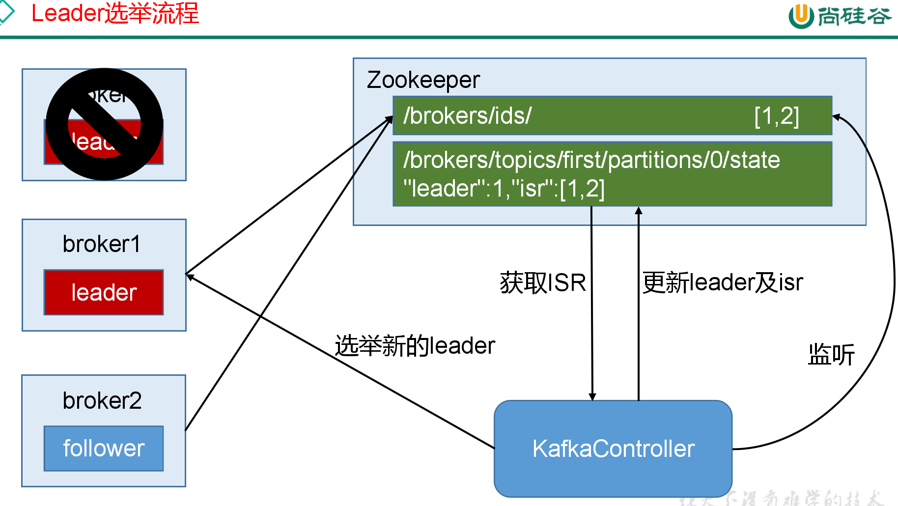

### 3.5 工作流程

Kafka 可以保证单个分区里的消息是有序的，分区可以在线（可用），也可以离线（不可用）。

每个分区的 leader 会维护一个 in-sync replica（同步副本列表，又称 ISR）。
当 producer 往 broker 发送消息，消息先写入到对应 leader 分区上，然后复制到这个分区的所有副本中。
只有将消息成功复制到所有同步副本（ISR）后，这条消息才算被提交。
由于消息复制延迟受到最慢同步副本的限制，因此快速检测慢副本并将其从 ISR 中删除非常重要。

### 3.6 日志复制算法（log replication algorithm）

必须提供的基本保证是，如果它告诉客户端消息已被提交，而当前 leader 出现故障，新选出的 leader 也必须具有该消息。
在出现故障时，Kafka 会从挂掉 leader 的 ISR 里面选择一个 follower 作为这个分区新的 leader ；换句话说，是因为这个 follower 是跟上 leader 写进度的。

有2个指标可以帮助我们找到需要从ISR中剔除的副本

```properties
## follower 落后消息的条数，不能超过这个，否则就会被剔除
replica.lag.max.messages=3
## follower 每隔500毫秒或更早地向 leader 发送一个 fetch 请求，否则就会被剔除
replica.lag.time.max.ms=500 
```

### 3.7 数据刷盘机制

为了让用户设置数据可靠性， Kafka 在 Producer 里面提供了消息确认机制。
也就是说我们可以通过配置来决定消息发送到对应分区的几个副本才算消息发送成功。例如:
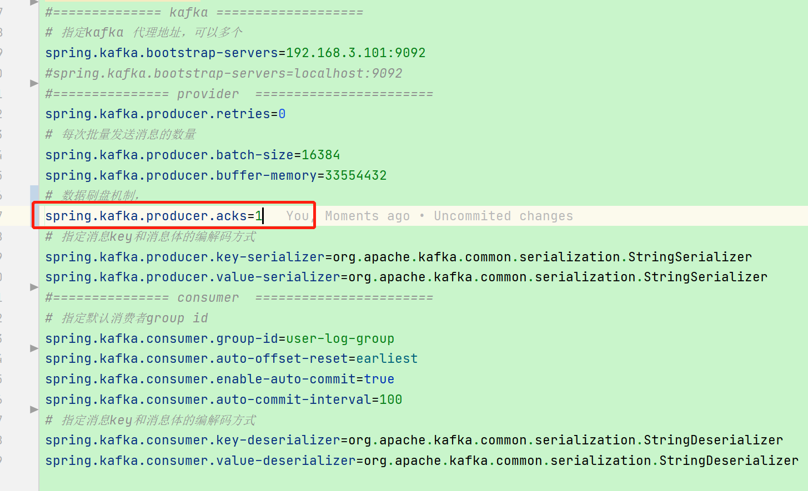

- acks = 0：如果生产者能够通过网络把消息发送出去，那么就认为消息已成功写入 Kafka 。
  在这种情况下还是有可能发生错误，比如发送的对象无能被序列化或者网卡发生故障，但如果是分区离线或整个集群长时间不可用，那就不会收到任何错误。
  在 acks=0 模式下的运行速度是非常快的（这就是为什么很多基准测试都是基于这个模式），你可以得到惊人的吞吐量和带宽利用率，不过如果选择了这种模式， 一定会丢失一些消息。
- acks = 1：Leader 在收到消息并把它写入到分区数据文件（不一定同步到磁盘上）时会返回确认或错误响应。
  在这个模式下，如果正在发生 Leader 选举，生产者会在选举时收到一个 LeaderNotAvailableException 异常，
  如果生产者能恰当地处理这个错误，它会重试发送悄息，最终消息会安全到达新的 Leader 那里。
  不过在这个模式下仍然有可能丢失数据，比如消息已经成功写入 Leader，但在消息被复制到 follower 副本之前 Leader发生崩溃。
- acks = all（这个和 request.required.acks = -1 含义一样）：Leader 在返回确认或错误响应之前，会等待所有同步副本都收到悄息。
  如果和min.insync.replicas 参数结合起来，就可以决定在返回确认前至少有多少个副本能够收到悄息，生产者会一直重试直到消息被成功提交。
  不过这也是最慢的做法，因为生产者在继续发送其他消息之前需要等待所有副本都收到当前的消息。

根据实际的应用场景，我们设置不同的acks，以此保证数据的可靠性。

另外，Producer 发送消息还可以选择同步（默认，通过producer.type=sync配置） 或者异步（producer.type=async）模式。
如果设置成异步，虽然会极大的提高消息发送的性能，但是这样会增加丢失数据的风险。如果需要确保消息的可靠性，必须将producer.type设置为 sync。

### 3.8.消费者分配分区策略

分配前：

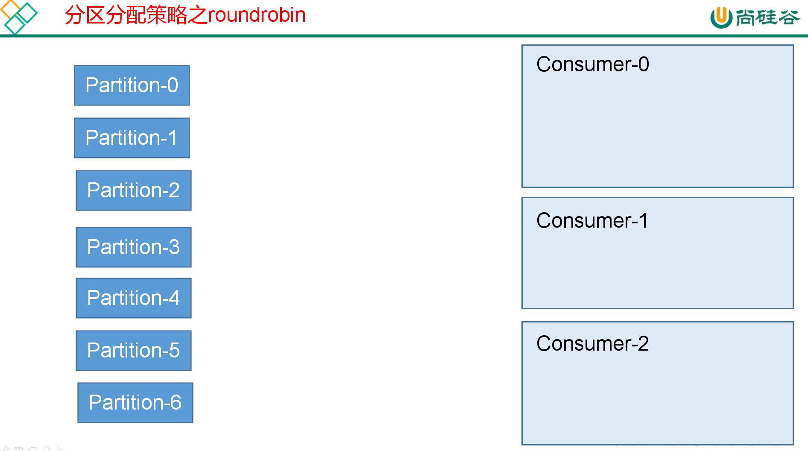

1、roud-robin（轮询方式，默认，分区按照字典序排序，轮询将分区分配给consumer）

- 第1个topic， consumer-0消费partition-0 ， consumer-1消费partition-1 ，， consumer-2消费partition-2， consumer-0消费partition-3， consumer-1消费partition-4， consumer-2消费partition-5， consumer-0消费partition-6
- 第2个topic，会从consumer-1开始，而不是consumer-0  。 不会造成单个consumer消费过多分区的情况

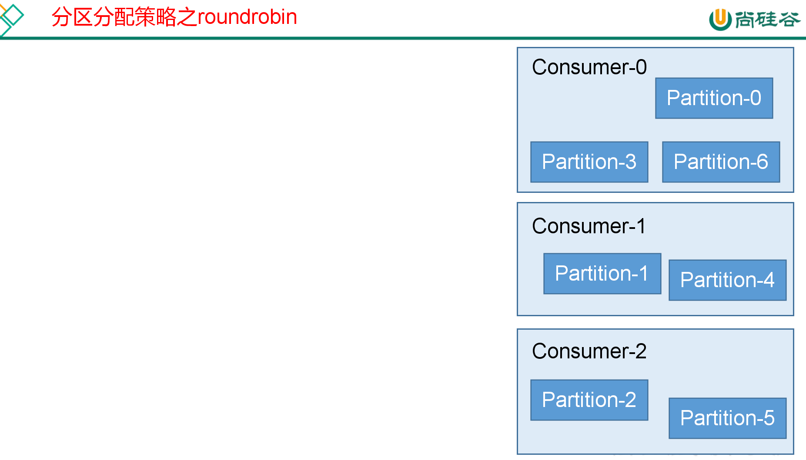

2、range（按照数量平均分配，有缺陷）

首先对线程集合按照字典顺序进行排序 ，然后通过分区总数与消费者线程总数进行整除运算计算每个线程平均分配的分区数 numPartitionsPerConsumer ，
即一个平均跨度，通过分区总数与消费者线程总数取余计算平均之后多余的分区数 consumersWithExtraPartition ，最后遍历线程集合为每个线程分配分区，
从起始分区开始分配，依次为每个线程分配 num PartitionsPerConsumer 分区 ，如 consumersWithExtraPartition 不为 0 ，那么在迭代线程集合时，
若迭代次数小于 consumers WithExtra Partition ，对应的线程就会分配到 num Partitions PerConsumer+1 个分区。

问题：会造成单个consumer消费过多分区的情况！！

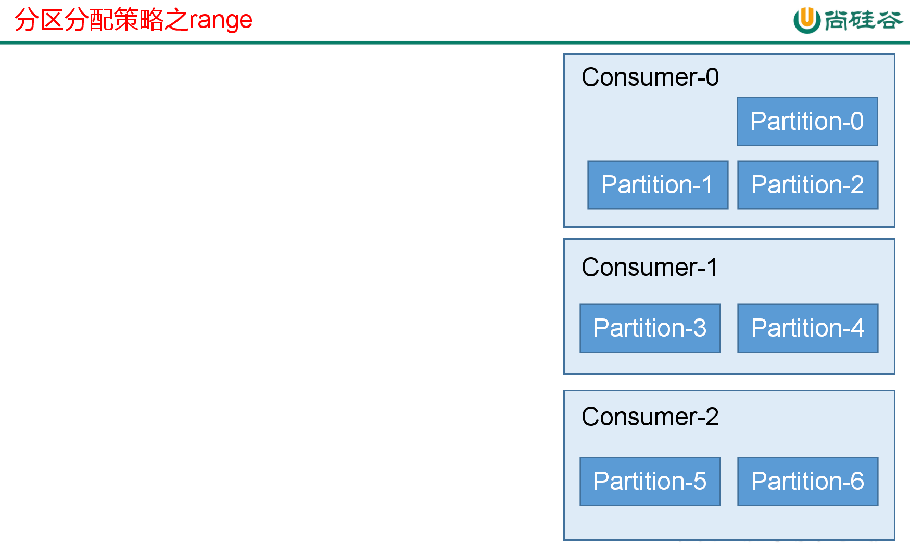

3、sticky

综合上面2种，尽可能做的和上次分配结构一样

## 4.特性

### 4.1.kafka工作流程

Kafka中消息是以topic进行分类的，生产者生产消息，消费者消费消息，都是面向topic的。

topic是逻辑上的概念，而partition是物理上的概念，每个partition对应于一个log文件，该log文件中存储的就是producer生产的数据。
Producer生产的数据会被不断追加到该log文件末端，且每条数据都有自己的offset。
消费者组中的每个消费者，都会实时记录自己消费到了哪个offset，以便出错恢复时，从上次的位置继续消费。

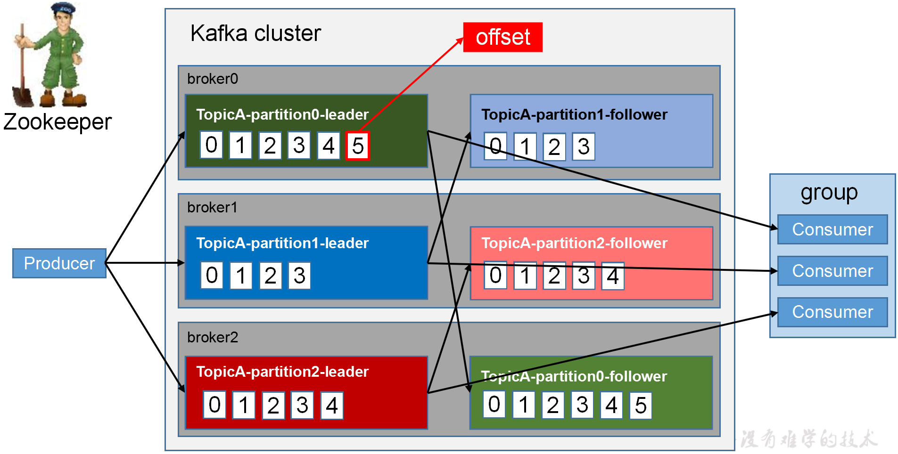

### 4.2.消息消费

#### 4.2.1.消费模式

consumer采用pull（拉）模式从broker中读取数据。
- push（推）模式很难适应消费速率不同的消费者，因为消息发送速率是由broker决定的。
它的目标是尽可能以最快速度传递消息，但是这样很容易造成consumer来不及处理消息，典型的表现就是拒绝服务以及网络拥塞。
而pull模式则可以根据consumer的消费能力以适当的速率消费消息。
- pull模式不足之处是，如果kafka没有数据，消费者可能会陷入循环中，一直返回空数据。针对这一点，Kafka的消费者在消费数据时会传入一个时长参数timeout，
如果当前没有数据可供消费，consumer会等待一段时间之后再返回，这段时长即为timeout。 简单来说就是采用长轮询的方式。

#### 4.2.2.消费的过程

- 生产者往某个Topic发送数据时，数据会被hash到不同的partition,这些partition位于不同的集群节点上，所以每个消息都会被记录一个offset消息号，随着消息的增加逐渐增加，这个offset也会递增，同时，每个消息会有一个编号，就是offset号。
- 消费者读取保证在broker上的消费进度，知道应该消费消息的offset。通过这个offset号去查询读取这个消息，kafka消费者在会保存其消费的进度，也就是offset。（kafka消费者在对应分区上已经消费的消息数）

备注：生产者的偏移量在*.index文件，消费者的偏移量在 __offset_consumer 主题。

#### 4.2.3.offset维护

目的：由于consumer在消费过程中可能会出现断电宕机等故障，consumer恢复后，需要从故障前的位置的继续消费，所以consumer需要实时记录自己消费到了哪个offset，以便故障恢复后继续消费。

方案：Kafka0.9版本之前，consumer默认将offset保存在Zookeeper中，从0.9版本开始，consumer默认将offset保存在Kafka一个内置的topic中，该topic为__consumer_offsets。
每当消费者提交（commit）新的offset时，Kafka会将这个offset记录到__consumer_offsets主题中。

- __consumer_offsets默认50个partition。保存的消息内容如下：
    - group: 消费者组的ID。
    - topic: 消费者所消费的主题。
    - partition: 主题的分区。
    - offset: 消费者当前的offset。
    - metadata: 一些可选的与offset关联的元数据。
- 需要注意的是，__consumer_offsets主题的副本因子（replication factor）应该设置为大于等于3，以确保高可用性和数据的持久性。

#### 4.2.4.消息重试

https://www.infoq.cn/article/51XSHW2opSmakhHmtth8
微信备份：https://mp.weixin.qq.com/s/R6-_N9zhbqbXVuZaJg0OlQ

#### 4.2.5.时间回溯
如果某段时间对已消费消息计算的结果觉得有问题，可能是由于程序bug导致的计算错误，当程序bug修复后，这时可能需要对之前已消费的消息重新消费，可以指定从多久之前的消息回溯消费。
可以用consumer的offsetsForTimes、seek等方法指定从某个offset偏移的消息开始消费，完成消息的回溯消费！

#### 4.2.6.消息传递模型

传统的消息传递模式有2种：队列( queue) 和（publish-subscribe）

- queue模式：多个consumer从服务器中读取数据，消息只会到达一个consumer。
- publish-subscribe模式：消息会被广播给所有的consumer。

为了实现这两种模型，kafka提供了一种consumer的抽象概念：consumer group，因为consumer也需要高可用，是多个节点。
- queue模式：所有的consumer都使用同一个consumer group。
- publish-subscribe模式：所有的consumer都有着自己唯一的consumer group。

#### 4.2.7.顺序消费

一个partition同一个时刻在一个consumer group中只能有一个consumer instance在消费，从而保证消费顺序。

#### 4.2.8.多线程消费

一个partition，只能被一个consumer instance订阅。客户端程序中使用多线程消费，本质上就是创建多个consumer instance。
如果只有一个partition，多线程只有一个线程进行消费，其他线程是空转的，这样就不会提供消费效率。


### 4.4.日志清理策略

https://www.cnblogs.com/angellst/p/9368493.html

broker参数log.cleanup.policy可设置日志清理策略，delete表示日志删除，compact为日志压缩，默认前者


1. 日志删除有多种策略：

- 基于时间：如果日志分段中最大时间戳和当前时间的差值大于设定的保留时间，则分段需要清除。保留时间可以通过配置确定：
> log.retention.ms/minutes/hours三个参数可指定保留时间，ms优先级最高，默认hours = 168，即保留7天

- 基于日志大小：如果分区内**日志文件总大小（非单个日志分段文件大小）**超过阈值，则清理最老的日志分段
> log.retention.bytes设置总大小阈值，默认为-1，表示可以无穷大

- 基于日志起始偏移量：当日志分段的偏移量小于日志起始偏移量logStartOffset时，日志分段被删除
> logStartOffset可以被管理员修改，从而指定删除某些分段


2. 日志压缩

日志压缩针对所有的历史消息，根据key对消息进行合并，保留相同key的最后一条消息。用于将消息进行永久保存。

日志压缩适用于某些场景，必须适用kafka记录某些状态，这种情况不用记录过程，保留最终状态是可行的；
但不是所有场景都适用，比如相同key的消息通过不同的字段划分不同的行为，这时合并消息就不是理想的方案了

### 4.6.日志存储

#### 4.6.0.简述存储机制
由于生产者生产的消息会不断追加到log文件末尾，为防止log文件过大导致数据定位效率低下，Kafka采取了分片和索引机制。
- 每个partition都有一个文件夹，文件夹的命名规则为：topic名称+分区序号，例如：my_toptic-0,my_toptic-1等
- 每个partition分为多个segment。 每个segment对3个文件：index timeindex log。 文件以当前segment的第一条消息的offset命名。


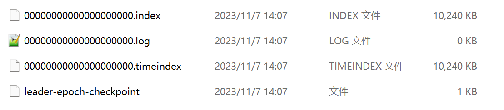

index、timeindex 存储索引信息，log存储消息数据，索引文件中的元数据指向对应数据文件中message的物理偏移地址。


当offset=9时，寻找Segement-1的 9-6=3号位置对应 日志文件 偏移量为 699 的数据。

#### 4.6.1.目录结构
kafka文件的存储目录，log.dirs=/usr/local/var/lib/kafka-logs，内部目录如下：
```text
__consumer_offsets-0             __consumer_offsets-1            __consumer_offsets-2            __consumer_offsets-5
.......
__consumer_offsets-21            __consumer_offsets-35            __consumer_offsets-49
```

- __consumer_offsets-xx文件夹是kafka存储消费者offset的默认主题，暂不深究
- xxx-checkpoint文件统称为其他文件，暂不深究
- my_toptic-x文件夹则是我们测试使用主题my_toptic的日志文件夹了

```text
kafka-logs ls -l my_toptic-0
total 784
-rw-r--r--  1 zhangsan  admin     72 Oct 24 22:15 00000000000000000000.index
-rw-r--r--  1 zhangsan  admin  41805 Oct 24 22:15 00000000000000000000.log
-rw-r--r--  1 zhangsan  admin      0 Oct 24 22:15 00000000000000000000.timeindex

-rw-r--r--  1 zhangsan  admin     80 Oct 24 22:15 00000000000000000536.index
-rw-r--r--  1 zhangsan  admin  41760 Oct 24 22:15 00000000000000000536.log
-rw-r--r--  1 zhangsan  admin      0 Oct 24 22:15 00000000000000000536.timeindex
```

分区内(文件夹)内的日志文件分为多个Segment，且每个LogSegment包含三个主要文件：
- xxx.log: 消息内容主文件，记录消息内容信息
- xxx.index: 偏移量索引文件，记录偏移量到消息位置的映射
- xxx.timeindex: 时间戳索引文件，记录时间戳到偏移量的映射

每个LogSegment都有一个基准偏移量baseOffset, 用来表示当前LogSegment中第一条消息的偏移量，日志文件和两个索引文件都是根据baseOffset命名的， 文件名称固定20位整数，不够用0填充。
以第二个分段00000000000000000536.log为例： 00000000000000000536.log表示当前LogSegment中第一条消息偏移量为536 同时可以推断出第一个分段中的偏移量为0 ~ 535

#### 4.6.2.日志分段的条件

1. 当前日志分段文件的大小超过broker端参数log.segment.bytes配置值，默认1G
2. 当前日志分段文件中消息的最大时间戳和当前系统的时间戳差值大于log.roll.ms或log.roll.hours参数配置（ms优先级更高，同时出现以ms配置值为准），默认配置后者为168，即7天
3. 索引文件大小超过broker端参数log.index.size.max.bytes，默认10M
4. 追加消息的偏移量与当前日志分段的BaseOffset之间差值大于Integer.MAX_VALUE

#### 4.6.3.跳表
对于每个topic.partition目录，我们会创建一个日志对象。日志对象使用了 ConcurrentSkipListMap 来保存各个日志分段，
每个日志分段的 baseOffset 作为 key，这样可以根据指定偏移量来快速定位到消息所在的日志分段。

### 4.7.日志索引
日志索引类型
- 偏移量索引
- 时间戳索引

索引文件建立偏移量(offset)/时间戳(timestamp)到物理地址之间的映射关系，主要是为了快速定位到指定 offset 的消息。
index文件中两个字段的含义（offset,position） 指的是指定 offset 的消息在 log 文件中的物理 position，这里大概每54条消息建立一个索引。

**index使用稀疏索引的方式构造消息索引**，所以索引中不保证每个消息在索引中都有对应物理地址的映射；
索引记录的方式由配置参数log.index.interval.bytes指定，默认4KB。当kafka写入消息大小大于4KB时，
偏移量索引文件和时间戳索引文件分别增加一个索引项，记录此刻偏移量/时间戳与消息物理地址的映射，修改此配置，可以改变索引文件中索引项的密度

#### 4.7.1.偏移量索引

偏移量索引即记录偏移量(offset)到消息物理位置的映射。每个索引项大小为8个字节，分为两部分：

- relative offset: 相对偏移量，即消息的绝对偏移量和基础偏移量BaseOffset的差值，占4B
- position: 物理地址，即消息在日志分段文件中对应的物理地址，占4B

仍然以00000000000000000536.index为例，使用kafka自带命令kafka-dump-log可以解析日志文件：

```shell
./kafka-dump-log.sh --files ../../kafka-logs/my_demo_topic-0/00000000000000000000.index
Dumping ..\..\kafka-logs\my_demo_topic-0\00000000000000000000.index
offset: 33 position: 16346
offset: 49 position: 32551
offset: 65 position: 48756
offset: 81 position: 64961
offset: 97 position: 81166
offset: 113 position: 97371
offset: 129 position: 113576
```

#### 4.7.2.时间戳索引

时间戳索引记录时间戳(timestamp)到相对偏移量(relativeOffset)之间的映射。每个索引项大小为12个字节，包含两个部分：
- 时间戳timestamp: 当前日志分段最大的时间戳，指新增时间戳索引项的那个时刻，日志分段中最大的时间戳(相当于那个时刻的快照数据)，大小为8个字节
- 相对偏移量relativeOffset: 该时间戳对应的相对偏移量

使用场景：通过时间戳，实现消息回溯。

```shell
./kafka-dump-log.sh --files ../../kafka-logs/my_demo_topic-0/00000000000000000000.timeindex
Dumping ..\..\kafka-logs\my_demo_topic-0\00000000000000000000.timeindex
timestamp: 1699338057326 offset: 3
timestamp: 1699338057337 offset: 80
timestamp: 1699338057342 offset: 113
timestamp: 1699338057344 offset: 130
timestamp: 1699338057345 offset: 147
```

#### 4.7.3.索引查找方式

消费者在拉取数据时，会根据broker上保存的消费进度，确定当前应该消费的位置。这里使用的是 偏移量索引。 假设我们现在需要查找 partition = 0, offset = 745 的消息，其过程如下：
1. 确定分段。先从跳表中确定，offset=745 所在的分段(00000000000000000536)。
2. 确定offset的索引项。使用二分查找（通过分段文件的名称-开始位置，下一个文件的名称-结束位置，没有的话，就是当前写入的LEO高水位）
   因为每行索引的大小都是固定的，所有很容易找到 offset = 745在744 - 796之间。
3. 确定消息位置。在日志文件中，从offset:744 position: 16640开始顺序查找，知道找到offset = 745的消息

#### 4.7.4.日志结构

kafka-dump-log.sh 就是封装了kafka-run-class.sh kafka.tools.DumpLogSegments。

```shell
./kafka-run-class.sh kafka.tools.DumpLogSegments --files ../../kafka-logs/my_demo_topic-0/00000000000000000000.log --print-data-log 

Dumping ..\..\kafka-logs\my_demo_topic-0\00000000000000000000.log
Starting offset: 0
baseOffset: 0 lastOffset: 0 count: 1 baseSequence: -1 lastSequence: -1 producerId: -1 producerEpoch: -1 partitionLeaderEpoch: 0 isTransactional: false isControl: false position: 0 CreateTime: 1699337329146 size: 72 magic: 2 compresscodec: NONE crc: 2035750657 isvalid: true
| offset: 0 CreateTime: 1699337329146 keysize: -1 valuesize: 4 sequence: -1 headerKeys: [] payload: msg1
baseOffset: 1 lastOffset: 1 count: 1 baseSequence: -1 lastSequence: -1 producerId: -1 producerEpoch: -1 partitionLeaderEpoch: 0 isTransactional: false isControl: false position: 72 CreateTime: 1699337386007 size: 69 magic: 2 compresscodec: NONE crc: 2109983962 isvalid: true
| offset: 1 CreateTime: 1699337386007 keysize: -1 valuesize: 1 sequence: -1 headerKeys: [] payload: 2
baseOffset: 2 lastOffset: 17 count: 16 baseSequence: -1 lastSequence: -1 producerId: -1 producerEpoch: -1 partitionLeaderEpoch: 0 isTransactional: false isControl: false position: 141 CreateTime: 1699338057326 size: 16205 magic: 2 compresscodec: NONE crc: 958784937 isvalid: true
| offset: 2 CreateTime: 1699338057311 keysize: -1 valuesize: 1000 sequence: -1 headerKeys: [] payload: SSXVNJHPDQDXVCRASTVYBCWVMGNYKRXVZXKGXTSPSJDGYLUEGQFLAQLOCFLJBEPOWFNSOMYARHAOPUFOJHHDXEHXJBHWGSMZJGNLONJVXZXZOZITKXJBOZWDJMCBOSYQQKCPRRDCZWMRLFXBLGQPRPGRNTAQOOSVXPKJPJLAVSQCCRXFRROLLHWHOHFGCFWPNDLMWCSSHWXQQYKALAAWCMXYLMZALGDESKKTEESEMPRHROVKUMPSXHELIDQEOOHOIHEGJOAZBVPUMCHSHGXZYXXQRUICRIJGQEBBWAXABQRIRUGZJUUVFYQOVCDEDXYFPRLGSGZXSNIAVODTJKSQWHNWVPSAMZKOUDTWHIORJSCZIQYPCZMBYWKDIKOKYNGWPXZWMKRDCMBXKFUILWDHBFXRFAOPRUGDFLPDLHXXCXCUPLWGDPPHEMJGMTVMFQQFVCUPOFYWLDUEBICKPZKHKVMCJVWVKTXBKAPWAPENUEZNWNWDCACDRLPIPHJQQKMOFDQSPKKNURFBORJLBPCBIWTSJNPRBNITTKJYWAHWGKZYNUSFISPIYPIOGAUPZDXHCFVGXGIVVCPFHIXAACZXZLFDMOOSSNTKUPJQEIRRQAMUCTBLBSVPDDYOIHAOODZNJTVHDCIEGTAVMYZOCIVSKUNSMXEKBEWNZPRPWPUJABJXNQBOXSHOEGMJSNBUTGTIFVEQPSYBDXEXORPQDDODZGBELOISTRWXMEYWVVHGMJKWLJCCHPKAFRASZEYQZCVLFSLOWTLBMPPWPPFPQSAZPTULSTCDMODYKZGSRFQTRFTGCNMNXQQIYVUQZHVNIPHZWVBSGOBYIFDNNXUTBBQUYNXOZCSICGRTZSSRHROJRGBHMHEQJRDLOQBEPTOBMYLMIGPPDPOLTEUVDGATCGYPQOGOYYESKEGBLOCBIYSLQEYGCCIPBXPNSPKDYTBEWDHBHWVDPLOVHJPNYGJUHKKHDASNFGZDAIWWQEPPBRJK
| offset: 3 CreateTime: 1699338057326 keysize: -1 valuesize: 1000 sequence: -1 headerKeys: [] payload: SSXVNJHPDQDXVCRASTVYBCWVMGNYKRXVZXKGXTSPSJDGYLUEGQFLAQLOCFLJBEPOWFNSOMYARHAOPUFOJHHDXEHXJBHWGSMZJGNLONJVXZXZOZITKXJBOZWDJMCBOSYQQKCPRRDCZWMRLFXBLGQPRPGRNTAQOOSVXPKJPJLAVSQCCRXFRROLLHWHOHFGCFWPNDLMWCSSHWXQQYKALAAWCMXYLMZALGDESKKTEESEMPRHROVKUMPSXHELIDQEOOHOIHEGJOAZBVPUMCHSHGXZYXXQRUICRIJGQEBBWAXABQRIRUGZJUUVFYQOVCDEDXYFPRLGSGZXSNIAVODTJKSQWHNWVPSAMZKOUDTWHIORJSCZIQYPCZMBYWKDIKOKYNGWPXZWMKRDCMBXKFUILWDHBFXRFAOPRUGDFLPDLHXXCXCUPLWGDPPHEMJGMTVMFQQFVCUPOFYWLDUEBICKPZKHKVMCJVWVKTXBKAPWAPENUEZNWNWDCACDRLPIPHJQQKMOFDQSPKKNURFBORJLBPCBIWTSJNPRBNITTKJYWAHWGKZYNUSFISPIYPIOGAUPZDXHCFVGXGIVVCPFHIXAACZXZLFDMOOSSNTKUPJQEIRRQAMUCTBLBSVPDDYOIHAOODZNJTVHDCIEGTAVMYZOCIVSKUNSMXEKBEWNZPRPWPUJABJXNQBOXSHOEGMJSNBUTGTIFVEQPSYBDXEXORPQDDODZGBELOISTRWXMEYWVVHGMJKWLJCCHPKAFRASZEYQZCVLFSLOWTLBMPPWPPFPQSAZPTULSTCDMODYKZGSRFQTRFTGCNMNXQQIYVUQZHVNIPHZWVBSGOBYIFDNNXUTBBQUYNXOZCSICGRTZSSRHROJRGBHMHEQJRDLOQBEPTOBMYLMIGPPDPOLTEUVDGATCGYPQOGOYYESKEGBLOCBIYSLQEYGCCIPBXPNSPKDYTBEWDHBHWVDPLOVHJPNYGJUHKKHDASNFGZDAIWWQEPPBRJK

baseOffset：当前batch中第一条消息的位移。
lastOffset：最新消息的位移相对于第一条消息的唯一增量。
count：当前batch有的数据数量，kafka在进行消息遍历的时候，可以通过该字段快速的跳跃到下一个batch进行数据读取。
partitionLeaderEpoch：记录了当前消息所在分区的 leader 的服务器版本，主要用于进行一些数据版本的校验和转换工作。
crc：当前整个batch的数据crc校验码，主要用于对数据进行差错校验的。
compresscode：数据压缩格式，主要有GZIP、LZ4、Snappy三种。
Sequence、producerId、producerEpoch：这三个参数主要是为了实现事务和幂等性而使用的，其中producerId和producerEpoch用于确定当前 producer 是否合法，而起始序列号则主要用于进行消息的幂等校验。
isTransactional：是否开启事务。
magic：Kafka服务程序协议版本号。
CreateTime：数据创建的时间戳。
payload：实际存储的数据。
最后2行，payload 后面是固定字符，长度1000，表示没有数据，作用是预分配磁盘空间，提高读写效率。
```

### 4.8.zookeeper的作用/Kafka Controller的作用

1. Kafka集群中有一个broker会被选举为Controller，负责管理集群broker的上下线。（Controller的管理工作都是依赖于Zookeeper的)
2. 所有topic的分区副本分配和leader选举（ISR）等工作。

简单说明：Controller复制管理的逻辑处理，zk负责数据存储

### 4.9.拦截器

Producer拦截器(interceptor)是在Kafka 0.10版本被引入的，主要用于实现clients端的定制化控制逻辑。

### 4.10.客户端原理
Kafka生产者客户端的整体结构是什么样子的？使用了几个线程来处理？分别是什么？

Kafka的Producer发送消息采用的是异步发送的方式。在消息发送的过程中，涉及到了两个线程——main线程和Sender线程，以及一个线程共享变量——RecordAccumulator。
main线程将消息发送给RecordAccumulator，Sender线程不断从RecordAccumulator中拉取消息发送到Kafka broker。

ProducerRecord 消息封装对象，main线程是单条消息发送至 RecordAccumulator , sender 线程批量拉取消息至 topic。

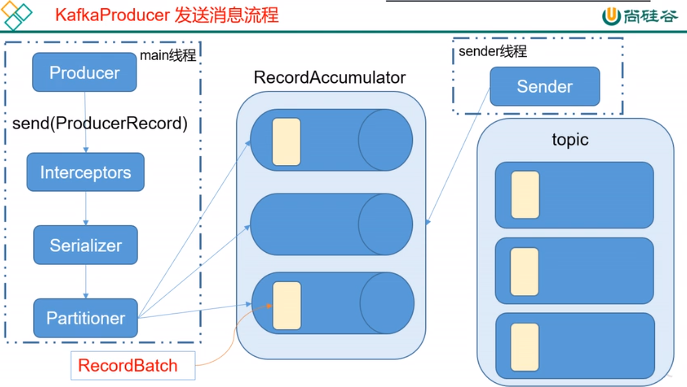

## 5.最佳实践

### 5.1.性能测试

- [Kafka性能基准测试](https://blog.csdn.net/weixin_42641909/article/details/89320999)
- [Kafka机器数量计算、性能评估、压力测试](https://blog.csdn.net/qq_22473611/article/details/113063238)
- [Kafka消息迁移工具的压测与调优](https://segmentfault.com/a/1190000042008882)

kafka自带性能测试工具：
- kafka-producer-perf-test.sh (生产端)
- kafka-consumer-perf-test.sh (消费端)

性能测试参数控制：
- 生产者：topic的分区数、分区副本数。会影响生产端吞吐量的参数：batch.size\longer.ms\acks\,这些参数都可以在--producer-props参数后。
- 消费者:topic的分区数、分区副本数。会影响消费端吞吐量的参数：--fetch-size--threads
- 其他参数还有：压缩格式、网络带宽。

```shell
./bin/kafka-producer-perf-test.sh --topic test_perf --num-records 1000000 --record-size 15000 --throughput -1 
    --producer-props bootstrap.servers=10.xx.xx.1:9094,10.xx.xx.2:9094 acks=1

--acks 消息确认模式，-1 表示需要确认所有副本都写入成功，1 表示只需确认一个副本写入成功，0 表示无需确认。
--topic topic 名称，本例为 test_perf
--num-records 总共需要发送的消息数，本例为 1000000
--record-size 每个记录的字节数，本例为 15000
--throughput 每秒钟发送的记录数，本例为 -1，表示不做限制
--producer-props bootstrap.servers=localhost:9092 发送端的配置信息，本例只指定了 kafka 的链接信息
--producer-num-retries 一个消息失败发送重试次数
--request-timeouts-ms 一个消息请求发送超时时间
```

### 5.2.资源评估

[Kafka的分区是不是越多越好](https://blog.csdn.net/weixin_42641909/article/details/89294698)
- 分区数量：T/min(Tp,Tc)。假设目标吞吐量为T，经过性能测试producer和consumer吞吐量分别是Tp和Tc。
    - 理论计算：producer吞吐量 = 20m/s；consumer吞吐量 = 50m/s，期望吞吐量100m/s；分区数 = 100 / 20 = 5分区
    - 架构计算：假设consumer 3个，分区数最好是3的倍数，可以确保性能均衡。
    - 通常分区数量保持在3~10个即可。
- broker数量：2 *（峰值生产速度 * 副本数 / 100）+ 1。峰值生产速度通过压测获得；副本数默认1，设置3个最佳。
    - 理论计算：峰值生产速度是50M/s。副本数为2。broker数量= 2 *（50 * 2 / 100）+ 1 = 3台
    - 通常搭建3节点的集群即可满足需求，集群规模太大，会影响整体响应速度，问题恢复速度。

### 5.3.消费提交
1. 只有当找不到任何消费的offset且消费策略是earliest的时候，才会从最开始的地方消费。找不到任何消费的offset的两种情况：
    - 使用了全新的消费者组。
    - 数据消费发生在7天前，已经清除了数据。
2. 一个消费者组可以订阅多个不同的topic，但为了防止数据混乱，生产开发强制一个消费者组只能订阅一个topic。
3. offset自动提交，就是每隔一段时间自动将内存中的offset保存到名为“__consumer_offsets”的topic中。
    - 消费者只有在刚启动时才会去获得topic的offset，其他时刻直接通过内存中的offset读取数据。
    - 消费者批量拉取数据之后进行消费，然后再拉取下一批数据，如果没有消费完就自动提交了offset，此时应用宕机重启，就丢数据了。
    如果消费完了没有自动提交offset，应用交宕机重启后就会重复消费。
    - 所以自动提交时提交的时间间隔就很重要了。可是开发人员又很难把握这个时间间隔到底设置为多少。所以开发人员一般手动提交offset。
4. offset手动提交，其实就是在消费完成后或者消费开始前手动调用提交offset的方法将内存中的offset保存到名为“__consumer_offsets”的topic。
    - 手动提交分为同步提交和异步提交。同步提交会阻塞当前线程不断重试直到提交成功。异步提交不会重试提交，效率更高。
    - 如果先消费然后手动提交offset未完成, 应用宕机重启可能会造成重复消费；如果先手动提交offset然后消费未完成,宕机重启可能会造成数据丢失。
    - 所以自动提交和手动提交都不靠谱，kafka提供了第三种提交offset的方式：即自定义存储offset。
5. 自定义存储offset时需要考虑到消费者组rebalance后带来的消费者消费数据offset变化的问题。

### 5.4.消费者参数设置
- bootstrap.servers: broker集群地址，格式：ip1:port,ip2:port，不需要设定全部的集群地址，设置两个或者两个以上即可。
- group.id: 消费者隶属的消费者组名称，如果为空会报异常，一般而言，这个参数要有一定的业务意义。
- fetch.min.bytes: 该参数用来配置 Consumer 在一次拉取请求（调用 poll() 方法）中能从 Kafka 中拉取的最小数据量，默认值为1（B）。
    Kafka 在收到 Consumer 的拉取请求时，如果返回给 Consumer 的数据量小于这个参数所配置的值，那么它就需要进行等待，直到数据量满足这个参数的配置大小。
    可以适当调大这个参数的值以提高一定的吞吐量，不过也会造成额外的延迟（latency），对于延迟敏感的应用可能就不可取了。
- fetch.max.bytes ：该参数与 fetch.min.bytes 参数对应，它用来配置 Consumer 在一次拉取请求中从Kafka中拉取的最大数据量，默认值为52428800（B），也就是50MB。
  如果这个参数设置的值比任何一条写入 Kafka 中的消息要小，那么会不会造成无法消费呢？该参数设定的不是绝对的最大值，如果在第一个非空分区中拉取的第一条消息大于该值，那么该消息将仍然返回，
  以确保消费者继续工作。Kafka 中所能接收的最大消息的大小通过服务端参数 message.max.bytes（对应于主题端参数 max.message.bytes）来设置。
- fetch.max.wait.ms ：这个参数也和 fetch.min.bytes 参数有关，如果 Kafka 仅仅参考 fetch.min.bytes 参数的要求，那么有可能会一直阻塞等待而无法发送响应给 Consumer，
  显然这是不合理的。fetch.max.wait.ms 参数用于指定 Kafka 的等待时间，默认值为500（ms）。如果 Kafka 中没有足够多的消息而满足不了 fetch.min.bytes 参数的要求，那么最终会等待500ms。
  这个参数的设定和 Consumer 与 Kafka 之间的延迟也有关系，如果业务应用对延迟敏感，那么可以适当调小这个参数。
- max.partition.fetch.bytes ：这个参数用来配置从每个分区里返回给 Consumer 的最大数据量，默认值为1048576（B），即1MB。这个参数与 fetch.max.bytes 参数相似，
  只不过前者用来限制一次拉取中每个分区的消息大小，而后者用来限制一次拉取中整体消息的大小。同样，如果这个参数设定的值比消息的大小要小，那么也不会造成无法消费，Kafka 为了保持消费逻辑的正常运转不会对此做强硬的限制。
- max.poll.records ：这个参数用来配置 Consumer 在一次拉取请求中拉取的最大消息数，默认值为500（条）。如果消息的大小都比较小，则可以适当调大这个参数值来提升一定的消费速度。
- connections.max.idle.ms：这个参数用来指定在多久之后关闭闲置的连接，默认值是540000（ms），即9分钟。
- exclude.internal.topics：Kafka 中有两个内部的主题： __consumer_offsets 和 __transaction_state。
    exclude.internal.topics 用来指定 Kafka 中的内部主题是否可以向消费者公开，默认值为 true。
    如果设置为 true，那么只能使用 subscribe(Collection)的方式而不能使用 subscribe(Pattern)的方式来订阅内部主题，设置为 false 则没有这个限制。
- receive.buffer.bytes：这个参数用来设置 Socket 接收消息缓冲区（SO_RECBUF）的大小，默认值为65536（B），即64KB。
    如果设置为-1，则使用操作系统的默认值。如果 Consumer 与 Kafka 处于不同的机房，则可以适当调大这个参数值。
- send.buffer.bytes：这个参数用来设置Socket发送消息缓冲区（SO_SNDBUF）的大小，默认值为131072（B），即128KB。与receive.buffer.bytes参数一样，如果设置为-1，则使用操作系统的默认值。
- request.timeout.ms：这个参数用来配置 Consumer 等待请求响应的最长时间，默认值为30000（ms）。
- metadata.max.age.ms：这个参数用来配置元数据的过期时间，默认值为300000（ms），即5分钟。如果元数据在此参数所限定的时间范围内没有进行更新，则会被强制更新，即使没有任何分区变化或有新的 broker 加入
- reconnect.backoff.ms：这个参数用来配置尝试重新连接指定主机之前的等待时间（也称为退避时间），避免频繁地连接主机，默认值为50（ms）。这种机制适用于消费者向 broker 发送的所有请求。
- auto.offset.reset：参数值为字符串类型，有效值为“earliest”“latest”“none”，配置为其余值会报出异常
- enable.auto.commit：boolean 类型，配置是否开启自动提交消费位移的功能，默认开启
- auto.commit.interval.ms：当enbale.auto.commit参数设置为 true 时才生效，表示开启自动提交消费位移功能时自动提交消费位移的时间间隔
- partition.assignment.strategy：消费者的分区分配策略
- interceptor.class：用来配置消费者客户端的拦截器

### 5.5.腾讯云最佳实践

学习最佳实践的好地方（腾讯云文档）： https://cloud.tencent.com/document/product/597

生产消费最佳实践： https://cloud.tencent.com/document/product/597/55481

### 5.6.kafka热备机制

一般情况的 Kafka 集群，都是在同一个 IDC 中的，跨 IDC 的热备在 Kafka 的使用场景叫做 Mirror，Kafka 内置的支持为 MirrorMaker，现在已经进化到了第二版

[KIP-382: MirrorMaker 2.0](https://cwiki.apache.org/confluence/display/KAFKA/KIP-382%3A+MirrorMaker+2.0)

跨IDC存在网络延迟，降低延迟的优化项（提高线路的传输速率）
- 需要提高带宽上线
- 优化服务器TCP高并发配置（参考[网络&通讯协议](article/4.网络&通讯协议/2.网络协议.html#3511高并发tcp设置)）
  ，还需要考虑丢包率，滑动窗口增加，在增加发送速率的同时，也增加了丢包重传的成本
- 优化消息。进行压缩和消息裁剪

### 5.7.架构规范

- kafka规范: 机器名规范，副本数量，过期时间，过期大小，允许最多的kafka数量，topic命名规范
- kafka监控: 可视化界面kafka运维，监控短信报警（服务停掉、磁盘空间、网络使用率、宕机等）, kafa服务梳理 。
- kafka运维: kafka集群部署（目录、版本、日历目录、多磁盘）、kafka集群扩容等等

## 6 常见面试题
<p style="color: red">问题：什么情况下会导致一个副本与 leader 失去同步</p>
一个副本与 leader 失去同步的原因有很多，主要包括：

- 慢副本（Slow replica）：follower replica 在一段时间内一直无法赶上 leader 的写进度。造成这种情况的最常见原因之一是 follower replica 上的 I/O瓶颈，导致它持久化日志的时间比它从 leader 消费消息的时间要长；
- 卡住副本（Stuck replica）：follower replica 在很长一段时间内停止从 leader 获取消息。这可能是以为 GC 停顿，或者副本出现故障；
- 刚启动副本（Bootstrapping replica）：当用户给某个主题增加副本因子时，新的 follower replicas 是不同步的，直到它跟上 leader 的日志。
  当副本落后于 leader 分区时，这个副本被认为是不同步或滞后的。在 Kafka 0.8.2 中，副本的滞后于 leader 是根据replica.lag.max.messages或replica.lag.time.max.ms来衡量的； 前者用于检测慢副本（Slow replica），而后者用于检测卡住副本（Stuck replica）。

<p style="color: red">问题：如何确认某个副本处于滞后状态</p>

- 通过replica.lag.time.max.ms来检测卡住副本（Stuck replica）在所有情况下都能很好地工作。
  它跟踪 follower 副本没有向 leader 发送获取请求的时间，通过这个可以推断 follower 是否正常。
- 另一方面，使用消息数量检测不同步慢副本（Slow replica）的模型只有在为单个主题或具有同类流量模式的多个主题设置这些参数时才能很好地工作，
  但我们发现它不能扩展到生产集群中所有主题

<p style="color: red">问题：如何设置replica.lag.max.messages</p>

leader 收到的单个批次通常永远不会超过3条消息，那么我们知道这个主题的replica.lag.max.messages参数可以设置为 4。
为什么？ 因为我们以最大速度往 leader 写数据并且在 follower 副本复制这些消息之前，follower 的日志落后于 leader 不超过3条消息。同时，如果主题 foo 的 follower 副本始终落后于 leader 超过3条消息，则我们希望 leader 删除慢速 follower 副本以防止消息写入延迟增加。
这本质上是replica.lag.max.messages的目标 - 能够检测始终与 leader 不同步的副本。假设现在这个主题的流量由于峰值而增加，生产者最终往 foo 发送了一批包含4条消息，等于replica.lag.max.messages = 4的配置值。此时，两个 follower 副本将被视为与 leader 不同步，并被移除 ISR。

但是，由于两个 follower 副本都处于活动状态，因此它们将在下一个 fetch 请求中赶上 leader 的日志结束偏移量并被添加回 ISR。如果生产者继续向 leader 发送大量的消息，则将重复上述相同的过程。这证明了 follower 副本进出 ISR 时触发不必要的错误警报的情况。

<p style="color: red">问题：一个参数搞定一切</p>

我们意识到，检测卡住或慢速副本真正重要的事情，是副本与 leader 不同步的时间。我们删除了通过猜测来设置的replica.lag.max.messages参数。现在，我们只需要在服务器上配置replica.lag.time.max.ms参数即可；这个参数的含义为副本与 leader 不同步的时间。
检测卡住副本（Stuck replica）的方式与以前相同- 如果副本未能在replica.lag.time.max.ms时间内发送 fetch 请求，则会将其视为已死的副本并从 ISR 中删除；
检测慢副本的机制已经改变- 如果副本落后于 leader 的时间超过replica.lag.time.max.ms，则认为它太慢并且从 ISR 中删除。
因此，即使在峰值流量下，生产者往 leader 发送大量的消息，除非副本始终和 leader 保持replica.lag.time.max.ms时间的落后，否则它不会随机进出 ISR。

<p style="color: red">问题：如何保证数据不丢失？</p>

https://blog.csdn.net/qq_42616974/article/details/108490518

只能一点点提升一致性，不能100%保障数据一致，而且性能会逐步降低，需要取舍。

- producer 
  - cks=all（或者 request.required.acks=-1），同时发送模式为同步 producer.type=sync
  - 设置失败重试。设置重试次数 retries，以及重试时间间隔retry.backoff.ms。如果达到重试上限后，需要自己开发怎么处理。
- broker。该场景丢失数据主要是在leader挂了导致
  - topic级别，可以针对不同的topic设置不同的副本数量。设置副本数量 replication.factor>=3 
  - min.insync.replicas>=2；分区ISR队列集合中最少有多少个副本，默认值是1，这个值一般设置n/2+1
  - 关闭不完全的leader选举。改参数表示新的leader只能从isr中选举出来，isr之外的副本不行，即 unclean.leader.election.enable=false；
- consumer
  - 关闭自动提交，进行手动提交。 enabel.auto.commit=flase。默认自动提交是5秒钟提交一次。如果消费一批数据时部分失败了，整批数据全部重新消费一次。
  - 设置失败重试。如果达到重试上限后，需要自己开发怎么处理。

<p style="color: red">问题：如何保证数据一致性？</p>

这里介绍的数据一致性主要是说不论是老的 Leader 还是新选举的 Leader，Consumer 都能读到一样的数据。那么 Kafka 是如何实现的呢？

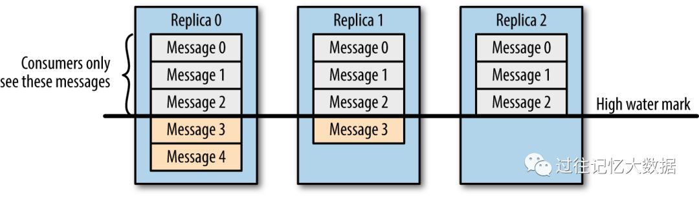

- 现象。假设分区的副本为3，其中副本0是 Leader，副本1和副本2是 follower，并且在 ISR 列表里面。虽然副本0已经写入了 Message4，但是 Consumer 只能读取到 Message2。

- 原因。因为所有的 ISR 都同步了 Message2，只有 High Water Mark 以上的消息才支持 Consumer 读取，
  而 High Water Mark 取决于 ISR 列表里面偏移量最小的分区，对应于上图的副本2，这个很类似于木桶原理。

- 原理。这样做的原因是还没有被足够多副本复制的消息被认为是“不安全”的，如果 Leader 发生崩溃，另一个副本成为新 Leader，那么这些消息很可能丢失了。
  如果我们允许消费者读取这些消息，可能就会破坏一致性。试想，一个消费者从当前 Leader（副本0） 读取并处理了 Message4，这个时候 Leader 挂掉了，
  选举了副本1为新的 Leader，这时候另一个消费者再去从新的 Leader 读取消息，发现这个消息其实并不存在，这就导致了数据不一致性问题。

当然，引入了 High Water Mark 机制，会导致 Broker 间的消息复制因为某些原因变慢，那么消息到达消费者的时间也会随之变长（因为我们会先等待消息复制完毕）。
延迟时间可以通过参数replica.lag.time.max.ms参数配置，它指定了副本在复制消息时可被允许的最大延迟时间。

<p style="color: red">问题：kafka工作流程</p>

Kafka中消息是以topic进行分类的，生产者生产消息，消费者消费消息，都是面向topic的。<br/>
topic是逻辑上的概念，而partition是物理上的概念，每个partition对应于一个log文件，该log文件中存储的就是producer生产的数据。<br/>
Producer生产的数据会被不断追加到该log文件末端，且每条数据都有自己的offset。<br/>
消费者组中的每个消费者，都会实时记录自己消费到了哪个offset，以便出错恢复时，知道从什么位置继续消费。


<p style="color: red">问题：kafka文件存储机制</p>

由于生产者生产的消息会不断追加到log文件末尾，为防止log文件过大导致数据定位效率低下，Kafka采取了分片和索引机制，将每个partition分为多个segment。<br/>
每个segment对应两个文件——“.index”文件和“.log”文件。这些文件位于一个文件夹下，该文件夹的命名规则为：topic名称+分区序号。<br>
例如，first这个topic有三个分区，则其对应的文件夹为first-0,first-1,first-2。<br>
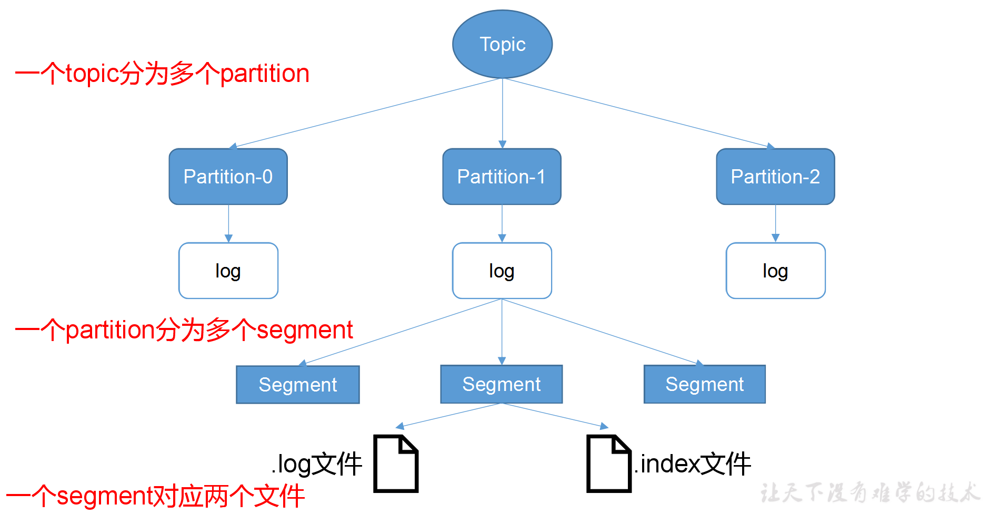

index和log文件以当前segment的第一条消息的offset命名。
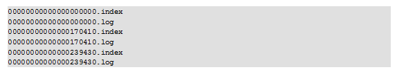

“.index”文件存储大量的索引信息，“.log”文件存储大量的数据，索引文件中的元数据指向对应数据文件中message的物理偏移地址。

当offset=9时，寻找Segement-1的 9-6=3号位置对应 日志文件 偏移量为 699 的数据。


<p style="color: red">问题： kafka分区原因&分区策略</p>

分区原因：  
1. 方便在集群中扩展，每个Partition可以通过调整以适应它所在的机器，而一个topic又可以有多个Partition组成，因此整个集群就可以适应任意大小的数据了
2. 可以提高并发，因为可以以Partition为单位读写了。

生产者的分区策略：   
分区策略是决定生产者将消息发送到哪个分区的算法。Kafka 为我们提供了默认的分区策略，同时它也支持你自定义分区策略。 常见的分区策略有：    
1. 轮询 ：默认的分区策略。在不自己指定到哪个分区的时候，进行轮询投放消息
2. 随机： 在不自己指定到哪个分区的时候，进行随机投放消息，效果比轮询稍差写
3. 按照消息键
  - 指定 partition 值，直接将指明的值直接作为 partiton 值；
  - 没有指定 partition 值但有 key 的情况下，将 key 的 hash 值与 topic 的 partition 数进行取余得到 partition 值；
  - 既没有 partition 值又没有 key 值的情况下，第一次调用时随机生成一个整数（后面每次调用在这个整数上自增），将这个值与 topic 可用的 partition 总数取余得到 partition 值，也就是常说的 round-robin 算法。

消费者的分区策略：也就是消费者的Rebalance   

<p style="color: red">分区的优缺点</p>
- 优点如下

kafka使用分而治之的思想，使用分区将topic的消息打散到多个分区分布保存在不同的broker上，实现了producer和consumer消息处理的高吞吐量。
Kafka的producer和consumer都可以多线程地并行操作，但是每个线程只能处理一个分区的数据。因此分区实际上是调优Kafka并行度的最小单元。
对于producer而言，它实际上是用多个线程并发地向不同分区所在的broker发起Socket连接同时给这些分区发送消息；而consumer，同一个消费组内的所有consumer线程都被指定topic的某一个分区进行消费。
所以说，如果一个topic分区越多，理论上整个集群所能达到的吞吐量就越大。

- 缺点如下

每个分区都有自己的资源开销。broker维护分区需要的资源就越多。   
1. 客户端/服务器端需要使用的内存就越多。他们都保存了分区缓存
2. 日志文件增加，每个分区在底层文件系统都有属于自己的一个目录。该目录下通常会有两个文件： base_offset.log和base_offset.index
3. 降低高可用性。因为分区都有副本，当leader所在的broker挂掉了，contorller会检测到然后在zookeeper的帮助下重选出新的leader，选举期间服务不可用，分区越多选举的时候越大。

<p style="color: red">问题： kafka数据丢失案例</p>

acks=0的是一定会出现数据丢失的，可能写leader都失败了，就不要说 follower 的状态了<br>
acks-1，存在leader写成功，但是后面的follower同步前，leader出问题了

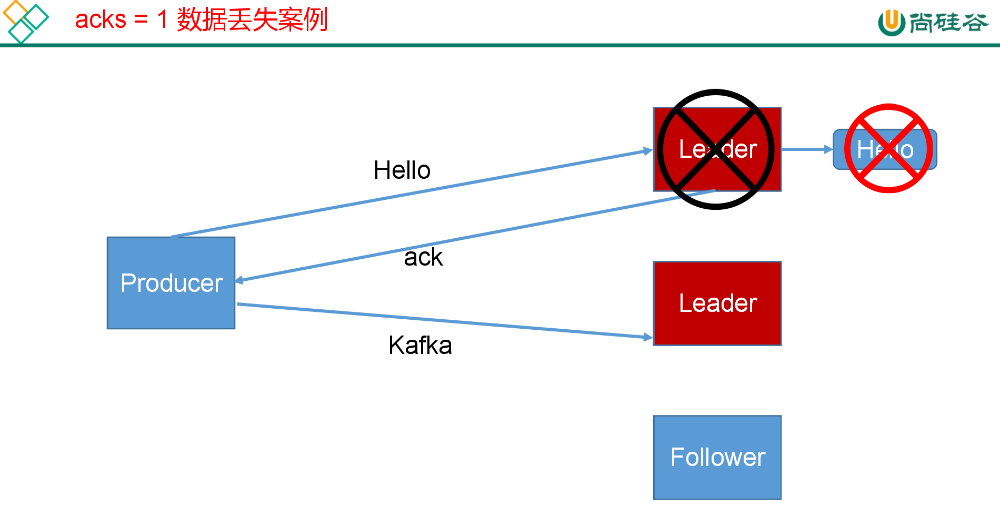

<p style="color: red">问题：幂等性 </p>

为了实现Producer的幂等性，Kafka引入了Producer ID（即PID）和Sequence Number。
- PID。每个新的Producer在初始化的时候会被分配一个唯一的PID，这个PID对用户是不可见的。
- Sequence Numbler。（对于每个PID，该Producer发送数据的每个<Topic, Partition>都对应一个从0开始单调递增的Sequence Number。

Broker端在缓存中保存了这seq number，对于接收的每条消息，如果其序号比Broker缓存中序号大于1则接受它，否则将其丢弃。这样就可以实现了消息重复提交了。
但是，只能保证单个Producer对于同一个<Topic, Partition>的Exactly Once语义。不能保证同一个Producer一个topic不同的partion幂等。

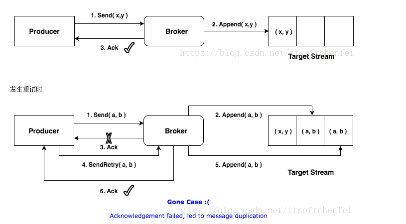
实现幂等之后
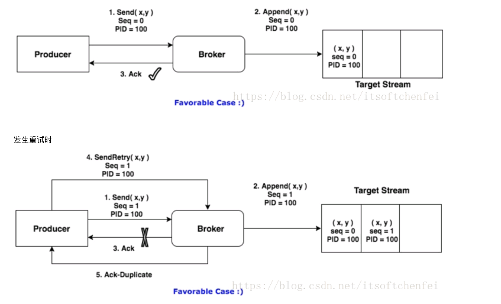

<p style="color: red">问题：kafka数据重复案例 </p>

为什么会重复消费<br>
kafka有个offset的概念，当每个消息被写进去后，都有一个offset，代表他的序号，然后consumer消费该数据之后，隔一段时间，
会把自己消费过的消息的offset提交一下，代表我已经消费过了。下次我要是重启，就会继续从上次消费到的offset来继续消费。<br>
但是当我们直接kill进程了，再重启。这会导致consumer有些消息处理了，但是没来得及提交offset。等重启之后，少数消息就会再次消费一次。<br>
其他MQ也会有这种重复消费的问题，那么针对这种问题，我们需要从业务角度，考虑它的幂等性。

> kafka重复消费的根本原因就是“数据消费了，但是offset没更新”

场景：
- rebalance，两次poll超过此时间间隔，Kafka服务端会进行rebalance操作，导致客户端连接失效，无法提交offset信息，从而引发重复消费
- 丢包：带宽流量激增时，io或者网卡卡顿就可能出现丢包
- 消费者异常重启


解决方案：
- 保证不丢失消息：生产者（ack=all 代表至少成功发送一次) 加上 重试机制
- 消费者 （offset手动提交，业务逻辑成功处理后，提交offset）。丢包的问题可以尝试对kafka进行限速
- 保证不重复消费：落表（主键或者唯一索引的方式，避免重复数据）
- 业务逻辑处理（选择唯一主键存储到Redis或者mongdb中，先查询是否存在，若存在则不处理；若不存在，先插入Redis或Mongdb,再进行业务逻辑处理）

<p style="color: red">什么是rebalance</p>

Rebalance详解：https://blog.csdn.net/qq_35901141/article/details/115710558   

rebalance中文含义为再平衡。就是 consumer group 是如何达成一致来分配订阅 topic 的所有分区的。   
比方说Consumer Group A 有3个consumer 实例，它要消费一个拥有6个分区的topic，每个consumer消费2个分区，这就是rebalance。
rebalance是相对于consumer group 而言，每个consumer group会从broker中选出一个作为组协调者（group coordinator）。
coordinator负责对整个consumer group的状态进行管理，当有触发rebalance的条件发生时，促使生成新的分区分配方案


当有触发rebalance的条件发生时，促使生成新的分区分配方案。
- consumer group 成员发生变更，比方说有新的consumer实例加入，或者有consumer实例离开组，或者有consumer实例发生奔溃。
- consumer group 订阅的topic数发生变更，这种情况主要发生在基于正则表达式订阅topic情况，当有新匹配的topic创建时则会触发rebalance。
- consumer group 订阅的topic分区数发生变更。
- consumer poll, 两次poll超过此时间间隔，Kafka服务端会进行rebalance操作

<p style="color: red">Exactly-once</p> 
https://www.jianshu.com/p/3feb67b3dd5c

<p style="color: red">线上问题：kafka一直rebalance故障，重复消费</p> 
https://blog.csdn.net/hellozhxy/article/details/114631456

<p style="color: red">kafka高性能揭秘：顺序写和零拷贝</p> 

[零拷贝-实现原理](/article/16.Linux/1.Linux理论)

对于绝大部分的中间件，都使用了这类技术到达高性能的。
- 磁盘顺序写   
  使用的技术就是jdk提供的NIO能力--MappedByteBuffer: https://blog.csdn.net/qq_41969879/article/details/81629469    
  简单概括，消息不在内存中缓存，直接将输入的消息使用追加到磁盘中，减少寻址的时间。
  
- 零拷贝： https://blog.csdn.net/ljheee/article/details/99652448   
  简单概括，数据直接在内核完成输入和输出，不用将数据拷贝到用户空间

- mmap 文件映射    
  使用mmap操作操作文件
  kafka没有在进程中管理缓存，而是将缓存行为完全交给操作系统，一方面可以简化进程的处理逻辑，提高处理效率，同时可以不用考虑进程重启后的缓存丢失；另一方面，可以利用操作系统页缓存的特性，提高磁盘读写效率。
  当内存的数量或者时间达到阈值后，会将内存数据落盘到磁盘。PS:内核缓冲区的数据，flush就能完成落盘
  
- 批量发送
- 数据压缩
- 多分区（Topic划分为多个partition，提高parallelism）

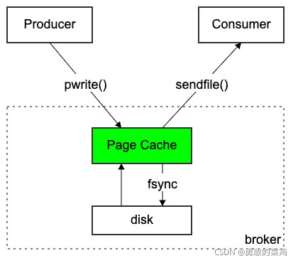

总结Kafka快的原因：
1. Producer生产的数据持久化到broker，因为mmap适合小文件的读写，所以 broker 将堆内存的消息，通过 mmap 将消息 追加到 page cache中；
2. partition顺序读写，充分利用磁盘特性，这是基础；
3. Customer从broker读取数据，采用sendfile实现零拷贝，将磁盘文件读到内核缓冲区后，直接转到socket buffer进行网络发送。

mmap 和 sendfile总结
1. 都是Linux内核提供、实现零拷贝的API；
2. sendfile 是将读到内核空间的数据，转到socket buffer，进行网络发送；
3. mmap将磁盘文件映射到内存，支持读和写，对内存的操作会反映在磁盘文件上。

RocketMQ 是适用于 Topic 数量较多、对时效性要求高的场景。所以 RocketMQ 采用了和 Kafka 不一样的零拷贝方案。   
Kafka 采用的是阻塞式 IO 进行 sendfile， 适用于系统日志消息这种高吞吐量的大块文件，sendfile的只会对已经成功刷盘的数据进行消费。如果多个partition并发写入数据，多个文件之间必然会有磁盘的寻道，磁盘访问有很大的瓶颈。   
RocketMQ 选择了 mmap + write 非阻塞式 IO (基于多路复用) 作为零拷贝方式，这是因为 RocketMQ 定位于业务级消息这种小数据块/高频率的 IO 传输，在消息写到package cahce就可以进行消费。    
当想要更低的延迟的时候选择 mmap 更合适。   

RocketMQ 零拷贝的 缺点：使用mmap会占用系统内存（虚拟内存），可能导致系统内存使用率过高。如果这时产生大量的新分配需求（大量写入，乱序读取）或者缺页中断，
可能会触淘汰算法进行内存回收，此时可能会产生抖动，写入会有短时的毛刺现象。

通过网上研究测试表明，如果读取的数据小于4kb的时候，使用mmap的性能效率比sendfile高，当读取数据大于4kb的时候，sendfile的效率比mmap高；对于写数据，如果写入的数据包小于64kb的时候，mmap的性能效率比sendfile高，当写入数据包大于64kb的时候sendfile的效率比mmap高。

为什么这么设计？
kafka主要是用于日志传输，处理海量数据，对于数据的正确度要求不是很高，并且在发送消息的时候一般会进行消息的汇聚，然后批量发送消息，
所以整体上来说kafka的读写数据量会比较大，这个时候使用sendfile能够获取更高的性能，而MetaQ主要是用来针对阿里的复杂应用场景，
对于数据的可靠性、数据的实时性要求会比较高，由于对数据的实时性要求较高，一般不会进行汇聚批量发送消息，所以读写数据量不会很大，
这个时候使用mmap可以获得更好的性能，当如果发现写入的数据量比较大时，rocketmq也可以切换为sendfile进行写入。

<p style="color: red">LEO和HW</p> 
- LEO:高水位，表示最新的数据的位置offset。
  每次partition接收到一条消息，都会更新自己的LEO，也就是log end offset，LEO其实就是最新的offset + 1。
- HW:低水位，一个分区中所有副本最小的offset。
    HW之前的数据是commit的，对消费者可见的。之后的数据是未消费的，消费者不可见

<p style="color: red">kafka可以多线程消费吗？</p>
可以多线程消费。一个分区，对应一个消费者线程。通过增加分区的方式，可以增加消费能力。

但是只想通过程序实现的话，就必须我们自己实现。比如现将程序放入数据库，再通过多线程的方式进行消费。

<p style="color: red">kafka延迟队列</p>
kafka本身不支持延迟队列。需要我们自己实现。比如使用时间轮，但是这和kafka没有关系

<p style="color: red">消息堆积会导致什么问题?</p>
https://blog.csdn.net/qq_16681169/article/details/101081656
1. 数据一致性出现问题，可能导致部分成功，部分未执行。这样就可能出现逻辑的问题
2. 超过一定时间的消息，导致数据丢失
3. 降低服务端性能，

如何处理：
1. 如果是Kafka消费能力不足，则可以考虑增加Topic的分区数，并且同时提升消费组的消费者数量，消费者数=分区数。（两者缺一不可）
2. 如果是下游的数据处理不及时：提高每批次拉取的数量。批次拉取数据过少（拉取数据/处理时间<生产速度），使处理的数据小于生产的数据，也会造成数据积压。

<p style="color: red">失效副本是指什么？有那些应对措施？</p>
不能及时与leader同步，暂时踢出ISR，等其追上leader之后再重新加入

<p style="color: red">问题：当你使用kafka-topics.sh创建（删除）了一个topic之后，Kafka背后会执行什么逻辑？</p>

1. 会在zookeeper中的/brokers/topics节点下创建一个新的topic节点，如：/brokers/topics/first
2. 触发Controller的监听程序
3. kafka Controller 负责topic的创建工作，并更新metadata cache


<p style="color: red">zk的作用？以及rocketmq为什么不用zk?</p>

zk的作用是：
- kafka的元数据存储
- broker、topic、生产者、消费者注册时的负载均衡
- zk进行leader选举。

首先：kafka的broker都是一样的，但是有一个broker承担协调工作，也就是kafkaController。
其次：broker中的partion是分为master和slave的。所以当kafkaController挂了之后，会进行下面两个操作。
1. zk之间进行选举，选择某个broker为kafkaController。
2. kafkaController，决定每个partition的Master是谁，Slave是谁

因为有了选举功能，所以kafka某个partition的master挂了，该partition对应的某个slave会升级为主对外提供服务。

rocketmq的不是这样设计的。Master/Slave的角色也是固定的。当一个Master挂了，你可以写到其他Master上，但不能让一个Slave切换成Master。
所以就不需要选举，就不用zk，自研一个nameServer存储元数据就行了。

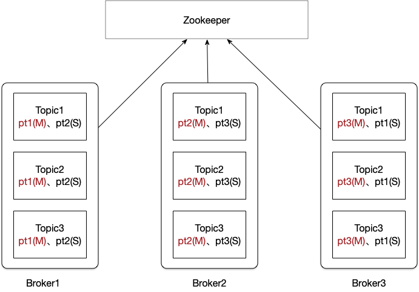


<p style="color: red">rocketmq 和 kafka的同步与刷盘策略</p>
- rocketmq
    - 同步策略:配置文件中设置brokerRole，ASYNC_MASTER(异步)、SYNC_MASTER(同步，至少一个slave同步成功)、SLAVE
    - 刷盘策略:配置文件中设置flushDiskType， SYNC_FLUSH, ASYNC_FLUSH
- kafka
    - 同步策略:请求参数中设置acks，0 异步，1 master成功，all是master的ISR表中所以保持同步状态的slave都成功。
    - 刷盘策略:配置文件中设置flush.message和flush.ms。flush.message默认5表示每5条消息进行一次刷盘。flush.ms刷盘时间间隔。