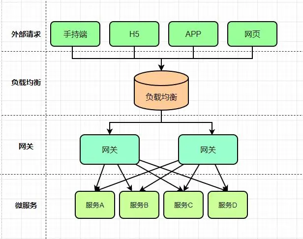

# 网关

## 1.网关

### 1.1.介绍

API网关是一种中间件，它可以在客户端和后端服务之间充当代理，用于管理和保护API。API网关的主要作用如下：
1. 提供安全性：API网关可以实现身份验证、授权、加密等安全措施，保护API不受未经授权的访问和攻击。
2. 管理API：API网关可以管理API的访问权限、流量控制、版本控制等，使得API更加易于管理和维护。
3. 实现负载均衡：API网关可以将请求分发到多个后端服务中，实现负载均衡和高可用性。
4. 缓存：API网关可以缓存请求结果，减少对后端服务的请求次数，提高响应速度和性能。
5. 监控和日志记录：API网关可以监控API的使用情况、性能指标和错误信息，并记录日志，帮助开发人员进行故障排除和性能优化。

总之，API网关可以提高API的安全性、可管理性、可扩展性和可靠性，帮助企业构建更加稳定、安全和高效的API服务。
对于大部分需要对外提供API服务的场景，需要提供可视化的网关功能。但是目前开源的网关都不符合需求，所以需要对开源的官网进行二次开发。

微服务对于网关的要求：
- 对于客户端多次请求不同的微服务，会增加客户端代码和配置的复杂性，维护成本比价高。
- 认证复杂，每个微服务可能存在不同的认证方式，客户端去调用，要去适配不同的认证，
- 存在跨域的请求，调用链有一定的相对复杂性（防火墙 / 浏览器不友好的协议）。
- 难以重构，随着项目的迭代，可能需要重新划分微服务

解决方案：
网关为微服务架构的系统提供简单、有效且统一的API路由管理，作为系统的统一入口，提供内部服务的路由中转，给客户端提供统一的服务，
可以实现一些和业务没有耦合的公用逻辑，主要功能包含认证、鉴权、路由转发、安全策略、防刷、流量控制、监控日志等

### 1.2.主流开源网关
目前常见的开源网关大致上按照语言分类有如下几类：
- Nginx+lua：OpenResty、Kong、Abtesting gateway 等
- Java：Zuul/Zuul2、Spring Cloud Gateway、Kaazing KWG、gravitee、Dromara soul 等
- Go：Janus、fagongzi、Grpc-gateway
- Dotnet：Ocelot
- NodeJS：Express Gateway、Micro Gateway

以下为主流的几个网关介绍：
- Zuul 1.0
    - Netflix开源的网关，使用Java开发，基于Servlet架构构建，便于二次开发。因为基于Servlet内部延迟严重，并发场景不友好，这也是zuul总是被诟病的原因。
    - 源码: [https://github.com/Netflix/zuul](https://github.com/Netflix/zuul)
    
- Zuul 2.0 : 采用Netty实现异步非阻塞编程模型，单线程处理机制，能够处理所有的请求和响应，请求响应的生命周期通过事件和回调进行处理，
    减少线程数量，开销较小。

- Spring Cloud GateWay : 是Spring Cloud的一个全新的API网关项目，替换Zuul开发的网关服务，基于Spring5.0 + SpringBoot2.0 + WebFlux
    （基于性能的Reactor模式响应式通信框架Netty，异步阻塞模型）等技术开发，性能高于Zuul

- Nginx+lua : 性能要比上面的强很多，使用Nginx的反向代码和负载均衡实现对API服务器的负载均衡以及高可用，lua作为一款脚本语言，
    可以编写一些简单的逻辑，但是无法嵌入到微服务架构中

- Kong : 
    - 基于OpenResty（Nginx + Lua模块）编写的高可用、易扩展的，性能高效且稳定，支持多个可用插件（限流、鉴权）等，开箱即可用，只支持HTTP协议，且二次开发扩展难，缺乏更易用的管理和配置方式
    - 源码： [https://konghq.com/](https://konghq.com/)
    
GateWay与Nginx+Lua对比：
- Nginx是一个高性能的HTTP和反向代理服务器。Nginx一方面可以做反向代理，另外一方面可以做静态资源服务器，接口使用Lua动态语言可以完成灵活的定制功能。
- Nginx适合做门户网关，是作为整个全局的网关，对外的处于最外层的那种;而Gateway属于业务网关，主要用来对应不同的客户端提供服务，用于聚合业务。各个微服务独立部署，职责单一，对外提供服务的时候需要有一个东西把业务聚合起来。
- Gateway可以实现熔断、重试等功能，这是 Nginx不具备的。
    
网关基本功能：https://mp.weixin.qq.com/s/BCZXE_SaLZxqPqgora-AWw

API网关解决方案： https://mp.weixin.qq.com/s/0aBHk7qEJqNKErE9Pc7eeA

### 1.3.应用场景

1.私有云开源解决方案如下

Kong kong是基于Nginx+Lua进行二次开发的方案： https://konghq.com/

Netflix Zuul，zuul是spring cloud的一个推荐组件：  https://github.com/Netflix/zuul

SpringCloud中Zuul网关原理及其配置：https://mp.weixin.qq.com/s/jB6XEVI16LzP3xQy3mPHkw

orange,这个开源程序是国人开发的：http://orange.sumory.com/

2.公有云解决方案：

Amazon API Gateway：https://aws.amazon.com/cn/api-gateway/

阿里云API网关：https://www.aliyun.com/product/apigateway/

腾讯云API网关：https://cloud.tencent.com/product/apigateway

3.自开发解决方案：

基于Nginx+Lua+ OpenResty的方案，可以看到Kong,orange都是基于这个方案

基于Netty、非阻塞IO模型。通过网上搜索可以看到国内的宜人贷等一些公司是基于这种方案，是一种成熟的方案。

基于Node.js的方案。这种方案是应用了Node.js天生的非阻塞的特性。

基于java Servlet的方案。zuul基于的就是这种方案，这种方案的效率不高，这也是zuul总是被诟病的原因。

## 2.Spring Cloud ApiGateway

[SpringCloud Gateway 详解](https://blog.csdn.net/lemon_TT/article/details/124675243)
[SpringCloud GateWay 万字详解](https://blog.csdn.net/qq_14996421/article/details/125236660)

### 2.1.介绍

[官方文档](https://docs.spring.io/spring-cloud-gateway/docs/current/reference/html/#gateway-starter)

Spring Cloud Gateway 是Spring Cloud的一个全新的API网关项目，目的是为了替换掉Zuul1，它基于Spring5.0 + SpringBoot2.0 + WebFlux
（基于性能的Reactor模式响应式通信框架Netty，异步阻塞模型）等技术开发，性能于Zuul，官测试，Spring Cloud GateWay是Zuul的1.6倍 ，
旨在为微服务架构提供种简单有效的统的API路由管理式。

可以与Spring Cloud Discovery Client（如Eureka）、Ribbon、Hystrix等组件配合使用，实现路由转发、负载均衡、熔断、鉴权、路径重写、志监控等

Gateway还内置了限流过滤器，实现了限流的功能。

### 2.2.基本概念

- Route(路由) ：构建网关的基础模块，由ID、目标URL、过滤器等组成。是GateWay中最基本的组件之一，表示一个具体的路由信息载体，主要由下面几个部分组成
    - id：路由唯一标识，区别于其他的route
    - url： 路由指向的目的地URL，客户端请求最终被转发到的微服务
    - order： 用于多个Route之间的排序，数值越小越靠前，匹配优先级越高

- Predicate（断言） ：开发人员可以匹配HTTP请求中的内容（请求头和请求参数），只有断言为true，才执行路由

- Filter（过滤） ：GateWayFilter的实例，使用过滤器，可以在请求被路由之前或者之后对请求进行修改，并且对上游的响应，进行二次处理。过滤器为org.springframework.cloud.gateway.filter.GatewayFilter类的实例。

### 2.3.流程

- Gateway Client 向 Spring Cloud Gateway 发送请求
- 请求首先会被 HttpWebHandlerAdapter 进行提取组装成网关上下文
- 然后网关的上下文会传递到 DispatcherHandler ，它负责将请求分发给 RoutePredicateHandlerMapping
- RoutePredicateHandlerMapping 负责路由查找，并根据路由断言判断路由是否可用
- 如果过断言成功，由FilteringWebHandler 创建过滤器链并调用
- 通过特定于请求的 Fliter 链运行请求，Filter 被虚线分隔的原因是Filter可以在发送代理请求之前（pre）和之后（post）运行逻辑
- 执行所有pre过滤器逻辑。然后进行代理请求。发出代理请求后，将运行“post”过滤器逻辑。
- 处理完毕之后将 Response 返回到 Gateway 客户端

Filter类型：
- Filter在pre类型的过滤器可以做参数效验、权限效验、流量监控、日志输出、协议转换等。
- Filter在post类型的过滤器可以做响应内容、响应头的修改、日志输出、流量监控等

### 2.4.核心思想

当用户发出请求达到 GateWay 之后，会通过一些匹配条件，定位到真正的服务节点，并且在这个转发过程前后，进行一些细粒度的控制，
其中 Predicate（断言） 是我们的匹配条件，Filter 是一个拦截器，有了这两点，再加上URL，就可以实现一个具体的路由，
核心思想：路由转发+执行过滤器链

### 2.5.特征

SpringCloud官方，对SpringCloud Gateway 特征介绍如下：
- 基于 Spring Framework 5，Project Reactor 和 Spring Boot 2.0
- 集成 Hystrix 断路器
- 集成 Spring Cloud DiscoveryClient
- Predicates 和 Filters 作用于特定路由，易于编写的 Predicates 和 Filters
- 具备一些网关的高级功能：动态路由、限流、路径重写

从以上的特征来说，和Zuul的特征差别不大。SpringCloud Gateway和Zuul主要的区别，还是在底层的通信框架上。

## 3.zuul

### 3.1.介绍

Zuul是所有从设备和web站点到Netflix流媒体应用程序后端请求的前门。作为一个边缘服务应用程序，Zuul被构建来支持动态路由、监视、弹性和安全性。它还可以根据需要将请求路由到多个Amazon自动伸缩组。
Zuul使用了一系列不同类型的过滤器，使我们能够快速灵活地将功能应用到服务中。

Netflix宣布了通用API网关Zuul的架构转型。Zuul原本采用同步阻塞架构，转型后叫作Zuul2，采用异步非阻塞架构。
Zuul2和Zuul1在架构方面的主要区别在于，Zuul2运行在异步非阻塞的框架上，比如Netty。Zuul1依赖多线程来支持吞吐量的增长，
而Zuul 2使用的Netty框架依赖事件循环和回调函数。

### 3.2.过滤器的功能
- 过滤器是Zuul的核心功能。它们负责应用程序的业务逻辑，可以执行各种任务。
    - Type ： 通常定义过滤器应用在哪个阶段
    - Async ： 定义过滤器是同步还是异步
    - Execution Order ： 执行顺序
    - Criteria ： 过滤器执行的条件
    - Action ： 如果条件满足，过滤器执行的动作

Zuul提供了一个动态读取、编译和运行这些过滤器的框架。过滤器之间不直接通信，而是通过每个请求特有的RequestContext共享状态。
- 下面是Zuul的一些过滤器:
    - Incoming:Incoming过滤器在请求被代理到Origin之前执行。这通常是执行大部分业务逻辑的地方。例如:认证、动态路由、速率限制、DDoS保护、指标。
    - Endpoint:Endpoint过滤器负责基于incoming过滤器的执行来处理请求。Zuul有一个内置的过滤器（ProxyEndpoint），用于将请求代理到后端服务器，因此这些过滤器的典型用途是用于静态端点。例如:健康检查响应，静态错误响应，404响应。
    - Outgoing:Outgoing过滤器在从后端接收到响应以后执行处理操作。通常情况下，它们更多地用于形成响应和添加指标，而不是用于任何繁重的工作。例如:存储统计信息、添加/剥离标准标题、向实时流发送事件、gziping响应。

### 3.3.过滤器类型

- 下面是与一个请求典型的生命周期对应的标准的过滤器类型：
    - PRE ： 路由到Origin之前执行
    - ROUTING ： 路由到Origin期间执行
    - POST ： 请求被路由到Origin之后执行
    - ERROR ： 发生错误的时候执行
    
- 这些过滤器帮助我们执行以下功能：
    - 身份验证和安全性 ： 识别每个资源的身份验证需求，并拒绝不满足它们的请求
    - 监控 ： 在边缘跟踪有意义的数据和统计数据，以便给我们一个准确的生产视图
    - 动态路由 ： 动态路由请求到不同的后端集群
    - 压力测试 ： 逐渐增加集群的流量，以评估性能
    - 限流 ： 为每种请求类型分配容量，并丢弃超过限制的请求
    - 静态响应处理 ： 直接在边缘构建一些响应，而不是将它们转发到内部集群

### 3.4.Zuul 1.0 请求生命周期

## 4.Zuul2.0

- [深入理解Zuul实现原理](https://jbone.cn/learn/spring-cloud/deep-zuul.html)
- [Spring Cloud Netflix Zuul官方文档翻译](https://jbone.cn/translate/spring-cloud-netflix-zuul/)
- [腾讯网关 TGW 基础原理入门](https://mp.weixin.qq.com/s/w6oGa9YombLvRSzqxfiWrw)

### 4.1.介绍
Zuul 2.0 架构图

上图是Zuul2的架构，和Zuul1没有本质区别，两点变化：
1. 前端用Netty Server代替Servlet，目的是支持前端异步。后端用Netty Client代替Http Client，目的是支持后端异步。
2. 过滤器换了一下名字，用Inbound Filters代替Pre-routing Filters，用Endpoint Filter代替Routing Filter，用Outbound Filters代替Post-routing Filters。
  - Inbound Filters ： 路由到 Origin 之前执行，可以用于身份验证、路由和装饰请求
  - Endpoint Filters ： 可用于返回静态响应，否则内置的ProxyEndpoint过滤器将请求路由到Origin
  - Outbound Filters ： 从Origin那里获取响应后执行，可以用于度量、装饰用户的响应或添加自定义header

有两种类型的过滤器：sync 和 async。因为Zuul是运行在一个事件循环之上的，因此从来不要在过滤中阻塞。
如果你非要阻塞，可以在一个异步过滤器中这样做，并且在一个单独的线程池上运行，否则可以使用同步过滤器。

上文提到过Zuul2开始采用了异步模型
优势是异步非阻塞模式启动的线程很少，基本上一个CPU core上只需启一个事件环处理线程，它使用的线程资源就很少，上下文切换(Context Switch)开销也少。
非阻塞模式可以接受的连接数大大增加，可以简单理解为请求来了只需要进队列，这个队列的容量可以设得很大，只要不超时，队列中的请求都会被依次处理。
不足,异步模式让编程模型变得复杂。一方面Zuul2本身的代码要比Zuul1复杂很多，Zuul1的代码比较容易看懂，Zuul2的代码看起来就比较费劲。

另一方面异步模型没有一个明确清晰的请求->处理->响应执行流程(call flow)，它的流程是通过事件触发的，请求处理的流程随时可能被切换断开，
内部实现要通过一些关联id机制才能把整个执行流再串联起来，这就给开发调试运维引入了很多复杂性，比如你在IDE里头调试异步请求流就非常困难。
另外ThreadLocal机制在这种异步模式下就不能简单工作，因为只有一个事件环线程，不是每个请求一个线程，也就没有线程局部的概念，
所以对于CAT这种依赖于ThreadLocal才能工作的监控工具，调用链埋点就不好搞(实际可以工作但需要进行特殊处理)。

总体上，异步非阻塞模式比较适用于IO密集型(IO bound)场景，这种场景下系统大部分时间在处理IO，CPU计算比较轻，少量事件环线程就能处理。

### 4.2.Zuul 与 Zuul 2 性能对比

Netflix给出了一个比较模糊的数据，大致Zuul2的性能比Zuul1好20%左右，这里的性能主要指每节点每秒处理的请求数。
为什么说模糊呢？因为这个数据受实际测试环境，流量场景模式等众多因素影响，你很难复现这个测试数据。即便这个20%的性能提升是确实的，
其实这个性能提升也并不大，和异步引入的复杂性相比，这20%的提升是否值得是个问题。Netflix本身在其博文22和ppt11中也是有点含糊其词，甚至自身都有一些疑问的。

## 5.Apache ShenYu

Apache ShenYu是一个异步的，高性能的，跨语言的，响应式的 API 网关，它的设计是以插件为核心，扩展功能只需要以插件的方式加入便可。
真正实现了热插拔，ShenYu本身提供了丰富的插件给我们使用，包括协议转换，比如http/https协议转SpringCloud协议，Dubbo协议，Tars协议等，
安全插件，如jwt，sign等，还有限流等插件。

官网[https://shenyu.apache.org/zh/](https://shenyu.apache.org/zh/)

## 6.Nginx
没啥好介绍的，详细看Nginx文档。

### 6.1.Tengine

Tengine是nginx的加强版，封装版，淘宝开源
1. 官网:[http://tengine.taobao.org/](http://tengine.taobao.org/)
2. 动态模块加载（DSO）支持。加入一个模块不再需要重新编译整个Tengine；
3. 支持SO_REUSEPORT选项，建连性能提升为官方nginx的三倍；
4. 支持SPDY v3协议，自动检测同一端口的SPDY请求和HTTP请求；
5. 流式上传到HTTP后端服务器或FastCGI服务器，大量减少机器的I/O压力；
6. 更加强大的负载均衡能力，包括一致性hash模块、会话保持模块，还可以对后端的服务器进行主动健康检查，根据服务器状态自动上线下线，以及动态解析upstream中出现的域名；
7. 输入过滤器机制支持。通过使用这种机制Web应用防火墙的编写更为方便；
8. 支持设置proxy、memcached、fastcgi、scgi、uwsgi在后端失败时的重试次数
9. 动态脚本语言Lua支持。扩展功能非常高效简单；
10. 支持管道（pipe）和syslog（本地和远端）形式的日志以及日志抽样；
11. 支持按指定关键字(域名，url等)收集Tengine运行状态；
12. 组合多个CSS、JavaScript文件的访问请求变成一个请求；
13. 自动去除空白字符和注释从而减小页面的体积。

### 6.2.OpenResty

- 官网[http://openresty.org/cn/](http://openresty.org/cn/)
- 代码[https://github.com/openresty/](https://github.com/openresty/)

Nginx 是俄罗斯人发明的， Lua 是巴西几个教授发明的，中国人章亦春把 LuaJIT VM 嵌入到 Nginx 中，实现了 OpenResty 这个高性能服务端解决方案。
OpenResty是一个流量网关,根据前面对流量网关的介绍就可以知道流量网关的指责。通过 OpenResty，你可以把 nginx 的各种功能进行自由拼接， 更重要的是，开发门槛并不高，这一切都是用强大轻巧的 Lua 语言来操控。

OpenResty基于 Nginx 与 Lua 的高性能 Web 平台，其内部集成了大量精良的 Lua 库、第三方模块以及大多数的依赖项。用于方便地搭建能够处理超高并发、扩展性极高的动态 Web 应用、Web 服务和动态网关。
通过揉和众多设计良好的 Nginx 模块，OpenResty 有效地把 Nginx 服务器转变为一个强大的 Web 应用服务器，基于它开发人员可以使用 Lua 编程语言对 Nginx 核心以及现有的各种 Nginx C 模块进行脚本编程，构建出可以处理一万以上并发请求的极端高性能的 Web 应用
OpenResty 最早是顺应 OpenAPI 的潮流做的，所以 Open 取自“开放”之意，而Resty便是 REST 风格的意思。虽然后来也可以基于 ngx_openresty 实现任何形式的 web service 或者传统的 web 应用。
也就是说 Nginx 不再是一个简单的静态网页服务器，也不再是一个简单的反向代理了。第二代的 openresty 致力于通过一系列 nginx 模块，把nginx扩展为全功能的 web 应用服务器。

ngx_openresty 是用户驱动的项目，后来也有不少国内用户的参与，从 http://openresty.org 的点击量分布上看，国内和国外的点击量基本持平。

ngx_openresty 目前有两大应用目标：
1. 通用目的的 web 应用服务器。在这个目标下，现有的 web 应用技术都可以算是和 OpenResty 或多或少有些类似，比如 Nodejs, PHP 等等。ngx_openresty 的性能（包括内存使用和 CPU 效率）算是最大的卖点之一。
2. Nginx 的脚本扩展编程，用于构建灵活的 Web 应用网关和 Web 应用防火墙。有些类似的是 NetScaler。其优势在于 Lua 编程带来的巨大灵活性。

1、请问 OpenResty 的定位是什么，从分享来看似乎全栈了？

定位主要是高性能，所有的新功能和优化，都是针对性能的。 但是也有人拿来做页面，比如京东；也有人拿来替代 PHP 做 Web server，比如新浪。 
我觉得它越来越像一个独立的开发语言。

2、请问 Lua 是不是可以实现动态配置 location？比如动态切流量？

balancer_by_lua 可能是你需要的，你可以用 Lua 来定义自己的负载均衡器，可以在每个请求的级别上去定义，当前访问的后端的节点地址、端口，
还可以定制很细力度的访问失败之后的重试策略。

3、OpenResty 是可以拿到 nginx 请求里面的所有信息？那是不是可以做一些更复杂的转发操作？能介绍一下 OpenResty 在 cdn 里面的应用场景吗？

可以看下 iresty.com 的分享，又拍的张聪非常详细的介绍了 OpenResty 在又拍 CDN 的使用。

4、OpenResty 是否修改了 nginx 的源码，还是和 nginx 完全可剥离开的？Nginx 版本升级，OpenResty 也跟着升级吗？例如 nginx 修复漏洞 bug 等情况。

OpenResty 不修改 nginx 的源码，可以跟随 nginx 无痛升级。 如果你觉得 OpenResty 升级慢了， 你可以只拿 ngx_lua 出来，
当做 nginx 的一个模块来编译。实际上，OpenResty 在测试过程中，发现了很多 nginx 自身的 bug 。

5、软 WAF nginx + Lua 是主流和未来方向么？

我觉得 WAF 应该基于 nginx，不管是性能还是流行程度。而 OpenResty 具有更灵活操控 nginx 的能力，所以我觉得 OpenResty 在
WAF 领域非常合适。cloudflare 的 WAF 就是基于 OpenResty。

6、看样子未来可能有各种 ngx_xx，最有可能的是 js，不知道这方面有什么前沿的动向？

我们组在尝试把 PHP 嵌入到 nginx 中，当然性能肯定不如 LuaJIT，但是会方便很多 PHP 同学，有进展的话，我们会开源出来

7、OpenResty 目前看似乎是一个 proxy 的配置框架（糅合了 nginx + Lua），但以后的发展是什么样子？会不会以后更进一步，比如做一个 API gateway 之类的。

OpenResty其实是希望大家忽略 nginx 的存在，直接使用 ngx_lua 提供的 API 实现自己的业务逻辑。更像一门独立的开发语言，
只不过底层使用 nginx 的网络库而已。你可以按照你的想法搭建任何好玩的服务端应用出来。

## 7.Kong

- 官网[https://konghq.com/](https://konghq.com/)
- 代码[https://github.com/Kong/](https://github.com/Kong/)

### 7.1.介绍
Kong基于OpenResty开发，也是流量层网关, 是一个云原生、快速、可扩展、分布式的API 网关。继承了OpenResty的高性能、易扩展性等特点。Kong通过简单的增加机器节点，可以很容易的水平扩展。同时功能插件化，可通过插件来扩展其能力。而且在任何基础架构上都可以运行。具有以下特性：
- 提供了多样化的认证层来保护API。
- 可对出入流量进行管制。
- 提供了可视化的流量检查、监视分析API。
- 能够及时的转换请求和相应。
- 提供log解决方案
- 可通过API调用Serverless 函数。

### 7.2.Kong解决了什么问题
当我们决定对应用进行微服务改造时，应用客户端如何与微服务交互的问题也随之而来，毕竟服务数量的增加会直接导致部署授权、负载均衡、通信管理、分析和改变的难度增加。
面对以上问题，API GATEWAY是一个不错的解决方案，其所提供的访问限制、安全、流量控制、分析监控、日志、请求转发、合成和协议转换功能，可以解放开发者去把精力集中在具体逻辑的代码，而不是把时间花费在考虑如何解决应用和其他微服务链接的问题上。
图片来自Kong官网:

可以看到Kong解决的问题。专注于全局的API管理策略，全局流量监控、日志记录、全局限流、黑白名单控制、接入请求到业务系统的负载均衡等。

### 7.3.Kong的优点以及性能
在众多 API GATEWAY 框架中，Mashape 开源的高性能高可用API网关和API服务管理层——KONG（基于 NGINX+Lua）特点尤为突出，
它可以通过插件扩展已有功能，这些插件（使用 lua 编写）在API请求响应循环的生命周期中被执行。
于此同时，KONG本身提供包括 HTTP 基本认证、密钥认证、CORS、TCP、UDP、文件日志、API请求限流、请求转发及 NGINX 监控等基本功能。
目前，Kong 在 Mashape 管理了超过 15,000 个 API，为 200,000 开发者提供了每月数十亿的请求支持。

### 7.4.Kong架构
Kong提供一些列的服务,这就不得不谈谈内部的架构:

首先最底层是基于Nginx, Nginx是高性能的基础层, 一个良好的负载均衡、反向代理器,然后在此基础上增加Lua脚本库,形成了OpenResty,拦截请求, 响应生命周期,可以通过Lua编写脚本,所以插件比较丰富。
关于Kong的一些插件库以及如何配置,可以参考简书 [开源API网关系统（Kong教程）入门到精通](https://www.jianshu.com/p/a68e45bcadb6)

## 8.Apisix

- 官网：[https://apisix.apache.org/](https://apisix.apache.org/)
- 源码：[https://github.com/apache/apisix](https://github.com/apache/apisix)  
- 中文文档[https://www.bookstack.cn/read/apisix-3.2-zh/3a3ad75e1267bfce.md](https://www.bookstack.cn/read/apisix-3.2-zh/3a3ad75e1267bfce.md)
- [使用java编写apisix插件](https://apisix.apache.org/blog/2021/06/21/use-Java-to-write-Apache-APISIX-plugins)
- [支持 10 亿日流量的基础设施：当 Apache APISIX 遇上腾讯](https://apisix.apache.org/zh/blog/2021/05/24/tencent-games/)
- [使用安装包安装apisix](https://www.cnblogs.com/liuys635/p/17135207.html)

Apache APISIX 是一个动态、实时、高性能的云原生 API 网关，提供了负载均衡、动态上游、灰度发布、服务熔断、身份认证、可观测性等丰富的流量管理功能。
apisix基于OpenResty和etcd实现，与传统API网关相比，apisix具有动态路由和插件热加载，特别适合微服务系统下的API管理。

支持的功能：
- 客户端的api管理，配置变更热更新
- 动态负载均衡：跨多个上游服务的动态负载均衡，目前已支持 round-robin 轮询和一致性哈希算法。
- 身份验证：支持 key-auth、JWT、basic-auth、wolf-rbac 等多种认证方式。
- 限流限速：可以基于速率、请求数、并发等维度限制。
- APISIX 还支持 A/B 测试、金丝雀发布(灰度发布)、蓝绿部署、监控报警、服务可观测性、服务治理等等高级功能，这在作为微服务 API 网关非常重要的特性。
- 与Apache SkyWalking等监控体系完美兼容。

## 9.An Aggregation API Gateway

- 开源地址：https://github.com/fizzgate/fizz-gateway-community
- 官网：https://www.fizzgate.com
- 开源协议：GNU v3。个人非商业免费

An Aggregation API Gateway in Java . Fizz Gateway 是一个基于 Java开发的微服务聚合网关，是拥有自主知识产权的应用网关国产化替代方案，
能够实现热服务编排聚合、自动授权选择、线上服务脚本编码、在线测试、高性能路由、API审核管理、回调管理等目的，拥有强大的自定义插件系统可以自行扩展，
并且提供友好的图形化配置界面，能够快速帮助企业进行API服务治理、减少中间层胶水代码以及降低编码投入、提高 API 服务的稳定性和安全性。
目前是已知开源的方案中，功能最多最全的，但是商业不免费，可以借鉴其设计思路，完善自身网关的功能。

演示环境（Demo）：http://demo.fizzgate.com/ 账号/密码:admin/Aa123!

## 10.BFE（Baidu Front End）

BFE（Baidu Front End）是百度的一款开源的应用负载均衡产品，目前已接入百度大部分流量，每日转发请求接近1万亿，峰值QPS超过1000万。
在2019年百度春晚红包活动中，BFE平台在超大用户压力、数次流量波峰下平稳运行，保证了春晚红包活动的顺利进行。

- 官网：[https://www.bfe-networks.net](https://www.bfe-networks.net)
- 源码：[https://github.com/baidu/bfe](https://github.com/baidu/bfe)