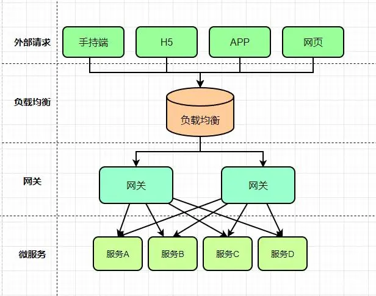
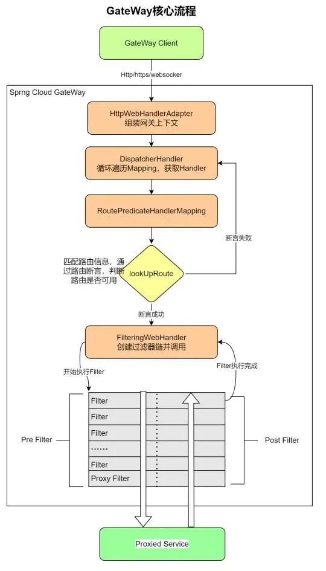

# 网关ApiGateway

## 1.网关

### 1.1.介绍

微服务的架构随着服务拆分的越多，对于调用方引入了新的问题

- 对于客户端多次请求不同的微服务，会增加客户端代码和配置的复杂性，维护成本比价高。
- 认证复杂，每个微服务可能存在不同的认证方式，客户端去调用，要去适配不同的认证，
- 存在跨域的请求，调用链有一定的相对复杂性（防火墙 / 浏览器不友好的协议）。
- 难以重构，随着项目的迭代，可能需要重新划分微服务

解决方案：

网关为微服务架构的系统提供简单、有效且统一的API路由管理，作为系统的统一入口，提供内部服务的路由中转，给客户端提供统一的服务，
可以实现一些和业务没有耦合的公用逻辑，主要功能包含认证、鉴权、路由转发、安全策略、防刷、流量控制、监控日志等

### 1.2.常见方案

- Zuul 1.0
    - Netflix开源的网关，使用Java开发，基于Servlet架构构建，便于二次开发。因为基于Servlet内部延迟严重，并发场景不友好，这也是zuul总是被诟病的原因。
    - 源码: [https://github.com/Netflix/zuul](https://github.com/Netflix/zuul)
    
- Zuul 2.0 : 采用Netty实现异步非阻塞编程模型，单线程处理机制，能够处理所有的请求和响应，请求响应的生命周期通过事件和回调进行处理，
    减少线程数量，开销较小。

- GateWay : 是Spring Cloud的一个全新的API网关项目，替换Zuul开发的网关服务，基于Spring5.0 + SpringBoot2.0 + WebFlux
    （基于性能的Reactor模式响应式通信框架Netty，异步阻塞模型）等技术开发，性能高于Zuul

- Nginx+lua : 性能要比上面的强很多，使用Nginx的反向代码和负载均衡实现对API服务器的负载均衡以及高可用，lua作为一款脚本语言，
    可以编写一些简单的逻辑，但是无法嵌入到微服务架构中

- Kong : 
    - 基于OpenResty（Nginx + Lua模块）编写的高可用、易扩展的，性能高效且稳定，支持多个可用插件（限流、鉴权）等，开箱即可用，只支持HTTP协议，且二次开发扩展难，缺乏更易用的管理和配置方式
    - 源码： [https://konghq.com/](https://konghq.com/)
    
GateWay与Nginx+Lua对比：
- Nginx是一个高性能的HTTP和反向代理服务器。Nginx一方面可以做反向代理，另外一方面可以做静态资源服务器，接口使用Lua动态语言可以完成灵活的定制功能。
- Nginx适合做门户网关，是作为整个全局的网关，对外的处于最外层的那种;而Gateway属于业务网关，主要用来对应不同的客户端提供服务，用于聚合业务。各个微服务独立部署，职责单一，对外提供服务的时候需要有一个东西把业务聚合起来。
- Gateway可以实现熔断、重试等功能，这是 Nginx不具备的。
    
网关基本功能：https://mp.weixin.qq.com/s/BCZXE_SaLZxqPqgora-AWw

API网关解决方案： https://mp.weixin.qq.com/s/0aBHk7qEJqNKErE9Pc7eeA

### 1.3.应用场景

1.私有云开源解决方案如下

Kong kong是基于Nginx+Lua进行二次开发的方案： https://konghq.com/

Netflix Zuul，zuul是spring cloud的一个推荐组件：  https://github.com/Netflix/zuul

SpringCloud中Zuul网关原理及其配置：https://mp.weixin.qq.com/s/jB6XEVI16LzP3xQy3mPHkw

orange,这个开源程序是国人开发的：http://orange.sumory.com/

2.公有云解决方案：

Amazon API Gateway：https://aws.amazon.com/cn/api-gateway/

阿里云API网关：https://www.aliyun.com/product/apigateway/

腾讯云API网关：https://cloud.tencent.com/product/apigateway

3.自开发解决方案：

基于Nginx+Lua+ OpenResty的方案，可以看到Kong,orange都是基于这个方案

基于Netty、非阻塞IO模型。通过网上搜索可以看到国内的宜人贷等一些公司是基于这种方案，是一种成熟的方案。

基于Node.js的方案。这种方案是应用了Node.js天生的非阻塞的特性。

基于java Servlet的方案。zuul基于的就是这种方案，这种方案的效率不高，这也是zuul总是被诟病的原因。

## 2.Spring Cloud ApiGateway

[SpringCloud Gateway 详解](https://blog.csdn.net/lemon_TT/article/details/124675243)
[SpringCloud GateWay 万字详解](https://blog.csdn.net/qq_14996421/article/details/125236660)

### 2.1.介绍

[官方文档](https://docs.spring.io/spring-cloud-gateway/docs/current/reference/html/#gateway-starter)

Spring Cloud Gateway 是Spring Cloud的一个全新的API网关项目，目的是为了替换掉Zuul1，它基于Spring5.0 + SpringBoot2.0 + WebFlux
（基于性能的Reactor模式响应式通信框架Netty，异步阻塞模型）等技术开发，性能于Zuul，官测试，Spring Cloud GateWay是Zuul的1.6倍 ，
旨在为微服务架构提供种简单有效的统的API路由管理式。

可以与Spring Cloud Discovery Client（如Eureka）、Ribbon、Hystrix等组件配合使用，实现路由转发、负载均衡、熔断、鉴权、路径重写、志监控等

Gateway还内置了限流过滤器，实现了限流的功能。

### 2.2.基本概念

- Route(路由) ：构建网关的基础模块，由ID、目标URL、过滤器等组成。是GateWay中最基本的组件之一，表示一个具体的路由信息载体，主要由下面几个部分组成
    - id：路由唯一标识，区别于其他的route
    - url： 路由指向的目的地URL，客户端请求最终被转发到的微服务
    - order： 用于多个Route之间的排序，数值越小越靠前，匹配优先级越高

- Predicate（断言） ：开发人员可以匹配HTTP请求中的内容（请求头和请求参数），只有断言为true，才执行路由

- Filter（过滤） ：GateWayFilter的实例，使用过滤器，可以在请求被路由之前或者之后对请求进行修改 

### 2.3.流程

- Gateway Client 向 Spring Cloud Gateway 发送请求
- 请求首先会被 HttpWebHandlerAdapter 进行提取组装成网关上下文
- 然后网关的上下文会传递到 DispatcherHandler ，它负责将请求分发给 RoutePredicateHandlerMapping
- RoutePredicateHandlerMapping 负责路由查找，并根据路由断言判断路由是否可用
- 如果过断言成功，由FilteringWebHandler 创建过滤器链并调用
- 通过特定于请求的 Fliter 链运行请求，Filter 被虚线分隔的原因是Filter可以在发送代理请求之前（pre）和之后（post）运行逻辑
- 执行所有pre过滤器逻辑。然后进行代理请求。发出代理请求后，将运行“post”过滤器逻辑。
- 处理完毕之后将 Response 返回到 Gateway 客户端

Filter类型：
- Filter在pre类型的过滤器可以做参数效验、权限效验、流量监控、日志输出、协议转换等。
- Filter在post类型的过滤器可以做响应内容、响应头的修改、日志输出、流量监控等

### 2.4.核心思想

当用户发出请求达到 GateWay 之后，会通过一些匹配条件，定位到真正的服务节点，并且在这个转发过程前后，进行一些细粒度的控制，
其中 Predicate（断言） 是我们的匹配条件，Filter 是一个拦截器，有了这两点，再加上URL，就可以实现一个具体的路由，
核心思想：路由转发+执行过滤器链
 
## 3.zuul

- [深入理解Zuul实现原理](https://jbone.cn/learn/spring-cloud/deep-zuul.html)
- [Spring Cloud Netflix Zuul官方文档翻译](https://jbone.cn/translate/spring-cloud-netflix-zuul/)

[腾讯网关 TGW 基础原理入门](https://mp.weixin.qq.com/s/w6oGa9YombLvRSzqxfiWrw)