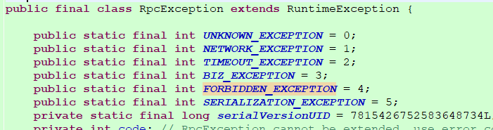
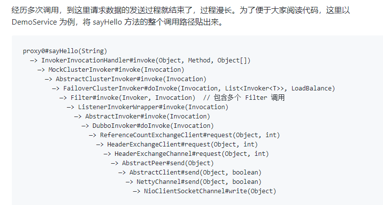
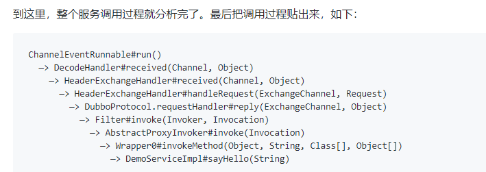
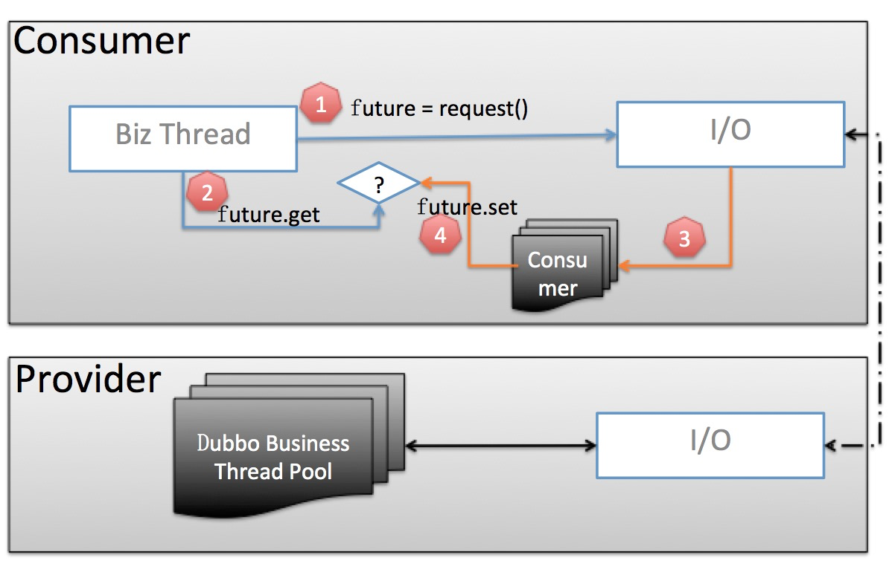
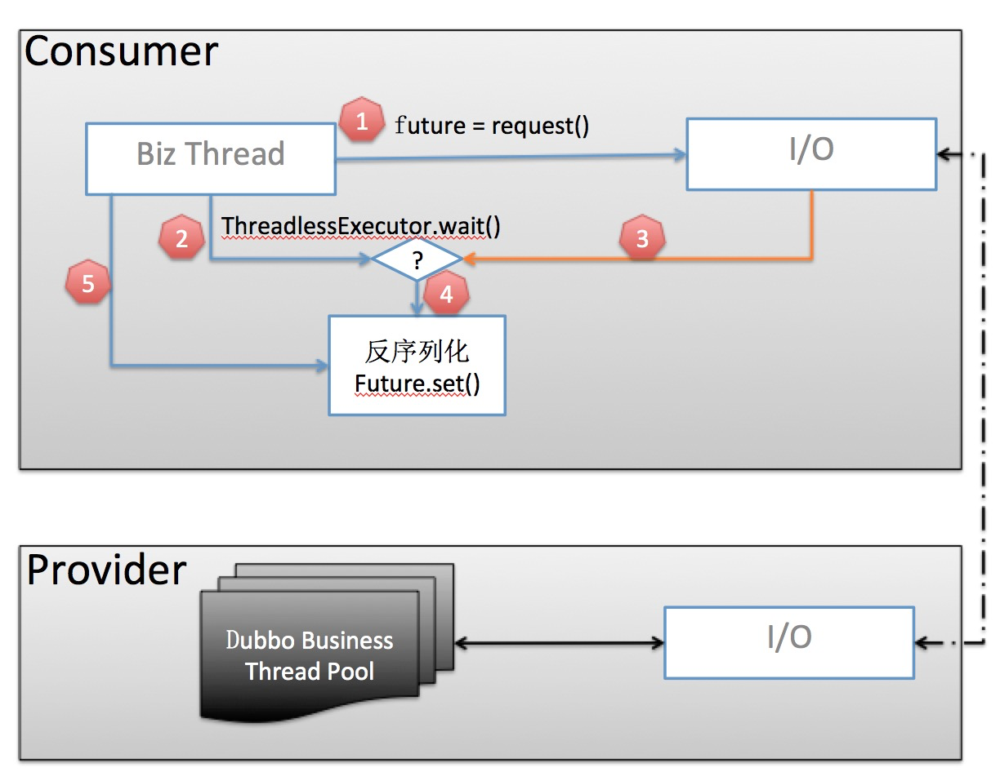
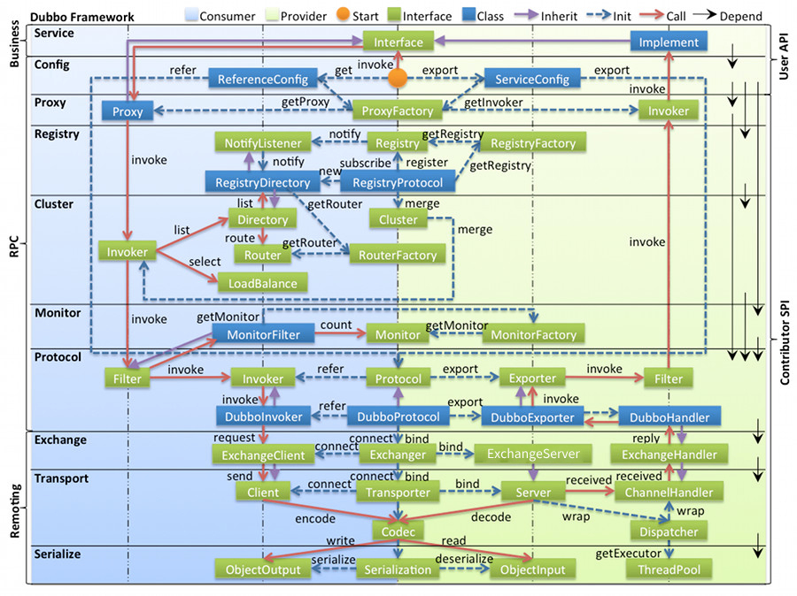

# Dubbo

- 官网：[https://cn.dubbo.apache.org/zh-cn/](https://cn.dubbo.apache.org/zh-cn/)
- 源码：[https://github.com/apache/dubbo/](https://github.com/apache/dubbo/)
- 官方教程《Apache Dubbo 微服务开发从入门到精通》：[https://developer.aliyun.com/ebook/7913](https://developer.aliyun.com/ebook/7913)

官方博客
- [5 分钟读懂开源服务框架 Dubbo 及其最新规划](https://mp.weixin.qq.com/s/GvDES9uXlboA8t3sk_ko1Q)
- [提升集群吞吐量与稳定性的秘诀： Dubbo 自适应负载均衡与限流策略实现解析](https://mp.weixin.qq.com/s/WoqbJWw_Q3u6wWjWJ9UoGg)

## 1.介绍

Apache Dubbo 是一款 RPC 微服务框架，提供了包括 Java、Golang 等在内的多种语言 SDK 实现。
1. 快速上手，让开发者专注业务开发：多语言 SDK 定义微服务开发范式，通信协议灵活切换，支持 HTTP/2、gRPC、REST、Thrift、TCP 等任一协议。
2. 服务治理，实时监测、管控集群状态：内置服务发现、负载均衡、路由等流量管控策略，提供全链路追踪、限流降级、一致性事务、日志、Metrics、服务网格、Admin 可视化控制台等一站式微服务生态。
3. 超高性能，面向百万实例集群设计：阿里巴巴每年双十一数百万实例、万亿次调用跑在 Dubbo 之上，从设计之初即将低延迟、高吞吐量、可伸缩性放在第一位。
4. 企业级解决方案，多年企业生产环境检验:用户群体遍布各行各业，典型代表包括工商银行、携程、海尔、金蝶、云厂商 (阿里云、腾讯云、华为云) 等，2022年 Dubbo3 在阿里巴巴已全面升级 HSF2 实现了框架统一。

## 2.原理

Dubbo值得学习的地方，是他自己实现了一套SPI，自己实现了一套IOC容器维护内部对象，可定制调用过程的所有功能。

### 2.1.原理解析

1. [单端口多协议实现原理解析](https://cn.dubbo.apache.org/zh-cn/overview/mannual/java-sdk/reference-manual/architecture/multi-protocol/)
   - [如何用一个端口同时暴露 HTTP1/2、gRPC、Dubbo 协议？](https://mp.weixin.qq.com/s/3Qr6diH6WJSwv8HIma7-eA)
   - dubbo3开始支持，需要使用triple协议，dubbo的信息交换层就可以自动识别协议，转发到对应协议的处理器进行处理。
2. [十层代码架构](https://cn.dubbo.apache.org/zh-cn/overview/mannual/java-sdk/reference-manual/architecture/code-architecture/)
   - 需要与dubbo调用过程和dubbo线程模型关联起来。
3. [服务调用扩展点](https://cn.dubbo.apache.org/zh-cn/overview/mannual/java-sdk/reference-manual/architecture/service-invocation/)
   - dubbo的过滤器、集群规则、负载均衡、路由规则等都通过扩展点来实现。
4. SPI原理[扩展点开发指南](https://cn.dubbo.apache.org/zh-cn/overview/mannual/java-sdk/reference-manual/architecture/dubbo-spi/)
    - 扩展点：https://cn.dubbo.apache.org/zh-cn/overview/mannual/java-sdk/reference-manual/spi/

### 2.2.集群容错规则

服务保护的原则上是避免发生类似雪崩效应，尽量将异常控制在服务周围，不要扩散开。

dubbo自身的重试机制，默认3次，当失败时会进行重试，这样在某个时间点出现性能问题，然后调用方再连续重复调用，很容易引起雪崩，
建议的话还是很据业务情况规划好如何进行异常处理，何时进行重试。

在生产环境，建议对于写入操作不进行重试，对于读取操作可以考虑进行重试。

服务保护的话，目前我们主要从以下几个方面来实施：
1. 考虑服务的dubbo线程池类型（fix线程池的话考虑线程池大小）、数据库连接池、dubbo连接数限制是否都合适。
2. 考虑服务超时时间和重试的关系，设置合适的值。可以进行压力测试
3. 一定时间内服务异常数较大，则可考虑使用failfast让客户端请求直接返回或者让客户端不再请求。

集群规则如下：【注意】集群模式中提到的异常是dubbo的RpcException才会触发重试，程序抛出的业务异常是不会触发集群模式。
1. Failover Cluster 失败自动切换。调用实例失败后，继续调用其他实例。假如有 3 个实例：A, B, C，当调用 A 失败后，再调用 B。
2. Failfast Cluster 快速失败，抛出异常。调用实例失败后，如果有异常，则直接抛出异常。
3. Failsafe Cluster 快速失败，不抛出异常。调用实例失败后，如果有异常，则忽略掉异常，返回一个正常的空结果。
4. Failback Cluster 失败后定时重试。 调用实例发生异常后，一段时间后重新再调用，直到调用成功。
5. Forking Cluster 并行调用多个实例，只要一个成功就返回。只要一个成功即返回。通常用于实时性要求较高的读操作，但需要浪费更多服务资源。
     可通过 forks=2 来设置最大并行数，并建议设置调用超时时间。
6. Broadcast Cluster 广播调用所有实例，有一个报错则抛出异常。广播调用所有提供者，逐个调用，任意一台报错则报错。通常用于通知所有提供者更新缓存或日志等本地资源信息。

### 2.3.Mergeable Cluster 合并结果

该集群容错模式下，可以合并结果集，一般和 group 一起使用。

假如有 4 个provider，2个group
- A(group=dubbo_provider_1) B(group=dubbo_provider_1)
- C(group=dubbo_provider_2) D(group=dubbo_provider_2)

消费者 E(group=*)
- 消费端配置： <dubbo:reference merger="true" />

现在有两个分组，dubbo_provider_1 和 dubbo_provider_2 。消费者会从AB中选择一个调用，CD中选择一个调用。

其实合并结果就是分组聚合。如果只有AB两个服务的话就只会调用其中一个。

### 2.4.Dubbo的异常

Dubbo的异常只有一个类型：RpcException

Dubbo在设计的时候，使用RpcException代表的6中类型



### 2.5.Zk的作用

zk在dubbo中是服务注册与发现的注册中心,dubbo的调用过程是consumer和provider在启动的时候就和注册中心建立一个socket长连接。
provider将自己的服务注册到注册中心上,注册中心将可用的提供者列表notify给consumer,consumer会将列表存储到本地缓存,consumer选举出一个要调用的提供者,去远程调用。

<p style="color: red">如果zk宕机了,会发生什么呢？</p>

zk宕机后不会影响现有consumer和provider之间的调用,但是新的provider想要注册到注册中心上是不行的,因为zk已经宕机了。
因此单点zk一旦宕机就会影响新的提供者的注册,和新的消费者去订阅可用列表。

### 2.6. 调用过程

- [Dubbo学习(六) dubbo 架构图 以及调用过程](https://www.cnblogs.com/aspirant/p/9002663.html)
- [Dubbo 服务调用过程 —— 源码分析](https://my.oschina.net/LucasZhu/blog/1928494)

结合dubbo十层代码架构、dubbo线程模型 来分析dubbo的调用过程。
1. 服务暴露与引用。主要有protocol实现服务的导入导出。生产者是将实现类封装为invoker导出，注册信息到zk。引入是消费者通过zk上面拿到的URL信息封装为invoker。
2. 消费者调用就是将接口生成代理对象invocation。
3. 调用时是将就是经过接口代理对象invocation，通过路由策略、集群策略、负载均衡、过滤器等从directory（注册中心本地缓存）中找到可以调用的实例invoker对象。
4. invoker是消费者端中，对生产者的抽象。主要作用是将用户线程转发到io线程（异步化），用户线程阻塞等待响应。IO线程中我们将请求进行序列化、通过netty构建的网路客户端发出请求。
5. 生产者接收到请求后，有IO线程进行反序列化，并提交给worker线程进行处理。并返回给消费者结果。

以下为官网提供的代码分析过程：

> 1.Consumer端的调用方法栈如下（集群模式）



> 2.Provider调用过程



### 2.7.如何判断一个响应是哪个请求

dubbo的线程模型中，io线程负责请求序列化、发送等功能，所以业务线程完成请求的基础处理之后，会将请求提交到io线程池中，业务线程阻塞。
1. 在消费者端，请求被封装成一个request对象，其中包括一个唯一的id值，id是一个自增的id值，提交到io线程池的时候，id保存在map中，key=id, value=调用方信息封装成对象。
   发送请求后，dubbo就会生产一个FutureTask的对象，通过condition的await方法阻塞式的等待消费返回。消息返回后，根据id找到找到调用方对象，获得FutureTask进行single，
   线程运行，获得调用结果。这样就是一个同步阻塞式的接口调用。
2. 生产者端的话，接口请求的时候，包括这个id，通过RPCContext获得消费者的ip:port，后面的调用也一样，通过一个新的request的id，去执行service、dao等，
 最终将结果根据id找到消费者的请求id，后面是一样的了

### 2.8.服务导入/导出（暴露/引入）

- 服务暴露：Provider 启动→向注册中心注册服务→暴露本地端口。
- 服务引用：Consumer 启动→从注册中心订阅服务→生成代理对象调用远程服务。
- 源码级扩展：ServiceConfig.export()触发服务暴露，ReferenceConfig.get()触发服务引用。

### 2.9.线程模型

#### 2.9.1.线程模型
dubbo netty作为底层通讯组件，使用了reactor io模型。其中dubbo2 和 3的线程模型也有所不同。

涉及到的线程类型
- IO线程池：第一级线程池，默认CPU+1。
- dubbo线程：第二级线程池，会将请求提交到线程池中（默认200）处理业务
- 业务线程：主要是消费者端，调用接口。

dubbo2的线程模型，如果使用Tomcat运行，业务线程可以是Tomcat的线程，流程：客户端请求->Tomcat->controller调用dubbo接口->业务线程交互到io线程

- 业务线程发出请求，拿到一个 Future 实例。
- 业务线程紧接着调用 future.get 阻塞等待业务结果返回。 
- 当业务数据返回后，交由独立的 Consumer 端线程池进行反序列化等处理，并调用 future.set 将反序列化后的业务结果置回。 
- 业务线程拿到结果直接返回

dubbo3的线程模式。相比于老的线程池模型，由业务线程自己负责监测并解析返回结果，免去了额外的消费端线程池开销。

- 业务线程发出请求，拿到一个 Future 实例。
- 在调用 future.get() 之前，先调用 ThreadlessExecutor.waitAndDrain()，会使业务线程阻塞式从队列获得结果。
- 当业务数据返回后，生成一个 Runnable Task 并放入 ThreadlessExecutor 队列
- 业务线程将 Task 取出并在本线程中执行：反序列化业务数据并 set 到 Future。
- 业务线程拿到结果直接返回


#### 2.9.2.dubbo线程池
线程池：可以选择不同类型的线程池作为 dubbo线程池。
1. fixed，默认线程池，默认核心线程数和最大线程数都是200
2. cached 不限制数量空闲一分钟回收。默认核心线程为0，
3. limited 可伸缩，核心线程0，最大数量Max，但是存活时间为Long.MAX_VALUE，也就是几乎只增加不减少。
4. eager。dubbo自定义线程池 和 队列，核心线程0，最大数量Max，存活1分钟。
传统线程池是只有队列满之后才会offer失败，而eager是判断是有空闲的核心线程，有则提交，任务可以被执行，没有空闲核心线程则提交失败，触发创建新线程。

线程池队列设置：以上线程池支持的队列配置逻辑一致如下：
1. 默认0表示任务不排队，使用队列：SynchronousQueue。提交任务时发现没有核心线程可以接受任务，就触发拒绝策略，也就是我们常见的线程不够的异常。
2. 小于0表示不限制数量，使用队列：MemorySafeLinkedBlockingQueue。内存安全的无边界队列，实现原理查看jvm空间堆内存是否小于256mb，不足就触发拒绝策略。
3. 大于0表示使用队列，使用队列：LinkedBlockingQueue。

<p style="color: red">dubbo线程池为何这么设计？</p>

1. 传统线程池，先创建核心，再加入队列，队列不足再创建新线程到最大值。目的是为了系统的稳定性，尽可能降低线程池负载。但是队列中排队的任务延迟就高了。
2. dubbo的核心是高性能，为了保证吞吐量，就不能因为队列排队导致延迟降低。所以提供的线程池都是尽可能直接执行任务，而不去排队。
    如果业务场景允许排队，则可以设置dubbo线程池的队列数量。

#### 2.9.3.Provider的dubbo线程池工作模式
dubbo线程池的工作模式。为了提高请求的处理效率，用于分配数据由谁处理。dubbo将对channel的操作分为5种：建立连接、断开连接、发送请求、接受请求、捕获异常等。
- direct：【默认】IO线程处理这五种操作以及发送和序列化。
- all：dubbo线程池处理这五种操作。发送和序列化由IO线程处理。
- execution：dubbo线程池接收响应和反序列化。序列化、发送和剩余三种操作在IO线程上执行。
- message：和execution一样。
- Connection：io只负责发送和序列化，别的由dubbo线程池处理。

### 2.10.十层代码架构
- 服务层：为消费者提供接口入口
- 配置层：主要指的是通过配置生成配置类。serviceConfig和referenceConfig。
- 代理层：对接口生成代理对象，是调用dubbo的第一层。
- 注册中心层：服务注册与发现，消费者会通过这一层获得所有可以调用的服务实例列表。
- 集群路由层：集群策略、路由策略、负载均衡策略等。
- 监控层：监控rpc调用次数与调用时间。
- 协议层：将请求封装为invocation，进行远程调用。
- 信息交换层：采用异步，将用户线程切换为IO线程，请求封装为request。
- 网路传输层：由netty发送请求。



### 2.11.平滑迁移

双注册中心方案。比如zk迁移到nacos。官网提供详细的方案。

### 2.12.SPI扩展机制

1. Java SPI：通过META-INF/services文件加载实现类，一次性加载所有实现。
2. Dubbo SPI：按需加载，通过@SPI注解指定默认实现；支持扩展点自动包装（Wrapper）、自适应扩展（@Adaptive）、自动激活（@Activate）。

例如：过滤器在生产者和消费者两边都支持，可以实现全链路ID的传递、数据解压缩、埋点统计、流量控制等。

## 3.管理工具

1. Dubbo Admin.通过dubbo监控中心和后台管理可以很好的监控dubbo服务，监控服务端服务和客户端调用情况，调用次数，调用日志， 
    方便问题查找。下面我们看看dubbo的管理后台和监控中心怎么部署。
2. dubbo-monitor。用于服务被调用情况统计，图表等

## 5.最佳实践

### 5.1.dubbo一个提供方和一个消费方，默认使用单一长连接

如果消费方调用提供方其中一个服务比较慢，则会造成其它服务缓慢，解决办法是设置多个连接。

但连接数过多也会造成服务端连接暴满的问题，需要根据实际情况设置。

全局设置：

<dubbo:protocol name="dubbo" connections="2" />

单个服务设置：

<dubbo:service connections=”2”>或<dubbo:reference connections=”2”>表示该服务使用独立两条长连接。

### 5.2.线程池配置
- fixed 【默认】固定大小线程池，默认200，启动时建立线程，不关闭，一直持有，默认队列数量为0，并发200时会触发拒绝策略，提示线程耗尽。
- cached 缓存线程池，空闲一分钟自动删除，需要时重建。
- limited   可伸缩线程池，但池中的线程数只会增长不会收缩。只增长不收缩的目的是为了避免收缩时突然来了大流量引起的性能问题。
- eager   优先创建Worker线程池。在任务数量大于corePoolSize但是小于maximumPoolSize时，优先创建Worker来处理任务。当任务数量大于maximumPoolSize时，将任务放入阻塞队列中。阻塞队列充满时抛出RejectedExecutionException。(相比于cached:cached在任务数量超过maximumPoolSize时直接抛出异常而不是将任务放入阻塞队列)

```xml
<dubbo:protocol name="dubbo" port="${dubbo.protocol.port}"
    server="netty" client="netty" serialization="dubbo" charset="UTF-8"
    threadpool="fixed" threads="500" queues="0" buffer="8192" accepts="0"
    payload="8388608"
    iothreads=“9” />
```
默认线程池核心线程数为：200,最大线程数为200,queue为SyncronouseQueue。

考虑下，如果出现请求200个处理线程都不够，再来一个请求会发生什么情况？

底层会抛一个RejectedExecutionException，使用的是dubbo自己的拒绝策略：AbortPolicyWithReport。

这里最好不要设置queues。

如果设置了，因为在请求比较多时，如果服务提供方处理不过来，会将请求存储在queue，但因为是先进先出，所以之前早点的请求会被先处理，处理完后由于有dubbo超时时间这批请求实际是无效的。

接着导致之后新的请求就算服务已经恢复正常速度，由于还要先处理之前旧的请求导致这批请求都无效。

### 5.3.超时时间设置

根据不同业务设置超时时间，有些后台任务，需要设置长点。默认超时时间为6秒。

面向用户的服务，超时时间不能过长，如果这个服务出现问题，会导致雪崩。

项目超时一般的场景

1. 客户端耗时大，也就是超时异常时的client elapsed xxx，这个是从创建Future对象开始到使用channel发出请求的这段时间，中间没有复杂操作，只要CPU没问题基本不会出现大耗时，顶多1ms属于正常
2. IOThread繁忙，默认情况下，dubbo协议一个客户端与一个服务提供者会建立一个共享长连接，如果某个客户端处于特别繁忙而且一直往一个服务提供者塞请求，可能造成IOThread阻塞，一般非常特殊的情况才会出现
3. 服务端工作线程池中线程全部繁忙，接收消息后塞入队列等待，如果等待时间比预想长会引起超时
4. 网络抖动，如果上述情况都排除了，还出现在请求发出后，服务接收请求前超过预想时间，只能归类到网络抖动了，需要SA一起查看问题
5. 服务自身耗时大，这个需要应用自身做好耗时统计，当出现这种情况的时候需要用数据来说明问题及规划优化方案，建议采用缓存埋点的方式统计服务中各个执行阶段的耗时情况，最终如果超过预想时间则把缓存统计的耗时情况打日志，减少日志量，且能够得到更明确的信息

### 5.4.请求响应数据大小限制

dubbo适合短频快的请求场景。P和C之间采用单个TCP长连接，单个请求数据包大小不能超过16M。如果使用大数据体的话，会影响连接的请求效率。

### 5.5.限流和熔断

dubbo默认不提供，可以使用sentinel

### 5.6.限制并发数

```xml
//限制服务端，这个服务可以同时并发的线程数
<dubbo:service interface="com.foo.BarService" executes="10" />

//限制服务端，这个服务可以同时存在的连接数
<dubbo:service interface="com.foo.BarService" actives="10" />
<dubbo:reference interface="com.foo.BarService" actives="10" />
```

### 5.7.dubbo心跳检测

dubbo本身上层有心跳，底层还设置了tcp的keepAlive。
这样做的原因可能是担心dubbo线程池无可用线程用于心跳检测，导致服务端连接不释放。

### 5.8.灰度发布

1.基于dubbo version/group。服务提供方，通过设置分组策略实现多个版本的服务同时可以使用。
- version。P端升级版本。C端可以也升级版本，也可以订阅所有版本group="*"。
- group。P端固定几个分组，例如Prod，Gray等。C端可以选择性升级。适合灰度环境是固定的场景。

2.基于标签规则、条件路由(标识、版本、权重、IP、参数等作为分流条件)。通过 dubbo-admin 或配置中心添加路由规则。
```json
1. 环境隔离：为应用隔离出了一套独立的灰度环境。服务JVM参数-Ddubbo.labels = "tag1=value1;tag2=value2"
tags:
  - name: gray
    match:
      - key: env
        value:
          exact: gray

2. 参数路由：表示 getItem 方法 第二个参数等于a，选择标签为myKey=v2的服务。
conditions:
  - method=getItem & arguments[1]=a => myKey=v2
  当然实际中我们可以选择隐式参数：attachments[key]=张三*
  
3.动态调整权重，基于标签调整流量比例。
configs:
  - side: provider
    match:
      param:
        - key: env
          value:
            exact: gray
    parameters:
      weight: 25
```

3.动态调整权重，调整流量比例。
通过 Dubbo 控制台或配置中心动态修改路由规则的权重，逐步增加新版本流量（如从 20% 到 50% 再到 100%）。

4.监控与验证
- 结合监控系统（如 Prometheus + Grafana）跟踪新版本的性能指标（响应时间、成功率、错误率等）。
- 验证灰度发布效果，确保新版本稳定后再扩大流量。

5.全量发布或回滚
- 全量发布：当新版本验证通过后，将流量权重调整为 100%。
- 回滚：若发现问题，直接删除或禁用新版本的路由规则，流量自动切回旧版本。

## 6.事故分析

Dubbo请求拥堵场景分析&优化
- [一次Dubbo拥堵的分析](https://blog.51cto.com/nxlhero/2515849)
- [卧槽！生产环境因突发流量，造成Dubbo拥堵，该怎么办？](https://mp.weixin.qq.com/s/dPbLLrltH5K7ul82lkxHUg)
- [突发流量引发的Dubbo拥堵，该怎么办？](https://mp.weixin.qq.com/s/yUe30i4qVopD0LEpaQbbPw)


- [dubbo线程池耗尽问题](./dubbo/生产问题/dubbo线程池耗尽问题.docx)
- [zookeeper网络异常引发的dubbo服务provider丢失事故](./dubbo/生产问题/zookeeper网络异常引发的dubbo服务provider丢失事故.docx)
- [【携程案例】dubbo升级采坑](./dubbo/生产问题/【携程案例】dubbo升级采坑.docx)
- [【有利网案例】基于dubbo实现分布式定时任务管理](./dubbo/生产问题/【有利网案例】基于dubbo实现分布式定时任务管理.docx)