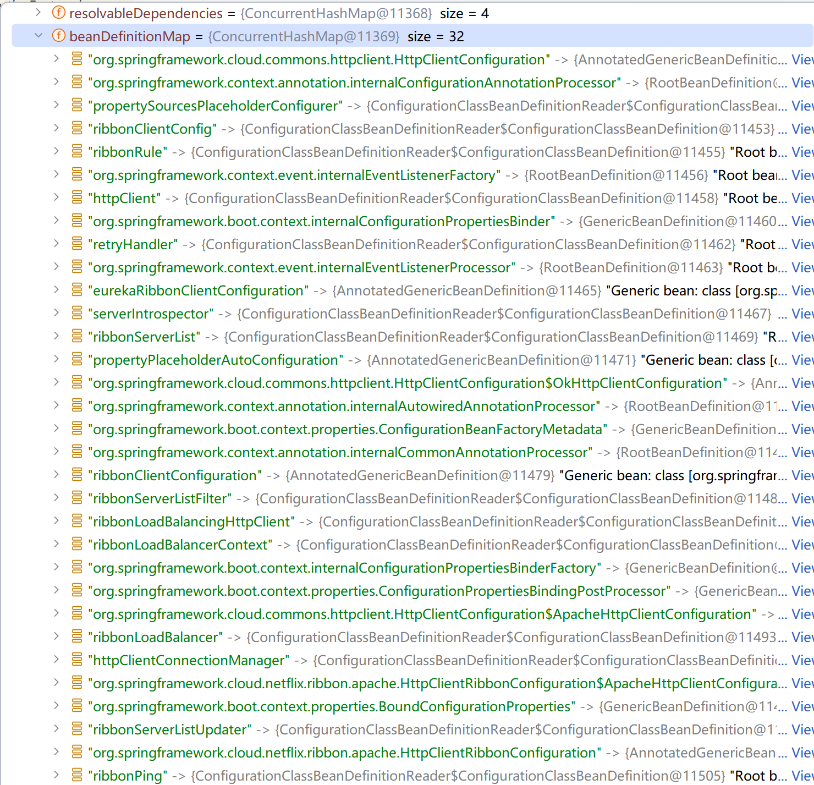
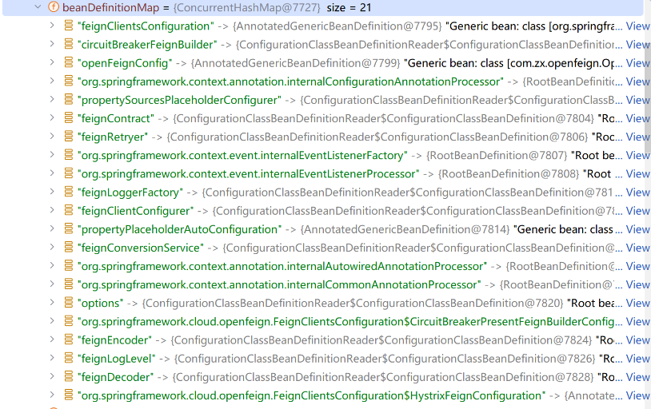

# Feign

## 1.介绍

Spring Cloud OpenFeign 的本质是一种声明式、模板化的HTTP客户端，而不是传统意义上的RPC，它简化了远程调用的编程体验。
在Spring Cloud中使用OpenFeign，开发者可以像调用本地方法一样使用HTTP请求访问远程服务，而无需感知这是在调用远程方法。

注意：OpenFeign只需要在调用方设置，服务提供方不需要，就是一个高级的http客户端。

在项目启动阶段，OpenFeign 框架会自动的扫包流程，从指定的目录下扫描并加载所有被@FeignClient注解修饰的接口。
OpenFeign会针对每一个FeignClient接口生成一个动态代理(JDK)对象，这个动态代理对象会被添加到Spring上下文中，并注入到对应的服务里。

OpenFeign缺点：所以 OpenFeign 只是表面体验好，实际上潜在分险大、代码质量差、架构设计差。
1. 而实现中，通过服务提供方根本不会提供@FeignClient的相关代码，而是需要服务调用方自行定义（包括实体类），这就是一份代码四处。
2. 如果服务提供方提供@FeignClient代码，又会带来其他问题，例如fallback、config、Encoder、Decoder 等这些无法设置了。


Ribbon是一个开源的、基于HTTP和TCP的客户端负载均衡工具，它提供了一个简单的、基于配置的负载均衡策略，其通过在客户端上运行来选择最佳的服务器。
Ribbon提供了多种负载均衡策略，如随机、轮询、最少活跃调用等，可以根据实际需求选择合适的策略。
当客户端连接到服务器后，Ribbon会根据服务器的响应速度、负载情况等因素进行评估，并动态调整选择的服务器。
这种方式可以实现更灵活的负载均衡，提高系统的可用性和性能。

Spring Cloud OpenFeign引入后默认使用Ribbon做负载均衡。高版本中剔除了ribbon，使用LoadBalancer
Feign负责接口调用、请求处理等操作，而 Ribbon 负责实现负责均衡，并主动定时向本地缓存的注册表查询服务列表。

## 2.原理

### 2.1.启动流程

@EnableFeignClients 注解开启Feign。并 import 配置类 FeignClientsRegistrar。

FeignClientsRegistrar 实现了 ImportBeanDefinitionRegistrar 接口。
读取注解的配置，并根据配置扫描包下面所有使用@FeignClient 注解的类，将其封装为beanDefinition注入到spring容器中。
所有的FeignClient都被封装到FeignClientFactoryBean，当实例化的时候，调用getObject()获得客户端代理类。

```java
public void registerFeignClients(AnnotationMetadata metadata, BeanDefinitionRegistry registry) {
	LinkedHashSet<BeanDefinition> candidateComponents = new LinkedHashSet<>();
	ClassPathScanningCandidateComponentProvider scanner = getScanner();
	scanner.setResourceLoader(this.resourceLoader);
	scanner.addIncludeFilter(new AnnotationTypeFilter(FeignClient.class));
	// 扫描包路径，将使用@FeignClient的类，封装为BeanDefinition
	Set<String> basePackages = getBasePackages(metadata);
	for (String basePackage : basePackages) {
		candidateComponents.addAll(scanner.findCandidateComponents(basePackage));
	}
	for (BeanDefinition beanDefinition : candidateComponents) {
		// 注册feign配置。会被转换为FeignClientSpecification实例
		registerClientConfiguration(registry, name, attributes.get("configuration"));
		// 注册feign客户端，注册的类是FeignClientFactoryBean，他会帮我们创建代理类。
		registerFeignClient(registry, annotationMetadata, attributes);
	}
}

private void registerFeignClient(BeanDefinitionRegistry registry, AnnotationMetadata annotationMetadata, Map<String, Object> attributes) {
    String className = annotationMetadata.getClassName();
    // 生成FeignClientFactoryBean这个BeanDefinition构造器
    BeanDefinitionBuilder definition = BeanDefinitionBuilder.genericBeanDefinition(FeignClientFactoryBean.class);

    // 将@FeignClient的注解属性添加到builder
    definition.addPropertyValue("url", getUrl(attributes));
    definition.addPropertyValue("path", getPath(attributes));
    definition.addPropertyValue("fallback", attributes.get("fallback"));
	
    AbstractBeanDefinition beanDefinition = definition.getBeanDefinition();

    // 注册FeignClientFactoryBean
    BeanDefinitionReaderUtils.registerBeanDefinition(holder, registry);
}
```

### 2.2.代理实例化流程
FeignClientFactoryBean#getObject 实例化流程
1. 构建了一个FeignContext上下文。
2. 构建Feign.Builder对象，实际上创建的是HystrixFeign.Builder
3. 调用loadBalance()，
- spring容器中获得client=LoadBalancerFeignClient。
- targeter.target(this, builder, context, target)，HystrixTargeter开始创建代理对象。
- HystrixTargeter 调用 HystrixFeign.builder.target的方法，实例化Feign(类型是ReflectiveFeign)
4. 接下来调用 ReflectiveFeign.instance
- 将方法和 SynchronousMethodHandler 放到methodToHander中
- 创建InvocationHandler, JDK创建动态代理

### 2.3.接口调用流程

- -> 调用代理对象的接口
- -> FeignCircuitBreakerInvocationHandler 根据方法找到对应的SynchronousMethodHandler
- -> 【异步】FeignCircuitBreakerInvocationHandler使用了HystrixCommand 进行熔断器
- -> HystrixCommand 异步调用 SynchronousMethodHandler，将其作为回调函数进行调用。
- RequestInterceptor 调用拦截器。
- -> SynchronousMethodHandler 委托 FeignLoadBalancer 进行接口调用
- -> FeignLoadBalancer 选择一个策略进行负载均衡，选择一个server。
- -> FeignLoadBalancer 调用这个server的接口。
- RequestInterceptor 调用解码器。

SynchronousMethodHandler#invoke -> executeAndDecode()  直接调用接口。

```java
Object executeAndDecode(RequestTemplate template, Options options) throws Throwable {
	Request request = targetRequest(template);
	Response response;
	try {
		// 调用客户端。LoadBalancerFeignClient。
		response = client.execute(request, options);
	} catch (IOException e) {
		throw errorExecuting(request, e);
	}

	// 调用解码器【默认没有解码器，容易导致性能下降】
	if (decoder != null)
		return decoder.decode(response, metadata.returnType());

	// 异步处理响应结果
	CompletableFuture<Object> resultFuture = new CompletableFuture<>();
	asyncResponseHandler.handleResponse(resultFuture, metadata.configKey(), response);
	
	return resultFuture.join();
}
```


LoadBalancerFeignClient#execute。重要最后一行，获得LB，调用请求，获得响应

```java
public Response execute(Request request, Request.Options options) throws IOException {
	return lbClient("服务提供方name").executeWithLoadBalancer(ribbonRequest, requestConfig).toResponse();
}

// 只有两种LB，如果spring引入了 retry 组件，就是RetryableFeignLoadBalancer，否则 FeignLoadBalancer
public FeignLoadBalancer lbClient(String clientName) {
	return this.loadBalancedRetryFactory != null ? new RetryableFeignLoadBalancer() : new FeignLoadBalancer();
}

// FeignLoadBalancer#executeWithLoadBalancer 使用LB执行请求【异步】
public T executeWithLoadBalancer(final S request, final IClientConfig requestConfig) throws ClientException {
	LoadBalancerCommand<T> command = buildLoadBalancerCommand(request, requestConfig);
	return command.submit(
		new ServerOperation<T>() {
			public Observable<T> call(Server server) {
				// server是已经负载均衡好，拿来修改请求中的URL
				URI finalUri = reconstructURIWithServer(server, request.getUri());
				S requestForServer = (S) request.replaceUri(finalUri);
				// 执行ribbon的request请求
				return AbstractLoadBalancerAwareClient.this.execute(requestForServer, requestConfig);
			}
		}).toBlocking().single();
}

// LoadBalancerCommand#submit 
 -> LoadBalancerCommand#selectServer()
 -> LoadBalancerContext#getServerFromLoadBalancer()
 -> LoadBalancerContext#getLoadBalancer() 拿到一个 ZoneAwareLoadBalancer 实例
 -> ZoneAwareLoadBalancer#chooseServer()
 -> BaseLoadBalancer#chooseServer()
 
// 默认采用的是ZoneAvoidanceRule   RandomRule
public Server chooseServer(Object key) {
	return rule.choose(key);
}
```

## 3.源码解析

### 3.1.NamedContextFactory

NamedContextFactory的作用：NamedContextFactory 是Spring的子容器工程类，能够为其集合中的每个元素（如服务名称或客户端名称）创建独立的 ApplicationContext（应用上下文）。
这种机制使得不同的服务或客户端能够拥有完全隔离的 Spring 容器和 Bean 实例，从而避免了不同服务间的配置和 Bean 相互干扰。

[SpringCloud之子容器工厂类NamedContextFactory](https://blog.csdn.net/qq_36851469/article/details/133419595)

```java
public abstract class NamedContextFactory<C extends NamedContextFactory.Specification> implements DisposableBean, ApplicationContextAware {
    // 每个客户端，都是一个AnnotationConfigApplicationContext
	private Map<String, AnnotationConfigApplicationContext> contexts = new ConcurrentHashMap<>();
	private Map<String, C> configurations = new ConcurrentHashMap<>();
	private Class<?> defaultConfigType;
	public NamedContextFactory(Class<?> defaultConfigType, String propertySourceName, String propertyName) {
		this.defaultConfigType = defaultConfigType;
		this.propertySourceName = propertySourceName;
		this.propertyName = propertyName;
	}
}
```

### 3.2.【ribbon】SpringClientFactory

SpringClientFactory 是 NamedContextFactory 的子类。服务于RibbonClient。
```java
public class SpringClientFactory extends NamedContextFactory<RibbonClientSpecification> {
	public SpringClientFactory() {
		super(RibbonClientConfiguration.class, NAMESPACE, "ribbon.client.name");
	}
}
```

SpringClientFactory 全局只有一个，加载的时机是容器启动的时机，通过自动配置类RibbonAutoConfiguration注入到容器中。

SpringClientFactory的作用：
1. 创建独立的Spring应用上下文：为每个Ribbon客户端都创建一个独立的Spring子容器。
   每个子容器只服务于一个Ribbon客户端，子容器中包含了客户端需要的各种bean。
   这样做的好处是实现了不同客户端之间的配置和Bean的隔离，避免了潜在的冲突和干扰。
2. 向RibbonClient提供基础能力：SpringClientFactory提供了一系列方法，如getClient、getClientConfig、getLoadBalancer等。
3. 支持动态配置和更新。因此支持对这些客户端进行动态配置和更新。当服务提供方发生变化，只需要变更该客户端的容器，而无需重启整个应用。

#### 3.2.1.PropertiesFactory

PropertiesFactory 全局只有一个，加载的时机是容器启动的时机，通过自动配置类RibbonAutoConfiguration注入到容器中。

作用：读取ribbon的客户端配置。key规则：服务名称.ribbon.类型关键字(NFLoadBalancerClassName,NFLoadBalancerPingClassName等)

```java
public class PropertiesFactory {

	@Autowired
	private Environment environment;
	private Map<Class, String> classToProperty = new HashMap<>();
	public PropertiesFactory() {
		classToProperty.put(ILoadBalancer.class, "NFLoadBalancerClassName");
		classToProperty.put(IPing.class, "NFLoadBalancerPingClassName");
		classToProperty.put(IRule.class, "NFLoadBalancerRuleClassName");
		classToProperty.put(ServerList.class, "NIWSServerListClassName");
		classToProperty.put(ServerListFilter.class, "NIWSServerListFilterClassName");
	}

	public boolean isSet(Class clazz, String name) {
		return StringUtils.hasText(getClassName(clazz, name));
	}

	public String getClassName(Class clazz, String name) {
		if (this.classToProperty.containsKey(clazz)) {
			String classNameProperty = this.classToProperty.get(clazz);
			String className = 
			//                      服务名称   + ribbon          + 关键字
			environment.getProperty(name + "." + NAMESPACE + "." + classNameProperty);
			return className;
		}
		return null;
	}

	public <C> C get(Class<C> clazz, IClientConfig config, String name) {
		String className = getClassName(clazz, name);
		if (StringUtils.hasText(className)) {
			try {
				Class<?> toInstantiate = Class.forName(className);
				return (C) SpringClientFactory.instantiateWithConfig(toInstantiate,
						config);
			}
			catch (ClassNotFoundException e) {
				throw new IllegalArgumentException("Unknown class to load " + className
						+ " for class " + clazz + " named " + name);
			}
		}
		return null;
	}
}
```

#### 3.2.2.RibbonClientConfiguration

RibbonClientConfiguration是Spring Cloud中用于配置和初始化Ribbon客户端的重要配置类。
它定义了一系列关键的Bean，以支持Ribbon的各种功能，并允许开发者通过自定义配置来满足特定的业务需求。

实例化时机：通过SpringClientFactory 为每个RibbonClient实例化子容器的时候，会去读RibbonClientConfiguration中的定义，
为每个RibbonClient创建一个AnnotationConfigApplicationContext实例，里面主要的组件如下：

1. IClientConfig：客户端配置接口，管理配置参数，如连接超时、读取超时等。
2. IRule：负载均衡策略接口，定义了选择服务实例的规则，如轮询、随机等。
3. IPing：服务可用性检查接口，用于检查服务实例是否可用。
4. ServerListFilter：服务列表过滤机制，用于对可用的服务实例列表进行过滤，以排除不符合条件的实例。
5. ServerList：服务列表
6. ILoadBalancer：负载均衡器，负责在多个服务实例中选择一个进行请求转发。
7. HttpClient：调用Rest服务的客户端，是执行HTTP请求的实际组件。

AnnotationConfigApplicationContext
- 容器名称：SpringClientFactory-服务名称，例如SpringClientFactory-openfeign-provider
- 容器内保存的实例信息如下：全是和ribbon客户端相关的。
  

### 3.3.【feign】FeignContext

与SpringClientFactory相似，SpringClientFactory 是ribbon的子容器管理类。FeignContext是feign子容器管理类。

FeignContext 全局只有一个，加载的时机是容器启动的时机，通过自动配置类 FeignAutoConfiguration 注入到容器中。

```java
public class FeignContext extends NamedContextFactory<FeignClientSpecification> {
	public FeignContext() {
		super(FeignClientsConfiguration.class, "feign", "feign.client.name");
	}
}
```

#### 3.3.1.FeignClientsConfiguration

实例化时机：通过 FeignContext 为每个feign代理对象实例化子容器的时候，会去读FeignClientsConfiguration中的定义，
为每个feign代理对象创建一个AnnotationConfigApplicationContext实例，里面主要的组件如下：

AnnotationConfigApplicationContext
- 容器名称：feign-服务名称，例如feign-openfeign-provider
- 容器内保存的实例信息如下：全是和feign相关的。


### 3.3.2.定时更新服务列表
负载均衡器是 ZoneAwareLoadBalancer，来自RibbonClientConfiguration，当feign接口第一次调用的时候，初始化 ZoneAwareLoadBalancer，并创建规则。

在其被实例化的时候，会创建一个PollingServerListUpdater实例。

在实例化的过程中会启动任务，定时从更新服务注册表。每30s执行一次DynamicServerListLoadBalancer#updateListOfServers

默认是从 DiscoveryClient的本地注册表缓存localRegionApps中查询。
每次都是强制更新ZoneAwareLoadBalancer的服务列表 allServerList

```text
2024-07-17 16:35:41.350 DEBUG 20660 --- [erListUpdater-1] c.n.l.DynamicServerListLoadBalancer      : List of Servers for openfeign-provider obtained from Discovery client: [192.168.56.1:8002, 192.168.56.1:8001]
2024-07-17 16:35:41.350 DEBUG 20660 --- [erListUpdater-1] c.n.l.ZoneAffinityServerListFilter       : Determining if zone affinity should be enabled with given server list: [192.168.56.1:8002, 192.168.56.1:8001]
2024-07-17 16:35:41.350 DEBUG 20660 --- [erListUpdater-1] c.n.l.DynamicServerListLoadBalancer      : Filtered List of Servers for openfeign-provider obtained from Discovery client: [192.168.56.1:8002, 192.168.56.1:8001]
2024-07-17 16:35:41.350 DEBUG 20660 --- [erListUpdater-1] c.netflix.loadbalancer.BaseLoadBalancer  : LoadBalancer [openfeign-provider]: clearing server list (SET op)
2024-07-17 16:35:41.350 DEBUG 20660 --- [erListUpdater-1] c.netflix.loadbalancer.BaseLoadBalancer  : LoadBalancer [openfeign-provider]:  addServer [192.168.56.1:8002]
2024-07-17 16:35:41.350 DEBUG 20660 --- [erListUpdater-1] c.netflix.loadbalancer.BaseLoadBalancer  : LoadBalancer [openfeign-provider]:  addServer [192.168.56.1:8001]
2024-07-17 16:35:41.350 DEBUG 20660 --- [erListUpdater-1] c.n.l.DynamicServerListLoadBalancer      : Setting server list for zones: {defaultzone=[192.168.56.1:8002, 192.168.56.1:8001]}
2024-07-17 16:35:41.350 DEBUG 20660 --- [erListUpdater-1] c.netflix.loadbalancer.BaseLoadBalancer  : LoadBalancer [openfeign-provider_defaultzone]: clearing server list (SET op)
2024-07-17 16:35:41.350 DEBUG 20660 --- [erListUpdater-1] c.netflix.loadbalancer.BaseLoadBalancer  : LoadBalancer [openfeign-provider_defaultzone]:  addServer [192.168.56.1:8002]
2024-07-17 16:35:41.350 DEBUG 20660 --- [erListUpdater-1] c.netflix.loadbalancer.BaseLoadBalancer  : LoadBalancer [openfeign-provider_defaultzone]:  addServer [192.168.56.1:8001]
2024-07-17 16:35:41.350 DEBUG 20660 --- [erListUpdater-1] c.netflix.loadbalancer.BaseLoadBalancer  : LoadBalancer [openfeign-provider]:  forceQuickPing invoking
2024-07-17 16:35:41.350 DEBUG 20660 --- [erListUpdater-1] c.netflix.loadbalancer.BaseLoadBalancer  : LoadBalancer:  PingTask executing [2] servers configured
```

## 4.ribbon配置

主要围绕 RibbonClientConfiguration。每个RibbonClient都有一套自己独立的配置。

1. IClientConfig：客户端配置接口，管理配置参数，如连接超时、读取超时等。
2. IRule：负载均衡策略接口，定义了选择服务实例的规则，如轮询、随机等。
3. IPing：服务可用性检查接口，用于检查服务实例是否可用。
4. ServerListFilter：服务列表过滤机制，用于对可用的服务实例列表进行过滤，以排除不符合条件的实例。
5. ServerList：服务列表
6. ILoadBalancer：负载均衡器，负责在多个服务实例中选择一个进行请求转发。
7. HttpClient：调用Rest服务的客户端，是执行HTTP请求的实际组件。

各个组件协作流程
1. 负载均衡器（Loadbalancer）通过服务实例列表（ServerList）从注册中心（register）或者配置文件（yaml或properties）上读取全部服务实例（server），
2. 然后以服务实例过滤器（ServerListFilter）的过滤方式进行筛选留下满足条件的服务实例，进而借助负载均衡策略（IRule）选择出一个合适的服务实例。
3. 调用HttpClient发生请求。
4. 【异步】IPing后台定时任务，检查服务可用性，并修改ServerList

### 4.1.客户端配置

作用：设置全局的超时时间，以及开启gzip。默认使用DefaultClientConfigImpl，不需要修改
```properties
ribbon.ReadTimeout=1000 		# 默认1000ms
ribbon.ConnectTimeout=1000 	    # 默认1000ms
ribbon.GZipPayload=true		    # 默认true
```

```java
@Bean
public IClientConfig ribbonClientConfig() {
	DefaultClientConfigImpl config = new DefaultClientConfigImpl();
	config.loadProperties(this.name);
	config.set(CommonClientConfigKey.ConnectTimeout, getProperty(CommonClientConfigKey.ConnectTimeout, DEFAULT_CONNECT_TIMEOUT));
	config.set(CommonClientConfigKey.ReadTimeout, getProperty(CommonClientConfigKey.ReadTimeout, DEFAULT_READ_TIMEOUT));
	config.set(CommonClientConfigKey.GZipPayload, DEFAULT_GZIP_PAYLOAD);
	return config;
}
```

### 4.2.负载均衡策略

ribbon内置了7种负载均衡算法
1. RoundRobinRule。简单轮询服务列表来选择服务器
2. AvailabilityFilteringRule。先过滤掉故障实例，再选择并发较小的实例，3台以上生效。
   1. 在默认情况下，这台服务器如果3次连接失败，这台服务器就会被设置为“短路”状态。可以通过修改配置loadbalancer.connectionFailureCountThreshold失败次数。默认是3次。
   2. 并发数过高的服务。可以设置ActiveConnectionsLimit并发上线。
3. WeightedResponseTimeRule。带权重的轮询。自动计算权重，服务器响应时间越长，这个服务器的权重就越小。这个规则会随机选择服务器，这个权重值会影响服务器的选择。
4. ZoneAvoidanceRule(默认)。本质是IP哈希，以区域可用的服务器为基础进行服务器的选择。该策略能够在多区域环境下选出 最佳区域的实例进行访问
5. BestAvailableRule。最少连接数
6. RandomRule。随机。
7. Retry。重试机制


```properties
# 1.设置全局策略
ribbon.NFLoadBalancerRuleClassName: com.netflix.loadbalancer.RandomRule

# 2.单独为openfeign-provider一个服务设置策略
openfeign-provider.ribbon.NFLoadBalancerRuleClassName: com.netflix.loadbalancer.RandomRule
```

```java
@Bean
public IRule ribbonRule(IClientConfig config) {
	if (this.propertiesFactory.isSet(IRule.class, name)) {
		return this.propertiesFactory.get(IRule.class, config, name);
	}
	ZoneAvoidanceRule rule = new ZoneAvoidanceRule();
	rule.initWithNiwsConfig(config);
	return rule;
}
```

### 4.3.IPing

Ribbon的IPing机制主要用于检查服务节点（即服务实例）的存活状态，以确保负载均衡器只将请求分发给可用的服务实例。

使用场景
1. 在生产环境中，通常会使用与Eureka集成的NIWSDiscoveryPing来确保服务实例的可用性；
2. 测试或开发环境中，可以使用DummyPing或NoOpPing来简化配置和加快启动速度。

IPing提供的实现：
1. DummyPing
    - 作用：默认实现，默认返回true，即认为所有服务实例都是可用的。这种实现实际上并不执行任何检查，而是简单地假设所有服务实例都是健康的。
    - 适用场景：在测试环境或当服务实例的可用性不需要实时检查时可以使用。
2. NIWSDiscoveryPing（在Spring Cloud + Eureka环境下）
   - 作用：与Eureka服务发现集成，通过Eureka的客户端健康检查来确定服务实例的可用性。当Eureka认为服务实例在线时，NIWSDiscoveryPing也会认为该实例是可用的。
   - 适用场景：在Spring Cloud微服务架构中，当使用Eureka作为服务注册与发现中心时，NIWSDiscoveryPing是首选的IPing实现。
3. PingUrl
   - 作用：通过发送HTTP请求到服务实例的特定URL来检查其可用性。如果请求成功，则认为服务实例是可用的；否则，认为服务实例不可用。
   - 适用场景：当需要更精确地控制服务实例的健康检查逻辑时，可以使用PingUrl。例如，可以配置一个特定的健康检查端点，该端点返回服务实例的当前状态。
4. NoOpPing
   - 作用：与DummyPing类似，但通常用于特定的配置或测试场景，其中可能不希望执行任何实际的检查。
   - 适用场景：在测试或开发环境中，当需要快速启动并运行服务而不关心服务实例的实际可用性时。


```properties
# 1.设置全局策略
ribbon.NFLoadBalancerPingClassName: com.netflix.loadbalancer.DummyPing

# 2.单独为openfeign-provider一个服务设置
openfeign-provider.ribbon.NFLoadBalancerPingClassName: com.netflix.loadbalancer.DummyPing
```

```java
@Bean
public IPing ribbonPing(IClientConfig config) {
   if (this.propertiesFactory.isSet(IPing.class, name)) {
      return this.propertiesFactory.get(IPing.class, config, name);
   }
   return new DummyPing();
}
```

### 4.4.ServerList

服务实例列表（ServerList）为负载均衡器（Loadbalancer）提供服务的可用实例列表。

在RibbonClientConfiguration这种默认采用ConfigurationBasedServerList，但是如果使用eureka，
会默认使用DiscoveryEnabledNIWSServerList的子类DomainExtractingServerList。通常不用但是设置。

1. StaticServerList
   - 作用：通过静态配置来维护服务实例列表。它不会动态地更新服务实例列表，而是始终返回在初始化时配置的服务实例列表。
   - 适用场景：适用于服务实例数量较少且不会频繁变动的场景，或者在某些特定的测试环境中。
2. ConfigurationBasedServerList
   - 作用：通过配置文件（如YAML或Properties文件）中的参数来实现ServerList。它允许从配置文件中读取服务实例列表，并且可以根据配置文件的更新来动态地更新服务实例列表。
   - 适用场景：适用于服务实例列表相对稳定，但偶尔需要调整的场景。通过修改配置文件并重启服务，可以轻松地更新服务实例列表。
3. DiscoveryEnabledNIWSServerList（通常与Eureka结合使用）
   - 作用：通过Eureka的服务发现机制来实现ServerList。它会自动从Eureka注册中心获取服务实例列表，并根据Eureka的更新来动态地更新服务实例列表。
   - 适用场景：在Spring Cloud微服务架构中，当使用Eureka作为服务注册与发现中心时，DiscoveryEnabledNIWSServerList是首选的ServerList实现。它提供了高度的动态性和灵活性，能够自动地适应服务实例的增减和变化。

### 4.5.ServerListFilter

服务实例过滤器（ServerListFilter）为负载均衡器（Loadbalancer）提供从服务实例列表（ServerList）获取的服务实例过滤出符合要求的服务实例。
类似于DNS的就近原则。找到最近的zone中的服务。

- ZoneAffinityServerListFilter     区域相关性筛选服务实例列表过滤器
- ZonePreferenceServerListFilter   首选本地区域服务实例列表过滤器。默认策略，eureka中默认zone=us-east-1
- ServerListSubsetFilter           服务实例数限制为所有服务实例的子集 筛选过滤器

### 4.6.ILoadBalancer

在ribbon中只有一个实现类：ZoneAwareLoadBalancer

它对外提供统一的选择服务器（Server）的功能。此接口会根据不同的负载均衡策略（通过IRule接口实现）选择合适的Server返回给使用者。其主要方法和作用包括：
- addServers(List<Server> newServers): 向负载均衡器中添加新的服务实例列表。
- chooseServer(Object key): 根据给定的key（通常用于区分不同的服务调用）和负载均衡策略，从服务实例列表中选择一个Server。
- markServerDown(Server server): 将指定的服务实例标记为不可用状态。
- getReachableServers(): 获取当前可用的服务实例列表。
- getAllServers(): 获取所有服务实例列表，无论其是否可用。


1. BaseLoadBalancer是ZoneAwareLoadBalancer的父类（抽象类） 
   - 作用：提供LB基本功能，BaseLoadBalancer维护了两个服务实例列表：allServerList（所有服务实例）和upServerList（正常服务的实例）。
       它还负责服务实例的定时探活（通过IPing接口实现）和负载均衡策略的选择（通过IRule接口实现）。
   - 特点：提供了负载均衡器的基本框架和功能，如服务列表的维护、服务状态的检测以及负载均衡策略的应用等。
2. ZoneAwareLoadBalancer
   - 作用：ZoneAwareLoadBalancer在基本功能的基础上增加了区域感知（Zone Awareness）的能力。它可以根据服务的区域信息来优化负载均衡决策，比如优先选择与客户端处于同一区域的服务实例。
   - 特点：通过实现更复杂的负载均衡逻辑，如区域优先、服务器过滤等，来提高系统的可用性和性能。

### 4.7.HttpClient

ribbon和feign都提供了客户端设置功能，但是feign提供的功能会比较全，并支持连接池。所以推荐设置feign的客户端。

### 4.8.饥饿加载
我们在启动服务使用Ribbon发起服务调用的时候往往会出现找不到目标服务的情况，
这是因为Ribbon在进行客户端负载均衡的时候并不是启动时就创建好的，而是在实际请求的时候才会去创建，
所以往往我们在发起第一次调用的时候会出现超时导致服务调用失败，我们可以通过设置Ribbon的饥饿加载来改善此情况，
即在服务启动时就把Ribbon相关内容创建好。

```properties
ribbon.eager-load.enabled=true #开启饥饿加载
ribbon.eager-load.clients=user-server #针对于哪些服务需要饥饿加载
```

### 4.9.案例

```yaml
ribbon:
  MaxAutoRetries: 2                 #最大重试次数，当Eureka中可以找到服务，但是服务连不上时将会重试
  MaxAutoRetriesNextServer: 3       #切换实例的重试次数
  OkToRetryOnAllOperations: false   #对所有操作请求都进行重试，如果是get则可以，如果是post，put等操作没有实现幂等的情况下是很危险的,所以设置为false
  #设置feign客户端连接所用的超时时间，适用于网络状况正常情况下，两端连接所用时间
  # feign的超时时间优先级大于ribbon
  ConnectTimeout: 5000              #请求连接的超时时间
  ReadTimeout: 6000                 #请求处理的超时时间
  eager-load:
    enabled: true #开启饥饿加载
    clients: openfeign-provider #针对于哪些服务需要饥饿加载

## 单独设置 服务 openfeign-provider 的负载均衡策略
openfeign-provider:
  ribbon:
    NFLoadBalancerRuleClassName: com.netflix.loadbalancer.RandomRule
```

## 5.feign配置

### 5.1.客户端选择

其实开始ribbon的功能。通过配置 spring-cloud-openfeign-core 中的自动配置类 FeignLoadBalancerAutoConfiguration
引入了4种可被选择的客户端，通过配置可以开启使用。他们创建的LB客户端都是LoadBalancerFeignClient

```java
@Import({ HttpClientFeignLoadBalancedConfiguration.class, 
		OkHttpFeignLoadBalancedConfiguration.class,  // 推荐使用OkHttp
		HttpClient5FeignLoadBalancedConfiguration.class,
		DefaultFeignLoadBalancedConfiguration.class  // 默认客户端，使用jdk提供的api。性能较差。
})
public class FeignRibbonClientAutoConfiguration {}


@ConditionalOnProperty("feign.okhttp.enabled")
@Import(OkHttpFeignConfiguration.class)
class OkHttpFeignLoadBalancedConfiguration {
	@Bean
	public Client feignClient(CachingSpringLoadBalancerFactory cachingFactory,
			SpringClientFactory clientFactory, okhttp3.OkHttpClient okHttpClient) {
		OkHttpClient delegate = new OkHttpClient(okHttpClient);
		return new LoadBalancerFeignClient(delegate, cachingFactory, clientFactory);
	}
}
```

在创建feign代理对象的时候，从spring 容器中获得LoadBalancerFeignClient注入到SynchronousMethodHandler中。

### 5.2.使用配置配

可以全局配置或者单个接口配置，也可以使用配置文件。

```java
public class OpenFeignConfig {

    /**
     * 设置日志输出的内容【debug级别生效】
     * NONE：        默认，不显示任何日志；【性能最佳，适合于生产】
     * BASIC:       仅记录请求方法、URL、响应状态码及执行时间；【适用于生产环境定位测试问题】
     * HEADERS：     除了BASIC中定义的信息之外，还有请求头和响应头信息；
     * FULL：        除了HEADERS中定义的信息之外，还有请求的正文和响应数据。【本地开发环境使用】
     * @return
     */
    @Bean
    Logger.Level feignLogLevel() {
        return Logger.Level.NONE;
    }

    /**
     * 设置各类超时时间
     * @return
     */
    @Bean
    public Request.Options options() {
        return new Request.Options(
                1L, TimeUnit.SECONDS,
                1L, TimeUnit.SECONDS,
                true);
    }

    /**
     * 重试机制，默认情况下，当请求的接口出现异常不会进行重试。
     * @return
     */
    @Bean
    public Retryer feignRetryer() {
        return new Retryer.Default(100,
                TimeUnit.SECONDS.toMillis(1),
                2); //重试次数，间隔时间，最大时间
    }

    /**
     * 自定义拦截器【可以多个】
     * @return
     */
    @Bean
    public RequestInterceptor headerRequestInterceptor() {
        return template -> {
            template.header("X-API-TOKEN", "666666");
        };
    }
}
```


