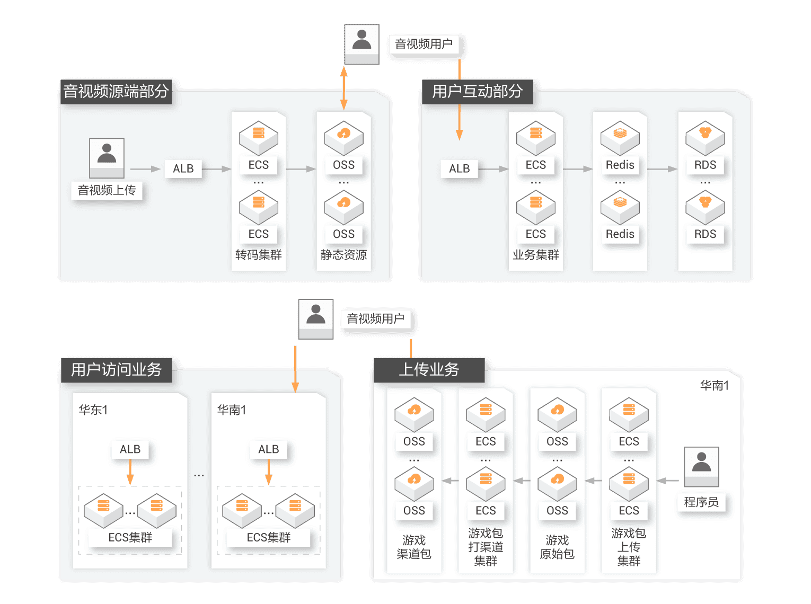
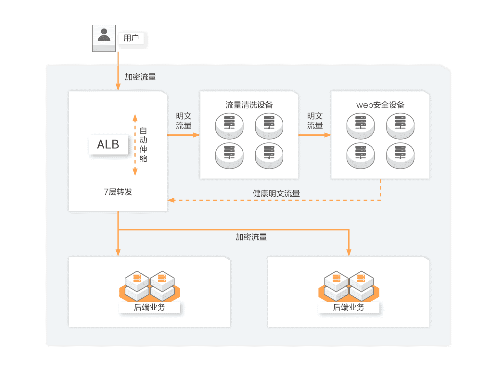
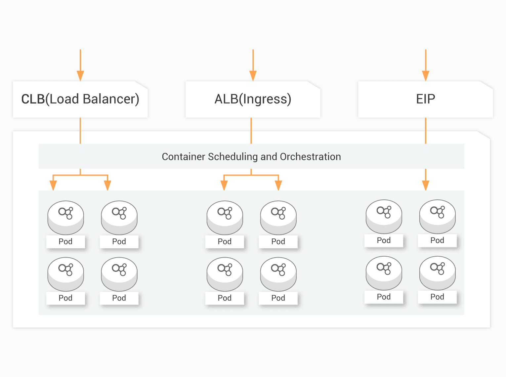
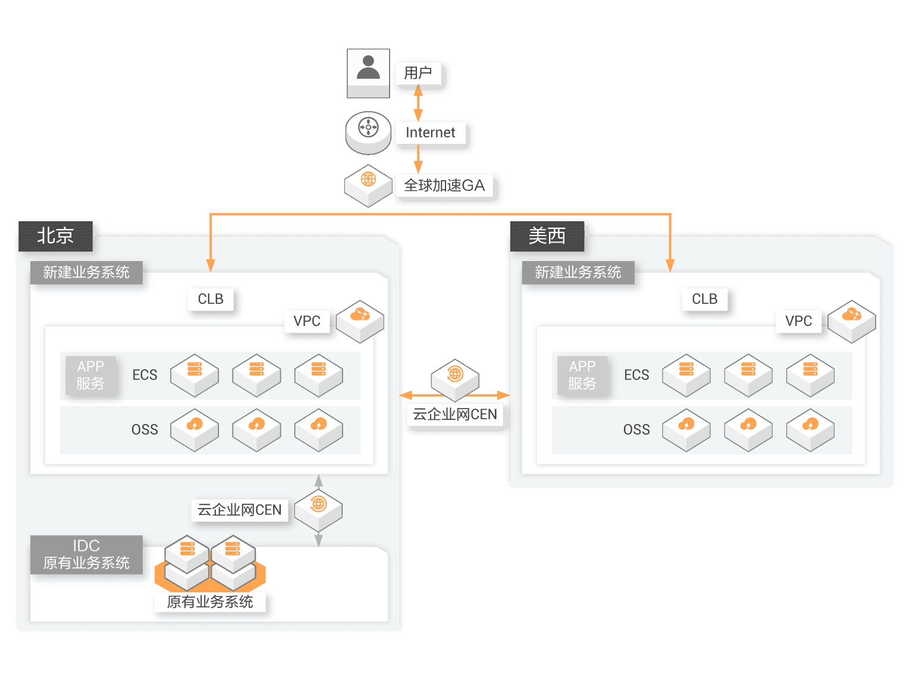
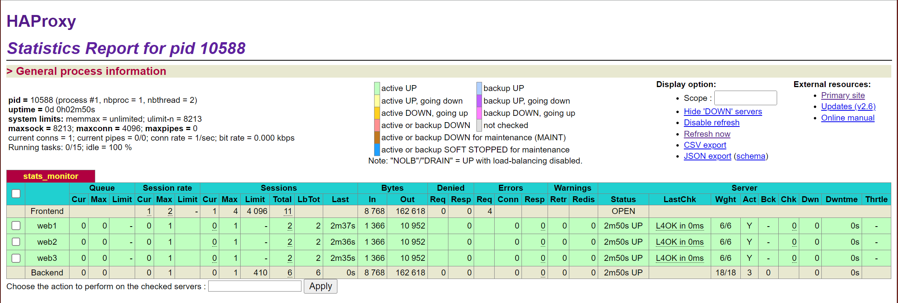
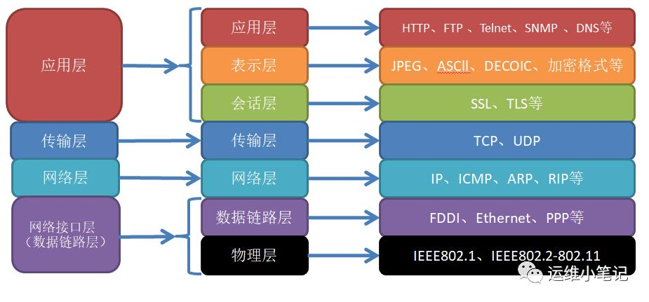

# 负载均衡

## 1.负载均衡

### 1.1.什么是负载均衡

负载均衡，（Load Balance），其含义就是指将负载（工作任务）进行平衡、分摊到多个操作单元上进行运行，例如FTP服务器、Web服务器、企业核心应用服务器和其它主要任务服务器等，从而协同完成工作任务。
负载均衡构建在原有网络结构之上，它提供了一种透明且廉价有效的方法扩展服务器和网络设备的带宽、加强网络数据处理能力、增加吞吐量、提高网络的可用性和灵活性。

### 1.2.分类

- 按照实现方式分为： 物理负载均衡器（Hardware Load Balancer）和虚拟负载均衡器（Virtual Load Balancer）。
    - 物理负载均衡器一般是由厂商提供的闭源产品，例如F5，主要用于IP分发
    - 虚拟负载均衡器则有开源的选项，目前流行的开源软负载有HAProxy、Nginx、Keepalived等
- 按照作用于七层网络模型的，分为： 二层、三层、四层、七层负载
- 负载实现位置的不同，分为：服务端负载、客户端负载

### 1.3.SLB

SLB（Server Load Balancer）：在多个提供相同服务的服务器的情况下，负载均衡设备存在虚拟服务地址，当大量客户端从外部访问虚拟服务IP地址时， 
负载均衡设备将这些报文请求根据负载均衡算法，将流量均衡的分配给后台服务器以平衡各个服务器的负载压力，避免在还有服务器压力较小情况下其他服务达到性能临界点出现运行缓慢甚至宕机情况，从而提高服务效率和质量。

因此对客户端而言，RS（real server 实际服务器）的IP地址即是负载均衡设备VIP（虚拟服务地址IP）地址，真正的RS服务器IP地址对于客户端是不可见的。

负载均衡和反向代理的真实区别：https://mp.weixin.qq.com/s/hx9rAxziY0zk4Hv7lrVFug

### 1.4.使用场景

SLB技术是如今IT设备中必不可少的重要组成。当前市场中公有云都提供了SLB服务，以阿里云为例，提供了三种SLB技术。[https://www.aliyun.com/product/slb](https://www.aliyun.com/product/slb)
- 面向4层的网络型负载均衡NLB。单实例最大支持1亿并发连接。
  - 场景1:四层大流量高并发业务场景
  - 场景2:物联网、车联网等IoT业务入口
  - 场景3:多活容灾、IDC云上出入口场景
- 面向7层的应用型负载均衡ALB。单实例最大支持100万QPS
  - 场景1:互联网应用7层高性能自动弹性负载均衡场景
  - 场景2:音视频应用大流量低时延负载均衡场景
  - 场景3:云原生应用金丝雀蓝绿发布负载均衡场景  
- 传统型负载均衡CLB。单实例最大支持100万并发、5万QPS
  - 场景1:网站/系统同地域高可靠负载均衡场景
  - 场景2:四层流量大并发业务负载均衡场景
  - 场景3：同城双活/跨地域容灾负载均衡场景
  
#### 1.4.1.音视频/游戏等大并发流量场景

- 业务需求。
音视频/游戏等行业经常面临突发访问，海量流量，后端服务压力大。如短视频/长视频/直播/在校教育/游戏等业务中，由于服务端与用户端之间需要实时大量的互动。
因此，用户流量非常大，而音视频业务的波峰波谷效应明显，这对整个系统的性能、弹性、稳定性和可用性带来了巨大的挑战，需要使用负载均衡进行流量分发。
- 功能需求。
  - 需要单实例100万QPS的性能。
  - 弹性伸缩。随业务而动的灵活弹性。无需根据业务峰值预测，无需人工调整，根据业务流量自动弹性伸缩
  - 应用传输协议。QUIC应用传输协议支持，针对视频业务更加高效流畅，提升首屏打开速度



#### 1.4.2.零售/金融/企业等弹性高可靠场景
- 业务需求。
新零售新金融业务变化快，新业务上线、老业务调整时常发生，大促大型活动常态化；因此，对即开即用网络，快速交付能力，弹性伸缩能力，
安全可靠、灵活计费等需求显著，需要使用负载均衡搭建高可靠架构。
- 功能需求。
  - 即开即用。无需漫长的硬件搭建准备，无需依赖物理设施。即开即用，按需付费，灵活高效
  - 弹性伸缩。随业务而动的灵活弹性。无需根据业务峰值预测，无需人工调整，轻松应对大促大型活动流量峰值
  - 安全可靠。提供四级高可用容灾，并集成DDoS、WAF，为业务安全保驾护航



#### 1.4.3.云原生网络应用场景

- 业务需求。
随着云原生逐步成熟，互联网/金融/企业等诸多行业新建业务时选择云原生部署，或对现有业务进行云原生化改造。无论是使用阿里云ACK/ASK/SAE还是开源K8S，云原生网络均可用到负载均衡服务来实现流量调度。
- 功能需求。
  - 天生云原生。与ACK/SAE/K8S深度集成，是阿里云官方云原生Ingress网关
  - 完善的API能力。负载均衡提供完善的API能力，支持GRPC协议，实现海量微服务间的高效API通信



#### 1.4.4.跨地域网络应用场景

- 业务需求。
跨地域跨可用区的容灾方案。互联网/金融/企业等业务逐步遍及全球，需要将不同地域用户智能调度访问到相应的业务系统，为了降本增效，线下IDC业务需要与云上业务互通，需要使用负载均衡构建跨地域或混合云容灾架构。
- 功能需求。
  - 全Region支持。智能判断提供最佳的访问解析地址，使访问用户获得最快捷、最流畅的体验
  - 多层次容灾。SLB提供跨地域的高可用，可实现多可用区级的高可用
  - 简单易用。与云企业网一起，简单快速构建全球多地域网络，轻松将线下IDC与云上服务打通。



## 2.负载均衡算法

[代码案例](https://gitee.com/luckSnow/knowledge/tree/master/learn_code/src/main/java/com/zx/_09_%E6%9E%B6%E6%9E%84/load_balance)

- 轮询：顾名思义
- 随机：顾名思义  
- hash：跟请求的某个指标进行hash运算，使得同类型请求都命中到同一个服务上
- 加权：顾名思义。按照比重实现。实现的方案有很多
- 平滑加权轮询：加权的升级版，使得请求安装固定的规律进行负载均衡
- 最小连接数：请求发送到处理请求数最小的服务上。

## 3.虚拟负载技术

- Nginx
    - 优点：开源软件，简单易部署；功能强大，支持四层和七层负载。
    - 缺点：仅支持http，https，Email协议；对后端服务器的检测，仅通过IP+端口来检查，不可以通过URL来检查；不支持会话session保持的一致行，但可以通过IP+HASH来解决。
- LVS
    - 优点：工作在4层，仅做分发作用，没有流量产生，因此。负载性能最强，对内存和cpu消耗率更低；
    - 缺点：不支持正则表达式，不支持动静分离。
- haproxy
    - 优点：支持session会话保持一致，四层和七层都支持；支持通过URL来检测后端服务器的状态。
    - 缺点：在七层转发支持上，不如nginx强大。所有一般用来进行四层负载
- F5
    - 硬件级别的负载，主要用于IP分发，算是四层负载，功能相对单一，但是性能强劲。功能与LVS相似
- DNS
    - 对外公网IP地址的分发，算是四层负载。
- 客户端负载
    - Ribbon
    - LoadBalancer
    
本质上几乎所有的分布式技术，都会使用到拒载均衡，比如
- Rpc调用，一般都使用的客户端负载均衡算法
- 分布式定时任务，服务端负载均衡，找到唯一可以执行任务的服务
- MQ，发送/消费消息，确保服务器资源不浪费，确保消费能力跟得上生产


### 3.1.DNS

- DNS如何实现全局负载均衡？ [https://www.zhihu.com/question/29787004](https://www.zhihu.com/question/29787004)
- DNS域名解析： [https://blog.csdn.net/cywosp/article/details/38017027](https://blog.csdn.net/cywosp/article/details/38017027)

这里简单介绍。

1. 全局的运营商+区域层面的负载均衡，主要功能是就近原则的调度
2. 机房或集群内部的负载均衡，主要实现流量均摊、合理利用资源等

第二种可以实现简单的轮询、连接数均衡，可以做成复杂的使用服务能力评估的平衡。


### 3.2.Nginx
详情看nginx。

### 3.3.LVS

### 3.4.haproxy

- [HAProxy---高性能负载均衡软件](https://zhuanlan.zhihu.com/p/463894630)
- [HAProxy---搭建HAproxy+KeepAlived高可用负载均衡系统](https://zhuanlan.zhihu.com/p/464073418)
- [Docker实战-使用HAProxy实现4层的负载均衡](https://blog.csdn.net/inthirties/article/details/126621470)
- [Docker实战-使用NGINX实现4层的负载均衡](https://blog.csdn.net/inthirties/article/details/126604925)

HAProxy是一个高性能、高可用性的TCP和HTTP负载均衡器，它可以通过Round-robin、Least-connection、IP-hash等算法来进行流量分发，支持SSL和IPv6协议。
HAProxy是一款真正的开源软件，其源代码托管在GitHub上，可以自由地使用和修改，也可以根据需要定制开发。

### 3.4.1.特点
- 可以作为一款专业的负载均衡软件
- 可靠性和稳定性非常好，可以与硬件级的F5负载均衡设备相媲美
- 最高支持4~5W并发，QPS支持到2W，最大数据处理能力可达10Gbps
- 支持至少8种负载均衡算法，同时也支持session保持
- 支持虚拟主机功能，这样实现Web负载均衡更加灵活
- HAProxy1.3版本后开始支持连接拒绝、全透明代理等功能，这些功能是其他负载均衡器所不具备的。
- HAProxy拥有一个功能强大的服务器状态监控页面，通过此页面可以实时了解系统的运行状况。
- HAProxy拥有功能强大的ACL支持，能给使用者带来很大方便。
- HAProxy是借助于操作系统的技术特性来实现性能最大化的，因此，在使用HAProxy时，对操作系统进行性能调优是非常重要的。
  在业务系统方面，HAProxy非常适用于那些并发量特别大且需要持久连接或七层处理机制的Web系统，例如门户网站或电商网站等。
- HAProxy可用于Mysql数据库（读操作）的负载均衡。

### 3.4.2.HAProxy与LVS的异同
1. 两者都是软件负载均衡产品，但是LVS是基于Linux操作系统实现的一种软负载均衡，而HAProxy是基于第三应用实现的软负载均衡。
2. LVS是基于四层的IP负载均衡技术，而HAProxy是基于四层和七层技术、可提供TCP和HTTP应用的负载均衡综合解决方案。
3. LVS工作在ISO模型的第四层，因此其状态监测功能单一，而HAProxy在状态监测方面功能强大，可支持端口、URL、脚本等多种状态检测方式。
4. HAProxy虽然功能强大，但是整体处理性能低于四层模式的LVS负载均衡，而LVS拥有接近硬件设备的网络吞吐和连接负载能力。

综上所述，HAProxy和LVS各有优缺点，没有好坏之分，要选择哪个作为负载均衡器，要以实际的应用环境来决定。

### 3.4.3.安装
```shell
下载（选择最新的版本）： https://www.haproxy.org/ 
上传服务器后解压：      tar -zxvf haproxy-2.6.15.tar.gz

## 设置编译并安装
make TARGET=linux-glibc  PREFIX=/data/soft/haproxy
make install PREFIX=/data/soft/haproxy

## 创建配置文件目录与日志目录
mkdir  /data/soft/haproxy/conf
mkdir  /data/soft/haproxy/logs

## haproxy默认不创建配置文件目录和日志目录，这里是创建haproxy配置文件目录和日志文件目录
## haproxy安装完成后，默认安装目录中没有配置文件，这里是将源码包里面的示例配置文件拷贝到配置文件目录。
cp examples/option-http_proxy.cfg /data/soft/haproxy/conf/haproxy.cfg
```

hapaoxy默认没有日志输出功能，所以需要我们额外的配置。
注意:rsyslog 写日志的权限很小，所以日志必须在/var/log目录下。如果创建了目录的话需要将整个路径所有的目录都分配权限： chmod 777 -R /aa/bb
```shell
rsyslog是linux系默认的日志输出系统，配置文件为/etc/rsyslog.conf，此主配置文件默认会读取/etc/rsyslog.d/*.conf目录下所有已.conf结尾的文件。
[root@localhost logs]# cat /etc/rsyslog.conf|grep IncludeConfig
$IncludeConfig /etc/rsyslog.d/*.conf
因此，这里我们为haproxy单独创建一个独立的配置文件，将文件命名为haproxy.conf，并放到/etc/rsyslog.d目录下，然后添加如下内容：
$ModLoad imudp
$UDPServerRun 514
local0.* /var/log/haproxy.log
&~ #如果不加这个配置，则除了在/var/log/haproxy.log中写入日志外，也会将haproxy日志写入message文件中。

操作如下：
cat /etc/rsyslog.conf|grep IncludeConfig
$IncludeConfig /etc/rsyslog.d/*.conf
vim /etc/rsyslog.d/haproxy.conf
$ModLoad imudp
$UDPServerRun 514
local0.*     /var/log/haproxy.log
&~
```
配置rsyslog的主配置文件，开启远程日志
```shell
打开 /etc/sysconfig/rsyslog文件，将SYSLOGD_OPTIONS修改为如下内容：
SYSLOGD_OPTIONS="-c 2 -r -m 0"
其中：
-c 2 使用兼容模式，默认是 -c 5。
-r 开启远程日志。
-m 0 标记时间戳。单位是分钟，为0时，表示禁用该功能。
```
重启rsyslog服务
```shell
配置完成后，需要重启rsyslog服务，以保证配置生效。
systemctl restart rsyslog
```

### 3.4.4.HAProxy负载均衡器算法与使用技巧
1. HAProxy支持的负载均衡算法
    - roundrobin，表示简单的轮询，负载均衡基础算法(静态web系统)
    - static-rr，表示根据权重（静态web系统）
    - leastconn，表示最少连接者先处理（db系统）
    - source，表示根据请求源IP（动态web系统）
    - uri，表示根据请求的URI；
    - url_param，表示根据请求的URl参数来进行调度
    - hdr(name)，表示根据HTTP请求头来锁定每一次HTTP请求；
    - rdp-cookie(name)，表示根据据cookie(name)来锁定并哈希每一次TCP请求。
2. 常用的负载均衡算法
    - 轮询算法：roundrobin
    - 根据请求源IP算法：source
    - 最少连接者先处理算法：lestconn

### 3.4.5.配置文件详解
HAProxy配置文件根据功能和用途，主要有5个部分组成，但有些部分并不是必须的，可以根据需要选择相应的部分进行配置。
- global部分:用来设定全局配置参数，属于进程级的配置，通常和操作系统配置有关。
- defaults部分:默认参数的配置部分。在此部分设置的参数值，默认会自动被引用到下面的frontend、backend和listen部分中。
  因此，如果某些参数属于公用的配置，只需在defaults部分添加一次即可。而如果在frontend、backend和listen部分中也配置了与defaults部分一样的参数，
  那么defaults部分参数对应的值自动被覆盖。
- frontend部分：此部分用于设置接收用户请求的前端虚拟节点。frontend是在HAProxy1.3版本之后才引入的一个组件，同时引入的还有backend组件。
  通过引入这些组件，在很大程度上简化了HAProxy配置文件的复杂性。frontend可以根据ACL规则直接指定要使用的后端backend。
- backend部分：此部分用于设置集群后端服务集群的配置，也就是用来添加一组真实服务器，以处理前端用户的请求。添加的真实服务器类似于LVS中的real server节点。
- listen部分：此部分是frontend部分和backend部分的结合体。在HAProxy1.3版本之前，HAProxy的所有配置选项都在这个部分中设置。
  为了保持兼容性，HAProxy新的版本仍然保留了listen组件的配置方式。目前在HAProxy中，两种配置方式任选其一即可。

配置案例
```shell
global
    log 127.0.0.1 local0 info
    maxconn 4096
    user nobody
    group nobody
    daemon
    pidfile /data/soft/haproxy/logs/haproxy.pid
defaults
    mode http
    retries 3
    timeout connect 10s
    timeout client 20s
    timeout server 30s
    timeout check 5s
#-------------
#Stats monitor
#-------------
listen stats_monitor
    bind 0.0.0.0:9188
    mode http
    log 127.0.0.1 local0 err
    stats refresh 30s
    stats uri /haproxy-status
    stats realm welcome login\ Haproxy
    stats auth admin:admin~!@
    stats hide-version
    stats admin if TRUE
#--------------------
#Application
#--------------------  
    bind    *:8080
    mode    http
    balance roundrobin
    server  web1 192.168.3.51:9001 cookie server1 weight 6 check inter 2000 rise 2 fall 3
    server  web2 192.168.3.52:9001 cookie server2 weight 6 check inter 2000 rise 2 fall 3
    server  web3 192.168.3.53:9001 cookie server3 weight 6 check inter 2000 rise 2 fall 3   
```

```shell
# 1.global部分
global
    log 127.0.0.1 local0 info
    maxconn 4096
    user nobody
    group nobody
    daemon
    nbproc 1   ## 2.5以上不支持这个配置，删除即可
    pidfile /data/soft/haproxy/logs/haproxy.pid
下面介绍每个选项的含义。
    log：全局的日志配置，local0是日志设备，info表示日志级别。其中日志级别有err、warning、info、debug四种可选。这个配置表示使用127.0.0.1上的rsyslog服务中的local0日志设备，记录日志等级为info。
    maxconn：设定每个haproxy进程可接受的最大并发连接数，此选项等同于Linux命令行选项“ulimit  -n”。
    user/ group：设置运行haproxy进程的用户和组，也可使用用户和组的uid和gid值来替代。
    daemon：设置HAProxy进程进入后台运行。这是推荐的运行模式。
    nbproc：设置HAProxy启动时可创建的进程数，此参数要求将HAProxy运行模式设置为“daemon”，默认只启动一个进程。根据使用经验，该值的设置应该小于服务器的CPU核数。创建多个进程，能够减少每个进程的任务队列，但是过多的进程可能会导致进程的崩溃。
    pidfile：指定HAProxy进程的pid文件。启动进程的用户必须有访问此文件的权限。

# 2.defaults部分
defaults
    mode http
    retries 3
    timeout connect 10s
    timeout client 20s
    timeout server 30s
    timeout check 5s

    mode：设置HAProxy实例默认的运行模式，有tcp、http、health三个可选值。
    tcp模式：在此模式下，客户端和服务器端之间将建立一个全双工的连接，不会对七层报文做任何类型的检查，默认为tcp模式，经常用于SSL、SSH、SMTP等应用。
    http模式：在此模式下，客户端请求在转发至后端服务器之前将会被深度分析，所有不与RFC格式兼容的请求都会被拒绝。
    health模式：目前此模式基本已经废弃，不在多说。
    retries：设置连接后端服务器的失败重试次数，连接失败的次数如果超过这里设置的值，HAProxy会将对应的后端服务器标记为不可用。此参数也可在后面部分进行设置。
    timeout connect：设置成功连接到一台服务器的最长等待时间，默认单位是毫秒，但也可以使用其他的时间单位后缀。
    timeout client：设置连接客户端发送数据时最长等待时间，默认单位是毫秒，也可以使用其他的时间单位后缀。
    timeout server：设置服务器端回应客户度数据发送的最长等待时间，默认单位是毫秒，也可以使用其他的时间单位后缀。
    timeout check：设置对后端服务器的检测超时时间，默认单位是毫秒，也可以使用其他的时间单位后缀。    
  
# 3.frontend部分
frontend www
    bind *:80
    mode   http
    option  httplog
    option  forwardfor
    option  httpclose
    log     global
    default_backend htmpool
    
这部分通过frontend关键字定义了一个名为“www”的前端虚拟节点，下面介绍每个选项的含义。
  bind：此选项只能在frontend和listen部分进行定义，用于定义一个或几个监听的套接字。bind的使用格式为：
  bind [<address>:<port_range>]  interface  <interface>
  其中，address为可选选项，其可以为主机名或IP地址，如果将其设置为“*”或“0.0.0.0”，将监听当前系统的所有IPv4地址。port_range可以是一个特定的TCP端口，也可是一个端口范围，小于1024的端口需要有特定权限的用户才能使用。interface为可选选项，用来指定网络接口的名称，只能在Linux系统上使用。
  option  httplog：在默认情况下，haproxy日志是不记录HTTP请求的，这样很不方便HAProxy问题的排查与监控。通过此选项可以启用日志记录HTTP请求。
  option  forwardfor：如果后端服务器需要获得客户端的真实IP，就需要配置此参数。由于HAProxy工作于反向代理模式，因此发往后端真实服务器的请求中的客户端IP均为HAProxy主机的IP，而非真正访问客户端的地址，这就导致真实服务器端无法记录客户端真正请求来源的IP，而“X-Forwarded-For”则可用于解决此问题。通过使用“forwardfor”选项，HAProxy就可以向每个发往后端真实服务器的请求添加“X-Forwarded-For”记录，这样后端真实服务器日志可以通过“X-Forwarded-For”信息来记录客户端来源IP。
  option httpclose：此选项表示在客户端和服务器端完成一次连接请求后，HAProxy将主动关闭此TCP连接。这是对性能非常有帮助的一个参数。
  log  global：表示使用全局的日志配置，这里的“global”表示引用在HAProxy配置文件global部分中定义的log选项配置格式。
  default_backend：#指定默认的后端服务器池，也就是指定一组后端真实服务器，而这些真实服务器组将在backend段进行定义。这里的htmpool就是一个后端服务器组。
		
# 4.backend部分
backend htmpool
    mode    http
    option   redispatch
    option   abortonclose
    balance  roundrobin
    cookie   SERVERID
    option   httpchk GET /index.php
    server  web1 192.168.3.52:8080 cookie server1 weight 6 check inter 2000 rise 2 fall 3
    server  web2 192.168.3.53:8080 cookie server2 weight 6 check inter 2000 rise 2 fall 3
    
这个部分通过backend关键字定义了一个名为“htmpool”的后端真实服务器组。
    option  redispatch：此参数用于cookie保持的环境中。在默认情况下，HAProxy会将其请求的后端服务器的serverID插入到cookie中，以保证会话的SESSION持久性。而如果后端的服务器出现故障，客户端的cookie是不会刷新的，这就出现了问题。此时，如果设置此参数，就会将客户的请求强制定向到另外一个健康的后端服务器上，以保证服务的正常。
    option  abortonclose：如果设置了此参数，可以在服务器负载很高的情况下，自动结束掉当前队列中处理时间比较长的链接。
    balance：此关键字用来定义负载均衡算法。目前HAProxy支持多种负载均衡算法，常用的有如下几种：
    roundrobin：是基于权重进行轮叫调度的算法，在服务器的性能分布比较均匀的时候，这是一种最公平、最合理的算法。此算法经常使用。
    static-rr：也是基于权重进行轮叫的调度算法，不过此算法为静态方法，在运行时调整其服务器权重不会生效。
    source：是基于请求源IP的算法。此算法先对请求的源IP进行hash运算，然后将结果与后端服务器的权重总数相除后转发至某个匹配的后端服务器。这种方式可以使同一个客户端IP的请求始终被转发到某特定的后端服务器。
    leastconn：此算法会将新的连接请求转发到具有最少连接数目的后端服务器。在会话时间较长的场景中推荐使用此算法，例如数据库负载均衡等。此算法不适合会话较短的环境中，例如基于HTTP的应用。
    uri：此算法会对部分或整个URI进行hash运算，再经过与服务器的总权重相除，最后转发到某台匹配的后端服务器上。
    uri_param:此算法会根据URL路径中的参数进行转发，这样可保证在后端真实服务器数量不变时，同一个用户的请求始终分发到同一台机器上。
    hdr(<name>): 此算法根据http头进行转发，如果指定的http头名称不存在，则使用roundrobin算法进行策略转发。
    cookie：表示允许向cookie插入SERVERID，每台服务器的SERVERID可在下面的server关键字中使用cookie关键字定义。    
    
    option httpchk：此选项表示启用HTTP的服务状态检测功能。HAProxy作为一款专业的负载均衡器，它支持对backend部分指定的后端服务节点的健康检查，以保证在后端backend中某个节点不能服务时，把从frotend端进来的客户端请求分配至backend中其他健康节点上，从而保证整体服务的可用性。“option httpchk”的用法如下：
    option httpchk <method> <uri> <version>
    其中，各个参数的含义如下：
        method：表示HTTP请求的方式，常用的有OPTIONS、GET、HEAD几种方式。一般的健康检查可以采用HEAD方式进行，而不是才采用GET方式，这是因为HEAD方式没有数据返回，仅检查Response的HEAD是不是200状态。因此相对与GET来说，HEAD方式更快，更简单。
        uri：表示要检测的URL地址，通过执行此URL，可以获取后端服务器的运行状态。在正常情况下将返回状态码200，返回其他状态码均为异常状态。
        version：指定心跳检测时的HTTP的版本号。
    
    server：这个关键字用来定义多个后端真实服务器，不能用于defaults和frontend部分。使用格式为：
    server <name> <address>[:port] [param*]
    其中，每个参数含义如下：
        <name>：为后端真实服务器指定一个内部名称，随便定义一个即可。
        <address>：后端真实服务器的IP地址或主机名。
        <port>：指定连接请求发往真实服务器时的目标端口。在未设定时，将使用客户端请求时的同一端口。
        [param*]：为后端服务器设定的一系参数，可用参数非常多，这里仅介绍常用的一些参数：
        check：表示启用对此后端服务器执行健康状态检查。
        inter：设置健康状态检查的时间间隔，单位为毫秒。
        rise：设置从故障状态转换至正常状态需要成功检查的次数，例如。“rise 2”表示2次检查正确就认为此服务器可用。
        fall：设置后端服务器从正常状态转换为不可用状态需要检查的次数，例如，“fall 3”表示3次检查失败就认为此服务器不可用。
        cookie：为指定的后端服务器设定cookie值，此处指定的值将在请求入站时被检查，第一次为此值挑选的后端服务器将在后续的请求中一直被选中，其目的在于实现持久连接的功能。上面的“cookie server1”表示web1的serverid为server1。同理，“cookie server2”表示web2的serverid为server2。
        weight：设置后端真实服务器的权重，默认为1，最大值为256。设置为0表示不参与负载均衡。
        backup：设置后端真实服务器的备份服务器，仅仅在后端所有真实服务器均不可用的情况下才启用。  
        
# 5.listen部分
listen admin_stats
    bind 0.0.0.0:9188
    mode http
    log 127.0.0.1 local0 err
    stats refresh 30s
    stats uri /haproxy-status
    stats realm welcome login\ Haproxy
    stats auth admin:admin~!@
    stats hide-version
    stats admin if TRUE
这个部分通过listen关键字定义了一个名为“admin_stats”的实例，其实就是定义了一个HAProxy的监控页面，每个选项的含义如下：   
    stats refresh：设置HAProxy监控统计页面自动刷新的时间。
    stats uri：设置HAProxy监控统计页面的URL路径，可随意指定。例如，指定“stats uri /haproxy-status”，就可以通过http://IP:9188/haproxy-status 查看。
    stats realm：设置登录HAProxy统计页面时密码框上的文本提示信息。
    stats auth：设置登录HAProxy统计页面的用户名和密码。用户名和密码通过冒号分割。可为监控页面设置多个用户名和密码，每行一个。
    stats hide-version：用来隐藏统计页面上HAProxy的版本信息。
    stats admin if TRUE：通过设置此选项，可以在监控页面上手工启用或禁用后端真实服务器，仅在haproxy1.4.9以后版本有效。   
```

### 3.4.6.使用命令
```shell
sbin下有一个haproxy文件，执行该文件可以操作启动、关闭、重启等。 haproxy [-f < 配置文件>] [ -vdVD ] [-n 最大并发连接总数] [-N 默认的连接数]
参数 含义
-v 显示当前版本信息；“-vv”显示已知的创建选项。
-d 表示让进程运行在debug模式；“-db”表示禁用后台模式，让程序跑在前台。
-D 让程序以daemon模式启动，此选项也可以在HAProxy配置文件中设置。
-q 表示安静模式，程序运行不输出任何信息。
-c 对HAProxy配置文件进行语法检查。此参数非常有用。如果配置文件错误，会输出对应的错误位置和错误信息。
-n 设置最大并发连接总数。
-m 限制可用的内存大小，以MB为单位。
-N 设置默认的连接数，
-p 设置HAProxy的PID文件路径。
-de 不使用epoll模型。
-ds 不使用speculative epoll
-dp 不使用poll模型。
-sf 程序启动后向PID文件里的进程发送FINISH信号，这个参数需要放在命令行的最后。
-st 程序启动后向PID文件里的进程发送TERMINATE信号，这个参数放在命令行的最后，经常用于重启HAProxy进程。

启动：  ./sbin/haproxy -f /data/soft/haproxy/conf/haproxy.cfg
关闭：	killall -9 haproxy 
平滑重启： ./sbin/haproxy -f  /data/soft/haproxy/conf/haproxy.cfg -st `cat /data/soft/haproxy/logs/haproxy.pid`

Haproxy安装完成后，会在/etc/init.d/目录下生成一个haproxy的脚本文件，这个脚本也可以用来启动和管理haproxy服务。
/etc/init.d/haproxy
Usage: /etc/init.d/haproxy {start|stop|status|checkconfig|restart|try-restart|reload|force-reload}

启动后访问地址：http://192.168.3.51:9188/haproxy-status 查看负载信息，账号密码：admin:admin~!@
```
监控的指标非常详细。



### 3.5.Ribbon

### 3.6.LoadBalancer


## 4.四层负载和七层负载

### 4.1.含义



在七层网络模型中

- 【★】作用于七层（应用层）的就是七层负载均衡，基于http请求，根据URL、请求参数、请求头等信息实现。
- 【★】作用于四层（传输层）的就是四层负载均衡，就是基于IP+端口实现，相比于三层负载，多使用了一个端口进行负载。
- 作用于三层（网络层）的就是三层负载均衡，基于ip实现，通过虚拟IP接受请求，再将请求转发到真实的IP上
- 作用于二层（数据链路层）的就是二层负载均衡，基于Mac地址，通过虚机Mac接受请求，再将请求转发到真实的Mac上

### 4.2.四层负载均衡

就是基于IP+端口的负载均衡：在三层负载均衡的基础上，通过发布三层的IP地址（VIP），然后加上四层的端口号，来决定哪些流量需要做负载均衡，
对需要处理的流量进行NAT处理，转发至后台服务器，并记录下这个TCP或UDP的流量时由哪台服务器处理的，后续这个连接的所有流量都会同样转发到同一台服务器处理。

对应的负载均衡器称为四层交换机（L4 Switch），主要分析IP层及TCP/UDP层，实现四层负载均衡。此种负载均衡无法处理应用协议（如HTTP/FTP/MySQL等等）

实现四层负载均衡的软件有：
- F5：硬件负载均衡器：功能强大，但成本高
- LVS：重量级四层负载软件
- nginx：轻量级四层负载软件，带缓存功能，正则表达式较灵活
- haproxy：模拟四层转发，较灵活。

### 4.3.七层负载均衡
就是基于虚拟的URL或主机IP的负载均衡：在四层负载均衡的基础上（没有四层是绝对不可能有七层的）。

再考虑应用层的特征，比如同一个Web服务器的负载均衡，除了根据VIP加80端口辨别是否需要处理的流量，还可根据七层的URL、浏览器类别、语言来决定是否要进行负载均衡。
举个例子，如果你的Web服务器分两组：一组是中午的，一组是英文的，那么七层负载均衡就可以当用户来访问你的域名时，自动辨别用户语言，然后选择对应语言的服务器组进行负载均衡处理。

对应的负载均衡称为七层交换机（L7 Switch），除了支持四层负载均衡外，还要分析应用层的信息，如HTTP协议URI或Cookie信息，实现七层负载均衡。此负载均衡器能理解应用协议。

实现七层负载均衡的软件有：
- haproxy：天生负载均衡技能，全面支持七层代理，会话保持，标记，路径转移。
- nginx：只在http协议还mail协议上功能比较好，性能与haproxy差不多。
- apache：功能较差
- MySQL proxy：功能尚可

### 4.4.区别

所谓的负载均衡，就是根据请求的信息不同，来决定怎么样转发流量

1.  七层是在四层的基础上，进一步的去进行负载
2.  七层在意的是应用层的特征，比如解析http协议、URL、cookie等，而四层分析IP层和TCP/UDP层
3.  技术实现不同： 四层常见软件是haproxy，LVS，七层常见软件是nginx
4.  性能不同，四层>七层
5.  扩展性和灵活度不同，四层<七层

四层与七层最大的区别，
- 四层架构简单，只处理网络层的信息，性能和吞吐量远高于七层。
- 七层功能丰富，控制更加灵活，使得网络转发更加智能，也是普通开发人员能够自己维护的。


