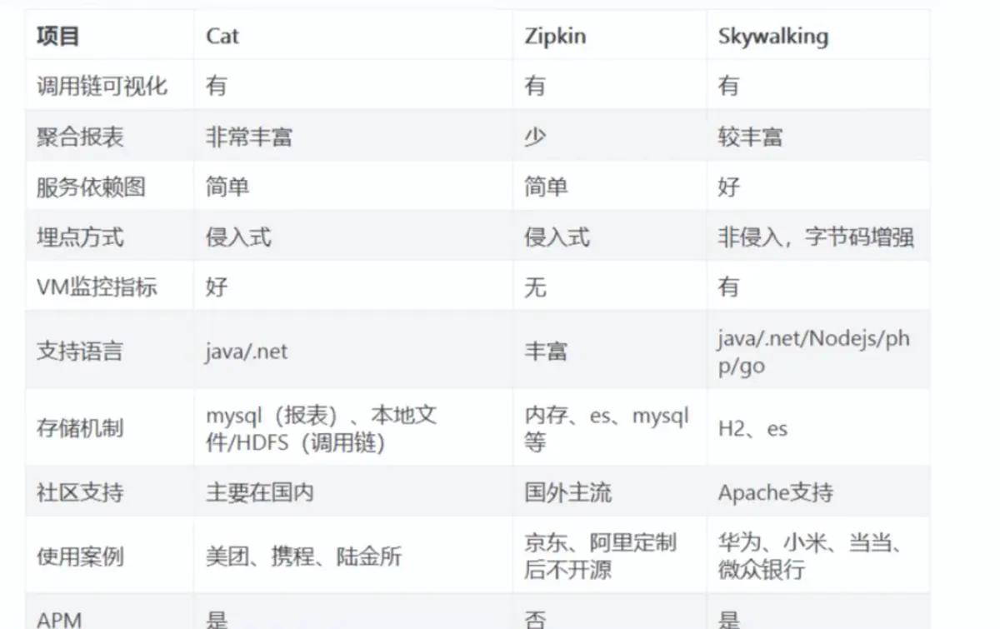
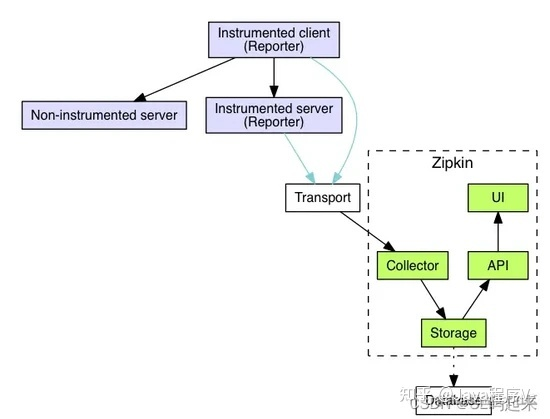

# 链路追踪

## 1.介绍

在微服务架构下，一次请求至少经过三四次服务调用完成，多则跨越七八个，那么问题接踵而来

- 如何动态展示服务的调用链路
- 如何分析服务调用链路中的节点，耗时多少，并进行调优
- 如何发现其中某次调用故障
基于上面得问题，就应运而生了分布式调用链路追踪技术

### 1.1.什么是链路追踪

狭义上分布式链路追踪（Tracing）是指跟踪请求在分布式系统中的流转路径与状态，主要用途是协助开发运维人员进行故障诊断、容量预估、性能瓶颈分析与调用链路梳理等工作。
技术实现上包含了数据埋点、采集、存储、分析、可视化等环节，形成了一套完整的技术体系。

而更广义的分布式链路追踪，则涵盖了由数据透传能力衍生的生态系统，比如全链路压测、微服务流量路由、业务场景链路拆分等。
我们可以为调用链路赋予业务语义，也可以将一次调用生命周期内的所有数据进行关联整合，不再局限于链路数据本身。

由此可见，分布式链路追踪的应用场景广阔，潜力巨大，它的核心属性就是“关联”。
然而，分布式链路追踪（Tracing）相对于统计指标（Metrics）和应用日志（Logging）来说更加难以理解，不容易运用，更难用好

### 1.2.重要概念

一次完整的分布式调用跟踪链路为一个trace，由一系列Span 组成的一个树状结构。

TraceId：为了实现请求跟踪，当请求发送到分布式系统的入口时，我们为该请求创建一个唯一跟踪表示traceId,同时在分布式系统内部流转时，框架始终保持该唯一标识。

SpanId： 每一个SpanId通过一个64位ID来进行唯一标识即spanId，并通过另一个64位ID对Span所在的Trace进行唯一标识
对于一个span节点必须有开始和结束节点，通过记录开始和结束的时间戳，就可以计算出调用该服务的一个耗时。
（注意：启动一个Trace的初始化Span被叫作 Root Span ，它的 Span ID 和 Trace Id 相同。）

除此之外，很多产品也在丰富相关的概念，例如
- Operation Name：描述了当前接口的行为语义，比如 /api/createOrder 代表执行了一次创建订单的动作。
- SpanId/ParentSpanId：接口调用的层级标识，用于还原 Trace 内部的层次调用关系。
- Start/FinishTime：接口调用的开始和结束时间，二者相减就是该次调用的耗时。
- StatusCode：响应状态，标识当次调用是成功或失败。
- Tags & Events：调用附加信息，详见下面的描述。

### 1.3.常见方案

这类系统统称为 APM： Application Performance Monitor 是应用性能监测软件。

- Spring Cloud Sleuth + Zipkin
- Apache Skywalking
- 大众点评的 CAT
- Pinpoint
- 阿里巴巴的鹰眼
- 美团的 Mtrace
- 京东的 hydra
- 新浪的 watchman

目前市面上开源的APM系统主要有CAT、Zipkin、Pinpoint、SkyWalking，大都是参考Google的Dapper实现的

### 1.4.技术方案对比

- Zipkin：是Twitter开源的调用链路分析工具，基于 Google Dapper 实现，我们可以使用它来收集各个服务器上请求链路的跟踪数据,
  并通过它提供的 REST API 接口来辅助查询跟踪数据以实现对分布式系统的监控程序,从而及时发现系统中出现的延迟升高问题并找出系统性能瓶颈的根源。
  除了面向开发的 API 接口之外,它还提供了方便的 UI 组件来帮助我们直观地搜索跟踪信息和分析请求链路明细。目前基于Spingcloud sleuth得到了广泛的应用，特点是轻量，部署简单。
- Pinpoint：一个韩国团队开源的产品，运用了字节码增强技术，只需要在启动时添加启动参数即可，对代码无侵入，目前支持Java和PHP语言，
  底层采用HBase来存储数据，探针收集的数据粒度非常细，但性能损耗大，因其出现的时间较长，完成度也很高，应用的公司较多
- Skywalking：是本土开源的基于字节码注入的调用链路分析以及应用监控分析工具，特点是支持多种插件，UI功能较强，接入端无代码侵入。
- CAT是由国内美团点评开源的，基于Java语言开发，目前提供Java、C/C++、Node.js、Python、Go等语言的客户端，监控数据会全量统计，
  国内很多公司在用，例如美团点评、携程、拼多多等，

按照实现方案分类：  
- CAT、Zipkin都需要在应用程序中埋点，对代码侵入性强。
- Pinpoint、Skywalking 采用探针的方式，无侵入。但是需要开启额外的进程，增加硬件成本

对比的点如下：



### 1.5.文章

- [轻松玩转全链路监控](https://mp.weixin.qq.com/s/mYv1EnX3K9ZiqLQgZrwFgw)
- [快速搞懂监控、链路追踪、日志三者的区别](https://mp.weixin.qq.com/s/ETDOuoF-R9xOMM-Kdozk9A)
- [基础篇丨链路追踪（Tracing）其实很简单](https://mp.weixin.qq.com/s/00aiWY5bX6RnAKL8UpAZyw)
- [使用篇丨链路追踪（Tracing）其实很简单：请求轨迹回溯与多维链路筛选](https://mp.weixin.qq.com/s/n27ozW8pQi6OxXc4GaIftw)
- [使用篇丨链路追踪（Tracing）很简单：链路实时分析、监控与告警](https://mp.weixin.qq.com/s/JlKVUDIG0W4aJ78I47foNg)

## 2.Spring Cloud Sleuth + Zipkin

为了方便查询整个链路的日志信息，可以采用Sleuth去收集日志信息，并且在配合Zipkin去以图形化界面站式，方便定位问题所在。

它目前支持的有：rxjava、feign、quartz、RestTemplate、zuul、hystrix、grpc、kafka、Opentracing、redis、Reator、
circuitbreaker、spring的Scheduled。国内用的比较多的dubbo，sleuth无法对其提供支持

sleuth只是一个全链路生成工具，我们一般将sleuth与zipkin结合使用，sleuth默认会将收集的所有信息发送到zipkin。

[Sleuth源码解析](https://blog.csdn.net/weixin_48872249/article/details/113480953)

[快速入门](https://blog.csdn.net/ya_yongng/article/details/107570277)

[sleuth zinkip 分布式链路追踪](https://mp.weixin.qq.com/s/lRU-waPZP7aYvHuefYgNYA)

### 2.1.集成Sleuth 

1.引入依赖

```xml
<!--全链路日志生成器-->
<dependency>
    <groupId>org.springframework.cloud</groupId>
    <artifactId>spring-cloud-starter-sleuth</artifactId>
</dependency>
<!--日志采集器，上传日志-->
<dependency>
    <groupId>org.springframework.cloud</groupId>
    <artifactId>spring-cloud-starter-zipkin</artifactId>
</dependency>
```

2.增加测试代码。我们通过本地方法通过 RestTemplate 调用另一个本地方法 模拟服务间调用。

```java
@Slf4j
@RestController
@RequestMapping("/sleuth")
public class SleuthController {
    @Autowired
    private RestTemplate restTemplate;

    @RequestMapping("start")
    public String start() {
        log.info("start收到请求");
        // 通过http接口调用自己的方法
        restTemplate.getForObject("http://localhost:8080/sleuth/end", String.class);
        log.info("start请求处理结束");
        return "1";
    }
    @RequestMapping("end")
    public String end() {
        log.info("end收到请求");
        log.info("end请求处理结束");
        return "2";
    }
    @Bean
    public RestTemplate getRestTemplate() {
        return new RestTemplate();
    }
}
```

3.配置信息

```properties
spring.application.name=lab_086_trace_sleuth
server.port=8080

logging.level.root=debug

# 采集数据的上传类型，web=通过http方式上传，mq支持activemq,rabbit,kafka
spring.zipkin.sender.type=web
spring.zipkin.base-url=http://127.0.0.1:9411

# sleuth默认会将收集的所有信息发送到zipkin，这样是非常耗性能的，所以sleuth提供了两个参数，可以使sleuth按照一定的比例将信息发送到zipkin
# 注意：这两个参数配置1个即可
# 1.抽样概率，如果设置为1，表示信息全部发送到zipkin，如果设置0.5，表示50%会发送
spring.sleuth.sampler.probability=1

# 2.每秒收集信息的速率，对于访问量不大的请求，可以设置该参数,比如设置rate=50，表示无论访问量大小，每秒最多发送50个信息到zipkin
# spring.sleuth.sampler.rate=10
```

4.启动项目访问： http://localhost:8080/sleuth/start 。日志如下

```text
2022-10-19 21:57:54.360  INFO [lab_086_trace_sleuth,99fb43b87e2f986b,99fb43b87e2f986b,true] 26880 --- [nio-8080-exec-7] com.zx.sleuth.SleuthController           : start收到请求
2022-10-19 21:57:54.366  INFO [lab_086_trace_sleuth,99fb43b87e2f986b,deb184e200885715,true] 26880 --- [nio-8080-exec-8] com.zx.sleuth.SleuthController           : end收到请求
2022-10-19 21:57:54.366  INFO [lab_086_trace_sleuth,99fb43b87e2f986b,deb184e200885715,true] 26880 --- [nio-8080-exec-8] com.zx.sleuth.SleuthController           : end请求处理结束
2022-10-19 21:57:54.369  INFO [lab_086_trace_sleuth,99fb43b87e2f986b,99fb43b87e2f986b,true] 26880 --- [nio-8080-exec-7] com.zx.sleuth.SleuthController           : start请求处理结束

[lab_086_trace_sleuth,99fb43b87e2f986b,99fb43b87e2f986b,true]
lab_086_trace_sleuth：服务名
99fb43b87e2f986b：traceId
99fb43b87e2f986b：spanId
true：表示是否要将该信息输出到Zipkin等服务中来收集和展示。这里因为日志输出到文件中了，也算被收集了
```

### 2.2.Zipkin集成


#### 2.2.1.使用原理



- Collector: 收集器组件,它主要处理从外部系统发送过来的跟踪信息,将这些信息转换为 Zipkin 内部处理的 Span 格式,以支持后续的存储、分析、展示等功能。
- Storage:存储组件,它主要处理收集器接收到的跟踪信息,默认会将这些信息存储在内存中。我们也可以修改此存储策略,通过使用其他存储组件将跟踪信息存储到数据库中。
- Query Service: 查询服务组件，它主要用来提供外部访问接口。比如给客户端展示跟踪信息,或是外接系统访问以实现监控等。它的主要使用者是Web UI组件。
- Web UI: 基于 API 组件实现的上层应用。通过 UI 组件,用户可以方便而又直观地查询和分析跟踪信息。
  
注意：UI 中没有内置身份验证！

#### 2.2.2.下载安装

有两种方式：1.下载官方的jar启动。2. 整合spring boot。

zipkin自2019年发布2.12.9之后，就没有发布过最新的版本到maven仓库了。当前的spring boot的最新版本无法兼容，最高支持到2.1.4。
以上的版本不兼容zipkin，所有这种方法已经不推荐使用了。

1.下载命令如下：下载后重命名为zipkin.jar即可

```shell
curl -sSL https://zipkin.io/quickstart.sh | bash -s
```

2.启动zipkin，我们选择使用MySQL保存数据

mysql表创建语句：https://github.com/openzipkin/zipkin/blob/master/zipkin-storage/mysql-v1/src/main/resources/mysql.sql

```shell
java -jar zipkin-server-2.23.2-exec.jar --STORAGE_TYPE=mysql --MYSQL_HOST=localhost --MYSQL_TCP_PORT=3306 --MYSQL_DB=zipkin --MYSQL_USER=root --MYSQL_PASS=root
```

3.配置文件：https://github.com/openzipkin/zipkin/blob/master/zipkin-server/src/main/resources/zipkin-server-shared.yml

我们看到配置文件整体采用的是参数变量的方式，比如，Storage模块是存储，所以在配置文件中可以找Storage，发现 STORAGE_TYPE 参数，
找到MySQL，看到其他MySQL参数是什么，这样我们就可以通过命令行的方式，在启动的时候注入参数，其他的配置信息也是如此。

比如，
- Collector：支持activemq、http、 grpc、kafka、rabbitmq、scribe
- storage:支持 mem、 MySQL、es、cassandra

## 3.Apache Skywalking

[SkyWalking —— 分布式应用监控与链路追踪](https://www.cnblogs.com/cjsblog/p/14075486.html)

[Skywalking介绍](https://www.jianshu.com/p/ffa7ddcda4ab)

[skywalking教程](https://blog.csdn.net/qq_36268103/article/details/119750035)

教程：https://blog.csdn.net/wb4927598/category_11244671.html

官网：[https://skywalking.apache.org/](https://skywalking.apache.org/)

Skywalking是一个国产的开源框架，2015年有吴晟个人开源，2017年加入Apache孵化器，国人开源的产品，主要开发人员来自于华为，
2019年4月17日Apache董事会批准SkyWalking成为顶级项目，支持Java、.Net、NodeJs等探针，数据存储支持Mysql、Elasticsearch等，
跟Pinpoint一样采用字节码注入的方式实现代码的无侵入，探针采集数据粒度粗，但性能表现优秀，且对云原生支持，目前增长势头强劲，社区活跃。

Skywalking是分布式系统的应用程序性能监视工具，专为微服务，云原生架构和基于容器（Docker，K8S,Mesos）架构而设计，
它是一款优秀的APM（Application Performance Management）工具，包括了分布式追踪，性能指标分析和服务依赖分析等。

## 4.大众点评 CAT

开源地址：[https://github.com/dianping/cat](https://github.com/dianping/cat)

深度剖析开源分布式监控CAT:[https://tech.meituan.com/2018/11/01/cat-in-depth-java-application-monitoring.html](https://tech.meituan.com/2018/11/01/cat-in-depth-java-application-monitoring.html)

CAT 3.0 开源发布:[https://tech.meituan.com/2018/11/01/cat-pr.html](https://tech.meituan.com/2018/11/01/cat-pr.html)

## 5.Google-Dapper

介绍：[https://blog.csdn.net/lbw520/article/details/103250417](https://blog.csdn.net/lbw520/article/details/103250417)

Dapper是谷歌内部使用的分布式链路追踪系统，虽然没有开源，但是Google在其2010年发布的一篇论文中对其进行了详细的介绍。
可以说，Dapper是链路追踪领域的始祖，其提出的概念和理念一致影响着后来所有的分布式系统链路追踪系统，
包括阿里的鹰眼系统，大众点评的cat系统，Twitter的Zipkin以及开源的Jaeger等等。

## 6.自定义全链路

[Spring Boot + MDC 实现全链路调用日志跟踪](https://mp.weixin.qq.com/s/DYTr4teCS7Qa9a4Zob0bUw)

### 6.1.MDC【基于日志】
MDC（Mapped Diagnostic Context，映射调试上下文）是 log4j 、logback及log4j2 提供的一种方便在多线程条件下记录日志的功能。
MDC 可以看成是一个与当前线程绑定的哈希表，可以往其中添加键值对。

MDC 中包含的内容可以被同一线程中执行的代码所访问。当前线程的子线程会继承其父线程中的 MDC 的内容。
当需要记录日志时，只需要从 MDC 中获取所需的信息即可。MDC 的内容则由程序在适当的时候保存进去。
对于一个 Web 应用来说，通常是在请求被处理的最开始保存这些数据


MDC 存在的问题
- 子线程中打印日志丢失traceId
- HTTP调用丢失traceId
