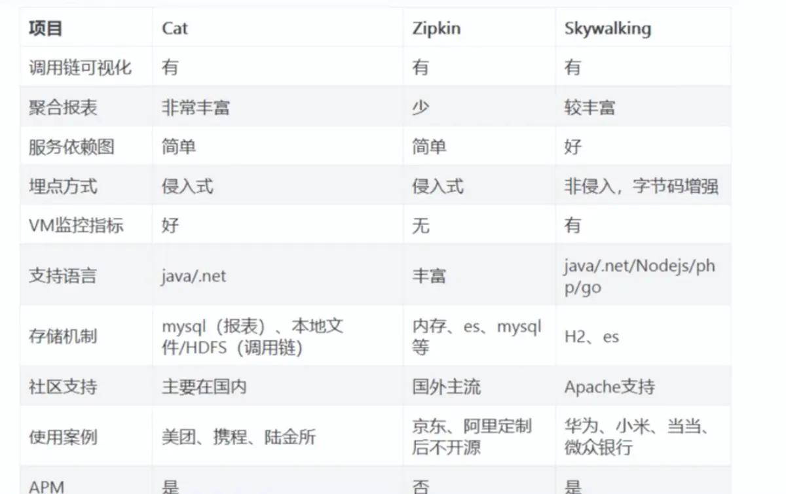

# 链路追踪

## 1.介绍

在微服务架构下，一次请求至少经过三四次服务调用完成，多则跨越七八个，那么问题接踵而来

- 如何动态展示服务的调用链路
- 如何分析服务调用链路中的节点，耗时多少，并进行调优
- 如何发现其中某次调用故障
基于上面得问题，就应运而生了分布式调用链路追踪技术

### 1.1.定义

狭义上分布式链路追踪（Tracing）是指跟踪请求在分布式系统中的流转路径与状态，主要用途是协助开发运维人员进行故障诊断、容量预估、性能瓶颈分析与调用链路梳理等工作。
技术实现上包含了数据埋点、采集、存储、分析、可视化等环节，形成了一套完整的技术体系。

而更广义的分布式链路追踪，则涵盖了由数据透传能力衍生的生态系统，比如全链路压测、微服务流量路由、业务场景链路拆分等。
我们可以为调用链路赋予业务语义，也可以将一次调用生命周期内的所有数据进行关联整合，不再局限于链路数据本身。

由此可见，分布式链路追踪的应用场景广阔，潜力巨大，它的核心属性就是“关联”。
然而，分布式链路追踪（Tracing）相对于统计指标（Metrics）和应用日志（Logging）来说更加难以理解，不容易运用，更难用好

### 1.2.重要概念

一次完整的分布式调用跟踪链路为一个trace，由一系列Span 组成的一个树状结构。

TraceId：为了实现请求跟踪，当请求发送到分布式系统的入口时，我们为该请求创建一个唯一跟踪表示traceId,同时在分布式系统内部流转时，框架始终保持该唯一标识。

SpanId： 每一个SpanId通过一个64位ID来进行唯一标识即spanId，并通过另一个64位ID对Span所在的Trace进行唯一标识
对于一个span节点必须有开始和结束节点，通过记录开始和结束的时间戳，就可以计算出调用该服务的一个耗时。
（注意：启动一个Trace的初始化Span被叫作 Root Span ，它的 Span ID 和 Trace Id 相同。）

除此之外，很多产品也在丰富相关的概念，例如
- Operation Name：描述了当前接口的行为语义，比如 /api/createOrder 代表执行了一次创建订单的动作。
- SpanId/ParentSpanId：接口调用的层级标识，用于还原 Trace 内部的层次调用关系。
- Start/FinishTime：接口调用的开始和结束时间，二者相减就是该次调用的耗时。
- StatusCode：响应状态，标识当次调用是成功或失败。
- Tags & Events：调用附加信息，详见下面的描述。

### 1.3.常见方案

- Spring Cloud Sleuth + Zipkin
- Apache Skywalking
- 大众点评的 CAT
- Pinpoint
- 阿里巴巴的鹰眼
- 美团的 Mtrace
- 京东的 hydra
- 新浪的 watchman

目前市面上开源的APM系统主要有CAT、Zipkin、Pinpoint、SkyWalking，大都是参考Google的Dapper实现的

### 1.4.技术方案对比

- Zipkin：是Twitter开源的调用链路分析工具，基于 Google Dapper 实现，我们可以使用它来收集各个服务器上请求链路的跟踪数据,
  并通过它提供的 REST API 接口来辅助查询跟踪数据以实现对分布式系统的监控程序,从而及时发现系统中出现的延迟升高问题并找出系统性能瓶颈的根源。
  除了面向开发的 API 接口之外,它还提供了方便的 UI 组件来帮助我们直观地搜索跟踪信息和分析请求链路明细。目前基于Spingcloud sleuth得到了广泛的应用，特点是轻量，部署简单。
- Pinpoint：一个韩国团队开源的产品，运用了字节码增强技术，只需要在启动时添加启动参数即可，对代码无侵入，目前支持Java和PHP语言，
  底层采用HBase来存储数据，探针收集的数据粒度非常细，但性能损耗大，因其出现的时间较长，完成度也很高，应用的公司较多
- Skywalking：是本土开源的基于字节码注入的调用链路分析以及应用监控分析工具，特点是支持多种插件，UI功能较强，接入端无代码侵入。
- CAT是由国内美团点评开源的，基于Java语言开发，目前提供Java、C/C++、Node.js、Python、Go等语言的客户端，监控数据会全量统计，
  国内很多公司在用，例如美团点评、携程、拼多多等，

按照实现方案分类：  
- CAT、Zipkin都需要在应用程序中埋点，对代码侵入性强。
- Pinpoint、Skywalking 采用探针的方式，无侵入。但是需要开启额外的进程，增加硬件成本

对比的点如下：

### 1.5.文章

- [轻松玩转全链路监控](https://mp.weixin.qq.com/s/mYv1EnX3K9ZiqLQgZrwFgw)
- [快速搞懂监控、链路追踪、日志三者的区别](https://mp.weixin.qq.com/s/ETDOuoF-R9xOMM-Kdozk9A)
- [基础篇丨链路追踪（Tracing）其实很简单](https://mp.weixin.qq.com/s/00aiWY5bX6RnAKL8UpAZyw)
- [使用篇丨链路追踪（Tracing）其实很简单：请求轨迹回溯与多维链路筛选](https://mp.weixin.qq.com/s/n27ozW8pQi6OxXc4GaIftw)
- [使用篇丨链路追踪（Tracing）很简单：链路实时分析、监控与告警](https://mp.weixin.qq.com/s/JlKVUDIG0W4aJ78I47foNg)

## 6.自定义全链路

[Spring Boot + MDC 实现全链路调用日志跟踪](https://mp.weixin.qq.com/s/DYTr4teCS7Qa9a4Zob0bUw)

### 6.1.MDC【基于日志】
MDC（Mapped Diagnostic Context，映射调试上下文）是 log4j 、logback及log4j2 提供的一种方便在多线程条件下记录日志的功能。
MDC 可以看成是一个与当前线程绑定的哈希表，可以往其中添加键值对。

MDC 中包含的内容可以被同一线程中执行的代码所访问。当前线程的子线程会继承其父线程中的 MDC 的内容。
当需要记录日志时，只需要从 MDC 中获取所需的信息即可。MDC 的内容则由程序在适当的时候保存进去。
对于一个 Web 应用来说，通常是在请求被处理的最开始保存这些数据

MDC 存在的问题
- 子线程中打印日志丢失traceId
- HTTP调用丢失traceId
