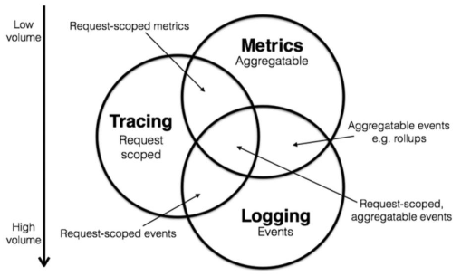
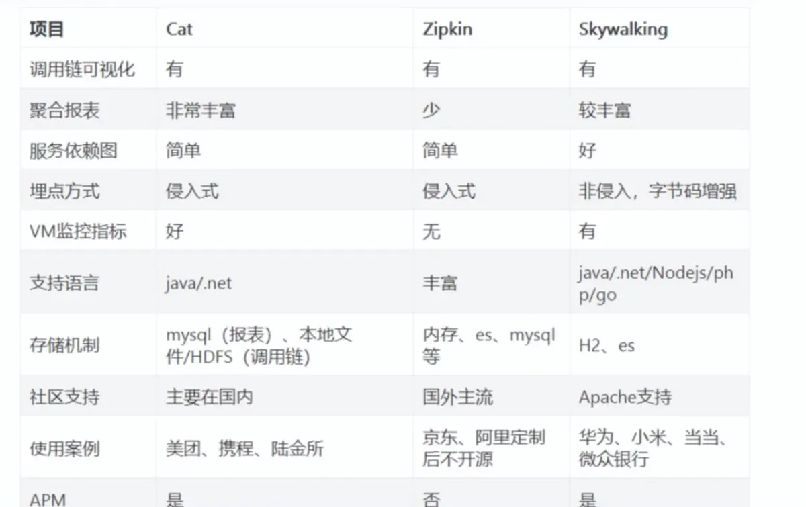

# 链路追踪

- [轻松玩转全链路监控](https://mp.weixin.qq.com/s/mYv1EnX3K9ZiqLQgZrwFgw)
- [快速搞懂监控、链路追踪、日志三者的区别](https://mp.weixin.qq.com/s/ETDOuoF-R9xOMM-Kdozk9A)
- [基础篇丨链路追踪（Tracing）其实很简单](https://mp.weixin.qq.com/s/00aiWY5bX6RnAKL8UpAZyw)
- [使用篇丨链路追踪（Tracing）其实很简单：请求轨迹回溯与多维链路筛选](https://mp.weixin.qq.com/s/n27ozW8pQi6OxXc4GaIftw)
- [使用篇丨链路追踪（Tracing）很简单：链路实时分析、监控与告警](https://mp.weixin.qq.com/s/JlKVUDIG0W4aJ78I47foNg)

## 1.介绍

在微服务架构下，一次请求至少经过三四次服务调用完成，多则跨越七八个，那么问题接踵而来

- 如何动态展示服务的调用链路
- 如何分析服务调用链路中的节点，耗时多少，并进行调优
- 如何发现其中某次调用故障
  基于上面得问题，就应运而生了分布式调用链路追踪技术

### 1.1.什么是Trace

微服务可观测性的三大支柱：Trace、Metrics、Log

狭义上分布式链路追踪（Tracing）是指跟踪请求在分布式系统中的流转路径与状态，主要用途是协助开发运维人员进行故障诊断、容量预估、性能瓶颈分析与调用链路梳理等工作。
技术实现上包含了数据埋点、采集、存储、分析、可视化等环节，形成了一套完整的技术体系。

而更广义的分布式链路追踪，则涵盖了由数据透传能力衍生的生态系统，比如全链路压测、微服务流量路由、业务场景链路拆分等。
我们可以为调用链路赋予业务语义，也可以将一次调用生命周期内的所有数据进行关联整合，不再局限于链路数据本身。

由此可见，分布式链路追踪的应用场景广阔，潜力巨大，它的核心属性就是“关联”。
然而，分布式链路追踪（Tracing）相对于统计指标（Metrics）和应用日志（Logging）来说更加难以理解，不容易运用，更难用好

### 1.2.重要概念

一次完整的分布式调用跟踪链路为一个trace，由一系列Span 组成的一个树状结构。

TraceId：为了实现请求跟踪，当请求发送到分布式系统的入口时，我们为该请求创建一个唯一跟踪表示traceId,同时在分布式系统内部流转时，框架始终保持该唯一标识。

SpanId： 每一个SpanId通过一个64位ID来进行唯一标识即spanId，并通过另一个64位ID对Span所在的Trace进行唯一标识
对于一个span节点必须有开始和结束节点，通过记录开始和结束的时间戳，就可以计算出调用该服务的一个耗时。
（注意：启动一个Trace的初始化Span被叫作 Root Span ，它的 Span ID 和 Trace Id 相同。）

除此之外，很多产品也在丰富相关的概念，例如

- Operation Name：描述了当前接口的行为语义，比如 /api/createOrder 代表执行了一次创建订单的动作。
- SpanId/ParentSpanId：接口调用的层级标识，用于还原 Trace 内部的层次调用关系。
- Start/FinishTime：接口调用的开始和结束时间，二者相减就是该次调用的耗时。
- StatusCode：响应状态，标识当次调用是成功或失败。
- Tags & Events：调用附加信息，详见下面的描述。

### 1.3.常见方案

- Spring Cloud Sleuth + Zipkin/Jaeger
  - Sleuth：是Spring Cloud提供的链路追踪中的日志（数据）生成工具
  - Zipkin：是Twitter开源的调用链路分析工具，可以用它来收集各个服务器上请求链路的跟踪数据,
- Apache Skywalking：是本土开源的基于字节码注入的调用链路分析以及应用监控分析工具，特点是支持多种插件，UI功能较强，接入端无代码侵入。
- CAT：是美团点评开源，目前提供Java、C/C++、Node.js、Python、Go等语言的客户端，监控数据会全量统计，国内很多公司在用。
- Pinpoint：一个韩国团队开源的产品，运用了字节码增强技术，只需要在启动时添加启动参数即可，对代码无侵入，目前支持Java和PHP语言，
  底层采用HBase来存储数据，探针收集的数据粒度非常细，但性能损耗大，因其出现的时间较长，完成度也很高，应用的公司较多。
- OpenTelemetry：云原生标准，统一集合、处理、导出工具，它提供了自动的、标准化的、端到端的监控和追踪能力。
- 其他：阿里巴巴的鹰眼、美团的 Mtrace、京东的 hydra、新浪的 watchman 等。

目前市面上开源的APM系统主要有CAT、Zipkin/Jaeger、Pinpoint、SkyWalking，大都是参考Google的Dapper实现的。

### 1.4.技术分类

按照实现原理分类：
- 基于日志：Sleuth+Zipkin/Jaeger等，通过在代码中添加日志记录的方式来收集数据。
- 基于字节码增强：Skywalking等，通过修改字节码的方式来实现无侵入式的监控和追踪。

按照实现方案分类：
- 埋点类：CAT、Sleuth+Zipkin/Jaeger都需要在应用程序中埋点，对代码侵入性强。【重点】只能实现简单的日志级链路追踪。
- 探针类：Pinpoint、Skywalking 采用探针的方式，无侵入。但是需要开启额外的进程，增加硬件成本【重点】可以实现日志、指标的链路追踪。

对比的点如下：

### 1.5.技术选型

| 方案             | 适用场景                 | 性能开销  | 功能完整性                  | 接入成本         |
|----------------|----------------------|-------|------------------------|--------------|
| 分布式ID+ELK      | 中小型系统，侧重日志查询         | 低     | 基础链路关联                 | 低            |
| OpenTelemetry  | 云原生、多语言混合架构          | 中     | 全功能（ metrics/tracing ） | 中（需适配标准）     |
| Skywalking     | 大型微服务架构，Java为主       | 低     | 强（自动埋点+性能分析）           | 低（无侵入）       |
| Zipkin/Jaeger+ Sleuth | Spring生态系统，轻量级需求     | 低     | 基础链路追踪                 | 低            |
| Pinpoint       | 与Skywalking类型，但是功能单一 | 中     | 强（自动埋点+性能分析）           | 低（无侵入）       |

## 2.技术难点

链路追踪主要是对Tracing、Metrics和Logging的具体实现，只是关注Metrics的内容不同。
- Tracing：关注于性能分析，例如Skywalking特别关注调用链路的堆栈信息，用于分析调用中的性能分析。
- Logging：关注于日志汇总查询，例如Spring Cloud Sleuth通过采样的方式收集上传数据到Zipkin/Jaeger中，实现日志的汇聚与查询。

1. 上下文传递机制：
   - ThreadLocal 与 MDC：Java 中通过MDC.put("traceId", id)将 ID 存入日志上下文。
   - 线程间传递：使用TransmittableThreadLocal解决线程池场景下的上下文丢失（如 ForkJoinPool）。
   - 异步调用：在消息消费、异步任务中手动传递 Trace ID（如 Runnable/Callable 包装器）。
   - 进程间传递：为多种多样的调用方式（dubbo/http/kafka/mysql/redis等）实现各自的拦截器/字节码增强点，也就是需要提供各种插件。
2. 采样策略：
   - 固定采样率：如 1% 的请求生成完整链路（适用于高并发场景，减少存储压力）。
   - 自适应采样：根据请求频率、错误率动态调整采样率（如 Zipkin/Jaeger 的概率采样）。
   - 关键链路强制采样：对核心业务路径（如支付流程）强制记录全量日志。
3. 性能优化
   - 异步日志输出：使用AsyncAppender将日志写入内存队列，减少 I/O 阻塞。
   - 批量发送：Trace 数据攒批（如 50 条 / 次）发送至 Collector，降低网络开销。
   - 压缩传输：对 Trace 数据进行 gzip 压缩，减少带宽占用。
4. 数据存储：适用于NoSql性数据库，例如HBASE、ES等。

## 3.自定义全链路

[Spring Boot + MDC 实现全链路调用日志跟踪](https://mp.weixin.qq.com/s/DYTr4teCS7Qa9a4Zob0bUw)

### 3.1.基于日志-MDC

MDC（Mapped Diagnostic Context，映射调试上下文）是 log4j 、logback及log4j2 提供的一种方便在多线程条件下记录日志的功能。
MDC 可以看成是一个与当前线程绑定的哈希表，可以往其中添加键值对。

MDC 中包含的内容可以被同一线程中执行的代码所访问。当前线程的子线程会继承其父线程中的 MDC 的内容。
当需要记录日志时，只需要从 MDC 中获取所需的信息即可。MDC 的内容则由程序在适当的时候保存进去。
对于一个 Web 应用来说，通常是在请求被处理的最开始保存这些数据

MDC 存在的问题

- 子线程中打印日志丢失traceId
- HTTP调用丢失traceId

### 3.2.基于字节码增强-Java Agent