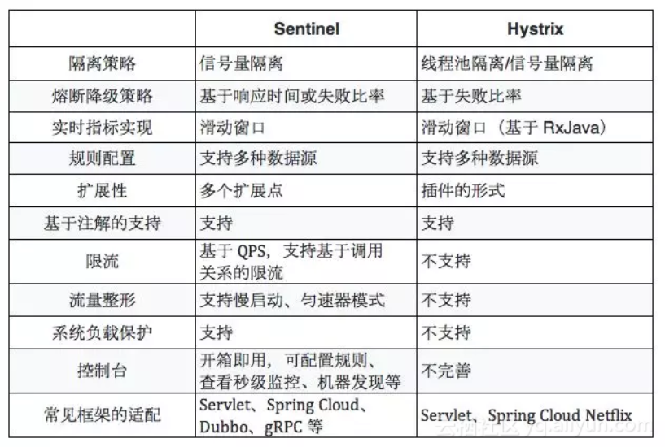

# 断路器

- [技术选型：Sentinel vs Hystrix](https://developer.aliyun.com/article/633786)
- [Dubbo 的流量防卫兵 Sentinel如何通过限流实现服务的高可用性](https://developer.aliyun.com/article/624053)
- [RocketMQ 的保险丝 Sentinel 如何通过匀速请求和冷启动来保障服务的稳定性](https://developer.aliyun.com/article/625858)

## 1.Hystrix

## 2.Sentinel

- [官网](https://sentinelguard.io/zh-cn/)
- [十分钟搞懂阿里Sentinel核心源码（上）](https://developer.aliyun.com/article/841457)
- [基本使用-资源与规则](https://sentinelguard.io/zh-cn/docs/basic-api-resource-rule.html)

Sentinel 主要以流量为切入点，从流量控制、熔断降级、系统负载保护等多个维度来帮助用户提升服务的稳定性。

