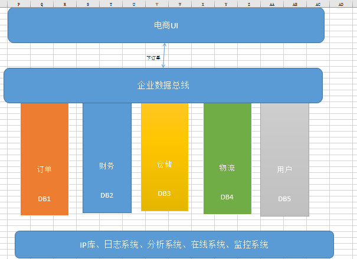

# 微服务&分布式

分布式系统”三驾马车“：GFS,mapreduce,Bigtable。是当前一切分布式技术基石。

- [The Google File System 论文解读](https://blog.csdn.net/qq_30031221/article/details/117037874)
- [MapReduce论文精读](https://blog.csdn.net/weixin_46840831/article/details/121111841)
- [Bigtable](https://blog.csdn.net/zj_18706809267/article/details/125044619)

## 1.微服务

### 1.1.架构演变过程
****
随着架构的演变，由 **大而全的 单体应用** 演变到 **简化服务间关系的 SOA架构**

再演变到 **大规模服务集群的 微服务架构**

再到现在逐步出现的 **ServiceMesh**。

架构演变过程，不是哪种类型的的架构更好，而是哪种架构更适合公司的需求，符合使用场景。

而目前大行其道的微服务架构，几乎能满足绝大部分公司的需求。

### 1.2.单体式架构与微服务架构

通过单体式架构，所有进程紧密耦合，并可作为单项服务运行。这意味着，如果应用程序的一个进程遇到需求峰值，则必须扩展整个架构。
随着代码库的增长，添加或改进单体式应用程序的功能变得更加复杂。这种复杂性限制了试验的可行性，并使实施新概念变得困难。
单体式架构增加了应用程序可用性的风险，因为许多依赖且紧密耦合的进程会扩大单个进程故障的影响。

使用微服务架构，将应用程序构建为独立的，并将每个应用程序进程作为一项服务运行。这些服务使用轻量级 API 通过明确定义的接口进行通信。
这些服务是围绕业务功能构建的，每项服务执行一项功能。由于它们是独立运行的，因此可以针对各项服务进行更新、部署和扩展，以满足对应用程序特定功能的需求。

### 1.3.微服务的优点

- 自主性

可以对微服务架构中的每个服务进行开发、部署、运营和扩展，而不影响其他服务的功能。
这些服务不需要与其他服务共享任何代码或实施。各个之间的任何通信都是通过明确定义的 API 进行的。

- 专用性

每项服务都是针对一组功能而设计的，并专注于解决特定的问题。如果开发人员逐渐将更多代码增加到一项服务中并且这项服务变得复杂，
那么可以将其拆分成多项更小的服务。

- 敏捷性

微服务促进若干小型独立团队形成一个组织，这些团队负责自己的服务。各团队在小型且易于理解的环境中行事，
并且可以更独立、更快速地工作。这缩短了开发周期时间。您可以从组织的总吞吐量中显著获益。

- 灵活扩展

通过微服务，您可以独立扩展各项服务以满足其支持的应用程序功能的需求。
这使团队能够适当调整基础设施需求，准确衡量功能成本，并在服务需求激增时保持可用性。

- 轻松部署

微服务支持持续集成和持续交付，可以轻松尝试新想法，并可以在无法正常运行时回滚。
由于故障成本较低，因此可以大胆试验，更轻松地更新代码，并缩短新功能的上市时间。

- 技术自由

微服务架构不遵循“一刀切”的方法。团队可以自由选择最佳工具来解决他们的具体问题。
因此，构建微服务的团队可以为每项作业选择最佳工具。

- 可重复使用的代码

将软件划分为小型且明确定义的模块，让团队可以将功能用于多种目的。专为某项功能编写的服务可以用作另一项功能的构建块。
这样应用程序就可以自行引导，因为开发人员可以创建新功能，而无需从头开始编写代码。

- 弹性

服务独立性增加了应用程序应对故障的弹性。在整体式架构中，如果一个出现故障，可能导致整个应用程序无法运行。
通过微服务，应用程序可以通过降低功能而不导致整个应用程序崩溃来处理总体服务故障。


### 1.4.缺点
1. 多服务运维难度，随着服务的增加，运维的压力也在增大；解决方案：容器化 配合 devops流水钱，实现Nop。
2. 服务间依赖复杂；解决方案：1.整体规划服务之间关系，避免多层调用；2.增加工作流，规范化调用流程。3.增加全链路追踪工具辅助问题排查。
3. 学习难度曲线加大：需要掌握一系列的微服务开发技术。解决方案：学习。
4. 处理分布式事务较棘手，难以保障数据一致性：解决方案：增加分布式事务技术或者对业务数据进行对账。
5. 测试难度大。解决方案：在开发阶段就需要实现单元测试。
6. 人力成本大。解决方案：合理拆分微服务，合理规划团队人员，不能为了拆分而拆分。

### 1.5.微服务构成
以下案例为Spring Cloud的生态: [https://spring.io/projects/spring-cloud](https://spring.io/projects/spring-cloud)
```text
服务治理：
	1.Eureka
	2.Consul
	3.Zookeeper
	4.Nacos
断路器：
	1.Hystrix
	2.Sentinel
声明式服务调用
	1.OpenFeign
	2.Dubbo
	3.GRpc
API网关服务
	1.zuul
	2.zuul2
	3.Gateway
分布式配置中心
	1.Config
	2.Nacos
	3.Apollo
负载均衡：
	2.Ribbon
	3.LoadBalancer
消息总线：
    1.Spring Cloud Bus
	2.Turbine
	3.Spring Cloud Stream
	4.Kafka
	5.RocketMQ
任务调度：
	1.Spring Cloud Task
链路追踪：
	1.Spring Cloud Sleuth
	2.Zipkin
	3.Sleuth
安全：
	1.Spring Cloud Security
大数据：
	1.Spring Cloud Data Flow
构建与部署：
	1.Gradle
	2.Maven
	3.Jenkins
	4.Docker
	5.Kubernetes
```

### 1.6.SOA
SOA全英文是Service-Oriented Architecture，中文意思是中文面向服务编程，是一种思想，一种方法论，一种分布式的服务架构（具体可以百度）。

用途：SOA解决多服务凌乱问题，SOA架构解决数据服务的复杂程度，同时SOA又有一个名字，叫做服务治理。是单体应用演变为分布式应用的重要转折点。

第一阶段：大而全的单体应用


第二阶段：服务拆分

当我们的项目比较小时，我们只有一个系统，并且把他们写到一起，放在一个服务器上，但是随着平台越来越大，数据量越来越大，
我们不得不通过分库，把多个模块的数据库分别放在对应得服务器上，每个模块调用自己的子系统即可。




随着我们系统的进一步复杂度的提示，我们不得不进一步对系统的性能进行提升，我们将多个模块分成多个子系统，
多个子系统直接互相调用（因为SOA一般用于大型项目，比较复杂，所以一般总系统不会再集成，会拆分多个，分别做成服务，相互调用）。
当我们的电商UI进行一个下订单的任务时，多个服务直接互相调用，系统通过数据总线，分别调用对于的子系统即可。

企业数据总线：企业数据总线不是对多个子模块的集成，他在这里充当数据通道的作用，数据总线不关心业务，数据总线根据给的地址和协议去调服务，上端不关心服务在哪里是什么，只找数据总线。

数据总线通过域名解析实现:一个域名绑定多台服务器，ajax也可以，dns也可以，解析域名嘛。

其实数据总线还有一些高级应用，比如心跳检测，实现负载均衡等等，就不细说了，目前应用数据总线的有阿里的dubbo,还有zookeeper。

SOA的好处：
1. 降低用户成本，用户不需要关心各服务之间是什么语言的、不需要知道如果调用他们，只要通过统一标准找数据总线就可以了。
2. 程序之间关系服务简单
3. 识别哪些程序有问题（挂掉）

缺点：提示了系统的复杂程度，性能有相应影响。

## 2.CAP原理

浅谈CAP原理： https://www.jianshu.com/p/b0c8c9fb4763

cap理论进阶理解：https://www.cnblogs.com/summer108/p/9783033.html

CAP理论之CP模型ZK、AP模型Eureka: https://blog.csdn.net/yxd179/article/details/85200432

### 2.1.含义

- 一致性（C）：在分布式系统中的所有数据备份，在同一时刻是否同样的值。（等同于所有节点访问同一份最新的数据副本）
- 可用性（A）：在集群中一部分节点故障后，集群整体是否还能响应客户端的读写请求。（对数据更新具备高可用性）
- 分区容忍性（P）：就是当由于网络故障之时，导致集群里的机器不能保证其互相保持正常通信之时，每台机器所具备各自为战能力，保证服务能否正常使用

CAP原则的精髓就是要么AP，要么CP，要么AC，但是不存在CAP。

如果在某个分布式系统中数据无副本， 那么系统必然满足强一致性条件，
因为只有独一数据，不会出现数据不一致的情况，此时C和P两要素具备

但是如果系统发生了网络分区状况或者宕机，必然导致某些数据不可以访问

此时可用性条件就不能被满足，即在此情况下获得了CP系统，但是CAP不可同时满足。必然导致某些数据不可以访问，此时可用性条件就不能被满足，即在此情况下获得了CP系统，但是CAP不可同时满足。


### 2.2.案例

基于上面的理论铺垫，目前工作中最常用的Eureka和ZooKeeper。

1.Eureka


Eureka采用peer-to-peer的架构集群模式，部署一个集群，但是集群里每个机器的地位是对等的。
各个服务可以向任何一个Eureka实例服务注册和服务发现，集群里任何一个Euerka实例接收到写请求之后，
会自动同步给其他所有的Eureka实例。但是他就会有一个问题，可能还没同步数据过去，结果自己就死了

此时还是可以继续从别的机器上拉取注册表，但是看到的就不是最新的数据了，但是保证了可用性，这就是AP。

2.zk


ZooKeeper是有一个leader节点会接收写数据，然后同步写其他节点，一旦leader挂了，要重新选举leader。
这个过程里为了保证C，就牺牲了A，不可用一段时间，但是一个leader选举好了，那么就可以继续写数据了，保证一致性

3.Redis的cap架构演变

主从/哨兵模式，可以通过配置，实现数据的基本一致。
至于可用性，也只是基本可用。所有哨兵也就满足base原理
Cluster数据是分片的，一致性保证不了，所以是AP的
https://www.cnblogs.com/janehoo/p/6119175.html

### 2.3.脑裂

## 3.BASE定理

BASE是对CAP中一致性和可用性权衡的结果，其核心思想是即使无法做到强一致性，但每个应用都可以根据自身的业务特点，采用适当的方法来使系统达到最终一致性。

1.基本可用（Basically Available）

基本可用是指分布式系统在出现不可预知故障的时候，允许损失部分可用性

响应时间上的损失：正常情况下，一个在线搜索引擎需要在0.5秒之内返回给用户相应的查询结果，但由于出现故障，查询结果的响应时间增加到了1-2秒。
功能上的损失：在一个电子商务网站上进行购物，消费者几乎能够顺利完成每一笔订单，但是在一些节日大促购物高峰的时候，由于消费者的购物行为激增，为了保护购物系统的稳定性，部分消费者可能会被引导到一个降级页面。

2.软状态（Soft state）

软状态，和硬状态相对，是指允许系统中的数据存在中间状态，并认为该中间状态的存在不会影响系统的整体可用性，即允许系统在不同节点的数据副本之间进行数据同步的过程存在延时。

3.最终一致性（Eventually consistent）

最终一致性强调的是系统中所有的数据副本，在经过一段时间的同步后，最终能够达到一个一致的状态。因此，最终一致性的本质是需要系统保证最终数据能够达到一致，而不需要实时保证系统数据的强一致性。

## 4.AKF拆分原则

https://blog.csdn.net/liangyulong419/article/details/88315504

比如redis，

- x轴，水平扩展，加机器，就是redis中的主从复制
- y轴，按照功能业务拆分，就是Redis中不同的实例，有的保存缓存，有的进行逻辑运算
- z轴，数据区分，就是Redis集群中的分配，或者机房的异地多活


## 5.分布式一致性算法

1.Paxos：被认为是分布式共识算法的根本，其他都是其变种，但是 paxos 论文中只给出了单个提案的过程，
   并没有给出复制状态机中需要的 multi-paxos 的相关细节的描述，实现 paxos 具有很高的工程复杂度 （如多点可写，允许日志空洞等）。

2.Zab：被应用在 zookeeper 中，业界使用广泛，但没用抽象成通用 library。

3.Raft： 以容易理解著称，业界也涌现出很多 raft 实现，比如 etcd、braft、tikv 等。
    - https://mp.weixin.qq.com/s/ZE3sXRWoZYgbSIPTYIHWoA
    - [分布式一致性Raft与JRaft](https://www.cnblogs.com/yulinfu/p/15410107.html)
    - [深入解读Raft算法与etcd工程实现](https://mp.weixin.qq.com/s/x-AdmN0UN5KT58XWO1BCOA)

4.Gossip： 与上面三种不同，是与中心化的分布式一致性算法，比如 redis
    https://zhuanlan.zhihu.com/p/41228196

开源的代码：
- braft。百度开源的使用c++实现的raft算法。 [https://github.com/baidu/braft](https://github.com/baidu/braft)
- SOFAJRaft。蚂蚁金服借鉴braft使用Java使用的raft算法。[https://www.sofastack.tech/projects/sofa-jraft/overview/](https://www.sofastack.tech/projects/sofa-jraft/overview/)

## 6.服务治理
一般指的是注册中心

注册中心ZooKeeper、Eureka、Consul 、Nacos对比：[https://blog.csdn.net/fly910905/article/details/100023415](https://blog.csdn.net/fly910905/article/details/100023415)

主流微服务注册中心浅析和对比：[https://developer.aliyun.com/article/698930](https://developer.aliyun.com/article/698930)

### 6.1.常见的注册中心

包括：
- zookeeper 注册量可以到20K
- Eureka 注册量可以到30K。
- consul
- nacos 注册量可以到200K

|				|Nacos                        |Eureka        |Consul              |CoreDNS      |Zookeeper   |
|---------------|-----------------------------|--------------|--------------------|-------------|------------|
|一致性协议     |CP+AP                        |AP            |CP                  |—            |CP         |
|健康检查       |TCP/HTTP/MYSQL/Client Beat   |Client Beat   |TCP/HTTP/gRPC/Cmd   |—            |Keep Alive |
|负载均衡策略   |权重 metadata/Selector       |Ribbon        |Fabio               |RoundRobin   |—          |                                                  
|雪崩保护       |有                           |有            |无                  |无           |无         |
|自动注销实例   |支持                         |支持          |不支持              |不支持       |支持       |
|访问协议       |HTTP/DNS                     |HTTP          |HTTP/DNS            |DNS          |TCP        |
|监听支持       |支持                         |支持          |支持                |不支持       |支持       |
|多数据中心     |支持                         |支持          |支持                |不支持       |不支持     |
|跨注册中心同步 |支持                         |不支持        |支持                |不支持       |不支持     |
|SpringCloud集成|支持                         |支持          |支持                |不支持       |不支持     |
|Dubbo集成      |支持                         |不支持        |不支持              |不支持       |支持       |
|K8S集成        |支持                         |不支持        |支持                |支持         |不支持     |
|多语言能力      |支持                         |支持        |支持                |不支持         |支持的不好     |
|watch 支持      |支持                         |支持        |支持                |支持         |支持     |

时效性：
- zk，时效性更好，注册或者是挂了，一般秒级就能感知到
- eureka，默认配置非常糟糕，服务发现感知要到几十秒，甚至分钟级别
  上线一个新的服务实例，到其他人可以发现他，极端情况下，可能要1分钟的时间，ribbon去获取每个服务上缓存的eureka的注册表进行负载均衡
  服务故障，隔60秒才去检查心跳，发现这个服务上一次心跳是在60秒之前，隔60秒去检查心跳，超过90秒没有心跳，才会认为他死了，2分钟都过去。
  30秒，才会更新缓存，30秒，其他服务才会来拉取最新的注册表。三分钟都过去了，如果你的服务实例挂掉了，此时别人感知到，可能要两三分钟的时间，一两分钟的时间，很漫长
- nacos。参考了eureka，在CP模式下，服务发现速度稍慢。

容量：
- zk，不适合大规模的服务实例，因为服务上下线的时候，需要瞬间推送数据通知到所有的其他服务实例
  所以一旦服务规模太大，到了几千个服务实例的时候，会导致网络带宽被大量占用
- eureka，也很难支撑大规模的服务实例，因为每个eureka实例都要接受所有的请求，实例多了压力太大，扛不住，也很难到几千服务实例
  之前dubbo技术体系都是用zk当注册中心，spring cloud技术体系都是用eureka当注册中心这两种是运用最广泛的

watch支持:就是客户单监听服务端的变化情况。
- zk 通过订阅监听来实现（服务端主动推送）
- eureka 通过轮询的方式来实现（其实就是客户端主动发送心跳检测并拉取实例信息）
- nacos 通过http长轮询的方式。

### 6.2.我们对于注册中心的诉求

1、注册中心的高可用诉求

问：CAP中注册中心一定要保证的是谁？

是分区容错性（P）。分布式服务依赖网络进行节点连通，在遇到任何网络分区故障时，仍然需要能够保证系统可以对外提供服务（一致性
或
可用性的服务），除非是整个网络环境都发生了故障。我们不允许当节点间通信出现故障时，被孤立节点都不能提供服务。最简单的，可以让所有节点拥有所有数据。

但是我们对于注册中心的可用性诉求，要比数据一致性要大的多。也可以说，生产环境，我们是无法容忍注册中心无法保证可用性。这对实际生产的影响是灾难性的。

2、注册中心的容灾诉求

在实践中，注册中心不能因为自身的任何原因破坏服务之间本身的可连通性。所以，如果整个注册中心宕机了呢？

因为，zk只能存在一个leader，Leader是所有写操作的入口，所有zk是无法实现跨机房、跨地域容灾的。

3、服务规模、容量的增长

互联网的发展，有一定的偶发性，现在的节点上限、带宽能满足业务发展，1年后也能满足么? 3年后呢？

当扛不住后，ZK能水平扩展么？

### 6.3.案例

- 2015年JD 大促时由Zookeeper引发服务的全链路雪崩

zookeeper实现的是CP原则。当在Leader选举过程中或一些极端情况下，整个服务是不可用的。

原因：大促期间由于秒杀活动多，增加了很多服务节点。这个时候zk的某个节点挂了或者zk相关的网络被打满了，导致zk开始选举了。
出现部分服务不可用的问题，负责人开始重启服务，想要连接上zk，导致服务不断的重试连接zk。选举变得更慢。
用户请求开始向正常的服务上打，导致正常的服务扛不住陆续崩掉，直到所有的服务都不可用。


### 6.4.自研注册中心注意哪些

既然要自研注册中心了 那么肯定要开发其对应的客户端以及服务端， 两端都要考虑各自的东西

1.客户端

- 服务拉取：每次肯定不是全量拉取，这个时候你就要思考服务端有可能提供一个最近的变更队列，供客户端拉取。并且一定要有一个用于校验拉取增量数据之后数据是否完整的指标数据，用于校验数据是否有异常，异常则做一次全量拉取。

- 心跳发送：告诉服务端自己是否存活进行服务的一个续约。

- 服务下线：进行服务下线，修改运行状态的标记位，当然这个标记位要保证其可见性。

2.服务端

- 服务注册：要对java并发包的拥有着深刻的理解，在服务注册表一定一定要注意读写并发控制，既要保证线程安全，同时也要降低锁的争用，最大限度保证其性能。

- 对所注册服务的健康检查：在单位时间内，如果所注册服务没进行服务的续约，则要将该服务下线。

- 集群同步：要根据自己实际的业务需求，制定合适的集群架构方案，在这个前提下，在制定合适的数据传输方案，保证吞吐量。

还有就是要考虑，注册中心与主流技术框架兼容性。

## 7.断路器

## 8.RPC

1、如何实现服务间调用

在微服务中，需要调用很多服务才能完成一项功能。服务之间如何互相调用就变成微服务架构中的一个关键问题。
服务调用有两种方式，一种是RPC方式，另一种是事件驱动（Event-driven）方式，也就是发消息方式。
消息方式是松耦合方式，比紧耦合的RPC方式要优越，但RPC方式如果用在适合的场景也有它的一席之地。

2、耦合是什么

第一，时间耦合，对于多数应用来讲，你希望能马上得到回答，因此即使使用消息队列，后台也需要一直工作。
第二，容量耦合，如果你对回复有时间要求，那么消息队列的缓冲功能作用不大，因为你希望及时响应。
    真正需要的是自动伸缩（Auto-scaling），它能自动调整服务端处理能力去匹配请求数量。
第三，接口耦合和发送方式耦合，这两个确实是RPC方式的软肋，但也是优点

3、如何设计RPC:
https://www.cnblogs.com/ice-image/p/14554250.html#_labelTop

## 9.服务网关

什么是服务网关

当UI需要调用很多微服务时，它需要了解每个服务的接口，这个工作量很大。于是就用服务网关创建了一个Facade，
把几个微服务封装起来，这样UI就只调用服务网关就可以了，不需要去对付每一个微服务。

## 10.分布式配置中心

思考，配置中心与注册中心有啥区别和关系

## 11.负载均衡
## 12.消息总线
## 13.任务调度
## 14.链路追踪

## 15.安全
## 16.大数据
## 17.构建与部署


## 99.优雅停机&优雅停服

### 99.1.介绍
什么叫优雅结束？
- 第一步：停止接收请求和内部线程。
- 第二步：判断是否有线程正在执行。
- 第三步：等待正在执行的线程执行完毕。
- 第四步：停止容器。

何为优雅关机？ 简单来说就是为确保应用关闭时，通知应用进程释放所占用的资源：
- 线程池，shutdown（不接受新任务等待处理完）还是 shutdownNow（调用 Thread.interrupt 进行中断）
- Socket 链接，比如：Netty、MQ
- 告知注册中心快速下线（靠心跳机制客服早都跳起来了），比如：Eureka
- 清理临时文件，比如：POI
- 各种堆内堆外内存释放

总之，进程强行终止会带来数据丢失或者终端无法恢复到正常状态，在分布式环境下还可能导致数据不一致的情况。


JVM 是如何接受处理 Linux 信号量的？ 当然是在 JVM 启动时就加载了自定义 SignalHandler，关闭 JVM 时触发对应的 handle。

```java
public interface SignalHandler {
    SignalHandler SIG_DFL = new NativeSignalHandler(0L);
    SignalHandler SIG_IGN = new NativeSignalHandler(1L);
 
    void handle(Signal var1);
}
class Terminator {
    private static SignalHandler handler = null;
    Terminator() {
    }
    //jvm设置SignalHandler，在System.initializeSystemClass中触发
    static void setup() {
        if (handler == null) {
            SignalHandler var0 = new SignalHandler() {
                public void handle(Signal var1) {
                    Shutdown.exit(var1.getNumber() + 128);//调用Shutdown.exit
                }
            };
            handler = var0;
            try {
                Signal.handle(new Signal("INT"), var0);//中断时
            } catch (IllegalArgumentException var3) {
                ;
            }
            try {
                Signal.handle(new Signal("TERM"), var0);//终止时
            } catch (IllegalArgumentException var2) {
                ;
            }
 
        }
    }
}
```
### 99.2.kill命令

kill可将指定的信息送至程序。预设的信息为SIGTERM(15)，可将指定程序终止。若仍无法终止该程序，可使用SIGKILL(9)信息尝试强制删除程序

```shell
#查看jvm进程pid
jps
#列出所有信号名称
kill -l
 
# Windows下信号常量值
# 简称  全称    数值 
# INT   SIGINT     2       Ctrl+C中断
# ILL   SIGILL     4       非法指令
# FPE   SIGFPE     8       floating point exception(浮点异常)
# SEGV  SIGSEGV    11      segment violation(段错误)
# TERM  SIGTERM    5       Software termination signal from kill(Kill发出的软件终止)
# BREAK SIGBREAK   21      Ctrl-Break sequence(Ctrl+Break中断)
# ABRT  SIGABRT    22      abnormal termination triggered by abort call(Abort)
 
#linux信号常量值
# 简称  全称  数值  
# HUP   SIGHUP      1    终端断线  
# INT   SIGINT      2    中断（同 Ctrl + C）        
# QUIT  SIGQUIT     3    退出（同 Ctrl + \）         
# KILL  SIGKILL     9    强制终止         
# TERM  SIGTERM     15    终止         
# CONT  SIGCONT     18    继续（与STOP相反， fg/bg命令）         
# STOP  SIGSTOP     19    暂停（同 Ctrl + Z）        
#....
 
#可以理解为操作系统从内核级别强行杀死某个进程
kill -9 pid 
#理解为发送一个通知，等待应用主动关闭
kill -15 pid
#也支持信号常量值全称或简写（就是去掉SIG后）
kill -l KILL
```

### 99.3.【方式1】Runtime.addShutdownHook

tomcat可以使用shutdown.bat/shutdown.sh进行优雅结束。方式是JVM启动的时候中增加一个关闭的钩子，当 JVM 关闭的时候调用

核心是：` Runtime.getRuntime().addShutdownHook(shutdownHook); ` 

```java
public class Runtime {
    public void addShutdownHook(Thread hook) {
        SecurityManager sm = System.getSecurityManager();
        if (sm != null) {
            sm.checkPermission(new RuntimePermission("shutdownHooks"));
        }
        ApplicationShutdownHooks.add(hook);
    }
}
class ApplicationShutdownHooks {
    /* The set of registered hooks */
    private static IdentityHashMap<Thread, Thread> hooks;
    static synchronized void add(Thread hook) {
        if(hooks == null)
            throw new IllegalStateException("Shutdown in progress");
 
        if (hook.isAlive())
            throw new IllegalArgumentException("Hook already running");
 
        if (hooks.containsKey(hook))
            throw new IllegalArgumentException("Hook previously registered");
 
        hooks.put(hook, hook);
    }
}
//它含数据结构和逻辑管理虚拟机关闭序列
class Shutdown {
    /* Shutdown 系列状态*/
    private static final int RUNNING = 0;
    private static final int HOOKS = 1;
    private static final int FINALIZERS = 2;
    private static int state = RUNNING;
    /* 是否应该运行所以finalizers来exit? */
    private static boolean runFinalizersOnExit = false;
    // 系统关闭钩子注册一个预定义的插槽.
    // 关闭钩子的列表如下:
    // (0) Console restore hook
    // (1) Application hooks
    // (2) DeleteOnExit hook
    private static final int MAX_SYSTEM_HOOKS = 10;
    private static final Runnable[] hooks = new Runnable[MAX_SYSTEM_HOOKS];
    // 当前运行关闭钩子的钩子的索引
    private static int currentRunningHook = 0;
    /* 前面的静态字段由这个锁保护 */
    private static class Lock { };
    private static Object lock = new Lock();
 
    /* 为native halt方法提供锁对象 */
    private static Object haltLock = new Lock();
 
    static void add(int slot, boolean registerShutdownInProgress, Runnable hook) {
        synchronized (lock) {
            if (hooks[slot] != null)
                throw new InternalError("Shutdown hook at slot " + slot + " already registered");
 
            if (!registerShutdownInProgress) {//执行shutdown过程中不添加hook
                if (state > RUNNING)//如果已经在执行shutdown操作不能添加hook
                    throw new IllegalStateException("Shutdown in progress");
            } else {//如果hooks已经执行完毕不能再添加hook。如果正在执行hooks时，添加的槽点小于当前执行的槽点位置也不能添加
                if (state > HOOKS || (state == HOOKS && slot <= currentRunningHook))
                    throw new IllegalStateException("Shutdown in progress");
            }
 
            hooks[slot] = hook;
        }
    }
    /* 执行所有注册的hooks
     */
    private static void runHooks() {
        for (int i=0; i < MAX_SYSTEM_HOOKS; i++) {
            try {
                Runnable hook;
                synchronized (lock) {
                    // acquire the lock to make sure the hook registered during
                    // shutdown is visible here.
                    currentRunningHook = i;
                    hook = hooks[i];
                }
                if (hook != null) hook.run();
            } catch(Throwable t) {
                if (t instanceof ThreadDeath) {
                    ThreadDeath td = (ThreadDeath)t;
                    throw td;
                }
            }
        }
    }
    /* 关闭JVM的操作
     */
    static void halt(int status) {
        synchronized (haltLock) {
            halt0(status);
        }
    }
    //JNI方法
    static native void halt0(int status);
    // shutdown的执行顺序：runHooks > runFinalizersOnExit
    private static void sequence() {
        synchronized (lock) {
            /* Guard against the possibility of a daemon thread invoking exit
             * after DestroyJavaVM initiates the shutdown sequence
             */
            if (state != HOOKS) return;
        }
        runHooks();
        boolean rfoe;
        synchronized (lock) {
            state = FINALIZERS;
            rfoe = runFinalizersOnExit;
        }
        if (rfoe) runAllFinalizers();
    }
    //Runtime.exit时执行，runHooks > runFinalizersOnExit > halt
    static void exit(int status) {
        boolean runMoreFinalizers = false;
        synchronized (lock) {
            if (status != 0) runFinalizersOnExit = false;
            switch (state) {
            case RUNNING:       /* Initiate shutdown */
                state = HOOKS;
                break;
            case HOOKS:         /* Stall and halt */
                break;
            case FINALIZERS:
                if (status != 0) {
                    /* Halt immediately on nonzero status */
                    halt(status);
                } else {
                    /* Compatibility with old behavior:
                     * Run more finalizers and then halt
                     */
                    runMoreFinalizers = runFinalizersOnExit;
                }
                break;
            }
        }
        if (runMoreFinalizers) {
            runAllFinalizers();
            halt(status);
        }
        synchronized (Shutdown.class) {
            /* Synchronize on the class object, causing any other thread
             * that attempts to initiate shutdown to stall indefinitely
             */
            sequence();
            halt(status);
        }
    }
    //shutdown操作，与exit不同的是不做halt操作(关闭JVM)
    static void shutdown() {
        synchronized (lock) {
            switch (state) {
            case RUNNING:       /* Initiate shutdown */
                state = HOOKS;
                break;
            case HOOKS:         /* Stall and then return */
            case FINALIZERS:
                break;
            }
        }
        synchronized (Shutdown.class) {
            sequence();
        }
    }
}
```

### 99.4.【方式2】Spring

Spring 中通过 ContextClosedEvent 事件来触发一些动作（可以拓展），主要通过 LifecycleProcessor.onClose 来做 stopBeans。

由此可见 Spring 也基于 JVM 做了拓展

```java
public abstract class AbstractApplicationContext extends DefaultResourceLoader {
 public void registerShutdownHook() {
  if (this.shutdownHook == null) {
   // No shutdown hook registered yet.
   this.shutdownHook = new Thread() {
    @Override
    public void run() {
     doClose();
    }
   };
   Runtime.getRuntime().addShutdownHook(this.shutdownHook);
  }
 }
 protected void doClose() {
  boolean actuallyClose;
  synchronized (this.activeMonitor) {
   actuallyClose = this.active && !this.closed;
   this.closed = true;
  }
 
  if (actuallyClose) {
   if (logger.isInfoEnabled()) {
    logger.info("Closing " + this);
   }
 
   LiveBeansView.unregisterApplicationContext(this);
 
   try {
    //发布应用内的关闭事件
    publishEvent(new ContextClosedEvent(this));
   }
   catch (Throwable ex) {
    logger.warn("Exception thrown from ApplicationListener handling ContextClosedEvent", ex);
   }
 
   // 停止所有的Lifecycle beans.
   try {
    getLifecycleProcessor().onClose();
   }
   catch (Throwable ex) {
    logger.warn("Exception thrown from LifecycleProcessor on context close", ex);
   }
 
   // 销毁spring 的 BeanFactory可能会缓存单例的 Bean.
   destroyBeans();
 
   // 关闭当前应用上下文（BeanFactory）
   closeBeanFactory();
 
   // 执行子类的关闭逻辑
   onClose();
 
   synchronized (this.activeMonitor) {
    this.active = false;
   }
  }
 } 
}
public interface LifecycleProcessor extends Lifecycle {
 /**
  * Notification of context refresh, e.g. for auto-starting components.
  */
 void onRefresh();
 
 /**
  * Notification of context close phase, e.g. for auto-stopping components.
  */
 void onClose();
}
```
### 99.5.【方式3】SpringBoot

SpringBoot 中有 spring-boot-starter-actuator 模块提供了一个 restful 接口，用于优雅停机。

执行请求 curl -X POST http://127.0.0.1:8088/shutdown ，待关闭成功则返回提示。

注：线上环境该 url 需要设置权限，可配合 spring-security 使用或在 nginx 中限制内网访问。

```properties
#启用shutdown
endpoints.shutdown.enabled=true
#禁用密码验证
endpoints.shutdown.sensitive=false
#可统一指定所有endpoints的路径
management.context-path=/manage
#指定管理端口和IP
management.port=8088
management.address=127.0.0.1
 
#开启shutdown的安全验证（spring-security）
endpoints.shutdown.sensitive=true
#验证用户名
security.user.name=admin
#验证密码
security.user.password=secret
#角色
management.security.role=SUPERUSER
```

SpringBoot 的 shutdown 原理也不复杂，其实还是通过调用 AbstractApplicationContext.close 实现的
```java
@ConfigurationProperties(
    prefix = "endpoints.shutdown"
)
public class ShutdownMvcEndpoint extends EndpointMvcAdapter {
    public ShutdownMvcEndpoint(ShutdownEndpoint delegate) {
        super(delegate);
    }
    //post请求
    @PostMapping(
        produces = {"application/vnd.spring-boot.actuator.v1+json", "application/json"}
    )
    @ResponseBody
    public Object invoke() {
        return !this.getDelegate().isEnabled() ? new ResponseEntity(Collections.singletonMap("message", "This endpoint is disabled"), HttpStatus.NOT_FOUND) : super.invoke();
    }
}
@ConfigurationProperties(
    prefix = "endpoints.shutdown"
)
public class ShutdownEndpoint extends AbstractEndpoint<Map<String, Object>> implements ApplicationContextAware {
    private static final Map<String, Object> NO_CONTEXT_MESSAGE = Collections.unmodifiableMap(Collections.singletonMap("message", "No context to shutdown."));
    private static final Map<String, Object> SHUTDOWN_MESSAGE = Collections.unmodifiableMap(Collections.singletonMap("message", "Shutting down, bye..."));
    private ConfigurableApplicationContext context;
 
    public ShutdownEndpoint() {
        super("shutdown", true, false);
    }
    //执行关闭
    public Map<String, Object> invoke() {
        if (this.context == null) {
            return NO_CONTEXT_MESSAGE;
        } else {
            boolean var6 = false;
 
            Map var1;
 
            class NamelessClass_1 implements Runnable {
                NamelessClass_1() {
                }
 
                public void run() {
                    try {
                        Thread.sleep(500L);
                    } catch (InterruptedException var2) {
                        Thread.currentThread().interrupt();
                    }
                    //这个调用的就是AbstractApplicationContext.close
                    ShutdownEndpoint.this.context.close();
                }
            }
 
            try {
                var6 = true;
                var1 = SHUTDOWN_MESSAGE;
                var6 = false;
            } finally {
                if (var6) {
                    Thread thread = new Thread(new NamelessClass_1());
                    thread.setContextClassLoader(this.getClass().getClassLoader());
                    thread.start();
                }
            }
 
            Thread thread = new Thread(new NamelessClass_1());
            thread.setContextClassLoader(this.getClass().getClassLoader());
            thread.start();
            return var1;
        }
    }
}
```


